id: CDC_SnowpipeStreaming_DynamicTables
summary: Learn how to use Snowpipe Streaming and Dynamic Tables for Real-Time Streaming (CDC use case)
categories: Data-Engineering
environments: web
status: Published
feedback link: https://github.com/Snowflake-Labs/sfguides/issues
tags: Data Engineering, Streaming, CDC, Snowpipe, Dynamic, Financial Services
authors: steven.maser@snowflake.com 

# Snowpipe Streaming and Dynamic Tables for Real-Time Ingestion (CDC Use Case)
<!-- ------------------------ -->
## Overview 
Duration: 4

This guide will take you through a scenario of using Snowflake's Snowpipe Streaming to ingest a simulated stream, then utilize Dynamic tables to transform and prepare the raw ingested JSON payloads into ready-for-analytics datasets.  These are two of Snowflake's latest innovations.

A simulated streaming datafeed will be generated for this exercise, using a java client running on your desktop, that implements the Snowpipe Streaming API.  The simulated datafeed will be Stock Limit Orders, with new, changed, and cancelled orders represented as RDMBS transactions logs captured from INSERT, UPDATE, and DELETE database events.  These events will be transmitted as JSON payloads and land into a Snowflake table with a variant data column.  The simulation will be high-volume, first starting at 1 million transactions in seconds and secondly providing a steady stream.  Data will contain sensitive fields, so our process will have extra protections for this.

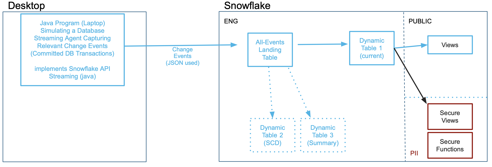

This is the same type of stream ingestion typically created by a processing Change-Data-Capture agents that parsing the transaction logs of a database or from event notification mechanisms in modern application.  However, this could be simulating any type of stream, in any industry.  This streaming ingestion use case was modeled similarly to one previously handled with Snowflake's Kafka Connector, but no Kafka is necessary for this use case as a Snowpipe Streaming client can enable replacing the Kafka middleware infrastucture and saving the cost & complexity.  Once landed, Dynamic Tables are purpose-built Snowflake objects for Data Engineering.

### The Use Case
Our Source 'database' has stock trades for the Dow Jones Industrials, [30 US stocks](https://www.nyse.com/quote/index/DJI) that on average trade 200M-400M executed trades per day.  Our agent will be capturing Limit Order transaction events for these 30 stocks:  new orders, updates to orders (changes in quantity or limit price), and cancelled orders.  There is an estimated 3 new orders for every 2 updates, and then one cancellation.  Our appication will be simulating this datastream which will be first reproduce a heavy workload of an initial market opening session and secondly a more modest continuous flow.  Snowflake data consumers want to see three perspectives on limit orders: what is the "current" list of orders that filters out stale and cancelled orders, a historical table showing every event on the source (traditional slowly changing dimension format), and current orders summarized by stock ticker symbol and by long or short position.  Latency needs to be minimized, 1-2 minutes would be ideal for the end-to-end process.

While not covered in this exercise, more Snowflake capabilities can further enrich your incoming data using Snowflake Data Marketplace data, train and deploy machine learning models, perform fraud detection, and other use cases.  The Lab was to introduce you to how this making real-time ingestion and processing easier and more scalable than ever before.


### Prerequisites
- Familiarity with Snowflake, basic SQL knowledge, using your desktop command line and executing a java program
- Have a Java JRE/JDK Runtime environment on your laptop/desktop (confirm by running "java -version" showing v11 or higher)

### What You’ll Learn
- Create Private & Public keyfiles and using them for [keypair authentication](https://docs.snowflake.com/en/user-guide/key-pair-auth.html) into Snowflake
- Introduction to Snowpipe Streaming Java API, with a sample client and JSON-format datastream generator
- Ingest real-time semi-structured data into Snowflake and store as Variant datafield
- Create Dynamic Tables to do in-Snowflake ELT processing easier than ever before 
- How to perform field-level [AES](https://en.wikipedia.org/wiki/Advanced_Encryption_Standard)-based data encryption at-the-source for security but governance controls for those authorized

### What You’ll Need 
To complete this Quickstart, attendees need the following:

- A [Snowflake Enterprise Account on your preferred AWS region](https://signup.snowflake.com/) with **ACCOUNTADMIN** access or setup assistance
- Be able to download a SQL and a Zip file
- Be able to run "keytool" command on your desktop (a utility included with Java)
- Be able to run a Java program from the command line on your desktop (OpenJDK is fine, built and tested on v11)

### What You’ll Build 
- User and Roles to control authentication and security
- A Snowflake database that contains all data and objects built in this lab
- A Landing/Staging table to initially land your incoming data stream
- Analytics-Ready Dynamic Tables
- Secure Functions for decrypting sensitive fields
- Secure Views to distribute data to various audiences

<!-- ------------------------ -->
## Setting up Snowflake
Duration: 5

### a) Download
The first thing you will need to do is download the following two files.  The first is a ZIP file you need to extract to a directory (for example C:/SnowflakeQuickstarts) that is the streaming simulator client.  The second file contains a series of SQL commands to execute in Worksheets throughout this lab **Click the green buttons to access the page to download the files**


<button>[CDCSimulatorApp.zip](https://sfquickstarts.s3.us-west-1.amazonaws.com/data_engineering_CDC_snowpipestreaming_dynamictables/CDCSimulatorApp.zip)</button> (Click Download)

<button>[Data_Engineering_Streams_CDC_DT_VHOL.sql](https://github.com/Snowflake-Labs/sfquickstarts/blob/32fc9d8c26674f520cb894577e181dcfaeb7c7df/site/sfguides/src/data_engineering_CDC_SnowpipeStreaming_DynamicTables/files/Data_Engineering_Streams_CDC_DT_VHOL.sql)</button> (Click Raw, then from your browser, use "Save Page As")

### b) Login
At this point login into your Snowflake account. If you have just created a free trial account, feel free to minimize or close and hint boxes that are looking to help guide you. These will not be needed for this lab and most of the hints will be covered throughout the remainder of this exercise.

### c) Create a Worksheet
In the Snowflake UI click on **Worksheets** on the left side.   
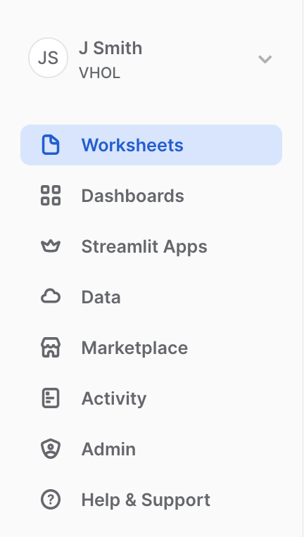

Create a new Worksheet by clicking on the ** ... ** button on the top right side and click **Create Worksheet from SQL File**.    
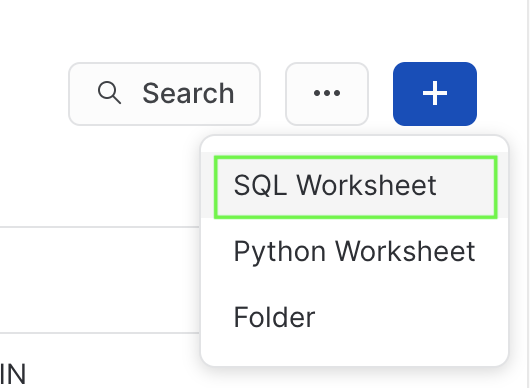

You can now select the .sql file you downloaded and named earlier called **Data_Engineering_Streams_CDC_DT_VHOL.sql**.

Each step throughout the Snowflake portion of the guide has an associated SQL command to perform the work we are looking to execute, and so feel free to step through each action running the code one command at-a-time as you walk through the lab.

### d) Set your Role
Finally, switch to the ACCOUNTADMIN role.  If you just created an evaluation account to go through this Lab, this should be easy.  However, if you are using an established account and find this role missing from your list, you may need assistance to complete the next few steps.  Creating a Role, Database, Stages, Tasks, and monitoring tasks executed by 'System' requires higher-level permissions.    
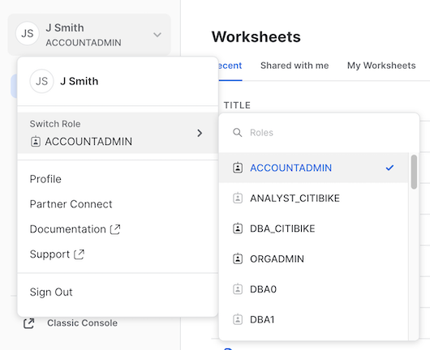

<!-- ------------------------ -->
## Setting up Your Desktop
Duration: 10

### a) Unzip and Prepare Java Client
Find where you downloaded your ZIP-compressed client application in step 2a), for example C:/SnowflakeQuickstarts.  Extract file **CDCSimulatorApp1.zip** file which will create a CDCSimulatorApp directory and many files within.  The second file, **DCSimulatorApp2.zip** file only contains two additional JAR files, which are needed to be extracted into the CDCSimulatorApp directory (these are larger files, so needed to split into 2 ZIP files). Confirm these two JAR files are in CDCSimulatorApp directory/lib before proceeding (On MacOS you may need to move the files manually).


### b) Generate Public and Private Keys
From your desktop's Command Line / Terminal window, navigate to your working directory, then the directory extracted (CDCSimulatorApp) and run these two commands:
```
openssl genrsa 2048 | openssl pkcs8 -topk8 -inform PEM -out rsa_key.p8 -nocrypt
openssl rsa -in rsa_key.p8 -pubout -out rsa_key.pub
```
Open file rsa_key.pub with a simple text editor and be prepared to copy your key soon in step 3.e, which is everything in-between the "- - - -" lines

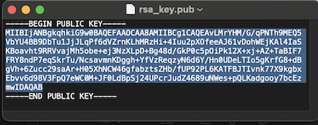

(Yes, there will be carriage returns in the key, that is ok)

### c) Edit Properties File
You will need to edit the snowflake.properties file to match your Snowflake account name (two places):
```
user=vhol_streaming1
role=VHOL_CDC_AGENT
account=<My_Snowflake_Account>
warehouse=VHOL_CDC_WH
private_key_file=rsa_key.p8
host=<My_Snowflake_Account>.snowflakecomputing.com
database=VHOL_ENG_CDC
schema=ENG
table=CDC_STREAMING_TABLE
channel_name=channel_1
AES_KEY=O90hS0k9qHdsMDkPe46ZcQ==
TOKEN_KEY=11
DEBUG=FALSE
SHOW_KEYS=TRUE
NUM_ROWS=1000000
```

### d) Create a Dedicated Role and Limited Login for your Streaming Application
Return to your Snowflake worksheet and run (using Public Key generated and file opened in Step 3.c above):
```
create role if not exists VHOL_CDC_AGENT;
create or replace user vhol_streaming1 COMMENT="Creating for VHOL";
alter user vhol_streaming1 set rsa_public_key='<Paste Your Public Key Here>';
```

<!-- ------------------------ -->
## Begin Construction
Duration: 5
Create Foundational Snowflake Objects for this Hands-on Lab:

### a)  Create new roles for this Lab and grant permissions
```
use role ACCOUNTADMIN;
set myname = current_user();
create role if not exists VHOL;
grant role VHOL to user identifier($myname);
grant role VHOL_CDC_AGENT to user vhol_streaming1;

```
For the PII Section (Step #7):
```
create role if not exists PII_ADMIN;
grant role PII_ADMIN to user identifier($myname);
create role if not exists PII_ALLOWED;
grant role PII_ALLOWED to user identifier($myname);
```

### b)  Create a Dedicated Virtual Compute Warehouse
Size XS, dedicated for this Hands-on Lab
```
create or replace warehouse VHOL_CDC_WH WAREHOUSE_SIZE = XSMALL, AUTO_SUSPEND = 5, AUTO_RESUME= TRUE;
grant all privileges on warehouse VHOL_CDC_WH to role VHOL;
grant usage on warehouse VHOL_CDC_WH to role VHOL_CDC_AGENT; 
```
For the PII Section (Step #7):
```
grant usage on warehouse VHOL_CDC_WH to role PII_ADMIN;
grant usage on warehouse VHOL_CDC_WH to role PII_ALLOWED;
```

### c)  Create Database used throughout this Lab
```
create database VHOL_ENG_CDC;
use database VHOL_ENG_CDC;
grant ownership on schema PUBLIC to role VHOL;
revoke all privileges on database VHOL_ENG_CDC from role ACCOUNTADMIN;
grant ownership on database VHOL_ENG_CDC to role VHOL;
```


```
use role VHOL;
use database VHOL_ENG_CDC;
use warehouse VHOL_CDC_WH;
grant usage on database VHOL_ENG_CDC to role VHOL_CDC_AGENT;
create schema ENG;
grant usage on schema ENG to role VHOL_CDC_AGENT;
grant usage on database VHOL_ENG_CDC to role PUBLIC;
grant usage on schema PUBLIC to role PUBLIC;
```
### d)  Create a Staging/Landing Table
Where all incoming data will land initially.  Each row will contain a transaction, but JSON will be stored as a VARIANT datatype within Snowflake.
```
create or replace table ENG.CDC_STREAMING_TABLE (RECORD_CONTENT variant);
grant insert on table ENG.CDC_STREAMING_TABLE to role VHOL_CDC_AGENT;
select * from CDC_STREAMING_TABLE;
select count(*) from CDC_STREAMING_TABLE;
```

### e) Test your Application and Test Connection to Snowflake
Return to your desktop, and run the program "Test.sh" or "Test.bat" to confirm your setup is complete and ready for ingestion.
```
./Test.sh
```
or (for Microsoft Windows)
```
Test.bat
```
You should see this:

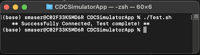

If you get any errors / exceptions, read the error message closely and ask for help.  As this application is running on your desktop, you may be missing a prerequisite, have an older version of Java, have too restrictive user profile, or many other reasons.

## Streaming Records!
Duration: 15

### a)  Run Streaming Application

**You are now ready to Stream data into Snowflake!** 
Execute the Streaming Simulator using 'Run_MAX.sh', which will stream 1,000,000 records as fast as your desktop can run (MAX will also be in the Channel name):
```
./Run_MAX.sh
```
or (for Microsoft Windows)
```
Run_MAX.bat
```
Which returns:  
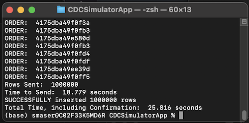

This should take 20-30 seconds.

### b)  View New Records in Snowflake
Just like that, in a few seconds, you have 1M records in Snowflake (single-row inserts!)
```
select count(*) from ENG.CDC_STREAMING_TABLE;
select * from CDC_STREAMING_TABLE limit 100;
```
Each record is a JSON payload, received via Snowpipe Streaming Ingestion API and stored in Snowflake as a Variant datafield.

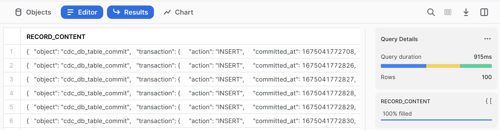

Next run 2 queries, using Snowflake's semi-structured capability, to show our new records and part of the query we will use in our Dynamic Tables before proceeding:
```
select RECORD_CONTENT:transaction:primaryKey_tokenized::string as orderid from ENG.CDC_STREAMING_TABLE limit 10;
```

```
select
    RECORD_CONTENT:transaction:primaryKey_tokenized::varchar as orderid_tokenized,
    RECORD_CONTENT:transaction:record_after:orderid_encrypted::varchar as orderid_encrypted,
    RECORD_CONTENT:transaction:action::varchar as action,
    RECORD_CONTENT:transaction:committed_at::varchar as committed_at,
    RECORD_CONTENT:transaction:dbuser::varchar as dbuser,
    RECORD_CONTENT:transaction:record_before::variant as before,
    RECORD_CONTENT:transaction:record_after::variant as after
  from ENG.CDC_STREAMING_TABLE
  where RECORD_CONTENT:transaction:action::varchar='INSERT' limit 1000;
  ```


### c)  But There is More Than One Table in My Source System
The CDC Agent could easily be capturing changes from more than one source table, lets prepare for that and write each dynamic table to only use the events received for our simulated Stock Limit Order stream.  These are the key fields to use:
```
select distinct RECORD_CONTENT:transaction:schema::varchar,RECORD_CONTENT:transaction:table::varchar from CDC_STREAMING_TABLE;
```

## Create Dynamic Tables
Duration: 15
Now that data is landed and ready for Data Engineering, many possiblities to process.  Here are three examples: 

### a)  The "Current State"
Create a more finished Dynamic Table sourcing from Landing Table that reflects the "CURRENT STATE" of the source table.  This pattern, for each source table, you create a Dynamic Table:
```
CREATE OR REPLACE DYNAMIC TABLE ENG.LIMIT_ORDERS_CURRENT_DT
LAG = '1 minute'
WAREHOUSE = 'VHOL_CDC_WH'
AS
SELECT * EXCLUDE (score,action) from (  
  SELECT
    RECORD_CONTENT:transaction:primaryKey_tokenized::varchar as orderid_tokenized,
    RECORD_CONTENT:transaction:record_after:orderid_encrypted::varchar as orderid_encrypted,
    TO_TIMESTAMP_NTZ(RECORD_CONTENT:transaction:committed_at::number/1000) as lastUpdated,
    RECORD_CONTENT:transaction:action::varchar as action,
    RECORD_CONTENT:transaction:record_after:client::varchar as client,
    RECORD_CONTENT:transaction:record_after:ticker::varchar as ticker,
    RECORD_CONTENT:transaction:record_after:LongOrShort::varchar as position,
    RECORD_CONTENT:transaction:record_after:Price::number(38,3) as price,
    RECORD_CONTENT:transaction:record_after:Quantity::number(38,3) as quantity,
    RANK() OVER (
        partition by orderid_tokenized order by RECORD_CONTENT:transaction:committed_at::number desc) as score
  FROM ENG.CDC_STREAMING_TABLE 
    WHERE 
        RECORD_CONTENT:transaction:schema::varchar='PROD' AND RECORD_CONTENT:transaction:table::varchar='LIMIT_ORDERS'
) 
WHERE score = 1 and action != 'DELETE';
```


If you run this right away, it will show zero.  You have to wait a bit for the Dynamic Table to be built
```
SELECT count(*) FROM LIMIT_ORDERS_CURRENT_DT;
```
-- Wait for Lag Period (1 minute)
```
SELECT count(*) FROM LIMIT_ORDERS_CURRENT_DT;
```

### Streaming Data is not Static Data
Let's work with dynamic data going forward, return to your desktop to provide a continuous stream.  Run this command and the application will be streaming 10 records/second until you stop the application (using Cntrl-C in your command/shell window).  If you want more volume, run the "Run_Sloow" for 100/second or "Run_Slow" for 1000/second stream rate, Snowflake will absorb these easily too.  But simulator is designed to run only one of these at a time (channel name is configured in property file).
```
./Run_Slooow.sh
```
or (for Microsoft Windows)
```
Run_Slooow.bat
```


### b) Slowly Changing Dimensions (SCD) Example
First table is great, but we want to analyze how orders/records have changed and keep a historical record.  Let's do that by adding additional fields to each record to track and group them together:
```
CREATE OR REPLACE DYNAMIC TABLE ENG.LIMIT_ORDERS_SCD_DT
LAG = '1 minute'
WAREHOUSE = 'VHOL_CDC_WH'
AS
SELECT * EXCLUDE score from ( SELECT *,
  CASE when score=1 then true else false end as Is_Latest,
  LAST_VALUE(score) OVER (
            partition by orderid_tokenized order by valid_from desc)+1-score as version
  FROM (  
      SELECT
        RECORD_CONTENT:transaction:primaryKey_tokenized::varchar as orderid_tokenized,
        --IFNULL(RECORD_CONTENT:transaction:record_after:orderid_encrypted::varchar,RECORD_CONTENT:transaction:record_before:orderid_encrypted::varchar) as orderid_encrypted,
        RECORD_CONTENT:transaction:action::varchar as action,
        IFNULL(RECORD_CONTENT:transaction:record_after:client::varchar,RECORD_CONTENT:transaction:record_before:client::varchar) as client,
        IFNULL(RECORD_CONTENT:transaction:record_after:ticker::varchar,RECORD_CONTENT:transaction:record_before:ticker::varchar) as ticker,
        IFNULL(RECORD_CONTENT:transaction:record_after:LongOrShort::varchar,RECORD_CONTENT:transaction:record_before:LongOrShort::varchar) as position,
        RECORD_CONTENT:transaction:record_after:Price::number(38,3) as price,
        RECORD_CONTENT:transaction:record_after:Quantity::number(38,3) as quantity,
        RANK() OVER (
            partition by orderid_tokenized order by RECORD_CONTENT:transaction:committed_at::number desc) as score,
        TO_TIMESTAMP_NTZ(RECORD_CONTENT:transaction:committed_at::number/1000) as valid_from,
        TO_TIMESTAMP_NTZ(LAG(RECORD_CONTENT:transaction:committed_at::number/1000,1,null) over 
                         (partition by orderid_tokenized order by RECORD_CONTENT:transaction:committed_at::number desc)) as valid_to
      FROM ENG.CDC_STREAMING_TABLE
      WHERE 
            RECORD_CONTENT:transaction:schema::varchar='PROD' AND RECORD_CONTENT:transaction:table::varchar='LIMIT_ORDERS'
    ))
;
```

Run some test queries against our new dynamic table
```
select  count(*) from LIMIT_ORDERS_SCD_DT;
```
wait the lag period (~ 1 minute)
```
select  * from LIMIT_ORDERS_SCD_DT  limit 1000;
```
(Note, you should see more than the 1,000,000 initial records we loaded)
```
select  count(*) from LIMIT_ORDERS_SCD_DT;
```


### c)  Aggregations / Summary Example 
Let's try some aggregations for a Dynamic Table optimized for a specific use case.  This table summarizes by Stock and Order Type / Position:
```
CREATE OR REPLACE DYNAMIC TABLE ENG.LIMIT_ORDERS_SUMMARY_DT
LAG = '1 minute'
WAREHOUSE = 'VHOL_CDC_WH'
AS
SELECT ticker,position,min(price) as MIN_PRICE,max(price) as MAX_PRICE, TO_DECIMAL(avg(price),38,2) as AVERAGE_PRICE,
    SUM(quantity) as TOTAL_SHARES,TO_DECIMAL(TOTAL_SHARES*AVERAGE_PRICE,38,2) as TOTAL_VALUE_USD
from (  
  SELECT
    RECORD_CONTENT:transaction:action::varchar as action,
    RECORD_CONTENT:transaction:record_after:ticker::varchar as ticker,
    RECORD_CONTENT:transaction:record_after:LongOrShort::varchar as position,
    RECORD_CONTENT:transaction:record_after:Price::number(38,3) as price,
    RECORD_CONTENT:transaction:record_after:Quantity::number(38,3) as quantity
  FROM ENG.CDC_STREAMING_TABLE
  WHERE 
        RECORD_CONTENT:transaction:schema::varchar='PROD' AND RECORD_CONTENT:transaction:table::varchar='LIMIT_ORDERS'
  QUALIFY RANK() OVER (
        partition by RECORD_CONTENT:transaction:primaryKey_tokenized::varchar order by RECORD_CONTENT:transaction:committed_at::number desc) = 1
) 
WHERE action != 'DELETE' group by ticker,position order by position,TOTAL_VALUE_USD DESC
;
```
(We know to wait)
```
select * from LIMIT_ORDERS_SUMMARY_DT where position='LONG' order by TOTAL_VALUE_USD;;
```

We are tracking the 30 Dow Jones Industrial Average Stocks (both Long and Short Limit Orders)
```
select  count(*) from LIMIT_ORDERS_SUMMARY_DT; 
```

### d) Monitoring Dynamic Tables

First, lets look at the properties page for a Dynamic Table, from the left-side menu, navigate to "Data, Databases>VHOL_ENG_CDC, ENG schema, Dynamic Tables" and click one of the Dynamic Tables you created.  

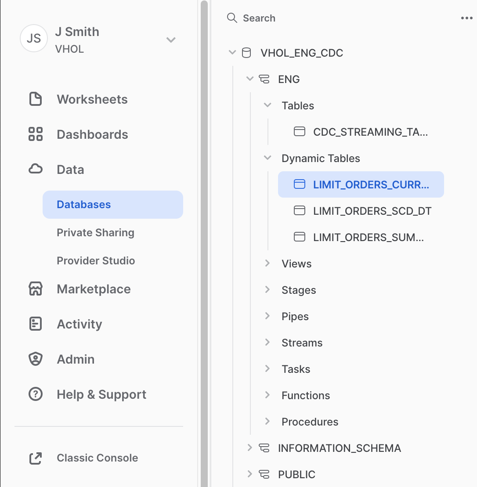

You will see four tabs (Table Details, Columns, Data Preview, Refresh History).  Click on Refresh History:

 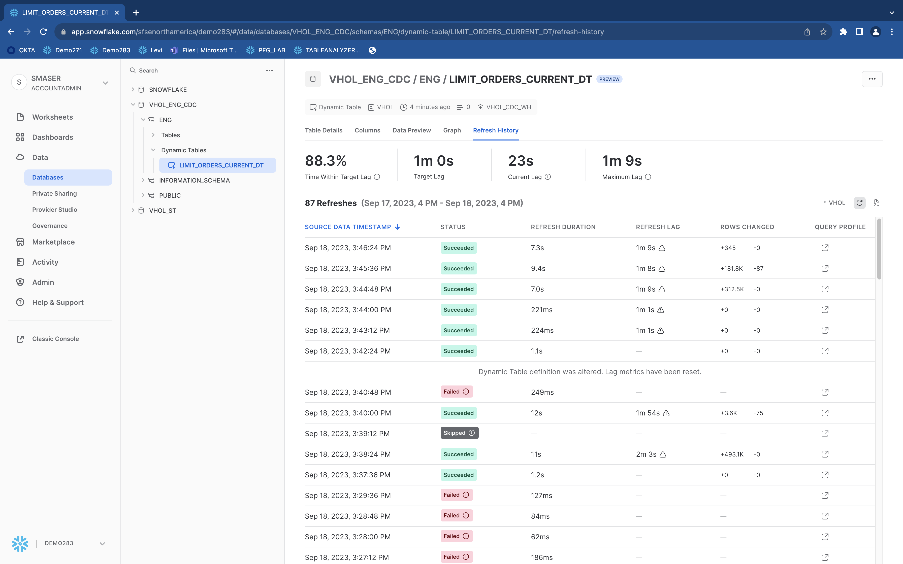

Can also leverage Query History, a more account-wide administrative view, from the left side menu, click Activity>Query History:

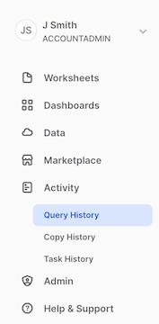 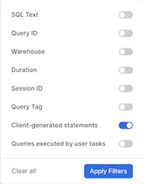

and utilize the filters at the top.  Remove user filter, as these refresh actions are performed by user "SYSTEM".  With Filter, enable the "Client-generated statements" to see the all dynamic table refresh activation events.  Can filter to a specific table by utilizing the "SQL Text", entering a Dynamic Table name's name, for example: "ENG.LIMIT_ORDERS_CURRENT_DT".
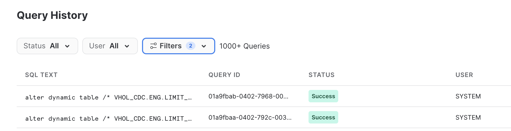

(Return to your Worksheet)

 ### e) Monitor Landing Table Channels
Specifically the offset token identifying the source's indicator of the last successfully-committed row identifier.  If there ever was an error on the source agent, this is the restart point.
```
show channels in table ENG.CDC_STREAMING_TABLE;
```
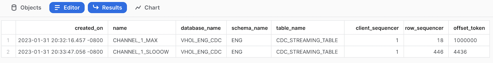


### f) Deliver to Consumers

This data is now ready for public use!  To create access for users to consume, lets use views to allow access (note, JSON path syntax not seen or needed except from landing table).
For our "Current View" Table:
```
create or replace view PUBLIC.CURRENT_LIMIT_ORDERS_VW
  as select orderid_tokenized, lastUpdated,client,ticker,position,quantity,price
  FROM ENG.LIMIT_ORDERS_CURRENT_DT order by orderid_tokenized;

grant select on view PUBLIC.CURRENT_LIMIT_ORDERS_VW to role PUBLIC;
```
No need to wait
```
select * from PUBLIC.CURRENT_LIMIT_ORDERS_VW limit 1000;
```
Note:  No reason to show consumers the encrypted orderid value

**Congrats, your consumers are able to view and analyze Limit Orders!**  
### Bonus:
Feel free to create views for the other two dynamic tables.


## Handling PII/Sensitive Data
Duration: 15

This section will enable authorized users to utilize the orderid value, which was an encrypted-at-the-source field.  Next steps will create roles to assign to authorized users, a secure function to decrypt that value and the means to do so, and secondly create a secure view that adds the orderid as an unencypted value.  Within the Source Stream generator, there is two secure data fields added to protect the orderid value.  First is an AES-encryption method (reversible) and secondly a tokenization method (irreversible but repeatable to maintain referential integrity with other source tables).  Note:  These are not production-quality reusable security assets, but are for demonstration purposes.

### a)  Setup Database for PII Assets
Create PII schema and provide Grants to the PII roles.
```
use role VHOL;
use database VHOL_ENG_CDC;
grant ownership on schema PII to role PII_ADMIN;
grant usage on database VHOL_ENG_CDC to role PII_ADMIN;
grant usage on database VHOL_ENG_CDC to role PII_ALLOWED;
grant usage on schema ENG to role PII_ADMIN;
grant usage on schema ENG to role PII_ALLOWED;
--grant select on dynamic table ENG.LIMIT_ORDERS_CURRENT_DT to role PII_ADMIN;
grant select on dynamic table ENG.LIMIT_ORDERS_CURRENT_DT to role PII_ALLOWED;
create or replace schema PII COMMENT='Stay Out - Authorized Users Only';
revoke all privileges on schema VHOL_ENG_CDC.PII from role VHOL;
grant ownership on schema VHOL_ENG_CDC.PII to role PII_ADMIN;
```
### b)  Become PII Admin
Right click on the "House" icon and click "Open in new Window".

Click on Worksheets, and "+" on upper right to create a new worksheet (Same as we started this Lab).
(While you could copy all this into one worksheet, the PII Admin is usually not the same person as a Data Engineer)
```
use role PII_ADMIN;
use schema VHOL_ENG_CDC.PII;
use warehouse VHOL_CDC_WH;
```

### c)  Reusable Decryption Secure Function
Need to have a function that can decrypt the value (you may want to create your own internal or external secure function, this is just an example). 
For consistency with the source encryption, using a java UDF to decrypt the data fields over built-in functions or Python UDF.
Here is the first UDF:
```
CREATE OR REPLACE SECURE FUNCTION PII._DECRYPT_AES(FIELD string, ENCRYPTIONKEY string)
RETURNS VARCHAR 
LANGUAGE JAVA
HANDLER = 'Decrypt.decryptField'
AS
$$;
import java.security.Key;
import java.util.Base64;
import javax.crypto.Cipher;
import javax.crypto.KeyGenerator;
import javax.crypto.spec.SecretKeySpec;
import java.nio.charset.StandardCharsets;

class Decrypt {
    private static final String ALGORITHM = "AES";
    private Key KEY;
    private KeyGenerator KEYGENERATOR;
    private Cipher CIPHER;
    public Decrypt() throws Exception{
        CIPHER = Cipher.getInstance(ALGORITHM);
    }
    public String decryptField(String field, String encryptionKey) {
        try {
            setKey(encryptionKey);
            CIPHER.init(Cipher.DECRYPT_MODE, KEY);
            byte[] decodedBytes=CIPHER.doFinal(Base64.getDecoder().decode(field));
            return new String(decodedBytes, StandardCharsets.UTF_8);
        }
        catch (Exception ex){
            return ex.getMessage();
        }
  }
  public void setKey(String k) throws Exception {
        byte[] k0 = new String(k.toCharArray()).getBytes(StandardCharsets.UTF_8);
        SecretKeySpec secretKey = new SecretKeySpec(k0,ALGORITHM);
        KEY=secretKey;
  }
}
$$;
```
Test this new Function
```
grant usage on function PII._DECRYPT_AES(string,string) to role PII_ADMIN;
select PII._DECRYPT_AES('NhVcyJa8/r3Wdy6WNvT0yQw+SouNYGPAy/ddVe6064Y=', 'O90hS0k9qHdsMDkPe46ZcQ==') as orderid;
```


### d)  This Pipeline's Decryption Secure Function
For simplicity of this Lab, we will store the decryption key in a dedicated function, but ideally this is stored in a secrets vault.
```
CREATE OR REPLACE SECURE FUNCTION PII.DECRYPT_CDC_FIELD(FIELD string)
RETURNS VARCHAR 
 as
 $$ 
 select PII._DECRYPT_AES(FIELD, 'O90hS0k9qHdsMDkPe46ZcQ==')
 $$;
```
Grant usage and test
```
 grant usage on function PII.DECRYPT_CDC_FIELD(varchar) to role PII_ADMIN;
 select PII.DECRYPT_CDC_FIELD('NhVcyJa8/r3Wdy6WNvT0yQw+SouNYGPAy/ddVe6064Y=');
```
Ok, it works.  Access no longer required.
```
 revoke usage on function PII.DECRYPT_CDC_FIELD(varchar) from role PII_ADMIN;
```

### e) Create Secure View
```
Create or replace secure view PII.LIMIT_ORDERS_VW
as 
  select orderid_tokenized,orderid_encrypted,
    PII.DECRYPT_CDC_FIELD(orderid_encrypted) as orderid_PII,
    lastUpdated,client,ticker,position,price,quantity
  from ENG.LIMIT_ORDERS_CURRENT_DT order by orderid_PII;
```
Grant usage to PII User Role
```
grant usage on schema PII to role PII_ALLOWED;
grant usage on function PII._DECRYPT_AES(string,string) to role PII_ALLOWED;
grant usage on function PII.DECRYPT_CDC_FIELD(varchar) to role PII_ALLOWED;
grant select on view PII.LIMIT_ORDERS_VW to role PII_ALLOWED;
```

### f)  Be PII-Enabled
```
use role PII_ALLOWED;
use database VHOL_ENG_CDC;
select * from PII.LIMIT_ORDERS_VW order by ORDERID_PII limit 1000;
select * from PII.LIMIT_ORDERS_VW where ticker='MMM' and position='LONG' order by ORDERID_PII;
select * from PII.LIMIT_ORDERS_VW limit 1000;
```
You can now see the ORDERID in three forms:  Tokenized, Encrypted, and Decrypted.  But only if you have a role for PII.

Snowflake's Granular, Role-Based Access enables you to control who has access to what, at the database/schema, table, column, and row level as you need!
Dynamic Masking and tagging will be more layers of security available soon, but not included or enabled in this preview.


## Final Steps & Cleanup
Duration: 2
### a) Use Cntrl-C to kill your Streaming App running on your Desktop

### b) See how many transactions you have processed
```
use role VHOL;
select count(*) from ENG.CDC_STREAMING_TABLE;
```

### c) Remove & Cleanup Desktop Directory created for this Streaming Application

### d) Drop Database, removing all objects created by this Hands-on Lab (Optional) 
```
drop database VHOL_ENG_CDC;
```

### e) Drop Warehouse (Optional)
```
use role ACCOUNTADMIN;
drop warehouse VHOL_CDC_WH;
```

### f) Drop Role (Optional)
```
use role ACCOUNTADMIN;
drop role VHOL;
drop role VHOL_CDC_AGENT;
drop role PII_ADMIN;
drop role PII_ALLOWED;
```

## Conclusion
Duration: 2

**Congratulations, you have completed this Lab!**


### What We Covered
- Setup keypair authentication into Snowflake
- Used Snowpipe Streaming Java API and streamed data into Snowflake
- Ingested Semi-Structured JSON data into Snowflake in real-time instead of bulk loading
- Created Multiple Dynamic Tables for Data Engineering Tasks
- Secured Sensitive Fields, beginning from the Source, but also decrypted for those authorized


### Related Resources
**(Will be available once these capabilities move to Public Preview)**
