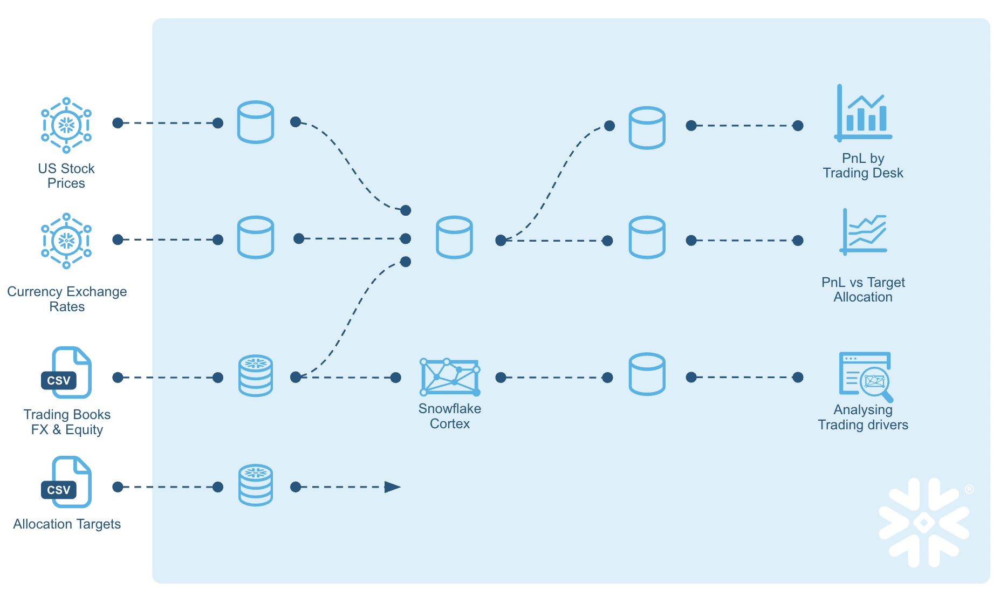
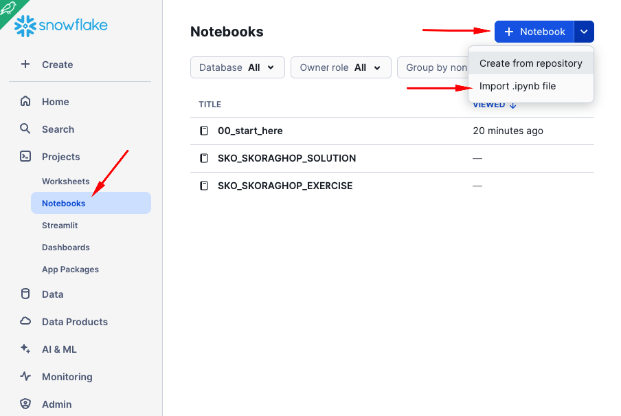
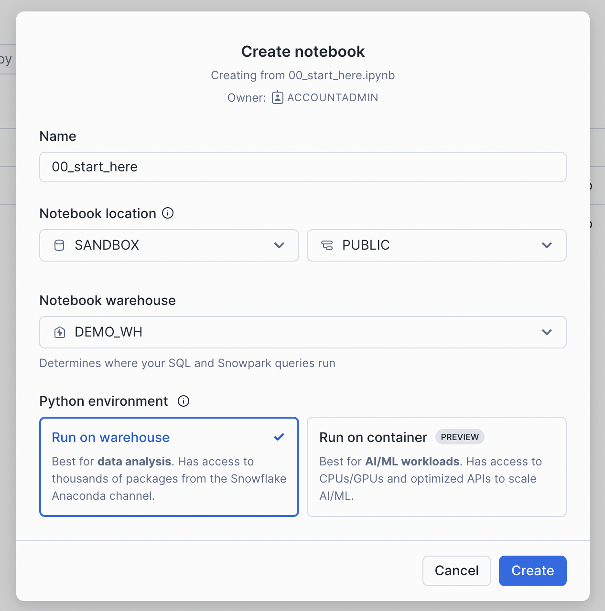
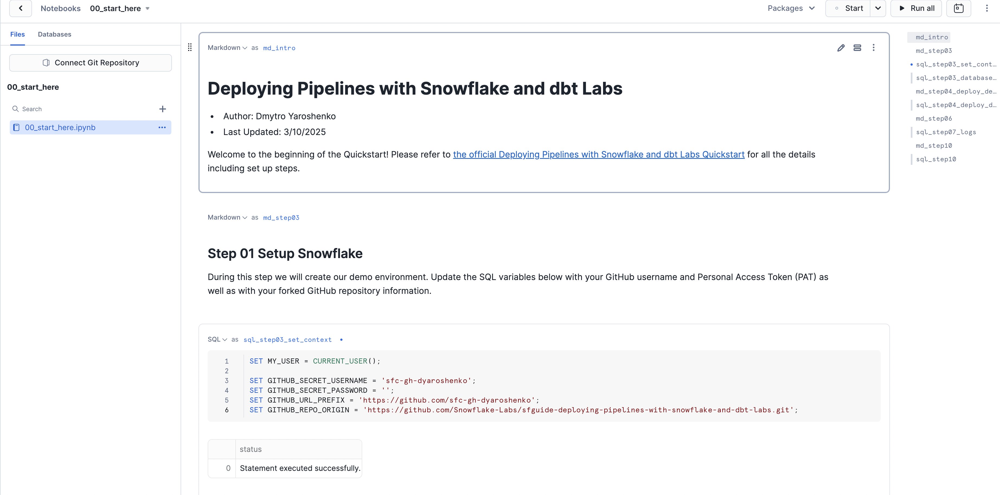
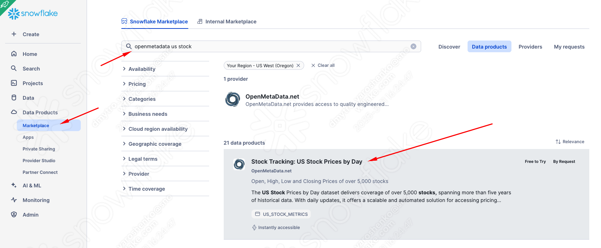
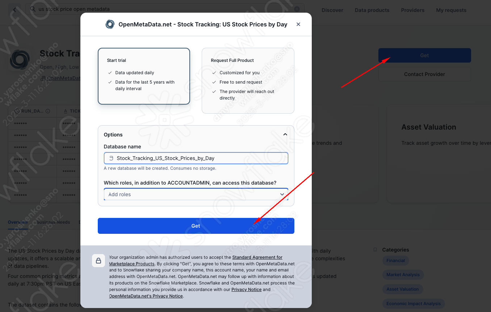
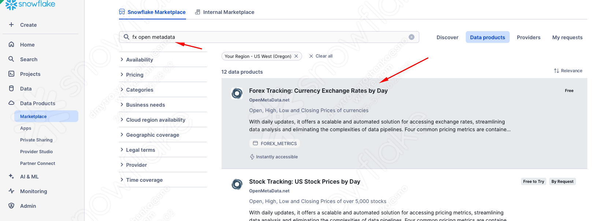
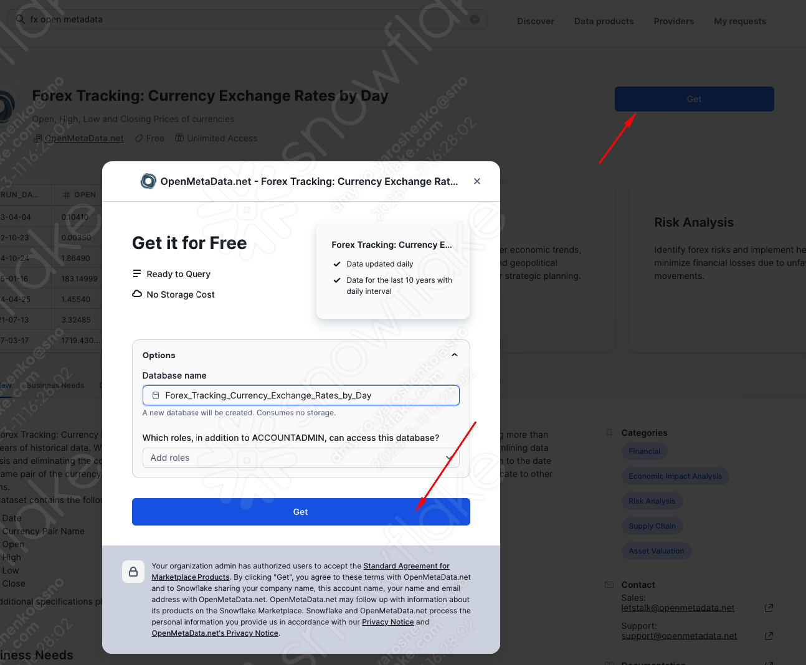
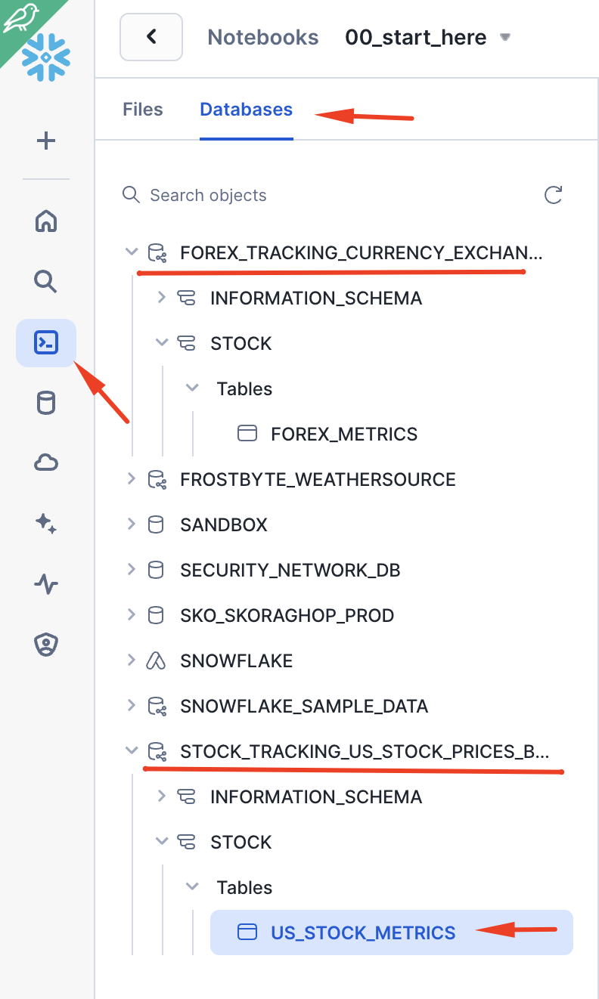

authors: Dmytro Yaroshenko
id: data_engineering_deploying_pipelines_with_snowflake_and_dbt_labs
summary: This guide will provide step-by-step details for building and deploying data engineering pipelines with Snowflake and dbt labs
categories: featured,data-engineering,notebooks
environments: web
status: Published 
feedback link: https://github.com/Snowflake-Labs/sfguides/issues
tags: Data Engineering, Notebooks, dbt

# Deploying pipelines with Snowflake and dbt labs
<!-- ------------------------ -->
## Overview 
Duration: 10

### Introduction  

Modern businesses require data strategies that support agility, scalability, and operational efficiency.  

### Why Snowflake?  
[Snowflake](https://www.snowflake.com/) is a powerful Data Cloud that allows you to build data-intensive applications without the operational overhead. Unique architecture and years of innovation made Snowflake the best platform for mobilizing data in your organization.  

### Why dbt?  
[dbt](https://www.getdbt.com/) (Data Build Tool) is a transformation workflow that empowers teams to develop analytics code using best practices from software engineering—such as modularity, portability, CI/CD, and documentation. With dbt, anyone proficient in SQL can create production-ready data pipelines, transforming data directly within cloud data platforms like Snowflake.  

### What You’ll Learn
* How to build and deploy pipelines using dbt and Snowflake
* How to change materialization options to achieve your goals
* How to benefit from recent Snowflake innovations, in particular Dynamic Tables
* How to upload data via SnowSight UI
* How to access data from Snowflake Marketplace and use it for your analysis
* How to use Snowflake Notebooks to deploy environment changes
* How to use Snowflake DevOps features, including CREATE OR ALTER
* How to execute SQL scripts from your Git repository directly in Snowflake
* How to build CI/CD pipelines using Snowflake's Git Integration

### What You'll Build

Build a **Snowflake + dbt** data pipelines to:  
- Analyze trading **P&L** and normalize multi-currency trades  
- Extract insights using **LLMs** from trader execution notes  
- Compare actual P&L to portfolio targets  

#### Data Sources  

**Snowflake Marketplace Sources**  
- **FX rates** – Foreign exchange rates for currency normalization  
- **US equity trading price history** – Historical price data for US equities  

**Manual Datasets**  
- **Trading history** – Records of executed trades  
- **Target allocation ratios** – Portfolio targets for FX and equity allocations  

#### Key Objectives  

- **Calculate deal desk P&L** across multiple currencies  
- **Blend trading data with portfolio targets** to assess performance  
- **Analyze trader decision-making** using LLMs on trade execution notes  

Here's a quick visual overview of what we'll accomplish in this Quickstart:




### Prerequisites
* Familiarity with dbt
* Familiarity with Snowflake
* Familiarity with Git repositories and GitHub

### What You’ll Need
You will need the following things before beginning:

* Snowflake account
    * **A Snowflake Account**. Visit the [Snowflake Account Sign In](https://app.snowflake.com/) page to log into your account or to sign up for a trial account.
    * **A Snowflake user created with ACCOUNTADMIN permissions**. This user will be used to get things setup in Snowflake.
    * **Anaconda Terms & Conditions accepted**. See Getting Started section in [Third-Party Packages](https://docs.snowflake.com/en/developer-guide/udf/python/udf-python-packages.html#getting-started).
* GitHub account
    * **A GitHub account**. If you don't already have a GitHub account you can create one for free. Visit the [Join GitHub](https://github.com/signup) page to get started.

Let's get started! 🚀  

<!-- ------------------------ -->
## Quickstart Setup
Duration: 15

### Create a GitHub Personal Access Token
In order for Snowflake to authenticate to your GitHub repository, you will need to generate a personal access token. Please follow the [Creating a personal access token](https://docs.github.com/en/authentication/keeping-your-account-and-data-secure/managing-your-personal-access-tokens#creating-a-personal-access-token-classic) instructions to create your token.

Make sure to save the token before leaving the page, as we will be using it a couple of times during this Quickstart.

### Clone the Quickstart Repository
You'll need to create a local clone of the repository for this Quickstart from your GitHub account. Visit the [Deploying Pipelines with Snowflake and dbt labs](https://github.com/Snowflake-Labs/sfguide-deploying-pipelines-with-snowflake-and-dbt-labs) and click on the "Code" button near the top right. 

```shell
gh repo clone Snowflake-Labs/sfguide-deploying-pipelines-with-snowflake-and-dbt-labs
```

### Import the notebook
Some steps in this quickstart will be initiated from **Snowflake Notebooks** for transparency. In a real-world scenario, these steps would typically be part of your codebase and executed using the [Snowflake CLI](https://docs.snowflake.com/en/developer-guide/snowflake-cli/index) and/or **GitHub Actions**.  



Pick `00_start_here.ipynb` that is in the root folder of the cloned repository. 



Once imported, it should look like this. **Congratulations! The first step is complete!** 🎉  




### Configure local dbt environment
In the repository you just checked out, there is a `./dbt_project` folder containing pre-built dbt pipelines. In `./dbt_project/dbt_project.yml`, you can see that the project expects to find a connection profile called `dbt_project`, which it will use later to access your Snowflake environment.

Let's open `~/.dbt/profiles.yml` and add the following content. (Note: You will need to update the configuration with your Snowflake account locator and password for the dbt_hol_user.)

```yml
dbt_project:
  outputs:
    dev:
      account: your_snowflake_account_locator
      database: dbt_hol_2025_dev
      password: your_snowflake_user_password
      role: dbt_hol_role_dev
      schema: public
      threads: 100
      type: snowflake
      user: dbt_hol_user
      warehouse: vwh_dbt_hol_dev
    prod:
      account: your_snowflake_account_locator
      database: dbt_hol_2025_prod
      password: your_snowflake_user_password
      role: dbt_hol_role_prod
      schema: public
      threads: 100
      type: snowflake
      user: dbt_hol_user
      warehouse: vwh_dbt_hol_prod
  target: dev
```
As you can see, we are setting up two targets: **dev** and **prod**, with **dev** as the default.
For more info on configuring your local dbt profiles configuration please refer to the [docs](https://docs.getdbt.com/docs/core/connect-data-platform/profiles.yml).

<!-- ------------------------ -->
## Access Data Products in Snowflake Marketplace
Duration: 10

Now, let's get access to the datasets we can work with. **Snowflake Marketplace** makes this process very easy. There are thousands of well-curated, ready-to-use data products (as well as Native apps and models) right at your fingertips. In this quickstart, we will onboard two datasets, both of which are free/free-to-try as a trial:

### US equity trading price history



### FX rates



### Validate
Great! So easy. Now, if we go back to the notebook we uploaded and click **'Databases'**, we can see two new databases with tables shared with our account by the provider. No ETL, no latency, no extra storage, and as performant as if they were in your account.  



With that, let's move on to the next step 🚀 

<!-- ------------------------ -->
## Create development environment
Duration: 5

During this step we will be deploying the dev versions of our two data engineering Notebooks: `DEV_06_load_excel_files` and `DEV_07_load_daily_city_metrics`. For this Quickstart you will notice that our main data engineering Notebooks will be named with a prefix for the environment label, like `DEV_` for dev and `PROD_` for prod. A full discussion of different approaches for managing multiple environments with Snowflake is out of scope for this Quickstart. For a real world use case, you may or may not need to do the same, depending on your Snowflake set up.

To put this in context, we are on step **#4** in our data flow overview:


### Git in Snowsight
When you ran the setup cells in the `00_start_here.ipynb` Notebook in the previous step, you created a Git Integration in Snowflake for your forked GitHub repository! Please see [Using a Git repository in Snowflake](https://docs.snowflake.com/en/developer-guide/git/git-overview) for more details.

You can browse your Git repository in Snowsight, by using our Snowsight Git integration features. To do that, click on "Data" -> "Databases" in the left navigation. Then click on "DEMO_DB" database, then "INTEGRATIONS" schema, then "Git Repositories" and finally "DEMO_GIT_REPO". You will see the details and content of your Git repository in Snowsight. You can change branches and browse the files in the repo by clicking on the folder names to drill down.

### Deploy Notebooks
Scroll down to the "Step 04 Deploy to Dev" section of the `00_start_here.ipynb` Notebook and run the Python cell there. This cell will deploy both the `06_load_excel_files` and `07_load_daily_city_metrics` Notebooks to our `DEV_SCHEMA` schema (and will prefix both workbook names with `DEV_`).

### EXECUTE IMMEDIATE FROM with Jinja Templating
The [EXECUTE IMMEDIATE FROM](https://docs.snowflake.com/en/sql-reference/sql/execute-immediate-from) command is very powerful and allows you to run an entire SQL script directly from Snowflake. And you'll notice here that we executing a SQL script directly from the `main` branch of our Git repo (`@DEMO_GIT_REPO/branches/main`). At this point please review the contents of the `scripts/deploy_notebooks.sql` script in your forked repo to see what we just executed.

Also, please note that the `scripts/deploy_notebooks.sql` script also includes Jinja Templating. Jinja templating allows us to parameterize this script so we can run the same core logic in each environment! You will see later in step 9 that we will call this same script from our GitHub Actions pipeline in order to deploy these Notebooks to production.

<!-- ------------------------ -->
## Upload manual sources
Duration: 2

Once you're finished with the Quickstart and want to clean things up, toggle back to the `00_start_here` Notebook and scroll down to the "Step 10 Teardown" section. Then just run the SQL commands in the `sql_step10` cell to remove all the objects created during the Quickstart.

Finally, you can delete the `00_start_here` Notebook. With the Notebook open click on the ":" button near the top right of the window and click on "Delete".

<!-- ------------------------ -->
## Deploy dev pipelines
Duration: 2

Once you're finished with the Quickstart and want to clean things up, toggle back to the `00_start_here` Notebook and scroll down to the "Step 10 Teardown" section. Then just run the SQL commands in the `sql_step10` cell to remove all the objects created during the Quickstart.

Finally, you can delete the `00_start_here` Notebook. With the Notebook open click on the ":" button near the top right of the window and click on "Delete".

<!-- ------------------------ -->
## Change materializations
Duration: 2

Once you're finished with the Quickstart and want to clean things up, toggle back to the `00_start_here` Notebook and scroll down to the "Step 10 Teardown" section. Then just run the SQL commands in the `sql_step10` cell to remove all the objects created during the Quickstart.

Finally, you can delete the `00_start_here` Notebook. With the Notebook open click on the ":" button near the top right of the window and click on "Delete".

<!-- ------------------------ -->
## Change materializations: Dynamic Tables
Duration: 2

Once you're finished with the Quickstart and want to clean things up, toggle back to the `00_start_here` Notebook and scroll down to the "Step 10 Teardown" section. Then just run the SQL commands in the `sql_step10` cell to remove all the objects created during the Quickstart.

Finally, you can delete the `00_start_here` Notebook. With the Notebook open click on the ":" button near the top right of the window and click on "Delete".

<!-- ------------------------ -->
## Create and deploy to production envirornment
Duration: 2

Once you're finished with the Quickstart and want to clean things up, toggle back to the `00_start_here` Notebook and scroll down to the "Step 10 Teardown" section. Then just run the SQL commands in the `sql_step10` cell to remove all the objects created during the Quickstart.

Finally, you can delete the `00_start_here` Notebook. With the Notebook open click on the ":" button near the top right of the window and click on "Delete".

<!-- ------------------------ -->
## Teardown
Duration: 2

Once you're finished with the Quickstart and want to clean things up, toggle back to the `00_start_here` Notebook and scroll down to the "Step 10 Teardown" section. Then just run the SQL commands in the `sql_step10` cell to remove all the objects created during the Quickstart.

Finally, you can delete the `00_start_here` Notebook. With the Notebook open click on the ":" button near the top right of the window and click on "Delete".

<!-- ------------------------ -->
## Conclusion And Resources
Duration: 5

Congratulations! You have now built end-to-end data engineering pipelines with dbt and Snowflake. You've also seen how to follow a complete Software Development Life Cycle (SDLC) for data engineering with Notebooks, including integration with Git, deploying to multiple environments through a CI/CD pipeline, instrumenting your code for monitoring and debugging, and orchestrating the pipelines with Task DAGs. Here's a quick visual recap:


Hopefully you now have the building blocks, and examples, you need to get started building your own data engineering pipelines with dbt and Snowflake. So, what will you build now?

### What You Learned
* How to upload data via SnowSight UI
* How to access data from Snowflake Marketplace and use it for your analysis
* How to use Snowflake Notebooks to deploy environment changes
* How to use Snowflake DevOps features, including CREATE OR ALTER
* How to execute SQL scripts from your Git repository directly in Snowflake
* How to build CI/CD pipelines using Snowflake's Git Integration

### Related Resources
* [Source Code on GitHub](https://github.com/Snowflake-Labs/sfguide-deploying-pipelines-with-snowflake-and-dbt-labs)
* [Data Engineering Pipelines with Snowpark Python](https://quickstarts.snowflake.com/guide/data_engineering_pipelines_with_snowpark_python/index.html?index=..%2F..index#0) (Advanced Quickstart)
* [About Snowflake Notebooks](https://docs.snowflake.com/en/user-guide/ui-snowsight/notebooks)
* [Snowflake CLI](https://docs.snowflake.com/en/developer-guide/snowflake-cli-v2/index)
