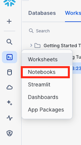
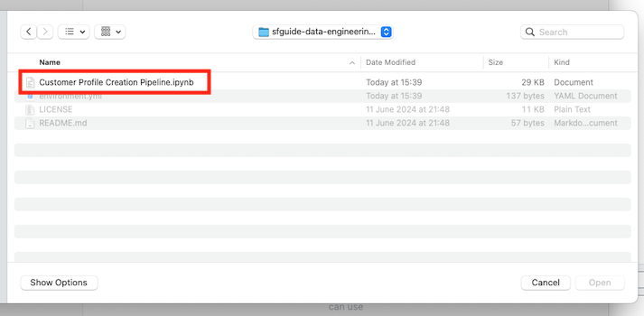
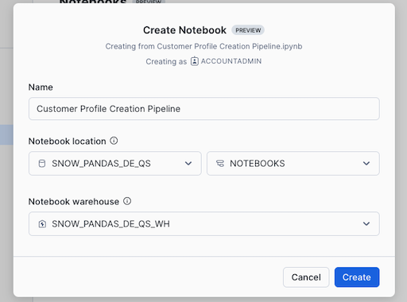
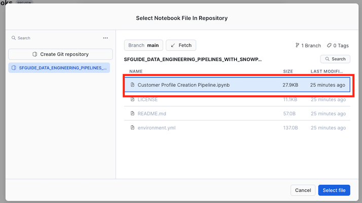
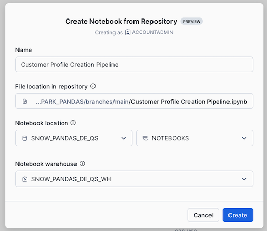

author: Mats Stellwall
id: data_engineering_pipelines_with_snowpark_pandas
summary: This is a sample Snowflake Guide
<!--- Categories below should be hyphenated, i.e., Getting-Started. Do not leave blank. Visit site for available categories. -->
categories: Getting-Started
environments: web
status: Published 
feedback link: https://github.com/Snowflake-Labs/sfguides/issues
tags: Getting Started, Data Science, Data Engineering 

# Snowpark Pandas API Data Pipeline
<!-- ------------------------ -->
## Overview 

Through this quickstart guide, you will learn how to use the Snowpark Pandas API to create a customer profile based on the using the [Snowflake Sample TPC-H dataset](https://docs.snowflake.com/en/user-guide/sample-data-tpch), save it into a Snowflake table and to create a serverless task to schedule the feature engineering.

### What is Snowpark?

Snowpark is the set of libraries and code execution environments that run Python and other programming languages next to your data in Snowflake.

* **Client Side Libraries** - Snowpark libraries can be installed and downloaded from any client-side notebook or IDE and are used for code development and deployment. Libraries include the Snowpark Pandas API, which provides Python APIs to run your pandas code directly on your data in Snowflake.
* **Code Execution Environments** - Snowpark provides elastic compute environments for secure execution of your code in Snowflake. Runtime options include Python, Java, and Scala in warehouses, container runtimes for out-of-the-box distributed processing with CPUs or GPUs using any Python framework,or custom runtimes brought in from Snowpark Container Services to execute any language of choice with CPU or GPU compute.

Learn more about [Snowpark](http://www.snowflake.com/snowpark).

### What is Snowpark Pandas API?
The Snowpark pandas API is a module in the Snowpark library that lets you run your pandas code directly on your data in Snowflake. Just by changing the import statement and a few lines of code, you can get the same pandas-native experience you know and love with the scalability and security benefits of Snowflake. With this API, you can work with much larger datasets so you can avoid the time and expense of porting your pandas pipelines to other big data frameworks or using larger and more expensive machines. It runs workloads natively in Snowflake through transpilation to SQL, enabling it to take advantage of parallelization and the data governance and security benefits of Snowflake.

#### Benefits of using the Snowpark pandas API
* **Meeting Python developers where they are** – This API offers a familiar interface to Python developers by providing a pandas-compatible layer that can run natively in Snowflake.
* **Scalable distributed pandas** – This API bridges the convenience of pandas with the scalability of mature data infrastructure. pandas can now run at Snowflake speed and scale by leveraging pre-existing query optimization techniques within Snowflake. No code rewrites or complex tuning are required, so you can move from prototype to production seamlessly.
* **Security and governance** – Data does not leave Snowflake’s secure platform. The Snowpark pandas API allows uniformity within data organizations on how data is accessed, and allows for easier auditing and governance.
* **No additional compute infrastructure to manage and tune** – This feature leverages the Snowflake engine, and you do not need to set up or manage any additional compute infrastructure.

Learn more about [Snowpark Pandas API](https://docs.snowflake.com/en/developer-guide/snowpark/python/snowpark-pandas).

### What You’ll Learn
* how to create Snowpark Pandas dataframe from a Snowflake table
* how to aggregate data to create new features
* how to Join Snowpark Pandas dataframes
* how to save a Snowpark Pandas dataframe into a Snowflake table
* how to create a serverless task to schedule the feature engineering

### Prerequisites
* [Git](https://git-scm.com/book/en/v2/Getting-Started-Installing-Git) installed
    > aside positive
    >
    >Clone or download the [git repo](https://github.com/Snowflake-Labs/sfguide-data-engineering-pipelines-with-snowpark-pandas)
* A Snowflake account. If you do not have a Snowflake account, you can register for a [free trial account](https://signup.snowflake.com/).
* A Snowflake account login with a role that has the ability to create database, schema and tables. If not, you will need to register for a free trial or use a different role.

### What You’ll Build 
A Customer profile table using the Snowpark Pandas API and a serverless task that will run the feature engineering on a schedule.

<!-- ------------------------ -->
## Setup the Snowflake enviroment
Duration: 10

### Overview
This section covers cloning of the GitHub repository and creating the needed Snowflake objects (i.e role, warehouse, database, schema, etc..)

### Clone the git repository
The very first step is to clone the [GitHub repository](https://github.com/Snowflake-Labs/sfguide-data-engineering-pipelines-with-snowpark-pandas). This repository contains all the code you will need to successfully complete this QuickStart Guide.

Using HTTPS:

```shell
git clone https://github.com/Snowflake-Labs/sfguide-data-engineering-pipelines-with-snowpark-pandas.git
```

OR, using SSH:

```shell
git clone git@github.com:Snowflake-Labs/sfguide-data-engineering-pipelines-with-snowpark-pandas.git
```

You can also use the git integration feature of Snowflake Notebooks, in order to do that you need to fork the [GitHub repository](https://github.com/Snowflake-Labs/sfguide-data-engineering-pipelines-with-snowpark-pandas) to be allowed to commit changes. For instructions how to set up integration for your Snowflake account see ... and for using it with Snowflake Notebooks see ..

<!-- ------------------------ -->
## Setup Snowflake

Duration: 10

During this step you will verify that the [Snowflake Sample TPC-H dataset](https://docs.snowflake.com/en/user-guide/sample-data-tpch) is avalible in your account, and if not add the share.

### Verify that the Snowflake Sample TPC-H dataset is avalible

1. Log into [Snowsight](https://docs.snowflake.com/en/user-guide/ui-snowsight.html#) for your account
2. Navigate to **Databases**
3. Check that you ...

### Create database, schema and warehouse to be used

```SQL
USE ROLE ACCOUNTADMIN;

CREATE DATABASE SNOW_PANDAS_DE_QS;
CREATE SCHEMA SNOW_PANDAS_DE_QS.NOTEBOOKS;
CREATE SCHEMA SNOW_PANDAS_DE_QS.DATA;

CREATE WAREHOUSE SNOW_PANDAS_DE_QS_WH;
```


<!-- ------------------------ -->
## Data Engineering with Snowpark Pandas
Duration: 30

During this step you will learn how to use the Snowpark Pandas API to
* Create datframe from a Snowflake table
* Aggregate data to create new features
* Join dataframes
* Save the result into a Snowflake table
* Create a serverless task to schedule the feature engineering

### Navigate to Snowflake notebooks

1. Navigate to the Notebooks section by clicking **Projects** and then **Notebooks**  
  
2. Click on the **down arrow* next to **+ Notebook**  
  
3. If you have set up git integration choose  **Create from repository** if not, then choose **import .ipynb file**.
  

### Import .ipynb file
1. Navigate to where you have cloned the [GitHub repository](https://github.com/Snowflake-Labs/sfguide-data-engineering-pipelines-with-snowpark-pandas) and select **Customer Profile Creation Pipeline.ipynb** and click **Open**  
  
2. Keep the name, select **SNOW_PANDAS_DE_QS** and **NOTEBOOKS** for **Notebooki location**, **SNOW_PANDAS_DE_QS_WH** for **Notebook warehouse** and click **Create**  
  

### Create from repository

If you have forked the [GitHub repository](https://github.com/Snowflake-Labs/sfguide-data-engineering-pipelines-with-snowpark-pandas) and create a integration to it in Snowflake you can open the notebook directly from the git repository.

1. In the **Create Notebook from Repository** dialog click on **Select .ipynb file**  
  
2 Click on the repository integration you are using and select **Customer Profile Creation Pipeline.ipynb** and click **Select File**, if you do not see the file press **Fetch** to refresh with the latest changes from the repository  
  
3. Name it **Customer Profile Creation Pipeline**, select **SNOW_PANDAS_DE_QS**, **NOTEBOOKS** for **Notebooki location** and **SNOW_PANDAS_DE_QS_WH** for **Notebook warehouse** and click **Create**  
  

### Add needed libraries to the Notebook


