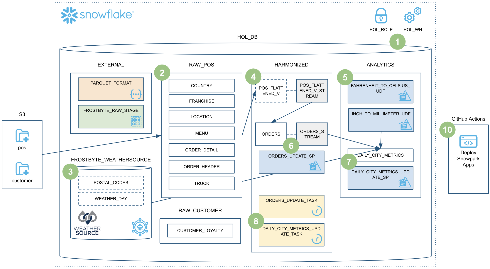
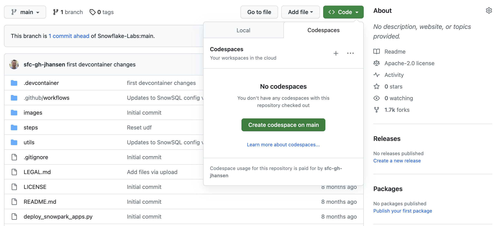
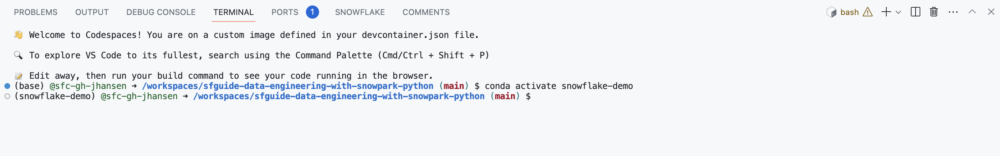
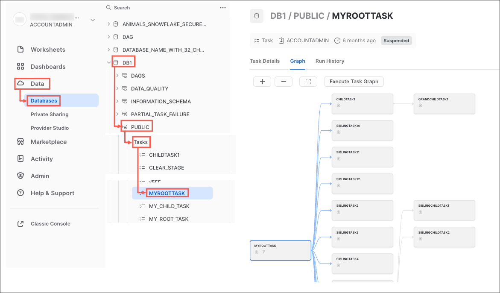
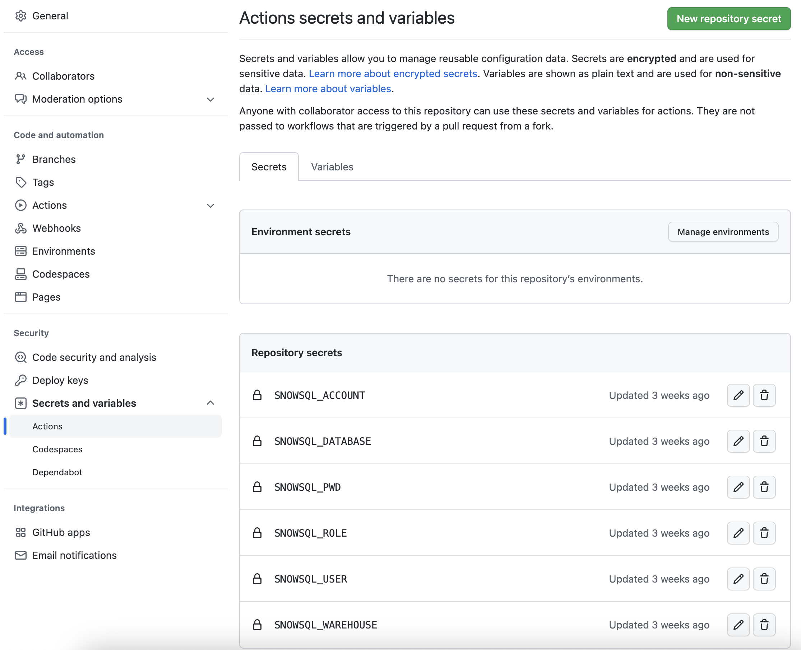

authors: Jeremiah Hansen
id: data_engineering_pipelines_with_snowpark_python
summary: This guide will provide step-by-step details for building data engineering pipelines with Snowpark Python
categories: featured,data-engineering
environments: web
status: Published 
feedback link: https://github.com/Snowflake-Labs/sfguides/issues
tags: Data Engineering, Snowpark, Python

# Data Engineering Pipelines with Snowpark Python
<!-- ------------------------ -->
## Overview 
Duration: 15

> "Data engineers are focused primarily on building and maintaining data pipelines that transport data through different steps and put it into a usable state ... The data engineering process encompasses the overall effort required to create **data pipelines** that automate the transfer of data from place to place and transform that data into a specific format for a certain type of analysis. In that sense, data engineering isn’t something you do once. It’s an ongoing practice that involves collecting, preparing, transforming, and delivering data. A data pipeline helps automate these tasks so they can be reliably repeated. It’s a practice more than a specific technology." (From Cloud Data Engineering for Dummies, Snowflake Special Edition)

Are you interested in unleashing the power of Snowpark Python to build data engineering pipelines? Well then, this Quickstart is for you! The focus here will be on building data engineering pipelines with Python, and not on data science. For examples of doing data science with Snowpark Python please check out our [Machine Learning with Snowpark Python: - Credit Card Approval Prediction](https://quickstarts.snowflake.com/guide/getting_started_snowpark_machine_learning/index.html?index=..%2F..index#0) Quickstart.

This Quickstart will cover a lot of ground, and by the end you will have built a robust data engineering pipeline using Snowpark Python stored procedures. That pipeline will process data incrementally, be orchestrated with Snowflake tasks, and be deployed via a CI/CD pipeline. You'll also learn how to use Snowflake's new developer CLI tool and Visual Studio Code extension! Here's a quick visual overview:




So buckle up and get ready!

> aside negative
> 
> **Note** - As of 9/1/2023, the [SnowCLI Tool](https://github.com/Snowflake-Labs/snowcli) is still in preview.


### Prerequisites
* Familiarity with Python
* Familiarity with the DataFrame API
* Familiarity with Snowflake
* Familiarity with Git repositories and GitHub

### What You’ll Learn
You will learn about the following Snowflake features during this Quickstart:

* Snowflake's Table Format
* Data ingestion with COPY
* Schema inference
* Data sharing/marketplace (instead of ETL)
* Streams for incremental processing (CDC)
* Streams on views
* Python UDFs (with third-party packages)
* Python Stored Procedures
* Snowpark DataFrame API
* Snowpark Python programmability
* Warehouse elasticity (dynamic scaling)
* Visual Studio Code Snowflake native extension (PuPr, Git integration)
* SnowCLI (PuPr)
* Tasks (with Stream triggers)
* Task Observability
* GitHub Actions (CI/CD) integration

### What You’ll Need
You will need the following things before beginning:

* Snowflake account
    * **A Snowflake Account**
    * **A Snowflake user created with ACCOUNTADMIN permissions**. This user will be used to get things setup in Snowflake.
    * **Anaconda Terms & Conditions accepted**. See Getting Started section in [Third-Party Packages](https://docs.snowflake.com/en/developer-guide/udf/python/udf-python-packages.html#getting-started).
* GitHub account
    * **A GitHub account**. If you don't already have a GitHub account you can create one for free. Visit the [Join GitHub](https://github.com/signup) page to get started.

### What You’ll Build
During this Quickstart you will accomplish the following things:

* Load Parquet data to Snowflake using schema inference
* Setup access to Snowflake Marketplace data
* Create a Python UDF to convert temperature
* Create a data engineering pipeline with Python stored procedures to incrementally process data
* Orchestrate the pipelines with tasks
* Monitor the pipelines with Snowsight
* Deploy the Snowpark Python stored procedures via a CI/CD pipeline


<!-- ------------------------ -->
## Quickstart Setup
Duration: 10

### Fork the Quickstart Repository and Enable GitHub Actions
You'll need to create a fork of the repository for this Quickstart in your GitHub account. Visit the [Data Engineering Pipelines with Snowpark Python associated GitHub Repository](https://github.com/Snowflake-Labs/sfguide-data-engineering-with-snowpark-python) and click on the "Fork" button near the top right. Complete any required fields and click "Create Fork".

By default GitHub Actions disables any workflows (or CI/CD pipelines) defined in the forked repository. This repository contains a workflow to deploy your Snowpark Python UDF and stored procedures, which we'll use later on. So for now enable this workflow by opening your forked repository in GitHub, clicking on the `Actions` tab near the top middle of the page, and then clicking on the `I understand my workflows, go ahead and enable them` green button.


### Create GitHub Codespace
For this Quickstart we will be using [GitHub Codespaces](https://docs.github.com/en/codespaces/overview) for our development environment. Codespaces offer a hosted development environment with a hosted, web-based VS Code environment. GitHub currently offers [60 hours for free each month](https://github.com/features/codespaces) when using a 2 node environment, which should be more than enough for this lab.

To create a GitHub Codespace, click on the green `<> Code` button from the GitHub repository homepage. In the Code popup, click on the `Codespaces` tab and then on the green `Create codespace on main`.



This will open a new tab and begin setting up your codespace. This will take a few minutes as it sets up the entire environment for this Quickstart. Here is what is being done for you:

* Creating a container for your environment
* Installing Anaconda (miniconda)
* SnowSQL setup
    * Installing SnowSQL
    * Creating a directory and default config file for SnowSQL
* Anaconda setup
    * Creating the Anaconda environment
    * Installing the Snowpark Python library
    * Installing the SnowCLI Python CLI
* VS Code setup
    * Installing VS Code
    * Configuring VS Code for the Python Anaconda environment
    * Installing the Snowflake VS Code extension
* Starting a hosted, web-based VS Code editor

Once the codepsace has been created and started you should see a hosted web-based version of VS Code with your forked repository set up! Just a couple more things and we're ready to start.

### Configure Snowflake Credentials
We will not be directly using [the SnowSQL command line client](https://docs.snowflake.com/en/user-guide/snowsql.html) for this Quickstart, but we will be storing our Snowflake connection details in the SnowSQL config file located at `~/.snowsql/config`. A default config file was created for you during the codespace setup.

The easiest way to edit the default `~/.snowsql/config` file is directly from VS Code in your codespace. Type `Command-P`, type (or paste) `~/.snowsql/config` and hit return. The SnowSQL config file should now be open. You just need to edit the file and replace the `accountname`, `username`, and `password` with your values. Then save and close the file.

**Note:** The SnowCLI tool (and by extension this Quickstart) currently does not work with Key Pair authentication. It simply grabs your username and password details from the shared SnowSQL config file.

### Verify Your Anaconda Environment is Activated
During the codespace setup we created an Anaconda environment named `snowflake-demo`. And when VS Code started up it should have automatically activated the environment in your terminal. You should see something like this in the terminal, and in particular you should see `(snowflake-demo)` before your bash prompt.



If for some reason it wasn't activiated simply run `conda activate snowflake-demo` in your terminal.


<!-- ------------------------ -->
## Setup Snowflake
Duration: 10

### Snowflake Extensions for VS Code
You can run SQL queries against Snowflake in many different ways (through the Snowsight UI, SnowSQL, etc.) but for this Quickstart we'll be using the Snowflake extension for VS Code. For a brief overview of Snowflake's native extension for VS Code, please check out our [VS Code Marketplace Snowflake extension page](https://marketplace.visualstudio.com/items?itemName=snowflake.snowflake-vsc).

### Run the Script
To set up all the objects we'll need in Snowflake for this Quickstart you'll need to run the `steps/01_setup_snowflake.sql` script.

Start by clicking on the Snowflake extension in the left navigation bar in VS Code. Then login to your Snowflake account with a user that has ACCOUNTADMIN permissions. Once logged in to Snowflake, open the `steps/01_setup_snowflake.sql` script in VS Code by going back to the file Explorer in the left navigation bar.

To run all the queries in this script, use the "Execute All Statements" button in the upper right corner of the editor window. Or, if you want to run them in chunks, you can highlight the ones you want to run and press CMD/CTRL+Enter. 


<!-- ------------------------ -->
## Load Raw
Duration: 10

During this step we will be loading the raw Tasty Bytes POS and Customer loyalty data from raw Parquet files in `s3://sfquickstarts/data-engineering-with-snowpark-python/` to our `RAW_POS` and `RAW_CUSTOMER` schemas in Snowflake. And you are going to be orchestrating this process from your laptop in Python using the Snowpark Python API. To put this in context, we are on step **#2** in our data flow overview:


### Run the Script
To load the raw data, execute the `steps/02_load_raw.py` script. This can be done a number of ways in VS Code, from a terminal or directly by VS Code. For this demo you will need to execute the Python scripts from the terminal. So go back to the terminal in VS Code, make sure that your `snowflake-demo` conda environment is active, then run the following commands (which assume that your terminal has the root of your repository open):

```bash
cd steps
python 02_load_raw.py
```

While that is running, please open the script in VS Code and continue on this page to understand what is happening.

### Running Snowpark Python Locally
In this step you will be running the Snowpark Python code locally from your laptop. At the bottom of the script is a block of code that is used for local debugging (under the `if __name__ == "__main__":` block):

```python
# For local debugging
if __name__ == "__main__":
    # Add the utils package to our path and import the snowpark_utils function
    import os, sys
    current_dir = os.getcwd()
    parent_dir = os.path.dirname(current_dir)
    sys.path.append(parent_dir)

    from utils import snowpark_utils
    session = snowpark_utils.get_snowpark_session()

    load_all_raw_tables(session)
#    validate_raw_tables(session)

    session.close()
```

A few things to point out here. First, the Snowpark session is being created in the `utils/snowpark_utils.py` module. It has multiple methods for obtaining your credentials, and for this Quickstart it pulls them from the SnowSQL config file located at `~/.snowsql/config`. For more details please check out the code for the [utils/snowpark_utils.py module](https://github.com/Snowflake-Labs/sfguide-data-engineering-with-snowpark-python/blob/main/utils/snowpark_utils.py).

Then after getting the Snowpark session it calls the `load_all_raw_tables(session)` method which does the heavy lifting. The next few sections will point out the key parts.

Finally, almost all of the Python scripts in this Quickstart include a local debugging block. Later on we will create Snowpark Python stored procedures and UDFs and those Python scripts will have a similar block. So this pattern is important to understand.

### Viewing What Happened in Snowflake
The [Query History](https://docs.snowflake.com/en/user-guide/ui-snowsight-activity.html#query-history) in Snowflake is a very power feature, that logs every query run against your Snowflake account, no matter which tool or process initiated it. And this is especially helpful when working with client tools and APIs.

The Python script you just ran did a small amount of work locally, basically just orchestrating the process by looping through each table and issuing the command to Snowflake to load the data. But all of the heavy lifting ran inside Snowflake! This push-down is a hallmark of the Snowpark API and allows you to leverage the scalability and compute power of Snowflake!

Log in to your Snowflake account and take a quick look at the SQL that was generated by the Snowpark API. This will help you better understand what the API is doing and will help you debug any issues you may run into.


### Schema Inference
One very helpful feature in Snowflake is the ability to infer the schema of files in a stage that you wish to work with. This is accomplished in SQL with the [`INFER_SCHEMA()`](https://docs.snowflake.com/en/sql-reference/functions/infer_schema.html) function. The Snowpark Python API does this for you automatically when you call the `session.read()` method. Here is the code snippet:

```python
    # we can infer schema using the parquet read option
    df = session.read.option("compression", "snappy") \
                            .parquet(location)
```

### Data Ingestion with COPY
In order to load the data into a Snowflake table we will use the `copy_into_table()` method on a DataFrame. This method will create the target table in Snowflake using the inferred schema (if it doesn't exist), and then call the highly optimized Snowflake [`COPY INTO &lt;table&gt;` Command](https://docs.snowflake.com/en/sql-reference/sql/copy-into-table.html). Here is the code snippet:

```python
    df.copy_into_table("{}".format(tname))
```

### Snowflake's Table Format
One of the major advantages of Snowflake is being able to eliminate the need to manage a file-based data lake. And Snowflake was designed for this purpose from the beginning. In the step we are loading the raw data into a structured Snowflake managed table. But Snowflake tables can natively support structured and semi-structured data, and are stored in Snowflake's mature cloud table format (which predates Hudi, Delta or Iceberg).

Once loaded into Snowflake the data will be securely stored and managed, without the need to worry about securing and managing raw files. Additionally the data, whether raw or structured, can be transformed and queried in Snowflake using SQL or the language of your choice, without needing to manage separate compute services like Spark.

This is a huge advantage for Snowflake customers.


### Warehouse Elasticity (Dynamic Scaling)
With Snowflake there is only one type of user defined compute cluster, the [Virtual Warehouse](https://docs.snowflake.com/en/user-guide/warehouses.html), regardless of the language you use to process that data (SQL, Python, Java, Scala, Javascript, etc.). This makes working with data much simpler in Snowflake. And governance of the data is completely separated from the compute cluster, in other words there is no way to get around Snowflake governance regardless of the warehouse settings or language being used.

And these virtual warehouses can be dynamically scaled, in under a second for most sized warehouses! This means that in your code you can dynamically resize the compute environment to increase the amount of capacity to run a section of code in a fraction of the time, and then dynamically resized again to reduce the amount of capacity. And because of our per-second billing (with a sixty second minimum) you won't pay any extra to run that section of code in a fraction of the time!

Let's see how easy that is done. Here is the code snippet:

```python
    _ = session.sql("ALTER WAREHOUSE HOL_WH SET WAREHOUSE_SIZE = XLARGE WAIT_FOR_COMPLETION = TRUE").collect()

    # Some data processing code

    _ = session.sql("ALTER WAREHOUSE HOL_WH SET WAREHOUSE_SIZE = XSMALL").collect()
```

Please also note that we included the `WAIT_FOR_COMPLETION` parameter in the first `ALTER WAREHOUSE` statement. Setting this parameter to `TRUE` will block the return of the `ALTER WAREHOUSE` command until the resize has finished provisioning all its compute resources. This way we make sure that the full cluster is available before processing any data with it.

We will use this pattern a few more times during this Quickstart, so it's important to understand.


<!-- ------------------------ -->
## Load Weather
Duration: 4

During this step we will be "loading" the raw weather data to Snowflake. But "loading" is the really the wrong word here. Because we're using Snowflake's unique data sharing capability we don't actually need to copy the data to our Snowflake account with a custom ETL process. Instead we can directly access the weather data shared by Weather Source in the Snowflake Data Marketplace. To put this in context, we are on step **#3** in our data flow overview:


### Snowflake Data Marketplace
Weather Source is a leading provider of global weather and climate data and their OnPoint Product Suite provides businesses with the necessary weather and climate data to quickly generate meaningful and actionable insights for a wide range of use cases across industries. Let's connect to the `Weather Source LLC: frostbyte` feed from Weather Source in the Snowflake Data Marketplace by following these steps:

* Login to Snowsight
* Click on the `Marketplace` link in the left navigation bar
* Enter "Weather Source LLC: frostbyte" in the search box and click return
* Click on the "Weather Source LLC: frostbyte" listing tile
* Click the blue "Get" button
    * Expand the "Options" dialog
    * Change the "Database name" to read "FROSTBYTE_WEATHERSOURCE" (all capital letters)
    * Select the "HOL_ROLE" role to have access to the new database
* Click on the blue "Get" button

That's it... we don't have to do anything from here to keep this data updated. The provider will do that for us and data sharing means we are always seeing whatever they have published. How amazing is that? Just think of all the things you didn't have do here to get access to an always up-to-date, third-party dataset!

### Run the Script
Open the `steps/03_load_weather.sql` script in VS Code from the file Explorer in the left navigation bar, and run the script. Notice how easy it is to query data shared through the Snowflake Marketplace! You access it just like any other table or view in Snowflake:

```sql
SELECT * FROM FROSTBYTE_WEATHERSOURCE.ONPOINT_ID.POSTAL_CODES LIMIT 100;
```


<!-- ------------------------ -->
## Create POS View
Duration: 10

During this step we will be creating a view to simplify the raw POS schema by joining together 6 different tables and picking only the columns we need. But what's really cool is that we're going to define that view with the Snowpark DataFrame API! Then we're going to create a Snowflake stream on that view so that we can incrementally process changes to any of the POS tables. To put this in context, we are on step **#4** in our data flow overview:


### Run the Script
To create the view and stream, execute the `steps/04_create_pos_view.py` script. Like we did in step 2, let's execute it from the terminal. So go back to the terminal in VS Code, make sure that your `snowflake-demo` conda environment is active, then run the following commands (which assume that your terminal has the root of your repository open):

```bash
cd steps
python 04_create_pos_view.py
```

While that is running, please open the script in VS Code and continue on this page to understand what is happening.

### Snowpark DataFrame API
The first thing you'll notice in the `create_pos_view()` function is that we define the Snowflake view using the Snowpark DataFrame API. After defining the final DataFrame, which captures all the logic we want in the view, we can simply call the Snowpark `create_or_replace_view()` method. Here's the final line from the `create_pos_view()` function:

```python
    final_df.create_or_replace_view('POS_FLATTENED_V')
```

For more details about the Snowpark Python DataFrame API, please check out our [Working with DataFrames in Snowpark Python](https://docs.snowflake.com/en/developer-guide/snowpark/python/working-with-dataframes.html) page.

### Streams for Incremental Processing (CDC)
Snowflake makes processing data incrementally very easy. Traditionally the data engineer had to keep track of a high watermark (usually a datetime column) in order to process only new records in a table. This involved tracking and persisting that watermark somewhere and then using it in any query against the source table. But with Snowflake streams all the heavy lifting is done for you by Snowflake. For more details please check out our [Change Tracking Using Table Streams](https://docs.snowflake.com/en/user-guide/streams.html) user guide.

All you need to do is create a [`STREAM`](https://docs.snowflake.com/en/sql-reference/sql/create-stream.html) object in Snowflake against your base table or view, then query that stream just like any table in Snowflake. The stream will return only the changed records since the last DML option your performed. To help you work with the changed records, Snowflake streams will supply the following metadata columns along with the base table or view columns:

* METADATA$ACTION
* METADATA$ISUPDATE
* METADATA$ROW_ID

For more details about these stream metadata columns please check out the [Stream Columns](https://docs.snowflake.com/en/user-guide/streams-intro.html#stream-columns) section in our documentation.

### Streams on views
What's really cool about Snowflake's incremental/CDC stream capability is the ability to create a stream on a view! In this example we are creating a stream on a view which joins together 6 of the raw POS tables. Here is the code to do that:

```python
def create_pos_view_stream(session):
    session.use_schema('HARMONIZED')
    _ = session.sql('CREATE OR REPLACE STREAM POS_FLATTENED_V_STREAM \
                        ON VIEW POS_FLATTENED_V \
                        SHOW_INITIAL_ROWS = TRUE').collect()
```

Now when we query the `POS_FLATTENED_V_STREAM` stream to find changed records, Snowflake is actually looking for changed records in any of the 6 tables included in the view. For those who have tried to build incremental/CDC processes around denormalized schemas like this, you will appreciate the incredibly powerful feature that Snowflake provides here.

For more details please check out the [Streams on Views](https://docs.snowflake.com/en/user-guide/streams-intro.html#streams-on-views) section in our documentation.


<!-- ------------------------ -->
## Fahrenheit to Celsius UDF
Duration: 10

During this step we will be creating and deploying our first Snowpark Python object to Snowflake, a user-defined function (or UDF). To begin with the UDF will be very basic, but in a future step we'll update it to include a third-party Python package. Also in this step you will be introduced to the new SnowCLI, a new developer command line tool. SnowCLI makes building and deploying Snowpark Python objects to Snowflake a consistent experience for the developer. More details below on SnowCLI. To put this in context, we are on step **#5** in our data flow overview:


### Running the UDF Locally
To test the UDF locally, you will execute the `steps/05_fahrenheit_to_celsius_udf/app.py` script. Like we did in the previous steps, we'll execute it from the terminal. So go back to the terminal in VS Code, make sure that your `snowflake-demo` conda environment is active, then run the following commands (which assume that your terminal has the root of your repository open):

```bash
cd steps/05_fahrenheit_to_celsius_udf
python app.py 35
```

While you're developing the UDF you can simply run it locally in VS Code. And if your UDF doesn't need to query data from Snowflake, this process will be entirely local.

### Deploying the UDF to Snowflake
To deploy your UDF to Snowflake we will use the SnowCLI tool. The SnowCLI tool will do all the heavy lifting of packaging up your application, copying it to a Snowflake stage, and creating the object in Snowflake. Like we did in the previous steps, we'll execute it from the terminal. So go back to the terminal in VS Code, make sure that your `snowflake-demo` conda environment is active, then run the following commands (which assume that your terminal has the root of your repository open):

```bash
cd steps/05_fahrenheit_to_celsius_udf
snow function create
```

While that is running, please open the script in VS Code and continue on this page to understand what is happening.

### Running the UDF in Snowflake
In order to run the UDF in Snowflake you have a few options. Any UDF in Snowflake can be invoked through SQL as follows:

```sql
SELECT ANALYTICS.FAHRENHEIT_TO_CELSIUS_UDF(35);
```

And with the SnowCLI utility you can also invoke the UDF from the terminal in VS Code as follows:

```bash
snow function execute -f "fahrenheit_to_celsius_udf(35)"
```

That will result in the SnowCLI tool generating the SQL query above and running it against your Snowflake account.

### Overview of the SnowCLI Tool
The [SnowCLI](https://github.com/Snowflake-Labs/snowcli) tool is a command line tool for developers, and is executed as `snow` from the command line. 

> aside negative
> **Note** - Do not confuse this with the [SnowSQL](https://docs.snowflake.com/en/user-guide/snowsql.html) command line tool which is a client for connecting to Snowflake to execute SQL queries and perform all DDL and DML operations, and is executed as `snowsql` from the command line.

SnowCLI simplifies the development and deployment of the following Snowflake objects:

* Snowpark Python UDFs
* Snowpark Python Stored Procedures
* Streamlit Applications

For this Quickstart we will be focused on the first two. And for Snowpark Python UDFs and sprocs in particular, the SnowCLI does all the heavy lifting of deploying the objects to Snowflake. Here's a brief summary of the steps the SnowCLI deploy command does for you:

* Dealing with third-party packages
    * For packages that can be accessed directly from our Anaconda channel it will add them to the `PACKAGES` list in the `CREATE PROCEDURE` or `CREATE FUNCTION` SQL command
    * For packages which are not currently available in our Anaconda channel it will download the code and include them in the project zip file
* Creating a zip file of everything in your project
* Copying that project zip file to your Snowflake stage
* Creating the Snowflake function or stored procedure object

This also allows you to develop and test your Python application without having to worry about wrapping it in a corresponding Snowflake database object.

> aside negative
> 
> **Note** -  As of 9/1/2023, the [SnowCLI Tool](https://github.com/Snowflake-Labs/snowcli) is still in preview.

### More on Snowpark Python UDFs
In this step we deployed a very simple Python UDF to Snowflake. In a future step will update it to use a third-party package. And because we deployed it to Snowflake with the SnowCLI command you didn't have to worry about the SQL DDL Syntax to create the object in Snowflake. But for reference please check out our [Writing Python UDFs](https://docs.snowflake.com/en/developer-guide/udf/python/udf-python.html) developer guide.

Here is the SQL query that the SnowCLI tool generated to deploy the function:

```sql
CREATE OR REPLACE  FUNCTION fahrenheit_to_celsius_udf(temp_f float)
         RETURNS float
         LANGUAGE PYTHON
         RUNTIME_VERSION=3.8
         IMPORTS=('@HOL_DB.ANALYTICS.deployments/fahrenheit_to_celsius_udftemp_f_float/app.zip')
         HANDLER='app.main'
         PACKAGES=();
```


<!-- ------------------------ -->
## Orders Update Sproc
Duration: 10

During this step we will be creating and deploying our first Snowpark Python stored procedure (or sproc) to Snowflake. This sproc will merge changes from the `HARMONIZED.POS_FLATTENED_V_STREAM` stream into our target `HARMONIZED.ORDERS` table. To put this in context, we are on step **#6** in our data flow overview:


### Running the Sproc Locally
To test the procedure locally, you will execute the `steps/06_orders_update_sp/app.py` script. Like we did in the previous steps, we'll execute it from the terminal. So go back to the terminal in VS Code, make sure that your `snowflake-demo` conda environment is active, then run the following commands (which assume that your terminal has the root of your repository open):

```bash
cd steps/06_orders_update_sp
python app.py
```

While you're developing the sproc you can simply run it locally in VS Code. The Python code will run locally on your laptop, but the Snowpark DataFrame code will issue SQL queries to your Snowflake account.

### Deploying the Sproc to Snowflake
To deploy your sproc to Snowflake we will use the SnowCLI tool. Like we did in the previous steps, we'll execute it from the terminal. So go back to the terminal in VS Code, make sure that your `snowflake-demo` conda environment is active, then run the following commands (which assume that your terminal has the root of your repository open):

```bash
cd steps/06_orders_update_sp
snow procedure create
```

While that is running, please open the script in VS Code and continue on this page to understand what is happening.

### Running the Sproc in Snowflake
In order to run the sproc in Snowflake you have a few options. Any sproc in Snowflake can be invoked through SQL as follows:

```sql
CALL ORDERS_UPDATE_SP();
```

And with the SnowCLI utility you can also invoke the UDF from the terminal in VS Code as follows:

```bash
snow procedure execute -p "orders_update_sp()"
```

That will result in the SnowCLI tool generating the SQL query above and running it against your Snowflake account.

### More on Snowpark Python Sprocs
In this step we deployed a Python sproc to Snowflake. And because we deployed it to Snowflake with the SnowCLI command you didn't have to worry about the SQL DDL Syntax to create the object in Snowflake. But for reference please check out our [Writing Stored Procedures in Snowpark (Python)](https://docs.snowflake.com/en/sql-reference/stored-procedures-python.html) guide.

Here is the SQL query that the SnowCLI tool generated to deploy the procedure:

```sql
CREATE OR REPLACE  PROCEDURE orders_update_sp()
         RETURNS string
         LANGUAGE PYTHON
         RUNTIME_VERSION=3.8
         IMPORTS=('@HOL_DB.HARMONIZED.deployments/orders_update_sp/app.zip')
         HANDLER='app.main'
         PACKAGES=('snowflake-snowpark-python','toml')
        EXECUTE AS CALLER;
```

### More on the Snowpark API
In this step we're starting to really use the Snowpark DataFrame API for data transformations. The Snowpark API provides the same functionality as the [Spark SQL API](https://spark.apache.org/docs/latest/api/python/reference/pyspark.sql/index.html). To begin with you need to create a Snowpark session object. Like PySpark, this is accomplished with the `Session.builder.configs().create()` methods. When running locally, we use the `utils.snowpark_utils.get_snowpark_session()` helper function to create the session object for us. But when deployed to Snowflake, the session object is provisioned for you automatically by Snowflake. And when building a Snowpark Python sproc the contract is that the first argument to the entry point (or handler) function is a Snowpark session.

The first thing you'll notice in the `steps/06_orders_update_sp/app.py` script is that we have some functions which use SQL to create objects in Snowflake and to check object status. To issue a SQL statement to Snowflake with the Snowpark API you use the `session.sql()` function, like you'd expect. Here's one example:

```python
def create_orders_stream(session):
    _ = session.sql("CREATE STREAM IF NOT EXISTS HARMONIZED.ORDERS_STREAM ON TABLE HARMONIZED.ORDERS \
                    SHOW_INITIAL_ROWS = TRUE;").collect()
```

The second thing to point out is how we're using DataFrames to merge changes from the source view to the target table. The Snowpark DataFrame API provides a `merge()` method which will ultimately generate a `MERGE` command in Snowflake.

```python
    source = session.table('HARMONIZED.POS_FLATTENED_V_STREAM')
    target = session.table('HARMONIZED.ORDERS')

    # TODO: Is the if clause supposed to be based on "META_UPDATED_AT"?
    cols_to_update = {c: source[c] for c in source.schema.names if "METADATA" not in c}
    metadata_col_to_update = {"META_UPDATED_AT": F.current_timestamp()}
    updates = {**cols_to_update, **metadata_col_to_update}

    # merge into DIM_CUSTOMER
    target.merge(source, target['ORDER_DETAIL_ID'] == source['ORDER_DETAIL_ID'], \
                        [F.when_matched().update(updates), F.when_not_matched().insert(updates)])
```

Again, for more details about the Snowpark Python DataFrame API, please check out our [Working with DataFrames in Snowpark Python](https://docs.snowflake.com/en/developer-guide/snowpark/python/working-with-dataframes.html) page.


<!-- ------------------------ -->
## Daily City Metrics Update Sproc
Duration: 10

During this step we will be creating and deploying our second Snowpark Python sproc to Snowflake. This sproc will join the `HARMONIZED.ORDERS` data with the Weather Source data to create a final, aggregated table for analysis named `ANALYTICS.DAILY_CITY_METRICS`. We will process the data incrementally from the `HARMONIZED.ORDERS` table using another Snowflake Stream. And we will again use the Snowpark DataFrame `merge()` method to merge/upsert the data. To put this in context, we are on step **#7** in our data flow overview:


### Running the Sproc Locally
To test the procedure locally, you will execute the `steps/07_daily_city_metrics_update_sp/app.py` script. Like we did in the previous steps, we'll execute it from the terminal. So go back to the terminal in VS Code, make sure that your `snowflake-demo` conda environment is active, then run the following commands (which assume that your terminal has the root of your repository open):

```bash
cd steps/07_daily_city_metrics_update_sp
python app.py
```

While you're developing the sproc you can simply run it locally in VS Code. The Python code will run locally on your laptop, but the Snowpark DataFrame code will issue SQL queries to your Snowflake account.

### Deploying the Sproc to Snowflake
To deploy your sproc to Snowflake we will use the SnowCLI tool. Like we did in the previous steps, we'll execute it from the terminal. So go back to the terminal in VS Code, make sure that your `snowflake-demo` conda environment is active, then run the following commands (which assume that your terminal has the root of your repository open):

```bash
cd steps/07_daily_city_metrics_update_sp
snow procedure create
```

While that is running, please open the script in VS Code and continue on this page to understand what is happening.

### Running the Sproc in Snowflake
In order to run the sproc in Snowflake you have a few options. Any sproc in Snowflake can be invoked through SQL as follows:

```sql
CALL DAILY_CITY_METRICS_UPDATE_SP();
```

And with the SnowCLI utility you can also invoke the UDF from the terminal in VS Code as follows:

```bash
snow procedure execute -p "daily_city_metrics_update_sp()"
```

That will result in the SnowCLI tool generating the SQL query above and running it against your Snowflake account.

### Data Modeling Best Practice
When modeling data for analysis a best practice has been to clearly define and manage the schema of the table. In step 2, when we loaded raw data from Parquet we took advantage of Snowflake's schema detection feature to create a table with the same schema as the Parquet files. In this step we are explicitly defining the schema in DataFrame syntax and using that to create the table.

```python
def create_daily_city_metrics_table(session):
    SHARED_COLUMNS= [T.StructField("DATE", T.DateType()),
                                        T.StructField("CITY_NAME", T.StringType()),
                                        T.StructField("COUNTRY_DESC", T.StringType()),
                                        T.StructField("DAILY_SALES", T.StringType()),
                                        T.StructField("AVG_TEMPERATURE_FAHRENHEIT", T.DecimalType()),
                                        T.StructField("AVG_TEMPERATURE_CELSIUS", T.DecimalType()),
                                        T.StructField("AVG_PRECIPITATION_INCHES", T.DecimalType()),
                                        T.StructField("AVG_PRECIPITATION_MILLIMETERS", T.DecimalType()),
                                        T.StructField("MAX_WIND_SPEED_100M_MPH", T.DecimalType()),
                                    ]
    DAILY_CITY_METRICS_COLUMNS = [*SHARED_COLUMNS, T.StructField("META_UPDATED_AT", T.TimestampType())]
    DAILY_CITY_METRICS_SCHEMA = T.StructType(DAILY_CITY_METRICS_COLUMNS)

    dcm = session.create_dataframe([[None]*len(DAILY_CITY_METRICS_SCHEMA.names)], schema=DAILY_CITY_METRICS_SCHEMA) \
                        .na.drop() \
                        .write.mode('overwrite').save_as_table('ANALYTICS.DAILY_CITY_METRICS')
    dcm = session.table('ANALYTICS.DAILY_CITY_METRICS')
```

### Complex Aggregation Query
The `merge_daily_city_metrics()` function contains a complex aggregation query which is used to join together and aggregate the data from our POS and Weather Source. Take a look at the series of complex series of joins and aggregations that are expressed, and how we're even leveraging the Snowpark UDF we created in step #5!

The complex aggregation query is then merged into the final analytics table using the Snowpark `merge()` method. If you haven't already, check out your Snowflake Query history and see which queries were generated by the Snowpark API. In this case you will see that the Snowpark API took all the complex logic, including the merge and created a single Snowflake query to execute!


<!-- ------------------------ -->
## Orchestrate Jobs
Duration: 10

During this step we will be orchestrating our new Snowpark pipelines with Snowflake's native orchestration feature named Tasks. We will create two tasks, one for each stored procedure, and chain them together. We will then run the tasks. To put this in context, we are on step **#8** in our data flow overview:


### Run the Script
Since this is a SQL script we will be using our native VS Code extension to execute it. So simply open the `steps/08_orchestrate_jobs.sql` script in VS Code and run the whole thing using the "Execute All Statements" button in the upper right corner of the editor window.

While that is running, please read through the script in VS Code and continue on this page to understand what is happening.

### Running the Tasks
In this step we did not create a schedule for our task DAG, so it will not run on its own at this point. So in this script you will notice that we manually execute the DAG, like this:

```sql
EXECUTE TASK ORDERS_UPDATE_TASK;
```

To see what happened when you ran this task just now, highlight and run (using CMD/CTRL+Enter) this commented query in the script:

```sql
SELECT *
FROM TABLE(INFORMATION_SCHEMA.TASK_HISTORY(
    SCHEDULED_TIME_RANGE_START=>DATEADD('DAY',-1,CURRENT_TIMESTAMP()),
    RESULT_LIMIT => 100))
ORDER BY SCHEDULED_TIME DESC
;
```

You will notice in the task history output that it skipped our task `ORDERS_UPDATE_TASK`. This is correct, because our `HARMONIZED.POS_FLATTENED_V_STREAM` stream doesn't have any data. We'll add some new data and run them again in the next step.

### More on Tasks
Tasks are Snowflake's native scheduling/orchestration feature. With a task you can execute any one of the following types of SQL code:

* Single SQL statement
* Call to a stored procedure
* Procedural logic using Snowflake Scripting Developer Guide

For this Quickstart we'll call our Snowpark stored procedures. Here is the SQL DDL code to create the second task:

```sql
CREATE OR REPLACE TASK DAILY_CITY_METRICS_UPDATE_TASK
WAREHOUSE = HOL_WH
AFTER ORDERS_UPDATE_TASK
WHEN
  SYSTEM$STREAM_HAS_DATA('ORDERS_STREAM')
AS
CALL ANALYTICS.DAILY_CITY_METRICS_UPDATE_SP();
```

A few things to point out. First you specify which Snowflake virtual warehouse to use when running the task with the `WAREHOUSE` clause. The `AFTER` clause lets you define the relationship between tasks, and the structure of this relationship is a Directed Acyclic Graph (or DAG) like most orchestration tools provide. The `AS` clause let's you define what the task should do when it runs, in this case to call our stored procedure.

The `WHEN` clause is really cool. We've already seen how streams work in Snowflake by allowing you to incrementally process data. We've even seen how you can create a stream on a view (which joins many tables together) and create a stream on that view to process its data incrementally! Here in the `WHEN` clause we're calling a system function `SYSTEM$STREAM_HAS_DATA()` which returns true if the specified stream has new data. With the `WHEN` clause in place the virtual warehouse will only be started up when the stream has new data. So if there's no new data when the task runs then your warehouse won't be started up and you won't be charged. You will only be charged when there's new data to process. Pretty cool, huh?

As mentioned above we did not define a `SCHEDULE` for the root task, so this DAG will not run on its own. That's fine for this Quickstart, but in a real situation you would define a schedule. See [CREATE TASK](https://docs.snowflake.com/en/sql-reference/sql/create-task.html) for the details.

And for more details on Tasks see [Introduction to Tasks](https://docs.snowflake.com/en/user-guide/tasks-intro.html).

### Task Metadata
Snowflake keeps metadata for almost everything you do, and makes that metadata available for you to query (and to create any type of process around). Tasks are no different, Snowflake maintains rich metadata to help you monitor your task runs. Here are a few sample SQL queries you can use to monitor your tasks runs:

```sql
-- Get a list of tasks
SHOW TASKS;

-- Task execution history in the past day
SELECT *
FROM TABLE(INFORMATION_SCHEMA.TASK_HISTORY(
    SCHEDULED_TIME_RANGE_START=>DATEADD('DAY',-1,CURRENT_TIMESTAMP()),
    RESULT_LIMIT => 100))
ORDER BY SCHEDULED_TIME DESC
;

-- Scheduled task runs
SELECT
    TIMESTAMPDIFF(SECOND, CURRENT_TIMESTAMP, SCHEDULED_TIME) NEXT_RUN,
    SCHEDULED_TIME,
    NAME,
    STATE
FROM TABLE(INFORMATION_SCHEMA.TASK_HISTORY())
WHERE STATE = 'SCHEDULED'
ORDER BY COMPLETED_TIME DESC;
```

### Monitoring Tasks
So while you're free to create any operational or monitoring process you wish, Snowflake provides some rich task observability features in our Snowsight UI. Try it out for yourself by following these steps:

1. In the Snowsight navigation menu, click **Data** » **Databases**.
1. In the right pane, using the object explorer, navigate to a database and schema.
1. For the selected schema, select and expand **Tasks**.
1. Select a task. Task information is displayed, including **Task Details**, **Graph**, and **Run History** sub-tabs.
1. Select the **Graph** tab. The task graph appears, displaying a hierarchy of child tasks.
1. Select a task to view its details.

Here's what the task graph looks like:



And here's an example of the task run history:


For more details, and to learn about viewing account level task history, please check out our [Viewing Task History](https://docs.snowflake.com/en/user-guide/ui-snowsight-tasks.html) documentation.


<!-- ------------------------ -->
## Process Incrementally
Duration: 10

During this step we will be adding new data to our POS order tables and then running our entire end-to-end pipeline to process the new data. And this entire pipeline will be processing data incrementally thanks to Snowflake's advanced stream/CDC capabilities. To put this in context, we are on step **#9** in our data flow overview:


### Run the Script
Since this is a SQL script we will be using our native VS Code extension to execute it. So simply open the `steps/09_process_incrementally.sql` script in VS Code and run the whole thing using the "Execute All Statements" button in the upper right corner of the editor window.

While that is running, let's briefly discuss what's happening. As in step #2, we're going to load data from Parquet into our raw POS tables. In step #2 we loaded all the order data except for the 2022 data for `ORDER_HEADER` and `ORDER_DETAIL`. So now we're going to load the remaining data.

This time we will be doing the data loading through SQL instead of Python, but the process is the same. We'll resize the warehouse, scaling up so that we can load the data faster and then scaling back down after when we're done. After the new data is loaded we will also run the task DAG again. And this time both tasks will run and process the new data.

### Viewing the Task History
Like the in the previous step, to see what happened when you ran this task DAG, highlight and run (using CMD/CTRL+Enter) this commented query in the script:

```sql
SELECT *
FROM TABLE(INFORMATION_SCHEMA.TASK_HISTORY(
    SCHEDULED_TIME_RANGE_START=>DATEADD('DAY',-1,CURRENT_TIMESTAMP()),
    RESULT_LIMIT => 100))
ORDER BY SCHEDULED_TIME DESC
;
```

This time you will notice that the `ORDERS_UPDATE_TASK` task will not be skipped, since the `HARMONIZED.POS_FLATTENED_V_STREAM` stream has new data. In a few minutes you should see that both the `ORDERS_UPDATE_TASK` task and the `DAILY_CITY_METRICS_UPDATE_TASK` task completed successfully.

### Query History for Tasks
One important thing to understand about tasks, is that the queries which get executed by the task won't show up with the default Query History UI settings. In order to see the queries that just ran you need to do the following:

* Remove filters at the top of this table, including your username, as later scheduled tasks will run as "System":


* Click "Filter", and add filter option 'Queries executed by user tasks' and click "Apply Filters":


You should now see all the queries run by your tasks! Take a look at each of the MERGE commands in the Query History to see how many records were processed by each task. And don't forget to notice that we processed the whole pipeline just now, and did so incrementally!


<!-- ------------------------ -->
## Deploy Via CI/CD
Duration: 15

During this step we will be making a change to our `FAHRENHEIT_TO_CELSIUS_UDF()` UDF and then deploying it via a CI/CD pipeline. We will be updating the `FAHRENHEIT_TO_CELSIUS_UDF()` UDF to use a third-party Python package, pushing it to your forked GitHub repo, and finally deploying it using the SnowCLI in a GitHub Actions workflow! To put this in context, we are on step **#10** in our data flow overview:


### Update the Fahrenheit to Celsius UDF
We will be replacing our hard-coded temperature conversion with a package from `scipy`. First we will make a few changes to the `steps/05_fahrenheit_to_celsius_udf/app.py` script. In this file we will be adding an `import` command and replacing the body of the `main()` function. So open the `steps/05_fahrenheit_to_celsius_udf/app.py` script in VS Code and replace this section:

```python
import sys

def main(temp_f: float) -> float:
    return (float(temp_f) - 32) * (5/9)
```

With this:

```python
import sys
from scipy.constants import convert_temperature

def main(temp_f: float) -> float:
    return convert_temperature(float(temp_f), 'F', 'C')
```

Don't forget to save your changes.

The second change we need to make is to add `scipy` to our `requirements.txt` file. Open the `steps/05_fahrenheit_to_celsius_udf/requirements.txt` file in VS Code, add a newline with `scipy` on it and save it.

### Test your Changes Locally
To test the UDF locally, you will execute the `steps/05_fahrenheit_to_celsius_udf/app.py` script. Like we did in previous steps, we'll execute it from the terminal. So go back to the terminal in VS Code, make sure that your `snowflake-demo` conda environment is active, then run the following commands (which assume that your terminal has the root of your repository open):

```bash
cd steps/05_fahrenheit_to_celsius_udf
pip install -r requirements.txt
python app.py 35
```

Notice that this time we're also running pip install to make sure that our dependent packages are installed. Once your function runs successfully we'll be ready to deploy it via CI/CD!

### Configuring Your Forked GitHub Project
In order for your GitHub Actions workflow to be able to connect to your Snowflake account you will need to store your Snowflake credentials in GitHub. Action Secrets in GitHub are used to securely store values/variables which will be used in your CI/CD pipelines. In this step we will create secrets for each of the parameters used by SnowCLI.

From the repository, click on the `Settings` tab near the top of the page. From the Settings page, click on the `Secrets and variables` then `Actions` tab in the left hand navigation. The `Actions` secrets should be selected. For each secret listed below click on `New repository secret` near the top right and enter the name given below along with the appropriate value (adjusting as appropriate).

<table>
    <thead>
        <tr>
            <th>Secret name</th>
            <th>Secret value</th>
        </tr>
    </thead>
    <tbody>
        <tr>
            <td>SNOWSQL_ACCOUNT</td>
            <td>myaccount</td>
        </tr>
        <tr>
            <td>SNOWSQL_USER</td>
            <td>myusername</td>
        </tr>
        <tr>
            <td>SNOWSQL_PWD</td>
            <td>mypassword</td>
        </tr>
        <tr>
            <td>SNOWSQL_ROLE</td>
            <td>HOL_ROLE</td>
        </tr>
        <tr>
            <td>SNOWSQL_WAREHOUSE</td>
            <td>HOL_WH</td>
        </tr>
        <tr>
            <td>SNOWSQL_DATABASE</td>
            <td>HOL_DB</td>
        </tr>
    </tbody>
</table>

> aside positive
> 
>  **Tip** - For more details on how to structure the account name in SNOWSQL_ACCOUNT, see the account name discussion in [the Snowflake Python Connector install guide](https://docs.snowflake.com/en/user-guide/python-connector-install.html#step-2-verify-your-installation).

When you’re finished adding all the secrets, the page should look like this:



> aside positive
> 
>  **Tip** - For an even better solution to managing your secrets, you can leverage [GitHub Actions Environments](https://docs.github.com/en/actions/reference/environments). Environments allow you to group secrets together and define protection rules for each of your environments.


### Push Changes to Forked Repository
Now that we have a changes ready and tested, and our Snowflake credentials stored in GitHub, let's commit them to our local repository and then push them to your forked repository. This can certainly be done from the command line, but in this step we'll do so through VS Code to make it easy.

Start by opening the "Source Control" extension in the left hand nav bar, you should see two files with changes. Click the `+` (plus) sign at the right of each file name to stage the changes. Then enter a message in the "Message" box and click the blue `Commit` button to commit the changes locally. Here's what it should look like before you click the button:


At this point those changes are only committed locally and have not yet been pushed to your forked repository in GitHub. To do that, simply click the blue `Sync Changes` button to push these commits to GitHub. Here's what it should look like before you click the button:


### Viewing GitHub Actions Workflow
This repository is already set up with a very simple GitHub Actions CI/CD pipeline. You can review the code for the workflow by opening the `.github/workflows/build_and_deploy.yaml` file in VS Code.

As soon as you pushed the changes to your GitHub forked repo the workflow kicked off. To view the results go back to the homepage for your GitHub repository and do the following:

* From the repository, click on the `Actions` tab near the top middle of the page
* In the left navigation bar click on the name of the workflow `Deploy Snowpark Apps`
* Click on the name of most recent specific run (which should match the comment you entered)
* From the run overview page click on the `deploy` job and then browse through the output from the various steps. In particular you might want to review the output from the `Deploy Snowpark apps` step.


The output of the `Deploy Snowpark apps` step should be familiar to you by now, and should be what you saw in the terminal in VS Code when you ran SnowCLI in previous steps. The one thing that may be different is the order of the output, but you should be able to see what's happening.


<!-- ------------------------ -->
## Teardown
Duration: 2

Once you're finished with the Quickstart and want to clean things up, you can simply run the `steps/11_teardown.sql` script. Since this is a SQL script we will be using our native VS Code extension to execute it. So simply open the `steps/11_teardown.sql` script in VS Code and run the whole thing using the "Execute All Statements" button in the upper right corner of the editor window.


<!-- ------------------------ -->
## Conclusion
Duration: 4

Wow, we have covered a lot of ground during this Quickstart! By now you have built a robust data engineering pipeline using Snowpark Python stored procedures. This pipeline processes data incrementally, is orchestrated with Snowflake tasks, and is deployed via a CI/CD pipeline. You also learned how to use Snowflake's new developer CLI tool and Visual Studio Code extension! Here's a quick visual recap:


But we've really only just scratched the surface of what's possible with Snowpark. Hopefully you now have the building blocks, and examples, you need to get started building your own data engineering pipeline with Snowpark Python. So, what will you build now?

### What we've covered
We've covered a ton in this Quickstart, and here are the highlights:

* Snowflake's Table Format
* Data ingestion with COPY
* Schema inference
* Data sharing/marketplace (instead of ETL)
* Streams for incremental processing (CDC)
* Streams on views
* Python UDFs (with third-party packages)
* Python Stored Procedures
* Snowpark DataFrame API
* Snowpark Python programmability
* Warehouse elasticity (dynamic scaling)
* Visual Studio Code Snowflake native extension (PuPr, Git integration)
* SnowCLI (PuPr)
* Tasks (with Stream triggers)
* Task Observability
* GitHub Actions (CI/CD) integration

### Related Resources
And finally, here's a quick recap of related resources:

* [Full Demo on Snowflake Demo Hub](https://developers.snowflake.com/demos/data-engineering-pipelines/)
* [Source Code on GitHub](https://github.com/Snowflake-Labs/sfguide-data-engineering-with-snowpark-python)
* [Snowpark Developer Guide for Python](https://docs.snowflake.com/en/developer-guide/snowpark/python/index.html)
    * [Writing Python UDFs](https://docs.snowflake.com/en/developer-guide/udf/python/udf-python.html)
    * [Writing Stored Procedures in Snowpark (Python)](https://docs.snowflake.com/en/sql-reference/stored-procedures-python.html)
    * [Working with DataFrames in Snowpark Python](https://docs.snowflake.com/en/developer-guide/snowpark/python/working-with-dataframes.html)
* Related Tools
    * [Snowflake Visual Studio Code Extension](https://marketplace.visualstudio.com/items?itemName=snowflake.snowflake-vsc)
    * [SnowCLI Tool](https://github.com/Snowflake-Labs/snowcli)
