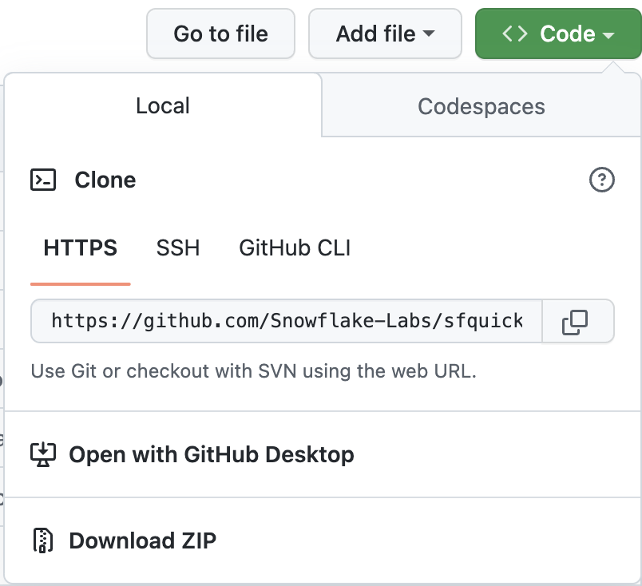

authors: Jeremiah Hansen
id: data_engineering_pipelines_with_snowpark_python
summary: This guide will provide step-by-step details for building data engineering pipelines with Snowpark Python
categories: data-engineering
environments: web
status: Published 
feedback link: https://github.com/Snowflake-Labs/sfguides/issues
tags: Data Engineering, Snowpark, Python

# Data Engineering Pipelines with Snowpark Python
<!-- ------------------------ -->
## Overview 
Duration: 15

> "Data engineers are focused primarily on building and maintaining data pipelines that transport data through different steps and put it into a usable state ... The data engineering process encompasses the overall effort required to create **data pipelines** that automate the transfer of data from place to place and transform that data into a specific format for a certain type of analysis. In that sense, data engineering isn’t something you do once. It’s an ongoing practice that involves collecting, preparing, transforming, and delivering data. A data pipeline helps automate these tasks so they can be reliably repeated. It’s a practice more than a specific technology." (From Cloud Data Engineering for Dummies, Snowflake Special Edition)

Are you interested in unleashing the power of Snowpark Python to build data engineering pipelines? Well then this Quickstart is for you! The focus here will be on building data engineering pipelines with Python, and not on data science. For examples of doing data science with Snowpark Python please check out our [Machine Learning with Snowpark Python: - Credit Card Approval Prediction](https://quickstarts.snowflake.com/guide/getting_started_snowpark_machine_learning/index.html?index=..%2F..index#0) Quickstart.

This Quickstart will cover a lot of ground, and by the end you will have built a robust data engineering pipeline using Snowpark Python stored procedures. That pipeline will process data incrementally, be orchestrated with Snowflake tasks, and be deployed via a CI/CD pipeline. You'll also learn how to use Snowflake's new developer CLI tool and Visual Studio Code extension! Here's a quick visual overview:


So buckle up and get ready!

**Note**: As of 1/21/2023, the following features/tools used in this Quickstart are still in preview:
* [Snowflake Visual Studio Code Extension](https://marketplace.visualstudio.com/items?itemName=snowflake.snowflake-vsc)
* [snowcli](https://github.com/Snowflake-Labs/snowcli)

### Prerequisites
* Familiarity with Python
* Familiarity with the DataFrame API
* Familiarity with Snowflake
* Familiatity with Git repositories and GitHub

### What You’ll Learn
You will learn about the following Snowflake features during this Quickstart:

* Snowflake Tables (not file-based)
* Data ingestion with COPY
* Schema inference
* Data sharing/marketplace (instead of ETL)
* Streams for incremental processing (CDC)
* Streams on views
* Python UDFs (with third-party packages)
* Python Stored Procedures
* Snowpark DataFrame API
* Snowpark Python programmability
* Warehouse elasticity (dynamic scaling)
* Visual Studio Code Snowflake native extension (PuPr, Git integration)
* SnowCLI (PuPr)
* Tasks (with Stream triggers)
* Task Observability
* GitHub Actions (CI/CD) integration

### What You’ll Need
You will need the following things before beginning:

* Snowflake
    * **A Snowflake Account**
    * **A Snowflake user created with ACCOUNTADMIN permissions**. This user will be used to get things setup in Snowflake.
* Anaconda
    * **Anaconda installed on your computer**. Check out the [Anaconda Installation](https://docs.anaconda.com/anaconda/install/) instructions for the details.
* SnowSQL
    * **SnowSQL installed on your computer**. Go to the [SnowSQL Download page](https://developers.snowflake.com/snowsql/) and see the [Installing SnowSQL](https://docs.snowflake.com/en/user-guide/snowsql-install-config.html) page for more details.
* Visual Studio Code with required extensions
    * **Visual Studio Code installed on your computer**. Check out the [Visual Studio Code](https://code.visualstudio.com/) homepage for a link to the download page.
    * **Python extension installed**. Search for and install the "Python" extension (from Microsoft) in the *Extensions* pane in VS Code.
    * **Snowflake extension installed**. Search for and install the "Snowflake" extension (from Snowflake) in the *Extensions* pane in VS Code.
* GitHub account with lab repository forked and cloned locally
    * **A GitHub account**. If you don't already have a GitHub account you can create one for free. Visit the [Join GitHub](https://github.com/signup) page to get started.

### What You’ll Build
During this Quickstart you will accomplish the following things:

* Load Parquet data to Snowflake using schema inference
* Setup access to Snowflake Martketplace data
* Create a Python UDF to convert temperature
* Create a data engineering pipeline with Python stored procedures to icrementally process data
* Orchestrate the pipelines with tasks
* Monitor the pipelines with Snowsight
* Deploy the Snowpark Python stored procedures via a CI/CD pipeline


<!-- ------------------------ -->
## Quickstart Setup
Duration: 10

### Fork and Clone Repository for Quickstart
You'll need to create a fork of the repository for this Quickstart in your GitHub account. Visit the [tko-data-engineering GitHub Repository](https://github.com/sfc-gh-jhansen/tko-data-engineering) repository and click on the "Fork" button near the top right. Complete any required fields and click "Create Fork".

Next you will need to clone your new forked repository to your local computer. For connection details about your new Git repository, open the Repository, click on the green "Code" icon near the top of the page and copy the "HTTPS" link.



Use that link in VS Code to clone the repo to your computer. Please follow the instructions at [Clone and use a GitHub repository in Visual Studio Code](https://learn.microsoft.com/en-us/azure/developer/javascript/how-to/with-visual-studio-code/clone-github-repository) for more details. You can also clone the repository from the command line, if that's more comfortable for you, by running the following commands:

```bash
git clone <repo-url>
cd sfquickkstart-data-engineering-pipelines-with-snowpark-python/
```

Once the forked respository has been cloned to your local computer open the folder with VS Code.

### Configure Credentials
We will not be directly using [the SnowSQL command line client](https://docs.snowflake.com/en/user-guide/snowsql.html) for this Quickstart, but we will be storing our Snowflake connection details in the SnowSQL config file located at `~/.snowsql/config`. If that SnowSQL config file does not exist, please create an empty one.

Create a SnowSQL configuration for this lab by adding the following section to your `~/.snowsql/config` file (replacing the account, username, and password with your values):

```
[connections.dev]
account = myaccount
username = myusername
password = mypassword
rolename = HOL_ROLE
warehousename = HOL_WH
dbname = HOL_DB
```

### Create Anaconda Environment
Create and active a conda environment for this lab using the supplied `conda_env.yml` file. Run these commands from a terminal in the root of your local forked repository.

```bash
conda env create -f conda_env.yml
conda activate pysnowpark
```


<!-- ------------------------ -->
## Step 01: Setup Snowflake
Duration: 10

### Snowflake Extensions for VS Code
You can run SQL queries against Snowflake in many different ways (through the Snowsight UI, SnowSQL, etc.) but for this Quickstart we'll be using the Snowflake extension for VS Code. For a brief overview of Snowflake's native extension for VS Code, please check out our [VS Code Marketplace Snowflake extension page](https://marketplace.visualstudio.com/items?itemName=snowflake.snowflake-vsc).

### Run the Script
To set up all the objects we'll need in Snowflake for this Quickstart you'll need to run the `steps/01_setup.sql` script.

Start by clicking on the Snowflake extension in the left navigation bar in VS Code. Then login to your Snowflake account with a user that has ACCOUNTADMIN permissions. Once logged in to Snowflake, open the `steps/01_setup.sql` script in VS Code by going back to the file Explorer in the left navigation bar.

To execute multiple queries, select the ones you want to run and press CMD/CTRL+Enter. You can also use the "Execute All Statements" button in the upper right corner of the editor window to run all queries in the current file.


<!-- ------------------------ -->
## Step 02: Load Raw
Duration: 10

During this step we will be loading the raw Tasty Bytes POS and Customer loyalty data from raw Parquet files in `s3://sfquickstarts/data-engineering-with-snowpark-python/` to our `RAW_POS` and `RAW_CUSTOMER` schemas in Snowflake. And we're going to do this in Python using the Snowpark Python API. To put this in context, we are on step **#2** in our data flow overview:


### Run the Script
To load the raw data, execute the `steps/02_load_raw.py` script. This can be done a number of ways in VS Code, from a terminal or directly by VS Code. The easiest to start with might be to execute it from the terminal. So open up a terminal in VS Code (Terminal -> New Terminal) in the top menu bar, then run the following commands (which assume that your terminal has the root of your repository open):

```bash
python 02_load_raw.py
```

While that is running, please open the script in VS Code and continue on this page to understand what is happening.

### Running Snowpark Python Locally
In this step you will be running the Snowpark Python code locally from your laptop. At the bottom of the script is a block of code that is used for local debugging (under the `if __name__ == "__main__":` block):

```python
# For local debugging
if __name__ == "__main__":
    # Add the utils package to our path and import the snowpark_utils function
    import os, sys
    current_dir = os.getcwd()
    parent_dir = os.path.dirname(current_dir)
    sys.path.append(parent_dir)

    from utils import snowpark_utils
    session = snowpark_utils.get_snowpark_session()

    load_all_raw_tables(session)
#    validate_raw_tables(session)

    session.close()
```

A few things to point out here. First, the Snowpark session is being created in the `utils/snowpark_utils.py` module. It has multiple methods for obtaining your credentials, and for this Quickstart it pulls them from the SnowSQL config file located at `~/.snowsql/config`. For more details please check out the code for the [utils/snowpark_utils.py module](https://github.com/sfc-gh-jhansen/tko-data-engineering/blob/main/utils/snowpark_utils.py).

Then after getting the Snowpark session it calls the `load_all_raw_tables(session)` method which does the heavy lifting. The next few sections will point out the key parts.

Finally, almost all of the Python scripts in this Quickstart include a local debugging block. Later on we will create Snowpark Python stored procedures and UDFs and those Python scripts will have a similar block. So this pattern is important to understand.

### Schema Inference

One very helpful feature in Snowflake is the ability to infer the schema of files in a stage that you wish to work with. This is accomplished in SQL with the [`INFER_SCHEMA()`](https://docs.snowflake.com/en/sql-reference/functions/infer_schema.html) function. The Snowpark Python API does this for you automatically when you call the `session.read()` method. Here is the code snippet:

```python
    # we can infer schema using the parquet read option
    df = session.read.option("compression", "snappy") \
                            .parquet(location)
```

### Data Ingestion with COPY

In order to load the data into a Snowflake table we will use the `copy_into_table()` method on a dataframe. This method will create the target table in Snoflake use the inferred schema and then call the highly optimized Snowflake [`COPY INTO &lt;table&gt;` Command](https://docs.snowflake.com/en/sql-reference/sql/copy-into-table.html). Here is the code snippet:

```python
    df.copy_into_table("{}".format(tname))
```

### Snowflake Tables (Not File-Based)

One of the major advantages of Snowflake is being able to eliminate the need to manage a file-based data lake. And Snowflake was designed for this purpose from the beginning. In the step we are loading the raw data into a Snowflake managed table. Snowflake tables can natively support structued and semi-structure data and are stored in Snowflake's mature cloud table format.

Once loaded into Snowflake the data will be securely stored and managed, without the need to worry about securing and managing raw files. Additionally the data, whether raw or structured, can be transformed and querying in Snowflake using SQL or the language of your choice, without needing to manage separate compute services like Spark.

This is a huge advantage for Snowflake customers.


### Warehouse Elasticity (Dynamic Scaling)

With Snowflake there is only one type of user defined compute cluster, the [Virtual Warehouse](https://docs.snowflake.com/en/user-guide/warehouses.html), regardless of the language you use to process that data (SQL, Python, Java, Scala, Javascript, etc.). This makes working with data much simpler in Snowflake. And governance of the data is completely separated from the compute cluster, in other words there is no way to get around Snowflake governance regardless of the warehouse settings or language being used.

And these virtual warehouses can be dynamically scaled, in under a second for most sized warehouses! This means that in your code you can dynamically resize the compute environment to increase the amount of capacity to run a section of code in a fraction of the time, and then dynamically resized again to reduce the amount of capacity. And because of our per-second billing (with a sixty second minimum) you won't pay any extra to run that section of code in a fraction of the time!

Let's see how easy that is done. Here is the code snippet:

```python
    _ = session.sql("ALTER WAREHOUSE HOL_WH SET WAREHOUSE_SIZE = XLARGE").collect()

    # Some data processing code

    _ = session.sql("ALTER WAREHOUSE HOL_WH SET WAREHOUSE_SIZE = XSMALL").collect()
```

We will use this pattern a few more times during this Quickstart, so it's important to understand.


<!-- ------------------------ -->
## Step 03: Load Weather
Duration: 4

During this step we will be "loading" the raw weather data to Snowflake. But "loading" is the really the wrong word here. Because we're using Snowflake's unique data sharing capability we don't actually need to copy the data to our Snowflake account with a custom ETL process. Instead we can directly access the weather data shared by Weather Source in the Snowflake Data Marketplace. To put this in context, we are on step **#3** in our data flow overview:


### Snowflake Data Marketplace
Weather Source is a leading provider of global weather and climate data and their OnPoint Product Suite provides businesses with the necessary weather and climate data to quickly generate meaningful and actionable insights for a wide range of use cases across industries. Let's connect to the `Weather Source LLC: frostbyte` feed from Weather Source in the Snowflake Data Marketplace by following these steps:

* Login to Snowsight
* Click on the `Marketplace` link in the left navigation bar
* Enter "Weather Source LLC: frostbyte" in the search box and click return
* Click on the "Weather Source LLC: frostbyte" listing tile
* Click the blue "Get" button
    * Expand the "Options" dialog
    * Change the "Database name" to read "FROSTBYTE_WEATHERSOURCE" (all capital letters)
    * Select the "HOL_ROLE" role to have access to the new database
* Click on the blue "Get" button

That's it... we don't have to do anything from here to keep this data updated. The provider will do that for us and data sharing means we are always seeing whatever they they have published. How amazing is that? Just think of all the things you didn't have do here to get access to an always up-to-date, third-party dataset?

### Run the Script
Open the `steps/03_load_weather.sql` script in VS Code from the file Explorer in the left navigation bar, and run the script. Notice how easy it is to query data shared through the Snowflake Marketplace! You access it just like any other table or view in Snowflake:

```sql
SELECT * FROM FROSTBYTE_WEATHERSOURCE.ONPOINT_ID.POSTAL_CODES LIMIT 100;
```


<!-- ------------------------ -->
## Step 04: Create POS View
Duration: 10

During this step we will be creating a view to simplify the raw POS schema by joining together 6 different tables and picking only the columns we need. But what's really cool is that we're going to define that view with the Snowpark DataFrame API! Then we're going to create a Snowflake stream on that view so that we can incrementally process changes to any of the POS tables. To put this in context, we are on step **#4** in our data flow overview:


### Run the Script
To create the view and stream, execute the `steps/04_create_pos_view.py` script. Like we did in step 2, let's execute it from the terminal. So open up a terminal in VS Code (Terminal -> New Terminal) in the top menu bar, then run the following commands (which assume that your terminal has the root of your repository open):

```bash
python 04_create_pos_view.py
```

While that is running, please open the script in VS Code and continue on this page to understand what is happening.

### Snowpark DataFrame API
The first thing you'll notice in the `create_pos_view()` function is that we define the Snowflake view using the Snowpark DataFrame API. After defining the final DataFrame, which captures all the logic we want in the view, we can simply call the Snowpark `create_or_replace_view()` method. Here's the final line from the `create_pos_view()` function:

```python
    final_df.create_or_replace_view('POS_FLATTENED_V')
```

For more details about the Snowpark Python DataFrame API, please check out our [Working with DataFrames in Snowpark Python](https://docs.snowflake.com/en/developer-guide/snowpark/python/working-with-dataframes.html) page.

### Streams for Incremental Processing (CDC)
Snowflake makes processing data incrementally very easy. Traditionally the data engineer had to keep track of a high watermark (usually a datetime column) in order to process only new records in a table. This involved tracking and persisting that watermark somewhere and then using it in any query against the source table. But with Snowflake streams all the heavy lifting is done for you by Snowflake. For more details please check out our [Change Tracking Using Table Streams](https://docs.snowflake.com/en/user-guide/streams.html) user guide.

All you need to do is create a [`STREAM`](https://docs.snowflake.com/en/sql-reference/sql/create-stream.html) object in Snowflake against your base table or view, then query that stream just like any table in Snowflake. The stream will return only the changed records since the last DML option your performed. To help you work with the changed records, Snowflake streams will supply the following metadata columns along with the base table or view columns:

* METADATA$ACTION
* METADATA$ISUPDATE
* METADATA$ROW_ID

For more details about these stream metadata columns please check out the [Stream Columns](https://docs.snowflake.com/en/user-guide/streams-intro.html#stream-columns) section in our documentation.

### Streams on views
What's really cool about Snowflake's incremental/CDC stream capability is the ability to create a stream on a view! In this example we are creating a stream on a view which joins together 6 of the raw POS tables. Here is the code to do that:

```python
def create_pos_view_stream(session):
    session.use_schema('HARMONIZED')
    _ = session.sql('CREATE OR REPLACE STREAM POS_FLATTENED_V_STREAM \
                        ON VIEW POS_FLATTENED_V \
                        SHOW_INITIAL_ROWS = TRUE').collect()
```

Now when we query the `POS_FLATTENED_V_STREAM` stream to find changed records, Snowflake is actually looking for changed records in any of the 6 tables included in the view. For those who have tried to build incremental/CDC processes around denormalized schemas like this, you will appreciate the incredibly powerful feature that Snowflake provides here.

For more details please check out the [Streams on Views](https://docs.snowflake.com/en/user-guide/streams-intro.html#streams-on-views) section in our documentation.


<!-- ------------------------ -->
## Conclusion
Duration: 1

At the end of your Snowflake Guide, always have a clear call to action (CTA). This CTA could be a link to the docs pages, links to videos on youtube, a GitHub repo link, etc. 


### What we've covered
We've covered a ton in this Quickstart, and here are the highlights:

* Snowflake Tables (not file-based)
* Data ingestion with COPY
* Schema inference
* Data sharing/marketplace (instead of ETL)
* Streams for incremental processing (CDC)
* Streams on views
* Python UDFs (with third-party packages)
* Python Stored Procedures
* Snowpark DataFrame API
* Snowpark Python programmability
* Warehouse elasticity (dynamic scaling)
* Visual Studio Code Snowflake native extension (PuPr, Git integration)
* SnowCLI (PuPr)
* Tasks (with Stream triggers)
* Task Observability
* GitHub Actions (CI/CD) integration


<!-- ------------------------ -->
## Extra
Duration: 2

### Info Boxes
> aside positive
> 
>  This will appear in a positive info box.

> aside negative
> 
>  This will appear in a negative info box.

### Buttons
<button>

  [This is a download button](link.com)
</button>

### Videos
Videos from youtube can be directly embedded:
<video id="KmeiFXrZucE"></video>
