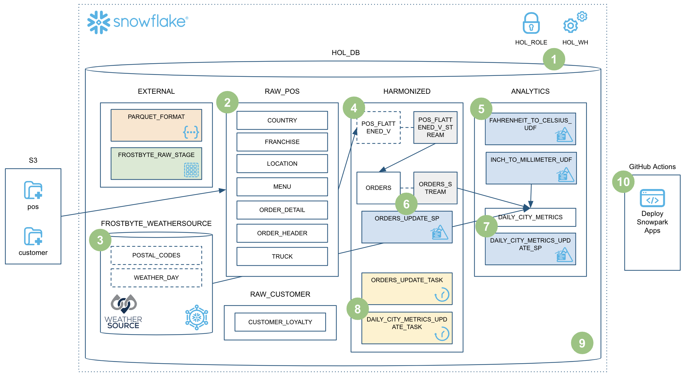
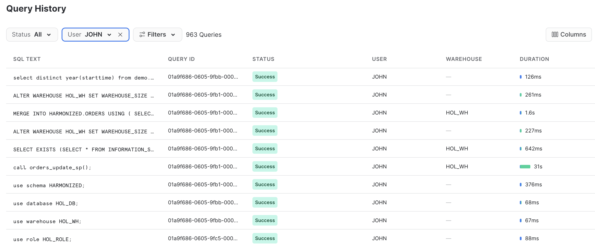
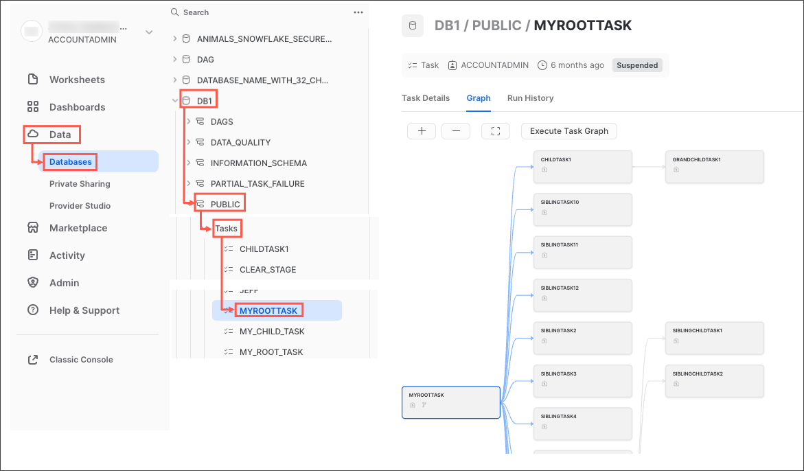
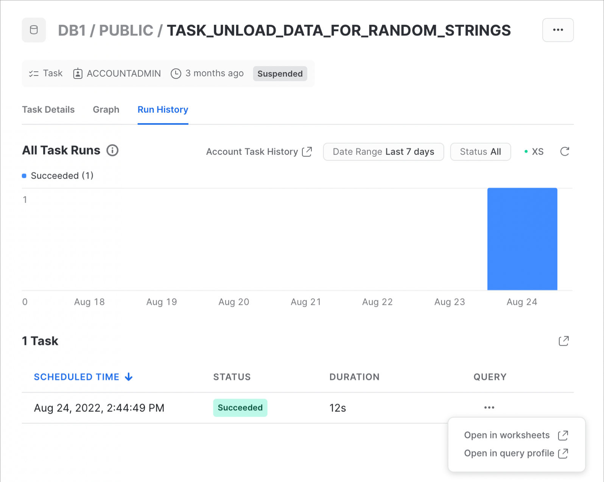
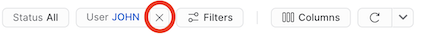
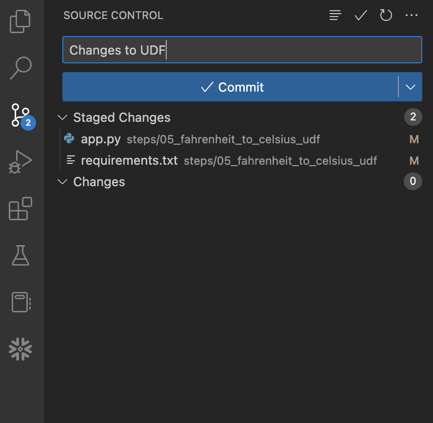
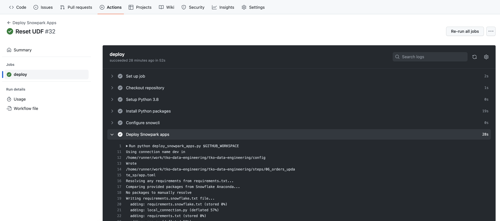

authors: Jeremiah Hansen
id: data_engineering_pipelines_with_snowpark_python_ja
summary: このガイドでは、Snowpark Pythonカテゴリーを使用してデータエンジニアリングパイプラインを構築する方法について詳細に説明します。
categories: featured,data-engineering
environments: web
status: Published 
feedback link: https://github.com/Snowflake-Labs/sfguides/issues
tags: Data Engineering, Snowpark, Python, ja

# Snowpark Pythonによるデータエンジニアリングパイプライン

<!-- ------------------------ -->
## 概要

duration: 15

> 「データエンジニアは、さまざまな手順でデータを転送し、データを使用可能な状態にするデータパイプラインの構築と保守に重点を置いています。データエンジニアリングプロセスには、場所から場所へのデータ転送を自動化し、そのデータを特定の種類の分析に使用できるように特定の形式に変換する**データパイプライン**の作成に必要な作業全体が含まれます。その意味で、データエンジニアリングは一度だけ行うものではありません。データの収集、準備、変換、提供に関連する継続的な作業です。データパイプラインは、これらのタスクを自動化して確実に反復するのに役立ちます。これは、特定のテクノロジーというよりもプラクティスです」（「初心者向けクラウドデータエンジニアリング」、Snowflake特別版）

Snowpark Pythonの機能を活用してデータエンジニアリングパイプラインを構築したい場合は、このクイックスタートが最適です。ここでは、データサイエンスではなく、Pythonによるデータエンジニアリングパイプラインの構築に焦点を当てます。Snowpark Pythonによるデータサイエンスの例については、「[Snowpark Pythonによる機械学習：](https://quickstarts.snowflake.com/guide/getting_started_snowpark_machine_learning/index.html?index=..%2F..index#0)[](https://quickstarts.snowflake.com/guide/getting_started_snowpark_machine_learning/index.html?index=..%2F..index#0)[- クレジットカード承認予測](https://quickstarts.snowflake.com/guide/getting_started_snowpark_machine_learning/index.html?index=..%2F..index#0)」クイックスタートを参照してください。

このクイックスタートは広範囲をカバーしており、最終的にはSnowpark Pythonストアドプロシージャを使用して堅牢なデータエンジニアリングパイプラインを構築できるようになります。このパイプラインはデータを段階的に処理し、Snowflakeタスクとオーケストレーションされ、CI/CDパイプラインで展開されます。また、Snowflakeの新しい開発者向けCLIツールとVisual Studio Code拡張機能の使用方法も学習します。以下に簡単な概要を図で示します。


では、準備をはじめましょう。

> aside negative
> 
> **注意** - 2023年2月1日現在、[Snowflake Visual Studio Code拡張機能](https://marketplace.visualstudio.com/items?itemName=snowflake.snowflake-vsc)と[SnowCLIツール](https://github.com/Snowflake-Labs/snowcli)は両方ともまだプレビュー中です。

### 前提条件

* Pythonに精通していること
* DataFrame APIに精通していること
* Snowflakeに精通していること
* GitレポジトリとGitHubに精通していること

### 学習する内容

このクイックスタートでは、次のSnowflake機能について学習します。

* Snowflakeのテーブルフォーマット
* COPYによるデータの取り込み
* スキーマ推論
* データシェアリング/マーケットプレイス（ETLの代わり）
* 段階的な処理のためのストリーム（CDC）
* ビューに対するストリーム
* Python UDF（サードパーティパッケージを使用）
* Pythonストアドプロシージャ
* Snowpark DataFrame API
* Snowpark Pythonプログラマビリティ
* ウェアハウスの伸縮性（動的スケーリング）
* Visual Studio Code Snowflakeネイティブ拡張（PuPr、Git統合）
* SnowCLI（PuPr）
* タスク（ストリームトリガーを使用）
* タスクの監視
* GitHubアクション（CI/CD）の統合

### 必要なもの

始める前に以下のものが必要です。

* Snowflake
  * **Snowflakeアカウント**
  * **アカウント管理者権限で作成されたSnowflakeユーザー**。このユーザーは、Snowflakeでの設定に使用されます。
  * **同意された****Anaconda利用規約。**[サードパーティパッケージ](https://docs.snowflake.com/ja/developer-guide/udf/python/udf-python-packages.html#getting-started)の「はじめに」セクションを参照してください。
* Miniconda
  * **コンピュータにインストールされたMiniconda。**[Miniconda](https://conda.io/miniconda.html)をダウンロードしてインストールします。または、Python 3.8で他のPython環境を使用することもできます。
* SnowSQL
  * **コンピュータにインストールされたSnowSQL。**詳細については、[SnowSQLのダウンロードページ](https://developers.snowflake.com/snowsql/)にアクセスし、「[SnowSQLのインストール](https://docs.snowflake.com/ja/user-guide/snowsql-install-config.html)」ページを参照してください。
* Git
  * **コンピュータにインストールされたGit。**詳細については、「[はじめに - Gitのインストール](https://git-scm.com/book/en/v2/Getting-Started-Installing-Git)」ページを参照してください。
  * **ユーザー名とメールアドレスが設定されたGit**。まだ設定していない場合は、ローカルコンピュータで[Gitのユーザー名](https://docs.github.com/en/get-started/getting-started-with-git/setting-your-username-in-git#setting-your-git-username-for-every-repository-on-your-computer)と[メールアドレスを設定](https://docs.github.com/en/account-and-profile/setting-up-and-managing-your-personal-account-on-github/managing-email-preferences/setting-your-commit-email-address#setting-your-email-address-for-every-repository-on-your-computer)してください。
* Visual Studio Codeと必要な拡張機能
  * **コンピュータにインストールされたVisual Studio Code**。ダウンロードページへのリンクについては、[Visual Studio Code](https://code.visualstudio.com/)のホームページを確認してください。
  * **インストールされたPython拡張機能。**VS Codeの「拡張機能」ペインで「Python」拡張機能を検索し、（Microsoftから）インストールします。
  * **インストールされたSnowflake拡張機能。**VS Codeの「拡張機能」ペインで「Snowflake」拡張機能を検索し、（Snowflakeから）インストールします。
* ラボのレポジトリがフォークされ、ローカルにクローンされているGitHubアカウント
  * **GitHubアカウント**。まだGitHubアカウントを持っていない場合は、無料で作成できます。はじめに、[Join GitHub](https://github.com/signup)ページをご覧ください。

### 構築するもの

このクイックスタートでは、次のことを実行します。

* スキーマ推論を使用してParquetデータをSnowflakeにロードする
* Snowflakeマーケットプレイスデータへのアクセスを設定する
* 温度を変換するPython UDFを作成する
* Pythonストアドプロシージャを使用してデータエンジニアリングパイプラインを作成し、データを段階的に処理する
* パイプラインをタスクとオーケストレーションする
* Snowsightでパイプラインをモニタリングする
* Snowpark PythonストアドプロシージャをCI/CDパイプラインで展開する

<!-- ------------------------ -->
## クイックスタート設定

duration:10

### クイックスタート用レポジトリのフォークとクローン

GitHubアカウントでこのクイックスタート用レポジトリのフォークを作成する必要があります。[Snowpark Python関連のGitHubレポジトリを含むデータエンジニアリングパイプライン](https://github.com/Snowflake-Labs/sfguide-data-engineering-with-snowpark-python)にアクセスし、右上の「フォーク」ボタンをクリックします。必須フィールドに入力し、「フォークを作成」をクリックします。

デフォルトでは、GitHubアクションはフォークしたレポジトリで定義されているワークフロー（またはCI/CDパイプライン）を無効にします。このレポジトリには、Snowpark Python UDFとストアドプロシージャを展開するワークフローが含まれています。このワークフローは後で使用します。そのため、現時点では、GitHubでフォークしたレポジトリを開き、ページ中央上部の「`Actions`」タブをクリックして、緑の「`I understand my workflows, go ahead and enable them`」ボタンをクリックすることで、このワークフローを有効にします。


次に、新しくフォークしたレポジトリをローカルコンピュータにクローンする必要があります。新しいGitレポジトリの接続の詳細については、レポジトリを開き、ページ上部付近にある緑色の「コード」アイコンをクリックして「HTTPS」リンクをコピーします。


そのリンクをVS Codeで使用して、コンピュータにレポジトリをクローンします。詳細については、「[Visual Studio CodeでGitHubレポジトリをクローンして使用する](https://learn.microsoft.com/en-us/azure/developer/javascript/how-to/with-visual-studio-code/clone-github-repository)」の手順に従ってください。必要に応じて、次のコマンドを実行して、コマンドラインからレポジトリをクローンすることもできます。

```bash
git clone <your-forked-repo-url>
cd sfguide-data-engineering-with-snowpark-python/
```

フォークしたレポジトリがローカルコンピュータにクローンされたら、そのフォルダをVS Codeで開きます。

### 認証情報の設定

このクイックスタートでは、[SnowSQLコマンドラインクライアント](https://docs.snowflake.com/ja/user-guide/snowsql.html)を直接使用しませんが、`~/.snowsql/config`にあるSnowSQL構成ファイルにSnowflake接続の詳細を保存します。SnowSQL構成ファイルが存在しない場合は、空のファイルを作成してください。

次のセクションを`~/.snowsql/config`ファイルに追加して、このラボ用のSnowSQL構成を作成します（accountname、username、passwordを実際の値に置き換えます）。

```
[connections.dev]
accountname = myaccount
username = myusername
password = mypassword
rolename = HOL_ROLE
warehousename = HOL_WH
dbname = HOL_DB
```

**注意：**SnowCLIツール（ひいてはこのクイックスタート）は、現在のところキーペア認証では機能しません。共有SnowSQL構成ファイルからユーザー名とパスワードの詳細を取得するだけです。

### Anaconda環境の作成

提供された`conda_env.yml`ファイルを使用して、このラボ用のconda環境を作成してアクティブにします。ローカルのフォークしたレポジトリのルートにあるターミナルから次のコマンドを実行します。

```bash
conda env create -f conda_env.yml
conda activate pysnowpark
```

<!-- ------------------------ -->
## Snowflakeの設定

duration:10

### VS Code用のSnowflake拡張機能

Snowflakeに対してさまざまな方法（Snowsight UI、SnowSQLなど）でSQLクエリを実行できますが、このクイックスタートではVS Code用のSnowflake拡張機能を使用します。SnowflakeのVS Code用ネイティブ拡張機能の概要については、[VS CodeマーケットプレイスのSnowflake拡張機能ページ](https://marketplace.visualstudio.com/items?itemName=snowflake.snowflake-vsc)を参照してください。

### スクリプトの実行

このクイックスタートでSnowflakeに必要なすべてのオブジェクトを設定するには、`steps/01_setup_snowflake.sql`スクリプトを実行する必要があります。

まず、VS Codeの左側のナビゲーションバーにあるSnowflake拡張機能をクリックします。次に、アカウント管理者権限を持つユーザーでSnowflakeアカウントにログインします。Snowflakeにログインしたら、左側のナビゲーションバーにあるファイルエクスプローラーに戻って、VS Codeで`steps/01_setup_snowflake.sql`スクリプトを開きます。

このスクリプト内のすべてのクエリを実行するには、エディタウィンドウの右上にある「すべてのステートメントを実行」ボタンを使用します。または、複数のチャンクに分けて実行したい場合は、実行するクエリをハイライトしてCMD/CTRL+Enterキーを押します。

<!-- ------------------------ -->
## 未加工ファイルのロード

duration:10

このステップでは、未加工のTasty Bytes POSデータとカスタマーロイヤルティデータを、`s3://sfquickstarts/data-engineering-with-snowpark-python/`にある未加工のParquetファイルから、Snowflakeの`RAW_POS`スキーマと`RAW_CUSTOMER`スキーマにロードします。さらに、Snowpark Python APIを使用して、ノートパソコンからPythonでこのプロセスをオーケストレーションします。これは、コンテキストの中では、データフローの概要のステップ**#2**に当たります。


### スクリプトの実行

未加工データをロードするには、`steps/02_load_raw.py`スクリプトを実行します。これはVS Codeでいくつかの方法で実行できます。ターミナルから実行することも、VS Codeで直接実行することもできます。このデモでは、ターミナルからPythonスクリプトを実行する必要があります。上部のメニューバーにあるVS Codeでターミナルを開き（「ターミナル」 -> 「新しいターミナル」）、`pysnowpark` conda環境がアクティブであることを確認してから、次のコマンドを実行します（ターミナルでレポジトリのルートが開いていることを前提とします）。

```bash
cd steps
python 02_load_raw.py
```

このコマンドを実行している間、VS Codeでスクリプトを開いてこのページを読み進め、何が起こっているのかを理解してください。

### ローカルでのSnowpark Pythonの実行

このステップでは、ノートパソコンからローカルでSnowpark Pythonコードを実行します。スクリプトの下部に、ローカルデバッグに使用するコードブロックがあります（`if __name__ == "__main__":`ブロックの下）。

```python
# For local debugging
if __name__ == "__main__":
    # Add the utils package to our path and import the snowpark_utils function
    import os, sys
    current_dir = os.getcwd()
    parent_dir = os.path.dirname(current_dir)
    sys.path.append(parent_dir)

    from utils import snowpark_utils
    session = snowpark_utils.get_snowpark_session()

    load_all_raw_tables(session)
#    validate_raw_tables(session)

    session.close()
```

ここでいくつか注意すべき点があります。まず、Snowparkセッションは`utils/snowpark_utils.py`モジュールで作成されます。このモジュールには認証情報を取得するための複数のメソッドがあり、このクイックスタートでは、`~/.snowsql/config`にあるSnowSQL構成ファイルから取得します。詳細については、[utils/snowpark_utils.pyモジュール](https://github.com/Snowflake-Labs/sfguide-data-engineering-with-snowpark-python/blob/main/utils/snowpark_utils.py)のコードを参照してください。

次に、Snowparkセッションを取得した後、手間のかかる作業を行う`load_all_raw_tables(session)`メソッドを呼び出します。次のいくつかのセクションでは、主要な部分について説明します。

最後に、このクイックスタートのほぼすべてのPythonスクリプトには、ローカルデバッグブロックが含まれています。後でSnowpark PythonストアドプロシージャやUDFを作成しますが、それらのPythonスクリプトにも同様のブロックがあります。そのため、このパターンを理解することが重要です。

### Snowflakeで起こったことの確認

Snowflakeの[クエリ履歴](https://docs.snowflake.com/ja/user-guide/ui-snowsight-activity.html#query-history)は非常に強力な機能で、Snowflakeアカウントに対して実行されたすべてのクエリを、どのツールやプロセスがそれを開始したかに関係なくログに記録します。これは、クライアントツールやAPIを使用する場合に特に役立ちます。

先ほど実行したPythonスクリプトは、ローカルで少量の作業を行いました。基本的には、各テーブルをループし、データをロードするためのコマンドをSnowflakeに発行することで、プロセスをオーケストレーションするだけです。一方、手間のかかる作業はすべてSnowflake内部で実行されました。このプッシュダウンはSnowpark APIの特徴であり、これによってSnowflakeのスケーラビリティとコンピューティングパワーを活用できるようになります。

Snowflakeアカウントにログインし、Snowpark APIによって生成されたSQLを簡単に見てみましょう。これにより、APIが行っていることに関する理解が深まり、問題が発生した場合のデバッグに役立ちます。


### スキーマ推論

Snowflakeの非常に便利な機能の1つに、作業したいステージのファイルのスキーマを推論する機能があります。これは、SQLでは[`INFER_SCHEMA()`](https://docs.snowflake.com/ja/sql-reference/functions/infer_schema.html)関数で実行されます。Snowpark Python APIでは、`session.read()`メソッドを呼び出すと自動的に実行されます。コードスニペットは次のとおりです。

```python
    # we can infer schema using the parquet read option
    df = session.read.option("compression", "snappy") \
                            .parquet(location)
```

### COPYによるデータの取り込み

データをSnowflakeテーブルにロードするために、DataFrameに対して`copy_into_table()`メソッドを使用します。このメソッドは、推論されたスキーマ（存在しない場合）を使用してSnowflakeでターゲットテーブルを作成し、高度に最適化されたSnowflake `COPY INTO &lt;table&gt;`[コマンド](https://docs.snowflake.com/ja/sql-reference/sql/copy-into-table.html)を呼び出します。コードスニペットは次のとおりです。

```python
    df.copy_into_table("{}".format(tname))
```

### Snowflakeのテーブルフォーマット

Snowflakeの大きな利点の1つは、ファイルベースのデータレイクを管理する必要がなくなることです。Snowflakeは最初からこの目的のために設計されました。このステップでは、未加工データを構造化されたSnowflake管理テーブルにロードしています。しかし、Snowflakeテーブルは構造化データおよび半構造化データをネイティブにサポートでき、Snowflakeの成熟したクラウドテーブルフォーマット（Hudi、Delta、Icebergよりも前から存在しています）に保存されます。

Snowflakeにロードされたデータは安全に保存および管理されます。未加工ファイルの保護や管理について心配する必要はありません。さらに、データは、未加工データであろうと構造化データであろうと、SnowflakeでSQLまたは好みの言語を使用して変換およびクエリできます。Sparkなどのコンピュートサービスを別途管理する必要はありません。

これはSnowflakeユーザーにとって大きなメリットです。

### ウェアハウスの伸縮性（動的スケーリング）

Snowflakeでは、データの処理に使用する言語（SQL、Python、Java、Scala、Javascriptなど）に関係なく、ユーザー定義のコンピュートクラスタは[仮想ウェアハウス](https://docs.snowflake.com/ja/user-guide/warehouses.html)の1種類のみです。このため、Snowflakeでのデータ操作が非常にシンプルになります。また、データのガバナンスはコンピュートクラスタから完全に分離されています。つまり、ウェアハウスの設定や使用する言語に関係なく、Snowflakeのガバナンスをくぐり抜けることはできません。

また、これらの仮想ウェアハウスは、ほとんどの規模のウェアハウスで1秒以内に動的にスケーリングできます。つまり、コードのセクションを短時間で実行するために、コード内でコンピュート環境のサイズを動的に変更して容量を増やした後、再度動的にサイズを変更して容量を減らすことができます。また、秒単位で課金されるため（最低60秒）、コードのセクションを短時間で実行するために追加料金を支払う必要はありません。

どれほど簡単か見てみましょう。コードスニペットは次のとおりです。

```python
    _ = session.sql("ALTER WAREHOUSE HOL_WH SET WAREHOUSE_SIZE = XLARGE WAIT_FOR_COMPLETION = TRUE").collect()

    # Some data processing code

    _ = session.sql("ALTER WAREHOUSE HOL_WH SET WAREHOUSE_SIZE = XSMALL").collect()
```

最初の`ALTER WAREHOUSE`ステートメントに`WAIT_FOR_COMPLETION`パラメータが含まれていることに注意してください。このパラメータを`TRUE`に設定すると、すべてのコンピューティングリソースがサイズ変更されて準備が整うまで、`ALTER WAREHOUSE`コマンドの戻りがブロックされます。このようにして、クラスターでデータを処理する前にクラスター全体が利用可能であることを確認します。

このクイックスタートではこのパターンをあと数回使用するため、十分に理解しておくことが重要です。

<!-- ------------------------ -->
## 気候データのロード

duration:4

このステップでは、未加工の気象データをSnowflakeに「ロード」します。しかし、ここでは「ロード」という言葉は実際には正しくありません。Snowflake独自のデータシェアリング機能を使用しているため、実際にはカスタムETLプロセスでデータをSnowflakeアカウントにコピーする必要はありません。代わりに、SnowflakeマーケットプレイスでWeather Sourceが共有する気象データに直接アクセスできます。これは、コンテキストの中では、データフローの概要のステップ**#3**に当たります。


### Snowflakeマーケットプレイス

Weather Sourceは、世界の気象および気候データを提供するリーディングプロバイダーであり、同社のOnPoint Product Suiteは、企業がさまざまな業界の広範なユースケースに適用できる有意義で実用的なインサイトを迅速に生成するために必要な気象および気候データを提供しています。次の手順に従って、SnowflakeマーケットプレイスのWeather Sourceから`Weather Source LLC: frostbyte`フィードに接続しましょう。

* Snowsightにログインする
* 左側のナビゲーションバーにある`Marketplace`リンクをクリックする
* 検索ボックスに「Weather Source LLC: frostbyte」と入力し、「返す」をクリックする
* 「Weather Source LLC: frostbyte」のリストタイルをクリックする
* 青の「取得」ボタンをクリックする
  * 「オプション」ダイアログを展開する
  * 「データベース名」を「FROSTBYTE_WEATHERSOURCE」（すべて大文字）に変更する
  * 「HOL_ROLE」ロールを選択して新しいデータベースにアクセスできるようにする
* 青の「取得」ボタンをクリックする

これで完了です。今後は何もしなくてもこのデータが最新の状態に保たれます。プロバイダーが代わりにデータを更新します。つまり、データシェアリングでは、プロバイダーが公開したものが何であれ、それを常に見ることができます。素晴らしいと思いませんか。考えてみてください。これまでは、常に最新のサードパーティデータセットにアクセスするためにさまざまなことを行う必要がありましたが、それらがすべて不要になったのです。

### スクリプトの実行

左側のナビゲーションバーにあるファイルエクスプローラーから、VS Codeで`steps/03_load_weather.sql`スクリプトを開き、スクリプトを実行します。Snowflakeマーケットプレイスで共有されたデータへのクエリがいかに簡単であるかに注意してください。Snowflakeの他のテーブルやビューと同じようにアクセスします。

```sql
SELECT * FROM FROSTBYTE_WEATHERSOURCE.ONPOINT_ID.POSTAL_CODES LIMIT 100;
```

<!-- ------------------------ -->
## POSビューの作成

duration:10

このステップでは、6つの異なるテーブルを結合し、必要な列のみを選択することで、未加工のPOSスキーマを簡素化するビューを作成します。しかし、本当に素晴らしいのは、Snowpark DataFrame APIを使用してそのビューを定義することです。次に、そのビューに対するSnowflakeストリームを作成し、POSテーブルの変更を段階的に処理できるようにします。これは、コンテキストの中では、データフローの概要のステップ**#4**に当たります。


### スクリプトの実行

ビューとストリームを作成するには、`steps/04_create_pos_view.py`スクリプトを実行します。ステップ2と同様に、ターミナルから実行しましょう。上部のメニューバーにあるVS Codeでターミナルを開き（「ターミナル」 -> 「新しいターミナル」）、`pysnowpark` conda環境がアクティブであることを確認してから、次のコマンドを実行します（ターミナルでレポジトリのルートが開いていることを前提とします）。

```bash
cd steps
python 04_create_pos_view.py
```

このコマンドを実行している間、VS Codeでスクリプトを開いてこのページを読み進め、何が起こっているのかを理解してください。

### Snowpark DataFrame API

`create_pos_view()`関数で最初に目を引くのは、Snowpark DataFrame APIを使用してSnowflakeビューを定義していることです。ビューに必要なロジックをすべて取り込む最終的なDataFrameを定義したら、Snowparkの`create_or_replace_view()`メソッドを呼び出すだけです。`create_pos_view()`関数の最後の行は次のとおりです。

```python
    final_df.create_or_replace_view('POS_FLATTENED_V')
```

Snowpark Python DataFrame APIの詳細については、「[Snowpark PythonでのDataFramesの使用](https://docs.snowflake.com/ja/developer-guide/snowpark/python/working-with-dataframes.html)」ページを参照してください。

### 段階的な処理のためのストリーム（CDC）

Snowflakeを使用すると、段階的なデータの処理が非常に簡単になります。従来、データエンジニアは、テーブル内の新しいレコードのみを処理するために、高基準値（通常は日時列）を追跡する必要がありました。そのため、基準値を追跡してどこかに保存し、ソーステーブルに対するクエリでそれを使用する必要がありました。しかし、Snowflakeストリームでは、手間のかかる作業はすべてSnowflakeが行います。詳細については、「[テーブルストリームを使用した変更追跡](https://docs.snowflake.com/ja/user-guide/streams.html)」ユーザーガイドを参照してください。

必要なのは、ベーステーブルまたはビューに対してSnowflakeで[`STREAM`](https://docs.snowflake.com/ja/sql-reference/sql/create-stream.html)オブジェクトを作成し、Snowflakeの他のテーブルと同様にそのストリームにクエリを実行することだけです。ストリームは、最後に実行したDMLオプション以降に変更されたレコードのみを返します。変更されたレコードを扱いやすくするために、Snowflakeストリームはベーステーブルまたはビュー列とともに次のメタデータ列を提供します。

* METADATA$ACTION
* METADATA$ISUPDATE
* METADATA$ROW_ID

これらのストリームメタデータ列の詳細については、ドキュメントの「[ストリーム列](https://docs.snowflake.com/ja/user-guide/streams-intro.html#stream-columns)」セクションを参照してください。

### ビューに対するストリーム

Snowflakeの段階的な/CDCストリーム機能の優れた点は、ビューに対してストリームを作成できることです。この例では、6つの未加工のPOSテーブルを結合するビューに対してストリームを作成しています。これを行うコードは次のとおりです。

```python
def create_pos_view_stream(session):
    session.use_schema('HARMONIZED')
    _ = session.sql('CREATE OR REPLACE STREAM POS_FLATTENED_V_STREAM \
                        ON VIEW POS_FLATTENED_V \
                        SHOW_INITIAL_ROWS = TRUE').collect()
```

ここで、変更されたレコードを見つけるために`POS_FLATTENED_V_STREAM`ストリームにクエリを実行すると、Snowflakeは実際にはビューに含まれる6つのテーブルの中から変更されたレコードを検索します。このような非正規化スキーマに関する段階的な/CDCプロセスを構築しようとしたことがある方であれば、Snowflakeがここで提供する信じられないほどパワフルな機能に感謝することでしょう。

詳細については、ドキュメントの「[ビューに対するストリーム](https://docs.snowflake.com/ja/user-guide/streams-intro.html#streams-on-views)」セクションを参照してください。

<!-- ------------------------ -->
## 華氏から摂氏への変換UDF

duration:10

このステップでは、最初のSnowpark Pythonオブジェクトであるユーザー定義関数（UDF）を作成し、Snowflakeに展開します。UDFから始めることは非常に基本的ですが、今後のステップではサードパーティのPythonパッケージを含むように更新します。また、このステップでは新しい開発者コマンドラインツールであるSnowCLIを紹介します。SnowCLIを使用することで、開発者はSnowpark Pythonオブジェクトの構築とSnowflakeへの展開を一貫した方法で行うことができます。SnowCLIの詳細については後述します。これは、コンテキストの中では、データフローの概要のステップ**#5**に当たります。


### ローカルでのUDFの実行

UDFをローカルでテストするには、`steps/05_fahrenheit_to_celsius_udf/app.py`スクリプトを実行します。前のステップと同様に、ターミナルから実行します。上部のメニューバーにあるVS Codeでターミナルを開き（「ターミナル」 -> 「新しいターミナル」）、`pysnowpark` conda環境がアクティブであることを確認してから、次のコマンドを実行します（ターミナルでレポジトリのルートが開いていることを前提とします）。

```bash
cd steps/05_fahrenheit_to_celsius_udf
python app.py 35
```

UDFを開発している間は、VS Codeでローカルに実行するだけです。また、UDFがSnowflakeのデータをクエリする必要がない場合、このプロセスは完全にローカルで実行されます。

### SnowflakeへのUDFの展開

SnowflakeにUDFを展開するには、SnowCLIツールを使用します。SnowCLIツールは、アプリケーションのパッケージ化、Snowflakeステージへのコピー、Snowflakeでのオブジェクトの作成といった手間のかかる作業をすべて行います。前のステップと同様に、ターミナルから実行します。上部のメニューバーにあるVS Codeでターミナルを開き（「ターミナル」 -> 「新しいターミナル」）、`pysnowpark` conda環境がアクティブであることを確認してから、次のコマンドを実行します（ターミナルでレポジトリのルートが開いていることを前提とします）。

```bash
cd steps/05_fahrenheit_to_celsius_udf
snow function create
```

このコマンドを実行している間、VS Codeでスクリプトを開いてこのページを読み進め、何が起こっているのかを理解してください。

### SnowflakeでのUDFの実行

SnowflakeでUDFを実行するには、いくつかのオプションがあります。SnowflakeのUDFは、次のようにSQLで呼び出すことができます。

```sql
SELECT ANALYTICS.FAHRENHEIT_TO_CELSIUS_UDF(35);
```

また、SnowCLIユーティリティを使用して、次のようにVS CodeのターミナルからUDFを呼び出すこともできます。

```bash
snow function execute -f "fahrenheit_to_celsius_udf(35)"
```

これにより、SnowCLIツールが上記のSQLクエリを生成し、Snowflakeアカウントに対して実行します。

### SnowCLIツールの概要

[SnowCLI](https://github.com/Snowflake-Labs/snowcli)ツールは開発者向けのコマンドラインツールで、コマンドラインから`snow`として実行されます。

> **注意** - [SnowSQL](https://docs.snowflake.com/ja/user-guide/snowsql.html)コマンドラインツールと混同しないでください。これはSnowflakeに接続してSQLクエリを実行し、すべてのDDLおよびDML操作を実行するためのクライアントであり、コマンドラインから`snowsql`として実行されます。

SnowCLIは、次のSnowflakeオブジェクトの開発と展開を簡素化します。

* Snowpark Python UDF
* Snowpark Pythonストアドプロシージャ
* Streamlitアプリケーション

このクイックスタートでは、最初の2つに焦点を当てます。特に、Snowpark Python UDFとストアドプロシージャに関しては、SnowCLIはオブジェクトをSnowflakeに展開するという手間のかかる作業をすべて実行します。次に、SnowCLIのdeployコマンドが実行するステップを簡単にまとめます。

* サードパーティパッケージを処理する
  * Anacondaチャネルから直接アクセスできるパッケージの場合は、`CREATE PROCEDURE`または`CREATE FUNCTION` SQLコマンドの`PACKAGES`リストに追加します。
  * 現在Anacondaチャネルで利用できないパッケージの場合は、コードをダウンロードし、プロジェクトzipファイルに追加します。
* プロジェクトのすべてのファイルを含むzipファイルを作成する
* そのプロジェクトzipファイルをSnowflakeステージにコピーする
* Snowflake関数またはストアドプロシージャオブジェクトを作成する

これにより、対応するSnowflakeデータベースオブジェクトでラップすることを心配せずに、Pythonアプリケーションを開発してテストすることもできるようになります。

> aside negative
> 
> **注意** - 2023年2月1日現在、SnowCLIツールはまだプレビュー中です。

### Snowpark Python UDFの詳細

このステップでは、非常にシンプルなPython UDFをSnowflakeに展開しました。今後のステップでは、サードパーティのパッケージを使用するように更新する予定です。また、SnowCLIコマンドでSnowflakeに展開したため、Snowflakeでオブジェクトを作成するためのSQL DDL構文を気にする必要はありませんでした。ただし、参考までに、「[Python UDFの作成](https://docs.snowflake.com/ja/developer-guide/udf/python/udf-python.html)」開発者ガイドを参照してください。

SnowCLIツールが関数を展開するために生成したSQLクエリは次のとおりです。

```sql
CREATE OR REPLACE  FUNCTION fahrenheit_to_celsius_udf(temp_f float)
         RETURNS float
         LANGUAGE PYTHON
         RUNTIME_VERSION=3.8
         IMPORTS=('@HOL_DB.ANALYTICS.deployments/fahrenheit_to_celsius_udftemp_f_float/app.zip')
         HANDLER='app.main'
         PACKAGES=();
```

<!-- ------------------------ -->
## 注文更新ストアドプロシージャ

duration:10

このステップでは、最初のSnowpark Pythonストアドプロシージャ（sproc）を作成し、Snowflakeに展開します。このストアドプロシージャは、`HARMONIZED.POS_FLATTENED_V_STREAM`ストリームからの変更をターゲットの`HARMONIZED.ORDERS`テーブルにマージします。これは、コンテキストの中では、データフローの概要のステップ**#6**に当たります。


### ローカルでのストアドプロシージャの実行

プロシージャをローカルでテストするには、`steps/06_orders_update_sp/app.py`スクリプトを実行します。前のステップと同様に、ターミナルから実行します。上部のメニューバーにあるVS Codeでターミナルを開き（「ターミナル」 -> 「新しいターミナル」）、`pysnowpark` conda環境がアクティブであることを確認してから、次のコマンドを実行します（ターミナルでレポジトリのルートが開いていることを前提とします）。

```bash
cd steps/06_orders_update_sp
python app.py
```

ストアドプロシージャを開発している間は、VS Codeでローカルに実行するだけです。Pythonコードはノートパソコンでローカルに実行されますが、Snowpark DataFrameコードはSnowflakeアカウントにSQLクエリを発行します。

### Snowflakeへのストアドプロシージャの展開

Snowflakeにストアドプロシージャを展開するには、SnowCLIツールを使用します。前のステップと同様に、ターミナルから実行します。上部のメニューバーにあるVS Codeでターミナルを開き（「ターミナル」 -> 「新しいターミナル」）、`pysnowpark` conda環境がアクティブであることを確認してから、次のコマンドを実行します（ターミナルでレポジトリのルートが開いていることを前提とします）。

```bash
cd steps/06_orders_update_sp
snow procedure create
```

このコマンドを実行している間、VS Codeでスクリプトを開いてこのページを読み進め、何が起こっているのかを理解してください。

### Snowflakeでのストアドプロシージャの実行

Snowflakeでストアドプロシージャを実行するには、いくつかのオプションがあります。Snowflakeのストアドプロシージャは、次のようにSQLで呼び出すことができます。

```sql
CALL ORDERS_UPDATE_SP();
```

また、SnowCLIユーティリティを使用して、次のようにVS CodeのターミナルからUDFを呼び出すこともできます。

```bash
snow procedure execute -p "orders_update_sp()"
```

これにより、SnowCLIツールが上記のSQLクエリを生成し、Snowflakeアカウントに対して実行します。

### Snowpark Pythonストアドプロシージャの詳細

このステップでは、PythonストアドプロシージャをSnowflakeに展開しました。また、SnowCLIコマンドでSnowflakeに展開したため、Snowflakeでオブジェクトを作成するためのSQL DDL構文を気にする必要はありませんでした。ただし、参考までに、「[Snowpark（Python）でのストアドプロシージャの記述](https://docs.snowflake.com/ja/sql-reference/stored-procedures-python.html)」ガイドを参照してください。

SnowCLIツールがプロシージャを展開するために生成したSQLクエリは次のとおりです。

```sql
CREATE OR REPLACE  PROCEDURE orders_update_sp()
         RETURNS string
         LANGUAGE PYTHON
         RUNTIME_VERSION=3.8
         IMPORTS=('@HOL_DB.HARMONIZED.deployments/orders_update_sp/app.zip')
         HANDLER='app.main'
         PACKAGES=('snowflake-snowpark-python','toml')
        EXECUTE AS CALLER;
```

### Snowpark APIの詳細

このステップでは、Snowpark DataFrame APIを実際に使用してデータ変換を行います。Snowpark APIは、[Spark SQL API](https://spark.apache.org/docs/latest/api/python/reference/pyspark.sql/index.html)と同じ機能を提供します。まず、Snowparkセッションオブジェクトを作成する必要があります。PySparkと同様に、これは`Session.builder.configs().create()`メソッドを使って行います。ローカルで実行する場合は、`utils.snowpark_utils.get_snowpark_session()`ヘルパー関数を使用してセッションオブジェクトを作成します。ただし、Snowflakeに展開すると、セッションオブジェクトはSnowflakeによって自動的にプロビジョニングされます。また、Snowpark Pythonストアドプロシージャを構築する場合、契約では、エントリーポイント（またはハンドラー）関数の最初の引数はSnowparkセッションです。

`steps/06_orders_update_sp/app.py`スクリプトで最初に目を引くのは、SQLを使用してSnowflakeにオブジェクトを作成したり、オブジェクトのステータスをチェックしたりする関数がいくつかあることです。Snowpark APIを使用してSnowflakeにSQLステートメントを発行するには、予想どおり、`session.sql()`関数を使用します。次に例を示します。

```python
def create_orders_stream(session):
    _ = session.sql("CREATE STREAM IF NOT EXISTS HARMONIZED.ORDERS_STREAM ON TABLE HARMONIZED.ORDERS \
                    SHOW_INITIAL_ROWS = TRUE;").collect()
```

2番目のポイントは、DataFrameを使用してソースビューからターゲットテーブルに変更をマージする方法です。Snowpark DataFrame APIは、最終的にSnowflakeで`MERGE`コマンドを生成する`merge()`メソッドを提供します。

```python
    source = session.table('HARMONIZED.POS_FLATTENED_V_STREAM')
    target = session.table('HARMONIZED.ORDERS')

    # TODO: Is the if clause supposed to be based on "META_UPDATED_AT"?
    cols_to_update = {c: source[c] for c in source.schema.names if "METADATA" not in c}
    metadata_col_to_update = {"META_UPDATED_AT": F.current_timestamp()}
    updates = {**cols_to_update, **metadata_col_to_update}

    # merge into DIM_CUSTOMER
    target.merge(source, target['ORDER_DETAIL_ID'] == source['ORDER_DETAIL_ID'], \
                        [F.when_matched().update(updates), F.when_not_matched().insert(updates)])
```

繰り返しますが、Snowpark Python DataFrame APIの詳細については、「[Snowpark PythonでのDataFramesの使用](https://docs.snowflake.com/ja/developer-guide/snowpark/python/working-with-dataframes.html)」ページを参照してください。

<!-- ------------------------ -->
## Daily Cityメトリック更新ストアドプロシージャ

duration:10

このステップでは、2番目のSnowpark Pythonストアドプロシージャを作成し、Snowflakeに展開します。このストアドプロシージャは、`HARMONIZED.ORDERS`データとWeather Sourceデータを結合して、`ANALYTICS.DAILY_CITY_METRICS`という分析用の最終集計テーブルを作成します。別のSnowflakeストリームを使用して、`HARMONIZED.ORDERS`テーブルからデータを段階的に処理します。また、Snowpark DataFrame `merge()`メソッドを再度使用してデータをマージ/アップサートします。これは、コンテキストの中では、データフローの概要のステップ**#7**に当たります。


### ローカルでのストアドプロシージャの実行

プロシージャをローカルでテストするには、`steps/07_daily_city_metrics_update_sp/app.py`スクリプトを実行します。前のステップと同様に、ターミナルから実行します。上部のメニューバーにあるVS Codeでターミナルを開き（「ターミナル」 -> 「新しいターミナル」）、`pysnowpark` conda環境がアクティブであることを確認してから、次のコマンドを実行します（ターミナルでレポジトリのルートが開いていることを前提とします）。

```bash
cd steps/07_daily_city_metrics_update_sp
python app.py
```

ストアドプロシージャを開発している間は、VS Codeでローカルに実行するだけです。Pythonコードはノートパソコンでローカルに実行されますが、Snowpark DataFrameコードはSnowflakeアカウントにSQLクエリを発行します。

### Snowflakeへのストアドプロシージャの展開

Snowflakeにストアドプロシージャを展開するには、SnowCLIツールを使用します。前のステップと同様に、ターミナルから実行します。上部のメニューバーにあるVS Codeでターミナルを開き（「ターミナル」 -> 「新しいターミナル」）、`pysnowpark` conda環境がアクティブであることを確認してから、次のコマンドを実行します（ターミナルでレポジトリのルートが開いていることを前提とします）。

```bash
cd steps/07_daily_city_metrics_update_sp
snow procedure create
```

このコマンドを実行している間、VS Codeでスクリプトを開いてこのページを読み進め、何が起こっているのかを理解してください。

### Snowflakeでのストアドプロシージャの実行

Snowflakeでストアドプロシージャを実行するには、いくつかのオプションがあります。Snowflakeのストアドプロシージャは、次のようにSQLで呼び出すことができます。

```sql
CALL DAILY_CITY_METRICS_UPDATE_SP();
```

また、SnowCLIユーティリティを使用して、次のようにVS CodeのターミナルからUDFを呼び出すこともできます。

```bash
snow procedure execute -p "daily_city_metrics_update_sp()"
```

これにより、SnowCLIツールが上記のSQLクエリを生成し、Snowflakeアカウントに対して実行します。

### データモデリングのベストプラクティス

分析のためにデータをモデリングするときのベストプラクティスは、テーブルのスキーマを明確に定義して管理することです。ステップ2では、Parquetから未加工データをロードする際に、Snowflakeのスキーマ検出機能を利用して、Parquetファイルと同じスキーマのテーブルを作成しました。このステップでは、DataFrame構文でスキーマを明示的に定義し、それを使用してテーブルを作成しています。

```python
def create_daily_city_metrics_table(session):
    SHARED_COLUMNS= [T.StructField("DATE", T.DateType()),
                                        T.StructField("CITY_NAME", T.StringType()),
                                        T.StructField("COUNTRY_DESC", T.StringType()),
                                        T.StructField("DAILY_SALES", T.StringType()),
                                        T.StructField("AVG_TEMPERATURE_FAHRENHEIT", T.DecimalType()),
                                        T.StructField("AVG_TEMPERATURE_CELSIUS", T.DecimalType()),
                                        T.StructField("AVG_PRECIPITATION_INCHES", T.DecimalType()),
                                        T.StructField("AVG_PRECIPITATION_MILLIMETERS", T.DecimalType()),
                                        T.StructField("MAX_WIND_SPEED_100M_MPH", T.DecimalType()),
                                    ]
    DAILY_CITY_METRICS_COLUMNS = [*SHARED_COLUMNS, T.StructField("META_UPDATED_AT", T.TimestampType())]
    DAILY_CITY_METRICS_SCHEMA = T.StructType(DAILY_CITY_METRICS_COLUMNS)

    dcm = session.create_dataframe([[None]*len(DAILY_CITY_METRICS_SCHEMA.names)], schema=DAILY_CITY_METRICS_SCHEMA) \
                        .na.drop() \
                        .write.mode('overwrite').save_as_table('ANALYTICS.DAILY_CITY_METRICS')
    dcm = session.table('ANALYTICS.DAILY_CITY_METRICS')
```

### 複雑な集約クエリ

`merge_daily_city_metrics()`関数には、POSとWeather Sourceからのデータを結合して集約するために使用される複雑な集約クエリが含まれています。表現されている一連の複雑な結合と集約、およびステップ#5で作成したSnowpark UDFをどのようにしてさらに活用しているかをご覧ください。

複雑な集約クエリは、Snowparkの`merge()`メソッドを使用して最終分析テーブルにマージされます。まだ確認していない場合は、Snowflakeクエリ履歴をチェックして、Snowpark APIによってどのクエリが生成されたかを確認してください。この場合、Snowpark APIはマージを含むすべての複雑なロジックを取得し、実行する単一のSnowflakeクエリを作成したことがわかります。

<!-- ------------------------ -->
## ジョブのオーケストレーション

duration:10

このステップでは、タスクという名前のSnowflakeのネイティブオーケストレーション機能を使用して、新しいSnowparkパイプラインをオーケストレーションします。それぞれのストアドプロシージャに1つずつ、2つのタスクを作成し、それらを連結します。その後、タスクを実行します。これは、コンテキストの中では、データフローの概要のステップ**#8**に当たります。


### スクリプトの実行

これはSQLスクリプトなので、ネイティブのVS Code拡張機能を使用して実行します。`steps/08_orchestrate_jobs.sql`スクリプトをVS Codeで開き、エディタウィンドウの右上にある「すべてのステートメントを実行」ボタンを使用して全体を実行します。

スクリプトを実行している間、VS Codeでスクリプトに目を通し、このページを読み進めて何が起こっているのかを理解してください。

### タスクの実行

このステップでは、タスクDAGのスケジュールを作成しなかったため、この時点では、DAGは自動的に実行されません。そのため、このスクリプトでは、次のように手動でDAGを実行していることがわかります。

```sql
EXECUTE TASK ORDERS_UPDATE_TASK;
```

先ほどこのタスクを実行したときに何が起こったかを確認するには、スクリプトにある次のコメント化されたクエリをハイライトして実行します（CMD/CTRL+Enterキーを使用）。

```sql
SELECT *
FROM TABLE(INFORMATION_SCHEMA.TASK_HISTORY(
    SCHEDULED_TIME_RANGE_START=>DATEADD('DAY',-1,CURRENT_TIMESTAMP()),
    RESULT_LIMIT => 100))
ORDER BY SCHEDULED_TIME DESC
;
```

タスク履歴の出力では、`ORDERS_UPDATE_TASK`タスクがスキップされていることがわかります。`HARMONIZED.POS_FLATTENED_V_STREAM`ストリームにはデータがないため、これは正常な動作です。次のステップで、新しいデータを追加して再度実行します。

### タスクの詳細

タスクは、Snowflakeのネイティブなスケジューリング/オーケストレーション機能です。タスクを使用すると、次のいずれかのタイプのSQLコードを実行できます。

* 単一のSQLステートメント
* ストアドプロシージャの呼び出し
* Snowflakeスクリプト開発者ガイドを使用した手続き型ロジック

このクイックスタートでは、Snowparkストアドプロシージャを呼び出します。2番目のタスクを作成するためのSQL DDLコードは次のとおりです。

```sql
CREATE OR REPLACE TASK DAILY_CITY_METRICS_UPDATE_TASK
WAREHOUSE = HOL_WH
AFTER ORDERS_UPDATE_TASK
WHEN
  SYSTEM$STREAM_HAS_DATA('ORDERS_STREAM')
AS
CALL ANALYTICS.DAILY_CITY_METRICS_UPDATE_SP();
```

注意すべき点がいくつかあります。まず、`WAREHOUSE`句でタスク実行時に使用するSnowflake仮想ウェアハウスを指定します。`AFTER`句を使用すると、タスク間の関係を定義できます。この関係の構造は、ほとんどのオーケストレーションツールが提供するように、有向非巡回グラフ（DAG）です。`AS`句では、タスクが実行されたときに何をすべきかを定義できます。この場合は、ストアドプロシージャを呼び出します。

`WHEN`句は非常に便利です。ストリームがデータの段階的な処理を可能にすることで、Snowflakeでどのように機能するかをすでに確認しました。さらに、（多数のテーブルを結合する）ビューに対してストリームを作成する方法と、そのビューに対してストリームを作成してそのデータを段階的に処理する方法も確認しました。この`WHEN`句では、指定されたストリームに新しいデータがある場合にtrueを返すシステム関数`SYSTEM$STREAM_HAS_DATA()`を呼び出しています。`WHEN`句が指定されている場合、仮想ウェアハウスはストリームに新しいデータがある場合のみ起動します。つまり、タスクの実行時に新しいデータがなければ、ウェアハウスは起動せず、課金もされません。処理する新しいデータがある場合にのみ課金されます。素晴らしいと思いませんか。

前述のように、ルートタスクの`SCHEDULE`を定義しなかったため、このDAGは自動的には実行されません。このクイックスタートでは問題ありませんが、実際の状況ではスケジュールを定義します。詳細については、「[タスクの作成](https://docs.snowflake.com/ja/sql-reference/sql/create-task.html)」を参照してください。

タスクの詳細については、「[タスクの紹介](https://docs.snowflake.com/ja/user-guide/tasks-intro.html)」を参照してください。

### タスクのメタデータ

Snowflakeは、ユーザーが実行するほとんどすべてのことのメタデータを保持し、そのメタデータをクエリ（およびクエリに関連するあらゆる種類のプロセスの作成）に利用できるようにします。タスクも同様で、Snowflakeはタスク実行のモニタリングに役立つ豊富なメタデータを保持しています。次に、タスク実行のモニタリングに使用できるSQLクエリのサンプルをいくつか紹介します。

```sql
-- Get a list of tasks
SHOW TASKS;

-- Task execution history in the past day
SELECT *
FROM TABLE(INFORMATION_SCHEMA.TASK_HISTORY(
    SCHEDULED_TIME_RANGE_START=>DATEADD('DAY',-1,CURRENT_TIMESTAMP()),
    RESULT_LIMIT => 100))
ORDER BY SCHEDULED_TIME DESC
;

-- Scheduled task runs
SELECT
    TIMESTAMPDIFF(SECOND, CURRENT_TIMESTAMP, SCHEDULED_TIME) NEXT_RUN,
    SCHEDULED_TIME,
    NAME,
    STATE
FROM TABLE(INFORMATION_SCHEMA.TASK_HISTORY())
WHERE STATE = 'SCHEDULED'
ORDER BY COMPLETED_TIME DESC;
```

### タスクのモニタリング

Snowflakeでは、オペレーションプロセスやモニタリングプロセスを自由に作成できる一方で、Snowsight UIに豊富なタスク監視機能が用意されています。次の手順に従って試してみてください。

1. Snowsightのナビゲーションメニューで、「**データ**」 » 「**データベース」**をクリックします。
2. 右側のペインで、オブジェクトエクスプローラーを使用して、データベースとスキーマに移動します。
3. 選択したスキーマで、「**タスク**」を選択して展開します。
4. タスクを選択します。「**タスクの詳細」**、「**グラフ」**、「**実行履歴」**のサブタブを含むタスク情報が表示されます。
5. 「**グラフ」**タブを選択します。タスクグラフが表示され、子タスクの階層が表示されます。
6. 詳細を表示するタスクを選択します。

タスクグラフは次のように表示されます。


次にタスク実行履歴の例を示します。


詳細とアカウントレベルのタスク履歴の表示については、「[タスク履歴の表示](https://docs.snowflake.com/ja/user-guide/ui-snowsight-tasks.html)」ドキュメントを参照してください。

<!-- ------------------------ -->
## 段階的な処理

duration:10

このステップでは、POS注文テーブルに新しいデータを追加し、エンドツーエンドのパイプライン全体を実行して新しいデータを処理します。このパイプライン全体は、Snowflakeの高度なストリーム/CDC機能を活用してデータを段階的に処理します。これは、コンテキストの中では、データフローの概要のステップ**#9**に当たります。


### スクリプトの実行

これはSQLスクリプトなので、ネイティブのVS Code拡張機能を使用して実行します。`steps/09_process_incrementally.sql`スクリプトをVS Codeで開き、エディタウィンドウの右上にある「すべてのステートメントを実行」ボタンを使用して全体を実行します。

実行中に何が起こっているのか簡単に説明しましょう。ステップ#2と同様に、Parquetから未加工のPOSテーブルにデータをロードします。ステップ#2では、`ORDER_HEADER`と`ORDER_DETAIL`の2022年のデータを除くすべての注文データをロードしました。ここでは、残りのデータをロードします。

今回はPythonではなくSQLを使ってデータをロードしますが、プロセスは同じです。ウェアハウスのサイズを変更します。データをより速くロードできるようにスケールアップし、ロードが完了したらスケールダウンします。新しいデータがロードされたら、タスクDAGを再度実行します。今回は両方のタスクが実行され、新しいデータを処理します。

### タスク履歴の表示

前のステップと同様に、このタスクDAGを実行したときに何が起こったかを確認するには、スクリプトにある次のコメント化されたクエリをハイライトして実行します（CMD/CTRL+Enterキーを使用）。

```sql
SELECT *
FROM TABLE(INFORMATION_SCHEMA.TASK_HISTORY(
    SCHEDULED_TIME_RANGE_START=>DATEADD('DAY',-1,CURRENT_TIMESTAMP()),
    RESULT_LIMIT => 100))
ORDER BY SCHEDULED_TIME DESC
;
```

今回は、`HARMONIZED.POS_FLATTENED_V_STREAM`ストリームに新しいデータがあるため、`ORDERS_UPDATE_TASK`タスクがスキップされないことがわかります。数分後には、`ORDERS_UPDATE_TASK`タスクと`DAILY_CITY_METRICS_UPDATE_TASK`タスクの両方が正常に完了したことがわかります。

### タスクのクエリ履歴

タスクについて理解しておくべき重要なことは、タスクによって実行されたクエリはデフォルトのクエリ履歴UI設定では表示されないということです。先ほど実行されたクエリを表示するには、次の手順を実行する必要があります。

* 後でスケジューリングされたタスクは「システム」として実行されるため、このテーブルの上部にあるフィルターを、ユーザー名を含めて削除します。



* 「フィルター」をクリックし、フィルターオプションの「ユーザータスクによって実行されたクエリ」を追加し、「フィルターを適用」をクリックします。


これにより、タスクによって実行されたすべてのクエリが表示されます。クエリ履歴でそれぞれのMERGEコマンドを調べ、各タスクで処理されたレコード数を確認します。先ほどパイプライン全体を段階的に処理したことに注意してください。

<!-- ------------------------ -->
## CI/CDによる展開

duration:15

このステップでは、`FAHRENHEIT_TO_CELSIUS_UDF()` UDFに変更を加えてから、CI/CDパイプラインで展開します。サードパーティのPythonパッケージを使用するように`FAHRENHEIT_TO_CELSIUS_UDF()` UDFを更新し、それをフォークしたGitHubレポジトリにプッシュし、最後にGitHubアクションワークフローでSnowCLIを使用して展開します。これは、コンテキストの中では、データフローの概要のステップ**#10**に当たります。


### 華氏から摂氏への変換UDFの更新

ハードコードされた温度変換を`scipy`のパッケージに置き換えます。まず、`steps/05_fahrenheit_to_celsius_udf/app.py`スクリプトにいくつかの変更を加えます。このファイルでは`import`コマンドを追加し、`main()`関数の本文を置き換えます。`steps/05_fahrenheit_to_celsius_udf/app.py`スクリプトをVS Codeで開き、次のセクションを置き換えます。

```python
import sys

def main(temp_f: float) -> float:
    return (float(temp_f) - 32) * (5/9)
```

次に置き換えます。

```python
import sys
from scipy.constants import convert_temperature

def main(temp_f: float) -> float:
    return convert_temperature(float(temp_f), 'F', 'C')
```

変更を忘れずに保存してください。

2番目の変更は、`requirements.txt`ファイルに`scipy`を追加することです。VS Codeで`steps/05_fahrenheit_to_celsius_udf/requirements.txt`ファイルを開き、`scipy`を含む改行を追加して保存します。

### ローカルでの変更のテスト

UDFをローカルでテストするには、`steps/05_fahrenheit_to_celsius_udf/app.py`スクリプトを実行します。前のステップと同様に、ターミナルから実行します。上部のメニューバーにあるVS Codeでターミナルを開き（「ターミナル」 -> 「新しいターミナル」）、`pysnowpark` conda環境がアクティブであることを確認してから、次のコマンドを実行します（ターミナルでレポジトリのルートが開いていることを前提とします）。

```bash
cd steps/05_fahrenheit_to_celsius_udf
pip install -r requirements.txt
python app.py 35
```

今回は、依存パッケージが確実にインストールされるようにpip installも実行していることに注意してください。関数が正常に実行されたら、CI/CDで展開する準備が整います。

### フォークしたGitHubプロジェクトの設定

GitHubアクションワークフローがSnowflakeアカウントに接続できるようにするには、Snowflakeの認証情報をGitHubに保存する必要があります。GitHubのアクションシークレットは、CI/CDパイプラインで使用する値/変数を安全に保存するために使用されます。このステップでは、SnowCLIで使用するパラメータごとにシークレットを作成します。

レポジトリから、ページ上部付近にある「`Settings`」タブをクリックします。「設定」ページで「`Secrets and variables`」をクリックし、左側のナビゲーションで「`Actions`」タブをクリックします。`Actions`シークレットが選択されているはずです。以下の各シークレットについて、右上にある「`New repository secret`」をクリックし、下記の名前と適切な値（必要に応じて調整）を入力します。

<table>
    <thead>
        <tr>
            <th>シークレット名</th>
            <th>シークレット値</th>
        </tr>
    </thead>
    <tbody>
        <tr>
            <td>SNOWSQL_ACCOUNT</td>
            <td>myaccount</td>
        </tr>
        <tr>
            <td>SNOWSQL_USER</td>
            <td>myusername</td>
        </tr>
        <tr>
            <td>SNOWSQL_PWD</td>
            <td>mypassword</td>
        </tr>
        <tr>
            <td>SNOWSQL_ROLE</td>
            <td>HOL_ROLE</td>
        </tr>
        <tr>
            <td>SNOWSQL_WAREHOUSE</td>
            <td>HOL_WH</td>
        </tr>
        <tr>
            <td>SNOWSQL_DATABASE</td>
            <td>HOL_DB</td>
        </tr>
    </tbody>
</table>
> aside positive
> 
> **ヒント** - SNOWSQL_ACCOUNTのアカウント名の構成方法の詳細については、「[Snowflake Pythonコネクターインストールガイド](https://docs.snowflake.com/ja/user-guide/python-connector-install.html#step-2-verify-your-installation)」にあるアカウント名の説明を参照してください。

すべてのシークレットの追加が完了すると、ページは次のようになります。


> aside positive
> 
> **ヒント** - シークレットを管理するためのさらに優れたソリューションとして、[GitHubアクション環境](https://docs.github.com/en/actions/reference/environments)を活用できます。この環境では、シークレットをグループ化し、環境ごとに保護ルールを定義できます。

### フォークしたレポジトリへの変更のプッシュ

変更の準備とテストが完了し、Snowflake認証情報がGitHubに保存されたので、それらをローカルレポジトリにコミットしてから、フォークしたレポジトリにプッシュしましょう。これはコマンドラインから実行できますが、このステップでは簡単にするためにVS Codeを使用して実行します。

まず、左側のナビゲーションバーにある「ソース管理」拡張機能を開くと、変更のある2つのファイルが表示されます。それぞれのファイル名の右側にある`+`（プラス）記号をクリックして、変更をステージングします。次に、「メッセージ」ボックスにメッセージを入力し、青の「`Commit`」ボタンをクリックして変更をローカルにコミットします。ボタンをクリックする前は、次のように表示されます。


この時点では、これらの変更はローカルにコミットされているだけで、GitHubのフォークしたレポジトリにはまだプッシュされていません。これを行うには、青の「`Sync Changes`」ボタンをクリックして、これらのコミットをGitHubにプッシュします。ボタンをクリックする前は、次のように表示されます。


### GitHubアクションワークフローの表示

このレポジトリには、非常にシンプルなGitHubアクションCI/CDパイプラインがすでに設定されています。このワークフローのコードを確認するには、VS Codeで`.github/workflows/build_and_deploy.yaml`ファイルを開きます。

GitHubのフォークしたレポジトリに変更をプッシュすると、すぐにワークフローが開始されます。結果を見るには、GitHubレポジトリのトップページに戻って次の手順を実行します。

* レポジトリから、ページの中央上部にある「`Actions`」タブをクリックします。
* 左側のナビゲーションバーで、「`Deploy Snowpark Apps`」というワークフロー名をクリックします。
* 最新の特定の実行の名前をクリックします（入力したコメントと一致する必要があります）。
* 実行概要ページで`deploy`ジョブをクリックし、さまざまなステップの出力を参照します。特に、`Deploy Snowpark apps`ステップの出力を確認するとよいでしょう。


`Deploy Snowpark apps`ステップの出力はすでに見覚えがあり、前のステップでSnowCLIを実行したときにVS Codeのターミナルに表示されたものと同じはずです。唯一異なるのは出力の順序ですが、何が起きているかはわかるはずです。

<!-- ------------------------ -->
## ティアダウン

duration:2

クイックスタートが終了し、クリーンアップしたい場合は、`steps/11_teardown.sql`スクリプトを実行するだけです。これはSQLスクリプトなので、ネイティブのVS Code拡張機能を使用して実行します。`steps/11_teardown.sql`スクリプトをVS Codeで開き、エディタウィンドウの右上にある「すべてのステートメントを実行」ボタンを使用して全体を実行します。

<!-- ------------------------ -->
## まとめ

duration:4

このクイックスタートでは多くのことを学習しました。ここまでで、Snowpark Pythonストアドプロシージャを使用して堅牢なデータエンジニアリングパイプラインを構築しました。このパイプラインはデータを段階的に処理し、Snowflakeタスクとオーケストレーションされ、CI/CDパイプラインで展開されます。また、Snowflakeの新しい開発者CLIツールとVisual Studio Code拡張機能の使用方法も学習しました。以下に簡単な要約を図で示します。


しかし、実際にはSnowparkでできることをほんの少しかじっただけです。これで、Snowpark Pythonを使用して独自のデータエンジニアリングパイプラインを構築するために必要な構成要素と例を入手できたと思います。では、これから何を構築しますか？

### ここまで学んだ内容

このクイックスタートでは多くのことを学習しましたが、ここではそのハイライトを紹介します。

* Snowflakeのテーブルフォーマット
* COPYによるデータの取り込み
* スキーマ推論
* データシェアリング/マーケットプレイス（ETLの代わり）
* 段階的な処理のためのストリーム（CDC）
* ビューに対するストリーム
* Python UDF（サードパーティパッケージを使用）
* Pythonストアドプロシージャ
* Snowpark DataFrame API
* Snowpark Pythonプログラマビリティ
* ウェアハウスの伸縮性（動的スケーリング）
* Visual Studio Code Snowflakeネイティブ拡張（PuPr、Git統合）
* SnowCLI（PuPr）
* タスク（ストリームトリガーを使用）
* タスクの監視
* GitHubアクション（CI/CD）の統合

### 関連リソース

最後に、関連リソースを簡単にまとめます。

* [GitHubのソースコード](https://github.com/Snowflake-Labs/sfguide-data-engineering-with-snowpark-python)
* [Python用Snowpark開発者ガイド](https://docs.snowflake.com/ja/developer-guide/snowpark/python/index.html)
  * [Python UDFの記述](https://docs.snowflake.com/ja/developer-guide/udf/python/udf-python.html)
  * [Snowpark（Python）でのストアドプロシージャの記述](https://docs.snowflake.com/ja/sql-reference/stored-procedures-python.html)
  * [Snowpark PythonでのDataFramesの使用](https://docs.snowflake.com/ja/developer-guide/snowpark/python/working-with-dataframes.html)
* 関連ツール
  * [Snowflake Visual Studio Code拡張機能](https://marketplace.visualstudio.com/items?itemName=snowflake.snowflake-vsc)
  * [SnowCLIツール](https://github.com/Snowflake-Labs/snowcli)