author: Carlos Suarez
id: data_engineering_snowpark_streamlit_inegi
summary: End-to-End from local to cloud using Snowapark Python Streamlit
categories: getting-started
environments: web
status: Published 
feedback link: https://github.com/Snowflake-Labs/sfguides/issues
tags: snowpark, Data engineering, python, streamlit, es

# Ingenieria de Datos con Snowpark y visualización con Streamlit
<!-- ------------------------ -->
## Contexto 
Duration: 5 

**INEGI** es un organismo público autónomo responsable de normar y coordinar el Sistema Nacional de Información Estadística y Geográfica [Inegi](https://www.inegi.org.mx), así como de captar y difundir información de México en cuanto al territorio, los recursos, la población y economía, que permita dar a conocer las características del país y ayudar a la toma de decisiones, publican el [Sistema de consulta](https://www.inegi.org.mx/siscon/) del cual se pueden tomar set de datos públicos.

Base de datos (lista):
- [Descarga masiva](https://www.inegi.org.mx/app/descarga/)
- [Datos abiertos](https://www.inegi.org.mx/datosabiertos/)


### Qué aprenderás 
- Data Engineering 
- Data load desde equipo local hacia nube Snowflake usando Python
- Data Visualization con Streamlit y Snowpark 

### Qué necesitas 
- Cuenta Snowflake o [Cuenta Snowflake trial](https://signup.snowflake.com/)
- Acceso a [GitHub](https://github.com/)  
- [VSCode](https://code.visualstudio.com/download) con Jupyter Notebook
- [Python](https://www.python.org/) (Python 3.8)
- [Anaconda](https://www.anaconda.com/products/distribution)
- Snowpark Python 
- Streamlit 

### Problema
- Datos en un almacenamiento server, los datos no están con el formato correcto para ciencia o visualización de datos así como NULL (*) en algunas columnas.
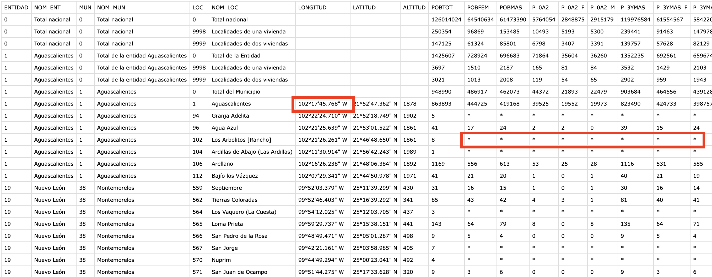 

### Qué construirás 
- Web App con Streamlit realizando data engineering: carga y transformación en base a tipos de datos( latitud/longitud) para realizar una programación End-2-End con Python.
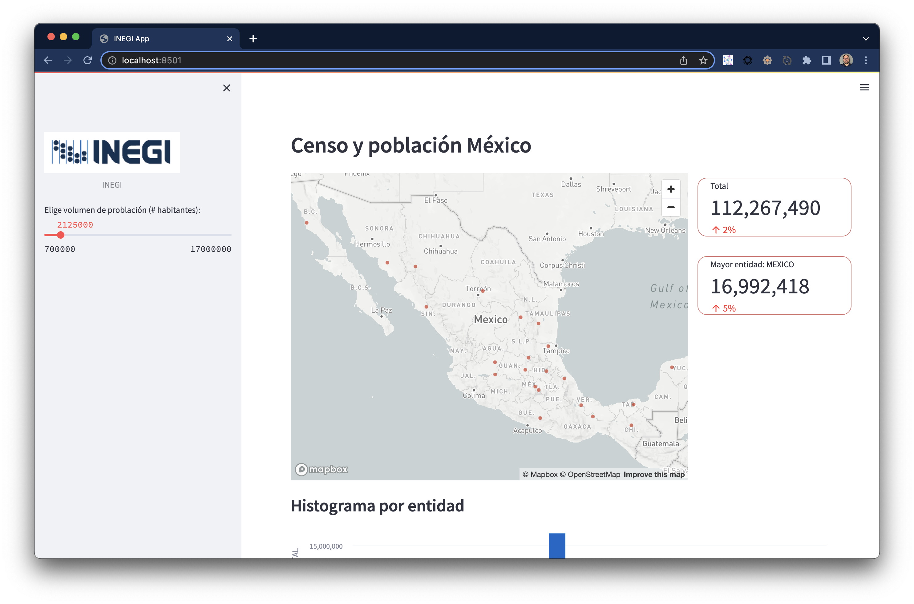

### Arquitectura de Solución


## Instalación
Duration: 10 

<h4>Código fuente</h4>
Descargar el repositorio que contiene el código necesario
[github repo](https://github.com/sfc-gh-csuarez/snowpark_inegi.git)

```shell
git clone https://github.com/sfc-gh-csuarez/snowpark_inegi.git 
```
Después de la descarga ingresar a la carpeta **snowpark_inegi-main** y abrir con Visual Studio Code o el editor de preferencia que soporte archivos Jupyter Notebook  

<h4>Creación de ambiente de desarrollo Python</h4> 
Crear un ambiente local de desarrollo para la instalación de algunas librerías así como de Snowpark con la versión Python 3.8
Teniendo Anaconda instalado, con la aplicacicón terminal apuntar a la carpeta donde de descargo el clon de Github, para crear un ambiente de desarrollo ejecutar:

```shell
conda create --name snowpark_env python=3.8  
conda activate snowpark_env
```

<h4>Instalación Snowpark Python</h4> 
Instalación de Snowpark 

```shell
pip install snowflake-snowpark-python pandas
pip install lat-lon-parser
pip install requests
conda install -c conda-forge streamlit 
conda install -c conda-forge pillow
```

<h4>Configuración en Snowflake UI</h4>

Ingresar con el usuario/contraseña a Snowflake, crear un Worksheet y ejecutar el siguiente código SQL para crear base de datos (INEGI), crear virtual warehouse (INEGI_WH) rol (INEGI_ROLE) y asignar los privilegios correspondientes:

```sql
use role accountadmin;
--objetos 
create database inegi;
--wharehouse
create warehouse inegi_wh 
warehouse_type = 'STANDARD' 
warehouse_size =XSMALL 
auto_suspend = 120 
auto_resume = TRUE 
max_cluster_count=1 
min_cluster_count=1;
--rol
create role inegi_role;
grant role inegi_role to user <tu_usuario_snowflake>;
grant role sysadmin to user <tu_usuario_snowflake>;
grant role sysadmin to role inegi_role;
--privilegios  
grant usage on database inegi to role inegi_role;
grant all privileges on schema public to role inegi_role;
grant usage on warehouse inegi_wh to role inegi_role;
```

A partir de este punto y en adelante se usará el rol "inegi_role"


<h4>Configuración config.py</h4> 

En la URL Snowflake <b>https://<id_cuenta>.<zona_region_cuenta>.snowflakecomputing.com</b> ejemplo: <b>https://ly14496.south-central-us.azure.snowflakecomputing.com</b>  los valores correspondientes son:
<p>
id_cuenta = <b>ly14496</b><br>
zona_region_cuenta = <b>south-central-us.azure</b>
</p>
En este archivo config.py ingresar los valores para cada propiedad  con la información para acceder a Snowflake desde Python usando Snowpark.

```javascript
connection_parameters = {
    "account": "<id_cuenta>.<zona_region_cuenta>",
    "user": "<tu_usuario_snowflake>",
    "password": "<tu_contraseñan_snowflake>",
    "warehouse": "INEGI_WH",
    "role": "INEGI_ROLE",
    "database": "INEGI",
    "schema": "PUBLIC"
}
```

Detalle en repositorio [github repo](https://github.com/sfc-gh-csuarez/snowpark_inegi.git)


## Extraer y Transformar 
Duration: 10 

### Descargar archivos desde web hosting

Dentro del directorio descargado desde Github,  abrir Visual Studio Code (VSC) y activar virtual environment **snowpark_env** creado en la instalación
```shell
conda activate snowpark_env
 ```


 Abir el archivo **01_INEGI_download.ipynb** y ejecutar el cell

```python 
#Script para ejección de descarga de archivo y realizar transformaciones (Split a JSON)
from inegidata import urlDownload
# opción 'remote' para descarga desde webhost de INEGI
# opciób 'local' para descompresión desde repo local
urlDownload('remote')
```
Puede elegir como parámetro de la función **urlDownload** tanto **remote** como **local**
- opción 'remote' para descarga desde webhost de INEGI
- opción 'local' para descompresión desde repo local


Teniendo la conexión a internet activa, iniciará el proceso de descarga de archivo colocando dentro de la carpeta CSV la estructura de directorios origen, y create el archivo **inegi.csv** y dentro del directorio JSON los archivos particionados **json** y en compresión **json.gz**

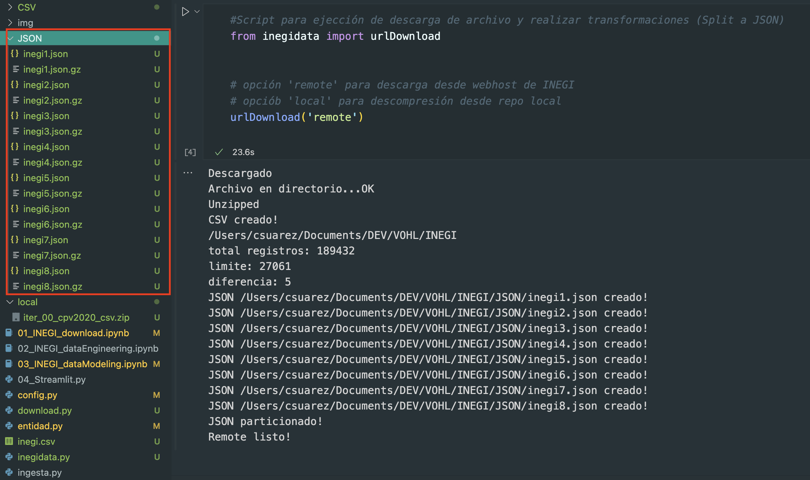


## Modelo y Cargar a Snowflake
Duration: 10 

Dentro del directorio descargado desde Github,  abrir Visual Studio Code (VSC) y activar virtual environment **snowpark_env** creado en la instalación

```shell
conda activate snowpark_env
 ```

Abrir el archivo **02_INEGI_dataEngineering.ipynb** y ejecutar los dos primeros cells para cargar las librerías necesarias y activar la sesión a Snowflake. 
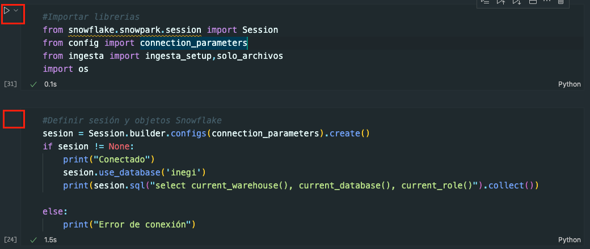


Ejecutar el cell **#Activación** para crear los objetos y privilegios Snowflake 
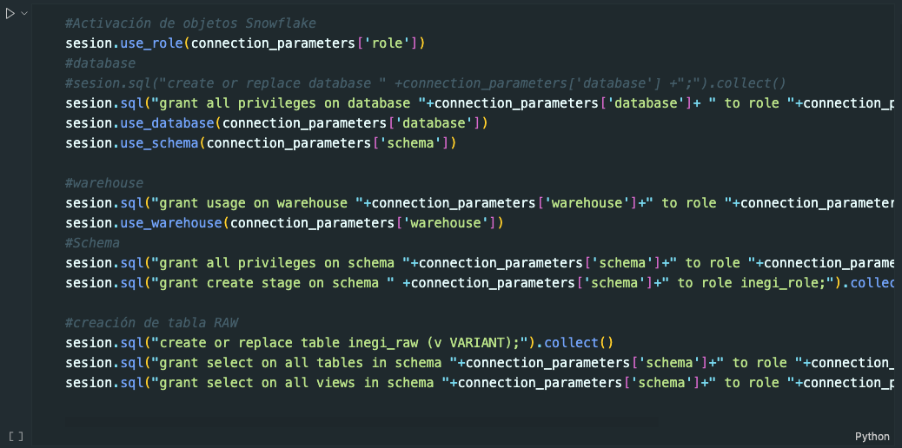

Ejecutar el cell **#Crear internal Stage** para la carga de datos JSON ya curados
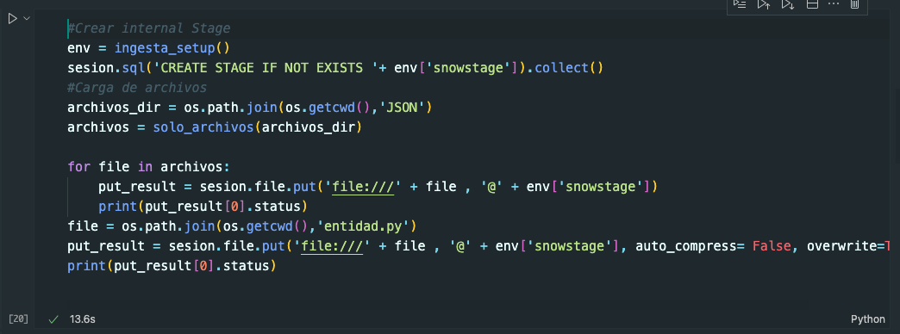


Ejecutar el cell **#Transformando a objeto Snowflake** para la colocación de datos en el objeto Snowflake tabla 
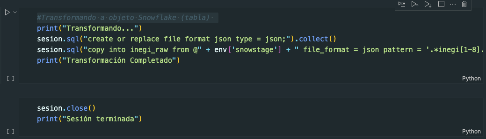


## Vistas y Materialización
Duration: 15 

 Abrir el archivo **03_INEGI_dataModeling.ipynb** y ejecutar los dos primeros cells para cargar las librerías necesarias y activar la sesión a Snowflake. 
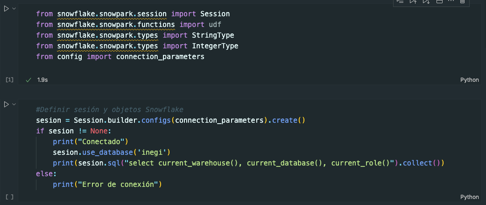

Ejecutar el cell **#Crear vista** para crear la vista que tendrá los datos que incluyen transformación de datos JSON en tabla INEGI_RAW  
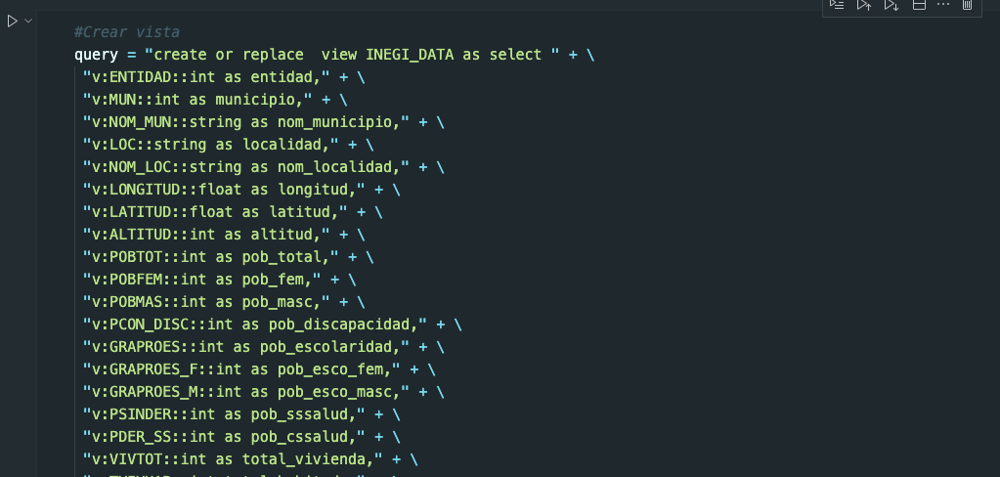

Ejecutar el cell **#UDF declaración** para incorporar la función creada en python nom_entidad que servirá para convertir No. de entidad por nombre de entidad.
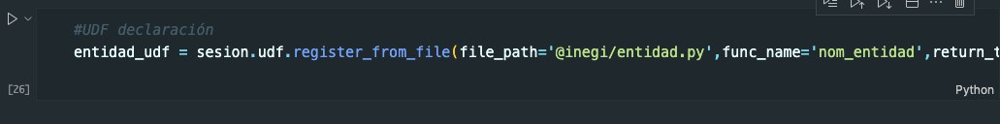

Ejecutar el cell **#Vista con totales por entidad aplicando** para materializar datos aplicando UDF y que tendrá los totales máximos de población para cada entidad
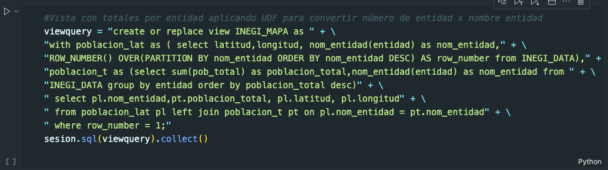

Ejecutar el cell **#Validar la vista solo con totales por entidad** para validar el contenido de la vista creada 
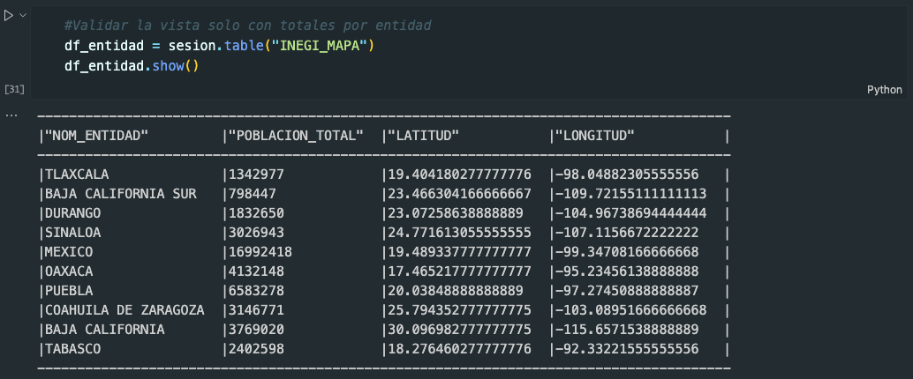 


## Visualización de Datos
Duration: 10 

Creación de sesión utilizando los constructores de Snowpark y los valores de acceso a Snowflake en el archivo **04_Streamlit.py** y ejecutar en terminal de Visual Studio Code

```shell
conda activate snowpark_env
streamlit run 04_Streamlit.py
```

```python
@st.experimental_singleton
def snowsesion() -> Session:
    sesion = Session.builder.configs(connection_parameters).create()
    if sesion != None:
        print("Conectado")
        sesion.use_database('inegi')
        print(sesion.sql("select current_warehouse(), current_database(), current_role()").collect()) 
        return sesion
    else:
        print("Error de conexión")

def run_query(sesion,query):
    try:
        return sesion.sql(query)
    except :
        print("error: ")
```

Streamlit permite la visualización de datos programando en Python pero usando "variables" como controles de datos, iniciando por la configuración de la página de mostrará elementos visuales:

```python
   st.set_page_config(
    page_title="INEGI App",
    page_icon="☻",
    layout="wide",
    initial_sidebar_state="expanded",)
    st.header("Censo y población México")
```


Podemos crear un slider para hacer interactivo, cada vez que se modifique su valor otros componentes actualizarán su contenido.

```python
image = Image.open('img/inegi.png')
        st.image(image, caption='INEGI',width=220)
        add_n_hab = st.slider("Elige volumen de problación (# habitantes):", 700000, 17000000,2125000 ,500000)
        query = "SELECT * FROM INEGI.PUBLIC.INEGI_MAPA where POBLACION_TOTAL > " + str(add_n_hab) + " order by POBLACION_TOTAL desc;"
        sesion = snowsesion()
        snowDF = run_query(sesion,query)
        snowPD = snowDF.to_pandas()
```

Un componente de visualización es el mapa, que requiere dentro del set de datos los valores correspondientes de latitud y longitud:

```python
with st.container():
            mapa = snowPD[['POBLACION_TOTAL','LATITUD', 'LONGITUD']]
            mapa = mapa.rename(columns={'LATITUD':'latitude', 'LONGITUD':'longitude'})
            st.map(mapa,zoom=4,use_container_width=True)
```

### Resultado
Visualización de mapa con componentes HTML personalizados


Visualización de histograma con tabla de datos
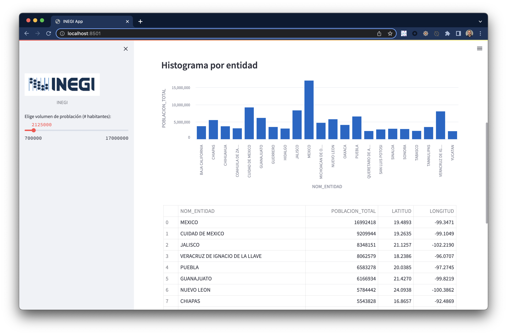


<!-- ------------------------ -->
## Conclusión
Duration: 5 

Con Snowpark y Streamlit es posible de forma directa hacer aplicaciones End-to-End desde la carga y transformación, hasta la visualización aprovechando la capacidad de cómputo de Snowflake.


### ¿Qué se cubrió?
- Instalación
- Extraer y Transformar 
- Modelo y Carga de datos en Snowflake
- Visualización de datos con Streamlit

Repositorio [github repo](https://github.com/sfc-gh-csuarez/snowpark_inegi.git)