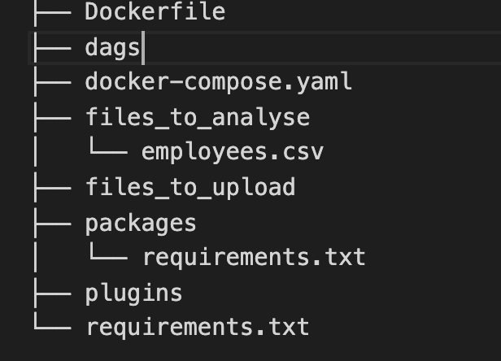
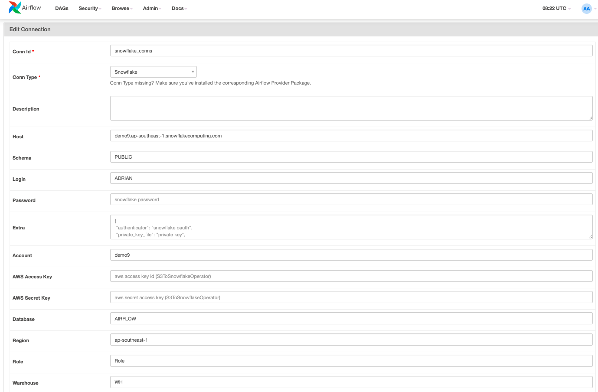
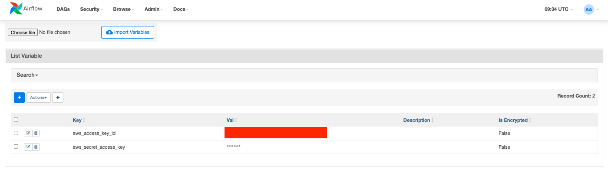
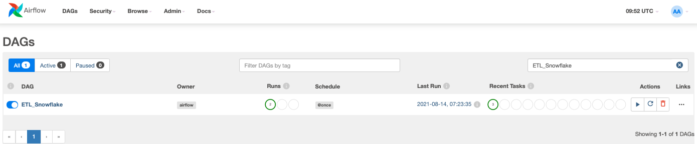
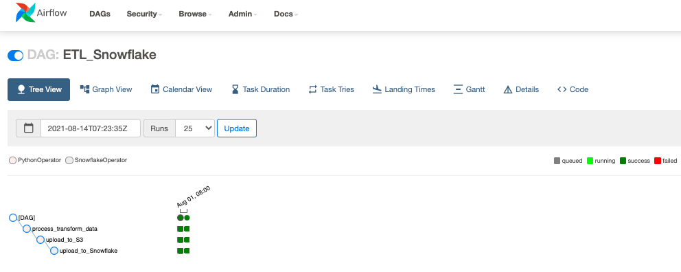
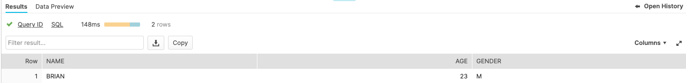

author: Adrian Lee
id: data_engineering_with_apache_airflow
summary: This is a sample Snowflake Guide
categories: Getting Started
environments: web
status: Published 
feedback link: https://github.com/Snowflake-Labs/sfguides/issues
tags: Getting Started, Data Science, Data Engineering, Twitter 

# Data Engineering with Apache airflow
<!-- ------------------------ -->
## Overview 
Duration: 5


Numerous business are looking at modern data strategy built on platforms that could support agility, growth and operational efficiency. Snowflake is Data Cloud, a future proof solution that can simplify data pipelines for all your businesses so you can focus on your data and analytics instead of infrastructure management and maintenance.

Apache Airflow is an open-source workflow management platform that can be used to author and manage data pipelines. Airflow uses worklows made of directed acyclic graphs (DAGs) of tasks. 

In this virtual hands-on lab, you will follow a step-by-step guide to Snowflake and Airflow and how Airflow helps to make data ETL process 

Let’s get started. 

### What You’ll Learn 
- how to use an opensource tool like Airflow to create an ETL process to Snowflake
- how do we write a DAG and upload it onto Airflow

### What You’ll Need 
- [VSCode](https://code.visualstudio.com/download) Installed
- [Docker Desktop](https://www.docker.com/products/docker-desktop) Installed

<!-- ------------------------ -->
## Set up of environment
Duration: 2

We will first get our docker-compose file of our airflow. To do so lets do a curl of the file onto our local laptop

```bash
curl -LfO 'https://airflow.apache.org/docs/apache-airflow/2.1.2/docker-compose.yaml'
```

As we will be installing our snowflake connectors the pip packages for Snowflake, we would first need to create 2 additional files

1. <b>requirements.txt</b>: This is requirements file which will contain the necessary snowflake libraries and connectors for airflow
2. <b>Dockerfile</b>: This is requirements file which will contain the necessary snowflake libraries and connectors for airflow
   

`requirements.txt`
```bash
pandas
apache-airflow-providers-snowflake==2.1.0
snowflake-connector-python==2.5.1
snowflake-sqlalchemy==1.2.5
```

`Dockerfile`
```bash
FROM apache/airflow:2.1.2
COPY requirements.txt .
RUN pip install -r requirements.txt
```

---
We would now need to create 2 folders `files_to_analyse` and `files_to_upload` 

Your tree repository should look like this


Let's run our ```docker-compose up``` and go to ```http://localhost:8080/```. The default username is ```airflow``` and password is ```airflow```


We will now create an S3 bucket in AWS. You can name the S3 bucket to what you like. In my case I named my bucket `adrian-loaddata-s3-bucket`.

<!-- ------------------------ -->
## Adjusting our docker-compose file
Duration: 2

We will be now adjusting our docker-compose file. There are 2 parts which we will be adjusting

- We will be commenting out the `image: ${AIRFLOW_IMAGE_NAME:-apache/airflow:2.1.2}` and include in the `build: .` in the line as below

```bash
version: '3'
x-airflow-common:
  &airflow-common
  build: . # add this in
  #image: ${AIRFLOW_IMAGE_NAME:-apache/airflow:2.1.2}
  environment:
```
- We will be add in our 2 folders as volumes. The `files_to_upload` is the folder where the csv are placed for Airflow to pick up and analyse. The `files_to_analyse` is the folder after the ETL workflow has processed the file and will stage the file to be uploaded to our S3 bucket

```bash
  volumes:
    - ./dags:/opt/airflow/dags
    - ./logs:/opt/airflow/logs
    - ./plugins:/opt/airflow/plugins
    - ./files_to_upload:/files_to_upload # add this in
    - ./files_to_analyse:/files_to_analyse # add this in
```

<!-- ------------------------ -->
## Preparing our Snowflake Environment and Employees CSV file

We will now prepare our Snowflake environment. 

Go to your Snowflake account and then create the database, table and stage for our S3 bucket.

```sql
CREATE DATABASE AIRFLOW;
USE AIRFLOW;
CREATE TABLE PUBLIC.EMPLOYEES (NAME STRING, AGE INT, GENDER STRING);

COPY into AIRFLOW.PUBLIC.EMPLOYEES (NAME,AGE,GENDER)
    from @airflow_stage/  force=true;

create or replace stage airflow_stage
  url = 's3://<REPLACE_WITH YOUR S3 BUCKET/'
  credentials = (aws_key_id = '<Your AWS Key>' aws_secret_key = 'Your AWS Secret Key')
  file_format=(type = 'CSV');
```
We will also prepare our `employees.csv` file as below and put it inside our `files_to_analyse folder` that we created in the `Set up of our environment`
```csv
name,age,gender
Brian,23,M
```

This will be our updated folder structure



## Preparing our Airflow environment

We will now prepare our Airflow environment. Head over to the `http://localhost:8080/` and go to `admin > Connections`

We will create a `snowflake_conns` id of `snowflake` connection type as shown below and fill in the necessary details. 

A sample connection is as shown below. 



Key in the below details:

- <b>Conn id</b>: Unique connection ID such as `snowflake_conns`
- <b>Conn Type</b>: Choose Snowflake
- <b>Host</b>: Snowflake host connection such as `demo9.apsoutheast-1.snowflakingcomputing.com`
- <b>Schema</b>: The schema of the database such as `Public`
- <b>Login</b>: You login id
- <b>Account</b>: Account name such as `demo9`
- <b>Database</b>: The database which we created earlier which is `airflow`
- <b>Region</b>: The region of your snowflake account such as `apsoutheast-1`
- <b>Role</b> : The role in your Snowflake account
- <b>Warehouse</b>: The warehouse in your Snowflake account

We are also going to create variables in our Airflow to store our AWS secret key id and secret access key. Head over to `Admin ` > `Variables` and create

- <b>aws_access_key_id</b>: Your AWS access key id
- <b>aws_secret_access_key</b>: Your AWS secret access key




## Writing our DAG
Duration: 2

A Dynamic Acyclic Graph (DAG) and it represents the collection of tasks that you want to run. When we have workers set up, our tasks will run on different tasks. We will be writing our DAG in Python. 

When you ran your ```docker-compose up``` in the first step, there should be a folder called ```dag``` created as shown in the picture below. 

Let's go over to our ```dag``` folder and create our dag. In this case, I have named it as ```Process_Data_Snowflake.py```

In this Python DAG, we are going to write 3 tasks

1. process_transform_data_task: This will process our employees.csv file on the `files_to_analyse` folder and upper case our NAME column. It will then save the updated csv file on the `files_to_upload` folder. 
2. upload_to_S3_task: This will upload the CSV file from the `files_to_upload` folder into our S3 bucket which we created in the `Set up of environment` 
3. upload_to_Snowflake_task: This will perform the copy command to copy the data from the CSV file in the S3 bucket into Snowflake

### ETL_Snowflake.py
```python
import pandas as pd
import glob
import os
from airflow import DAG
from airflow.operators.python import PythonOperator
from airflow.operators.dummy_operator import DummyOperator
import boto3
import os
from datetime import datetime
import snowflake.connector as sf
from airflow.contrib.hooks.snowflake_hook import SnowflakeHook
from airflow.contrib.operators.snowflake_operator import SnowflakeOperator
from airflow.models import Variable

default_args = {
    'owner': 'airflow',
    'depends_on_past': False,
    'start_date': datetime(2021, 8, 1),
    'retries': 0
}

def aws_session(region_name='ap-southeast-1'):
    return boto3.session.Session(aws_access_key_id=Variable.get("aws_access_key_id"),
                                aws_secret_access_key=Variable.get("aws_secret_access_key"),
                                region_name=region_name)


query1 = [
    """COPY into AIRFLOW.PUBLIC.EMPLOYEES (NAME,AGE,GENDER)
    from @airflow_stage/;""",
]


def upload_files_to_S3(bucket_name,path):
    session = aws_session()
    print("=== Start uploading S3 files === ")
    s3_resource = session.resource('s3')
    bucket = s3_resource.Bucket(bucket_name)  
    for subdir, dirs, files in os.walk(path):
        for file in files:
            full_path = os.path.join(subdir, file)
            
            with open(full_path, 'rb') as data:
                print(full_path[len(path):])
                bucket.put_object(Key=full_path[len(path):], Body=data)
    print("=== Finish uploading S3 files === ")

def process_transform_data(path, upload_path):
    print("=== Start processing files === ")
    print(path)
    for filename in glob.glob(os.path.join(path, '*.csv')):
        with open(os.path.join(os.getcwd(), filename), 'r') as f:
            root_ext = os.path.splitext(filename)
            date = root_ext[0].rsplit('/', 1)[-1]
            print(date)
            df = pd.read_csv(f)
            # Transform 
            df['NAME'] = df['NAME'].str.upper()

            df.to_csv(upload_path + str(date) +'.csv', index=False,  header=None)
    print("=== End processing files === ")

# Using the context manager alllows you not to duplicate the dag parameter in each operator
with DAG('ETL_Snowflake', default_args=default_args, schedule_interval='@once') as dag:

    process_transform_data_task = PythonOperator(
        task_id='process_transform_data',
        python_callable=process_transform_data,
        op_kwargs={
            'path': '/files_to_analyse/',
            'upload_path': '/files_to_upload/'
        },
        dag=dag)

    upload_to_S3_task = PythonOperator(
        task_id='upload_to_S3',
        python_callable=upload_files_to_S3,
        op_kwargs={
            'path': '/files_to_upload/',
            'bucket_name': '<YOUR_BUCKET_NAME>',
        },
        dag=dag)    


    upload_to_Snowflake_task = SnowflakeOperator(
        task_id="upload_to_Snowflake",
        sql=query1,
        snowflake_conn_id="snowflake_conns",
        dag=dag
    )

    # Use arrows to set dependencies between tasks
    process_transform_data_task >> upload_to_S3_task >> upload_to_Snowflake_task
```

<!-- ------------------------ -->
## Running our DAG
Duration: 2

Now lets go to the DAG in our Airflow and search for `ETL_Snowflake` and click on the play button.



If all goes well, you should see that the DAG has run successfully



Our data is successfully uploaded into our table!



<!-- ------------------------ -->
## Conclusion
Duration: 1

Congratulation! You have created your first ETL process using Apache Airflow and Snowflake! We encourage you to continue with your free trial by loading your own sample or production data and by using some of the more advanced capabilities of Airflow and Snowflake not covered in this lab. 

### Additional Resources:
- Read the [Definitive Guide to Maximizing Your Free Trial](https://www.snowflake.com/test-driving-snowflake-the-definitive-guide-to-maximizing-your-free-trial/) document
- Attend a [Snowflake virtual or in-person event](https://www.snowflake.com/about/events/) to learn more about our capabilities and customers
- [Join the Snowflake community](https://community.snowflake.com/s/topic/0TO0Z000000wmFQWAY/getting-started-with-snowflake)
- [Sign up for Snowflake University](https://community.snowflake.com/s/article/Getting-Access-to-Snowflake-University)
- [Contact our Sales Team](https://www.snowflake.com/free-trial-contact-sales/) to learn more

### What we've covered:
- How to set up Airflow & Snowflake
- How to create a DAG and create our first ETL pipeline
- How to leverage Snowflake elasticity and scalability to support our ETL workflows