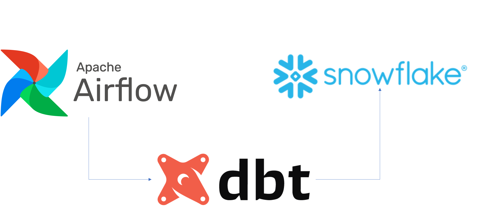
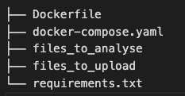
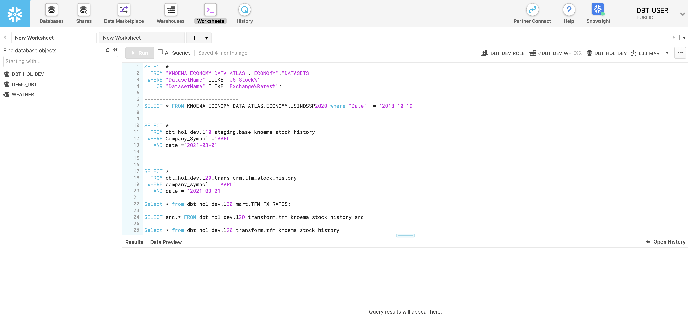
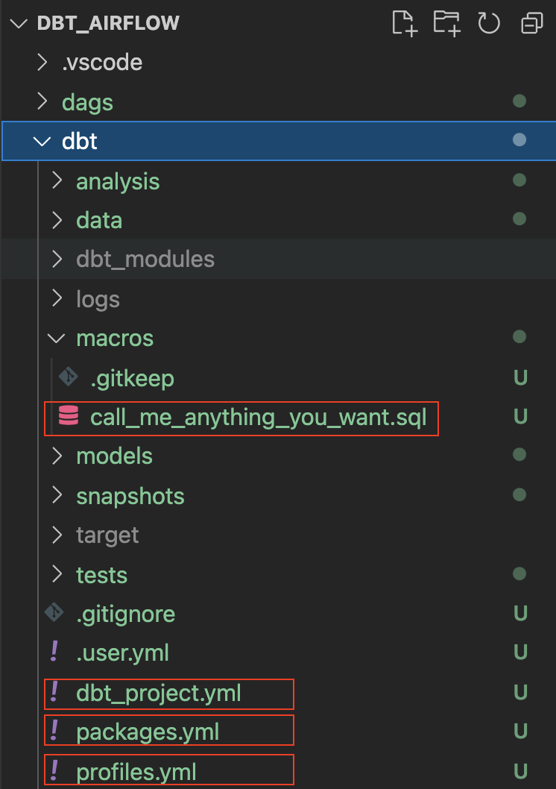
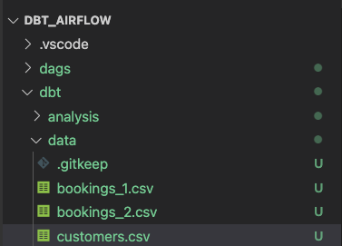
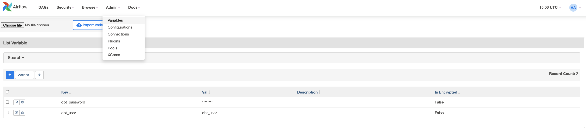
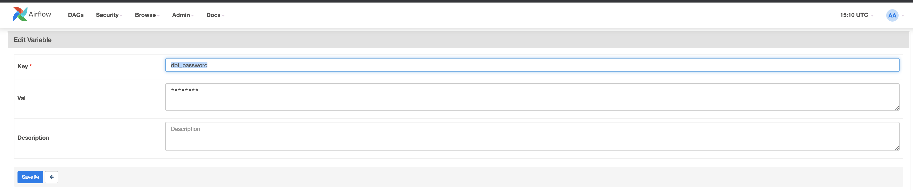
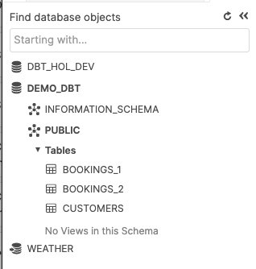
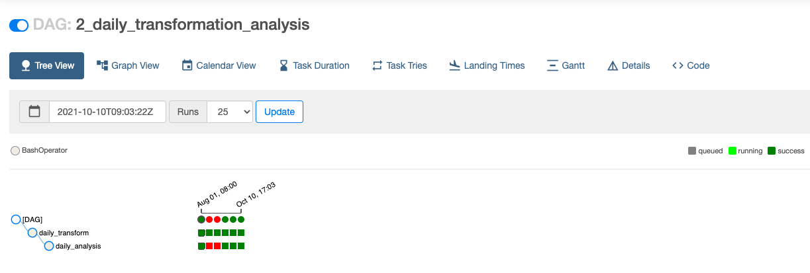
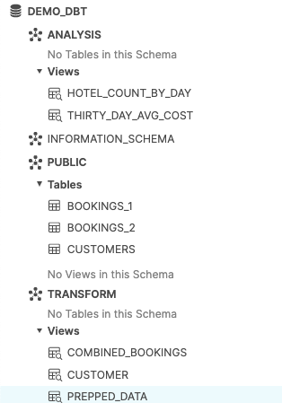

author: Adrian Lee
id: data_engineering_with_apache_airflow
summary: This is a sample Snowflake Guide
categories: Getting Started
environments: web
status: Published 
feedback link: https://github.com/Snowflake-Labs/sfguides/issues
tags: Getting Started, Data Engineering, dbt, Airflow

# Data Engineering with Apache Airflow, Snowflake & dbt
<!-- ------------------------ -->
## Overview 
Duration: 5



Numerous business are looking at modern data strategy built on platforms that could support agility, growth and operational efficiency. Snowflake is Data Cloud, a future proof solution that can simplify data pipelines for all your businesses so you can focus on your data and analytics instead of infrastructure management and maintenance.

Apache Airflow is an open-source workflow management platform that can be used to author and manage data pipelines. Airflow uses worklows made of directed acyclic graphs (DAGs) of tasks. 

[dbt](https://www.getdbt.com/) is a modern data engineering framework maintained by [dbt Labs](https://www.getdbt.com/) that is becoming very popular in modern data architectures, leveraging cloud data platforms like Snowflake. [dbt CLI](https://docs.getdbt.com/dbt-cli/cli-overview) is the command line interface for running dbt projects. The CLI is free to use and open source.

In this virtual hands-on lab, you will follow a step-by-step guide to using Airflow with dbt to create data transformation job schedulers. 

Let’s get started. 
### Prerequisites
This guide assumes you have a basic working knowledge of Python and dbt

### What You’ll Learn 
- how to use an opensource tool like Airflow to create a data scheduler
- how do we write a DAG and upload it onto Airflow
- how to build scalable pipelines using dbt, Airflow and Snowflake

### What You’ll Need 
You will need the following things before beginning:

1. Snowflake
  1. **A Snowflake Account.**
  1. **A Snowflake User created with appropriate permissions.** This user will need permission to create objects in the DEMO_DB database.
1. GitHub
  1. **A GitHub Account.** If you don’t already have a GitHub account you can create one for free. Visit the [Join GitHub](https://github.com/join) page to get started.
  1. **A GitHub Repository.** If you don't already have a repository created, or would like to create a new one, then [Create a new respository](https://github.com/new). For the type, select `Public` (although you could use either). And you can skip adding the README, .gitignore and license for now.
1. Integrated Development Environment (IDE)
  1. **Your favorite IDE with Git integration.** If you don’t already have a favorite IDE that integrates with Git I would recommend the great, free, open-source [Visual Studio Code](https://code.visualstudio.com/).
  1. **Your project repository cloned to your computer.** For connection details about your Git repository, open the Repository and copy the `HTTPS` link provided near the top of the page. If you have at least one file in your repository then click on the green `Code` icon near the top of the page and copy the `HTTPS` link. Use that link in VS Code or your favorite IDE to clone the repo to your computer.
1. Docker
  1. **Docker Desktop on your laptop.**  We will be running Airflow as a container. Please install Docker Desktop on your desired OS by following the [Docker setup instructions](https://docs.docker.com/desktop/).

### What You’ll Build 
- A simple working Airflow pipeline with dbt and Snowflake 

<!-- ------------------------ -->
## Set up of environment
Duration: 2

First, let us create a folder by running the command below

```
mkdir dbt_airflow && cd "$_"
```

Next, we will get our docker-compose file of our Airflow. To do so lets do a curl of the file onto our local laptop

```bash
curl -LfO 'https://airflow.apache.org/docs/apache-airflow/2.3.0/docker-compose.yaml'
```

We will be now adjusting our docker-compose file - add in our 2 folders as volumes. The `dags` is the folder where the Airflow DAGs are placed for Airflow to pick up and analyse. The `dbt` is the folder in which we configured our dbt models and our CSV files. 

```bash
  volumes:
    - ./dags:/opt/airflow/dags
    - ./logs:/opt/airflow/logs
    - ./plugins:/opt/airflow/plugins
    - ./dbt:/dbt # add this in
    - ./dags:/dags # add this in

```

We would now need to create additional file with additional docker-compose parameters. This way dbt will be installed when the containers are started.

`.env`
```bash
_PIP_ADDITIONAL_REQUIREMENTS=dbt==0.19.0
```

---
We would now need to create a `dbt` project as well as an `dags` folder. 

For the dbt project, do a ```dbt init dbt``` - this is where we will configure our dbt later in step 4.

For the dags folder, just create the folder by doing 

```
mkdir dags
```

Your tree repository should look like this



<!-- ------------------------ -->
## Setting up our dbt Project
Duration: 6

Now that we have gotten our repo up, it is time to configure and set up our dbt project. 

Before we begin, let's take some time to understand what we are going to do for our dbt project.

As can be seen in the diagram below, we have 3 csv files ```bookings_1```, ```bookings_2``` and ```customers ```. We are going to seed these csv files into Snowflake as tables. This will be covered in step 4 in detailed later.

Following this, we are going to merge ```bookings_1``` and ```bookings_2``` tables into ```combined_bookings```. Next, we are going to join the ```combined_bookings``` and ```customer``` table on customer_id to form the ```prepped_data``` table. 

Finally, we are going to perform our analysis and transformation on the ```prepped_data``` by creating 2 views.  

1) ```hotel_count_by_day.sql```: This will create a hotel_count_by_day view in the ANALYSIS schema in which we will count the number of hotel bookings by day.

2) ```thirty_day_avg_cost.sql```: This will create a thirty_day_avg_cost view in the ANALYSIS schema in which we will do a average cost of booking for the last 30 days.


First, let's go to the Snowflake console and run the script below. What this does is create a dbt_user and a dbt_dev_role and after which we set up a database for dbt_user.

```sql
USE ROLE SECURITYADMIN;

CREATE OR REPLACE ROLE dbt_DEV_ROLE COMMENT='dbt_DEV_ROLE';
GRANT ROLE dbt_DEV_ROLE TO ROLE SYSADMIN;

CREATE OR REPLACE USER dbt_USER PASSWORD='<PASSWORD>'
	DEFAULT_ROLE=dbt_DEV_ROLE
	DEFAULT_WAREHOUSE=dbt_WH
	COMMENT='dbt User';
    
GRANT ROLE dbt_DEV_ROLE TO USER dbt_USER;

-- Grant privileges to role
USE ROLE ACCOUNTADMIN;

GRANT CREATE DATABASE ON ACCOUNT TO ROLE dbt_DEV_ROLE;

/*---------------------------------------------------------------------------
Next we will create a virtual warehouse that will be used
---------------------------------------------------------------------------*/
USE ROLE SYSADMIN;

--Create Warehouse for dbt work
CREATE OR REPLACE WAREHOUSE dbt_DEV_WH
  WITH WAREHOUSE_SIZE = 'XSMALL'
  AUTO_SUSPEND = 120
  AUTO_RESUME = true
  INITIALLY_SUSPENDED = TRUE;

GRANT ALL ON WAREHOUSE dbt_DEV_WH TO ROLE dbt_DEV_ROLE;

```

Let's login with the ```dbt_user``` and create the database ```DEMO_dbt``` by running the command

```sql

CREATE OR REPLACE DATABASE DEMO_dbt

```



Now, let's go back to our project ```dbt_airflow``` > ```dbt```that we set up previously in step 1.

We will set up a few configurations for the respective files below. Please note for the ```dbt_project.yml``` you just need to replace the models section

profiles.yml
```yml
default:
  target: dev
  outputs:
    dev:
      type: snowflake
      ######## Please replace with your Snowflake account name 
      ######## for example sg_demo.ap-southeast-1
      account: <ACCOUNT_URL>.<REGION> 

      user: "{{ env_var('dbt_user') }}"
      ######## These environment variables dbt_user and dbt_password 
      ######## are read from the variabls in Airflow which we will set later
      password: "{{ env_var('dbt_password') }}"

      role: dbt_dev_role
      database: demo_dbt
      warehouse: dbt_dev_wh
      schema: public
      threads: 200
```
packages.yml
```yml
packages:
  - package: fishtown-analytics/dbt_utils
    version: 0.6.4
```

dbt_project.yml
```yml
models:
  my_new_project:
      # Applies to all files under models/example/
      transform:
          schema: transform
          materialized: view
      analysis:
          schema: analysis
          materialized: view
```

Next, we will install the ```fishtown-analytics/dbt_utils``` that we had placed inside ```packages.yml```. This can be done by running the command ```dbt deps``` from the ```dbt``` folder. 

We will now create a file called ```custom_demo_macros.sql``` under the ```macros``` folder and input the below sql 

```sql

    
    
        {{ default_schema }}
    
        {{ custom_schema_name | trim }}
    




   {# always use model name #}
  
    
    {{ log("Setting query_tag to '" ~ new_query_tag ~ "'. Will reset to '" ~ original_query_tag ~ "' after materialization.") }}
    
    {{ return(original_query_tag)}}
  
  {{ return(none)}}

```

If everything is done correctly, your folder should look like below. The annotated boxes are what we just went through above. 

Our final step here is to install our dbt module for ```db_utils```. From the dbt directory run
``` 
dbt deps
```
and you would see the assoicated modules being installed in the ```dbt_modules``` folder

By now, you should see the folder structure as below: 



We are done configuring dbt. Let us proceed on crafting our csv files and our dags in the next section.

<!-- ------------------------ -->
## Creating our CSV data files in dbt
Duration: 10

In this section, we will be prepping our sample csv data files alongside the associated sql models. 

To start, let us first create 3 excel files under the folder ```data``` inside the dbt folder.

bookings_1.csv

```csv
id,booking_reference,hotel,booking_date,cost
1,232323231,Pan Pacific,2021-03-19,100
1,232323232,Fullerton,2021-03-20,200
1,232323233,Fullerton,2021-04-20,300
1,232323234,Jackson Square,2021-03-21,400
1,232323235,Mayflower,2021-06-20,500
1,232323236,Suncity,2021-03-19,600
1,232323237,Fullerton,2021-08-20,700
```

bookings_2.csv

```csv
id,booking_reference,hotel,booking_date,cost
2,332323231,Fullerton,2021-03-19,100
2,332323232,Jackson Square,2021-03-20,300
2,332323233,Suncity,2021-03-20,300
2,332323234,Jackson Square,2021-03-21,300
2,332323235,Fullerton,2021-06-20,300
2,332323236,Suncity,2021-03-19,300
2,332323237,Berkly,2021-05-20,200
```

customers.csv
```csv
id,first_name,last_name,birthdate,membership_no
1,jim,jone,1989-03-19,12334
2,adrian,lee,1990-03-10,12323
```

Our folder structure should be like as below



<!-- ------------------------ -->
## Creating our dbt models in models folder
Duration: 2

Create 2 folders ```analysis``` and ```transform``` in the models folder. Please follow the sections below for analysis and transform respectively. 

### dbt models for transform folder

Inside the ```transform``` folder, we will have 3 SQL files

1) ```combined_bookings.sql```: This will combine the 2 bookings CSV files we had above and create the  ```COMBINED_BOOKINGS``` view in the ```TRANSFORM``` schema. 

combined_bookings.sql
```sql
{{ dbt_utils.union_relations(
    relations=[ref('bookings_1'), ref('bookings_2')]
) }}
```

2) ```customer.sql```: This will create a ```CUSTOMER``` view in the ```TRANSFORM``` schema.

customer.sql
```sql
SELECT ID 
    , FIRST_NAME
    , LAST_NAME
    , birthdate
FROM {{ ref('customers') }}
```

3) ```prepped_data.sql```: This will create a ```PREPPED_DATA``` view in the ```TRANSFORM``` schema in which it will perform an inner join on the ```CUSTOMER``` and ```COMBINED_BOOKINGS``` views from the steps above. 

prepped_data.sql
```sql
SELECT A.ID 
    , FIRST_NAME
    , LAST_NAME
    , birthdate
    , BOOKING_REFERENCE
    , HOTEL
    , BOOKING_DATE
    , COST
FROM {{ref('customer')}}  A
JOIN {{ref('combined_bookings')}} B
on A.ID = B.ID
```

### dbt models for analysis folder

Now let's move on to the ```analysis``` folder. Change to the ```analysis``` folder and create these 2 SQL files

1) ```hotel_count_by_day.sql```: This will create a hotel_count_by_day view in the ```ANALYSIS``` schema in which we will count the number of hotel bookings by day. 

```sql
SELECT
  BOOKING_DATE,
  HOTEL,
  COUNT(ID) as count_bookings
FROM {{ ref('prepped_data') }}
GROUP BY
  BOOKING_DATE,
  HOTEL
```

2) ```thirty_day_avg_cost.sql```: This will create a thirty_day_avg_cost view in the ```ANALYSIS``` schema in which we will do a average cost of booking for the last 30 days. 

```sql
SELECT
  BOOKING_DATE,
  HOTEL,
  COST,
  AVG(COST) OVER (
    ORDER BY BOOKING_DATE ROWS BETWEEN 29 PRECEDING AND CURRENT ROW
  ) as "30_DAY_AVG_COST",
  COST -   AVG(COST) OVER (
    ORDER BY BOOKING_DATE ROWS BETWEEN 29 PRECEDING AND CURRENT ROW
  ) as "DIFF_BTW_ACTUAL_AVG"
FROM {{ ref('prepped_data') }}
```

Your file structure should be as below. We have already finished our dbt models and can proceed onto working on Airflow. 


<!-- ------------------------ -->
## Preparing our Airflow DAGs
Duration: 5

In our ```dags``` folder, create 2 files: ```init.py``` and ```transform_and_analysis.py```. The ```init.py``` will initialise and see the CSV data. The ```transform_and_analysis.py``` will perform the transformation and analysis. 

With Airflow, we can then schedule the ```transform_and_analysis``` DAG on a daily basis. However, in this example, we will be triggering the DAG manually.

init.py
```python
from datetime import datetime
import os

from airflow import DAG
from airflow.operators.python import PythonOperator, BranchPythonOperator
from airflow.operators.bash import BashOperator
from airflow.operators.dummy_operator import DummyOperator

default_args = {
    'owner': 'airflow',
    'depends_on_past': False,
    'start_date': datetime(2020,8,1),
    'retries': 0
}


with DAG('1_init_once_seed_data', default_args=default_args, schedule_interval='@once') as dag:
    task_1 = BashOperator(
        task_id='load_seed_data_once',
        bash_command='cd /dbt && dbt seed --profiles-dir .',
        env={
            'dbt_user': '{{ var.value.dbt_user }}',
            'dbt_password': '{{ var.value.dbt_password }}',
            **os.environ
        },
        dag=dag
    )

task_1  
```

transform_and_analysis.py
```python
from airflow import DAG
from airflow.operators.python import PythonOperator, BranchPythonOperator
from airflow.operators.bash import BashOperator
from airflow.operators.dummy_operator import DummyOperator
from datetime import datetime


default_args = {
    'owner': 'airflow',
    'depends_on_past': False,
    'start_date': datetime(2020,8,1),
    'retries': 0
}

with DAG('2_daily_transformation_analysis', default_args=default_args, schedule_interval='@once') as dag:
    task_1 = BashOperator(
        task_id='daily_transform',
        bash_command='cd /dbt && dbt run --models transform --profiles-dir .',
        env={
            'dbt_user': '{{ var.value.dbt_user }}',
            'dbt_password': '{{ var.value.dbt_password }}',
            **os.environ
        },
        dag=dag
    )

    task_2 = BashOperator(
        task_id='daily_analysis',
        bash_command='cd /dbt && dbt run --models analysis --profiles-dir .',
        env={
            'dbt_user': '{{ var.value.dbt_user }}',
            'dbt_password': '{{ var.value.dbt_password }}',
            **os.environ
        },
        dag=dag
    )

    task_1 >> task_2 # Define dependencies
```


<!-- ------------------------ -->
## Running our docker-compose file for Airflow
Duration: 5

Let's run our ```docker-compose up``` and go to [http://localhost:8080/](http://localhost:8080/). The default username is ```airflow``` and password is ```airflow```


We are now going to create 2 variables. Go to ```admin > Variables``` and click on the ```+``` icon. 



Let us first create key of ```dbt_user``` and value ```dbt_user```. 


Now let us create our second key of ```dbt_password``` and value ```<ADD IN YOUR PASSWORD>```



<!-- ------------------------ -->
## Activating and running our DAGs

We will now activate our DAGs. Click on the blue buttons for ```1_init_once_seed_data``` and ```2_daily_transformation_analysis```


### Running our 1_init_once_seed_data
Now, lets run our ```1_init_once_seed_data```  to seed the data. To run click the play icon under the ```Actions``` on the right of the DAG.


### Viewing Seed data in tables created under public schema
If all goes well when we go back to our Snowflake instance, we should see tree tables that have been successfully created in the ```PUBLIC``` schema. 



### Running our 2_daily_transformation_analysis
We will now run our second DAG ```2_daily_transformation_analysis``` which will run our ```transform``` and ```analysis``` models



Our ```Transform``` and ```Analysis``` views have been created successfully!



<!-- ------------------------ -->
## Conclusion
Duration: 1

Congratulations! You have created your first Apache Airflow with dbt and Snowflake! We encourage you to continue with your free trial by loading your own sample or production data and by using some of the more advanced capabilities of Airflow and Snowflake not covered in this lab. 

### Additional Resources:
- Join our [dbt community Slack](https://www.getdbt.com/community/) which contains more than 18,000 data practitioners today. We have a dedicated slack channel #db-snowflake to Snowflake related content.
- Quick tutorial on how to write a simple [Airflow DAG](https://airflow.apache.org/docs/apache-airflow/stable/tutorial.html)

### What we've covered:
- How to set up Airflow, dbt & Snowflake
- How to create a DAG and run dbt from our dag
