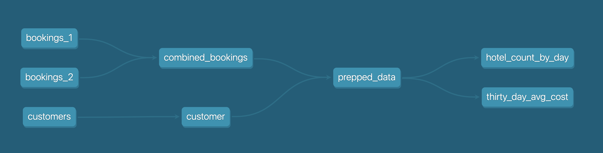
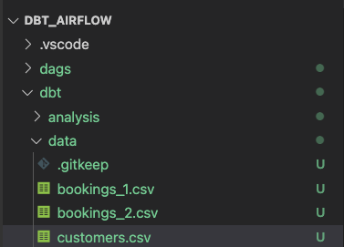
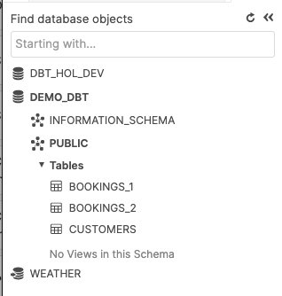

author: Adrian Lee
id: data_engineering_with_apache_airflow_ja
summary: This guide shows you how to build a Data Pipeline with Apache Airflow that manages DBT model transformations and conducts data analysis with Snowpark, all in a single DAG
categories: data-engineering,architecture-patterns,partner-integrations
environments: web
status: Published 
feedback link: https://github.com/Snowflake-Labs/sfguides/issues
tags: Getting Started, Data Engineering, dbt, Airflow, Snowpark, ja

# Apache Airflow、Snowflake、dbtによるデータエンジニアリング

<!-- ------------------------ -->
## 概要

duration:5


多くの企業が、アジリティ、成長、運用効率をサポートするプラットフォーム上に構築された最新のデータ戦略に注目しています。Snowflakeはデータクラウドであり、あらゆるビジネスのデータパイプラインを簡素化し、企業がインフラストラクチャの管理やメンテナンスではなく、データと分析に集中できるようにする将来を見据えたソリューションです。

Apache Airflowは、データパイプラインの作成と管理に使用できるオープンソースのワークフロー管理プラットフォームです。Airflowは、タスクの有向非巡回グラフ（DAG）で構成されるワークフローを使用します。

[dbt](https://www.getdbt.com/)は、[dbt Labs](https://www.getdbt.com/)によって管理されている最新のデータエンジニアリングフレームワークであり、Snowflakeなどのクラウドデータプラットフォームを活用した最新のデータアーキテクチャで非常に人気が高まっています。[dbt CLI](https://docs.getdbt.com/dbt-cli/cli-overview)は、DBTプロジェクトを実行するためのコマンドラインインターフェイスです。このCLIは無料で使用できるオープンソースです。

このバーチャルハンズオンラボでは、Airflowとdbtを使用するためのステップバイステップのガイドに従ってデータ変換ジョブスケジューラを作成します。

では始めましょう。

### 前提条件

このガイドは、Pythonとdbtに関する基本的な実務知識があることを前提としています。

### 学習する内容

- Airflowなどのオープンソースツールを使用してデータスケジューラを作成する方法
- DAGを作成してAirflowにアップロードする方法
- dbt、Airflow、Snowflakeを使用してスケーラブルなパイプラインを構築する方法

### 必要なもの

始める前に以下のものが必要です。

1. Snowflake
2. **Snowflakeアカウント**
3. **適切な権限で作成されたSnowflakeユーザー。**このユーザーには、DEMO_DB データベースにオブジェクトを作成する権限が必要です。
4. GitHub
5. **GitHubアカウント。**まだGitHubアカウントを持っていない場合は、無料で作成できます。アカウントの作成を開始するには、[Join GitHub](https://github.com/join)ページにアクセスしてください。
6. **GitHubレポジトリ。**まだレポジトリを作成していない場合、または新しく作成したい場合は、[新しいレポジトリを作成](https://github.com/new)します。タイプは「`Public`」を選択します（どちらも使用できます）。また、現時点では、README、.gitignore、ライセンスの追加をスキップできます。
7. 統合開発環境（IDE）
8. **お気に入りのIDEとGitの統合。**お気に入りのIDEとGitをまだ統合していない場合は、[Visual Studio Code](https://code.visualstudio.com/)をお勧めします。これは無料で利用できるオープンソースの優れたIDEです。
9. **コンピュータに複製されたプロジェクトレポジトリ。**Gitレポジトリの接続の詳細については、レポジトリを開き、ページ上部付近にある`HTTPS`リンクをコピーします。レポジトリに1つ以上のファイルがある場合は、ページ上部付近にあるの緑色の`Code`アイコンをクリックし、`HTTPS`リンクをコピーします。そのリンクをVS Codeまたはお好みのIDEで使用して、コンピュータにレポジトリを複製します。
10. Docker
11. **ノートパソコン上のDocker Desktop。**  Airflowをコンテナとして実行します。[Dockerの設定手順](https://docs.docker.com/desktop/)に従って、ご希望のOSにDocker Desktopをインストールしてください。

### 構築するもの

- dbtとSnowflakeを使用したシンプルで実用的なAirflowパイプライン

<!-- ------------------------ -->
## 環境設定

duration:2

まず、以下のコマンドを実行してフォルダを作成しましょう。

```
mkdir dbt_airflow && cd "$_"
```

次に、Airflowのdocker-composeファイルを取得します。これを行うため、ローカルのノートパソコンへのこのファイルのcurlを実行しましょう。

```bash
curl -LfO 'https://airflow.apache.org/docs/apache-airflow/2.3.0/docker-compose.yaml'
```

ここで、docker-composeファイルを調整し、2つのフォルダをボリュームとして追加します。`dags`は、Airflowが取得して分析するためにAirflow DAGが配置されているフォルダです。`dbt`は、dbtモデルとCSVファイルを設定したフォルダです。

```bash
  volumes:
    - ./dags:/opt/airflow/dags
    - ./logs:/opt/airflow/logs
    - ./plugins:/opt/airflow/plugins
    - ./dbt:/dbt # add this in
    - ./dags:/dags # add this in

```

ここで、追加のdocker-composeパラメータを含む追加ファイルを作成する必要があります。こうすることで、コンテナの起動時にdbtがインストールされます。

`.env`

```bash
_PIP_ADDITIONAL_REQUIREMENTS=dbt==0.19.0
```

---

次に、`dbt`プロジェクトと`dags`フォルダを作成する必要があります。

DBTプロジェクトの場合は、`dbt init dbt`を実行します。後のステップ4で、ここにdbtを設定します。

dagsフォルダの場合は、次を実行してフォルダを作成します。

```
mkdir dags
```

ツリーレポジトリは次のようになります。


<!-- ------------------------ -->
## DBTプロジェクトの設定

duration:6

レポジトリを作成したので、次はDBTプロジェクトを設定します。

始める前に、少し時間を取ってDBTプロジェクトで何をしようとしているのかを理解しましょう。

下の図からわかるように、3つのcsvファイル（`bookings_1`、`bookings_2`、`customers `）があります。これらのcsvファイルをテーブルとしてSnowflakeにシードします。これについては、後のステップ4で詳しく説明します。

続いて、`bookings_1`テーブルと`bookings_2`テーブルを`combined_bookings`にマージします。次に、customer_idで`combined_bookings`テーブルと`customer`テーブルを結合し、`prepped_data`テーブルを作成します。

最後に、2つのビューを作成して、`prepped_data`の分析と変換を実行します。

1) `hotel_count_by_day.sql`：ANALYSISスキーマにhotel_count_by_dayビューを作成し、日別のホテル予約数をカウントします。

2) `thirty_day_avg_cost.sql`：ANALYSISスキーマにthirty_day_avg_costビューを作成し、過去30日間の予約の平均コストを計算します。



まず、Snowflakeコンソールに移動し、以下のスクリプトを実行しましょう。これにより、dbt_userとdbt_dev_roleが作成されます。その後、dbt_userのデータベースを設定します。

```sql
USE ROLE SECURITYADMIN;

CREATE OR REPLACE ROLE dbt_DEV_ROLE COMMENT='dbt_DEV_ROLE';
GRANT ROLE dbt_DEV_ROLE TO ROLE SYSADMIN;

CREATE OR REPLACE USER dbt_USER PASSWORD='<PASSWORD>'
	DEFAULT_ROLE=dbt_DEV_ROLE
	DEFAULT_WAREHOUSE=dbt_WH
	COMMENT='dbt User';
    
GRANT ROLE dbt_DEV_ROLE TO USER dbt_USER;

-- Grant privileges to role
USE ROLE ACCOUNTADMIN;

GRANT CREATE DATABASE ON ACCOUNT TO ROLE dbt_DEV_ROLE;

/*---------------------------------------------------------------------------
Next we will create a virtual warehouse that will be used
---------------------------------------------------------------------------*/
USE ROLE SYSADMIN;

--Create Warehouse for dbt work
CREATE OR REPLACE WAREHOUSE dbt_DEV_WH
  WITH WAREHOUSE_SIZE = 'XSMALL'
  AUTO_SUSPEND = 120
  AUTO_RESUME = true
  INITIALLY_SUSPENDED = TRUE;

GRANT ALL ON WAREHOUSE dbt_DEV_WH TO ROLE dbt_DEV_ROLE;

```

`dbt_user`でログインし、次のコマンドを実行して`DEMO_dbt`データベースを作成しましょう。

```sql

CREATE OR REPLACE DATABASE DEMO_dbt

```


ここで、ステップ1で設定したプロジェクト`dbt_airflow` > `dbt`に戻りましょう。

以下のそれぞれのファイルに対していくつかの構成を設定します。`dbt_project.yml`については、modelsセクションを置き換えるだけでよいことに注意してください。

profiles.yml

```yml
default:
  target: dev
  outputs:
    dev:
      type: snowflake
      ######## Please replace with your Snowflake account name 
      ######## for example sg_demo.ap-southeast-1
      account: <ACCOUNT_URL>.<REGION> 

      user: "{{ env_var('dbt_user') }}"
      ######## These environment variables dbt_user and dbt_password 
      ######## are read from the variabls in Airflow which we will set later
      password: "{{ env_var('dbt_password') }}"

      role: dbt_dev_role
      database: demo_dbt
      warehouse: dbt_dev_wh
      schema: public
      threads: 200
```

packages.yml

```yml
packages:
  - package: fishtown-analytics/dbt_utils
    version: 0.6.4
```

dbt_project.yml

```yml
models:
  my_new_project:
      # Applies to all files under models/example/
      transform:
          schema: transform
          materialized: view
      analysis:
          schema: analysis
          materialized: view
```

次に、`packages.yml`内に配置した`fishtown-analytics/dbt_utils`をインストールします。これを行うには、`dbt`フォルダから`dbt deps`コマンドを実行します。

ここで、`macros`フォルダの下に`custom_demo_macros.sql`というファイルを作成し、以下のsqlを入力します。

```sql

    
    
        {{ default_schema }}
    
        {{ custom_schema_name | trim }}
    




   {# always use model name #}
  
    
    {{ log("Setting query_tag to '" ~ new_query_tag ~ "'. Will reset to '" ~ original_query_tag ~ "' after materialization.") }}
    
    {{ return(original_query_tag)}}
  
  {{ return(none)}}

```

すべてが正しく完了すると、フォルダは次のようになります。注釈付きのボックスは、上で説明した内容です。

最後のステップは、`db_utils`のdbtモジュールをインストールすることです。dbtディレクトリから次を実行します。

``` 
dbt deps
```

関連するモジュールが`dbt_modules`フォルダにインストールされていることがわかります。

ここまでで、次のようなフォルダ構造になります。


これでdbtの設定は完了です。次のセクションでは、csvファイルとdagsの作成に進みましょう。

<!-- ------------------------ -->
## dbtでのCSVデータファイルの作成

duration:10

このセクションでは、サンプルのCSVデータファイルと関連するSQLモデルを準備します。

まず、dbtフォルダ内の`data`フォルダに3つのExcelファイルを作成しましょう。

bookings_1.csv

```csv
id,booking_reference,hotel,booking_date,cost
1,232323231,Pan Pacific,2021-03-19,100
1,232323232,Fullerton,2021-03-20,200
1,232323233,Fullerton,2021-04-20,300
1,232323234,Jackson Square,2021-03-21,400
1,232323235,Mayflower,2021-06-20,500
1,232323236,Suncity,2021-03-19,600
1,232323237,Fullerton,2021-08-20,700
```

bookings_2.csv

```csv
id,booking_reference,hotel,booking_date,cost
2,332323231,Fullerton,2021-03-19,100
2,332323232,Jackson Square,2021-03-20,300
2,332323233,Suncity,2021-03-20,300
2,332323234,Jackson Square,2021-03-21,300
2,332323235,Fullerton,2021-06-20,300
2,332323236,Suncity,2021-03-19,300
2,332323237,Berkly,2021-05-20,200
```

customers.csv

```csv
id,first_name,last_name,birthdate,membership_no
1,jim,jone,1989-03-19,12334
2,adrian,lee,1990-03-10,12323
```

フォルダ構造は次のようになります。



<!-- ------------------------ -->
## modelsフォルダへのdbtモデルの作成

duration:2

modelsフォルダに`analysis`と`transform`の2つのフォルダを作成します。分析と変換については、それぞれ以下のセクションに従ってください。

### transformフォルダのdbtモデル

`transform`フォルダ内には3つのSQLファイルがあります。

1) `combined_bookings.sql`：上記の2つの予約のCSVファイルを結合し、`TRANSFORM`スキーマに`COMBINED_BOOKINGS`ビューを作成します。

combined_bookings.sql

```sql
{{ dbt_utils.union_relations(
    relations=[ref('bookings_1'), ref('bookings_2')]
) }}
```

2) `customer.sql`：`TRANSFORM`スキーマに`CUSTOMER`ビューを作成します。

customer.sql

```sql
SELECT ID 
    , FIRST_NAME
    , LAST_NAME
    , birthdate
FROM {{ ref('customers') }}
```

3) `prepped_data.sql`：`TRANSFORM`スキーマに`PREPPED_DATA`ビューを作成し、上記の手順で作成した`CUSTOMER`ビューと`COMBINED_BOOKINGS`ビューの内部結合を実行します。

prepped_data.sql

```sql
SELECT A.ID 
    , FIRST_NAME
    , LAST_NAME
    , birthdate
    , BOOKING_REFERENCE
    , HOTEL
    , BOOKING_DATE
    , COST
FROM {{ref('customer')}}  A
JOIN {{ref('combined_bookings')}} B
on A.ID = B.ID
```

### analysisフォルダのdbtモデル

次に、`analysis`フォルダに進みましょう。`analysis`フォルダに移動し、以下の2つのSQLファイルを作成します。

1) `hotel_count_by_day.sql`：`ANALYSIS`スキーマにhotel_count_by_dayビューを作成し、日別のホテル予約数をカウントします。

```sql
SELECT
  BOOKING_DATE,
  HOTEL,
  COUNT(ID) as count_bookings
FROM {{ ref('prepped_data') }}
GROUP BY
  BOOKING_DATE,
  HOTEL
```

2) `thirty_day_avg_cost.sql`：`ANALYSIS`スキーマにthirty_day_avg_costビューを作成し、過去30日間の予約の平均コストを計算します。

```sql
SELECT
  BOOKING_DATE,
  HOTEL,
  COST,
  AVG(COST) OVER (
    ORDER BY BOOKING_DATE ROWS BETWEEN 29 PRECEDING AND CURRENT ROW
  ) as "30_DAY_AVG_COST",
  COST -   AVG(COST) OVER (
    ORDER BY BOOKING_DATE ROWS BETWEEN 29 PRECEDING AND CURRENT ROW
  ) as "DIFF_BTW_ACTUAL_AVG"
FROM {{ ref('prepped_data') }}
```

ファイル構造は次のようになります。dbtモデルはすでに完了しているので、Airflowの作業に進むことができます。


<!-- ------------------------ -->
## Airflow DAGの準備

duration:5

`dags`フォルダに、`init.py`と`transform_and_analysis.py`の2つのファイルを作成します。`init.py`は初期化を行い、CSVデータを参照します。`transform_and_analysis.py`は変換と分析を実行します。

Airflowを使用すると、`transform_and_analysis` DAGを毎日スケジュールできます。ただし、この例では手動でDAGをトリガーします。

init.py

```python
from datetime import datetime
import os

from airflow import DAG
from airflow.operators.python import PythonOperator, BranchPythonOperator
from airflow.operators.bash import BashOperator
from airflow.operators.dummy_operator import DummyOperator

default_args = {
    'owner': 'airflow',
    'depends_on_past': False,
    'start_date': datetime(2020,8,1),
    'retries': 0
}


with DAG('1_init_once_seed_data', default_args=default_args, schedule_interval='@once') as dag:
    task_1 = BashOperator(
        task_id='load_seed_data_once',
        bash_command='cd /dbt && dbt seed --profiles-dir .',
        env={
            'dbt_user': '{{ var.value.dbt_user }}',
            'dbt_password': '{{ var.value.dbt_password }}',
            **os.environ
        },
        dag=dag
    )

task_1  
```

transform_and_analysis.py

```python
from airflow import DAG
from airflow.operators.python import PythonOperator, BranchPythonOperator
from airflow.operators.bash import BashOperator
from airflow.operators.dummy_operator import DummyOperator
from datetime import datetime


default_args = {
    'owner': 'airflow',
    'depends_on_past': False,
    'start_date': datetime(2020,8,1),
    'retries': 0
}

with DAG('2_daily_transformation_analysis', default_args=default_args, schedule_interval='@once') as dag:
    task_1 = BashOperator(
        task_id='daily_transform',
        bash_command='cd /dbt && dbt run --models transform --profiles-dir .',
        env={
            'dbt_user': '{{ var.value.dbt_user }}',
            'dbt_password': '{{ var.value.dbt_password }}',
            **os.environ
        },
        dag=dag
    )

    task_2 = BashOperator(
        task_id='daily_analysis',
        bash_command='cd /dbt && dbt run --models analysis --profiles-dir .',
        env={
            'dbt_user': '{{ var.value.dbt_user }}',
            'dbt_password': '{{ var.value.dbt_password }}',
            **os.environ
        },
        dag=dag
    )

    task_1 >> task_2 # Define dependencies
```

<!-- ------------------------ -->
## Airflowのdocker-composeファイルの実行

duration:5

`docker-compose up`を実行し、[http://localhost:8080/](http://localhost:8080/)に移動しましょう。デフォルトのユーザー名は`airflow`、パスワードは`airflow`です。


ここでは2つの変数を作成します。`admin > Variables`に移動し、`+`アイコンをクリックします。


まず、`dbt_user`のキーと値`dbt_user`を作成しましょう。


次に、`dbt_password`の2番目のキーと値`<ADD IN YOUR PASSWORD>`を作成しましょう。


<!-- ------------------------ -->
## DAGのアクティブ化と実行

DAGをアクティブ化します。`1_init_once_seed_data`と`2_daily_transformation_analysis`の青いボタンをクリックします。


### 1_init_once_seed_dataの実行

次に、`1_init_once_seed_data`を実行してデータをシードしましょう。実行するには、DAGの右側の`Actions`の下にある再生アイコンをクリックします。


### パブリックスキーマに作成されたテーブルのシードデータの表示

Snowflakeインスタンスに戻ったときにすべてがうまくいっている場合は、`PUBLIC`スキーマに正常に作成されたツリーテーブルが表示されます。



### 2_daily_transformation_analysisの実行

次に、2番目のDAG `2_daily_transformation_analysis`を実行して、`transform`モデルと`analysis`モデルを実行します。


`Transform`ビューと`Analysis`ビューが正常に作成されました。


<!-- ------------------------ -->
## まとめ

duration:1

おめでとうございます。dbtとSnowflakeを使用して最初のApache Airflowを作成しました。無料トライアルを続行し、自分のサンプルデータまたは本番データをロードして、このラボで扱っていないAirflowとSnowflakeのより高度な機能を試してみることをお勧めします。

### 関連リソース：

- 18,000人を超えるデータ実務者が参加する[dbtコミュニティのSlack](https://www.getdbt.com/community/)に今すぐ参加してください。専用のSlackチャネル#db-snowflakeでは、Snowflake関連コンテンツを配信しています。
- 簡単な[Airflow DAG](https://airflow.apache.org/docs/apache-airflow/stable/tutorial.html)の作成方法に関するクイックチュートリアル

### ここまで学んだ内容：

- Airflow、dbt、Snowflakeの設定方法
- DAGを作成し、DAGからdbtを実行する方法