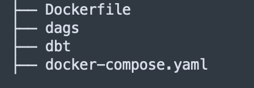
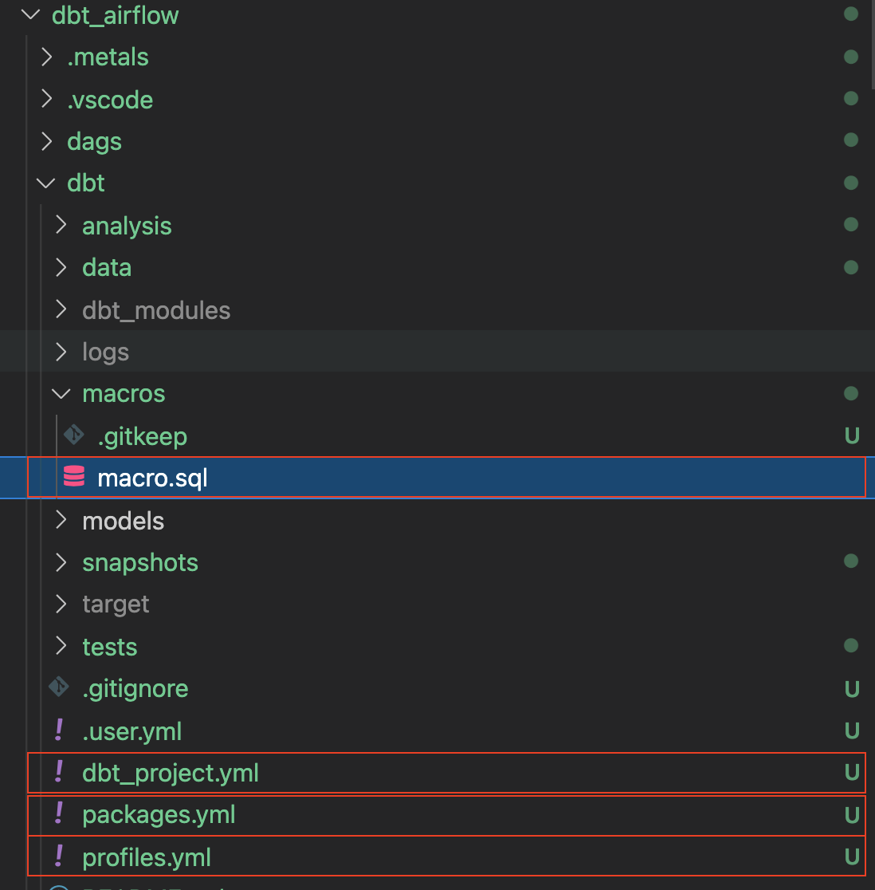
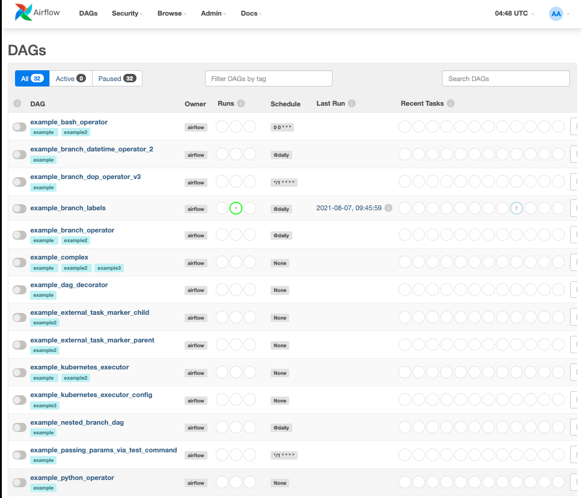
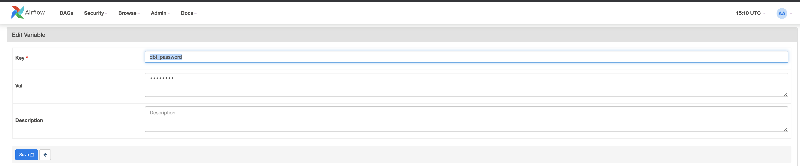
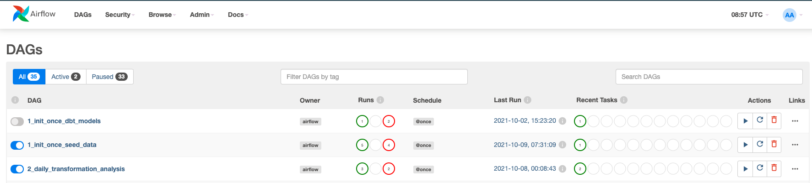

author: Adrian Lee
id: data_engineering_with_apache_airflow_kr
summary: This is a sample Snowflake Guide
categories: data-engineering,architecture-patterns,partner-integrations
environments: web
status: Published 
feedback link: https://github.com/Snowflake-Labs/sfguides/issues
tags: Getting Started, Data Engineering, dbt, Airflow, kr

# Apache Airflow, Snowflake 및 dbt를 사용한 데이터 엔지니어링

<!-- ------------------------ -->
## 개요

duration: 5


수많은 비즈니스는 민첩성, 성장 및 운영 효율성을 지원할 수 있는 최신 데이터 전략이 탑재된 플랫폼을 고려하고 있습니다. Snowflake는 데이터 클라우드입니다. 이는 인프라 관리와 유지 관리 대신 데이터와 분석에 집중할 수 있도록 모든 비즈니스를 위해 데이터 파이프라인을 간소화할 수 있는 미래 지향적인 솔루션입니다.

Apache Airflow는 데이터 파이프라인을 작성 및 관리하는 데 사용할 수 있는 오픈 소스 워크플로우 관리 플랫폼입니다. Airflow는 작업의 방향성 비순환 그래프(DAG)로 만들어진 워크플로우를 사용합니다.

[dbt](https://www.getdbt.com/)는 [dbt Labs](https://www.getdbt.com/)에서 유지하는 최신 데이터 엔지니어링 프레임워크입니다. Snowflake와 같은 클라우드 데이터 플랫폼을 활용하는 최신 데이터 아키텍처에서 큰 인기를 얻고 있습니다. [dbt CLI](https://docs.getdbt.com/dbt-cli/cli-overview)는 dbt 프로젝트를 실행하기 위한 명령줄 인터페이스입니다. CLI는 무료로 사용할 수 있으며 오픈 소스입니다.

이 가상 실습 랩에서는 데이터 변환 작업 스케줄러를 생성하기 위해 Airflow와 dbt를 사용하는 단계별 가이드를 따라 하게 됩니다.

시작하겠습니다.

### 사전 필요 조건 및 지식

이 가이드는 사용자가 Python 및 dbt에 대한 기본적인 실무 지식을 보유하고 있다고 가정합니다.

### 학습할 내용

- 데이터 스케줄러를 생성하기 위해 Airflow와 같은 오픈 소스 도구 사용하기
- DAG를 작성하고 이를 Airflow에 업로드하기
- dbt, Airflow 및 Snowflake를 사용하여 확장 가능한 파이프라인 구축하기

### 필요한 것

시작하기 전에 다음이 필요합니다.

1. Snowflake
2. **Snowflake 계정**
3. **적절한 권한을 포함하여 생성된 Snowflake 사용자** 이 사용자에게는 DEMO_DB 데이터베이스에서 객체를 생성하기 위한 권한이 필요합니다.
4. GitHub
5. **GitHub 계정** GitHub 계정이 아직 없다면 무료로 생성할 수 있습니다. 시작하려면 [GitHub 가입](https://github.com/join) 페이지를 방문하십시오.
6. **GitHub 리포지토리** 아직 리포지토리를 생성하지 않았거나 새로운 리포지토리를 생성하고 싶다면, [새로운 리포지토리를 생성합니다](https://github.com/new). 유형으로 `Public`을 선택합니다(하지만 두 가지 모두 사용할 수 있음). 또한, 지금은 README, .gitignore 및 라이선스 추가를 건너뛸 수 있습니다.
7. 통합 개발 환경(IDE)
8. **Git과 통합되며 선호하는 IDE** Git과 통합되며 선호하는 IDE가 아직 없다면, 훌륭한 무료 오픈 소스 IDE인 [Visual Studio Code](https://code.visualstudio.com/)를 추천합니다.
9. **컴퓨터에 프로젝트 리포지토리 복제** Git 리포지토리에 대한 연결 세부 정보를 위해 리포지토리를 열고 페이지 상단 부근에 있는 `HTTPS` 링크를 복사합니다. 최소 하나의 파일이 리포지토리에 있다면 페이지 상단 부근에 있는 녹색 `Code` 아이콘을 클릭하고 `HTTPS` 링크를 복사합니다. 이 링크를 VS Code 또는 선호하는 IDE에서 사용하여 리포지토리를 컴퓨터에 복제합니다.
10. Docker
11. **노트북에 Docker Desktop 설치**  Airflow를 컨테이너로 실행할 것입니다. [Docker 설정 지침](https://docs.docker.com/desktop/)에 따라 운영 체제에 Docker Desktop을 설치하십시오.

### 구축할 것

- dbt 및 Snowflake와 간단히 작동하는 Airflow 파이프라인

<!-- ------------------------ -->
## 환경 설정

duration: 2

우선, 아래 명령을 실행하여 폴더를 생성하겠습니다.

```
mkdir dbt_airflow && cd "$_"
```

다음으로 Airflow의 docker-compose 파일을 가져오겠습니다. 이 작업을 수행하기 위해 로컬 노트북에 대해 파일의 curl 명령을 실행하겠습니다.

```bash
curl -LfO 'https://airflow.apache.org/docs/apache-airflow/2.3.0/docker-compose.yaml'
```

이제 docker-compose 파일을 조정하겠습니다. 2개의 폴더를 볼륨으로 추가합니다. `dags`는 Airflow가 선택하여 분석할 수 있도록 Airflow DAG가 있는 폴더입니다. `dbt`는 dbt 모델과 CSV 파일을 구성한 폴더입니다.

```bash
  volumes:
    - ./dags:/opt/airflow/dags
    - ./logs:/opt/airflow/logs
    - ./plugins:/opt/airflow/plugins
    - ./dbt:/dbt # add this in
    - ./dags:/dags # add this in

```

이제 추가 docker-compose 매개변수로 추가 파일을 생성해야 합니다. 이렇게 하면 컨테이너가 시작될 때 dbt가 설치됩니다.

`.env`

```bash
_PIP_ADDITIONAL_REQUIREMENTS=dbt==0.19.0
```

---

이제 `dbt` 프로젝트와 `dags` 폴더를 생성해야 합니다.

dbt 프로젝트에 대해 `dbt init dbt` 명령을 실행합니다. 추후 4단계에서는 여기에서 dbt를 구성하게 됩니다.

dags 폴더에 대해 다음 작업을 수행해 폴더를 생성합니다.

```
mkdir dags
```

트리 리포지토리는 다음과 같아야 합니다.



<!-- ------------------------ -->
## dbt 프로젝트 설정

duration: 6

이제 리포지토리를 설정했으니 dbt 프로젝트를 구성 및 설정하겠습니다.

시작하기 전에 dbt 프로젝트를 위해 어떤 작업을 수행할지 알아보겠습니다.

아래 다이어그램에서 확인할 수 있듯이 `bookings_1`, `bookings_2` 및 `customers `라는 3개의 CSV 파일이 있습니다. 이러한 CSV 파일을 테이블로 Snowflake에 시드하겠습니다. 이 부분은 추후 4단계에서 자세히 살펴볼 것입니다.

이에 따라 `bookings_1` 및 `bookings_2` 테이블을 `combined_bookings`와 병합하겠습니다. 다음으로 `prepped_data` 테이블을 만들기 위해 `combined_bookings` 및 `customer` 테이블을 customer_id로 결합하겠습니다.

마지막으로 2개의 뷰를 생성하여 `prepped_data`에 대한 분석 및 변환 작업을 수행하겠습니다.

1) `hotel_count_by_day.sql`: 이렇게 하면 ANALYSIS 스키마에 hotel_count_by_day 뷰가 생성됩니다. 여기에서 일별로 호텔 예약 횟수를 계산하게 됩니다.

2) `thirty_day_avg_cost.sql`: 이렇게 하면 ANALYSIS 스키마에 thirty_day_avg_cost 뷰가 생성됩니다. 여기에서 지난 30일 동안의 평균 예약 비용을 계산하게 됩니다.


우선, Snowflake 콘솔로 이동하여 아래 스크립트를 실행하겠습니다. 이렇게 하면 dbt_user 및 dbt_dev_role이 생성됩니다. 그런 다음 dbt_user를 위한 데이터베이스를 설정합니다.

```sql
USE ROLE SECURITYADMIN;

CREATE OR REPLACE ROLE dbt_DEV_ROLE COMMENT='dbt_DEV_ROLE';
GRANT ROLE dbt_DEV_ROLE TO ROLE SYSADMIN;

CREATE OR REPLACE USER dbt_USER PASSWORD='<PASSWORD>'
	DEFAULT_ROLE=dbt_DEV_ROLE
	DEFAULT_WAREHOUSE=dbt_WH
	COMMENT='dbt User';
    
GRANT ROLE dbt_DEV_ROLE TO USER dbt_USER;

-- Grant privileges to role
USE ROLE ACCOUNTADMIN;

GRANT CREATE DATABASE ON ACCOUNT TO ROLE dbt_DEV_ROLE;

/*---------------------------------------------------------------------------
Next we will create a virtual warehouse that will be used
---------------------------------------------------------------------------*/
USE ROLE SYSADMIN;

--Create Warehouse for dbt work
CREATE OR REPLACE WAREHOUSE dbt_DEV_WH
  WITH WAREHOUSE_SIZE = 'XSMALL'
  AUTO_SUSPEND = 120
  AUTO_RESUME = true
  INITIALLY_SUSPENDED = TRUE;

GRANT ALL ON WAREHOUSE dbt_DEV_WH TO ROLE dbt_DEV_ROLE;

```

`dbt_user`로 로그인하고 명령을 실행하여 `DEMO_dbt` 데이터베이스를 생성하겠습니다.

```sql

CREATE OR REPLACE DATABASE DEMO_dbt

```


이제 앞서 1단계에서 설정한 `dbt_airflow` > `dbt` 프로젝트로 되돌아가겠습니다.

아래에 있는 각 파일의 몇 가지 구성을 설정하겠습니다. `dbt_project.yml`에 대해서는 모델 섹션만 바꾸면 됩니다.

profiles.yml

```yml
default:
  target: dev
  outputs:
    dev:
      type: snowflake
      ######## Please replace with your Snowflake account name 
      ######## for example sg_demo.ap-southeast-1
      account: <ACCOUNT_URL>.<REGION> 

      user: "{{ env_var('dbt_user') }}"
      ######## These environment variables dbt_user and dbt_password 
      ######## are read from the variabls in Airflow which we will set later
      password: "{{ env_var('dbt_password') }}"

      role: dbt_dev_role
      database: demo_dbt
      warehouse: dbt_dev_wh
      schema: public
      threads: 200
```

packages.yml

```yml
packages:
  - package: fishtown-analytics/dbt_utils
    version: 0.6.4
```

dbt_project.yml

```yml
models:
  my_new_project:
      # Applies to all files under models/example/
      transform:
          schema: transform
          materialized: view
      analysis:
          schema: analysis
          materialized: view
```

다음으로 `packages.yml` 내부에 배치한 `fishtown-analytics/dbt_utils`를 설치하겠습니다. `dbt` 폴더에서 `dbt deps` 명령을 실행하여 설치할 수 있습니다.

이제 `macros` 폴더에 `custom_demo_macros.sql`이라는 파일을 생성하고 아래 SQL을 입력하겠습니다.

```sql

    
    
        {{ default_schema }}
    
        {{ custom_schema_name | trim }}
    




   {# always use model name #}
  
    
    {{ log("Setting query_tag to '" ~ new_query_tag ~ "'. Will reset to '" ~ original_query_tag ~ "' after materialization.") }}
    
    {{ return(original_query_tag)}}
  
  {{ return(none)}}

```

모든 것이 올바르게 진행되면 폴더는 다음과 같아야 합니다. 주석이 달린 상자는 위에서 진행한 내용입니다.

여기에서 진행할 마지막 단계는 `db_utils`의 dbt 모듈을 설치하는 것입니다. dbt 디렉터리에서 실행합니다.

``` 
dbt deps
```

그러면 `dbt_modules` 폴더에 관련 모듈이 설치되는 것을 확인할 수 있습니다.

지금쯤 폴더 구조는 다음과 같아야 합니다.



dbt 구성이 완료되었습니다. 다음 섹션에서는 CSV 파일과 DAG를 생성하겠습니다.

<!-- ------------------------ -->
## dbt에서 CSV 데이터 파일 생성

duration: 10

이 섹션에서는 샘플 CSV 데이터 파일과 관련 SQL 모델을 준비하겠습니다.

우선 dbt 폴더에 있는 `data` 폴더에 3개의 Excel 파일을 생성하며 시작하겠습니다.

bookings_1.csv

```csv
id,booking_reference,hotel,booking_date,cost
1,232323231,Pan Pacific,2021-03-19,100
1,232323232,Fullerton,2021-03-20,200
1,232323233,Fullerton,2021-04-20,300
1,232323234,Jackson Square,2021-03-21,400
1,232323235,Mayflower,2021-06-20,500
1,232323236,Suncity,2021-03-19,600
1,232323237,Fullerton,2021-08-20,700
```

bookings_2.csv

```csv
id,booking_reference,hotel,booking_date,cost
2,332323231,Fullerton,2021-03-19,100
2,332323232,Jackson Square,2021-03-20,300
2,332323233,Suncity,2021-03-20,300
2,332323234,Jackson Square,2021-03-21,300
2,332323235,Fullerton,2021-06-20,300
2,332323236,Suncity,2021-03-19,300
2,332323237,Berkly,2021-05-20,200
```

customers.csv

```csv
id,first_name,last_name,birthdate,membership_no
1,jim,jone,1989-03-19,12334
2,adrian,lee,1990-03-10,12323
```

폴더 구조는 다음과 같아야 합니다.


<!-- ------------------------ -->
## models 폴더에서 dbt 모델 생성

duration: 2

models 폴더에서 `analysis` 및 `transform` 폴더 2개를 생성합니다. 분석 및 변환을 위해 아래에 있는 섹션을 각각 따르십시오.

### transform 폴더를 위한 dbt 모델

`transform` 폴더에는 3개의 SQL 파일이 있습니다.

1) `combined_bookings.sql`: 이는 위에서 봤던 2개의 예약 CSV 파일을 결합하고 `TRANSFORM` 스키마에 `COMBINED_BOOKINGS` 뷰를 생성합니다.

combined_bookings.sql

```sql
{{ dbt_utils.union_relations(
    relations=[ref('bookings_1'), ref('bookings_2')]
) }}
```

2) `customer.sql`: 이는 `TRANSFORM` 스키마에 `CUSTOMER` 뷰를 생성합니다.

customer.sql

```sql
SELECT ID 
    , FIRST_NAME
    , LAST_NAME
    , birthdate
FROM {{ ref('customers') }}
```

3) `prepped_data.sql`: 이는 `TRANSFORM` 스키마에 `PREPPED_DATA` 뷰를 생성합니다. 여기에서는 위 단계의 `CUSTOMER` 및 `COMBINED_BOOKINGS` 뷰에 대한 내부 조인 작업이 수행됩니다.

prepped_data.sql

```sql
SELECT A.ID 
    , FIRST_NAME
    , LAST_NAME
    , birthdate
    , BOOKING_REFERENCE
    , HOTEL
    , BOOKING_DATE
    , COST
FROM {{ref('customer')}}  A
JOIN {{ref('combined_bookings')}} B
on A.ID = B.ID
```

### analysis 폴더를 위한 dbt 모델

이제 `analysis` 폴더로 이동하겠습니다. `analysis` 폴더로 바꾸고 다음과 같은 2개의 SQL 파일을 생성합니다.

1) `hotel_count_by_day.sql`: 이렇게 하면 `ANALYSIS` 스키마에 hotel_count_by_day 뷰가 생성됩니다. 여기에서 일별로 호텔 예약 횟수를 계산하게 됩니다.

```sql
SELECT
  BOOKING_DATE,
  HOTEL,
  COUNT(ID) as count_bookings
FROM {{ ref('prepped_data') }}
GROUP BY
  BOOKING_DATE,
  HOTEL
```

2) `thirty_day_avg_cost.sql`: 이렇게 하면 `ANALYSIS` 스키마에 thirty_day_avg_cost 뷰가 생성됩니다. 여기에서 지난 30일 동안의 평균 예약 비용을 계산하게 됩니다.

```sql
SELECT
  BOOKING_DATE,
  HOTEL,
  COST,
  AVG(COST) OVER (
    ORDER BY BOOKING_DATE ROWS BETWEEN 29 PRECEDING AND CURRENT ROW
  ) as "30_DAY_AVG_COST",
  COST -   AVG(COST) OVER (
    ORDER BY BOOKING_DATE ROWS BETWEEN 29 PRECEDING AND CURRENT ROW
  ) as "DIFF_BTW_ACTUAL_AVG"
FROM {{ ref('prepped_data') }}
```

파일 구조는 다음과 같아야 합니다. 이미 dbt 모델을 완료했으니 Airflow에 대한 작업을 진행할 수 있습니다.


<!-- ------------------------ -->
## Airflow DAG 준비

duration: 5

`dags` 폴더에서 `init.py` 및 `transform_and_analysis.py` 파일 2개를 생성합니다. `init.py`는 초기화하며 CSV 데이터를 열람합니다. `transform_and_analysis.py`는 변환 및 분석 작업을 수행합니다.

그런 다음 Airflow를 사용하여 매일 `transform_and_analysis` DAG를 예약할 수 있습니다. 하지만 이 사례에서는 DAG를 수동으로 트리거하겠습니다.

init.py

```python
from datetime import datetime
import os

from airflow import DAG
from airflow.operators.python import PythonOperator, BranchPythonOperator
from airflow.operators.bash import BashOperator
from airflow.operators.dummy_operator import DummyOperator

default_args = {
    'owner': 'airflow',
    'depends_on_past': False,
    'start_date': datetime(2020,8,1),
    'retries': 0
}


with DAG('1_init_once_seed_data', default_args=default_args, schedule_interval='@once') as dag:
    task_1 = BashOperator(
        task_id='load_seed_data_once',
        bash_command='cd /dbt && dbt seed --profiles-dir .',
        env={
            'dbt_user': '{{ var.value.dbt_user }}',
            'dbt_password': '{{ var.value.dbt_password }}',
            **os.environ
        },
        dag=dag
    )

task_1  
```

transform_and_analysis.py

```python
from airflow import DAG
from airflow.operators.python import PythonOperator, BranchPythonOperator
from airflow.operators.bash import BashOperator
from airflow.operators.dummy_operator import DummyOperator
from datetime import datetime


default_args = {
    'owner': 'airflow',
    'depends_on_past': False,
    'start_date': datetime(2020,8,1),
    'retries': 0
}

with DAG('2_daily_transformation_analysis', default_args=default_args, schedule_interval='@once') as dag:
    task_1 = BashOperator(
        task_id='daily_transform',
        bash_command='cd /dbt && dbt run --models transform --profiles-dir .',
        env={
            'dbt_user': '{{ var.value.dbt_user }}',
            'dbt_password': '{{ var.value.dbt_password }}',
            **os.environ
        },
        dag=dag
    )

    task_2 = BashOperator(
        task_id='daily_analysis',
        bash_command='cd /dbt && dbt run --models analysis --profiles-dir .',
        env={
            'dbt_user': '{{ var.value.dbt_user }}',
            'dbt_password': '{{ var.value.dbt_password }}',
            **os.environ
        },
        dag=dag
    )

    task_1 >> task_2 # Define dependencies
```

<!-- ------------------------ -->
## Airflow를 위해 docker-compose 파일 실행

duration: 5

`docker-compose up`을 실행하고 [http://localhost:8080/](http://localhost:8080/)으로 이동하겠습니다. 기본 사용자 이름은 `airflow`이고 암호는 `airflow`입니다.



이제 2개의 변수를 생성하겠습니다. `admin > Variables`로 이동하여 `+` 아이콘을 클릭합니다.


우선 `dbt_user` 키와 `dbt_user` 값을 생성하겠습니다.


이제 두 번째 `dbt_password` 키와 `<ADD IN YOUR PASSWORD>` 값을 생성하겠습니다.



<!-- ------------------------ -->
## DAG 활성화 및 실행

이제 DAG를 활성화하겠습니다. `1_init_once_seed_data` 및 `2_daily_transformation_analysis`의 파란색 버튼을 클릭합니다.



### 1_init_once_seed_data 실행

이제 데이터를 시드하기 위해 `1_init_once_seed_data`를 실행하겠습니다. 실행하려면 DAG 오른쪽에 있는 `Actions` 아래의 재생 아이콘을 클릭합니다.


### PUBLIC 스키마에 생성된 테이블에서 시드 데이터 보기

모든 것이 올바르게 진행되면 Snowflake 인스턴스로 되돌아갔을 때 `PUBLIC` 스키마에 성공적으로 생성된 트리 테이블이 보여야 합니다.


### 2_daily_transformation_analysis 실행

`transform` 및 `analysis` 모델을 실행할 두 번째 `2_daily_transformation_analysis` DAG를 실행하겠습니다.


`Transform` 및 `Analysis` 뷰가 성공적으로 생성되었습니다!


<!-- ------------------------ -->
## 결론

duration: 1

축하합니다! dbt 및 Snowflake로 첫 번째 Apache Airflow를 생성하셨습니다! 자체 샘플이나 프로덕션 데이터를 로드하고 이 랩에서 다루지 않은 더 고급 수준의 Airflow 및 Snowflake 기능을 사용하여 무료 평가판을 계속 사용해 보십시오.

### 추가 리소스:

- 18,000명 이상의 데이터 실무자가 참여하고 있는 [dbt 커뮤니티 Slack](https://www.getdbt.com/community/)에 오늘 참여해 보십시오. Snowflake 관련 콘텐츠 전용 Slack 채널(#db-snowflake)을 운영하고 있습니다.
- 단순한 [Airflow DAG](https://airflow.apache.org/docs/apache-airflow/stable/tutorial.html) 작성 방법에 대한 빠른 자습서

### 다룬 내용:

- Airflow, dbt 및 Snowflake 설정하기
- DAG 생성하기 및 DAG에서 dbt 실행하기
