author: Shreya Sisodia
id: data_engineering_with_datastage
summary: Lab to demonstrate ease of loading enterprise data into Snowflake through DataStage.
categories: featured,getting-started,data-engineering,partner-integrations
environments: web
status: Published
feedback link: https://github.com/Snowflake-Labs/sfguides/issues
tags: Data Engineering, Getting Started, DataStage, Data Integration

# A Data Integration Guide: Load Banking Data into Snowflake with IBM DataStage

<!-- ------------------------ -->
## Overview
 
IBM DataStage is a world-class data integration tool that helps users build trusted data pipelines, orchestrate data across distributed landscapes, and move and transform data between cloud sources and data warehouses. It provides a native Snowflake connector, among many others, to read, write, and load data into Snowflake and integrate it into the data pipeline. This Quickstart demonstrates how to load enterprise data into Snowflake quickly and efficiently through IBM DataStage. Let's get going!     

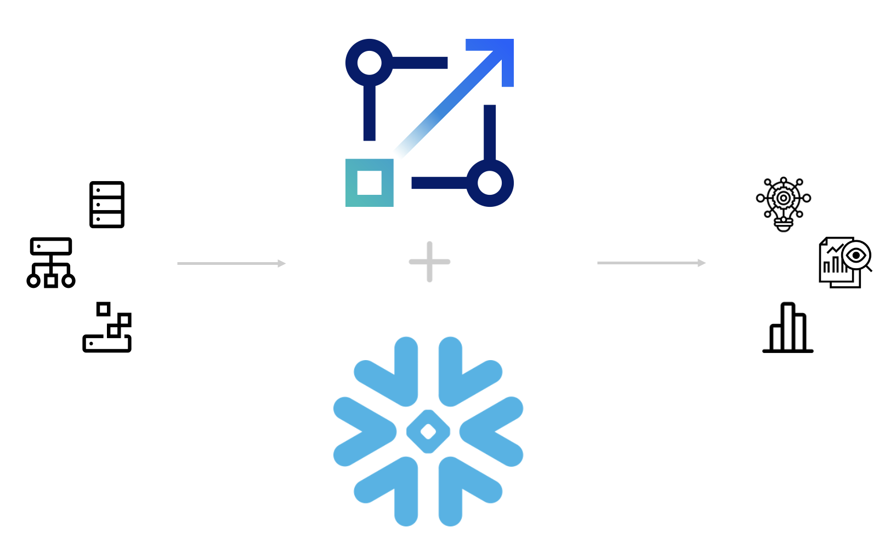  

### Prerequisites
- Access to an [IBM CP4DaaS account](https://dataplatform.cloud.ibm.com/registration/stepone?utm_medium=Exinfluencer&utm_source=Exinfluencer&utm_content=CPDWW&utm_term=30AE5&utm_id=PRODUCT1ENCTA1&context=cpdaas&apps=cos%2Cdatastage&regions=us-south%2Ceu-de&S_PKG=ov80049&cm_mmca1=10000665&cm_mmca2=000000TF) (or free trial)
- Access to a [Snowflake account](https://signup.snowflake.com/) (or free trial)

### What You'll Learn
- How to start working with DataStage 
- How to design a DataStage flow 
- How to configure a Snowflake connection
- How to compile and execute a DataStage job

### What You'll Build
- A DataStage flow that loads enterprise data from a Db2 Warehouse into a Snowflake data warehouse table

<!-- ------------------------ -->

## Create and prepare a Snowflake data warehouse
Duration: 2

Your goal is to use IBM DataStage to load data into your Snowflake account. To accomplish that, you need a data warehouse in your Snowflake account. Follow these steps to create a data warehouse in your Snowflake account.

1. Log in to your Snowflake trial account. 

2. In the navigation pane, click **Admin > Warehouses**. 
    -  Click **+ Warehouse**. 
    - For the *Name*,  type **DATASTAGEDATA**.
    - Accept the defaults for the rest of the fields, and click **Create Warehouse**.  

         
        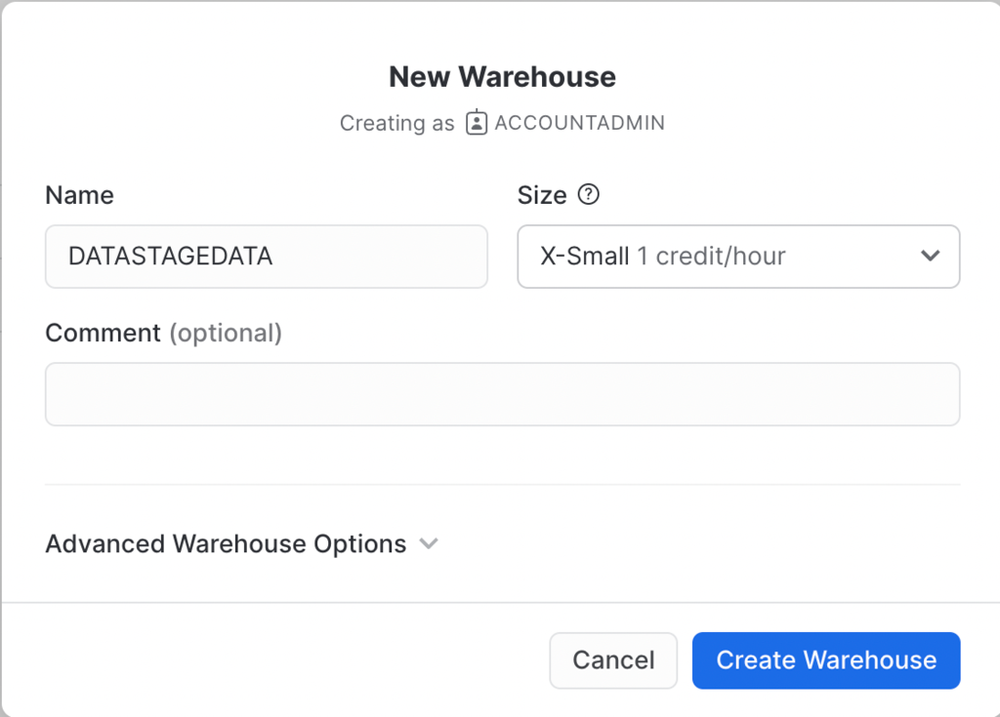  
 
3. In the navigation pane, click **Data**.
    -  Click **+ Database**.
    -  For the *Name*, type **DATASTAGEDB**, and click **Create**.  

          

        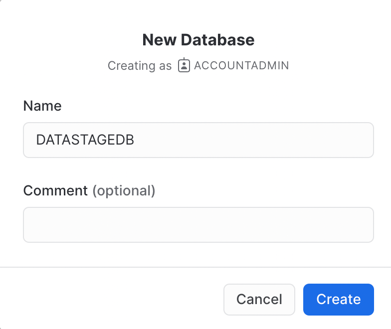  

4. Click the newly created **DATASTAGEDB** database in the list, and select **+ Schema**.
    - For the *Schema* name, type **MORTGAGE**.
    - Click **Create**.  

        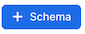  
        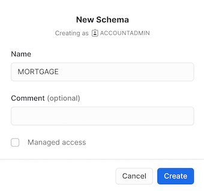  

**Check your progress**: The following image shows the DATASTAGEDB database in Snowflake. You now have all of the credentials ready on Snowflake to begin working in DataStage. 

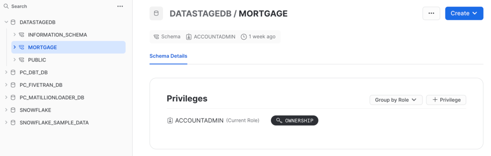  

<!-- ------------------------ -->

## Provision DataStage on Cloud Pak for Data as a Service
Duration: 2

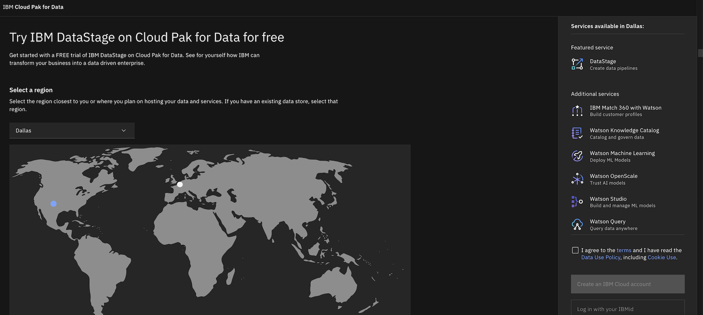 

To provision DataStage and begin working with the enterprise data, you must first sign up for Cloud Pak for Data as a Service and provision DataStage. 
1. Visit the [DataStage Trial Page](https://dataplatform.cloud.ibm.com/registration/stepone?utm_medium=Exinfluencer&utm_source=Exinfluencer&utm_content=CPDWW&utm_term=30AE5&utm_id=PRODUCT1ENCTA1&context=cpdaas&apps=cos%2Cdatastage&regions=us-south%2Ceu-de&S_PKG=ov80049&cm_mmca1=10000665&cm_mmca2=000000TF). 
2. Check the box to agree to the terms.
4. If you have an existing Cloud Pak for Data as a Service or IBM Cloud account, then follow these steps:
    - Click **Log in with your IBMid**.
    - Provide your IBMid, and click **Continue**.
    - Provide your password, and click **Log in**. Wait for the Cloud Pak for Data home page to display.
5. If you don't have an existing Cloud Pak for Data as a Service or IBM Cloud  account, then follow these steps:
    - Click **Create an IBM Cloud account**.
    - Provide an email address and password to be used as your IBMid, and click **Next**.
    - Access your email account, open the email from *IBM Cloud*, and copy your 7-digit verification code.
    - Return to the sign up page, paste your verification code, and click **Next**.
    - Provide your personal information, and click **Next**.
    - Check the box to accept the terms and conditions, and click **Continue**.
    - Check the box to acknowledge the data privacy notice, and click **Continue**. Wait for the Cloud Pak for Data home page to display.
    - Enter in your billing and payment information. **Note**: Credit card information is only for identity verification purposes. You will be using the DataStage lite plan for this Quickstart so there will be no charge for using DataStage. 

**Check your progress**: The following image shows the Cloud Pak for Data home page.

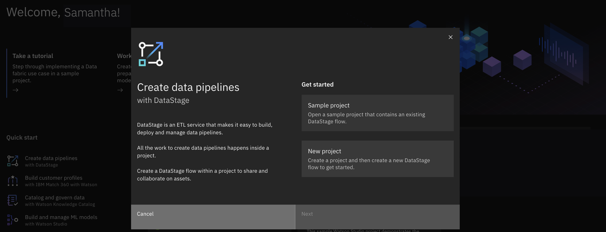  

<!-- ------------------------ -->

## Create a DataStage project
Duration: 2

You need a project to store the connections to external data sources and the DataStage flow. A project is a collaborative workspace where you work with data and other assets to accomplish a particular goal. Follow these steps to create the sample project:

1. From the pop-up, select **Sample Project** and then select **Next**.   
2. Click **Create Project**. 

    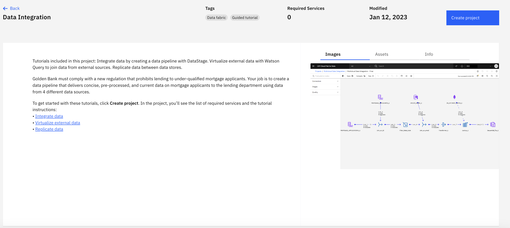  

3. The project name and description are filled in for you. Click **Create**. This creates the project containing a connection to a Db2 Warehouse on Cloud instance where the enterprise data is stored, and then you can begin constructing the DataStage flow. 

    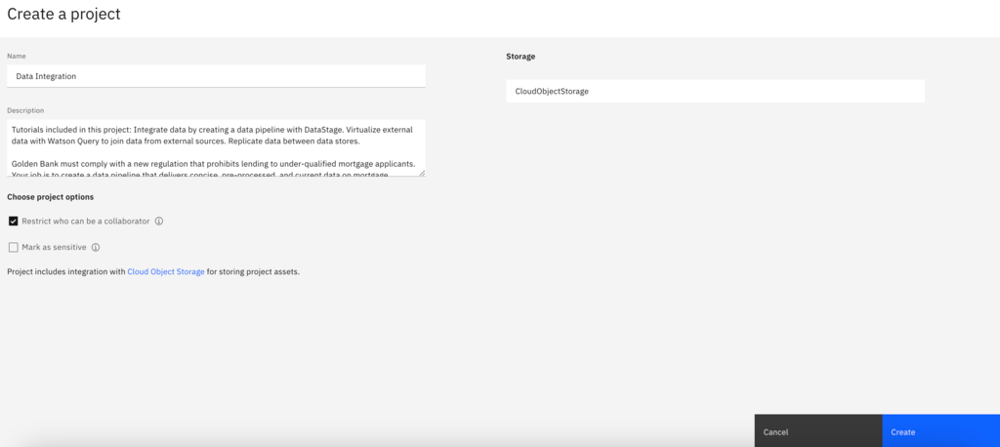  

4. Once the project has finished importing, select **View new project**. 

    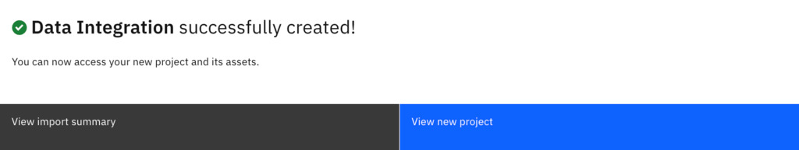  

5. Click the **Assets Tab** to verify that the project and assets were created successfully. 

    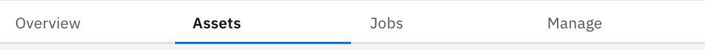  

**Check your progress**: The following image shows the sample project. You are now ready to create the connection to Snowflake.

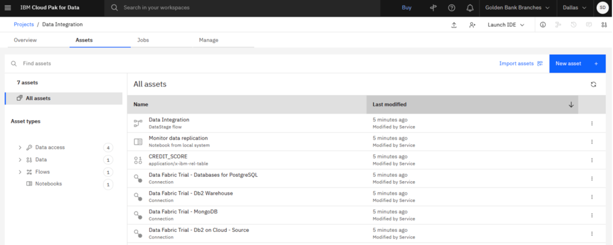  

<!-- ------------------------ -->
## Create a connection to your Snowflake data warehouse
Duration: 2

You need to add the connection information to your project so you can access the Snowflake data warehouse in your DataStage flow. Follow these steps to create the connection asset in your project:

1. From the *Assets* tab, click **New Asset** on the right side of the screen. 

2. In the *Data Access Tools* section, click **Connection**.

    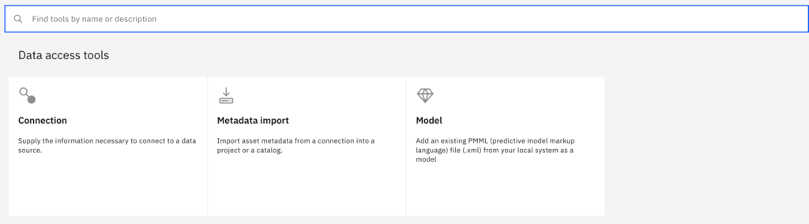  

3. Search for *Snowflake* in the **Find connection types** search field.

    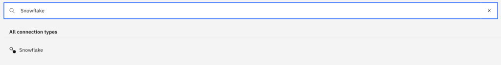  

4. Select the **Snowflake** connector, and then click **Select**.

    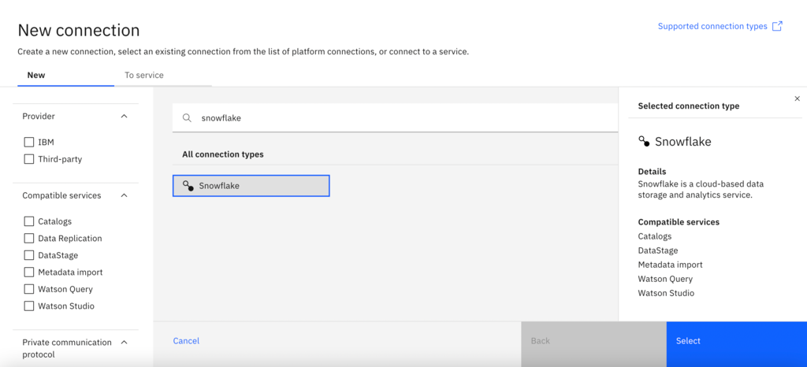  

5. On the *Create* connection: *Snowflake* page, type **Snowflake** for the connection name.  
6. For the *Connection details*, complete the following fields using the information from the Snowflake account you created in the first task:
    - Account name: Your account name is a combination of your account ID, your region, and your cloud provider. You can find this information in the URL when logged in to your Snowflake account. For example, if your login URL is https://app.snowflake.com/us-east4.gcp/iu68134, then your account name is iu68134.us-east4.gcp.
    - Database: Type **DATASTAGEDB**.
    - Role: Type **ACCOUNTADMIN**.
    - Warehouse: Type **DATASTAGEDATA**.
    - Username: Type your Snowflake account username.
    - Password: Type your Snowflake account password.
    - Click **Test Connection** to test the connection to your Snowflake account.  
7. If the test is successful, click **Create**. This will create the Snowflake connector which you can use to load the data from Db2 Warehouse into your Snowflake account.   

**Check your progress**: The following image shows the new connection information. You are now ready to create the DataStage flow.

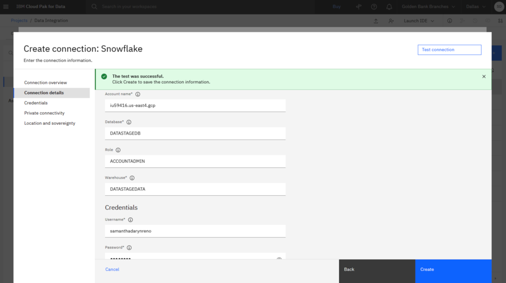  

<!-- ------------------------ -->
## Create a DataStage flow
Duration: 1

Now you are ready to create a DataStage flow that loads the Db2 Warehouse data to your Snowflake data warehouse. Follow these steps to create the DataStage flow:

1. From the *Assets* tab, click **New Asset**. 

2. In the *Graphical builders* section, click **DataStage**.  

    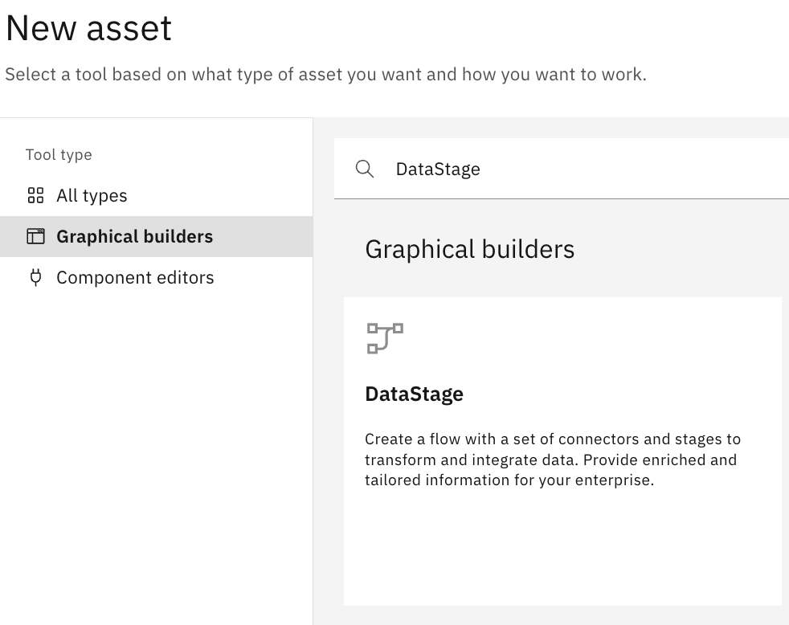  

3. For the *Name*, type **Load Db2 data to Snowflake**.

    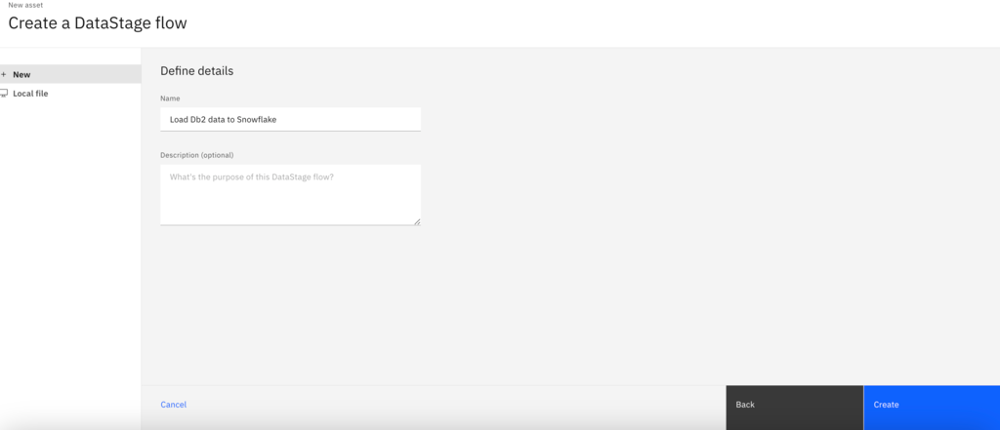  

4. Click **Create**. The DataStage canvas displays where you can create the flow to load data onto Snowflake.  

**Check your progress**: The following image shows an empty DataStage canvas. You are now ready to design a DataStage flow.

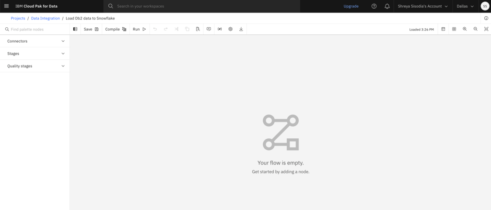  
<!-- ------------------------ -->

## Design the DataStage flow
Duration: 5

Now you are ready to design a DataStage flow to load data into Snowflake. The DataStage flow contains two connector nodes: the Db2 Warehouse connector pointing to the source data asset and the Snowflake connector pointing to the target data asset. You will also add in two other nodes to perform simple transformations and join and filter the data assets. Follow these steps to add the nodes to your canvas: 

**Add the two connector nodes**: 

1. In the node palette, expand the **Connectors** section.  

     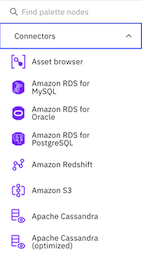  

2. Drag the **Asset browser** connector and drop it anywhere on the empty canvas.  

      

3. When you drop the *Asset Browser connector* on the canvas, you are prompted to select the asset.
    - To locate the asset, select **Connection > Data Fabric Trial - Db2 Warehouse > BANKING > MORTGAGE_APPLICATION**. 
    **Note**: To expand the connection and schema, click the connection or schema name instead of the checkbox. 
        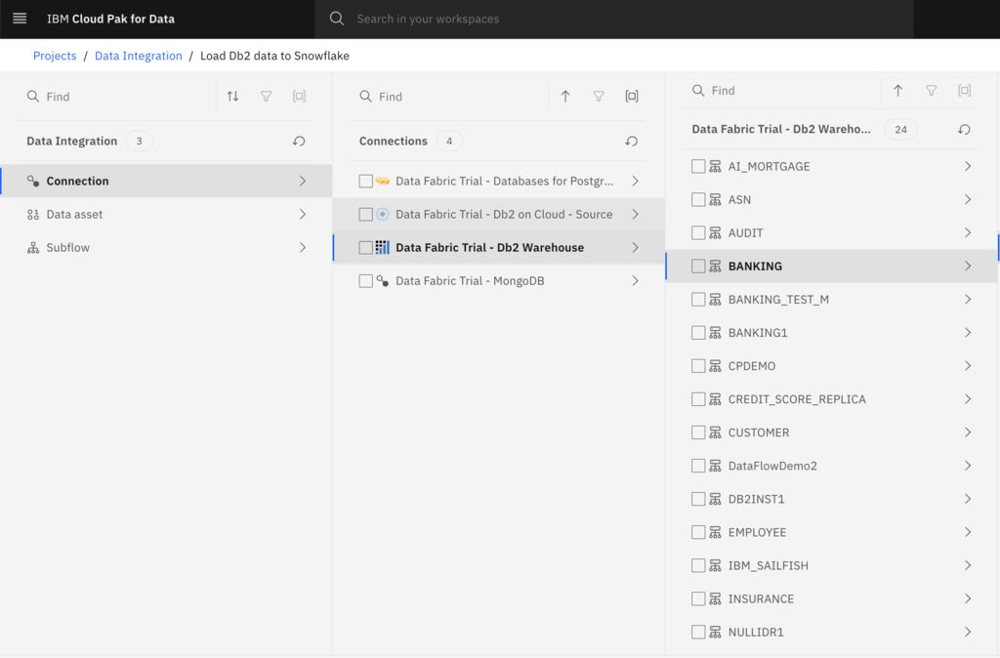  

    - Click **Add** to drop the Db2 data source onto the DataStage canvas.  

        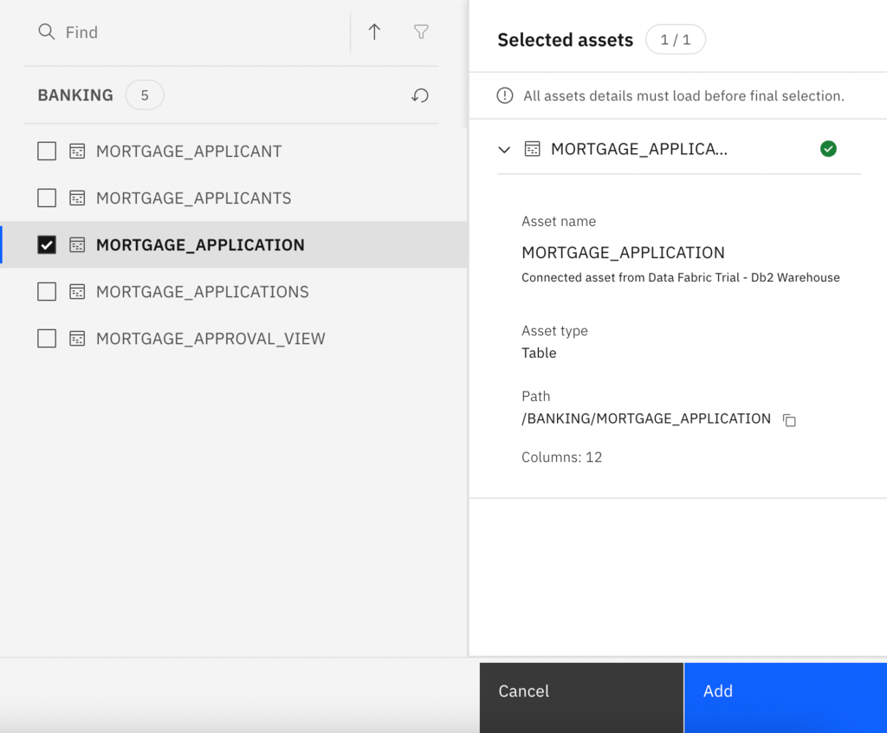 
        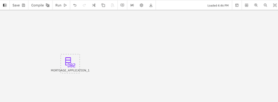  

4. Double-click the **MORTGAGE_APPLICATION** node to see its settings.
    - Click the **Output** tab.
    - Check the **Runtime column propagation** option. DataStage is flexible about metadata. It can handle where metadata is not fully defined. In this case, we select **Runtime column propagation** so that if the DataStage job encounters extra columns that are not defined in the metadata when it actually runs, it adopts these extra columns and propagates them through the rest of the job. This feature allows your flow design to be flexible for schema drift. 
    - Click **Save**.  

        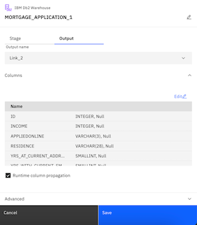  

Because you are reading data from Db2 Warehouse into Snowflake, the Db2 connector is positioned first in the flow. Your goal is to load the Db2 Warehouse data into Snowflake. Next, you will add a Snowflake connector that reads the data from the Db2 Warehouse connector. Thus, the Snowflake connector is positioned second in the flow. 

5. Back in the **Node palette**, expand the **Connectors** section.
6. Drag the **Asset browser** connector and drop it on the canvas so it is positioned as the second node.
    - To locate the schema, select **Connection > Snowflake > MORTGAGE. Note:** Click the checkbox to select the *MORTGAGE* schema name.
    - Click **Add** to drop the Snowflake connection onto the DataStage canvas.

        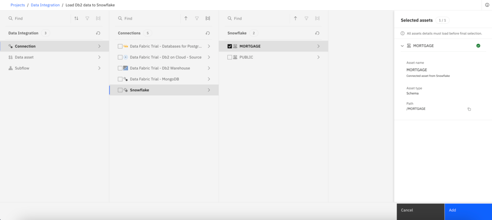  

7. To link the nodes together, hover over the **Mortgage_Application_1** node until you see an arrow. Drag the arrow to the Snowflake connection to connect the two nodes.

    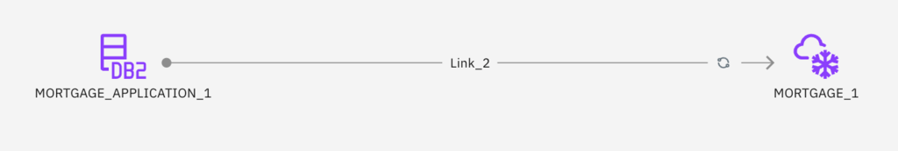  

8. Double-click the **MORTGAGE_1** connector to see its settings.
    - Change the node name to **Snowflake_mortgage_data**. 

        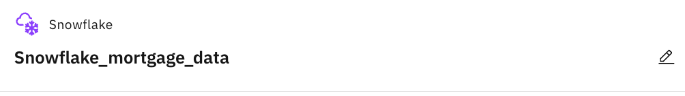 

    - In the settings side panel, click the **Input** tab.
    - Expand the **Usage** section. 
    - For *Write mode*, select **Insert**. 
    - For the *Table name*, add **APPLICATION** after the schema name, so the full table name reads ***MORTGAGE.APPLICATION***.
    - For the *Table action*, select **Replace**. This setting will create the table in the specified database and schema in Snowflake, and then load the enterprise data into that table. All other selections under Actions can be kept the same. 
    - Click **Save** to update the changes, and return to the DataStage flow.  

        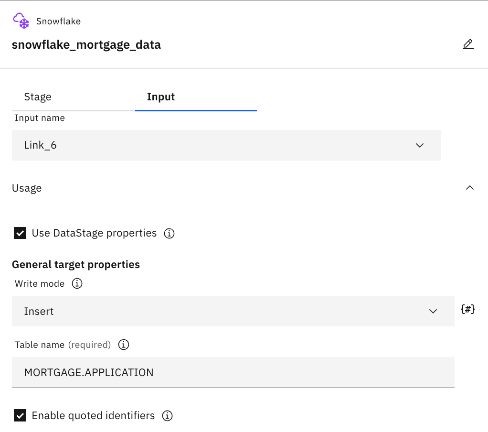
        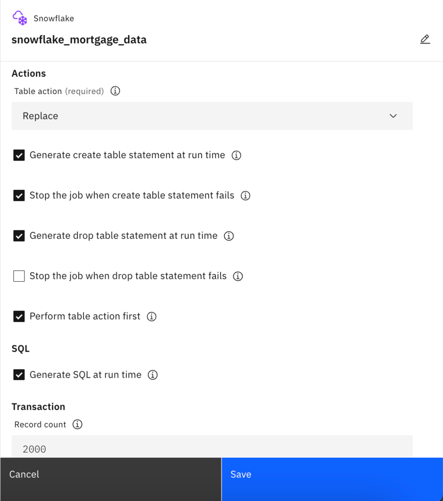  

<!-- ------------------------ -->
## Add Transformation Nodes
Duration: 5

Now you have a basic DataStage flow to load the data into Snowflake. Follow these steps to add two nodes to join and filter the data:   

**Asset connector node**
1. In the node palette, expand the **Connectors** section. 
2. Drag the **Asset browser** connector on to the canvas close to the MORTGAGE_APPLICATION node. 
3. When you drop the *Asset Browser* connector on the canvas, you are prompted to select the asset.
    - To locate the asset, select **Connection > Data Fabric Trial - Db2 Warehouse > BANKING > MORTGAGE_APPLICANT. Note**: To expand the connection and schema, click the connection or schema name instead of the checkbox.
    - Click **Add** to drop the Db2 Warehouse data source onto the DataStage canvas.

        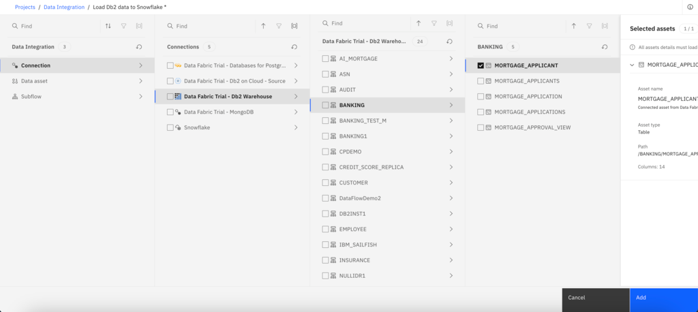  

4. Double-click the **MORTGAGE_APPLICANT** node to see its settings.
    - Click the **Output** tab.
    - Check the **Runtime column propagation** option. DataStage is flexible about metadata. It can handle where metadata is not fully defined. In this case, we select **Runtime column propagation** so that if the DataStage job encounters extra columns that are not defined in the metadata when it actually runs, it adopts these extra columns and propagates them through the rest of the job. This feature allows your flow design to be flexible for schema drift. 
    - Click **Save**.  

        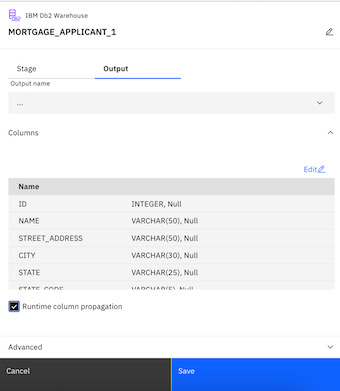  

**Check your progress**: The following image shows what the DataStage flow should look like after adding in the *Mortgage_Applicant* node. You are now ready to add in the join and filter nodes. 

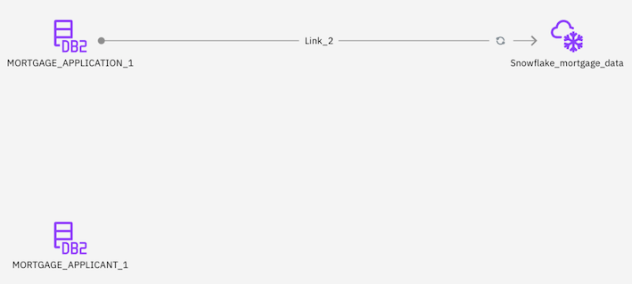  

**Join Stage Node** 

1. In the *Node palette*, expand the **Stages** section.  

    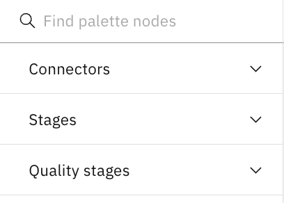  

2. In the *Node palette*, drag the **Join** stage on to the canvas, and drop the node on the link line between the *MORTGAGE_APPLICATION* and *Snowflake_mortgage_data* nodes. This action maintains links from the *MORTGAGE_APPLICATION* node to the *JOIN* node to the *Snowflake_mortgage_data* node.  

    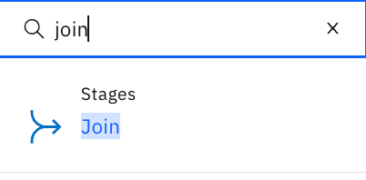 
    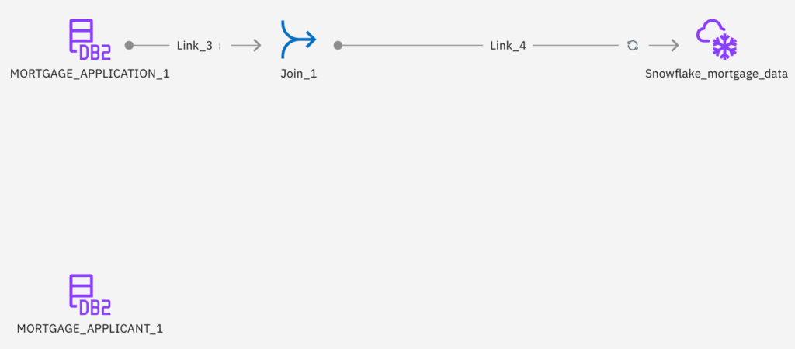  

3. Hover over the **MORTGAGE_APPLICANT** connector to see the arrow. Connect the arrow to the **Join** stage.

    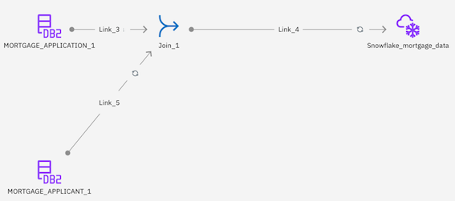  

4. Double-click the **Join_1** node to edit the settings.
    - Expand the **Properties** section.
    - Click **Add key**.
        - Click **Add key** again.
        - Select **ID** from the list of possible keys.
        - Click **Apply**. 
        - Click **Apply and return** to return to the *Join_1* node settings.  

            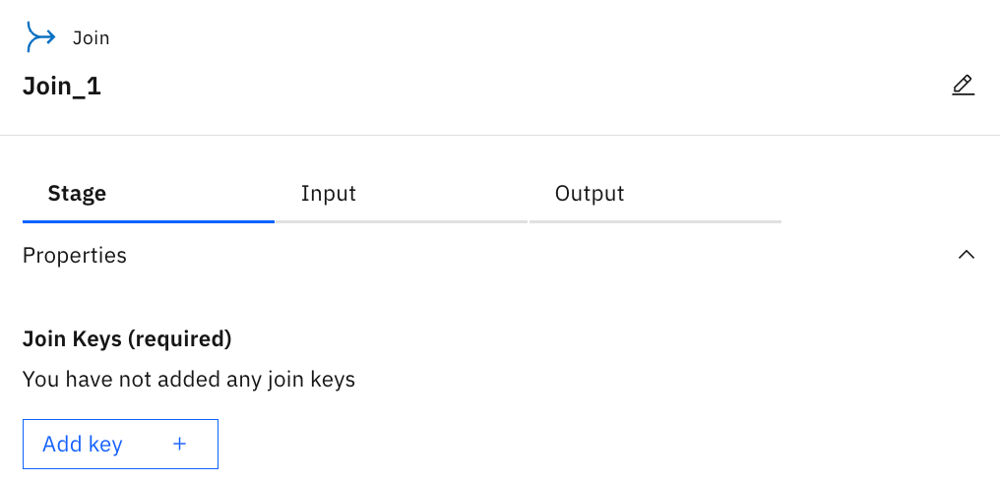 
            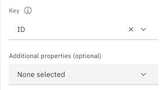  

    - Change the *Join_1* node name to **Join_on_ID**. 
    - Click the **Output** tab.
        - Check the **Runtime column propagation** option.
    - Click **Save** to save the *Join_on_ID* node settings. 
        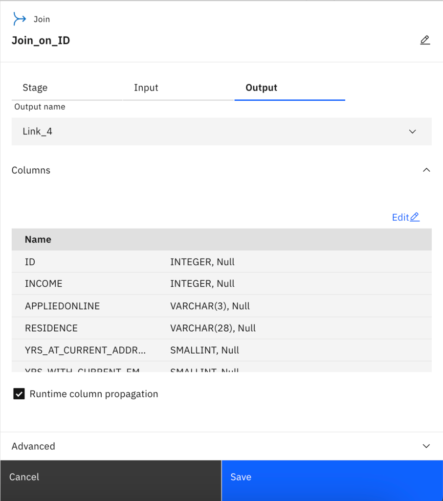  

**Filter Stage Node** 

1. In the *Node palette*, in the *Stages* section, drag the **Filter** node to the canvas, and drop the node on the link line between the *Join_on_ID* and *Snowflake_mortgage_data* nodes.

    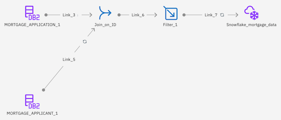  

2. Double-click the **Filter_1** node to edit the settings.
    - Change the *Filter_1* node name to **Filter_on_CA**.  

        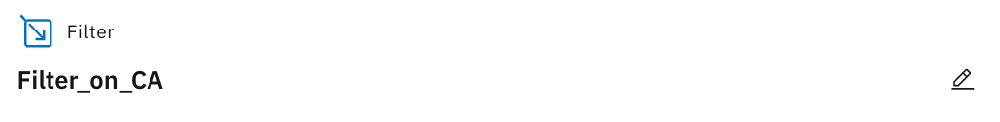  

    - Expand the **Properties** section.  

        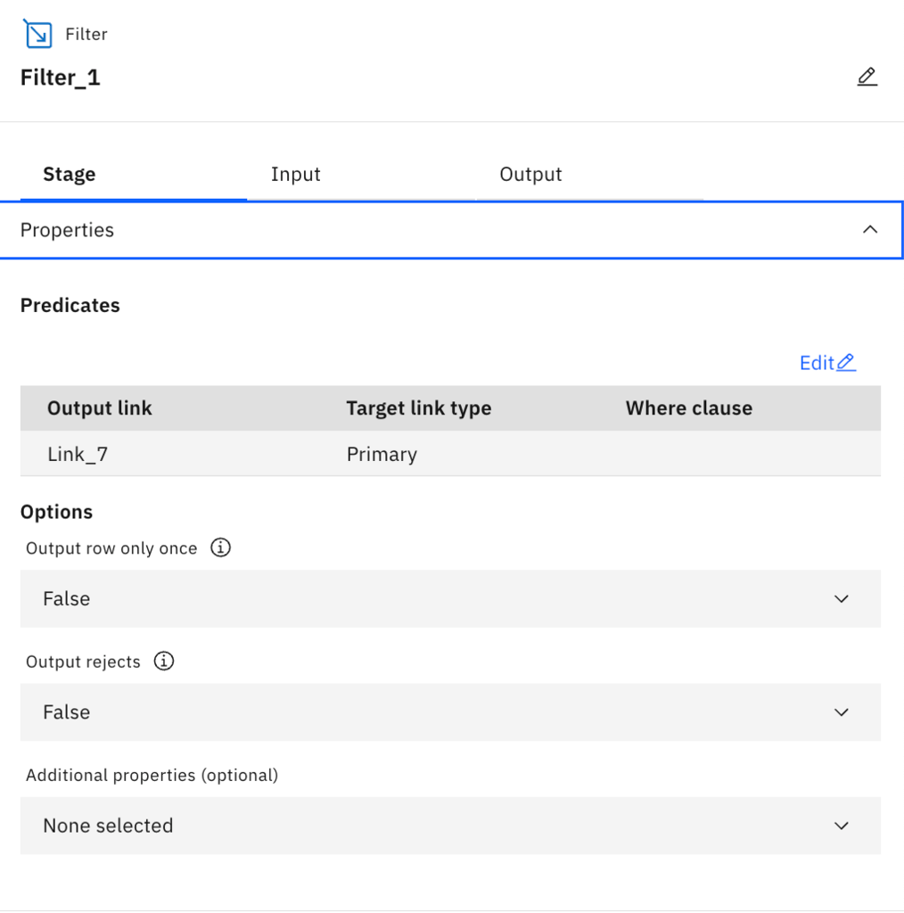  

    - Under *Predicates*, click **Edit**.
        - Click below **Where clause** to enter in a custom filter clause. 

            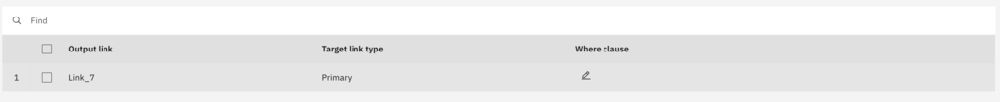

        - Type **STATE_CODE='CA'**. This will filter all mortgage applications to only keep those that came from California. 

            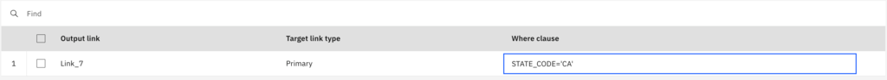

        - Click **Apply and return**. 
    - Click the **Output** tab.
        - Check the **Runtime column propagation** option.
        - Click **Save** to save the Filter node settings.  

              

**Check your progress**: The following image shows the completed DataStage flow. You are now ready to run the DataStage job.

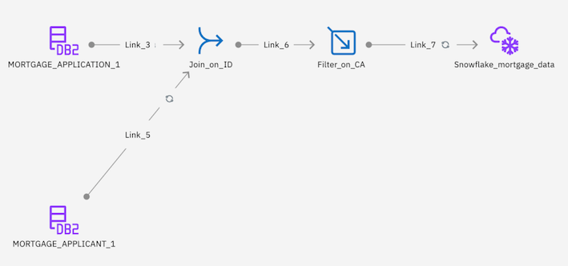  

<!-- ------------------------ -->
## Run the DataStage job
Duration: 1

Now you are ready to compile and run the DataStage job to load the Mortgage Application data from Db2 Warehouse into Snowflake. Follow these steps to run the DataStage job:

1. On the toolbar, click **Compile**. This action validates your DataStage flow. 
2. When the flow compiles successfully, click **Run** on the toolbar to start the DataStage job. The run might take a few seconds to complete.
3. When the run completes, you will see a message stating **Run successful with warnings**. 

**Check your progress**: The following image shows the successful run completed. Now that the DataStage job ran successfully, you can view the new table in Snowflake.

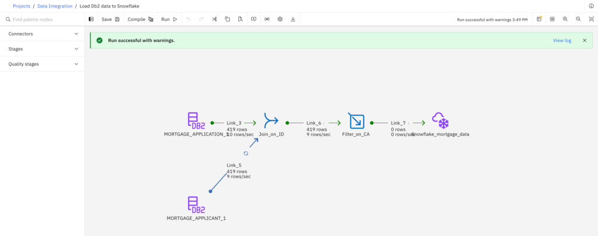  

<!-- ------------------------ -->
## View the data asset in the Snowflake data warehouse
Duration: 1

To check whether the data was loaded data into Snowflake correctly, you can go back to your Snowflake dashboard.

1. Navigate to **Data > Databases**.
2. Expand **DATASTAGEDB > MORTGAGE > TABLES**. 
3. Select the **APPLICATION** table.
4. Under the table name, click the **Data Preview** tab.
5. Select the **DATASTAGEDATA** warehouse.
6. Click **Preview** to see a preview of the *Mortgage Application* data imported from DataStage. 

**Check your progress**: The following image shows the loaded table in Snowflake.

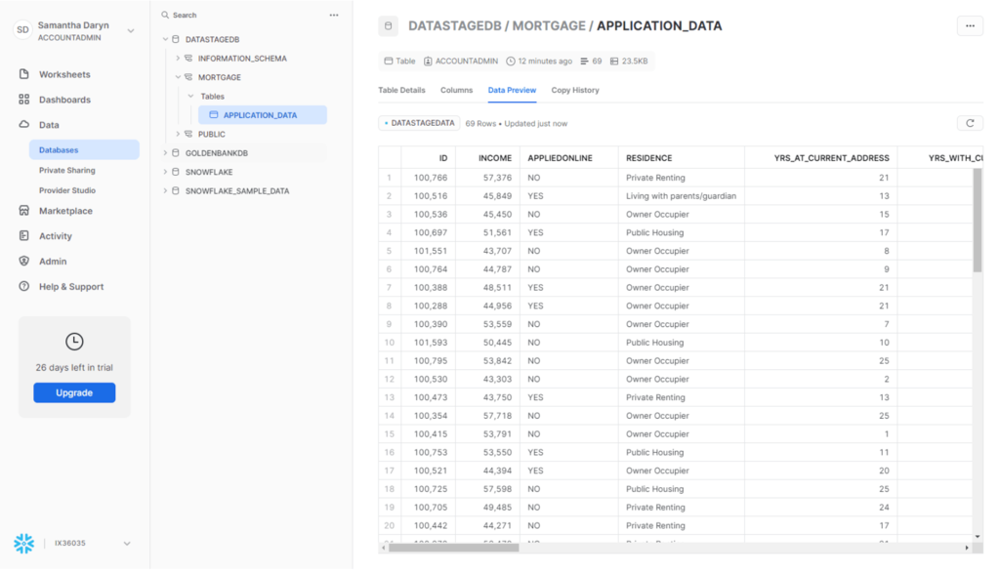  

<!-- ------------------------ -->
## Conclusion and Resources 
Congratulations on completing this lab! You've successfully used [DataStage](https://www.ibm.com/products/datastage?utm_content=SRCWW&p1=Search&p4=43700050328190090&p5=e&gclid=EAIaIQobChMIgqOUjdrj_QIVEgZ9Ch3rvwWwEAAYASAAEgLNzPD_BwE&gclsrc=aw.ds) to load enterprise data into Snowflake and perform [data transformations](https://video.ibm.com/playlist/650317) (of which there are hundreds of [pre-built objects](https://dataplatform.cloud.ibm.com/docs/content/dstage/com.ibm.swg.im.iis.ds.parjob.dev.doc/topics/processingdata.html?audience=wdp) in DataStage).  

We would love your feedback on this Quickstart! Please submit any and all feedback using this [Feedback Form](http://s.alchemer.com/s3/Quickstart-Feedback-A-Data-Integration-Guide-Load-Banking-Data-into-Snowflake-with-IBM-DataStage).  

### **What You Learned**
1. How to provision DataStage as a Service 
2. How to create a DataStage flow 
3. How to configure a Snowflake connection and load data into Snowflake  
4. How to perform join and filter data transformations 
5. How to run a DataStage job  

### **Next Steps and Related Resources** 
We encourage you to continue with your free trial by loading in your own sample or production data and by using some of the more advanced capabilities of Snowflake not covered in this lab. There are several ways Snowflake can help you with this:

1. Read the [Definitive Guide to Maximizing Your Free Trial](https://www.snowflake.com/test-driving-snowflake-the-definitive-guide-to-maximizing-your-free-trial/?utm_source=Snowflake&utm_medium=lab). 
2. Attend a Snowflake virtual or in-person [event](https://www.snowflake.com/about/webinars/) to learn more about our capabilities and how customers use us. 
3. Contact [Sales](https://www.snowflake.com/free-trial-contact-sales/?utm_source=Snowflake&utm_medium=lab) to learn more. 

 
