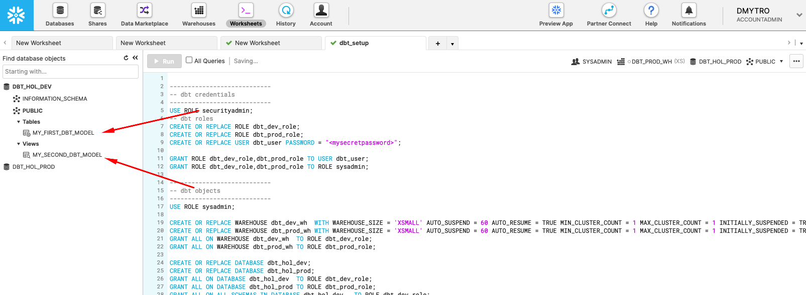
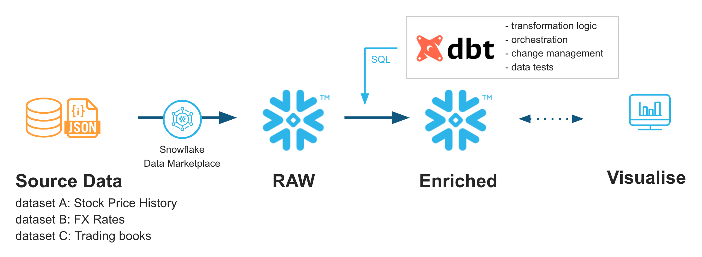
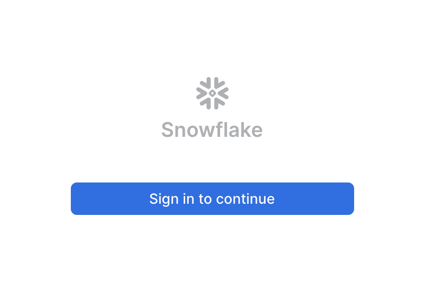
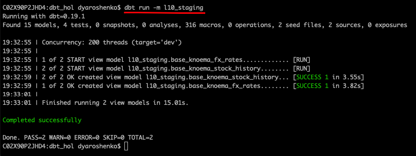
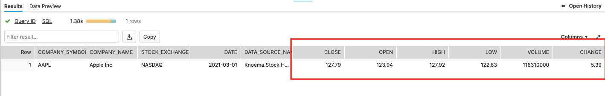
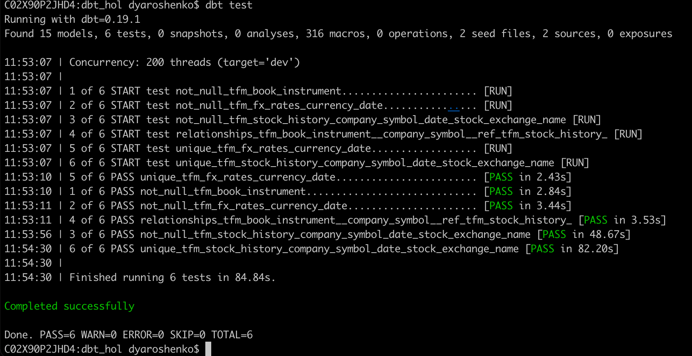

id: data_engineering_with_dbt
summary: Build your data pipeline with Snowflake & dbt
categories: data-engineering
environments: web
status: Published 
feedback link: https://github.com/Snowflake-Labs/sfguides/issues
tags: Getting Started, Data Engineering, dbt, Data Sharing
authors: Dmytro Yaroshenko

# Accellerating Data Engineering with Snowflake & dbt
<!-- ------------------------ -->
## Overview 
Duration: 5

Modern Businesses need modern data strategy built on platforms that could support agility, growth and operational efficiency. Snowflake is Data Cloud, a future proof solution that can simplify data pipelines for all your businesses so you can focus on your data and analytics instead of infrastructure management and maintenance.

[dbt](https://www.getdbt.com/) is a modern data engineering framework maintained by the [Fishtown Analytics](https://www.fishtownanalytics.com/) that is becoming very popular in modern data architectures, leveraging cloud data platforms like Snowflake. [dbt CLI](https://docs.getdbt.com/dbt-cli/cli-overview) is the open-source version of dbtCloud that is providing similar functionality, but as a SaaS.
In this virtual hands-on lab, you will follow a step-by-step guide to Snowflake and dbt to see some of the benefits this tandem brings. 

Let’s get started. 

### Prerequisites
To participate in the virtual hands-on lab, attendees need the following:

* A [Snowflake account](https://trial.snowflake.com/) with `ACCOUNTADMIN` access

* Familiarity with Snowflake and Snowflake objects


### What You'll Need During the Lab

* [dbt CLI](https://docs.getdbt.com/dbt-cli/installation) installed 

* Text editor of your choice


### What You'll Learn

* How to leverage data in Snowflake's Data Marketplace 

* How to build scalable pipelines using dbt & Snowflake


### What You'll Build
* A set of data analytics pipelines for Financial Services data leveraging dbt and Snowflake

* Implement data quality tests

* Promote code between the environments

<!-- ------------------------ -->
## Snowflake Configuration 
Duration: 5

1. Login to your Snowflake trial account.  
  

2. UI Tour (SE will walk through this live). For post-workshop participants, click [here](https://docs.snowflake.com/en/user-guide/snowflake-manager.html#quick-tour-of-the-web-interface) for a quick tour of the UI.  
  

3. Lets now create a database and a service accounts for dbt.

```sql
-------------------------------------------
-- dbt credentials
-------------------------------------------
USE ROLE securityadmin;
-- dbt roles
CREATE OR REPLACE ROLE dbt_dev_role;
CREATE OR REPLACE ROLE dbt_prod_role;
------------------------------------------- Please replace with your dbt user password
CREATE OR REPLACE USER dbt_user PASSWORD = "<mysecretpassword>";

GRANT ROLE dbt_dev_role,dbt_prod_role TO USER dbt_user;
GRANT ROLE dbt_dev_role,dbt_prod_role TO ROLE sysadmin;

-------------------------------------------
-- dbt objects
-------------------------------------------
USE ROLE sysadmin;

CREATE OR REPLACE WAREHOUSE dbt_dev_wh  WITH WAREHOUSE_SIZE = 'XSMALL' AUTO_SUSPEND = 60 AUTO_RESUME = TRUE MIN_CLUSTER_COUNT = 1 MAX_CLUSTER_COUNT = 1 INITIALLY_SUSPENDED = TRUE;
CREATE OR REPLACE WAREHOUSE dbt_dev_heavy_wh  WITH WAREHOUSE_SIZE = 'LARGE' AUTO_SUSPEND = 60 AUTO_RESUME = TRUE MIN_CLUSTER_COUNT = 1 MAX_CLUSTER_COUNT = 1 INITIALLY_SUSPENDED = TRUE;
CREATE OR REPLACE WAREHOUSE dbt_prod_wh WITH WAREHOUSE_SIZE = 'XSMALL' AUTO_SUSPEND = 60 AUTO_RESUME = TRUE MIN_CLUSTER_COUNT = 1 MAX_CLUSTER_COUNT = 1 INITIALLY_SUSPENDED = TRUE;
CREATE OR REPLACE WAREHOUSE dbt_prod_heavy_wh  WITH WAREHOUSE_SIZE = 'LARGE' AUTO_SUSPEND = 60 AUTO_RESUME = TRUE MIN_CLUSTER_COUNT = 1 MAX_CLUSTER_COUNT = 1 INITIALLY_SUSPENDED = TRUE;

GRANT ALL ON WAREHOUSE dbt_dev_wh  TO ROLE dbt_dev_role;
GRANT ALL ON WAREHOUSE dbt_dev_heavy_wh  TO ROLE dbt_dev_role;
GRANT ALL ON WAREHOUSE dbt_prod_wh TO ROLE dbt_prod_role;
GRANT ALL ON WAREHOUSE dbt_prod_heavy_wh  TO ROLE dbt_prod_role;

CREATE OR REPLACE DATABASE dbt_hol_dev; 
CREATE OR REPLACE DATABASE dbt_hol_prod; 
GRANT ALL ON DATABASE dbt_hol_dev  TO ROLE dbt_dev_role;
GRANT ALL ON DATABASE dbt_hol_prod TO ROLE dbt_prod_role;
GRANT ALL ON ALL SCHEMAS IN DATABASE dbt_hol_dev   TO ROLE dbt_dev_role;
GRANT ALL ON ALL SCHEMAS IN DATABASE dbt_hol_prod  TO ROLE dbt_prod_role;
```

As result of these steps, we should have:
-  two empty databases: PROD, DEV
-  two separate virtual warehouses: one for prod, one for dev workloads
-  a pair of separate roles and one user

Please note, this set up is simplified for the purpose of the lab. 
There are many ways environments, roles, credentials could be modelled to fit your final requirements. 

We would suggest having a look at these articles for inspiration: [How we configure Snowflake by Fishtown Team](https://blog.getdbt.com/how-we-configure-snowflake/), [Model Structure by GitLab team](https://about.gitlab.com/handbook/business-technology/data-team/platform/dbt-guide/#model-structure)

<!-- ------------------------ -->
## dbt Configuration 
Duration: 5

### Initialize dbt project

Create a new dbt project in any local folder by running the following commands:

```Shell
$ dbt init dbt_hol
$ cd dbt_hol
```

### Configure dbt/Snowflake profiles 

1.. Open  `~/.dbt/profiles.yml` in text editor and add the following section

```yml
dbt_hol:
  target: dev
  outputs:
    dev:
      type: snowflake
      ######## Please replace with your Snowflake account name
      account: <your_snowflake_trial_account>
      
      user: dbt_user
      ######## Please replace with your Snowflake dbt user password
      password: <mysecretpassword>
      
      role: dbt_dev_role
      database: dbt_hol_dev
      warehouse: dbt_dev_wh
      schema: public
      threads: 200
    prod:
      type: snowflake
      ######## Please replace with your Snowflake account name
      account: <your_snowflake_trial_account>
      
      user: dbt_user
      ######## Please replace with your Snowflake dbt user password
      password: <mysecretpassword>
      
      role: dbt_prod_role
      database: dbt_hol_prod
      warehouse: dbt_prod_wh
      schema: public
      threads: 200
```

 2..  Open `dbt_project.yml` (in dbt_hol folder) and update the following sections:

  

### Validate the configuration
Run the following command (in dbt_hol folder): 

```Shell
$ dbt debug
```
The expected output should look like this, confirming that dbt was able to access the database: 
  

### Test run
Finally, lets run the sample models that comes with dbt templates by default to validate everything is set up correctly. 
For this, please run the following command (in dbt_hol folder):
```Shell
$ dbt run
```
The expected output should look like this, confirming dbt was able to connect and successfully run sample models: 
  
Please note, this operation is completely rerunable and does not provide any harm to our next steps in the lab.

You can use Snowflake worksheets to validate that the sample view and the table are now availble in DEV database: 
  


Congratulations! You just run your first dbt models on Snowflake! 

<!-- ------------------------ -->
## Architecture and Use Case Overview
Duration: 2

In this lab, we are going to analyse historical trading performance of a company that has trading desks spread across different regions. As inputs, we are going to leverage datasets available in Knoema Economy Data Atlas that is available in Snowflake Data Marketplace, plus few manual uploads. 

We are going to set up the environments from scratch, build scalable pipelines in dbt, establish data tests, and Snowflake and promote code to production.  Finally we will use Snowsight to build a simple dashboard to visualize the results. 

  

Just to give you a sneak peek, this is where we are going to be in just 30 minutes.

Stay tuned!

  

<!-- ------------------------ -->
## Connect to Data Sources
Duration: 5

Let's go to the Snowflake Data Marketplace and find what we need. The Data Marketplace lives in the new UI called Snowsight (currently in Preview mode but feel free to test drive after the lab). Click on Preview App at the top of the UI

  

Click Sign in to continue. You will need to use the same user and pw that you used to login to your Snowflake account the first time.

  

You're now in the new UI - Snowsight. It's pretty cool - with charting and dashboards and context-sensitivity - but today we're just focused on getting to the Data Marketplace. Click on Data...

  

...and then Marketplace...

  

..and now you're in! Hundreds of providers have made datasets available for you to enrich your data. Today we're going to grab a Knoema Economy Atlas Data. Click the Ready to Query checkbox and then find the Knoema Economy Atlas Data tile. Once you find it, click on it.

  
Here you'll find a description of the data, example queries, and other useful information. Let's get this data into our Snowflake account. You'll be amazed at how fast and easy this is. Click the "Get Data" button

  

In the pop-up, leave the database name as proposed by default (important!), check the "I accept..." box and then add PUBLIC role to the additional roles 

  

What is happening here? Knoema has granted access to this data from their Snowflake account to yours. You're creating a new database in your account for this data to live - but the best part is that no data is going to move between accounts! When you query you'll really be querying the data that lives in the Knoema account. If they change the data you'll automatically see those changes. No need to define schemas, move data, or create a data pipeline either. Isn't that slick?

  

Now lets go back to worksheets and after refreshing the database browser and notice you have a new shared database, ready to query and join with your data. Click on it and you'll see views under the ECONOMY schema. We'll use one of these next.

 

As you would see, this Economy Atlas comes with more than 300 datasets. In order to improve navigation, provider kindly supplied a table called DATASETS. Lets find the ones related to the stock history and currency exchange rates that we are going to use in the next step.

```SQL
SELECT * 
  FROM "KNOEMA_ECONOMY_DATA_ATLAS"."ECONOMY"."DATASETS"
 WHERE "DatasetName" ILIKE 'US Stock%'
    OR "DatasetName" ILIKE 'Exchange%Rates%';
```

 

Finally, lets try to query one of the datasets: 
```
SELECT * 
  FROM KNOEMA_ECONOMY_DATA_ATLAS.ECONOMY.USINDSSP2020
 WHERE "Date" = current_date();
```
 

Congratulations! You successfully tapped into live data feed of Trade and FX rates data with NO ETL involved. As we promissed. Isn't it cool? 
Now lets start building our pipelines. 

<!-- ------------------------ -->
## Building dbt Data Pipelines
Duration: 15

In this section, we are going to start building our dbt pipelines:

- Stock trading history
- Currency exchange rates
- Trading books
- Profit & Loss calculation

### Configuration
We are going to start by adding few more things to our dbt project configuration in order to improve maintainability. 
1.. **Model folders/layers**. From our dbt project folder location, lets run few command line commands to create separate folders for models, representing different logical levels in the pipeline: 

```cmd
mkdir models/l10_staging
mkdir models/l20_transform
mkdir models/l30_mart
mkdir models/tests
```

Then lets open our dbt_profile.yml and modify the section below to reflect the model structure. As you can see, this is allowing you to set multiple parameters on the layer level (like materialization in this example). Also, you would notice that we added ***+enabled: false*** to the ***examples*** section as we won't need to run those sample models in the final state.

 

2.. **Custom schema naming macros.**
By default, dbt is [generating a schema name](https://docs.getdbt.com/docs/building-a-dbt-project/building-models/using-custom-schemas) by appending it to the target schema environment name(dev, prod). In this lab we are going to show you a quick way to override this macro, making our schema names to look exactly the same between dev and prod databases. For this, lets create a file **macros\call_me_anything_you_want.sql** with the following content:

```YAML

    
    
        {{ default_schema }}
    
        {{ custom_schema_name | trim }}
    




   {# always use model name #}
  
    
    {{ log("Setting query_tag to '" ~ new_query_tag ~ "'. Will reset to '" ~ original_query_tag ~ "' after materialization.") }}
    
    {{ return(original_query_tag)}}
  
  {{ return(none)}}

```

 

3.. **Query Tag**. As you might notice, in the screenshot above there is another macro overriden in the file: **set_query_tag()**. This one provides the ability to add additional level of transparency by automatically setting Snowflake query_tag to the name of the model it associated with. 

So if you go in Snowflake UI and click 'History' icon on top, you are going to see all SQL queries run on Snowflake account(successfull, failed, running etc) and clearly see what dbt model this particular query is related to: 

 

4.. **dbt plugings**. Last one, we promise! Alongside functionality coming out of the box with dbt core, dbt also provide capability to plug-in additional packages. Those could be published in the [dbt Hub](https://hub.getdbt.com) or straight out of github repository. In our lab, we are going to demonstrate how to use some automation that [dbt_utils](https://hub.getdbt.com/fishtown-analytics/dbt_utils/latest) package provides. 
Lets install it. For that, lets create a file called ***packages.yml*** in the root of your dbt project folder and add the following lines: 

```yml
packages:
  - package: fishtown-analytics/dbt_utils
    version: 0.6.4
```

 

Once this done, lets open a command line and run 

```cmd
dbt deps
```
 

Now that we are fully armed. Lets start building data pipelines! 

<!-- ------------------------ -->

## dbt pipelines - Stock trading history
Duration: 10

1.. We are going to start building our pipelines starts by declaring [dbt sources](https://docs.getdbt.com/docs/building-a-dbt-project/using-sources). 
For this lets create a **models\l10_staging\sources.yml** file and add the following configuration:

```yml
version: 2

sources:
  - name: knoema_economy_data_atlas
    database: knoema_economy_data_atlas
    schema: economy
    tables:
      - name: exratescc2018
      - name: usindssp2020
```
As you probably remember, these two objects were mentioned in Knoema Dataset Catalog table: daily exchange rates and daily US trading history accodringly. 

2.. **Base views** is the concept of models that act as a first-level transformation. Whilst not mandatory, these could act as a level of abstraction, separating ultimate source structure from the entry point of dbt pipeline. Providing your project more options to react to an upstream structure change. You can read more about arguments on benefits provided by the base view concept [here](https://discourse.getdbt.com/t/how-we-structure-our-dbt-projects/355).
We are going to create a fairly simple pass-through pair of base views: 
- **models/l10_staging/base_knoema_fx_rates.sql**

```sql
SELECT "Currency"        currency
     , "Currency Unit"   currency_unit
     , "Frequency"       frequency
     , "Date"            date
     , "Value"           value
     , 'Knoema.FX Rates' data_source_name
     , src.*
  FROM {{source('knoema_economy_data_atlas','exratescc2018')}}  src 
```

- **models/l10_staging/base_knoema_stock_history.sql**

```sql
SELECT "Company"                    Company
     , "Company Name"               Company_Name
     , "Company Symbol"             Company_Symbol
     , "Stock Exchange"             Stock_Exchange
     , "Stock Exchange Name"        Stock_Exchange_Name
     , "Indicator"                  Indicator
     , "Indicator Name"             Indicator_Name
     , "Units"                      Units
     , "Scale"                      Scale
     , "Frequency"                  Frequency
     , "Date"                       Date
     , "Value"                      Value
     , 'Knoema.Stock History' data_source_name
  FROM {{source('knoema_economy_data_atlas','usindssp2020')}}  src 
```
As you can see we used the opportunity to change case-sensitive & quoted name of the attributes to case insensitive to improve readability. Also as I am sure you noticed, this looks like SQL with the exception of macro **{{source()}}** that is used in "FROM" part of the query instead of fully qualified path (database.schema.table). This is one of the key concepts that is allowing dbt during compilation to replace this with target-specific name. As result, you as a developer, can promote **same** pipeline code to DEV, PROD and any other environments without any changes. 

Lets run it. Please notice how versatile **dbt run** parameters are. In this example we are going to run all models that are located in **models\l10_staging**. More details are in [documentation]((https://docs.getdbt.com/reference/node-selection/syntax)).

```cmd
dbt run --model l10_staging 
```
 

Now we can go and query this dataset to take a feel of what the data profile looks like.

```sql
SELECT * 
  FROM dbt_hol_dev.l10_staging.base_knoema_stock_history 
 WHERE Company_Symbol ='AAPL' 
   AND date ='2021-03-01'
```
 

In this dataset, different measures like Close, Open, High and Low price are represented as different rows. For our case this looks is a bit suboptimal - to simplify the use we would rather see that data transposed into columns, towards something like this: 

 

To achieve that, lets create few more models:

- **models/l20_transform/tfm_knoema_stock_history.sql**

In this model, we use Snowflake's [PIVOT](https://docs.snowflake.com/en/sql-reference/constructs/pivot.html) function to transpose the dataset from rows to columns

```SQL
WITH cst AS
(
SELECT company_symbol, company_name, stock_exchange_name, indicator_name, date, value , data_source_name
  FROM {{ref('base_knoema_stock_history')}} src
 WHERE indicator_name IN ('Close', 'Open','High','Low', 'Volume', 'Change %') 
)
SELECT * 
  FROM cst
  PIVOT(SUM(Value) for indicator_name IN ('Close', 'Open','High','Low', 'Volume', 'Change %')) 
  AS p(company_symbol, company_name, stock_exchange_name, date, data_source_name, close ,open ,high,low,volume,change)  
```

- **models/l20_transform/tfm_knoema_stock_history_alt.sql**

Whilst this model is more for illustration purposes on how similar could be achieved by leveraging **dbt_utils.pivot** 
```SQL
SELECT
  company_symbol, company_name, stock_exchange_name, date, data_source_name,
  {{ dbt_utils.pivot(
      column = 'indicator_name',
      values = dbt_utils.get_column_values(ref('base_knoema_stock_history'), 'indicator_name'),
      then_value = 'value'
  ) }}
FROM {{ ref('base_knoema_stock_history') }}
GROUP BY company_symbol, company_name, stock_exchange_name, date, data_source_name
```

- **models/l20_transform/tfm_stock_history.sql**

Finally we are going to create another model that abstracts source-specific transformations into a business view. In case there were multiple feeds providing datasets of the same class (stock history in this case), this view would be able to consolidate (UNION ALL) data from all of them. Thus becoming a one-stop-shop for all stock_history data. 

```SQL
SELECT src.*
  FROM {{ref('tfm_knoema_stock_history')}} src
```

3.. **Deploy**. The hard work is done. Lets go and deploy these. In this case we will automatically deploy tfm_stock_history and all of its ancestors. 

```cmd
dbt run --model +tfm_stock_history
```

 

Lets we go to Snowflake UI to check the results

```sql
SELECT * 
  FROM dbt_hol_dev.l20_transform.tfm_stock_history
 WHERE company_symbol = 'AAPL'
   AND date = '2021-03-01'
```
 


<!-- ------------------------ -->

## dbt pipelines - Currency exchange rates
Duration: 10
Our Stock history comes in USD. In this step, we are going to complement our landscape with additional models for currency exchange rates so we can see key measures in different currencies. 

Lets start by creating new models:

- **models/tfm_fx_rates.sql**

Here we are doing something new. dbt offers various [materialization options](https://docs.getdbt.com/docs/building-a-dbt-project/building-models/materializations) and in our **dbt_project.yml** we identified **view** as default option. In this model we are going to explicitly override the materialization, turning it into a **table**. When we deploy this model, dbt would automatically generate a new table (CTAS) replacing old content. As an example, we also add a tag that could help identifying subsets of models for processing. 

```SQL
{{ 
config(
	  materialized='table'
	  , tags=["Reference Data"]
	  ) 
}}
SELECT src.* 
  FROM {{ref('base_knoema_fx_rates')}} src
 WHERE "Indicator Name" = 'Close' 
   AND "Frequency"      = 'D' 
   AND "Date"           > '2016-01-01'
```

- **models/tfm_stock_history_major_currency.sql**

This model will start bringing FX and Trade history sets together. 

```SQL
SELECT tsh.*
     , fx_gbp.value * open          AS gbp_open      
     , fx_gbp.value * high			AS gbp_high		
     , fx_gbp.value * low           AS gbp_low      
     , fx_gbp.value * close         AS gbp_close    
     , fx_eur.value * open          AS eur_open      
     , fx_eur.value * high			AS eur_high		
     , fx_eur.value * low           AS eur_low      
     , fx_eur.value * close         AS eur_close    
  FROM {{ref('tfm_stock_history')}} tsh
     , {{ref('tfm_fx_rates')}}      fx_gbp
     , {{ref('tfm_fx_rates')}}      fx_eur
 WHERE fx_gbp.currency              = 'USD/GBP'     
   AND fx_eur.currency              = 'USD/EUR'     
   AND tsh.date                     = fx_gbp.date
   AND tsh.date                     = fx_eur.date
```

Now, lets deploy newly built models:

```cmd
dbt run --model +tfm_stock_history
```

 

As we now have more models in play, it is a good moment to talk about [dbt documentation](https://docs.getdbt.com/docs/building-a-dbt-project/documentation). By a run of new following commands dbt will analyse all models in our project and generate a static webpage with a data dictionary/documentation. This is a fantastic way of sharing information with your engeneeing & user community as it has all important information about columns, tags, free-form model description, tests as well as the source code that is always in line with the code. So regardless how big project grows, it is super easy to understand whats happening. And as cherry-on-pie there is also a possibility to see the full lineage of models in the visual DAG: 

```cmd
dbt docs generate
dbt docs serve
```
 

 

Lets we go to Snowflake UI to check the results

```sql
SELECT * 
  FROM dbt_hol_dev.l20_transform.tfm_stock_history_major_currency
 WHERE company_symbol = 'AAPL'
   AND date = '2021-03-01'
```
 

<!-- ------------------------ -->

## dbt pipelines - Trading books
Duration: 10

Following our use case story, we are going to manually upload two small datasets using 
[dbt seed](https://docs.getdbt.com/docs/building-a-dbt-project/seeds) representing trading books of two desks. As you would notice, they were buying and selling AAPL shares, but logging the cash paid/received in different currencies: USD and GBP. 

For this lets create two csv files with the following content:  

- **data/manual_book1.csv**

```csv
Book,Date,Trader,Instrument,Action,Cost,Currency,Volume,Cost_Per_Share,Stock_exchange_name
B2020SW1,2021-03-03,Jeff A.,AAPL,BUY,-17420,GBP,200,87.1,NASDAQ
B2020SW1,2021-03-03,Jeff A.,AAPL,BUY,-320050,GBP,3700,86.5,NASDAQ
B2020SW1,2021-01-26,Jeff A.,AAPL,SELL,52500,GBP,-500,105,NASDAQ
B2020SW1,2021-01-22,Jeff A.,AAPL,BUY,-100940,GBP,980,103,NASDAQ
B2020SW1,2021-01-22,Nick Z.,AAPL,SELL,5150,GBP,-50,103,NASDAQ
B2020SW1,2019-08-31,Nick Z.,AAPL,BUY,-9800,GBP,100,98,NASDAQ
B2020SW1,2019-08-31,Nick Z.,AAPL,BUY,-1000,GBP,50,103,NASDAQ
```

- **data/manual_book2.csv**

```csv
Book,Date,Trader,Instrument,Action,Cost,Currency,Volume,Cost_Per_Share,Stock_exchange_name
B-EM1,2021-03-03,Tina M.,AAPL,BUY,-17420,EUR,200,87.1,NASDAQ
B-EM1,2021-03-03,Tina M.,AAPL,BUY,-320050,EUR,3700,86.5,NASDAQ
B-EM1,2021-01-22,Tina M.,AAPL,BUY,-100940,EUR,980,103,NASDAQ
B-EM1,2021-01-22,Tina M.,AAPL,BUY,-100940,EUR,980,103,NASDAQ
B-EM1,2019-08-31,Tina M.,AAPL,BUY,-9800,EUR,100,98,NASDAQ
```

Once created, lets run the following command to load the data into Snowflake. It is important to mention that whilst this approach is absolutely feasible to bring low hundred-thousands of rows it is suboptimal to integrate larger data and you should be using COPY/Snowpipe or other data integration options recommended for Snowflake. 

```cmd
dbt seeds
```

 

To simplify usage, lets create a model that would combine data from all desks. In this example we are going to see how **dbt_utils.union_relations** macro helps to automate code automation: 

- **models/l20_transform/tfm_book.sql**

```SQL
{{ dbt_utils.union_relations(
    relations=[ref('manual_book1'), ref('manual_book2')]
) }}
```

Once we deploy this model, lets have a look what it is compiled into. For this, please open **target/run/l20_transform/tfm_book.sql**. As you can see dbt automatically scanned stuctures of the involved objects, aligned all possible attributes by name and type and combined all datasets via UNION ALL. Comparing this to the size of code we entered in the model itself, you can imagine the amount of time saved by such automation.

```cmd
dbt run -m tfm_book
```

 

Okay. Next challenge. We have a great log of trading activities, but it only provides records when shares were bought or sold. Ideally, to make the daily performance analysis we need to have rows for the days shares were HOLD. For this lets introduce another models:

- **models/l20_transform/tfm_daily_position.sql**

```SQL
WITH cst_market_days AS
(
    SELECT DISTINCT date
    FROM {{ref('tfm_stock_history_major_currency')}} hist
    WHERE hist.date >= ( SELECT min(date) AS min_dt FROM {{ref('tfm_book')}}  )
)
SELECT
    cst_market_days.date,
    trader,
    stock_exchange_name,
    instrument,
    book,
    currency,
    sum(volume) AS total_shares
FROM cst_market_days
   , {{ref('tfm_book')}} book
WHERE book.date <= cst_market_days.date
GROUP BY 1, 2, 3, 4, 5, 6 
```

- **models/l20_transform/tfm_daily_position.sql**

```SQL
SELECT book
     , date
     , trader
     , instrument
     , action
     , cost
     , currency
     , volume
     , cost_per_share
     , stock_exchange_name
     , SUM(t.volume) OVER(partition BY t.instrument, t.stock_exchange_name, trader ORDER BY t.date rows UNBOUNDED PRECEDING ) total_shares
  FROM {{ref('tfm_book')}}  t
UNION ALL   
SELECT book
     , date
     , trader
     , instrument
     , 'HOLD' as action
     , 0 AS cost
     , currency
     , 0      as volume
     , 0      as cost_per_share
     , stock_exchange_name
     , total_shares
FROM {{ref('tfm_daily_position')}} 
WHERE (date,trader,instrument,book,stock_exchange_name) 
      NOT IN 
      (SELECT date,trader,instrument,book,stock_exchange_name
         FROM {{ref('tfm_book')}}
      )
```
```cmd
dbt run -m tfm_book+
```

Now lets go back to Snowflake worksheets and run a query to see the results:
```sql
SELECT * 
  FROM dbt_hol_dev.l20_transform.tfm_daily_position_with_trades
 WHERE trader = 'Jeff A.'
 ORDER BY date
```

 

<!-- ------------------------ -->

## dbt pipelines - PnL calculation
Duration: 10

This section should bring the last models to complete the story. 
Now we have trading history of our desks and stock price history. Lets create a model to show how Market Value and PnL were changing over time. For this we are going to start by creating a model:

- **models/l20_transform/tfm_trading_pnl.sql**

```sql
SELECT t.instrument, t.stock_exchange_name, 
       t.date, trader, t.volume,cost, cost_per_share,currency,
       SUM(cost) OVER(partition BY t.instrument, t.stock_exchange_name, trader ORDER BY t.date rows UNBOUNDED PRECEDING ) cash_cumulative,
       CASE WHEN t.currency = 'GBP' THEN gbp_close
            WHEN t.currency = 'EUR' THEN eur_close
            ELSE close
       END                                                        AS close_price_matching_ccy,     
       total_shares  * close_price_matching_ccy                   AS market_value, 
       total_shares  * close_price_matching_ccy + cash_cumulative AS PnL
   FROM       {{ref('tfm_daily_position_with_trades')}}    t
   INNER JOIN {{ref('tfm_stock_history_major_currency')}}  s 
      ON t.instrument = s.company_symbol 
     AND s.date = t.date 
     AND t.stock_exchange_name = s.stock_exchange_nam
```

- **models/l30_mart/fct_trading_pnl.sql**

This model will be the one we created in the mart area, prepared to be used by many. With that in mind, it will be good idea to materialise this model as a table with incremental load mode. You can see that this materialization mode has a special macro that comes into action for the incremental runs (and ignored during initial run and full_refresh option). 

```sql
{{ 
config(
	  materialized='incremental'
	  , tags=["Fact Data"]
	  ) 
}}
SELECT src.*
  FROM {{ref('tfm_trading_pnl')}} src


  -- this filter will only be applied on an incremental run
 WHERE (trader, instrument, date, stock_exchange_name) NOT IN (select trader, instrument, date, stock_exchange_name from {{ this }})


```

Finally, for illustration purposes we are going to create a couple of views that could be extended further, represending different lense of interpreting PnL data between treasury, risk and finance departments.

- **models/l30_mart/fct_trading_pnl_finance_view.sql**
```sql
SELECT * 
-- this is a placeholder for illustration purposes
  FROM {{ref('fct_trading_pnl')}} src
```

- **models/l30_mart/fct_trading_pnl_risk_view.sql**
```sql
SELECT * 
-- this is a placeholder for illustration purposes
  FROM {{ref('fct_trading_pnl')}} src
```

- **models/l30_mart/fct_trading_pnl_treasury_view.sql**
```sql
SELECT * 
-- this is a placeholder for illustration purposes
  FROM {{ref('fct_trading_pnl')}} src
```
Lets deploy all of these models and run a query to check the final results:

```cmd
dbt run -m l30_mart
dbt docs serve
```

 

The final lineage tree: 
 

```sql
SELECT * 
  FROM dbt_hol_dev.l30_mart.fct_trading_pnl
 WHERE trader = 'Jeff A.'
 ORDER by date
```
 

Now, lets create a simple data visualisation for this dataset. For that, lets click on the Preview App button once again: 

 

Then **Worksheets -> + Worksheet**

 

Then lets copy-paste the same query we run in classic Snowflake UI worksheets. Hit the run button and switch from a table view to chart: 

 

By default it shows a breakdown by Volume. Lets click on the measure and switch it into **PNL**. Then lets add another measure to our chart for displaying Market value and PnL side by side. 

 

 

And this is it! Now you have a worksheet that you can slice'n'dice, share with your colleagues or embed in the SnowSight dashboard as one of the tiles. As you can see, Snowsight offers a great capability to quickly visualise the insight and always there for you as a part of the Snowflake platform. For more details on SnowSight, please refer to the [Snowflake documentation](https://docs.snowflake.com/en/user-guide/ui-web.html). 

 

<!-- ------------------------ -->
## Testing, Deployment, Materializations
Duration: 5

### Establishing Testing
Building trust in your data solution, it is hard to underestimate the importance of testing. Whilst there are many ways to organise automated testing, but thankfully dbt tool comes with the great [data tests framework](https://docs.getdbt.com/docs/building-a-dbt-project/tests). Let's build an example.

First, lets add the test configuration file and add the content below. dbt comes with a set of pre-defined data tests, such as uniqeness, not_null, check constraints, ref integrity etc. We are going to set up tests on the few models, however it is highly recommended to establish reasonable test coverage across the board. 
- **models/tests/data_quality_tests.yml**

```yml
  - name: tfm_fx_rates
    columns:
      - name: currency||date
        tests:
          - unique
          - not_null

  - name: tfm_book
    columns:
      - name: instrument
        tests:
          - not_null
          - relationships:
              to: ref('tfm_stock_history')
              field: company_symbol

  - name: tfm_stock_history
    columns:
      - name: company_symbol||date
        tests:
          - not_null
          - unique
```
Next, lets run these tests:

```cmd
dbt test
```

Boom! One of the tests failed! Lets try to understand why. dbt command line is kindly provided a link to the file with the SQL check that failed. Lets open it and copy-paste the content to Snowflake worksheet:  
 

 

Lets quickly check the full row width for one of the records failed by extending this check towards something like this:

```sql
WITH cst AS
(
    select
        company_symbol||date conctat

    from dbt_hol_dev.l20_transform.tfm_stock_history
    where company_symbol||date is not null
    group by company_symbol||date
    having count(*) > 1 
    limit 1
)
SELECT * FROM dbt_hol_dev.l20_transform.tfm_stock_history
 WHERE company_symbol||date IN (SELECT conctat FROM cst) 
```

 

Aha! There are shares which are traded on more than one stock exchanges. So we need to include **stock_exchange_name** attribute to your unique test key. Lets go back to **models/tests/data_quality_tests.yml** and update the test configuration for **tfm_stock_history** model :


```yml
  - name: tfm_stock_history
    columns:
      - name: company_symbol||date||stock_exchange_name
        tests:
          - not_null
          - unique
```
And run the test again

```cmd
dbt test
```
 

Finishing testing note, it is also worth mentioning that alongside such tests, dbt framework also supports custom tests that are massively expanding scenarios(like regression testing) could be covered by data tests. And just to expand it even further, in dbt hub there is a package [dbt_expectations](https://hub.getdbt.com/calogica/dbt_expectations/latest/) that implements a lot of additional tests, inspired by popular[http://greatexpectations.io/](http://greatexpectations.io/) framework. 

### Deployment

Okay, seems like we have everything in place: pipelines been developed and tested. The next step would be to promote this code up the chain through our SDLC environments(which in this lab is simplified to just DEV & PROD). 

In real life, the project code we are working should be in source version control system like git and by now pushed into one of the feature branches and merged into dev/trunk branch. From there, typically users raise pull requests to master/release version and then perform a deployment in production environment. Thanks to the fact dbt pipelines are very readable it is possible to implement good code review practices as well as set up automatic testing with various stages as a part of CICD automation. 

Working with git and branches is not in scope of this lab so we will just run the following command to deploy the very same codebase to PROD environment. 

```cmd
dbt seed --target=prod
dbt run  --target=prod
```


We can't check the UI that now we have data in **dbt_hol_prod** database:
 

### Materialization & Scaling

As dbt tool provides the ability to easily change [materialization option](https://docs.getdbt.com/docs/building-a-dbt-project/building-models/materializations), taking away all the burden related to generating new version of DDL & DML. What it means for modern data engineering? That you no longer need to spend precious time performing upfront performance optimisation and rather focus on building models, bringing more insights to your business. And when it comes to understand the usage patterns, models that are heavy and/or accessed frequently could be selectively materilized. 

During the lab you've probably seen how easily Snowflake could deal with many models materialised as views, provided the input data volume of stock history is >200Mn records alone. We also explicitly configured one model to be materialised as 'table'(CTAS) and another one as 'incremental'(MERGE). Once you move into persisted methods of materialization you will be using Snowflake virtual warehouses as compute power to perorm the materialization. 

Let's have a look on a couple of ways to manage compute size Snowflake will dedicate to a specific model(s).

1.. Lets open **dbt_projects.yml** and add the additional line 

```yml
models:
  dbt_hol:
      # Applies to all files under models/example/
      example:
          materialized: view
          +enabled: false
      l10_staging:
          schema: l10_staging
          materialized: view
      l20_transform:
          schema: l20_transform
          materialized: view
          +snowflake_warehouse: dbt_dev_heavy_wh
      l30_mart:
          schema: l30_mart
          materialized: view
```
 

2.. Lets modify the content of **models/l30_mart/fct_trading_pnl.sql** changing config section to include pre and post run hooks: 

```sql
{{ 
config(
	  materialized='incremental'
	  , tags=["Fact Data"]
	  , pre_hook ="ALTER WAREHOUSE dbt_dev_wh SET WAREHOUSE_SIZE ='XXLARGE'" 
      , post_hook="ALTER WAREHOUSE dbt_dev_wh SET WAREHOUSE_SIZE ='XSMALL'"
	  ) 
}}
SELECT src.*
  FROM {{ref('tfm_trading_pnl')}} src


  -- this filter will only be applied on an incremental run
 WHERE (trader, instrument, date, stock_exchange_name) NOT IN (select trader, instrument, date, stock_exchange_name from {{ this }})


```
 

Now lets run the project again:

```cmd
dbt run
```
Once finished, lets go into Snowflake UI and look at the Query History page. As you can see, dbt automatically switched into a separate warehouse **dbt_dev_heavy_wh** (of a larger size) once it started working on the models in **l20_transform** folder. And once it reached **l30_mart/fct_trading_pnl** model, the pipeline increased the size of the **dbt_dev_wh** to 2XL..processed the model faster..and then decreased the size of compute back to XS to keep it economical. 

 

These are just a couple of examples how you could leverage elasticity and workload isolation of Snowflake compute by switching between or resizing virtual warehouses as a simple DDL command, embedded in your pipelines. 

With that, lets move to our final section for this lab! 

<!-- ------------------------ -->
## Conclusion & Next Steps
Duration: 2

Congratulations on completing this lab using dbt and Snowflake for building data pipelines to drive analytics! You’ve mastered the dbt and Snowflake basics and are ready to apply these fundamentals to your own data. Be sure to reference this guide if you ever need a refresher.

We encourage you to continue with your free trial by loading your own sample or production data and by using some of the more advanced capabilities of dbt and Snowflake not covered in this lab. 
### Additional Resources:

- Read the [Definitive Guide to Maximizing Your Free Trial](https://www.snowflake.com/test-driving-snowflake-the-definitive-guide-to-maximizing-your-free-trial/) document
- Attend a [Snowflake virtual or in-person event](https://www.snowflake.com/about/events/) to learn more about our capabilities and customers
- [Join the Snowflake community](https://community.snowflake.com/s/topic/0TO0Z000000wmFQWAY/getting-started-with-snowflake)
- [Sign up for Snowflake University](https://community.snowflake.com/s/article/Getting-Access-to-Snowflake-University)
- [Contact our Sales Team](https://www.snowflake.com/free-trial-contact-sales/) to learn more
- [Join dbt community slack](https://community.getdbt.com/) where thousands of dbt on Snowflake users discussing their best practices

### What we've covered:

- How to set up dbt & Snowflake

- How to leverage data in Snowflake's Data Marketplace 

- How to run a dbt project and develop pipelines

- How to create data tests

- How to leverage Snowflake elasticity and scalability to support dbt calculations at scale

