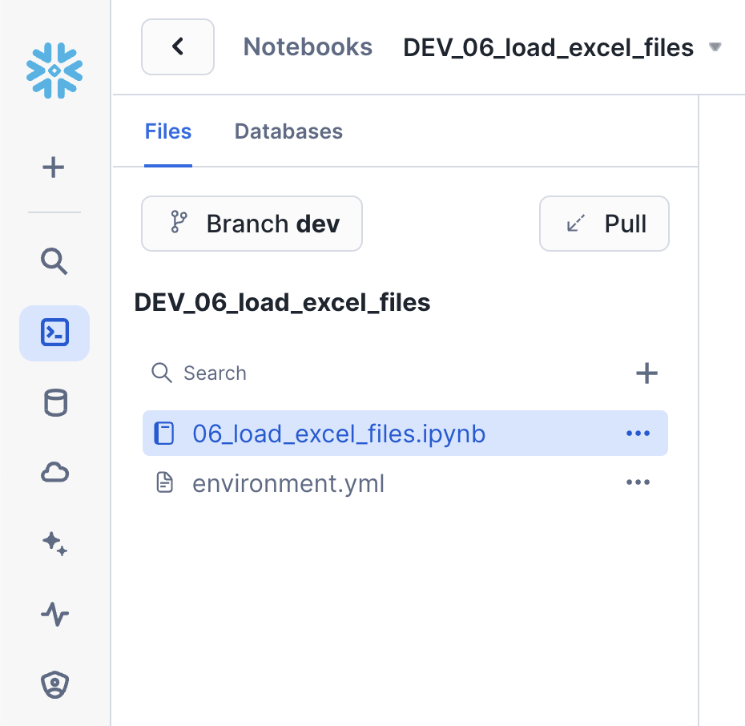
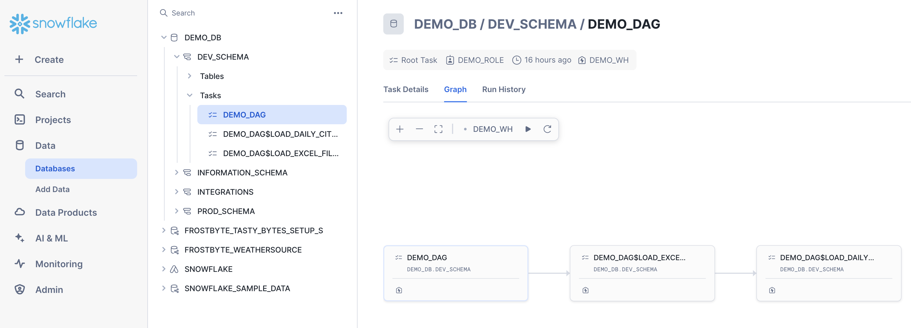
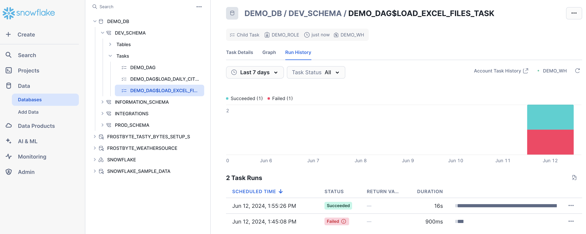

authors: Jeremiah Hansen
id: data_engineering_with_notebooks
summary: This guide will provide step-by-step details for building data engineering pipelines with Snowflake Notebooks
categories: featured,data-engineering,notebooks
environments: web
status: Published 
feedback link: https://github.com/Snowflake-Labs/sfguides/issues
tags: Data Engineering, Snowpark, Python, Notebooks

# Data Engineering with Snowflake Notebooks
<!-- ------------------------ -->
## Overview 
Duration: 15

Notebooks are a very popular tool that are used to do everything from ad-hoc exploration of data to productionalized data engineering pipelines. While Notebooks can contain a mix of both Python and SQL, most of the time they're used for Python coding. In my previous Quickstart I detailed [how to build Python data engineering piplines in Snowflake](https://quickstarts.snowflake.com/guide/data_engineering_pipelines_with_snowpark_python/index.html?index=..%2F..index#0) using Visual Studio Code, from a lower-level developer perpective.

This Quickstart will focus on how to build Python data engineering pipelines using Snowflake native Notebooks! Additionally it will provide all the details needed to manage and deploy those Notebooks through an automated CI/CD pipeline from development to production! Here's a quick visual overview of what we'll accomplish in this Quickstart:


> aside negative
> 
> **Note** - As of 6/11/2024, the [Snowflake Notebooks](https://docs.snowflake.com/en/user-guide/ui-snowsight/notebooks) are in Public Preview.

### What You’ll Learn
* How to ingest custom file formats (like Excel) with Snowpark from an external stage (such as an S3 bucket) into a Snowflake table
* How to access data from Snowflake Marketplace and use it for your analysis
* How to use Snowflake Notebooks and the Snowpark DataFrame API to build data engineering pipeilnes
* How to add logging to your Python data engineering code and monitor from within Snowsight
* How to execute SQL scripts from your Git repository directly in Snowflake
* How to use open-source Python libraries from curated Snowflake Anaconda channel
* How to use the Snowflake Python Management API to programitcally work with Snowflake objects
* How to use the Python Task DAG API to programatically manage Snowflake Tasks
* How to build CI/CD pipelines using Snowflake's Git Integration, the Snowflake CLI, and Github Actions
* How to deploy Snowflake Notebooks from dev to production

### Prerequisites
* Familiarity with Python
* Familiarity with the DataFrame API
* Familiarity with Snowflake
* Familiarity with Git repositories and GitHub

### What You’ll Need
You will need the following things before beginning:

* Snowflake account
    * **A Snowflake Account**
    * **A Snowflake user created with ACCOUNTADMIN permissions**. This user will be used to get things setup in Snowflake.
    * **Anaconda Terms & Conditions accepted**. See Getting Started section in [Third-Party Packages](https://docs.snowflake.com/en/developer-guide/udf/python/udf-python-packages.html#getting-started).
* GitHub account
    * **A GitHub account**. If you don't already have a GitHub account you can create one for free. Visit the [Join GitHub](https://github.com/signup) page to get started.


<!-- ------------------------ -->
## Quickstart Setup
Duration: 10

### Create a GitHub Personal Access Token
In order for Snowflake to authenticate to your GitHub repository, you will need to generate a personal access token. Please follow the [Creating a personal access token](https://docs.github.com/en/authentication/keeping-your-account-and-data-secure/managing-your-personal-access-tokens#creating-a-personal-access-token-classic) instructions to create your token.

Make sure to write down the token until step 3 of the Quickstart, where we will be securely storing it within a Snowflake `SECRET` object.

### Fork the Quickstart Repository
You'll need to create a fork of the repository for this Quickstart in your GitHub account. Visit the [Data Engineering with Snowflake Notebooks associated GitHub Repository](https://github.com/Snowflake-Labs/sfguide-data-engineering-with-notebooks) and click on the "Fork" button near the top right. Complete any required fields and click "Create Fork".

### Configure GitHub Actions
By default GitHub Actions disables any workflows (or CI/CD pipelines) defined in the forked repository. This repository contains a workflow to deploy your Snowpark Notebooks, which we'll use later on. So for now enable this workflow by opening your forked repository in GitHub, clicking on the `Actions` tab near the top middle of the page, and then clicking on the `I understand my workflows, go ahead and enable them` green button.


The last step to enable your GitHub Actions workflow is to create the required secrets. In order for your GitHub Actions workflow to be able to connect to your Snowflake account you will need to store your Snowflake credentials in GitHub. Action Secrets in GitHub are used to securely store values/variables which will be used in your CI/CD pipelines. In this step we will create secrets for each of the parameters used by the Snowflake CLI.

From the repository, click on the `Settings` tab near the top of the page. From the Settings page, click on the `Secrets and variables` then `Actions` tab in the left hand navigation. The `Actions` secrets should be selected. For each secret listed below click on `New repository secret` near the top right and enter the name given below along with the appropriate value (adjusting as appropriate).

<table>
    <thead>
        <tr>
            <th>Secret name</th>
            <th>Secret value</th>
        </tr>
    </thead>
    <tbody>
        <tr>
            <td>SNOWFLAKE_ACCOUNT</td>
            <td>myaccount</td>
        </tr>
        <tr>
            <td>SNOWFLAKE_USER</td>
            <td>myusername</td>
        </tr>
        <tr>
            <td>SNOWFLAKE_PASSWORD</td>
            <td>mypassword</td>
        </tr>
        <tr>
            <td>SNOWFLAKE_ROLE</td>
            <td>DEMO_ROLE</td>
        </tr>
        <tr>
            <td>SNOWFLAKE_WAREHOUSE</td>
            <td>DEMO_WH</td>
        </tr>
        <tr>
            <td>SNOWFLAKE_DATABASE</td>
            <td>DEMO_DB</td>
        </tr>
        <tr>
            <td>SNOWFLAKE_SCHEMA</td>
            <td>INTEGRATIONS</td>
        </tr>
    </tbody>
</table>

> aside positive
> 
>  **Tip** - For more details on how to structure the account name in SNOWFLAKE_ACCOUNT, see the account name discussion in [the Snowflake Python Connector install guide](https://docs.snowflake.com/en/user-guide/python-connector-install.html#step-2-verify-your-installation).

When you’re finished adding all the secrets, the page should look like this:


> aside positive
> 
>  **Tip** - For an even better solution to managing your secrets, you can leverage [GitHub Actions Environments](https://docs.github.com/en/actions/reference/environments). Environments allow you to group secrets together and define protection rules for each of your environments.


<!-- ------------------------ -->
## Setup Snowflake
Duration: 10

Since the focus of this Quickstart is on Notebooks, we're going to use a Notebook to set up our Snowflake demo environment. 

### Download the 00 Notebook
The Notebook we're going to use to set up our Snowflake demo environment can be found in your forked repository. From the GitHub web UI open the `00_start_here.ipynb` file and then download the raw file (using one of the links near the top right of the page).

### Import the 00 Notebook to Snowflake
Follow these steps to import the Notebook into your Snowflake account:

* Log into Snowsight
* Browse to "Notebooks" in the left navigation (under "Projects")
* Click on arrow next to the blue "+ Notebook" on top right, then select "Import .ipynb file"
* Select the `00_start_here.ipynb` file you downloaded previously
* Choose a database and schema for the notebook to live in and then a default warehouse for the notebook
* Click "Create"

### Run the 00 Setup Notebook Cells
Before you can run the set up steps in the `00_start_here.ipynb` Notebook you need to first add the `snowflake` package to it. To do that, follow these steps: 

* Open the Notebook
* Click on the "Packages" drop down on the top menu bar, near the right
* Type "snowflake" in the "Find Packages" search box and select it from the drop down

Once you have all the required packages configured, click the "Start" button on the top menu bar, near the right. Once the Notebook session has started you're ready to run cells in the Notebook. And notice how quickly the session starts up, especially compared to starting a Spark cluster!

Scroll down to the "Step 03 Setup Snowflake" section. You'll want to run all the cells in this section. But before doing so make sure and update the 4 `GITHUB_` SQL variables in the first `sql_step03_set_context` cell. Use the value of your GitHub personal access token in the `GITHUB_SECRET_PASSWORD` variable. Then run all the cells in this section. To run a given cell simply click anywhere in the cell to select it and press CMD/CTRL+Enter. You can alternatively click on the Run arrow near the top right of the cell.


<!-- ------------------------ -->
## Deploy to Dev
Duration: 10

During this step we will be deploying the dev versions of our two data engineering Notebooks: `DEV_06_load_excel_files` and `DEV_07_load_daily_city_metrics`. For this Quickstart you will notice that our main data engineering Notebooks will be named with a prefix for the environment label, like `DEV_` for dev and `PROD_` for prod. A full discussion of different approaches for managing multiple environments with Snowflake is out of scope for this Quickstart. For a real world use case, you may or may not need to do the same, depending on your Snowflake set up.

To put this in context, we are on step **#4** in our data flow overview:


### Git in Snowsight
When you ran the setup cells in the `00_start_here.ipynb` Notebook in the previous step, you created a Git Integration in Snowflake for your forked GitHub repository! Please see [Using a Git repository in Snowflake](https://docs.snowflake.com/en/developer-guide/git/git-overview) for more details.

You can browse your Git repository in Snowsight, by using our Snowsight Git integration features. First To do that, click on "Data" -> "Databases" in the left navigation. Then click on "DEMO_DB" database, then "INTEGRATIONS" schema, then "Git Repositories" and finally "DEMO_GIT_REPO". You will see the details and content of your Git repository in Snowsight. You can change branches and browse the files in the repo by clicking on the folder names to drill down.

### Deploy Notebooks
Scroll down to the "Step 04 Deploy to Dev" section of the `00_start_here.ipynb` Notebook and run the Python cell there. This cell will deploy both the `06_load_excel_files` and `07_load_daily_city_metrics` Notebooks to our `DEV_SCHEMA` schema (and will prefix both workbook names with `DEV_`).

### EXECUTE IMMEDIATE FROM with Jinja Templating
The [EXECUTE IMMEDIATE FROM](https://docs.snowflake.com/en/sql-reference/sql/execute-immediate-from) command is very powerful and allows you to run an entire SQL script directly from Snowflake. And you'll notice here that we executing a SQL script directly from the `main` branch of our Git repo (`@DEMO_GIT_REPO/branches/main`). At this point please review the contents of the `scripts/deploy_notebooks.sql` script in your forked repo to see what we just executed.

Also, please note that the `scripts/deploy_notebooks.sql` script also includes Jinja Templating. Jinja templating allows us to parameterize this script so we can run the same core logic in each environment! You will see later in step 9 that we will call this same script from our GitHub Actions pipeline in order to deploy these Notebooks to production.


<!-- ------------------------ -->
## Load Weather
Duration: 10

During this step we will be "loading" the raw weather data to Snowflake. But "loading" is the really the wrong word here. Because we're using Snowflake's unique data sharing capability we don't actually need to copy the data to our Snowflake account with a custom ETL process. Instead we can directly access the weather data shared by Weather Source in the Snowflake Marketplace. To put this in context, we are on step **#5** in our data flow overview:


### Load Weather Data from Snowflake Marketplace
Weather Source is a leading provider of global weather and climate data and their OnPoint Product Suite provides businesses with the necessary weather and climate data to quickly generate meaningful and actionable insights for a wide range of use cases across industries. Let's connect to the `Weather Source LLC: frostbyte` feed from Weather Source in the Snowflake Marketplace by following these steps:

* Login to Snowsight
* Click on the `Marketplace` link in the left navigation bar
* Enter "Weather Source LLC: frostbyte" in the search box and click return
* Click on the "Weather Source LLC: frostbyte" listing tile
* Click the blue "Get" button
    * Expand the "Options" dialog
    * Change the "Database name" to read "FROSTBYTE_WEATHERSOURCE" (all capital letters)
    * Select the "HOL_ROLE" role to have access to the new database
* Click on the blue "Get" button

That's it... we don't have to do anything from here to keep this data updated. The provider will do that for us and data sharing means we are always seeing whatever they have published. How amazing is that? Just think of all the things you didn't have do here to get access to an always up-to-date, third-party dataset!


<!-- ------------------------ -->
## Load Location and Order Detail
Duration: 10

During this step we will be loading data from two Excel files in S3 into the `LOCATION` and `ORDER_DETAIL` tables. To do this we'll take advantage of the [Snowpark Python file access feature](https://docs.snowflake.com/en/developer-guide/stored-procedure/stored-procedures-python#reading-files). For more details on this please see my related blog post [Simplify data ingestion with Snowpark Python file access](https://medium.com/snowflake/simplify-data-ingestion-with-snowpark-python-file-access-f2bc0e4cd887).

> aside negative
> 
> **Note** - As of 6/11/2024, the [Snowpark Python file access feature](https://docs.snowflake.com/en/developer-guide/stored-procedure/stored-procedures-python#reading-files), which relies on the `SnowflakeFile` class, does not yet work inside Notebooks. So we are using a workaround of copying the file locally to the Notebook and then processing from there.

To put this in context, we are on step **#6** in our data flow overview:


### Run the Notebook

In step 3 we deployed development versions of our two data engineering notebooks, which are owned by the `DEMO_ROLE` role. So first switch roles in Snowsight to the `DEMO_ROLE` and then open the `DEV_06_load_excel_files` Notebook.

> aside positive
> 
>  **Tip** - Since we will be going back to the `00_start_here` Notebook later, it might be easier to open a new Snowsight tab and set the default role to `DEMO_ROLE` there, and leave your current tab with the `00_start_here` Notebook open as well.

Once you've opened the `DEV_06_load_excel_files` Notebook click on the "Run all" button near the top right of the window. This will execute all cells in the notebook, in order.

### Notebook Git Integration

You will notice that to the left of the main Notebook area there is a sidebar which shows the files that make up the Notebook. And since we created this Notebook from our Git repository you will also notice the Git related identifiers. From the sidebar you can see which branch the Notebook is working from along with the ability to pull changes from the repo. So here is even more Git integration built directly in Snowsight. Here's a screenshot:



### Notebook Cell References

You'll notice in the Notebook examples that we can pass values between cells. So for example, in the `sql_get_context` cell we have:

```sql
SELECT current_database() AS DATABASE_NAME, current_schema() AS SCHEMA_NAME
```

And then later in the `py_imports` cell you'll find the following code:

```python
current_context_df = cells.sql_get_context.to_pandas()
database_name = current_context_df.iloc[0,0]
schema_name = current_context_df.iloc[0,1]
```

So we're able to take the results of a SQL query and use them in Python! And this works the other direction as well, accessing Python values in SQL. For more details please see [Reference cells and variables in Snowflake Notebooks](https://docs.snowflake.com/en/user-guide/ui-snowsight/notebooks-develop-run#reference-cells-and-variables-in-sf-notebooks) in our documentation.

### Dynamic File Access

Like I mentioned at the beginning of this section, we're able to read on process Excel files with the [Snowpark Python file access feature](https://docs.snowflake.com/en/developer-guide/stored-procedure/stored-procedures-python#reading-files). And this same prinipal applies to more than just Excel files, you can use it to process any file format you'd like. For more details on this please see my related blog post [Simplify data ingestion with Snowpark Python file access](https://medium.com/snowflake/simplify-data-ingestion-with-snowpark-python-file-access-f2bc0e4cd887).

> aside negative
> 
> **Note** - As of 6/11/2024, the [Snowpark Python file access feature](https://docs.snowflake.com/en/developer-guide/stored-procedure/stored-procedures-python#reading-files), which relies on the `SnowflakeFile` class, does not yet work inside Notebooks. So we are using a workaround of copying the file locally to the Notebook and then processing from there.


<!-- ------------------------ -->
## Load Daily City Metrics
Duration: 10

During this step we will be joining data from our `LOCATION` and `ORDER_DETAIL` tables (from the previous step) with the weather data we set up in step 5 to produce an aggreated reporting table `DAILY_CITY_METRICS`. We'll leverage the Snowpark DataFrame API to perform the data transformations, and will also show how to incorporate logging into your code. To put this in context, we are on step **#7** in our data flow overview:


### Run the Notebook

In step 3 we deployed development versions of our two data engineering notebooks, which are owned by the `DEMO_ROLE` role. So first switch roles in Snowsight to the `DEMO_ROLE` and then open the `DEV_07_load_daily_city_metrics` Notebook. If you already switched roles in the previous step you can simply close the previous Notebook and open this one.

Once you've opened the `DEV_07_load_daily_city_metrics` Notebook click on the "Run all" button near the top right of the window. This will execute all cells in the notebook, in order.

### Snowpark DataFrame API

In this step we're starting to really use the Snowpark DataFrame API for data transformations. The Snowpark API provides the same functionality as the [Spark SQL API](https://spark.apache.org/docs/latest/api/python/reference/pyspark.sql/index.html). To begin with you need to create a Snowpark session object. Like in PySpark, this can be accomplished with the `Session.builder.configs().create()` methods. But within a Snowflake Notebook this is simplified and can be accomplished simply with `session = get_active_session()`.

One you have a Snowpark session you can begin working with data. In this Notebook we're using DataFrames to join the data from different tables into an `order_detail` DataFrame using the `join()` API.

```python
order_detail = order_detail.join(location, order_detail['LOCATION_ID'] == location['LOCATION_ID'])
order_detail = order_detail.join(history_day, (F.builtin("DATE")(order_detail['ORDER_TS']) == history_day['DATE_VALID_STD']) & (location['ISO_COUNTRY_CODE'] == history_day['COUNTRY']) & (location['CITY'] == history_day['CITY_NAME']))
```

After that we're then aggregating the DataFrame using APIs such as `agg()`, `group_by()`, and `select()`.

```python
final_agg = order_detail.group_by(F.col('DATE_VALID_STD'), F.col('CITY_NAME'), F.col('ISO_COUNTRY_CODE')) \
                        .agg( \
                            F.sum('PRICE').alias('DAILY_SALES_SUM'), \
                            F.avg('AVG_TEMPERATURE_AIR_2M_F').alias("AVG_TEMPERATURE_F"), \
                            F.avg("TOT_PRECIPITATION_IN").alias("AVG_PRECIPITATION_IN"), \
                        ) \
                        .select(F.col("DATE_VALID_STD").alias("DATE"), F.col("CITY_NAME"), F.col("ISO_COUNTRY_CODE").alias("COUNTRY_DESC"), \
                            F.builtin("ZEROIFNULL")(F.col("DAILY_SALES_SUM")).alias("DAILY_SALES"), \
                            F.round(F.col("AVG_TEMPERATURE_F"), 2).alias("AVG_TEMPERATURE_FAHRENHEIT"), \
                            F.round(F.col("AVG_PRECIPITATION_IN"), 2).alias("AVG_PRECIPITATION_INCHES"), \
                        )
```

And finally if the target table exists we're using the `merge()` DataFrame API to perform and Upsert operation on the target table. This is what enables us to perform incremental processing.

```python
    dcm.merge(final_agg, (dcm['DATE'] == final_agg['DATE']) & (dcm['CITY_NAME'] == final_agg['CITY_NAME']) & (dcm['COUNTRY_DESC'] == final_agg['COUNTRY_DESC']), \
                        [F.when_matched().update(cols_to_update), F.when_not_matched().insert(cols_to_update)])
```

Again, for more details about the Snowpark Python DataFrame API, please check out our [Working with Dataframe in Snowpark Python](https://docs.snowflake.com/en/developer-guide/snowpark/python/working-with-dataframes.html) page.

### Python Management API

The new Python Management API allows us to programaticaly interact with Snowflake with native Python. This API can be used to both inspect and manage Snowflake objects. In the previous Quickstart we checked for the existing of an object by using SQL like this:

```sql
def table_exists(session, database_name='', schema_name='', table_name=''):
    exists = session.sql("SELECT EXISTS (SELECT * FROM {}.INFORMATION_SCHEMA.TABLES WHERE TABLE_SCHEMA = '{}' AND TABLE_NAME = '{}') AS TABLE_EXISTS".format(database_name, schema_name, table_name)).collect()[0]['TABLE_EXISTS']
    return exists
```

But with the Python Management API this can now be done with native Python like this:

```python
def table_exists(session, database_name='', schema_name='', table_name=''):
    root = Root(session)
    tables = root.databases[database_name].schemas[schema_name].tables.iter(like=table_name)
    for table_obj in tables:
        if table_obj.name == table_name:
            return True

    return False
```

And this is really just the beginning of what you can do with this new library. Please check out the [Snowflake Python Management API](https://docs.snowflake.com/en/developer-guide/snowflake-python-api/snowflake-python-overview) documentation for more details.

### Logging in Python

A key aspect of building robust data engineering pipelines involves instrumenting our code. This enables the monitoring and operations of our code, as is especially importnat when auotmating the deployment and monitoring of our pipelines with DevOps. Snowflake has a rich set of [Logging and Tracing](https://docs.snowflake.com/en/developer-guide/logging-tracing/logging-tracing-overview) capabilities to help.

You'll notice that in the `py_imports` cell of this Notebook we're using Snowflake's logging capabilities. There are two steps to do so in your code. The first is to create a logger to use:

```python
logger = logging.getLogger("demo_logger")
```

And the second is to actually log debugging and informational messages at the appropriate places in your code:

```python
logger.info("07_load_daily_city_metrics start")
```

In addition to custom logging, Snowflake is instrumenting all services/features to take advantage of logging and tracing as well. For example, when you ran this Notebook earlier it logged a number of messages by default, like when each cell executed.

All of your log messages can be found in your default logging table, which we created in step 3. If you look back at the code from step 3 you'll find that we created an event table named `DEMO_DB.INTEGRATIONS.DEMO_EVENTS` and then set that as the default event table for the account. You can now use this table just like any other table in Snowflake to query and act on the log data.

### Log Viewer in Snowsight

In addition to directly querying the event table, you can also use our new log viewer directly inside Snowsight to make things even easier. To find the log viewer click on "Monitoring" followed by "Logs" in the left navigation bar. Once on that page you can visualize, filter and search through your logs.

<!-- ------------------------ -->
## Orchestrate Jobs
Duration: 10

During this step we will be orchestrating our new Snowpark Notebook pipelines with Snowflake's native orchestration feature named Tasks. You can create and deploy Snowflake Task objects using SQL as well as Python Task APIs. For this quickstart, we will use Snowflake Python Task APIs to create the Tasks. We will create two tasks, one for each Notebook, and chain them together. To put this in context, we are on step **#8** in our data flow overview:


### Deploy Task DAG

Toggle back to the `00_start_here` Notebook, scroll down to the "Step 08 Orchestrate Pipelines" section, and run each of the cells.

### Python Task DAG API

In this step we will create a DAG (or Directed Acyclic Graph) of Tasks using the new [Snowflake Python Management API](https://docs.snowflake.com/en/developer-guide/snowflake-python-api/snowflake-python-overview). The Task DAG API builds upon the Python Management API to provide advanced Task management capabilities. And if you've used Airflow before, this Python API should look familiar as it's similar to the Airflow v1 Python API. For more details see [Managing Snowflake tasks and task graphs with Python](https://docs.snowflake.com/en/developer-guide/snowflake-python-api/snowflake-python-managing-tasks).

Here is the key part of the code:

```python
# Define the DAG
with DAG(dag_name, schedule=timedelta(days=1), warehouse=warehouse_name) as dag:
    dag_task1 = DAGTask("LOAD_EXCEL_FILES_TASK", definition=f'''EXECUTE NOTEBOOK "{database_name}"."{schema_name}"."{env}_05_load_excel_files"()''', warehouse=warehouse_name)
    dag_task2 = DAGTask("LOAD_DAILY_CITY_METRICS", definition=f'''EXECUTE NOTEBOOK "{database_name}"."{schema_name}"."{env}_06_load_daily_city_metrics"()''', warehouse=warehouse_name)

    # Define the dependencies between the tasks
    dag_task1 >> dag_task2 # dag_task1 is a predecessor of dag_task2

# Create the DAG in Snowflake
dag_op.deploy(dag, mode="orreplace")
```

You can see that we're defining two tasks, one for each Notebook, and that each task simply calls `EXECUTE NOTEBOOK` for the corresponding Notebook. We then define the dependencies and deploy the DAG. As you can see this makes managing complex Task DAGs much easier!

This code is also available in the `scripts/deploy_task_dag.py` script which could be used to automate the Task DAG deployment.

### Task Viewer in Snowsight

Now, after your dag is deployed, all the tasks in your dag will be running as per the defined schedule. However, as a Snowflake user, how can you peek into the success and failure of each run, look at the task run time, and more?

Snowflake provides some rich task observability features in the Snowsight UI. Try it out for yourself by following these steps:

1. In the Snowsight navigation menu, click **Data** » **Databases**.
1. In the right pane, using the object explorer, navigate to the `DEMO_DB` database and `DEV_SCHEMA` schema.
1. For the selected schema, select and expand **Tasks**.
1. Select a task. Task information is displayed, including **Task Details**, **Graph**, and **Run History** sub-tabs.
1. Select the **Graph** tab. The task graph appears, displaying a hierarchy of child tasks.
1. Select a task to view its details.

Here's what the task graph looks like:



And here's an example of the task run history:



For more details, and to learn about viewing account level task history, please check out our [Viewing Task History](https://docs.snowflake.com/en/user-guide/ui-snowsight-tasks.html) documentation.

### Executing the DAG

The easiest way to manually kick off the Task DAG execution is to open up the root `DEMO_DAG` task, click on the "Graph" tab and then click on the "Run Task Graph" play button above the diagram. If not already set, you may have to pick a warehouse to use.

### Task Metadata

Snowflake keeps metadata for almost everything you do, and makes that metadata available for you to query (and to create any type of process around). Tasks are no different, Snowflake maintains rich metadata to help you monitor your task runs. Here are a few sample SQL queries you can use to monitor your tasks runs:

```sql
-- Get a list of tasks
SHOW TASKS;

-- Task execution history in the past day
SELECT *
FROM TABLE(INFORMATION_SCHEMA.TASK_HISTORY(
    SCHEDULED_TIME_RANGE_START=>DATEADD('DAY',-1,CURRENT_TIMESTAMP()),
    RESULT_LIMIT => 100))
ORDER BY SCHEDULED_TIME DESC
;

-- Scheduled task runs
SELECT
    TIMESTAMPDIFF(SECOND, CURRENT_TIMESTAMP, SCHEDULED_TIME) NEXT_RUN,
    SCHEDULED_TIME,
    NAME,
    STATE
FROM TABLE(INFORMATION_SCHEMA.TASK_HISTORY())
WHERE STATE = 'SCHEDULED'
ORDER BY COMPLETED_TIME DESC;
```

<!-- ------------------------ -->
## Deploy to Production
Duration: 10

### Update the 05 Notebook
### Push Changes to Forked Repository
### GitHub Action Pipeline
### Snow CLI
### Create PR and Merge to Main
### Viewing GitHub Actions Workflow
### Executing the Production DAG?


<!-- ------------------------ -->
## Teardown
Duration: 10


<!-- ------------------------ -->
## Conclusion
Duration: 10

### What You Learned
### Related Resources
