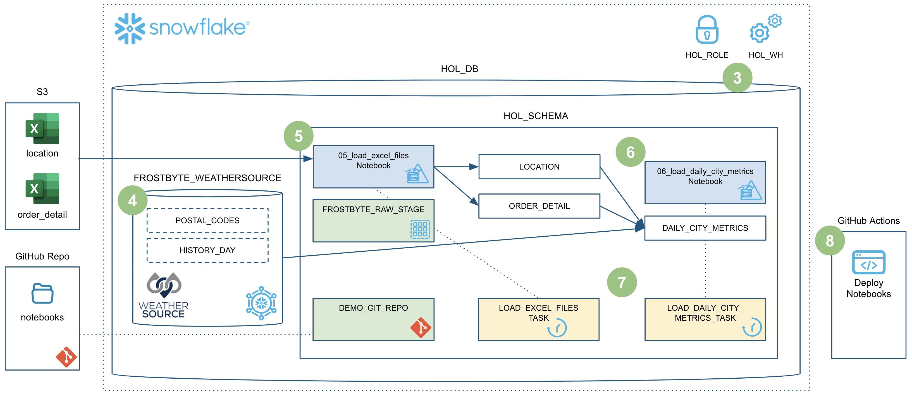
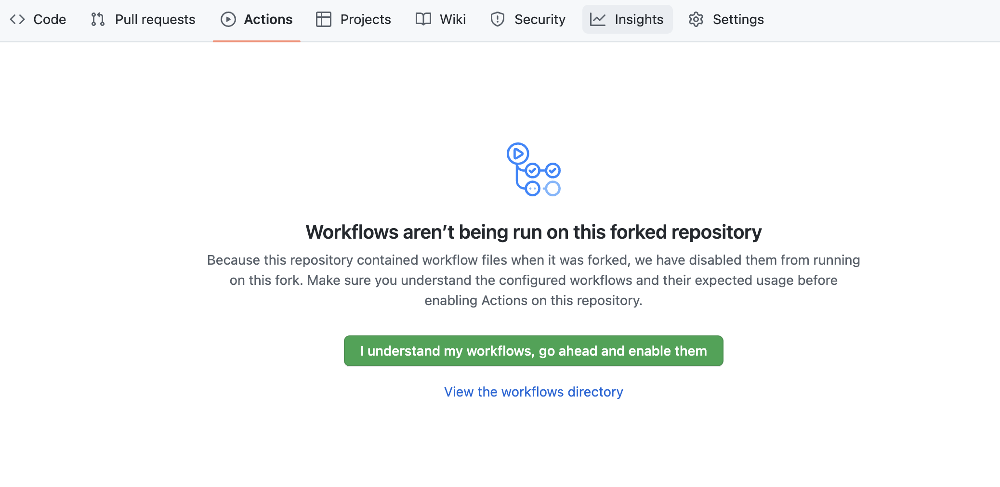
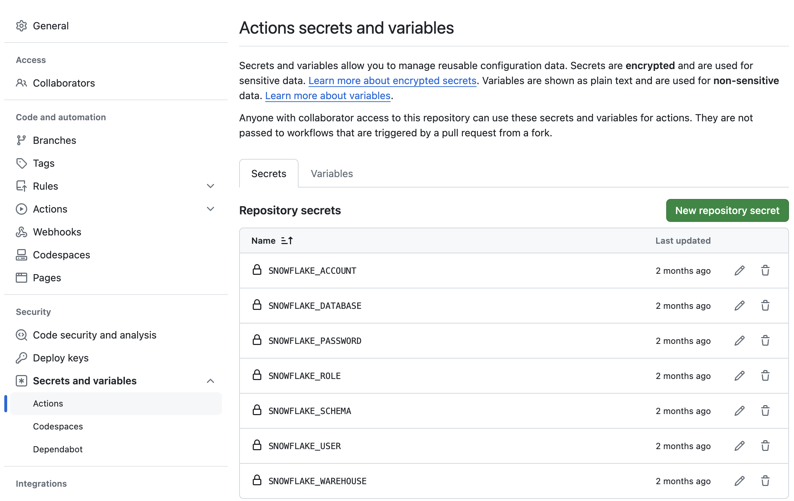

authors: Jeremiah Hansen
id: data_engineering_with_notebooks
summary: This guide will provide step-by-step details for building data engineering pipelines with Snowflake Notebooks
categories: featured,data-engineering,notebooks
environments: web
status: Published 
feedback link: https://github.com/Snowflake-Labs/sfguides/issues
tags: Data Engineering, Snowpark, Python, Notebooks

# Data Engineering with Snowflake Notebooks
<!-- ------------------------ -->
## Overview 
Duration: 15

Notebooks are a very popular tool that are used to do everything from ad-hoc exploration of data to productionalized data engineering pipelines. While Notebooks can contain a mix of both Python and SQL, most of the time they're used for Python coding. In my previous Quickstart I detailed [how to build Python data engineering piplines in Snowflake](https://quickstarts.snowflake.com/guide/data_engineering_pipelines_with_snowpark_python/index.html?index=..%2F..index#0) using Visual Studio Code, from a lower-level developer perpective.

This Quickstart will focus on how to build Python data engineering pipelines using Snowflake native Notebooks! Additionally it will provide all the details needed to manage and deploy those Notebooks through an automated CI/CD pipeline from development to production! Here's a quick visual overview of what we'll accomplish in this Quickstart:

> aside negative
> 
> **Note** - As of 6/10/2024, the [Snowflake Notebooks](https://docs.snowflake.com/en/user-guide/ui-snowsight/notebooks) are in Public Preview.

### What You’ll Learn
* How to ingest custom file formats (like Excel) with Snowpark from an external stage (such as an S3 bucket) into a Snowflake table
* How to access data from Snowflake Marketplace and use it for your analysis
* How to use Snowflake Notebooks and the Snowpark DataFrame API to build data engineering pipeilnes
* How to add logging to your Python data engineering code and monitor from within Snowsight
* How to execute SQL scripts from your Git repository directly in Snowflake
* How to use open-source Python libraries from curated Snowflake Anaconda channel
* How to use the Snowflake Python Management API to programitcally work with Snowflake objects
* How to use the Python Task DAG API to programatically manage Snowflake Tasks
* How to build CI/CD pipelines using Snowflake's Git Integration, the Snowflake CLI, and Github Actions
* How to deploy Snowflake Notebooks from dev to production

### Prerequisites
* Familiarity with Python
* Familiarity with the DataFrame API
* Familiarity with Snowflake
* Familiarity with Git repositories and GitHub

### What You’ll Need
You will need the following things before beginning:

* Snowflake account
    * **A Snowflake Account**
    * **A Snowflake user created with ACCOUNTADMIN permissions**. This user will be used to get things setup in Snowflake.
    * **Anaconda Terms & Conditions accepted**. See Getting Started section in [Third-Party Packages](https://docs.snowflake.com/en/developer-guide/udf/python/udf-python-packages.html#getting-started).
* GitHub account
    * **A GitHub account**. If you don't already have a GitHub account you can create one for free. Visit the [Join GitHub](https://github.com/signup) page to get started.

<!-- ------------------------ -->
## Quickstart Setup
Duration: 10

### Create a GitHub Personal Access Token
In order for Snowflake to authenticate to your GitHub repository, you will need to generate a personal access token. Please follow the [Creating a personal access token](https://docs.github.com/en/authentication/keeping-your-account-and-data-secure/managing-your-personal-access-tokens#creating-a-personal-access-token-classic) instructions to create your token.

Make sure to note down the token until step 3 of the Quickstart, where we will be securely storing it within a Snowflake secret object.

### Fork the Quickstart Repository
You'll need to create a fork of the repository for this Quickstart in your GitHub account. Visit the [Data Engineering with Snowflake Notebooks associated GitHub Repository](https://github.com/Snowflake-Labs/sfguide-data-engineering-with-notebooks) and click on the "Fork" button near the top right. Complete any required fields and click "Create Fork".

### Configure GitHub Actions
By default GitHub Actions disables any workflows (or CI/CD pipelines) defined in the forked repository. This repository contains a workflow to deploy your Snowpark Notebooks, which we'll use later on. So for now enable this workflow by opening your forked repository in GitHub, clicking on the `Actions` tab near the top middle of the page, and then clicking on the `I understand my workflows, go ahead and enable them` green button.

The last step to enable your GitHub Actions workflow is to create the required secrets. In order for your GitHub Actions workflow to be able to connect to your Snowflake account you will need to store your Snowflake credentials in GitHub. Action Secrets in GitHub are used to securely store values/variables which will be used in your CI/CD pipelines. In this step we will create secrets for each of the parameters used by the Snowflake CLI.

From the repository, click on the `Settings` tab near the top of the page. From the Settings page, click on the `Secrets and variables` then `Actions` tab in the left hand navigation. The `Actions` secrets should be selected. For each secret listed below click on `New repository secret` near the top right and enter the name given below along with the appropriate value (adjusting as appropriate).

<table>
    <thead>
        <tr>
            <th>Secret name</th>
            <th>Secret value</th>
        </tr>
    </thead>
    <tbody>
        <tr>
            <td>SNOWFLAKE_ACCOUNT</td>
            <td>myaccount</td>
        </tr>
        <tr>
            <td>SNOWFLAKE_USER</td>
            <td>myusername</td>
        </tr>
        <tr>
            <td>SNOWFLAKE_PASSWORD</td>
            <td>mypassword</td>
        </tr>
        <tr>
            <td>SNOWFLAKE_ROLE</td>
            <td>DEMO_ROLE</td>
        </tr>
        <tr>
            <td>SNOWFLAKE_WAREHOUSE</td>
            <td>DEMO_WH</td>
        </tr>
        <tr>
            <td>SNOWFLAKE_DATABASE</td>
            <td>DEMO_DB</td>
        </tr>
        <tr>
            <td>SNOWFLAKE_SCHEMA</td>
            <td>INTEGRATIONS</td>
        </tr>
    </tbody>
</table>

> aside positive
> 
>  **Tip** - For more details on how to structure the account name in SNOWFLAKE_ACCOUNT, see the account name discussion in [the Snowflake Python Connector install guide](https://docs.snowflake.com/en/user-guide/python-connector-install.html#step-2-verify-your-installation).

When you’re finished adding all the secrets, the page should look like this:

> aside positive
> 
>  **Tip** - For an even better solution to managing your secrets, you can leverage [GitHub Actions Environments](https://docs.github.com/en/actions/reference/environments). Environments allow you to group secrets together and define protection rules for each of your environments.

### Create GitHub Codespace
For this Quickstart we will be using [GitHub Codespaces](https://docs.github.com/en/codespaces/overview) for our development environment. Codespaces offer a hosted development environment with a hosted, web-based VS Code environment. GitHub currently offers [60 hours for free each month](https://github.com/features/codespaces) when using a 2 node environment, which should be more than enough for this lab.

To create a GitHub Codespace, click on the green `<> Code` button from the GitHub repository homepage. In the Code popup, click on the `Codespaces` tab and then on the green `Create codespace on main`.

This will open a new tab and begin setting up your codespace. This will take a few minutes as it sets up the entire environment for this Quickstart. Here is what is being done for you:

* Creating a container for your environment
* Installing Anaconda (miniconda)
* Creating a directory and default config files
* Anaconda setup
    * Creating the Anaconda environment
    * Installing the Snowpark Python library
    * Installing the Snowflake CLI Python CLI
* VS Code setup
    * Installing VS Code
    * Configuring VS Code for the Python Anaconda environment
    * Installing the Snowflake VS Code extension
* Starting a hosted, web-based VS Code editor

Once the codepsace has been created and started you should see a hosted web-based version of VS Code with your forked repository set up! Just a couple more things and we're ready to start.

### Configure Snowflake Credentials
Both the [Snowflake Connector for Python](https://docs.snowflake.com/en/developer-guide/python-connector/python-connector) and the [Snowflake CLI](https://docs.snowflake.com/en/developer-guide/snowflake-cli-v2/index) use the same configuration files, which can be found in the `~/.snowflake` folder. Default configuration files were created for you during the codespace setup.

For this Quickstart you'll only need to edit the `~/.snowflake/connections.toml` file. The easiest way to edit the default `~/.snowflake/connections.toml` file is directly from VS Code in your codespace. Type `Command-P`, type (or paste) `~/.snowflake/connections.toml` and hit return. The config file should now be open. You just need to edit the file and replace the `account`, `user`, and `password` with your values. Then save and close the file.

**Note:** The Snowflake CLI (and by extension this Quickstart) currently does not work with Key Pair authentication. It simply grabs your username and password details from the config file.

### Verify Your Anaconda Environment is Activated
During the codespace setup we created an Anaconda environment named `snowflake-demo`. And when VS Code started up it should have automatically activated the environment in your terminal. You should see something like this in the terminal, and in particular you should see `(snowflake-demo)` before your bash prompt.

If for some reason it wasn't activiated simply run `conda activate snowflake-demo` in your terminal.

<!-- ------------------------ -->
## Setup Snowflake
Duration: 10

### Snowflake Extensions for VS Code
You can run SQL queries against Snowflake in many different ways (through the Snowsight UI, SnowSQL, etc.) but for this Quickstart we'll be using the Snowflake extension for VS Code. For a brief overview of Snowflake's native extension for VS Code, please check out our [VS Code Marketplace Snowflake extension page](https://marketplace.visualstudio.com/items?itemName=snowflake.snowflake-vsc).

### Run the Setup Script
To set up all the objects we'll need in Snowflake for this Quickstart you'll need to run the `scripts/setup.sql` script.

Start by clicking on the Snowflake extension in the left navigation bar in VS Code. Then login to your Snowflake account with a user that has ACCOUNTADMIN permissions. Once logged in to Snowflake, open the `scripts/setup.sql` script in VS Code by going back to the file Explorer in the left navigation bar. Next, update the 4 `GITHUB_` SQL variables at the top of script before running. Use the value of your GitHub personal access token in the `GITHUB_SECRET_PASSWORD` variable.

To run all the queries in this script, use the "Execute All Statements" button in the upper right corner of the editor window. Or, if you want to run them in chunks, you can highlight the ones you want to run and press CMD/CTRL+Enter. 

<!-- ------------------------ -->
## Deploy to Dev
Duration: 10

In the previous step, when you ran the `scripts/setup.sql` script from VS Code it created a number of objects, including a Notebook named `00_start_here`. We will use that Notebook a few times during this Quickstart to help with some of the steps.

During this step we will be deploying the dev versions of our two data engineering Notebooks: `DEV_05_load_excel_files` and `DEV_06_load_daily_city_metrics`. For this Quickstart you will notice that our main data engineering Notebooks will be named with a prefix for the environment label, like `DEV_` for dev and `PROD_` for prod. A full discussion of different approaches for managing multiple environments with Snowflake is out of scope for this Quickstart. For a real world use case, you may or may not need to do the same, depending on your Snowflake set up.

To put this in context, we are on step **#4** in our data flow overview:

### Git in Snowsight
When you ran the `scripts/setup.sql` script in the previous step, you created a Git Integration in Snowflake for your forked GitHub repository! Please see [Using a Git repository in Snowflake](https://docs.snowflake.com/en/developer-guide/git/git-overview) for more details.

### Notebook Overview
### Deploy Notebooks
### EXECUTE IMMEDIATE FROM with Jinja Templating

<!-- ------------------------ -->
## Load Weather
Duration: 10

### Snowflake Marketplace
### Weather data from Snowflake Marketplace
### Test the Weather Data

<!-- ------------------------ -->
## Load Location and Order Detail
Duration: 10

### Run the Notebook
### Notebook Git Integration
### Notebook Cell References
### Loading Excel Files
### Dynamic File Access?
### Snowpark DataFrame API

<!-- ------------------------ -->
## Load Daily City Metrics
Duration: 10

### Run the Notebook
### Python Management API
### Logging in Python
### Log Viewer in Snowsight

<!-- ------------------------ -->
## Orchestrate Jobs
Duration: 10

### Python Task DAG API
### Deploy Task DAG
### Task Viewer in Snowsight
### Executing the DAG
### Task Metadata

<!-- ------------------------ -->
## Deploy to Production
Duration: 10

### Update the 05 Notebook
### Push Changes to Forked Repository
### GitHub Action Pipeline
### Snow CLI
### Create PR and Merge to Main
### Viewing GitHub Actions Workflow
### Executing the Production DAG?

<!-- ------------------------ -->
## Teardown
Duration: 10

<!-- ------------------------ -->
## Conclusion
Duration: 10

### What You Learned
### Related Resources
