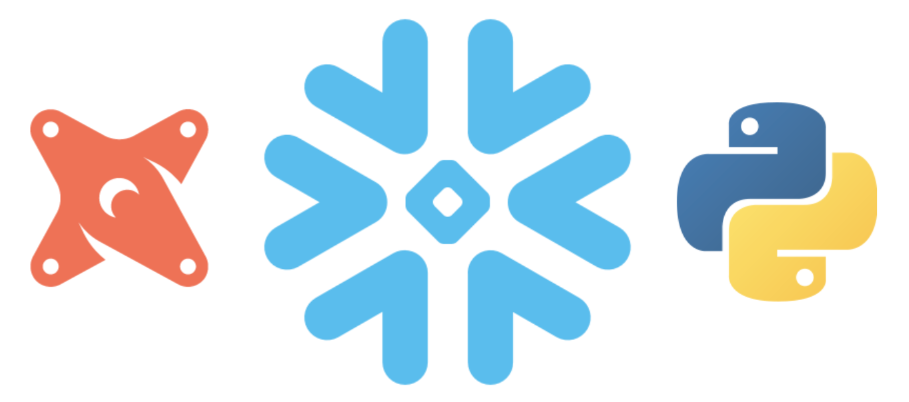

author: Jeremiah Hansen
id: data_engineering_with_snowpark_python_and_dbt
summary: This guide will provide step-by-step details for building data engineering pipelines with Snowpark Python and dbt
categories: data-engineering
environments: web
status: Published 
feedback link: https://github.com/Snowflake-Labs/sfguides/issues
tags: Data Engineering, dbt

# Data Engineering with Snowpark Python and dbt
<!-- ------------------------ -->
## Overview 
Duration: 4



### Background
Data engineering is a broad discipline which includes data ingestion, data transformation, and data consumption, along with the accompanying SDLC best practices (i.e. DevOps). Data engineers employ different tools and approaches depending on the phase. For this Quickstart we will focus on the data transformation phase in particular.

Data transformation involves taking source data which has been ingested into your data platform and cleansing it, combining it, and modeling it for downstream use. Historically the most popular way to transform data has been with the SQL language and data engineers have built data transformation pipelines using SQL often with the help of ETL/ELT tools. But recently many folks have also begun adopting the DataFrame API in languages like Python for this task. For the most part a data engineer can accomplish the same data transformations with either approach, and deciding between the two is mostly a matter of preference and particular use cases. That being said, there are use cases where a particular data transform can't be expressed in SQL and a different approach is needed. The most popular approach for these use cases is Python along with a DataFrame API.

### dbt
Enter dbt. dbt is one of the most (maybe the most) popular data transformation tools today. And until now dbt has been entirely a SQL-based transformation tool. But with the announcement of dbt Python models, things have changed. It's now possible to create both SQL and Python based models in dbt! Here's how dbt explains it:

>dbt Python ("dbt-py") models will help you solve use cases that can't be solved with SQL. You can perform analyses using tools available in the open source Python ecosystem, including state-of-the-art packages for data science and statistics. Before, you would have needed separate infrastructure and orchestration to run Python transformations in production. By defining your Python transformations in dbt, they're just models in your project, with all the same capabilities around testing, documentation, and lineage. ([dbt Python models](https://docs.getdbt.com/docs/building-a-dbt-project/building-models/python-models))

### Snowflake
Python based dbt models are made possible by Snowflake's new native Python support and Snowpark API for Python. With Snowflake's native Python support and DataFrame API, you no longer need to maintain and pay for separate infrastructure/services to run Python code, it can be run directly within Snowflake's Enterprise grade data platform!

This guide will provide step-by-step instructions for how to get started with Snowflake Snowpark Python and dbt's new Python-based models.

Negative
: **Note** - As of 10/1/2022, both of these features are still in preview. Snowflake's native Python support and Snowpark API for Python is in Public Preview, and dbt's Python model support is in preview and will be released with version 1.3.


### Prerequisites

This guide assumes that you have a basic working knowledge of dbt, Python, and Anaconda.

### What You'll Learn

* The basics of Snowpark Python
* How to create Python-based models in dbt
* How to create and use Python UDFs in your dbt Python model
* How the integration between Snowpark Python and dbt's Python models works

### What You'll Need

You will need the following things before beginning:

1. Snowflake
    1. **A Snowflake Account.**
    1. **A Snowflake Database named DEMO_DB.**
    1. **A Snowflake User created with appropriate permissions.** This user will need permission to create objects in the DEMO_DB database.
1. Anaconda
    1. **Anaconda installed on your computer.** Check out the [Anaconda Installation](https://docs.anaconda.com/anaconda/install/) instructions for the details. 
1. dbt
    1. **dbt installed on your computer.** Since Python models in dbt are still in preview, you will need to manually specify the correct beta version of dbt. As of 10/1/2022, please follow these step (where `<env-name>` is any name you want for the Anaconda environment):
        1. `conda create -n <env-name> python=3.8`
        1. `conda activate <env-name>`
        1. `pip install dbt-core==1.3.0rc1`
        1. `pip install dbt-snowflake==1.3.0rc1`
1. Integrated Development Environment (IDE)
    1. **Your favorite IDE installed on your computer.** If you don’t already have a favorite IDE I would recommend the great, free, open-source [Visual Studio Code](https://code.visualstudio.com/).

The following are optional but will help you debug your Python dbt models:

1. **Python extension installed in your IDE.** For VS Code, install [the Python extension from Microsoft](https://marketplace.visualstudio.com/items?itemName=ms-python.python).

### What You'll Build

* A simple dbt project with Python-based models!


<!-- ------------------------ -->
## Create the dbt Project
Duration: 10

The easiest way to get started with dbt, and ensure you have the most up-to-date dbt configurations, is to the run the `dbt init` command. The `dbt init` process will create two folders in the directory you run it from, a `logs` folder and a folder with the same name as your project. So in a terminal change to the directory where you want the new dbt project folder created and execute `dbt init`. Follow the prompts to create your new project. For most of the prompts enter the value appropriate to your environment, but for **database** and **schema** enter the values below:

* Enter a name for your project (letters, digits, underscore): `<project name>`
* Which database would you like to use? ... Enter a number: `[1] snowflake`
* account (https://<this_value>.snowflakecomputing.com): `<snowflake account>`
* user (dev username): `<snowflake username>`
* Desired authentication type option (enter a number): `[1] password`
* password (dev password): `<snowflake password>`
* role (dev role): `<snowflake role>`
* warehouse (warehouse name): `<snowflake warehouse>`
* database (default database that dbt will build objects in): `DEMO_DB`
* schema (default schema that dbt will build objects in): `DEMO_SCHEMA`
* threads (1 or more) [1]: `1`

See the [dbt init documentation](https://docs.getdbt.com/reference/commands/init) for more details on what just happened, but after `dbt init` finished you will have a functional dbt project and the following default SQL models in the `models` folder:

```
models
|-- example
|--|-- my_first_dbt_model.sql
|--|-- my_second_dbt_model.sql
|--|-- schema.yml
```

Positive
: **Note** - The connection details you just entered have been stored in a dbt connection profile in the default location: `~/.dbt/profiles.yml`. To learn more about managing connection details with dbt profiles please see [configuring your profile](https://docs.getdbt.com/dbt-cli/configure-your-profile).

To verify that everything is configured properly, open a terminal and execute `dbt run`. dbt should execute successfully and you should now have the following objects created in Snowflake in your `DEMO_DB.DEMO_SCHEMA` schema:

* A table named `my_first_dbt_model`
* A view named `my_second_dbt_model`

Negative
: **Note** - If the `dbt run` command did not complete successfully, it's most likely something wrong with your connection details. Please review and update those details in your dbt connection profile saved here: `~/.dbt/profiles.yml`. Then retry.

<!-- ------------------------ -->
## Create a Simple Python Model
Duration: 8

### Overview
Now that you've created your dbt project and run it once successfully, it's time to create our first Python model! But before we do, here's a brief overview of how to create a Python model in dbt (from [dbt Python models](https://docs.getdbt.com/docs/building-a-dbt-project/building-models/python-models)):

>Each Python model lives in a `.py` file in your `models/` folder. It defines a function named **`model()`**, which takes two parameters:
>
>* `dbt`: A class compiled by dbt Core, unique to each model, that enables you to run your Python code in the context of your dbt project and DAG.
>* `session`: A class representing the connection to the Python backend on your data platform. The session is needed to read in tables as DataFrames, and to write DataFrames back to tables. In PySpark, by convention, the `SparkSession` is named `spark`, and available globally. For consistency across platforms, we always pass it into the `model` function as an explicit argument named `session`.
>
>The `model()` function must return a single DataFrame.

### Create my_first_python_model

In the `models/example` folder, create a new file named `my_first_python_model.py` and copy & paste the following content to the new file:

```python
def model(dbt, session):
    # Must be either table or incremental (view is not currently supported)
    dbt.config(materialized = "table")

    # DataFrame representing an upstream model
    df = dbt.ref("my_first_dbt_model")
 
    return df
```

Finally, save the file and execute `dbt run` again. If everything ran successfully you just ran your very first Python model in dbt! It's that simple. Here are a few things to note at this point:

* No Jinja! dbt Python models don't use Jinja to render compiled code.
* You don't have to explicitly import the Snowflake Snowpark Python library, dbt will do that for you. More on this in the next step.
* As mentioned above, every dbt Python model must define a method named `model` that has the following signature: `model(dbt, session)`.
* As of 10/1/2022 only `table` or `incremental` materializations are supported, which is why we configured it explicitly here.
* You can use `dbt.ref()` and `dbt.source()` just the same as their Jinja equivalents in SQL models. And you can refer to either Python or SQL models interchangeably!

Positive
: **Note** - For more details on accessing dbt project contexts from your Python models, please check out [Accessing project context](https://docs.getdbt.com/docs/building-a-dbt-project/building-models/python-models#accessing-project-context).


<!-- ------------------------ -->
## Understand How the Simple dbt Python Model Works
Duration: 10

So what just happened you ran your dbt Python model? The single best thing to help you debug and understand what's happening is to look at your [Query History](https://docs.snowflake.com/en/user-guide/ui-snowsight-activity.html#query-history) in Snowflake. Please take a minute now to review what happened in your Snowflake account, by reviewing your recent query history.

### Overivew of dbt Executed Queries
Here are the queries that dbt executed when you ran the `my_first_python_model` model. I've omitted the content of the stored procedure in this section so that it's easier to see what's happening at a high level. In the next section we'll discuss what's happening inside the stored procedure.

1. List schemas

        show terse schemas in database DEMO_DB

1. List objects

        show terse objects in DEMO_DB.DEMO_SCHEMA

1. Create stored procedure

        CREATE OR REPLACE PROCEDURE DEMO_DB.DEMO_SCHEMA.my_first_python_model__dbt_sp ()
        RETURNS STRING
        LANGUAGE PYTHON
        RUNTIME_VERSION = '3.8' -- TODO should this be configurable?
        PACKAGES = ('snowflake-snowpark-python')
        HANDLER = 'main'
        EXECUTE AS CALLER
        AS
        $$

        <dbt compiled Python code>

        $$;

1. Call stored procedure

        CALL DEMO_DB.DEMO_SCHEMA.my_first_python_model__dbt_sp()

    1. Materialize model

            CREATE  OR  REPLACE TABLE DEMO_DB.DEMO_SCHEMA.my_first_python_model AS  SELECT  *  FROM ( SELECT  *  FROM (DEMO_DB.DEMO_SCHEMA.my_first_dbt_model)

1. Drop stored procedure

        drop procedure if exists DEMO_DB.DEMO_SCHEMA.my_first_python_model__dbt_sp()


### Overview of Stored Procedure Code Generated by dbt
So what exactly is happening in the stored procedure? This is really the critical part to focus on in order to understand what dbt is doing with Python models. As we go through this, keep in mind that a core design principal for dbt Python models is that all of the Python code will be executed in Snowflake, and none will be run locally. Here's how dbt's documentation puts it:

> The prerequisites for dbt Python models include using an adapter for a data platform that supports a fully featured Python runtime. In a dbt Python model, all Python code is executed remotely on the platform. None of it is run by dbt locally. We believe in clearly separating model definition from model execution. In this and many other ways, you'll find that dbt's approach to Python models mirrors its longstanding approach to modeling data in SQL. (from [dbt Python models](https://docs.getdbt.com/docs/building-a-dbt-project/building-models/python-models))

With that, let's look at our first Python dbt model again:

```python
def model(dbt, session):
    # Must be either table or incremental (view is not currently supported)
    dbt.config(materialized = "table")

    # DataFrame representing an upstream model
    df = dbt.ref("my_first_dbt_model")
 
    return df
```

So in order to run that in Snowflake we need a few things. First it needs to run in the context of a stored procedure, and second the stored procedure needs to contain everything necessary to run the model. This means that dbt needs to generate Python code to handle the following things:

1. Provide a `dbt` and `session` object to our `model()` method.
    1. The `dbt` object needs to provide access to dbt configuration and dag context with methods like `ref()`, `source()`, `config()`, `this()`, etc.
    1. The `session` object is the Snowpark session
1. Provide the logic to materialize the resulting DataFrame returned by the `model()` method
1. Provide the overall orchestration of these pieces

Here's the full content of the stored procedure generated by dbt (which was removed in the overview above and replaced with the `<dbt compiled Python code>` placeholder):

```python
def model(dbt, session):
    # Must be either table or incremental (view is not currently supported)
    dbt.config(materialized = "table")

    # DataFrame representing an upstream model
    df = dbt.ref("my_first_dbt_model")
 
    return df


# This part is user provided model code
# you will need to copy the next section to run the code
# COMMAND ----------
# this part is dbt logic for get ref work, do not modify

def ref(*args,dbt_load_df_function):
    refs = {"my_first_dbt_model": "DEMO_DB.DEMO_SCHEMA.my_first_dbt_model"}
    key = ".".join(args)
    return dbt_load_df_function(refs[key])


def source(*args, dbt_load_df_function):
    sources = {}
    key = ".".join(args)
    return dbt_load_df_function(sources[key])


config_dict = {}


class config:
    def __init__(self, *args, **kwargs):
        pass

    @staticmethod
    def get(key):
        return config_dict.get(key)

class this:
    """dbt.this() or dbt.this.identifier"""
    database = 'DEMO_DB'
    schema = 'DEMO_SCHEMA'
    identifier = 'my_first_python_model'
    def __repr__(self):
        return 'DEMO_DB.DEMO_SCHEMA.my_first_python_model'


class dbtObj:
    def __init__(self, load_df_function) -> None:
        self.source = lambda x: source(x, dbt_load_df_function=load_df_function)
        self.ref = lambda x: ref(x, dbt_load_df_function=load_df_function)
        self.config = config
        self.this = this()
        self.is_incremental = False

# COMMAND ----------

# To run this in snowsight, you need to select entry point to be main
# And you may have to modify the return type to text to get the result back
# def main(session):
#     dbt = dbtObj(session.table)
#     df = model(dbt, session)
#     return df.collect()

# to run this in local notebook, you need to create a session following examples https://github.com/Snowflake-Labs/sfguide-getting-started-snowpark-python
# then you can do the following to run model
# dbt = dbtObj(session.table)
# df = model(dbt, session)


def materialize(session, df, target_relation):
    # we have to make sure pandas is imported
    import pandas
    if isinstance(df, pandas.core.frame.DataFrame):
        # session.write_pandas does not have overwrite function
        df = session.createDataFrame(df)
    df.write.mode("overwrite").save_as_table("DEMO_DB.DEMO_SCHEMA.my_first_python_model", create_temp_table=False)

def main(session):
    dbt = dbtObj(session.table)
    df = model(dbt, session)
    materialize(session, df, dbt.this)
    return "OK"
```

Positive
: **Note** - When building and debugging your dbt Python models, you can find this Python code in the compiled version of the model by running `dbt compile` (or `dbt run`). The compiled files are written to the `target-path` folder, which by default is a folder named `target` in your dbt project folder.


<!-- ------------------------ -->
## Create a Python Model with a UDF
Duration: 10

Now that you understand the basics of dbt Python models, let's add in another concept, the user-defined function (or UDF for short). "A UDF (user-defined function) is a user-written function that can be called from Snowflake in the same way that a built-in function can be called. Snowflake supports UDFs written in multiple languages, including Python." (see [Introduction to Python UDFs](https://docs.snowflake.com/en/developer-guide/udf/python/udf-python-introduction.html) for more details). By creating and registering a UDF it can be used in your DataFrame (or SQL) expression just like a built-in function.

So let's create a second dbt Python model, this time with a UDF. In the `models/example` folder, create a new file named `my_second_python_model.py` and copy & paste the following content to the new file:

```python
from snowflake.snowpark.functions import udf

def model(dbt, session):
    # Must be either table or incremental (view is not currently supported)
    dbt.config(materialized = "table")

    # User defined function
    @udf
    def add_one(x: int) -> int:
        x = 0 if not x else x
        return x + 1

    # DataFrame representing an upstream model
    df = dbt.ref("my_first_dbt_model")

    # Add a new column containing the id incremented by one
    df = df.withColumn("id_plus_one", add_one(df["id"]))

    return df
```

As you can see from the code above we're creating a very simple UDF named `add_one()` which adds one to the number passed to the function. Finally, save the file and execute `dbt run` again (or just run this new model by executing `dbt run --model my_second_python_model`). If everything ran successfully you just ran your second Python model with a UDF in dbt!

### Aside: Where to Define the UDF

Remember in the last section how we saw that your dbt Python model code is supplemented with dbt's compiled code and then wrapped in a Snowflake stored procedure? Well that's important to note as it has implications for where/how you define a UDF in your Python model. In the example above we defined and registered the function inside the `main()` handler function, using the `@udf` decorator.

If you try and define and register the function outside of the `main()` handler function you will get the following error: `Query outside the handler is not allowed in Stored Procedure. Please move query related functions into the handler in function`. In order to move the function definition outside of the `main()` handler function you must only define it there and then register it inside. Here is an example from dbt's documentation ([dbt Python models](https://docs.getdbt.com/docs/building-a-dbt-project/building-models/python-models)):

```python
import snowflake.snowpark.types as T
import snowflake.snowpark.functions as F
import numpy

def register_udf_add_random():
    add_random = F.udf(
        # use 'lambda' syntax, for simple functional behavior
        lambda x: x + numpy.random.normal(),
        return_type=T.FloatType(),
        input_types=[T.FloatType()]
    )
    return add_random

def model(dbt, session):

    dbt.config(
        materialized = "table",
        packages = ["numpy"]
    )

    temps_df = dbt.ref("temperatures")

    add_random = register_udf_add_random()

    # warm things up, who knows by how much
    df = temps_df.withColumn("degree_plus_random", add_random("degree"))
    return df
```

Notice that the function is defined outside the `main()` handler function and then registered (and used) inside.


<!-- ------------------------ -->
## Understand How the dbt Python Model with a UDF Works
Duration: 8

Now let's take another deep dive into what happened when we run the second dbt model with a UDF. As before, please take a minute now to review what happened in your Snowflake account, by reviewing your recent query history ([Query History](https://docs.snowflake.com/en/user-guide/ui-snowsight-activity.html#query-history)).


### Overivew of dbt Executed Queries
Here are the queries that dbt executed when you ran the `my_second_python_model` model. You will notice that it's similar to the first model, but with some more queries to deal with creating the UDF. I've again omitted the content of the stored procedure in this section so that it's easier to see what's happening at a high level. But I won't walk through it this time as it's very similar to the previous example, the only real difference being the difference in model code.

1. List schemas

        show terse schemas in database DEMO_DB

1. List objects

        show terse objects in DEMO_DB.DEMO_SCHEMA

1. Create stored procedure

        CREATE OR REPLACE PROCEDURE DEMO_DB.DEMO_SCHEMA.my_second_python_model__dbt_sp ()
        RETURNS STRING
        LANGUAGE PYTHON
        RUNTIME_VERSION = '3.8' -- TODO should this be configurable?
        PACKAGES = ('snowflake-snowpark-python')
        HANDLER = 'main'
        EXECUTE AS CALLER
        AS
        $$

        <dbt compiled Python code>

        $$;

1. Call stored procedure

        CALL DEMO_DB.DEMO_SCHEMA.my_second_python_model__dbt_sp()

    1. Use the correct database

            SELECT CURRENT_DATABASE()

    1. Create a temporary stage

            create temporary stage if not exists DEMO_DB.DEMO_SCHEMA.SNOWPARK_TEMP_STAGE_4LBT18DLR8

    1. List the contents of the stage

            ls '@"DEMO_DB"."DEMO_SCHEMA".SNOWPARK_TEMP_STAGE_4LBT18DLR8'

    1. Get the list of files in the stage

            SELECT "name" FROM ( SELECT  *  FROM  TABLE ( RESULT_SCAN('<previous_query_id')))

    1. Create the temporary function

            CREATE TEMPORARY FUNCTION "DEMO_DB"."DEMO_SCHEMA".SNOWPARK_TEMP_FUNCTION_1Z5V5PPNVH(arg1 BIGINT)
            RETURNS BIGINT
            LANGUAGE PYTHON
            RUNTIME_VERSION=3.8
            PACKAGES=('cloudpickle==2.0.0')
            HANDLER='compute'

            AS $$

            <Snowpark generated Python code, including pickled function>

            $$;

    1. Materialize the table

            CREATE  OR  REPLACE TABLE  DEMO_DB.DEMO_SCHEMA.my_second_python_model AS  SELECT  *  FROM ( SELECT "ID", "DEMO_DB"."DEMO_SCHEMA".SNOWPARK_TEMP_FUNCTION_1Z5V5PPNVH("ID") AS "ID_PLUS_ONE" FROM ( SELECT  *  FROM (DEMO_DB.DEMO_SCHEMA.my_first_dbt_model)))

1. Drop stored procedure

        drop procedure if exists DEMO_DB.DEMO_SCHEMA.my_second_python_model__dbt_sp()

The overall steps are the same, but notice that what happens during the stored procedure execution (step #4) is different and more complex. This is because the Snowpark library, running inside the Snowflake Python stored procedure has more work to do with UDFs. It has to pickle the UDF content, create a temporary stage,  and finally create the UDF in Snowflake.

<!-- ------------------------ -->
## Conclusion & Next Steps
Duration: 4

### Conclusion

Hopefully you've seen how powerful the combination of dbt Python models and the Snowflake platform can be! By supporting both SQL and Python based transformations in dbt, data engineers can take advantage of both while building robust data pipelines. While most of the time the choice between SQL or DataFrames is simply a matter of preference, as we discussed in the introduction there are use cases where data transformations can't be expressed in SQL. In these cases data engineers can make use of tools available in the open source Python ecosystem, including state-of-the-art packages for data science and statistics.

And best of all, the Snowflake platform enables this with Native Python support and rich Snowpark API for Python. This eliminates the need for data engineers to maintain and pay for separate infrastructure/services to run Python code. Snowflake manages all of it for you with the ease of use that you would expect from Snowflake!

Data engineering with Snowflake and dbt just got easier!

### Some Tips for Debugging dbt Python Models

There are a few ways to debug your dbt Python models.

The first tip is to build and debug via dbt. This is probably the default for most people. With this approach you edit the dbt Python model code directly in the dbt model file and execute it via the `dbt run` command (and it's often best to use the `dbt run --model <model_name>` syntax to only run the model in consideration). But this can be a bit time consuming and require you to flip back and forth between your dbt and Snowflake.

The second tip is to build and debug the model code directly in Python. Like I mentioned in Section 1, I personally like Visual Studio Code and the [the Python extension from Microsoft](https://marketplace.visualstudio.com/items?itemName=ms-python.python), but you can use whatever Python IDE you prefer. Regardless, the idea here is to copy/paste the contents of the dbt generated Python code into a temporary Python script as a starting point then edit/debug until it's right and finally paste just the contents of the model back into your dbt model file. As we saw in section 4 of this Quickstart you can get the dbt generated Python code by compiling the model and looking at the compiled script. There is even commented out code in the dbt generated Python code to help get you started.

Hope that helps!

### What We've Covered

* The basics of Snowpark Python
* How to create Python-based models in dbt
* How to create and use Python UDFs in your dbt Python model
* How the integration between Snowpark Python and dbt's Python models works

### Related Resources

* [Snowpark Developer Guide for Python](https://docs.snowflake.com/en/developer-guide/snowpark/python/index.html)
* [dbt Python models](https://docs.getdbt.com/docs/building-a-dbt-project/building-models/python-models)
