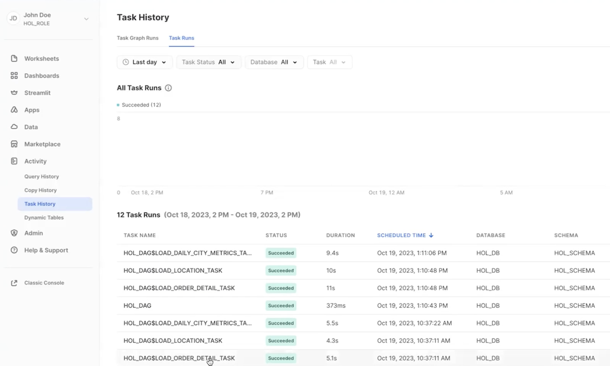
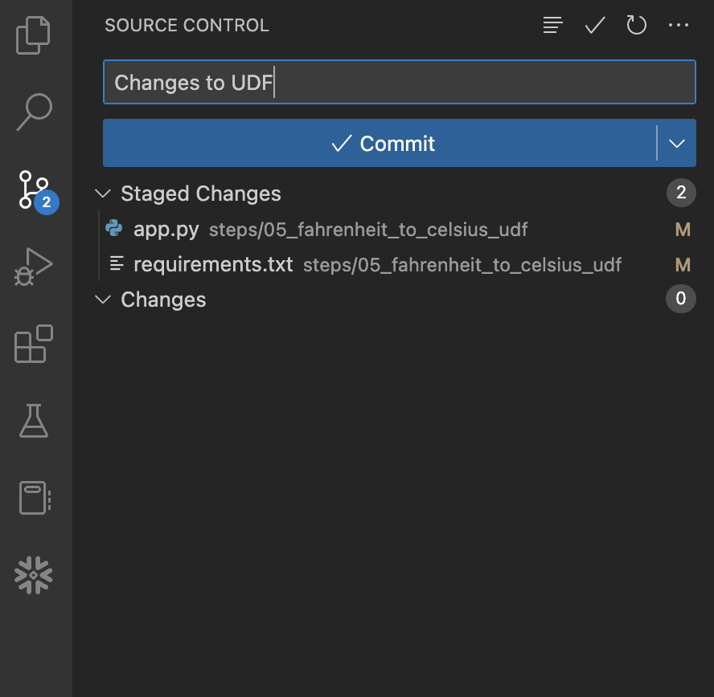
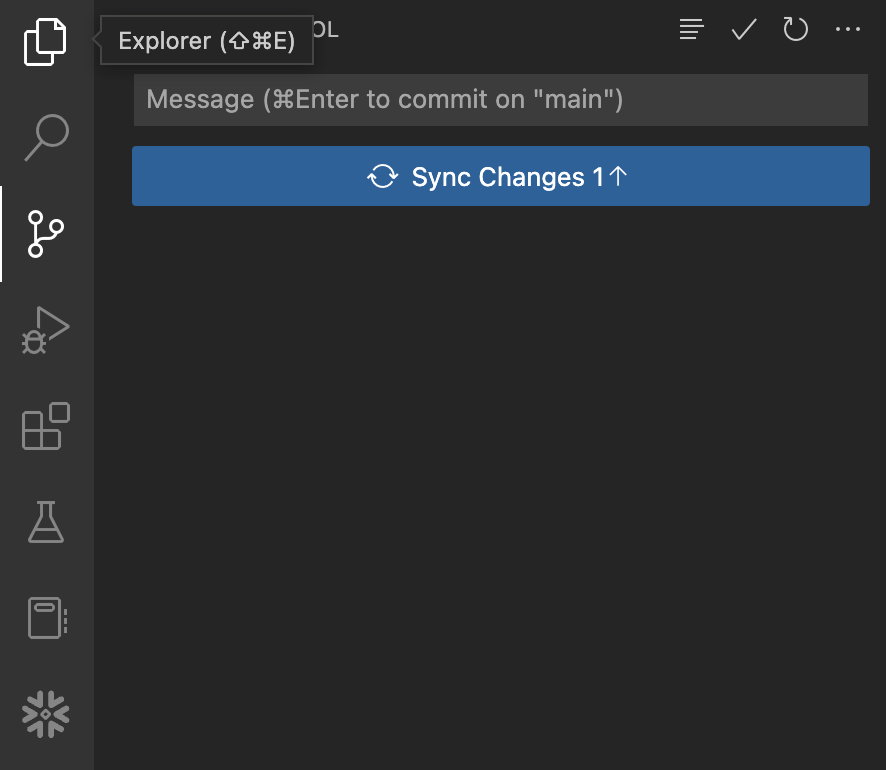

author: Vino Duraisamy, Kamesh Sampath
id: data_engineering_with_snowpark_python_intro
summary: This guide will provide step-by-step details for building data engineering pipelines with Snowpark Python
categories: Getting-Started, featured, data-engineering
environments: web
status: Published 
feedback link: https://github.com/Snowflake-Labs/sfguides/issues
tags: Getting Started, Data Engineering, Snowpark, Python, Intro

# Intro to Data Engineering with Snowpark Python
<!-- ------------------------ -->
## Overview

Duration: 15

This Quickstart will cover the basics of data engineering with Snowpark for Python. By completing this guide, you will be able to build a data pipeline to process data from different sources, and periodically run the pipeline to update your data tables in Snowflake.

Here is a summary of what you will be able to learn in each step by following this quickstart:

- **Setup Environment**: Use stages and tables to ingest and organize raw data from S3 into Snowflake
- **Snowflake Marketplace**: Download the data you need from Snowflake Marketplace and use it for your analysis
- **Data Engineering**: Leverage Snowpark for Python DataFrames to perform data transformations such as group by, aggregate, and join to prep for the data for downstream applications
- **Orchestrating Pipelines**: Use Snowflake Python Tasks API to turn your data pipeline code into operational pipelines with integrated monitoring
- **CI/CD**: Use Git Integration within Snowflake, the Snowflake CLI, and CI/CD tools to automatically deploy python and SQL code in a repeatable manner.

In case you are new to some of the technologies mentioned above, here is a quick summary with the links to documentation.

### What is Snowpark?

Snowpark is the set of libraries and code execution environments that run Python and other programming languages next to your data in Snowflake. Snowpark can be used to build data pipelines, ML models, apps, and other data processing tasks.

**Client Side Libraries** - Snowpark libraries can be installed and downloaded from any client-side notebook or IDE and are used for code development and deployment. Libraries include the Snowpark API for data pipelines and apps and the Snowpark ML API for end to end machine learning.

**Code Execution Environments** - Snowpark provides elastic compute environments for secure execution of your code in Snowflake. These server-side capabilities allow users to bring in and run custom logic in Python with user-defined functions and stored procedures. 

Learn more about [Snowpark](https://www.snowflake.com/snowpark/).


### Working with Snowflake Marketplace

Snowflake Marketplace provides visibility to a wide variety of datasets from third-party data stewards which broaden access to data points used to transform business processes. Snowflake Marketplace also removes the need to integrate and model data by providing secure access to data sets fully maintained by the data provider.

### What you will learn

- How to ingest data from an external stage such as an S3 bucket into a Snowflake table
- How to access data from Snowflake Marketplace and use it for your analysis
- How to analyze data and perform data engineering tasks using Snowpark DataFrame API, Python Stored Procedures and more
- How to use open-source Python libraries from curated Snowflake Anaconda channel
- How to create Snowflake Tasks and use the Python Tasks API to schedule data pipelines
- How to use VS Code extension for Snowflake to perform standard snowflake operations from VS Code and Snowsight UI
- How to use Git integration, the Snowflake CLI, and CI/CD tools like Github Actions to version control code and create and manage deployments.


### Prerequisites

- Familiarity with Python
- Familiarity with the DataFrame API
- Familiarity with Snowflake
- Familiarity with Git repositories and GitHub

### What You’ll Need

You will need the following things before beginning:

- Snowflake account
  - **A Snowflake Account**
  - **A Snowflake user created with ACCOUNTADMIN permissions**. This user will be used to get things setup in Snowflake.
  - **Anaconda Terms & Conditions accepted**. See Getting Started section in [Third-Party Packages](https://docs.snowflake.com/en/developer-guide/udf/python/udf-python-packages.html#getting-started).
- GitHub account
  - **A GitHub account**. If you don't already have a GitHub account you can create one for free. Visit the [Join GitHub](https://github.com/signup) page to get started.

<!-- ------------------------ -->
## Quickstart Setup

Duration: 10

### Fork the GitHub Repository

The very first step is to fork the GitHub repository [Intro to Data Engineering with Snowpark Python associated GitHub Repository](https://github.com/Snowflake-Labs/sfguide-data-engineering-with-snowpark-python-intro). This repository contains all the code you need to successfully complete this Quickstart guide.  Click on the "Fork" button near the top right. Complete any required fields and click "Create Fork".

### Configure Snowflake Credentials
We will not be directly using [the SnowCLI command line client](https://docs.snowflake.com/en/developer-guide/snowflake-cli-v2/index) for this Quickstart, but we will be storing our Snowflake connection details in the SnowCLI connections file located at `~/.snowflake/connections.toml`. A default connection file was created for you during the codespace setup.

The easiest way to edit the default `~/.snowflake/connections.toml` file is directly from VS Code in your codespace. Type `Command-P`, type (or paste) `~/.snowflake/connections.toml` and hit return. The SnowCLI config file should now be open. You just need to edit the file and replace the `accountname`, `username`, and `password` with your values. Then save and close the file.

**Note:** The SnowCLI tool (and by extension this Quickstart) currently does not work with Key Pair authentication. It simply grabs your username and password details from the shared SnowCLI config file.

### Verify Your Anaconda Environment is Activated

During the codespace setup we created an Anaconda environment named `snowflake-demo`. And when VS Code started up it should have automatically activated the environment in your terminal. You should see something like this in the terminal, and in particular you should see `(snowflake-demo)` before your bash prompt.

<!-- ------------------------ -->
## Setup Snowflake Objects

Duration: 20

### Snowflake Extensions for VS Code

You can run SQL queries and Python APIs against Snowflake in many different ways through the Snowsight UI, SnowCLI, etc. But for this Quickstart we'll be using the Snowflake extension for VS Code. For a brief overview of Snowflake's native extension for VS Code, please check out our [VS Code Marketplace Snowflake extension page](https://marketplace.visualstudio.com/items?itemName=snowflake.snowflake-vsc).

To put this in context, we are on step **#3** in our data flow overview:

---


---

### Create Git Integration, Roles, Databases, Tables, Schema and Stages

You can log into [Snowsight](https://docs.snowflake.com/en/user-guide/ui-snowsight.html#) or VS Code to create all the snowflake objects needed to work through this guide.

For the purpose of this quickstart, we will initially use VS Code to create the integration to our Git repository. We will then create the remaining objects using a .SQL script that Snowflake will execute directly from the Git repository. This allows us to ensure we are always running the most recent version of code, and not introducing any issues by copying and pasting in code. 

Open '03_git_config.sql' in VS Code. 

---


---

> aside positive
> IMPORTANT:
>
> - If you use different names for objects created in this section, be sure to update scripts and code in the following sections accordingly.
>
> - For each SQL script block below, select all the statements in the block and execute them top to bottom.

Let's run through the commands individually and understand what each command does and finally create Snowflake Objects required for the lab.

#### Account Level Objects

- We created the role `GIT_ADMIN` and assign it to `CURRENT_USER()` within Snowflake. This role will have the necessary permissions to create Snowflake objects needed to interact with your forked git repo. The role is granted to SYSADMIN so any objects created can still be managed by this role. 

```sql
USE ROLE SECURITYADMIN;
SET MY_USER = CURRENT_USER();
CREATE ROLE IF NOT EXISTS GIT_ADMIN;
GRANT ROLE GIT_ADMIN to ROLE SYSADMIN;
GRANT ROLE GIT_ADMIN TO USER IDENTIFIER($MY_USER);
```

- Next, we create the database that will house the Git Repo and ensure the new role has ownership of them so that it can manage them. 

```sql
USE ROLE SYSADMIN;
CREATE OR REPLACE DATABASE GIT_REPO;
USE SCHEMA PUBLIC;
GRANT OWNERSHIP ON DATABASE GIT_REPO TO ROLE GIT_ADMIN;
USE DATABASE GIT_REPO;
GRANT OWNERSHIP ON SCHEMA PUBLIC TO ROLE GIT_ADMIN;
```

- We then grant the ability for `GIT_ADMIN` to create API integrations. API integrations are used to define URLs that are allowed to be accessed by Snowflake, and any secrets needed to authenticate to those sites. We then create a specific `GIT REPOSITORY` object that allows you to restrict specific roles' access to individual repositories. 

> aside positive
> IMPORTANT
> 
> Make sure to update `API_ALLOWED_PREFIXES` and `ORIGIN`  with the values specific to your Github repo

```sql
USE ROLE GIT_ADMIN;
USE DATABASE GIT_REPO;
USE SCHEMA PUBLIC;

--Create an API integration for interacting with the repository API
USE ROLE ACCOUNTADMIN; 
GRANT CREATE INTEGRATION ON ACCOUNT TO ROLE GIT_ADMIN;
USE ROLE GIT_ADMIN;

CREATE OR REPLACE API INTEGRATION GIT_API_INTEGRATION 
    API_PROVIDER = GIT_HTTPS_API 
    API_ALLOWED_PREFIXES = ('https://github.com/<your_git_user>')
    ENABLED = TRUE;
    
CREATE OR REPLACE GIT REPOSITORY DE_QUICKSTART 
    API_INTEGRATION = GIT_API_INTEGRATION 
    ORIGIN = '<your git repo URL ending in .git>';
```

### Verify Git Repo and Execute Script to Create Lab Specific Objects
Once a git repository is created, you can view branches in the repo, and list objects similarly to how you interact with stages. Run each line separately to understand how their outputs can be used. 

```sql
SHOW GIT BRANCHES IN DE_QUICKSTART;
ls @DE_QUICKSTART/branches/main;
```

Now that we know our repository is accessible, we will create the objects and permissions necessary to run the lab. This uses Jinja2 templating to allow to substitute values with variables at run time, as well as looping and other capabilities. In today's example, we simply pass in the current user so that the role used for the lab is granted to the current user, but you can use variables to define the environment the code is deployed to and more. More information on using `EXECUTE IMMEDIATE FROM` and Jinja2 templating is available in the [documentation here](https://docs.snowflake.com/en/sql-reference/sql/execute-immediate-from). 

Execute the following lines together. 
```sql
USE ROLE ACCOUNTADMIN;
SET MY_USER = CURRENT_USER();
EXECUTE IMMEDIATE
    FROM @GIT_REPO.PUBLIC.DE_QUICKSTART/branches/main/steps/03_setup_snowflake.sql
    USING (MY_USER=>$MY_USER);
```

While they are running, lets review what this script is doing.

### Review Snowflake Objects Created for the Lab

- In this step, we create the role `HOL_ROLE` and assign this role to `CURRENT_USER()` within Snowflake. This role will have access permissions to create all the Snowflake objects needed for the quickstart. First, grant the `HOL_ROLE` the same permissions as `SYSADMIN` role. Then, grant permissions to run tasks, monitor the execution of tasks, read our git repository, and to import privileges on the `SNOWFLAKE` database to `HOL_ROLE`. 

```sql
--!jinja
USE ROLE ACCOUNTADMIN;

-- Roles
CREATE OR REPLACE ROLE HOL_ROLE;
GRANT ROLE HOL_ROLE TO ROLE SYSADMIN;
GRANT ROLE HOL_ROLE TO USER {{MY_USER}};

GRANT EXECUTE TASK ON ACCOUNT TO ROLE HOL_ROLE;
GRANT EXECUTE MANAGED TASK ON ACCOUNT TO ROLE HOL_ROLE;
GRANT MONITOR EXECUTION ON ACCOUNT TO ROLE HOL_ROLE;
GRANT IMPORTED PRIVILEGES ON DATABASE SNOWFLAKE TO ROLE HOL_ROLE;
GRANT USAGE ON DATABASE GIT_REPO TO ROLE HOL_ROLE;
GRANT USAGE ON SCHEMA GIT_REPO.PUBLIC TO ROLE HOL_ROLE;
GRANT USAGE ON SECRET GIT_REPO.PUBLIC.GIT_SECRET TO ROLE HOL_ROLE;
GRANT READ ON GIT REPOSITORY GIT_REPO.PUBLIC.DE_QUICKSTART TO ROLE HOL_ROLE;
```

- Create a new database `HOL_DB` and assign ownership of the database to `HOL_ROLE`.

```sql
CREATE OR REPLACE DATABASE HOL_DB;
GRANT OWNERSHIP ON DATABASE HOL_DB TO ROLE HOL_ROLE;
```

- Create a new warehouse `HOL_WH` to serve the compute requirements for the quickstart. I have used a XSMALL warehouse, and configured it to auto suspend after 300 seconds (5 mins), and enabled auto resume on it. I have assigned ownership of the warehouse to the `HOL_ROLE` too.

```sql
CREATE OR REPLACE WAREHOUSE HOL_WH WAREHOUSE_SIZE = XSMALL, AUTO_SUSPEND = 300, AUTO_RESUME= TRUE;
GRANT OWNERSHIP ON WAREHOUSE HOL_WH TO ROLE HOL_ROLE;
```

####  Database Level Objects

- Set the right Database Context such as role, warehouse and database,

```sql
USE ROLE HOL_ROLE;
USE WAREHOUSE HOL_WH;
USE DATABASE HOL_DB;
```

- Create the schemas that will be used as part of various lab exercises,

```sql
-- Default schema to hold labs objects
CREATE OR REPLACE SCHEMA HOL_SCHEMA;
-- Schema to hold external stages
CREATE OR REPLACE SCHEMA EXTERNAL;
-- Schema to hold raw POS data
CREATE OR REPLACE SCHEMA RAW_POS;
-- Schema to customer data
CREATE OR REPLACE SCHEMA RAW_CUSTOMER;
```

- Create the stage on `EXTERNAL` schema to load the data files from s3,

```sql
CREATE OR REPLACE STAGE EXTERNAL.FROSTBYTE_RAW_STAGE
    URL = 's3://sfquickstarts/data-engineering-with-snowpark-python/';
```

- Use the `HOL_SCHEMA` as the default schema for all operations that does not call out the schema explicitly.

```sql
USE HOL_SCHEMA;
```

<!-- ------------------------ -->
## Load Weather

Duration: 5


During this step we will be "loading" the raw weather data to Snowflake. But "loading" is really the wrong word here. Because we're using Snowflake's unique data sharing capability we don't actually need to copy the data to our Snowflake account with a custom ETL process. Instead we can directly access the weather data shared by Weather Source in the Snowflake Marketplace.

To put this in context, we are on step **#4** in our data flow overview:

---


---

### Snowflake Marketplace

Snowflake Marketplace provides visibility to a wide variety of datasets from third-party data stewards which broaden access to data points used to transform business processes. Snowflake Marketplace also removes the need to integrate and model data by providing secure access to data sets fully maintained by the data provider.

But what about data that needs constant updating - like the WEATHER data? We would need to build a pipeline process to constantly update that data to keep it fresh. Perhaps a better way to get this external data would be to source it from a trusted data supplier. Let them manage the data, keeping it accurate and up to date.

### Weather data from Snowflake Marketplace

Weather Source is a leading provider of global weather and climate data and their OnPoint Product Suite provides businesses with the necessary weather and climate data to quickly generate meaningful and actionable insights for a wide range of use cases across industries. Let's connect to the `Weather Source LLC: frostbyte` feed from Weather Source in the Snowflake Marketplace by following these steps:

- Login to Snowsight
- Click on the `Marketplace` link in the left navigation bar
- Enter "Weather Source LLC: frostbyte" in the search box and click return
- Click on the "Weather Source LLC: frostbyte" listing tile
- Click the blue "Get" button
  - Expand the "Options" dialog
  - Change the "Database name" to read "FROSTBYTE_WEATHERSOURCE" (all capital letters)
  - Select the "HOL_ROLE" role to have access to the new database
- Click on the blue "Get" button

---


---

That's it... we don't have to do anything from here to keep this data updated. The provider will do that for us and data sharing means we are always seeing whatever they have published. How amazing is that? Just think of all the things you didn't have to do here to get access to an always up-to-date, third-party dataset!

### Query the Weather data

Open the `steps/04_load_weather.sql` script in VS Code from the file Explorer in the left navigation bar, and select `Execute All` from the top right corner. Notice how easy it is to query data shared through the Snowflake Marketplace! You access it just like any other table or view in Snowflake:

```sql
SELECT * FROM FROSTBYTE_WEATHERSOURCE.ONPOINT_ID.POSTAL_CODES LIMIT 100;
```

You can also view the shared database `FROSTBYTE_WEATHERSOURCE.ONPOINT_ID.POSTAL_CODE` by navigating to the Snowsight UI -> Data -> Databases.  

> aside positive
> IMPORTANT:
>
> - If you used a different name for the database while getting weather data from the marketplace, be sure to update scripts and code in the following sections accordingly.

<!-- ------------------------ -->
## Load Raw
Duration: 10 

During this step we will be loading the raw Tasty Bytes POS and Customer loyalty data from raw Parquet files in `s3://sfquickstarts/data-engineering-with-snowpark-python/` to our `RAW_POS` and `RAW_CUSTOMER` schemas in Snowflake. And you are going to be orchestrating this process from your laptop in Python using the Snowpark Python API. To put this in context, we are on step **#5** in our data flow overview:


### Run the Script
To load the raw data, execute the `app/05_load_raw_data.py` script. This can be done a number of ways in VS Code, from a terminal or directly by VS Code. For this demo you will need to execute the Python scripts from the terminal. So go back to the terminal in VS Code, make sure that your `snowflake-demo` conda environment is active, then run the following commands (which assume that your terminal has the root of your repository open):

```bash
python app/05_load_raw_data.py
```

While that is running, please open the script in VS Code and continue on this page to understand what is happening.

### Running Snowpark Python Locally
In this step you will be running the Snowpark Python code locally from your laptop. At the bottom of the script is a block of code that is used for local debugging (under the `if __name__ == "__main__":` block):

```python
# For local debugging
if __name__ == "__main__":
    # Create a local Snowpark session
    with Session.builder.getOrCreate() as session:
        load_all_raw_tables(session)
```

A few things to point out here. First, the local Snowpark session is being created by `Session.builder.getOrCreate()`. This method either pulls in an existing session, or creates a new one based on the `.snowflake/connections.toml` file.

Then after getting the Snowpark session it calls the `load_all_raw_tables(session)` method which does the heavy lifting. The next few sections will point out the key parts.

Finally, almost all of the Python scripts in this Quickstart include a local debugging block. Later on we will create Snowpark Python stored procedures and UDFs and those Python scripts will have a similar block. So this pattern is important to understand.

### Viewing What Happened in Snowflake
The [Query History](https://docs.snowflake.com/en/user-guide/ui-snowsight-activity.html#query-history) in Snowflake is a very power feature, that logs every query run against your Snowflake account, no matter which tool or process initiated it. And this is especially helpful when working with client tools and APIs.

The Python script you just ran did a small amount of work locally, basically just orchestrating the process by looping through each table and issuing the command to Snowflake to load the data. But all of the heavy lifting ran inside Snowflake! This push-down is a hallmark of the Snowpark API and allows you to leverage the scalability and compute power of Snowflake!

Log in to your Snowflake account and take a quick look at the SQL that was generated by the Snowpark API. This will help you better understand what the API is doing and will help you debug any issues you may run into.


### Schema Inference
One very helpful feature in Snowflake is the ability to infer the schema of files in a stage that you wish to work with. This is accomplished in SQL with the [`INFER_SCHEMA()`](https://docs.snowflake.com/en/sql-reference/functions/infer_schema.html) function. The Snowpark Python API does this for you automatically when you call the `session.read()` method. Here is the code snippet:

```python
# we can infer schema using the parquet read option
df = session.read.option("compression", "snappy") \
                            .parquet(location)
```

### Data Ingestion with COPY
In order to load the data into a Snowflake table we will use the `copy_into_table()` method on a DataFrame. This method will create the target table in Snowflake using the inferred schema (if it doesn't exist), and then call the highly optimized Snowflake [`COPY INTO &lt;table&gt;` Command](https://docs.snowflake.com/en/sql-reference/sql/copy-into-table.html). Here is the code snippet:

```python
df.copy_into_table("{}".format(tname))
```

### Snowflake's Table Format
One of the major advantages of Snowflake is being able to eliminate the need to manage a file-based data lake. And Snowflake was designed for this purpose from the beginning. In the step we are loading the raw data into a structured Snowflake managed table. But Snowflake tables can natively support structured and semi-structured data, and are stored in Snowflake's mature cloud table format (which predates Hudi, Delta or Iceberg).

Once loaded into Snowflake the data will be securely stored and managed, without the need to worry about securing and managing raw files. Additionally the data, whether raw or structured, can be transformed and queried in Snowflake using SQL or the language of your choice, without needing to manage separate compute services like Spark.

This is a huge advantage for Snowflake customers.


### Warehouse Elasticity (Dynamic Scaling)
With Snowflake there is only one type of user defined compute cluster, the [Virtual Warehouse](https://docs.snowflake.com/en/user-guide/warehouses.html), regardless of the language you use to process that data (SQL, Python, Java, Scala, Javascript, etc.). This makes working with data much simpler in Snowflake. And governance of the data is completely separated from the compute cluster, in other words there is no way to get around Snowflake governance regardless of the warehouse settings or language being used.

And these virtual warehouses can be dynamically scaled, in under a second for most sized warehouses! This means that in your code you can dynamically resize the compute environment to increase the amount of capacity to run a section of code in a fraction of the time, and then dynamically resized again to reduce the amount of capacity. And because of our per-second billing (with a sixty second minimum) you won't pay any extra to run that section of code in a fraction of the time!

Let's see how easy that is done. Here is the code snippet:

```python
 _ = session.sql("ALTER WAREHOUSE HOL_WH SET WAREHOUSE_SIZE = XLARGE WAIT_FOR_COMPLETION = TRUE").collect()

 # Some data processing code

 _ = session.sql("ALTER WAREHOUSE HOL_WH SET WAREHOUSE_SIZE = XSMALL").collect()
```

Please also note that we included the `WAIT_FOR_COMPLETION` parameter in the first `ALTER WAREHOUSE` statement. Setting this parameter to `TRUE` will block the return of the `ALTER WAREHOUSE` command until the resize has finished provisioning all its compute resources. This way we make sure that the full cluster is available before processing any data with it.

We will use this pattern a few more times during this Quickstart, so it's important to understand.

<!-- ------------------------ -->

## Daily City Metrics Update Sproc

Duration: 10

During this step we will be transforming the raw data into an aggregated metrics table using Snowpark. This sproc will join the `ORDER_DETAIL` table with the `LOCATION` table and `HISTORY_DAY` table to create a final, aggregated table for analysis named `DAILY_CITY_METRICS`.

To run this step, we will follow the same process as before. From your terminal, run the following command:
```bash
python app/06_load_daily_city_metrics.py
```

To put this in context, we are on step **#6** in our data flow overview:

---


---

### Creating Sproc to Calculate Daily City Metrics

Below is a summary of the code which will ultimately become a stored procedure:

- First part of the Sproc contains `table_exists()` function which we use to verify if the raw tables exist in the defined database and schema.
- Second part of the Sproc contains the  `main()` function that reads the raw tables `ORDER_DETAIL`, `LOCATION`, and `FROSTBYTE_WEATHERSOURCE.ONPOINT_ID.HISTORY_DAY`. Remember the Frostbyte Weather Source data is from Snowflake Marketplace but we can use it like any other standard snowflake table.
- After loading all 3 raw tables into their respective Snowpark Python Dataframes, we prepare to join the Dataframes.
- We join all three Dataframes into a final DataFrame `order_detail`. 
- Next step is data aggregation based on date, country and city. So we use group_by() on `DATE_VALID_STD`, `ISO_COUNTRY_CODE` and `CITY_NAME` columns.
- After grouping by these 3 columns, we calculate the aggregate daily sales, daily average temperature in Farenheit, and daily average precipitation in inches.
- The resulting DataFrame called `final_agg` is saved. If the table `DAILY_CITY_METRICS` does not exist, we create a table and save the `final_agg` DataFrame as a table. If the table already exists, we append it to the existing table using Snowpark `merge()` function. 

### More on the Snowpark API

In this step we're starting to really use the Snowpark DataFrame API for data transformations. The Snowpark API provides the same functionality as the [Spark SQL API](https://spark.apache.org/docs/latest/api/python/reference/pyspark.sql/index.html). To begin with you need to create a Snowpark session object. Like PySpark, this is accomplished with the `Session.builder.configs().create()` methods.

When building a Snowpark Python sproc the contract is that the first argument to the entry point (or handler) function is a Snowpark session.

The first thing you'll notice in the script is that we have some functions which use SQL to create objects in Snowflake and to check object status. To issue a SQL statement to Snowflake with the Snowpark API you use the `session.sql()` function, like you'd expect. Here's one example:

```python
def table_exists(session, schema='', name=''):
    exists = session.sql("SELECT EXISTS (SELECT * FROM INFORMATION_SCHEMA.TABLES WHERE TABLE_SCHEMA = '{}' AND TABLE_NAME = '{}') AS TABLE_EXISTS".format(schema, name)).collect()[0]['TABLE_EXISTS']
    return exists
```

The second thing to point out is how we're using DataFrames to join the data from different data sources into an `ORDER_DETAIL` df using the `join()` API.

```python
order_detail = order_detail.join(location, order_detail['LOCATION_ID'] == location['LOCATION_ID'])
    order_detail = order_detail.join(history_day, (F.builtin("DATE")(order_detail['ORDER_TS']) == history_day['DATE_VALID_STD']) & (location['ISO_COUNTRY_CODE'] == history_day['COUNTRY']) & (location['CITY'] == history_day['CITY_NAME']))
```

The last thing to point out is how we are using the Snowpark Python Dataframe APIs to aggregate DataFrames using APIs such as `agg()`, `group_by()`, and `select()`.

```python
final_agg = order_detail.group_by(F.col('DATE_VALID_STD'), F.col('CITY_NAME'), F.col('ISO_COUNTRY_CODE')) \
                        .agg( \
                            F.sum('PRICE').alias('DAILY_SALES_SUM'), \
                            F.avg('AVG_TEMPERATURE_AIR_2M_F').alias("AVG_TEMPERATURE_F"), \
                            F.avg("TOT_PRECIPITATION_IN").alias("AVG_PRECIPITATION_IN"), \
                        ) \
                        .select(F.col("DATE_VALID_STD").alias("DATE"), F.col("CITY_NAME"), F.col("ISO_COUNTRY_CODE").alias("COUNTRY_DESC"), \
                            F.builtin("ZEROIFNULL")(F.col("DAILY_SALES_SUM")).alias("DAILY_SALES"), \
                            F.round(F.col("AVG_TEMPERATURE_F"), 2).alias("AVG_TEMPERATURE_FAHRENHEIT"), \
                            F.round(F.col("AVG_PRECIPITATION_IN"), 2).alias("AVG_PRECIPITATION_INCHES"), \
                        )
```

Again, for more details about the Snowpark Python DataFrame API, please check out our [Working with Dataframe in Snowpark Python](https://docs.snowflake.com/en/developer-guide/snowpark/python/working-with-dataframes.html) page.

<!-- ------------------------ -->

## Orchestrate Jobs

Duration: 10

During this step we will be orchestrating our new Snowpark pipelines with Snowflake's native orchestration feature named Tasks. You can create and deploy Snowflake Task objects using SQL as well as Python Task APIs. For the scope of this quickstart, we will use Snowflake Python Task APIs to create and run Tasks.

In this step, we will create two tasks, one for each stored procedure, and chain them together. We will then deploy or run the tasks to operationalize the data pipeline.

In this step, we will run through the commands in the Python file `steps/07_deploy_task_dag.py` from VS Code. To execute the file, you can open the terminal in VS Code and run `cd steps && python 07_deploy_task_dag.py`.

To put this in context, we are on step **#7** in our data flow overview:

---


---

### Exploring the different terminologies associated with Snowflake Tasks

- **Tasks**: Task is a basic, smallest unit of execution. A task can execute a single SQL statement, a call to a stored procedure, or any procedural logic using [Snowflake Scripting](https://docs.snowflake.com/en/developer-guide/snowflake-scripting/index). One or more tasks make up a Dag.  A root task is a special type of task which is the first task in a dag with no parent tasks before it.
- **Dags**: A Directed Acyclic Graph (DAG) is a series of tasks composed of a single root task and additional tasks, organized by their dependencies. DAGs flow in a single direction, meaning a task runs only after all of its predecessor tasks have run successfully to completion.
- **Schedule Interval**: Schedule interval refers to the interval of time between successive scheduled executions of a standalone task or the root task in a DAG.
- **Deploying a Dag**: When you create a dag, you define the schedule interval, transformation logic in the tasks and task dependencies. However, you need to deploy a dag to actually run those transformations on the schedule. If you don't deploy the dag, the dag will not run on the schedule.
- **Running a dag**: When a dag is deployed, it is run on the defined schedule. Each instance of this scheduled run is called a Task Run.

### Creating Tasks, and DAGs

Let us create a dag and configure the schedule and transformations we want to run as part of the dag.

In this example, we have two tasks `dag_task1` and `dag_task2`  as part of `HOL_DAG`. The dag is scheduled daily.

- `dag_task1` loads the raw data by calling the stored procedure `load_all_raw_tables`.
- `dag_task2` updates the `DAILY_CITY_METRICS` table in snowflake by calling the stored procedure `LOAD_DAILY_CITY_METRICS_SP`.

Here is the code snippet for dag and task creation:

```python
dag_name = "HOL_DAG"
    dag = DAG(dag_name, schedule=timedelta(days=1), warehouse=warehouse_name)
    with dag:
        dag_task1 = DAGTask("LOAD_ORDER_DETAIL_TASK", definition="CALL LOAD_EXCEL_WORKSHEET_TO_TABLE_SP(BUILD_SCOPED_FILE_URL(@FROSTBYTE_RAW_STAGE, 'intro/order_detail.xlsx'), 'order_detail', 'ORDER_DETAIL')", warehouse=warehouse_name)
        dag_task2 = DAGTask("LOAD_DAILY_CITY_METRICS_TASK", definition="CALL LOAD_DAILY_CITY_METRICS_SP()", warehouse=warehouse_name)
```

Great, we have the tasks and the dag created. But how do we define the task dependencies? Which tasks should run first?

If you are familiar with Apache Airflow, you might know how we can use `>>` operator to define task dependency. If not, let's understand the flow.

Here is how we define the order of execution of the tasks in our dag:

```python
dag_task2 >> dag_task1
```

The above definition `dag_task2 >> dag_task1` means that `dag_task2` is dependant on `dag_task1`.

### Deploying the DAG

So far, we have only created the dag and defined the order of execution of tasks within the dag. To enable the dag to run on the defined schedule, we have to `deploy()` it first.

```python
dag_op.deploy(dag, mode="orreplace")
```

After we deploy the dag, the tasks in the dag will run periodically as per the schedule interval in the dag definition.

### Running a DAG

In addition to running the dags periodically, suppose if you need to run the dag on demand for debugging or troubleshooting, you can use the `run()` function.

```python
dag_op.run(dag)
```

And for more details on Tasks see [Introduction to Tasks](https://docs.snowflake.com/en/user-guide/tasks-intro.html).


### Task Metadata

Snowflake keeps metadata for almost everything you do, and makes that metadata available for you to query (and to create any type of process around). Tasks are no different. Snowflake maintains rich metadata to help you monitor your task runs. Here are a few sample SQL queries you can use to monitor your tasks runs:

```sql
-- Get a list of tasks
SHOW TASKS;

-- Task execution history in the past day
SELECT *
FROM TABLE(INFORMATION_SCHEMA.TASK_HISTORY(
    SCHEDULED_TIME_RANGE_START=>DATEADD('DAY',-1,CURRENT_TIMESTAMP()),
    RESULT_LIMIT => 100))
ORDER BY SCHEDULED_TIME DESC
;

-- Scheduled task runs
SELECT
    TIMESTAMPDIFF(SECOND, CURRENT_TIMESTAMP, SCHEDULED_TIME) NEXT_RUN,
    SCHEDULED_TIME,
    NAME,
    STATE
FROM TABLE(INFORMATION_SCHEMA.TASK_HISTORY())
WHERE STATE = 'SCHEDULED'
ORDER BY COMPLETED_TIME DESC;
```

### Monitoring Tasks

Now, after your dag is deployed, all the tasks in your dag will be running as per the defined schedule. However, as a Snowflake user, how can you peek into the success and failure of each run, look at the task run time, and more?

Snowflake provides some rich task observability features in the Snowsight UI. Try it out for yourself by following these steps:

- In the Snowsight navigation menu, click **Data** » **Databases**.
- In the right pane, using the object explorer, navigate to a database and schema.
- For the selected schema, select and expand **Tasks**.
- Select a task. Task information is displayed, including **Task Details**, **Graph**, and **Run History** sub-tabs.
- Select the **Graph** tab. The task graph appears, displaying a hierarchy of child tasks.
- Select a task to view its details.


To monitor all the tasks at an account level, you can use the Task History tab as well.

- In the Snowsight navigation menu, click **Activity** » **Task History**.
- In the right pane, select the **Task Runs** tab. You can scroll through all the task runs in the account.



For more details, and to learn about viewing account level task history, please check out our [Viewing Task History](https://docs.snowflake.com/en/user-guide/ui-snowsight-tasks.html) documentation.

### Query History for Tasks

One important thing to understand about tasks, is that the queries which get executed by the task won't show up with the default Query History UI settings. In order to see the queries that just ran you need to do the following:

- Remove filters at the top of this table, including your username, as later scheduled tasks will run as "System":


- Click "Filter", and add filter option 'Queries executed by user tasks' and click "Apply Filters":


You should now see all the queries run by your tasks! 

<!-- ------------------------ -->
## Deploy via CI/CD
Duration: 15

During this step, we will comment out the validation code we use in the snippet below as this is not needed in production. Open this file in VS Code and comment line 70 from the very bottom section of the code as shown below.

```python
# For local debugging
if __name__ == "__main__":
    # Create a local Snowpark session
    with Session.builder.getOrCreate() as session:
        load_all_raw_tables(session)
        #validate_raw_tables(session)
```

Save your changes.

### Configuring Your Forked GitHub Project
In order for your GitHub Actions workflow to be able to connect to your Snowflake account you will need to store your Snowflake credentials in GitHub. Action Secrets in GitHub are used to securely store values/variables which will be used in your CI/CD pipelines. In this step we will create secrets for each of the parameters used by SnowCLI.

From the repository, click on the `Settings` tab near the top of the page. From the Settings page, click on the `Secrets and variables` then `Actions` tab in the left hand navigation. The `Actions` secrets should be selected. For each secret listed below click on `New repository secret` near the top right and enter the name given below along with the appropriate value (adjusting as appropriate).

<table>
    <thead>
        <tr>
            <th>Secret name</th>
            <th>Secret value</th>
        </tr>
    </thead>
    <tbody>
        <tr>
            <td>SNOWSQL_ACCOUNT</td>
            <td>myaccount</td>
        </tr>
        <tr>
            <td>SNOWSQL_USER</td>
            <td>myusername</td>
        </tr>
        <tr>
            <td>SNOWSQL_PWD</td>
            <td>mypassword</td>
        </tr>
        <tr>
            <td>SNOWSQL_ROLE</td>
            <td>HOL_ROLE</td>
        </tr>
        <tr>
            <td>SNOWSQL_WAREHOUSE</td>
            <td>HOL_WH</td>
        </tr>
        <tr>
            <td>SNOWSQL_DATABASE</td>
            <td>HOL_DB</td>
        </tr>
    </tbody>
</table>

> aside positive
> 
>  **Tip** - For more details on how to structure the account name in SNOWSQL_ACCOUNT, see the account name discussion in [the Snowflake Python Connector install guide](https://docs.snowflake.com/en/user-guide/python-connector-install.html#step-2-verify-your-installation).

When you’re finished adding all the secrets, the page should look like this:


> aside positive
> 
>  **Tip** - For an even better solution to managing your secrets, you can leverage [GitHub Actions Environments](https://docs.github.com/en/actions/reference/environments). Environments allow you to group secrets together and define protection rules for each of your environments.


### Push Changes to Forked Repository
Now that we have a changes ready and tested, and our Snowflake credentials stored in GitHub, let's commit them to our local repository and then push them to your forked repository. This can certainly be done from the command line, but in this step we'll do so through VS Code to make it easy.

Start by opening the "Source Control" extension in the left hand nav bar, you should see two files with changes. Click the `+` (plus) sign at the right of each file name to stage the changes. Then enter a message in the "Message" box and click the blue `Commit` button to commit the changes locally. Here's what it should look like before you click the button:



At this point those changes are only committed locally and have not yet been pushed to your forked repository in GitHub. To do that, simply click the blue `Sync Changes` button to push these commits to GitHub. Here's what it should look like before you click the button:



### Viewing GitHub Actions Workflow
This repository is already set up with a very simple GitHub Actions CI/CD pipeline. You can review the code for the workflow by opening the `.github/workflows/build_and_deploy.yaml` file in VS Code.

As soon as you pushed the changes to your GitHub forked repo the workflow kicked off. To view the results go back to the homepage for your GitHub repository and do the following:

* From the repository, click on the `Actions` tab near the top middle of the page
* In the left navigation bar click on the name of the workflow `Deploy Snowpark Apps`
* Click on the name of most recent specific run (which should match the comment you entered)
* From the run overview page click on the `deploy` job and then browse through the output from the various steps. In particular you might want to review the output from the `Deploy Snowpark apps` step.


<!-- ------------------------ -->
## Teardown

Duration: 2

Once you're finished with the Quickstart and want to clean things up, you can simply run the `steps/09_teardown.sql`. Since this is a SQL script we will be using our native VS Code extension to execute it. So simply open the `steps/09_teardown.sql` script in VS Code and run the whole thing using the "Execute All Statements" button in the upper right corner of the editor window.

<!-- ------------------------ -->

## Conclusion and Resources

Duration: 2

Congratulations! By now you have built a robust data engineering pipeline using Snowpark Python stored procedures. This pipeline processes data incrementally, is orchestrated with Snowflake tasks, and is deployed via a CI/CD pipeline. You also learned how to use Snowflake's developer CLI tool and Visual Studio Code extension!

We would love your feedback on this QuickStart Guide! Please submit your feedback using this [Feedback Form](https://forms.gle/M7C8EC3sYKide1ro9).

### What You Learned

Here is the overview of what we built:

- How to ingest data from an external stage such as an S3 bucket into a Snowflake table
- How to access data from Snowflake Marketplace and use it for your analysis
- How to analyze data and perform data engineering tasks using Snowpark DataFrame API, Python Stored Procedures and more
- How to use open-source Python libraries from curated Snowflake Anaconda channel
- How to create Snowflake Tasks and use the Python Tasks API to schedule data pipelines
- How to use VS Code extension for Snowflake to perform standard snowflake operations from VS Code and Snowsigt UI
- How to use Git integration, the Snowflake CLI, and CI/CD tools like Github Actions to version control code and create and manage deployments.

---


---

### Related Resources

- [Source Code on GitHub](https://github.com/Snowflake-Labs/sfguide-data-engineering-with-snowpark-python-intro)
- [Advanced: Data Engineering Pipelines with Snowpark Python](https://quickstarts.snowflake.com/guide/data_engineering_pipelines_with_snowpark_python)
- [Advanced: Getting Started with Data Engineering and ML using Snowpark for Python](https://quickstarts.snowflake.com/guide/getting_started_with_dataengineering_ml_using_snowpark_python)
- [Snowpark for Python Developer Guide](https://docs.snowflake.com/en/developer-guide/snowpark/python/index.html)
  - [Writing Stored Procedures in Snowpark (Python)](https://docs.snowflake.com/en/sql-reference/stored-procedures-python.html)
  - [Working with DataFrame in Snowpark Python](https://docs.snowflake.com/en/developer-guide/snowpark/python/working-with-dataframes.html)
  - [Snowflake Visual Studio Code Extension](https://marketplace.visualstudio.com/items?itemName=snowflake.snowflake-vsc)
