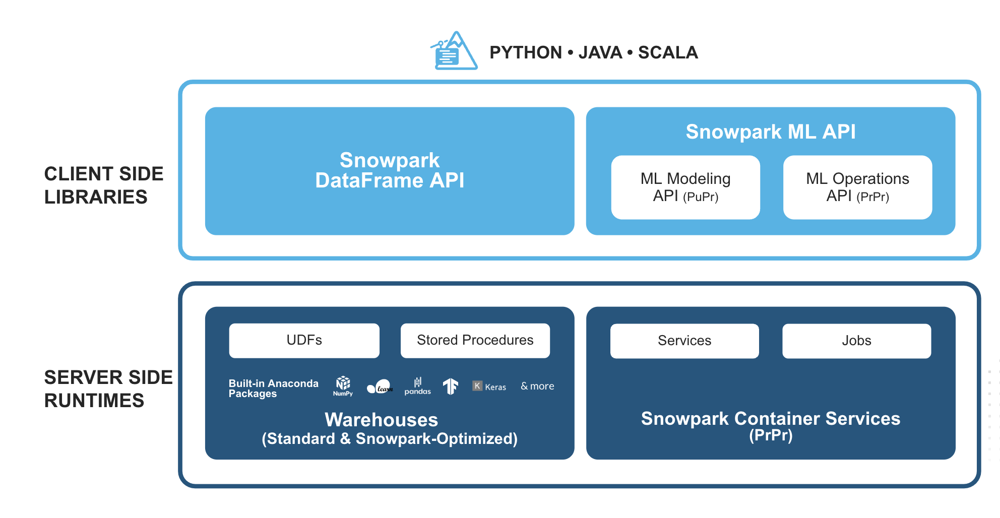
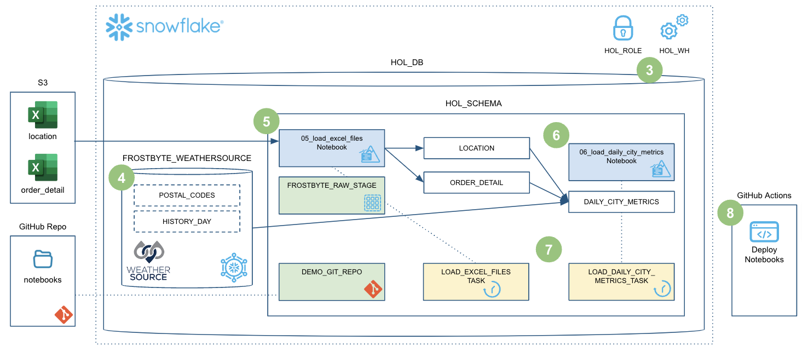
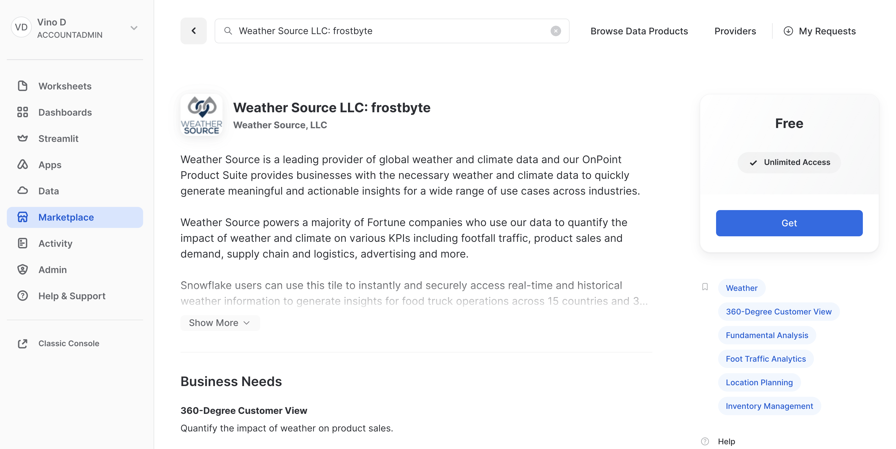
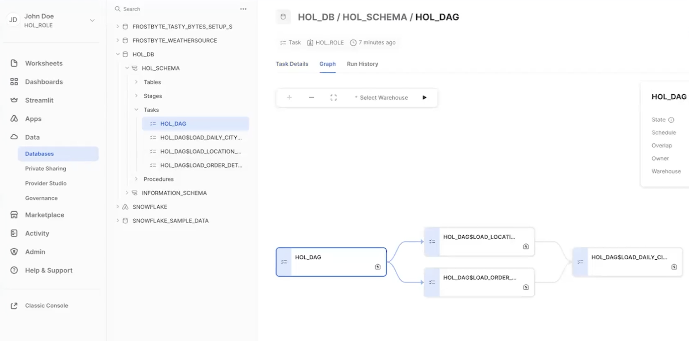
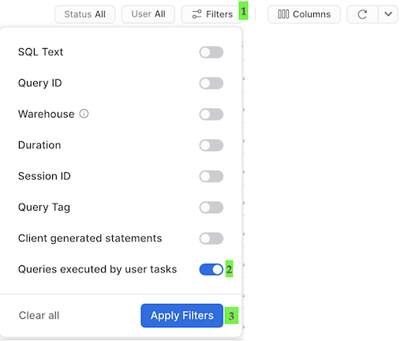

author: Vino Duraisamy
id: data_engineering_with_snowpark_python_intro
summary: This guide will provide step-by-step details for building data engineering pipelines with Snowpark Python
categories: Getting-Started, featured, data-engineering
environments: web
status: Hidden 
feedback link: https://github.com/Snowflake-Labs/sfguides/issues
tags: Getting Started, Data Engineering, Snowpark, Python, Intro

# Intro to Data Engineering with Snowpark Python
<!-- ------------------------ -->
## Overview

Duration: 15

This Quickstart will cover the basics of data engineering with Snowpark for Python. By completing this guide, you will be able to build a data pipeline to process data from different sources, and periodically run the pipeline to update your data tables in Snowflake.

Here is a summary of what you will be able to learn in each step by following this quickstart:

- **Setup Environment**: Use stages and tables to ingest and organize raw data from S3 into Snowflake
- **Snowflake Marketplace**: Download the data you need from Snowflake Marketplace and use it for your analysis
- **Data Engineering**: Leverage Snowpark for Python DataFrames to perform data transformations such as group by, aggregate, and join to prep for the data for downstream applications
- **Orchestrating Pipelines**: Use Snowflake Python Tasks API to turn your data pipeline code into operational pipelines with integrated monitoring

In case you are new to some of the technologies mentioned above, here is a quick summary with the links to documentation.

### What is Snowpark?

The set of libraries and runtimes in Snowflake that securely deploy and process non-SQL code, including Python, Java and Scala.

**Familiar Client Side Libraries** - Snowpark brings deeply integrated, DataFrame-style programming and OSS compatible APIs to the languages data practitioners like to use. It also includes the Snowpark ML API for more efficient ML modeling and ML operations.

**Flexible Runtime Constructs** - Snowpark provides flexible runtime constructs that allow users to bring in and run custom logic. Developers can seamlessly build data pipelines, ML models, and data applications with User-Defined Functions and Stored Procedures.

Learn more about [Snowpark](https://www.snowflake.com/snowpark/).



### Working with Snowflake Marketplace

Snowflake Marketplace provides visibility to a wide variety of datasets from third-party data stewards which broaden access to data points used to transform business processes. Snowflake Marketplace also removes the need to integrate and model data by providing secure access to data sets fully maintained by the data provider.

### What you will learn

- How to ingest data from an external stage such as an S3 bucket into a Snowflake table
- How to access data from Snowflake Marketplace and use it for your analysis
- How to analyze data and perform data engineering tasks using Snowpark DataFrame API, Python Stored Procedures and more
- How to use open-source Python libraries from curated Snowflake Anaconda channel
- How to create Snowflake Tasks and use the Python Tasks API to schedule data pipelines
- How to use VS Code extension for Snowflake to perform standard snowflake operations from VS Code and Snowsigt UI



### Prerequisites

- Familiarity with Python
- Familiarity with the DataFrame API
- Familiarity with Snowflake
- Familiarity with Git repositories and GitHub

### What You’ll Need

You will need the following things before beginning:

- Snowflake account
  - **A Snowflake Account**
  - **A Snowflake user created with ACCOUNTADMIN permissions**. This user will be used to get things setup in Snowflake.
  - **Anaconda Terms & Conditions accepted**. See Getting Started section in [Third-Party Packages](https://docs.snowflake.com/en/developer-guide/udf/python/udf-python-packages.html#getting-started).
- GitHub account
  - **A GitHub account**. If you don't already have a GitHub account you can create one for free. Visit the [Join GitHub](https://github.com/signup) page to get started.

<!-- ------------------------ -->
## Quickstart Setup

Duration: 10

### Fork the GitHub Repository

The very first step is to fork the GitHub repository [Intro to Data Engineering with Snowpark Python associated GitHub Repository](https://github.com/Snowflake-Labs/sfguide-data-engineering-with-snowpark-python-intro). This repository contains all the code you need to successfully complete this Quickstart guide.  Click on the "Fork" button near the top right. Complete any required fields and click "Create Fork".

### Create GitHub Codespace

For this Quickstart we will be using [GitHub Codespaces](https://docs.github.com/en/codespaces/overview) for our development environment. Codespaces offer a hosted development environment with a hosted, web-based VS Code environment. GitHub currently offers [60 hours for free each month](https://github.com/features/codespaces) when using a 2 node environment, which should be enough to work through this lab.

To create a GitHub Codespace, click on the green `<> Code` button from the GitHub repository homepage. In the Code popup, click on the `Codespaces` tab and then on the green `Create codespace on main`.


This will open a new tab and begin setting up your codespace. It will take a few minutes as it sets up the entire environment for this Quickstart. Here is what is being done for you:

- Creating a container for your environment
- Installing Anaconda (miniconda)
- SnowSQL setup
  - Installing SnowSQL
  - Creating a directory and default config file for SnowSQL
- Anaconda setup
  - Creating the Anaconda environment
  - Installing the Snowpark Python library
- VS Code setup
  - Installing VS Code
  - Installing the Snowflake VS Code extension
- Starting a hosted, web-based VS Code editor

Once the codepsace has been created and started you should see a hosted web-based version of VS Code with your forked repository set up! Just a couple more things and we're ready to start.

### Configure Snowflake Credentials
We will not be directly using [the SnowSQL command line client](https://docs.snowflake.com/en/user-guide/snowsql.html) for this Quickstart, but we will be storing our Snowflake connection details in the SnowSQL config file located at `~/.snowsql/config`. A default config file was created for you during the codespace setup.

The easiest way to edit the default `~/.snowsql/config` file is directly from VS Code in your codespace. Type `Command-P`, type (or paste) `~/.snowsql/config` and hit return. The SnowSQL config file should now be open. You just need to edit the file and replace the `accountname`, `username`, and `password` with your values. Then save and close the file.

**Note:** The SnowCLI tool (and by extension this Quickstart) currently does not work with Key Pair authentication. It simply grabs your username and password details from the shared SnowSQL config file.

### Verify Your Anaconda Environment is Activated

During the codespace setup we created an Anaconda environment named `snowflake-demo`. And when VS Code started up it should have automatically activated the environment in your terminal. You should see something like this in the terminal, and in particular you should see `(snowflake-demo)` before your bash prompt.

<!-- ------------------------ -->
## Setup Snowflake

Duration: 10

### Snowflake Extensions for VS Code

You can run SQL queries and Python APIs against Snowflake in many different ways through the Snowsight UI, SnowCLI, etc. But for this Quickstart we'll be using the Snowflake extension for VS Code. For a brief overview of Snowflake's native extension for VS Code, please check out our [VS Code Marketplace Snowflake extension page](https://marketplace.visualstudio.com/items?itemName=snowflake.snowflake-vsc).

To put this in context, we are on step **#3** in our data flow overview:

---


---

### Create Roles, Databases, Tables, Schema and Stages

You can log into [Snowsight](https://docs.snowflake.com/en/user-guide/ui-snowsight.html#) or VS Code to create all the snowflake objects needed to work through this guide.

For the purpose of this quickstart, we will use VS Code to run the SQL commands and create the Snowflake objects. You can open the sql file `steps/03_setup_snowflake.sql` in VS Code. You can click on the `Execute` option above every SQL command to run each command separately or click on `Execute All` to run all the commands sequentially.

---


---

> aside positive
> IMPORTANT:
>
> - If you use different names for objects created in this section, be sure to update scripts and code in the following sections accordingly.
>
> - For each SQL script block below, select all the statements in the block and execute them top to bottom.

Let's run through the commands individually and understand what each command does.

### Creating Account Level Objects

- In this step, we create the role `HOL_ROLE` and assign this role to `CURRENT_USER()` within Snowflake. This role will have access permissions to create all the Snowflake objects needed for the quickstart. First, grant the `HOL_ROLE` the same permissions as `SYSADMIN` role. Then, grant permissions to run tasks, monitor the execution of tasks and to import privileges on the database to `HOL_ROLE`. 

```sql
SET MY_USER = CURRENT_USER();
CREATE OR REPLACE ROLE HOL_ROLE;
GRANT ROLE HOL_ROLE TO ROLE SYSADMIN;
GRANT ROLE HOL_ROLE TO USER IDENTIFIER($MY_USER);

GRANT EXECUTE TASK ON ACCOUNT TO ROLE HOL_ROLE;
GRANT MONITOR EXECUTION ON ACCOUNT TO ROLE HOL_ROLE;
GRANT IMPORTED PRIVILEGES ON DATABASE SNOWFLAKE TO ROLE HOL_ROLE;
```

- Create a new database `HOL_DB` and assign ownership of the database to `HOL_ROLE`.

```sql
CREATE OR REPLACE DATABASE HOL_DB;
GRANT OWNERSHIP ON DATABASE HOL_DB TO ROLE HOL_ROLE;
```

- Create a new warehouse `HOL_WH` to serve the compute requirements for the quickstart. I have used a XSMALL warehouse, and configured it to auto suspend after 300 seconds (5 mins), and enabled auto resume on it. I have assigned ownership of the warehouse to the `HOL_ROLE` too.

```sql
CREATE OR REPLACE WAREHOUSE HOL_WH WAREHOUSE_SIZE = XSMALL, AUTO_SUSPEND = 300, AUTO_RESUME= TRUE;
GRANT OWNERSHIP ON WAREHOUSE HOL_WH TO ROLE HOL_ROLE;
```

### Creating Database Level Objects

- In this step, we will set the Snowflake scope to `HOL_ROLE`, `HOL_DB` and `HOL_WH` and create the schema and stage.

```sql
CREATE OR REPLACE SCHEMA HOL_SCHEMA;

USE SCHEMA HOL_SCHEMA;
CREATE OR REPLACE STAGE FROSTBYTE_RAW_STAGE
    URL = 's3://sfquickstarts/data-engineering-with-snowpark-python/'
;
```

> aside positive
> IMPORTANT:
>
> - If you use different names for objects created in this section, be sure to update scripts and code in the following sections accordingly.

<!-- ------------------------ -->
## Load Weather

Duration: 5


During this step we will be "loading" the raw weather data to Snowflake. But "loading" is really the wrong word here. Because we're using Snowflake's unique data sharing capability we don't actually need to copy the data to our Snowflake account with a custom ETL process. Instead we can directly access the weather data shared by Weather Source in the Snowflake Marketplace.

To put this in context, we are on step **#4** in our data flow overview:

---


---

### Snowflake Marketplace

Snowflake Marketplace provides visibility to a wide variety of datasets from third-party data stewards which broaden access to data points used to transform business processes. Snowflake Marketplace also removes the need to integrate and model data by providing secure access to data sets fully maintained by the data provider.

But what about data that needs constant updating - like the WEATHER data? We would need to build a pipeline process to constantly update that data to keep it fresh. Perhaps a better way to get this external data would be to source it from a trusted data supplier. Let them manage the data, keeping it accurate and up to date.

### Weather data from Snowflake Marketplace

Weather Source is a leading provider of global weather and climate data and their OnPoint Product Suite provides businesses with the necessary weather and climate data to quickly generate meaningful and actionable insights for a wide range of use cases across industries. Let's connect to the `Weather Source LLC: frostbyte` feed from Weather Source in the Snowflake Marketplace by following these steps:

- Login to Snowsight
- Click on the `Marketplace` link in the left navigation bar
- Enter "Weather Source LLC: frostbyte" in the search box and click return
- Click on the "Weather Source LLC: frostbyte" listing tile
- Click the blue "Get" button
  - Expand the "Options" dialog
  - Change the "Database name" to read "FROSTBYTE_WEATHERSOURCE" (all capital letters)
  - Select the "HOL_ROLE" role to have access to the new database
- Click on the blue "Get" button

---



---

That's it... we don't have to do anything from here to keep this data updated. The provider will do that for us and data sharing means we are always seeing whatever they have published. How amazing is that? Just think of all the things you didn't have to do here to get access to an always up-to-date, third-party dataset!

### Query the Weather data

Open the `steps/04_load_weather.sql` script in VS Code from the file Explorer in the left navigation bar, and select `Execute All` from the top right corner. Notice how easy it is to query data shared through the Snowflake Marketplace! You access it just like any other table or view in Snowflake:

```sql
SELECT * FROM FROSTBYTE_WEATHERSOURCE.ONPOINT_ID.POSTAL_CODES LIMIT 100;
```

You can also view the shared database `FROSTBYTE_WEATHERSOURCE.ONPOINT_ID.POSTAL_CODE` by navigating to the Snowsight UI -> Data -> Databases.  

> aside positive
> IMPORTANT:
>
> - If you used a different name for the database while getting weather data from the marketplace, be sure to update scripts and code in the following sections accordingly.

<!-- ------------------------ -->
## Load Location and Order Detail

Duration: 10

During this step we will be "loading" the raw excel files containing location and order details data from an external stage (s3 bucket) to Snowflake using the Dynamic File Access feature. If you would like to peek at the raw excel files, you can check out the `data` folder in the [Git repo](https://github.com/Snowflake-Labs/sfguide-data-engineering-with-snowpark-python-intro/tree/main/data). We use a Python stored procedure to load this data from an S3 bucket into a Snowflake table.

In this step, we will run through the commands in the SQL file `steps/05_load_excel_files.sql`. You can open the sql file `steps/05_load_excel_files.sql` in VS Code. You can click on the `Execute` option above every SQL command to run each command separately or click on `Execute All` to run all the commands sequentially.

To put this in context, we are on step **#5** in our data flow overview:

---


---

### Dynamic File Access

You can read a file from an internal or external stage using the `SnowflakeFile` class in the Snowpark `snowflake.snowpark.files` module. The `SnowflakeFile` class provides dynamic file access, which lets you stream files of any size.

### Loading Excel files from an External Stage

In this quickstart, we will use dynamic file access to load the excel files from an s3 bucket (an external stage we created before `FROSTBYTE_RAW_STAGE`).

First let's check if the two excel files are present in the S3 bucket by calling `LIST` on the stage.

```sql
LIST @FROSTBYTE_RAW_STAGE/intro;
```

### Creating the Stored Procedure to load Excel files

During this step we will be creating our first Snowpark Python stored procedure (or SPROC) to Snowflake. This SPROC `LOAD_EXCEL_WORKSHEET_TO_TABLE_SP` will load the excel data files into snowflake tables for further analysis.

Below is the SQL query to create the SPROC:

- We use the python runtime 3.10 for the SPROC
- We use the python packages `snowflake-snowpark-python`, `pandas` and `openpyxl` to load excel files
- Then import `snowflake.snowpark.files.SnowflakeFile` for the dynamic file access to load file from an external stage
- We use `Snowflake.open()` to open the excel file, read the contents of the file into a pandas DataFrame, and save the DataFrame as a Snowflake table using `save_as_table()` API.

```sql
CREATE OR REPLACE PROCEDURE LOAD_EXCEL_WORKSHEET_TO_TABLE_SP(file_path string, worksheet_name string, target_table string)
RETURNS VARIANT
LANGUAGE PYTHON
RUNTIME_VERSION = '3.10'
PACKAGES = ('snowflake-snowpark-python', 'pandas', 'openpyxl')
HANDLER = 'main'
AS
$$
from snowflake.snowpark.files import SnowflakeFile
from openpyxl import load_workbook
import pandas as pd
 
def main(session, file_path, worksheet_name, target_table):
 with SnowflakeFile.open(file_path, 'rb') as f:
     workbook = load_workbook(f)
     sheet = workbook.get_sheet_by_name(worksheet_name)
     data = sheet.values
 
     # Get the first line in file as a header line
     columns = next(data)[0:]
     # Create a DataFrame based on the second and subsequent lines of data
     df = pd.DataFrame(data, columns=columns)
 
     df2 = session.create_dataframe(df)
     df2.write.mode("overwrite").save_as_table(target_table)
 
 return True
$$;
```

### Running the Sproc in Snowflake

In the above step, we only created the Stored procedure. However, we need to invoke `CALL` on the SPROC to actually load the excel files into a Snowflake target table.

To load `ORDER_DETAIL.xlsx` file, you can run the following SQL command in the SQL file `steps/05_load_excel_files.sql` from VS Code.

```sql
CALL LOAD_EXCEL_WORKSHEET_TO_TABLE_SP(BUILD_SCOPED_FILE_URL(@FROSTBYTE_RAW_STAGE, 'intro/order_detail.xlsx'), 'order_detail', 'ORDER_DETAIL');
```

To laod the `LOCATION.xlsx` file, you can run the following SQL command in the SQL file `steps/05_load_excel_files.sql` from VS Code.

```sql
CALL LOAD_EXCEL_WORKSHEET_TO_TABLE_SP(BUILD_SCOPED_FILE_URL(@FROSTBYTE_RAW_STAGE, 'intro/location.xlsx'), 'location', 'LOCATION');
```

Next up, to verify if the excel files are loaded successfully into respective Snowflake tables, you can run the following `DESC` and `SELECT` statements from VS Code.

```sql
DESCRIBE TABLE ORDER_DETAIL;
SELECT * FROM ORDER_DETAIL;

DESCRIBE TABLE LOCATION;
SELECT * FROM LOCATION;
```

Fantastic. We now have all the raw data needed to build our data pipeline and further analyze them.

<!-- ------------------------ -->

## Daily City Metrics Update Sproc

Duration: 10

During this step we will be creating our second Snowpark Python sproc to Snowflake. This sproc will join the `ORDER_DETAIL` table with the `LOCATION` table and `HISTORY_DAY` table to create a final, aggregated table for analysis named `DAILY_CITY_METRICS`.

In this step, we will run through the commands in the SQL file `steps/06_load_daily_city_metrics.sql`. You can open the sql file `steps/06_load_daily_city_metrics.sql` in VS Code. You can click on the `Execute` option above every SQL command to run each command separately or click on `Execute All` to run all the commands sequentially.

To put this in context, we are on step **#6** in our data flow overview:

---


---

### Creating Sproc to Calculate Daily City Metrics

Below is the SQL query to create the SPROC:

- We use the python runtime 3.10 for the SPROC, and use the python package `snowflake-snowpark-python`
- First part of the Sproc contains `table_exists()` function which we use to verify if the raw tables exist in the defined database and schema.
- Second part of the Sproc contains the  `main()` function that reads the raw tables `ORDER_DETAIL`, `LOCATION`, and `FROSTBYTE_WEATHERSOURCE.ONPOINT_ID.HISTORY_DAY`. Remember the Frostbyte Weather Source data is from Snowflake Marketplace but we can use it like any other standard snowflake table.
- After loading all 3 raw tables into their respective Snowpark Python Dataframes, we prepare to join the Dataframes.
- We join all three Dataframes into a final DataFrame `order_detail`. 
- Next step is data aggregation based on date, country and city. So we use group_by() on `DATE_VALID_STD`, `ISO_COUNTRY_CODE` and `CITY_NAME` columns.
- After grouping by these 3 columns, we calculate the aggregate daily sales, daily average temperature in Farenheit, and daily average precipitation in inches.
- The resulting DataFrame called `final_agg` is saved. If the table `DAILY_CITY_METRICS` does not exist, we create a table and save the `final_agg` DataFrame as a table. If the table already exists, we append it to the existing table using Snowpark `merge()` function. 

```sql
CREATE OR REPLACE PROCEDURE LOAD_DAILY_CITY_METRICS_SP()
RETURNS VARIANT
LANGUAGE PYTHON
RUNTIME_VERSION = '3.10'
PACKAGES = ('snowflake-snowpark-python')
HANDLER = 'main'
AS
$$
from snowflake.snowpark import Session
import snowflake.snowpark.functions as F

def table_exists(session, schema='', name=''):
    exists = session.sql("SELECT EXISTS (SELECT * FROM INFORMATION_SCHEMA.TABLES WHERE TABLE_SCHEMA = '{}' AND TABLE_NAME = '{}') AS TABLE_EXISTS".format(schema, name)).collect()[0]['TABLE_EXISTS']
    return exists

def main(session: Session) -> str:
    schema_name = "HOL_SCHEMA"
    table_name = "DAILY_CITY_METRICS"

    # Define the tables
    order_detail = session.table("ORDER_DETAIL")
    history_day = session.table("FROSTBYTE_WEATHERSOURCE.ONPOINT_ID.HISTORY_DAY")
    location = session.table("LOCATION")

    # Join the tables
    order_detail = order_detail.join(location, order_detail['LOCATION_ID'] == location['LOCATION_ID'])
    order_detail = order_detail.join(history_day, (F.builtin("DATE")(order_detail['ORDER_TS']) == history_day['DATE_VALID_STD']) & (location['ISO_COUNTRY_CODE'] == history_day['COUNTRY']) & (location['CITY'] == history_day['CITY_NAME']))

    # Aggregate the data
    final_agg = order_detail.group_by(F.col('DATE_VALID_STD'), F.col('CITY_NAME'), F.col('ISO_COUNTRY_CODE')) \
                        .agg( \
                            F.sum('PRICE').alias('DAILY_SALES_SUM'), \
                            F.avg('AVG_TEMPERATURE_AIR_2M_F').alias("AVG_TEMPERATURE_F"), \
                            F.avg("TOT_PRECIPITATION_IN").alias("AVG_PRECIPITATION_IN"), \
                        ) \
                        .select(F.col("DATE_VALID_STD").alias("DATE"), F.col("CITY_NAME"), F.col("ISO_COUNTRY_CODE").alias("COUNTRY_DESC"), \
                            F.builtin("ZEROIFNULL")(F.col("DAILY_SALES_SUM")).alias("DAILY_SALES"), \
                            F.round(F.col("AVG_TEMPERATURE_F"), 2).alias("AVG_TEMPERATURE_FAHRENHEIT"), \
                            F.round(F.col("AVG_PRECIPITATION_IN"), 2).alias("AVG_PRECIPITATION_INCHES"), \
                        )

    # If the table doesn't exist then create it
    if not table_exists(session, schema=schema_name, name=table_name):
        final_agg.write.mode("overwrite").save_as_table(table_name)

        return f"Successfully created {table_name}"
    # Otherwise update it
    else:
        cols_to_update = {c: final_agg[c] for c in final_agg.schema.names}

        dcm = session.table(f"{schema_name}.{table_name}")
        dcm.merge(final_agg, (dcm['DATE'] == final_agg['DATE']) & (dcm['CITY_NAME'] == final_agg['CITY_NAME']) & (dcm['COUNTRY_DESC'] == final_agg['COUNTRY_DESC']), \
                            [F.when_matched().update(cols_to_update), F.when_not_matched().insert(cols_to_update)])

        return f"Successfully updated {table_name}"
$$;
```

### Running the Sproc

In the above step, we only created a Stored procedure. However, we need to invoke `CALL` on the SPROC to actually perform those aggregations and calculations.

To calculate `final_agg` and update the `DAILY_CITY_METRICS` table, you can run the following SQL command in the SQL file `steps/06_load_daily_city_metrics.sql` from VS Code.

```sql
CALL LOAD_DAILY_CITY_METRICS_SP();
```

You can also simply run the entire script from Snowsight UI or VS Code. Execute the `steps/06_load_daily_city_metrics.sql` script by selecting Execute All from VS Code.

### Viewing What Happened in Snowflake

The [Query History](https://docs.snowflake.com/en/user-guide/ui-snowsight-activity.html#query-history) in Snowflake is a very powerful feature, that logs every query run against your Snowflake account, no matter which tool or process initiated it. And this is especially helpful when working with client tools and APIs.

The stored procedure we invoked in the previous step `LOAD_DAILY_CITY_METRICS_SP` would be logged in the Query History tab in the Snowsight UI.

### More on the Snowpark API

In this step we're starting to really use the Snowpark DataFrame API for data transformations. The Snowpark API provides the same functionality as the [Spark SQL API](https://spark.apache.org/docs/latest/api/python/reference/pyspark.sql/index.html). To begin with you need to create a Snowpark session object. Like PySpark, this is accomplished with the `Session.builder.configs().create()` methods.

When building a Snowpark Python sproc the contract is that the first argument to the entry point (or handler) function is a Snowpark session.

The first thing you'll notice in the `steps/06_load_daily_city_metrics.sql` script is that we have some functions which use SQL to create objects in Snowflake and to check object status. To issue a SQL statement to Snowflake with the Snowpark API you use the `session.sql()` function, like you'd expect. Here's one example:

```python
def table_exists(session, schema='', name=''):
    exists = session.sql("SELECT EXISTS (SELECT * FROM INFORMATION_SCHEMA.TABLES WHERE TABLE_SCHEMA = '{}' AND TABLE_NAME = '{}') AS TABLE_EXISTS".format(schema, name)).collect()[0]['TABLE_EXISTS']
    return exists
```

The second thing to point out is how we're using DataFrames to join the data from different data sources into an `ORDER_DETAIL` df using the `join()` API.

```python
order_detail = order_detail.join(location, order_detail['LOCATION_ID'] == location['LOCATION_ID'])
    order_detail = order_detail.join(history_day, (F.builtin("DATE")(order_detail['ORDER_TS']) == history_day['DATE_VALID_STD']) & (location['ISO_COUNTRY_CODE'] == history_day['COUNTRY']) & (location['CITY'] == history_day['CITY_NAME']))
```

The last thing to point out is how we are using the Snowpark Python Dataframe APIs to aggregate DataFrames using APIs such as `agg()`, `group_by()`, and `select()`.

```python
final_agg = order_detail.group_by(F.col('DATE_VALID_STD'), F.col('CITY_NAME'), F.col('ISO_COUNTRY_CODE')) \
                        .agg( \
                            F.sum('PRICE').alias('DAILY_SALES_SUM'), \
                            F.avg('AVG_TEMPERATURE_AIR_2M_F').alias("AVG_TEMPERATURE_F"), \
                            F.avg("TOT_PRECIPITATION_IN").alias("AVG_PRECIPITATION_IN"), \
                        ) \
                        .select(F.col("DATE_VALID_STD").alias("DATE"), F.col("CITY_NAME"), F.col("ISO_COUNTRY_CODE").alias("COUNTRY_DESC"), \
                            F.builtin("ZEROIFNULL")(F.col("DAILY_SALES_SUM")).alias("DAILY_SALES"), \
                            F.round(F.col("AVG_TEMPERATURE_F"), 2).alias("AVG_TEMPERATURE_FAHRENHEIT"), \
                            F.round(F.col("AVG_PRECIPITATION_IN"), 2).alias("AVG_PRECIPITATION_INCHES"), \
                        )
```

Again, for more details about the Snowpark Python DataFrame API, please check out our [Working with Dataframe in Snowpark Python](https://docs.snowflake.com/en/developer-guide/snowpark/python/working-with-dataframes.html) page.

<!-- ------------------------ -->

## Orchestrate Jobs

Duration: 10

During this step we will be orchestrating our new Snowpark pipelines with Snowflake's native orchestration feature named Tasks. You can create and deploy Snowflake Task objects using SQL as well as Python Task APIs. For the scope of this quickstart, we will use Snowflake Python Task APIs to create and run Tasks.

In this step, we will create two tasks, one for each stored procedure, and chain them together. We will then deploy or run the tasks to operationalize the data pipeline.

In this step, we will run through the commands in the Python file `steps/07_deploy_task_dag.py` from VS Code. To execute the file, you can open the terminal in VS Code and run `python steps/07_deploy_task_dag.py`.

To put this in context, we are on step **#7** in our data flow overview:

---


---

### Exploring the different terminologies associated with Snowflake Tasks

- **Tasks**: Task is a basic, smallest unit of execution. A task can execute a single SQL statement, a call to a stored procedure, or any procedural logic using [Snowflake Scripting](https://docs.snowflake.com/en/developer-guide/snowflake-scripting/index). One or more tasks make up a Dag.  A root task is a special type of task which is the first task in a dag with no parent tasks before it.
- **Dags**: A Directed Acyclic Graph (DAG) is a series of tasks composed of a single root task and additional tasks, organized by their dependencies. DAGs flow in a single direction, meaning a task runs only after all of its predecessor tasks have run successfully to completion.
- **Schedule Interval**: Schedule interval refers to the interval of time between successive scheduled executions of a standalone task or the root task in a DAG.
- **Deploying a Dag**: When you create a dag, you define the schedule interval, transformation logic in the tasks and task dependencies. However, you need to deploy a dag to actually run those transformations on the schedule. If you don't deploy the dag, the dag will not run on the schedule.
- **Running a dag**: When a dag is deployed, it is run on the defined schedule. Each instance of this scheduled run is called a Task Run.

### Creating Tasks, and DAGs

Let us create a dag and configure the schedule and transformations we want to run as part of the dag.

In this example, we have two tasks `dag_task1`, `dag_task2` and `dag_task3` as part of `HOL_DAG`. The dag is scheduled daily.

- `dag_task1` loads the  `order_detail` data by calling the stored procedure `LOAD_EXCEL_WORKSHEET_TO_TABLE_SP`.
- `dag_task2` loads the `location` data by calling the stored procedure `LOAD_EXCEL_WORKSHEET_TO_TABLE_SP`.
- `dag_task3` updates the `DAILY_CITY_METRICS` table in snowflake by calling the stored procedure `LOAD_DAILY_CITY_METRICS_SP`.

Here is the code snippet for dag and task creation:

```python
dag_name = "HOL_DAG"
    dag = DAG(dag_name, schedule=timedelta(days=1), warehouse=warehouse_name)
    with dag:
        dag_task1 = DAGTask("LOAD_ORDER_DETAIL_TASK", definition="CALL LOAD_EXCEL_WORKSHEET_TO_TABLE_SP(BUILD_SCOPED_FILE_URL(@FROSTBYTE_RAW_STAGE, 'intro/order_detail.xlsx'), 'order_detail', 'ORDER_DETAIL')", warehouse=warehouse_name)
        dag_task2 = DAGTask("LOAD_LOCATION_TASK", definition="CALL LOAD_EXCEL_WORKSHEET_TO_TABLE_SP(BUILD_SCOPED_FILE_URL(@FROSTBYTE_RAW_STAGE, 'intro/location.xlsx'), 'location', 'LOCATION')", warehouse=warehouse_name)
        dag_task3 = DAGTask("LOAD_DAILY_CITY_METRICS_TASK", definition="CALL LOAD_DAILY_CITY_METRICS_SP()", warehouse=warehouse_name)

```

Great, we have the tasks and the dag created. But how do we define the task dependencies? Which tasks should run first?

If you are familiar with Apache Airflow, you might know how we can use `>>` operator to define task dependency. If not, let's understand the flow.

Here is how we define the order of execution of the tasks in our dag:

```python
dag_task3 >> dag_task1
dag_task3 >> dag_task2
```

The above definition `dag_task3 >> dag_task1` means that `dag_task3` is dependant on `dag_task1`.

Similarly, `dag_task3 >> dag_task2` means that `dag_task3` is dependant on `dag_task2`.

### Deploying the DAG

So far, we have only created the dag and defined the order of execution of tasks within the dag. To enable the dag to run on the defined schedule, we have to `deploy()` it first.

```python
dag_op.deploy(dag, mode="orreplace")
```

After we deploy the dag, the tasks in the dag will run periodically as per the schedule interval in the dag definition.

### Running a DAG

In addition to running the dags periodically, suppose if you need to run the dag on demand for debugging or troubleshooting, you can use the `run()` function.

```python
dag_op.run(dag)
```

And for more details on Tasks see [Introduction to Tasks](https://docs.snowflake.com/en/user-guide/tasks-intro.html).


### Task Metadata

Snowflake keeps metadata for almost everything you do, and makes that metadata available for you to query (and to create any type of process around). Tasks are no different. Snowflake maintains rich metadata to help you monitor your task runs. Here are a few sample SQL queries you can use to monitor your tasks runs:

```sql
-- Get a list of tasks
SHOW TASKS;

-- Task execution history in the past day
SELECT *
FROM TABLE(INFORMATION_SCHEMA.TASK_HISTORY(
    SCHEDULED_TIME_RANGE_START=>DATEADD('DAY',-1,CURRENT_TIMESTAMP()),
    RESULT_LIMIT => 100))
ORDER BY SCHEDULED_TIME DESC
;

-- Scheduled task runs
SELECT
    TIMESTAMPDIFF(SECOND, CURRENT_TIMESTAMP, SCHEDULED_TIME) NEXT_RUN,
    SCHEDULED_TIME,
    NAME,
    STATE
FROM TABLE(INFORMATION_SCHEMA.TASK_HISTORY())
WHERE STATE = 'SCHEDULED'
ORDER BY COMPLETED_TIME DESC;
```

### Monitoring Tasks

Now, after your dag is deployed, all the tasks in your dag will be running as per the defined schedule. However, as a Snowflake user, how can you peek into the success and failure of each run, look at the task run time, and more?

Snowflake provides some rich task observability features in the Snowsight UI. Try it out for yourself by following these steps:

- In the Snowsight navigation menu, click **Data** » **Databases**.
- In the right pane, using the object explorer, navigate to a database and schema.
- For the selected schema, select and expand **Tasks**.
- Select a task. Task information is displayed, including **Task Details**, **Graph**, and **Run History** sub-tabs.
- Select the **Graph** tab. The task graph appears, displaying a hierarchy of child tasks.
- Select a task to view its details.



To monitor all the tasks at an account level, you can use the Task History tab as well.

- In the Snowsight navigation menu, click **Activity** » **Task History**.
- In the right pane, select the **Task Runs** tab. You can scroll through all the task runs in the account.


For more details, and to learn about viewing account level task history, please check out our [Viewing Task History](https://docs.snowflake.com/en/user-guide/ui-snowsight-tasks.html) documentation.

### Query History for Tasks

One important thing to understand about tasks, is that the queries which get executed by the task won't show up with the default Query History UI settings. In order to see the queries that just ran you need to do the following:

- Remove filters at the top of this table, including your username, as later scheduled tasks will run as "System":


- Click "Filter", and add filter option 'Queries executed by user tasks' and click "Apply Filters":



You should now see all the queries run by your tasks! 

<!-- ------------------------ -->
## Teardown

Duration: 2

Once you're finished with the Quickstart and want to clean things up, you can simply run the `steps/09_teardown.sql`. Since this is a SQL script we will be using our native VS Code extension to execute it. So simply open the `steps/09_teardown.sql` script in VS Code and run the whole thing using the "Execute All Statements" button in the upper right corner of the editor window.

<!-- ------------------------ -->

## Conclusion and Resources

Duration: 2

Congratulations! You have successfully built a data engineering pipeline using Snowpark Python, loaded data from an external stage using Snowflake Dynamic File Access, used data from Snowflake Marketplace and orchestrated the data pipeline using Snowflake Tasks as well.

We would love your feedback on this QuickStart Guide! Please submit your feedback using this [Feedback Form](https://forms.gle/M7C8EC3sYKide1ro9).

### What You Learned

Here is the overview of what we built:

- How to ingest data from an external stage such as an S3 bucket into a Snowflake table
- How to access data from Snowflake Marketplace and use it for your analysis
- How to analyze data and perform data engineering tasks using Snowpark DataFrame API, Python Stored Procedures and more
- How to use open-source Python libraries from curated Snowflake Anaconda channel
- How to create Snowflake Tasks and use the Python Tasks API to schedule data pipelines
- How to use VS Code extension for Snowflake to perform standard snowflake operations from VS Code and Snowsigt UI

---


---

### Related Resources

- [Source Code on GitHub](https://github.com/Snowflake-Labs/sfguide-data-engineering-with-snowpark-python-intro)
- [Advanced: Data Engineering Pipelines with Snowpark Python](https://quickstarts.snowflake.com/guide/data_engineering_pipelines_with_snowpark_python)
- [Advanced: Getting Started with Data Engineering and ML using Snowpark for Python](https://quickstarts.snowflake.com/guide/getting_started_with_dataengineering_ml_using_snowpark_python)
- [Snowpark for Python Developer Guide](https://docs.snowflake.com/en/developer-guide/snowpark/python/index.html)
  - [Writing Stored Procedures in Snowpark (Python)](https://docs.snowflake.com/en/sql-reference/stored-procedures-python.html)
  - [Working with DataFrame in Snowpark Python](https://docs.snowflake.com/en/developer-guide/snowpark/python/working-with-dataframes.html)
  - [Snowflake Visual Studio Code Extension](https://marketplace.visualstudio.com/items?itemName=snowflake.snowflake-vsc)