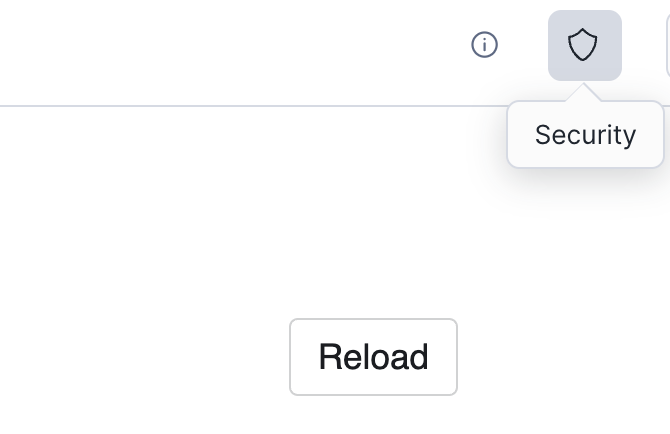

author: Allan Mitchell
id: data_mapping_in_native_apps
summary: This guide will provide step-by-step details for building a data mapping requirement in Snowflake Native Apps and Streamlit
categories: Getting-Started, featured, data-engineering, Native-App, Streamlit
environments: web
status: draft
feedback link: https://github.com/Snowflake-Labs/sfguides/issues
tags: Getting Started, Data Engineering, Native App, Streamlit, Python

# Data Mapping in Snowflake Native Apps using Streamlit
<!-- ------------------------ -->
## Overview
Duration: 5

The Snowflake Native App Framework is a fantastic way for Snowflake application providers to distribute proprietary functionality to their customers, partners and to the wider Snowflake Marketplace. As a provider you can be assured that your code and data (if included) is secure and that the consumers of your application can take advantage of the functionality but not see the details of the implementation. As a consumer of an application you can be assured that the provider via the application is not able to see or operate on any data in your account unless you explicitly allow them access.

> aside negative
> 
> **Note** - As of 23/10/2023, the [Snowflake Native App Framework](https://docs.snowflake.com/en/developer-guide/native-apps/native-apps-about) is in public preview in all non-government AWS regions.

### Prerequisites

* A basic understanding of Snowflake Native Applications
* An introductory level of coding in Python
* A basic knowledge of Snowflake
* Snowflake CLI installed and configured

### What You'll Learn

* The basic building blocks of a Snowflake Native Application
* Assigning Permissions to your Snowflake Native Application
* Allowing configuration of  your Snowflake native Application through a Streamlit UI

### What You'll need

* A Snowflake account in AWS
* A Snowflake user created with ACCOUNTADMIN permissions - this is more than is strictly necessary and you can read more about the permissions required [here](https://docs.snowflake.com/en/sql-reference/sql/create-application-package#access-control-requirements)


### The Scenario
The scenario is as follows. You are a Snowflake Native Application provider. Your application requires the consumer of the application to pass in a column in a table that contains an IP address and you will write out enhanced data for that particular IP address to another column in the same consumer defined table.

The scenario presents some challenges to me as the provider

* You need Read and Write access to a table in the consumer account
* You have no idea what the name of the IP address attribute will be
* You have no idea where the consumer will want me to write out the data

Requesting read and write access to a table in the consumer account is easy because my application can simply tell the consumer I require Read/Write access to a table and the consumer can grant access. The next two points are slightly more tricky. We have the ability within the Snowflake Native App Framework to gain access to a table which the application consumer will specify. Every consumer of the application will most likely have differently named attributes as well. In testing an application's functionality locally you know the names of the columns and life is good. Let’s see two ways in which you could solve this problem with Snowflake Native Apps.  There are others but here we want to just call out two for now.

#### Solution 1:  Make the consumer do the work

In the readme file for the application you could distribute instructions for the consumer to make sure they have a table called T that contains columns labeled C_INPUT and C_OUTPUT.  The application consumer could enable this by providing a view over the top of an existing table to the application.  Whilst this will work, we don’t necessarily want new objects to be created in Snowflake databases simply to serve the purpose of our application.

#### Solution 2: Provide an intuitive UI in the application

The application provides a user interface which allows the consumer of the application to map columns in an existing table/view to the requirements of the application. This is much more user friendly and doesn’t require new objects to be created in a Snowflake database.

The first solution is not really what we want to be doing because the consumer will potentially have to create objects on their Snowflake instance just to satisfy the application's requirements, so this Quickstart will deliver the second solution.

> aside positive
> 
> **Note** - The following steps explain how to create the app using the Snowflake CLI, as this option presents as a faster, more straightforward way to build Native Apps. You can also accomplish it by manually creating the folder structure and executing the SQL commands in Snowsight, but this alternative is out of the scope for this Quickstart.

The files explained in the following steps, are already present in the project folder, and it is merely a deeper explanation of its contents.


<!-- ------------------------ -->
## Snowflake CLI First Steps
Duration: 7

The datamapping native app project resides in a Snowflake repository which contains several app examples for the user to learn its way into Snowflake Native Apps.

The instructions on cloning the project repository and its execution are given in the readme file of this github [link NEEDS UPDATE AFTER PR](https://github.com/snowflakedb/native-apps-examples).

### Clone instructions 

1. Clone the project repo in your local machine. Repo could be cloned running:
    ```sh
    snow app init --template-repo git@github.com:snowflakedb/native-apps-examples.git --template datamapping-app
    ```
2. Replace the CSV filepath inside the **prepare_data.sh** file, line 28, like this:  
    ```sh
    snow object stage copy /USER_PATH_HERE/IP2LOCATION-LITE-DB11.CSV @location_data_stage --database ip2location --schema ip2location
    ```

<!-- ------------------------ -->
## Building the Application
Duration: 7

The application itself is a simple one and has been broken down into three parts.

* The building of the application package on the provider and the sharing of the lookup database with the application. 
* The building of the application install script which contains the functionality to accept an IP address, look it up in the database we just shared with the application and write back enhanced data from the application. 
* Arguably (certainly for this Quickstart) the most important part which is the user interface written using Streamlit. This is where we will do the mappings.

To do the enhancement of the IP addresses we will use a dataset called DB11 from [IP2LOCATION](https://www.ip2location.com/database/ip2location). There is a free version of this database available [here](https://lite.ip2location.com/database/db11-ip-country-region-city-latitude-longitude-zipcode-timezone), which is the one we will use in this quickstart.  If you do not have an account with them already you will need to create one. Download the dataset as a CSV file so it is ready to import  into the provider account.

The first thing you need to do is create a new database which will serve as the lookup database for the application

> aside positive
> 
> **Note** - This setup SQL commands are managed by the *prepare_data.sh* file found in the repository, to run it simply type:
 `SNOWFLAKE_DEFAULT_CONNECTION_NAME=your_connection ./prepare_data.sh` in the folder root.

```sh
snow sql -q "
CREATE DATABASE IF NOT EXISTS IP2LOCATION;
CREATE SCHEMA IF NOT EXISTS IP2LOCATION;

CREATE TABLE IF NOT EXISTS LITEDB11 (
ip_from INT,
ip_to INT,
country_code char(2),
country_name varchar(64),
region_name varchar(128),
city_name varchar(128),
latitude DOUBLE,
longitude DOUBLE,
zip_code varchar(30),
time_zone varchar(8)
);

--Create a file format for the file
CREATE OR REPLACE FILE FORMAT LOCATION_CSV
SKIP_HEADER = 1
FIELD_OPTIONALLY_ENCLOSED_BY = '\"'
COMPRESSION = AUTO;

--create a stage so we can upload the file
CREATE STAGE LOCATION_DATA_STAGE
file_format = LOCATION_CSV;"

--Go ahead now and upload the file to the stage.  After the file is uploaded go back to
your worksheet and copy the file into the table created earlier

snow object stage copy /USER_PATH_HERE/IP2LOCATION-LITE-DB11.CSV @location_data_stage --database ip2location --schema ip2location 

snow sql -q "copy into litedb11 from @location_data_stage;
SELECT COUNT(*) FROM LITEDB11;SELECT * FROM LITEDB11 LIMIT 10;" --database ip2location --schema ip2location
```

We now have the reference database setup in the provider account so are now ready to start building the application itself.

<!-- ------------------------ -->
## Provider Setup
Duration: 5

> aside positive
> 
> **Note** - The code is here to illustrate how would you normally do the app creation using the manual steps, but this step is executed automatically by the CLI, for example, in a manual environment you will need to update your files to a stage, but that managed by the `snow app run` command.  In the of the following steps there will be instructions on how to execute it.

Here we create another stage, and after that we go ahead and build out our application package

```sql
USE DATABASE IP2LOCATION;
USE SCHEMA IP2LOCATION;
--create the new stage
CREATE STAGE APPLICATION_STAGE;
--create the application package
CREATE APPLICATION PACKAGE IP2LOCATION_APP;
--set context to the application package
USE IP2LOCATION_APP;
--create a schema
CREATE SCHEMA IP2LOCATION;
--Grant the application permissions on the schema we just created
GRANT USAGE ON SCHEMA IP2LOCATION TO SHARE IN APPLICATION PACKAGE IP2LOCATION_APP; 
--grant permissions on the database where our data resides
GRANT REFERENCE_USAGE ON DATABASE IP2LOCATION TO SHARE IN APPLICATION PACKAGE IP2LOCATION_APP;
--we need to create a proxy artefact here referencing the data we want to use
CREATE VIEW IP2LOCATION.LITEDB11
AS
SELECT * FROM IP2LOCATION.IP2LOCATION.LITEDB11;
--grant permissions to the application
GRANT SELECT ON VIEW IP2LOCATION.LITEDB11 TO SHARE IN APPLICATION PACKAGE IP2LOCATION_APP;
```

Fantastic.  we now have an application package with permissions onto the lookup database.  That's the first part of the application completed but we will be adding necessary file to deploy the actual application.

<!-- ------------------------ -->
## The Manifest File
Duration: 3

Every Snowflake Native App is required to have a manifest file.  The manifest file defines any properties of the application as well as the location of the application's setup script.  The manifest file for this application will not use all the possible fetures of the manifest file so you can read more about it [here](https://docs.snowflake.com/en/developer-guide/native-apps/creating-manifest).  The manifest file has three requirements:

* The name of the manifest file must be manifest.yml.
* The manifest file must be uploaded to a named stage so that it is accessible when creating an application package or Snowflake Native App.
* The manifest file must exist at the root of the directory structure on the named stage.

The named stage in this example is the stage with the label **APPLICATION_STAGE** created earlier.  The manifest file looks like this

```yaml
manifest_version: 1
artifacts:
  setup_script: setup_script.sql
  default_streamlit: ui."Dashboard"

references:
  - tabletouse:
      label: "Table that contains data to be keyed"
      description: "Table that has IP address column and a column to write into"
      privileges:
        - SELECT
        - INSERT
        - UPDATE
        - REFERENCES
      object_type: TABLE
      multi_valued: false
      register_callback: config_code.register_single_callback
```

The **artifacts** section details what files will be included in the application and their location relative to the manifest file.  The **references** section is where we define the permissions we require within the consumer account.  This is what we will ask the consumer to grant.  The way it does that is by calling the **register_callback** procedure which we will shortly define in our setup script.

<!-- ------------------------ -->
## The Setup Script
Duration: 10

In a Snowflake Native App, the setup script is used to define what objects will be created when the application is installed on the consumer account.  The location of the file as we have seen is defined in the manifest file.  The setup script is run on initial installation of the application and any subsequent upgrades/patches.

Most setup scripts are called either **setup.sql** or **setup_script.sql** but that is not a hard and fast requirement.  In the setup script you will see that for some objects, the application role is given permissions and some not.  
If the application role is permissioned onto an object then the object will be visible in Snowsight after the application is installed (permissions allowing).
If the application role is not granted permissions onto an object then you will not see the object in Snowsight.  The application itself can still use the objects regardless.

```sql
--create an application role which the consumer can inherit
CREATE APPLICATION ROLE APP_PUBLIC;

--create a schema
CREATE OR ALTER VERSIONED SCHEMA ENRICHIP;
--grant permissions onto the schema to the application role
GRANT USAGE ON SCHEMA ENRICHIP TO APPLICATION ROLE APP_PUBLIC;

--this is an application version of the object shared with the application package
CREATE VIEW ENRICHIP.LITEDB11 AS SELECT * FROM IP2LOCATION.litedb11;

--accepts an IP address and returns a modified version of the IP address 
--the modified version will be used in the lookup
CREATE OR REPLACE SECURE FUNCTION ENRICHIP.ip2long(ip_address varchar(16))
RETURNS string
LANGUAGE JAVASCRIPT
AS
$$
var result = "";
var parts = [];
if (IP_ADDRESS.match(/^\d{1,3}\.\d{1,3}\.\d{1,3}\.\d{1,3}$/)) {
parts = IP_ADDRESS.split('.');
result = (parts[0] * 16777216 +
(parts[1] * 65536) +
(parts[2] * 256) +
(parts[3] * 1));
}
return result;
$$
;

--this function accepts an ip address and 
--converts it using the ip2long function above
--looks up the returned value in the view
--returns the enhanced information as an object
CREATE OR REPLACE SECURE FUNCTION ENRICHIP.ip2data(ip_address varchar(16))
returns object
as
$$
select object_construct('country_code', MAX(COUNTRY_CODE), 'country_name', MAX(COUNTRY_NAME),
'region_name', MAX(REGION_NAME), 'city_name', MAX(CITY_NAME),
'latitude', MAX(LATITUDE), 'longitude', MAX(LONGITUDE),
'zip_code', MAX(ZIP_CODE), 'time_zome', MAX(TIME_ZONE))
from ENRICHIP.LITEDB11 where ip_from <= ENRICHIP.ip2long(ip_address)::int AND ip_to >= ENRICHIP.ip2long(ip_address)::int
$$
;

--create a schema for our callback procedure mentioned in the manifest file
create schema config_code;
--grant the application role permissions onto the schema
grant usage on schema config_code to application role app_public;

--this is the permissions callback we saw in the manifest.yml file
create procedure config_code.register_single_callback(ref_name string, operation string, ref_or_alias string)
    returns string
    language sql
    as $$
        begin
            case (operation)
                when 'ADD' then
                    select system$set_reference(:ref_name, :ref_or_alias);
                when 'REMOVE' then
                    select system$remove_reference(:ref_name);
                when 'CLEAR' then
                    select system$remove_reference(:ref_name);
                else
                    return 'Unknown operation: ' || operation;
            end case;
            system$log('debug', 'register_single_callback: ' || operation || ' succeeded');
            return 'Operation ' || operation || ' succeeded';
        end;
    $$;

--grant the application role permissions to the procedure
grant usage on procedure config_code.register_single_callback(string, string, string) to application role app_public;

--create a schema for the UI (streamlit)
create schema ui;
--grant the application role permissions onto the schema
grant usage on schema ui to application role app_public;

--this is our streamlit.  The application will be looking for 
--file = enricher_dash.py in a folder called ui

--this is the reference to the streamlit (not the streamlit itself)
--this was referenced in the manifest file
create or replace streamlit ui."Dashboard" from 'ui' main_file='enricher_dash.py';

--grant the application role permissions onto the streamlit
grant usage on streamlit ui."Dashboard" TO APPLICATION ROLE APP_PUBLIC;

--this is where the consumer data is read and the enhanced information is written
CREATE OR REPLACE PROCEDURE ENRICHIP.enrich_ip_data(inp_field varchar, out_field varchar)
RETURNS number
AS
$$
    DECLARE 
        q VARCHAR DEFAULT 'UPDATE REFERENCE(''tabletouse'') SET ' || out_field || ' = ENRICHIP.ip2data(' || inp_field || ')';
        result INTEGER DEFAULT 0;
    BEGIN
        EXECUTE IMMEDIATE q;
        RETURN RESULT;
    END;
$$; 

```

> aside positive
> 
> **Note** - In the setup script we defined a stored procedure labeled **ENRICHIP.enrich_ip_data**.  In the body we make calls to **REFERENCE(tabletouse)**.  This reference was defined in the manifest file and it is the table to which the consumer has granted us permissions.  Because, as the application prodcuer, we have no way of knowing that ahead of time, the Snowflake Native App framework adds this facility and will resolve the references once permissions have been granted.

<!-- ------------------------ -->
## Creating the Streamlit
Duration: 5

We now come to arguably the most important part of the application for us which is the user interface.  We have defined all the objects we need to create and also the permissions we will require from the consumer of the application.

A little recap on what this UI needs to achieve:

* Map a field in a table to an ip column
* Map a field in a the same table to receive the enhaced output

Once we have the streamlit UI built we can then finish off the build of the application package.

### Building the User Interface

The code for the streamlit looks like this.  There will be other ways of doing this, but this is one way.

```python
import streamlit as st
import pandas as pd
from snowflake.snowpark.context import get_active_session

# get the active session
session = get_active_session()
# define the things that need mapping
lstMappingItems =  ["IP ADDRESS COLUMN", "RESULT COLUMN"]
# from our consumer table return a list of all the columns
option_source = session.sql("SELECT * FROM REFERENCE('tabletouse') WHERE 1=0").to_pandas().columns.values.tolist()
# create a dictionary to hold the mappings
to_be_mapped= dict()
#create a form to do the mapping visualisation
with st.form("mapping_form"):
    header = st.columns([1])
    #give it a title
    header[0].subheader('Define Mappings')
    # for each mapping requirement add a selectbox
    # populate the choices with the column list from the consumer table
    for i in range(len(lstMappingItems)):
        row = st.columns([1])
        selected_col = row[0].selectbox(label = f'Choose Mapping for {lstMappingItems[i]}',options = option_source)
        # add the mappings to the dictionary
        to_be_mapped[lstMappingItems[i]] = selected_col
        
    row = st.columns(2)
    # submit the mappings
    submit = row[1].form_submit_button('Update Mappings')

# not necessary but useful to see what the mappings look like
st.json(to_be_mapped)

#function call the stored procedure in the application that does the reading and writing
def update_table():
    # build the statement
    statement = ' CALL ENRICHIP.enrich_ip_data(\'' + to_be_mapped["IP ADDRESS COLUMN"] + '\',\'' +  to_be_mapped["RESULT COLUMN"] + '\')'
    #execute the statement
    session.sql(statement).collect()
    #again not necessary but useful for debugging (would the statement work in a worksheet)
    st.write(statement)
#update the consumer table
st.button('UPDATE!', on_click=update_table)
```

### Finishing the Application

All the pieces are in place for our application, wejust created (manifest.yml, setup_script.sql and enricher_dash.py) and now we are going to actually deploy it in the next page, in a manual environment you would have to upload the files to the stage APPLICATION_STAGE and then run other commands from a SQL worksheet, but we are not covering that.  

<!-- ------------------------ -->
## Creating and Deploying the Application
Duration: 2

There are a few ways we could deploy our application:

* Same account / Different account
* Same Org / Different Org
* Debug Mode / non-debug mode


You can either go and manually upload the files into a stage, or as in this tutorial, take the Snowflake CLI approach and run:

```sh
    snow app run -i --database ip2location
```

At the root of the project you cloned, and the CLI is going to create the application for you, using the files explained in the previous steps, as well as the other configuration files present in the project folder.

### Creating example data

In this instance we deployed the application locally so we can see what it looks like wthout having to have another account. Before we look at the application itself.  Because we have installed the application locally we need to create a table to test with.  Let's do that now, in your console execute the following:

```sh
snow sql -q "CREATE DATABASE IF NOT EXISTS TEST_IPLOCATION;                      
CREATE SCHEMA IF NOT EXISTS TEST_IPLOCATION;

CREATE OR REPLACE TABLE TEST_IPLOCATION.TEST_IPLOCATION.TEST_DATA (
        IP VARCHAR(16),
        IP_DATA VARIANT
);

INSERT INTO TEST_DATA(IP) VALUES('73.153.199.206'),('8.8.8.8');"
```

### Viewing the Application

Click on the link to your localhost that appeared in your console output.

 The application if you remember needs permissions onto a table in the consumer account (the one we just created.).  We have now switched roles to being the consumer.  We are finished with being the application provider.  Over on the right hand side hit the shield icon to go to **Security**.



 This will take you through to a page which will allow you to specify the table that you want the application to work with.  This dialog is a result of the **REFERENCE** section in the manifest file.


Click **Add** and navigate to the table we just created and select it:

> aside positive
> 
> **Note** You may at this point be asked to specify a warehouse.   Assigning permissions requires a warehouse.


Once we click **Done** and **Save** then the application has been assigned the needed permissions.  Now go back to apps and click on the app itself.  It should open to a screen like the following:


You should recognise the layout from building the streamlit earlier.  If you drop down either of the two boxes you will see that they are populated with the columns from the table the application has been assigned permissions to.  If we populate the mappings correctly, hit **Update Mappings** then you will see the piece of JSON underneath change to tell us the currently set mappings.  The ones we want for this application are:


Hit the **Update Mappings** button and then the **UPDATE!** button.  At the top of the screen you will see the SQL that you just executed on your data.


Now go back to your console to confirm that enhanced data has been written to your database table.

```sh
snow sql -q " USE DATABASE TEST_IPLOCATION;
USE SCHEMA TEST_IPLOCATION;
SELECT * FROM TEST_DATA;"
```


<!-- ------------------------ -->
## Teardown
Duration: 1

Once you have finished with the application and want to clean up your environment you can execute the following script

```sh
snow sql -q " DROP APPLICATION APPL_MAPPING;
DROP APPLICATION PACKAGE IP2LOCATION_APP;
DROP DATABASE IP2LOCATION;
DROP DATABASE TEST_IPLOCATION;"
```

<!-- ------------------------ -->
## Conclusion
Duration: 1

We have covered a lot of ground in this Quickstart.  We have covered the building blocks of almost every Snowflake Native App you will ever build.  Sure some will be more complicated but the way you structure them will be very similar to what you have covered here.

### What we learned

* Creating an Application Package
* Defining and understand the role of the manifest file
* Creating the Setup script
* Understanding how References work within an application
* How to deploy an application locally
* How to assign permissions to the application
* creating a user interface for an application using Streamlit

### Further Reading

* [Snowflake Native App Developer Toolkit](https://www.snowflake.com/snowflake-native-app-developer-toolkit/?utm_cta=na-us-en-eb-native-app-quickstart)
* [Tutorial: Developing an Application with the Native Apps Framework](https://docs.snowflake.com/en/developer-guide/native-apps/tutorials/getting-started-tutorial)
* [Getting Started with Snowflake Native Apps](https://quickstarts.snowflake.com/guide/getting_started_with_native_apps/#0)
* [Build a Snowflake Native App to Analyze Chairlift Sensor Data](https://quickstarts.snowflake.com/guide/native-app-chairlift/#0)
* [About the Snowflake Native App Framework](https://docs.snowflake.com/en/developer-guide/native-apps/native-apps-about)
