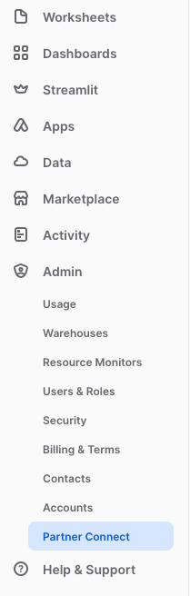
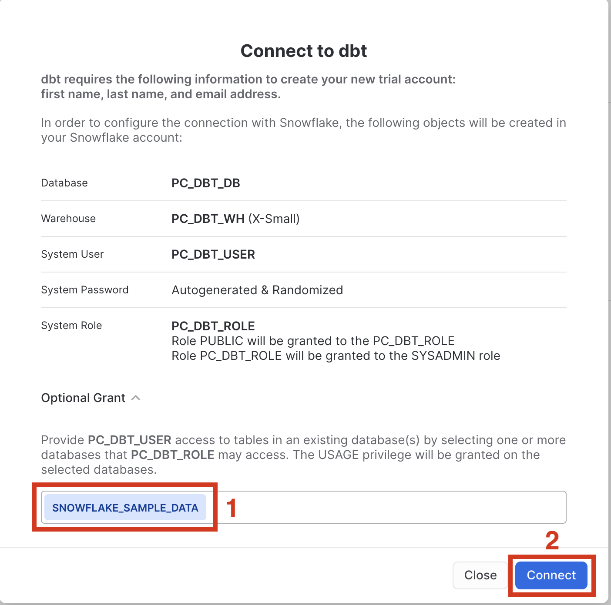
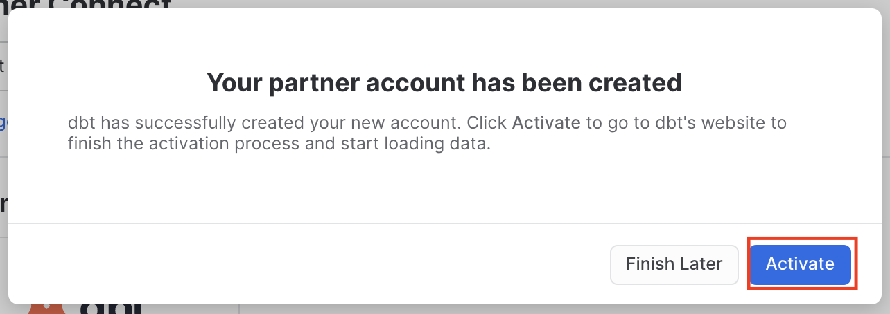
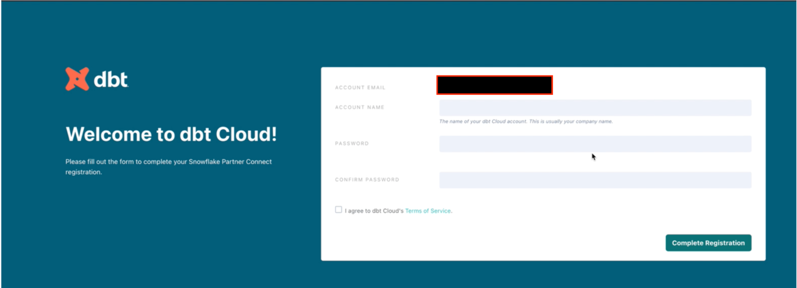
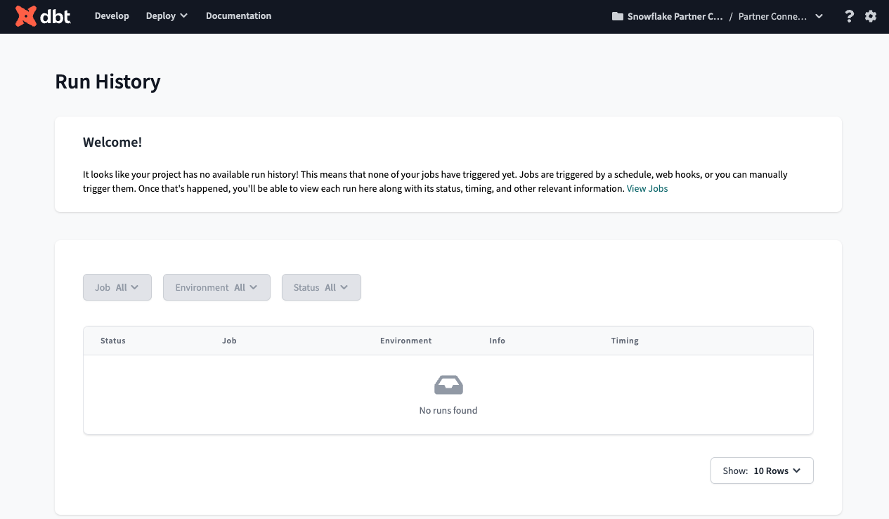

summary: Data mesh with Snowflake and dbt Cloud
id: data_products_data_mesh_dbt
categories: featured, getting-started, data-engineering
environments: web
status: Published
feedback link: https://github.com/Snowflake-Labs/sfguides/issues
tags: Getting Started, Data Engineering, Data Mesh
authors: Sean McIntyre, Doug Guthrie

# Build Data Products and Data Mesh with dbt Cloud

## Overview 
Duration: 2

Data mesh is gaining traction as a transformative approach to data architecture within large organizations, emphasizing decentralized domain-specific data ownership coupled with federated governance and a robust self-service data infrastructure. By aligning dbt Cloud with Snowflake's capabilities, organizations can adopt these principles more effectively, leveraging domain-oriented design to manage and organize data as interconnected products rather than isolated datasets. This hands-on lab will demonstrate how dbt Cloud can be utilized to not only facilitate the development and maintenance of these data products on Snowflake but also to enhance the speed and quality with which these products are delivered.

In this guide, participants will explore how dbt Cloud's integration with Snowflake supports a data mesh by enabling better management of data dependencies, automation of data transformations, and continuous integration and delivery of data products. Through practical examples and guided exercises, you will learn how to set up your dbt Cloud environment to interact seamlessly with Snowflake, creating a scalable and efficient data infrastructure. By the end of this lab, you will understand how dbt Cloud enhances data visibility and accessibility in Snowflake, allowing platform teams to govern the mesh effectively and validate compliance of data products. Additionally, the session will cover strategies to make these data products discoverable and accessible to authorized users, ensuring that the right data is available to the right people at the right time.

### Prerequisites
- Snowflake
  - Account admin access to a Snowflake Enterprise or Business Critical account
  - Access to the TPCH dataset, specifically in the `SNOWFLAKE_SAMPLE_DATA` database and the `TPCH_SF1` schema.

> aside negative
> 
> Snowflake Standard Edition is not sufficient, due to usage of Snowflake Enterprise features

- dbt Cloud
  - Account admin access to a dbt Cloud Enterprise account
  - Set your development and deployment [environments](https://docs.getdbt.com/docs/dbt-cloud-environments) to use dbt version 1.6 or later. You can also opt Keep on latest version of to always use the latest version of dbt.

> aside negative
> 
> If you are participating in the Snowflake Summit Hands On Lab session, [please use this form](https://forms.gle/S7P9Rw1Udbfxf7TdA) to submit your account information so your account can be upgraded for the duration of the Hands On Lab.
>
> Otherwise, you may receive a dbt Cloud Enterprise account by [requesting one from the dbt Labs team](https://www.getdbt.com/contact).

- Requires basic dbt familiarity
  - To gain basic dbt familiarity, please do [dbt Fundamentals](https://courses.getdbt.com/courses/fundamentals) first

### What You’ll Learn
* How to understand when data mesh is the right solution for your organization

* How to ensure proper governance of your Snowflake environment

* How to properly set up a dbt Cloud account with dbt Mesh

* How to utilize dbt's model governance features to increase the resiliency of your data mesh

### What You’ll Build 

* A dbt Cloud account containing multiple projects that showcase the governance features of Snowflake (object tagging, masking, grants) alongside dbt Cloud's dbt Mesh framework

<!-- ------------------------ -->
## Launch Snowflake and dbt Cloud for this Quickstart
Duration: 10
<!-- TODO: Fix this ^^ -->

### Sign up for a Snowflake Enterprise trial account

Navigate to [signup.snowflake.com](https://signup.snowflake.com/) and follow the steps. **Make sure to select an Enterprise account.**

### Launching dbt Cloud by Snowflake Partner Connect

1. We are going to use [Snowflake Partner Connect](https://docs.snowflake.com/en/user-guide/ecosystem-partner-connect.html) to set up your dbt Cloud account and project. Using Partner Connect will allow you to create a complete dbt account with your [Snowflake connection](https://docs.getdbt.com/docs/dbt-cloud/cloud-configuring-dbt-cloud/connecting-your-database#connecting-to-snowflake), [managed repository](https://docs.getdbt.com/docs/dbt-cloud/cloud-configuring-dbt-cloud/cloud-using-a-managed-repository), [environments](https://docs.getdbt.com/docs/guides/managing-environments), and credentials with just a few clicks.

2. In the Snowflake UI, click on `Admin` in the lefthand sidebar, then `Partner Connect` which located within the `Admin` section. <br>

    <br>

    Check to make sure your role is set as the ACCOUNTADMIN role. If you're using the classic console, the Partner Connect button will be in the top bar just right of center.

3. Find the dbt tile by typing `dbt` into the `Search Partner Connect` search bar. Click on the dbt tile.

    

4. You should now see a popup that says `Connect to dbt` that contains all of the associated objects created by Partner Connect. Click on the `Optional Grant` dropdown menu and add `Snowflake_Sample_Data` in the text box. This will grant your new dbt user role access to the database. Once that’s entered, click `Connect`. This will create a dedicated dbt user, database, warehouse, and role for your dbt Cloud trial.

    

5. When you see the popup that says `Your partner account has been created`, click on `Activate`.

    

6. You should be redirected to a dbt Cloud registration page. Fill out the form and make sure to save the password somewhere for login in the future.

    

7. Click on `Complete Registration`. You should now be redirected to your dbt Cloud account, complete with a connection to your Snowflake account, a deployment and a development environment, as well as a sample job.

    

8. To help you version control your dbt project we have connected it to a [managed repository](https://docs.getdbt.com/docs/dbt-cloud/cloud-configuring-dbt-cloud/cloud-using-a-managed-repository), which means that dbt Labs will be hosting your repository for you. This will give you access to a git workflow without you having to create and host the repository yourself. You will not need to know git for this workshop; dbt Cloud will help guide you through the workflow. In the future, when you're developing your own project, feel free to use [your own repository](https://docs.getdbt.com/docs/dbt-cloud/cloud-configuring-dbt-cloud/cloud-installing-the-github-application). This will allow you to play with features like [Slim CI](https://docs.getdbt.com/docs/dbt-cloud/using-dbt-cloud/cloud-enabling-continuous-integration-with-github) builds after this workshop.


<!-- ------------------------ -->
## Set up Snowflake securely
Duration: 10
<!-- TODO: Fix this ^^ -->

### Motivation

TODO: Insert image here

In this step, you will be setting up Snowflake for two teams: the core data team and the finance team. You will be using least privileged access principles in order to properly secure the data.

#### Core data team: the foundation

This team is well-established and the average team member is capable of building data pipelines that powers business reporting across various domains: finance, marketing, sales, customer support, and so on. The team uses data management best practices like organizing data in dimensional models for maximum re-usability in various BI and AI/ML applications.

Their project is called the `foundational` project.

#### Finance team

Meanwhile, the average finance team member is more accustomed to consuming dashboards and building spreadsheets, however more and more demands on data has led to the finance team to owning and managing more data to rapidly respond to changing demands. And so, the team has upskilled team members and brought on an analytics engineer to use Snowflake and dbt Cloud, in order to create data pipelines building off of the foundation project for daily reporting use-cases.

### Setting up the projects

The first thing we'll need to do is set up a role specifically for applying these governance practices to the Snowflake environment. The code below will:

- Create a `foundational_role` role for creating and managing resources in the `foundational_db` database, administering data governance responsibilities, and granting appropriate permissions for masking and tagging
- Create a `foundational_pii_reader_role` for users who can access PII data unmasked

```sql
use role accountadmin;

create database if not exists foundational_db;
create schema if not exists foundational_db.prod;
create or replace warehouse foundational_wh with warehouse_size xsmall;

create role if not exists foundational_role;
create role if not exists foundational_pii_reader_role;
grant role foundational_pii_reader_role to role foundational_role;

-- TODO: Can we simplify this to foundational_role having full write access to foundational_db database?
grant usage on database foundational_db to role foundational_role;
grant usage on schema foundational_db.prod to role foundational_role;
grant usage on warehouse foundational_wh to role foundational_role;
grant create schema on database foundational_db to role foundational_role;

grant create tag on schema foundational_db.prod to role foundational_role;
grant create masking policy on schema foundational_db.prod to role foundational_role;
grant apply masking policy on account to role foundational_role;
grant apply tag on account to role foundational_role;
```

Now create the Finance team workspace. The code below will:

- Create a `finance_role` role for creating and managing resources in the `finance_db` database.

```sql
create database if not exists finance_db;
create schema if not exists finance_db.prod;
create or replace warehouse finance_wh with warehouse_size xsmall;

create role if not exists finance_db;

grant usage on warehouse finance_wh to role finance_role;
grant usage on database finance_db to role finance_role;
grant usage on schema finance_db.prod to role finance_role;
grant select on all tables in schema finance_db.prod to role finance_role;
```

To get this all working correctly, make sure to assign the relevant roles to your database user.

```sql
use role accountadmin;

grant role finance_role to user <your-snowflake-username>;
grant role foundational_pii_reader_role to user <your-snowflake-username>;
grant role finance_role to user <your-snowflake-username>;
```

<!-- ------------------------ -->
## Create dbt Cloud projects for collaboration
Duration: 10
<!-- TODO: Fix this ^^ -->

### Create and configure two projects

In this section, you'll create two new, empty projects in dbt Cloud to serve as your foundational and downstream projects:

- **Foundational projects** (or upstream projects) typically contain core models and datasets that serve as the base for further analysis and reporting.
- **Downstream projects** build on these foundations, often adding more specific transformations or business logic for dedicated teams or purposes. 

### First project: Jaffle | Data Platform

To [create](https://docs.getdbt.com/docs/cloud/about-cloud-setup) a new project in dbt Cloud:

1. From **Account settings**, click **+ New Project**.
2. In the **Project name** field, enter "Jaffle | Data Platform" and click **Continue**.
3. Select **Snowflake** as your data platform, then **Next** to set up your connection.
4. In the **Configure your environment** section, enter the **Settings** for your new project.
  - Account: The Snowflake account you are operating in
  - Optional settings:
    - Role: `jaffle_da_role`
    - Database: `jaffle_da`
    - Warehouse: `jaffle_wh`
  - Development credentials:
    - Auth method: `Username and password`
    - Username: Your Snowflake username
    - Password: Your Snowflake password
5. Click **Test Connection**. This verifies that dbt Cloud can access your data platform account.
6. Click **Next** if the test succeeded. If it fails, you might need to go back and double-check your settings.
7. Select Managed Repo, and name it `jaffle_da`. 
8. Click into the Environments section and create a Deployment Environment called `Production`.

### Second project: Jaffle | Finance

> aside negative
> 
> dbt Cloud Enterprise is required to create more than one project in an account. If you wish to try this Quickstart Guide with an Enterprise account, [please contact dbt Labs](https://www.getdbt.com/contact). Otherwise, you may skip creating a second project.

1. From **Account settings**, click **+ New Project**.
2. In the **Project name** field, enter "Jaffle | Finance" and click **Continue**.
3. Select **Snowflake** as your data platform, then **Next** to set up your connection.
4. In the **Configure your environment** section, enter the **Settings** for your new project.
  - Account: The Snowflake account you are operating in
  - Optional settings:
    - Role: `jaffle_finance_role`
    - Database: `jaffle_finance`
    - Warehouse: `jaffle_wh`
  - Development credentials:
    - Auth method: `Username and password`
    - Username: Your Snowflake username
    - Password: Your Snowflake password
5. Click **Test Connection**. This verifies that dbt Cloud can access your data platform account.
6. Click **Next** if the test succeeded. If it fails, you might need to go back and double-check your settings.
7. Select Managed Repo, and name it `jaffle_finance`. 

Once configured, each project should have:
  - A data platform connection
  - New git repo
  - One or more [environments](/docs/deploy/deploy-environments) (such as development, deployment)

<!-- ------------------------ -->
## Build Foundational Project
Duration: 10

This upstream project is where you build your core data assets. This project will contain the raw data sources, staging models, and core business logic.

dbt Cloud enables data practitioners to develop in their tool of choice and comes equipped with a local [dbt Cloud CLI](/docs/cloud/cloud-cli-installation) or in-browser [dbt Cloud IDE](/docs/cloud/dbt-cloud-ide/develop-in-the-cloud).

In this section of the guide, you will set the "Jaffle | Data Platform" project as your foundational project using the dbt Cloud IDE.

1. First, navigate to the **Develop** page to verify your setup.
2. If the repo you are working on is empty, click the **Initialize dbt project** button and commit the changes.
3. Create a new branch.
4. Delete the `models/example` folder.  
5. Navigate to the `dbt_project.yml` file and rename the project (line 5) from `my_new_project` to `foundation`.
6. In your `dbt_project.yml` file, remove lines 39-42 (the `my_new_project` model reference).
7. In the **File Explorer**, hover over the project directory and click the **...**, then select **Create file**.
8. Create two new folders: `models/staging` and `models/core`.

### Staging layer
Now that you've set up the foundational project, let's start building the data assets. Set up the staging layer as follows:

1. Create a new YAML file `models/staging/sources.yml`.
2. Declare the sources by copying the following into the file and clicking **Save**.

```yaml
sources:
  - name: tpch
    description: TPCH data source from Snowflake Sample Data
    database: snowflake_sample_data
    schema: tpch_sf1
    tables:
      - name: orders
        description: One record per order
      - name: customer
        description: One record per customer
      - name: lineitem
        description: One record per line item within a single order (1 -> n)
```

3. Create a `models/staging/stg_customers.sql` file to select from the `customers` table in the `tpch` source.

```sql
with source as (

    select * from {{ source('tpch', 'customer') }}

),

cleanup as (

    select
    
        c_custkey as customer_key,
        c_name as name,
        c_address as address, 
        c_nationkey as nation_key,
        c_phone as phone_number,
        c_acctbal as account_balance,
        c_mktsegment as market_segment,
        c_comment as comment

    from source

)

select * from cleanup
```

4. Create a `models/staging/stg_orders.sql` file to select from the `orders` table in the `tpch` source.

```sql
with source as (

    select * from {{ source('tpch', 'orders') }}

),

renamed as (

    select
    
        o_orderkey as order_key,
        o_custkey as customer_key,
        o_orderstatus as status_code,
        o_totalprice as total_price,
        o_orderdate as order_date,
        o_clerk as clerk_name,
        o_orderpriority as priority_code,
        o_shippriority as ship_priority,
        o_comment as comment

    from source

)

select * from renamed
```

5. Create a `models/staging/stg_line_items.sql` file to select from the `line_items` table in the `tpch` source.

```sql
with source as (

    select * from {{ source('tpch', 'lineitem') }}

),

renamed as (

    select
    
        l_orderkey as order_key,
        l_partkey as part_key,
        l_suppkey as supplier_key,
        l_linenumber as line_number,
        l_quantity as quantity,
        l_extendedprice as gross_item_sales_amount,
        l_discount as discount_percentage,
        l_tax as tax_rate,
        l_returnflag as return_flag,
        l_linestatus as status_code,
        l_shipdate as ship_date,
        l_commitdate as commit_date,
        l_receiptdate as receipt_date,
        l_shipinstruct as ship_instructions,
        l_shipmode as ship_mode,
        l_comment as comment,

        -- extended_price is actually the line item total,
        -- so we back out the extended price per item
        (gross_item_sales_amount/nullif(quantity, 0))::decimal(16,4) as base_price,
        (base_price * (1 - discount_percentage))::decimal(16,4) as discounted_price,
        (gross_item_sales_amount * (1 - discount_percentage))::decimal(16,4) as discounted_item_sales_amount,

        -- We model discounts as negative amounts
        (-1 * gross_item_sales_amount * discount_percentage)::decimal(16,4) as item_discount_amount,
        ((gross_item_sales_amount + item_discount_amount) * tax_rate)::decimal(16,4) as item_tax_amount,
        (
            gross_item_sales_amount + 
            item_discount_amount + 
            item_tax_amount
        )::decimal(16,4) as net_item_sales_amount

    from source

)

select * from renamed
```

### Core Layer

Now set up the core layer as follows:

1. Create a `models/core/fct_orders.sql` to build a fact table with order details

```sql
{{
    config(
        materialized='table',
    )
}}

with orders as (
    
    select * from {{ ref('stg_orders') }}

),

line_items as (
    
    select * from {{ ref('stg_line_items') }}

),

customers as (

    select * from {{ ref('stg_customers') }}
),

order_item_summary as (

    select 
        order_key,
        sum(gross_item_sales_amount) as gross_item_sales_amount,
        sum(item_discount_amount) as item_discount_amount,
        sum(item_tax_amount) as item_tax_amount,
        sum(net_item_sales_amount) as net_item_sales_amount
    from line_items
    group by 1

),

final as (

    select 
        orders.order_key, 
        orders.order_date,
        orders.customer_key,
        orders.status_code,
        orders.priority_code,
        orders.ship_priority,
        orders.clerk_name,
        customers.name,
        customers.market_segment,
        order_item_summary.gross_item_sales_amount,
        order_item_summary.item_discount_amount,
        order_item_summary.item_tax_amount,
        order_item_summary.net_item_sales_amount
    from orders
    inner join order_item_summary
        on orders.order_key = order_item_summary.order_key
    inner join customers
        on orders.customer_key = customers.customer_key
)

select *
from final
order by order_date
```

### Execute

Navigate to the [Command bar](https://arc.net/l/quote/kfovefjk) and execute a `dbt run`. This will both validate the work you've done thus far and build out the requisite models into your sandbox within Snowflake.

<!-- ------------------------ -->
## Use dbt to apply Snowflake masking to PII
Duration: 5

The goal of this section is to apply some of the functionality offered from Snowflake, like [object tagging](https://docs.snowflake.com/en/user-guide/object-tagging#label-object-tags-ddl-privilege-summary) and [dynamic data masking](https://docs.snowflake.com/en/user-guide/security-column-ddm-intro), to strengthen the governance around the data mesh architecture we want to architect.

Next, we'll use the `jaffle_da_role` role to perform the following:

- Create a tag for PII data
- Create a masking policy for string data
- Assign the masking policy to the tag
- Assign the tag to the `c_name` column in the `customers` table

```sql
use role jaffle_da_role;
use database jaffle_da;

-- create the tag
create tag if not exists jaffle_da.prod.pii_data;

-- create the policy
create or replace masking policy jaffle_da.prod.pii_mask_string as (val string) returns string ->
  case
    when is_role_in_session('jaffle_da_pii_reader_role') then val
    else '****'
  end;
  
-- assign masking policy to tag
alter tag jaffle_da.prod.pii_data set masking policy jaffle_da.prod.pii_mask_string;
```

Now that we've set up the appropriate roles, tags, and masking policies in Snowflake, it's time to jump into dbt Cloud to both apply the masking policy to the relevant models and, additionally, use some of the features there to further strengthen our data mesh architecture.

Open up the `fct_orders.sql` file and modify the config block at the top to include the `post_hook` argument:

```sql
{{
    config(
        materialized='table',
        post_hook="alter table {{ this }} modify column name set tag snowflake_sample_data.tpch_sf1.pii_data = 'name'"
    )
}}
```

This will apply the tag to the column that we want to mask because it's PII data.

Navigate to the [Command bar](https://arc.net/l/quote/kfovefjk) and execute a `dbt run`. This will both validate the work you've done thus far and build out the requisite models into your sandbox within Snowflake.

> aside positive
> 
> To learn more about how to apply tags to Snowflake tables, look into the [dbt-tags](https://dbt-tags.iflambda.com/latest/index.html) package from Infinite Lambda.

<!-- ------------------------ -->
## Add model contracts and enforce Snowflake grants with dbt
Duration: 5

Now that our Snowflake environment is set up with proper data governance practices, it's time to turn to dbt Cloud to utilize that model in a way that's both complimentary and additive.  To do that, we'll look at adding the following model governance features to our project:

- [Contracts](https://docs.getdbt.com/docs/collaborate/govern/model-contracts)
- [Access](https://docs.getdbt.com/docs/collaborate/govern/model-access) levels
- [Grants](https://docs.getdbt.com/reference/resource-configs/grants)

By using these configurations within your project, you'll be in effect creating a stable set of APIs that your downstream projects are able to consume from.

To begin, add the file `models/core/core.yml` and add the code below:

```yaml
models:
  - name: fct_orders
    description: ""
    access: public
    config:
      contract:
        enforced: true
      grants:
        select: ['jaffle_da_pii_reader_role', 'jaffle_finance_role']
    columns:
      - name: order_key
        data_type: int
        description: ""

      - name: order_date
        data_type: date
        description: ""

      - name: customer_key
        data_type: int
        description: ""

      - name: status_code
        data_type: varchar
        description: ""

      - name: priority_code
        data_type: varchar
        description: ""

      - name: ship_priority
        data_type: int
        description: ""

      - name: clerk_name
        data_type: varchar
        description: ""

      - name: name
        data_type: varchar
        description: ""

      - name: market_segment
        data_type: varchar
        description: ""

      - name: gross_item_sales_amount
        data_type: numeric(38, 3)
        description: ""

      - name: item_discount_amount
        data_type: numeric(38, 3)
        description: ""

      - name: item_tax_amount
        data_type: numeric(38, 3)
        description: ""

      - name: net_item_sales_amount
        data_type: numeric(38, 3)
        description: ""
```

This code does the following:
- It makes the `fct_orders` model public, which means other projects in the dbt Cloud account are now able to reference it
- It will add and enforce a contract to this model.  This will enable dbt to do a couple things:  1) run a "preflight" check that ensures the model's query will return a set of columns with names and data types matching the ones you have defined and 2) include the column names, data types, and constraints in the DDL statements it submits to the data platform, which will be enforced while building or updating the model's table.
- The grants config is used to set permissions or grants for a resource. When a model is run, dbt will run grant and/or revoke statements to ensure that the permissions on the database object match the grants you have configured on the resource.

3. Navigate to the dbt Cloud IDE **Lineage** tab to see the model noted as **Public**, below the model name.

**TODO: Insert picture here showing new lineage**

3. Go to **Version control** and click the **Commit and Sync** button to commit your changes.
4. Merge your changes to the main or production branch.

### Create and run a dbt Cloud job
To run your first deployment dbt Cloud job, you will need to create a new dbt Cloud job.  
1. Click **Deploy** and then **Jobs**. 
2. Click **Create job** and then **Deploy job**.
3. Select the **Generate docs on run** option. This will enable dbt Cloud to pull in metadata from the warehouse to supplement the documentation found in the **Explore** section.

**TODO: Insert pic here showing these steps**

4. Then, click **Run now** to trigger the job.

**TODO: Another pic showing clicking run now**

5. Click **Explore** from the upper menu bar. You should now see your lineage, tests, and documentation coming through successfully.

<!-- ------------------------ -->
## Connect two dbt projects together
Duration: 10

In this section, you will set up the downstream project, "Jaffle | Finance", and cross-project reference the `fct_orders` model from the foundational project. Navigate to the Develop page to set up our project:

1. If you’ve also started with a new git repo, click Initialize dbt project under the Version control section.
2. Delete the models/example folder
3. Navigate to the dbt_project.yml file and remove lines 39-42 (the my_new_project model reference).
4. In the File Explorer, hover over the project directory, click the ... and Select Create file.
5. Name the file dependencies.yml and add the upstream platform project and click save.

```yaml
projects:
  - name: platform
```

6. You're now set to add a model that references the `fct_orders` model created in the separate project by your platform team.  In your models directory, create a file `models/agg_segment_revenue.sql`

```sql
select
    market_segment,
    sum(gross_item_sales_amount) as total_revenue,
from {{ ref('platform', 'fct_orders') }}
group by 1
```

Notice the cross-project `ref` by using two arguments to the function - 1) name of the project (as defined within that upstream project and declared in `dependencies.yml`) and 2) the name of a public model in that project.

7. Save your file and notice the lineage in the bottom pane.

<!-- ------------------------ -->
## Conclusion
Duration: 1
<!-- TODO: Fix this ^^ -->

Additional features:

- Downstream jobs
- Model versions
- Secure project access with dbt Cloud Role Based Access Controls
- dbt Cloud CLI
- Share data with Snowflake Private Listings
