summary: Accelerating Data Science with Snowflake and Dataiku
id: data_science_with_dataiku
categories: Getting-Started
environments: web
status: Published
Feedback Link: https://github.com/Snowflake-Labs/sfguides/issues
tags: Data Science, Dataiku

# Accelerating Data Science with Snowflake and Dataiku

<!-- ------------------------ -->

## Lab Overview

Duration: 1

This Snowflake Quickstart introduces you to the basics of using Snowflake together with Dataiku Cloud as part of a Data Science project. We’ll be highlighting some of the well-integrated functionalities between the two cloud-based technologies. It is designed specifically for use with the [Snowflake free 30-day trial](https://trial.snowflake.com), and the Dataiku Cloud trial version via Snowflake’s Partner Connect. In addition, we’ll also take a look at Snowflake’s Data Marketplace and how 3rd party data sets from there can enrich and support your Data Science projects.

This Snowflake lab will be done as part of a theoretical real-world “story” with COVID-19 data to help you better understand why we are performing the steps in this lab and in the order they appear.

The story of this lab is examining incidents of COVID-19 in Europe along with changes in mobility. We would like to use historical data to predict mortality rates for COVID-19 and see if changes in mobility is a significant factor driving this.

The source of data is the Starschema Covid-19 database from the Snowflake Data Marketplace. After analyzing the data in Snowflake’s Snowsight, we will move over to Dataiku to perform some transformations (that are pushed down to Snowflake for computation) and then create a predictive model.

The specific tables we’ll use are the JHU_COVID_19 dataset which reports case numbers by province and day as well as the GOOG_GLOBAL_MOBILITY_REPORT which reports the percent change in mobility across various areas (e.g., grocery stores, parks, etc.) by a state/region of a country and day.

Finally, we will write those predictions back into Snowflake.

Upon completion of the lab you should be able to grasp how to work a simple Data Science project using Snowflake and Dataiku.

### Prerequisites

- Use of the Snowflake free 30-day trial environment
- Basic knowledge of SQL, and database concepts and objects

### What You'll Learn

The exercises in this lab will walk you through the steps to:  

- Create databases, tables, views, and warehouses in Snowflake
- Access data in Snowflake using the Data Marketplace
- Use Snowflake’s “Partner Connect” to seamlessly create a Dataiku DSS Cloud trial
- Create a Data Science project in Dataiku and perform analysis on data via Dataiku within Snowflake
- Create, run, and evaluate simple Machine Learning models in Dataiku
- Write results back to Snowflake
- Use cloning and time travel for test environment

### What You'll Build

- A Snowflake and Dataiku integration to create, run, and evaluate COVID-19 machine learning models. 

<!-- ------------------------ -->

## Prepare Your Lab Environment

Duration: 5

If you haven’t already, register for a [Snowflake free 30-day trial](https://trial.snowflake.com?utm_source=Snowflake&utm_medium=lab guide&utm_campaign=dataiku-vhol-download-free-trial-from-lab-guide).

Please select a region which is physically closest to you, and select the Enterprise edition so you can leverage some advanced capabilities that are not available in the Standard Edition.  

After registering, you will receive an email with an activation link and your Snowflake account URL. Bookmark this URL for easy, future access. After activation, you will create a user name and password. Write down these credentials.

Resize your browser window, so that you can view this guide and your web browser side-by-side and follow the lab instructions. If possible, use a secondary display dedicated to the lab guide.

#### Download lab resources:

<button>
[Download sample SQL](https://snowflake-corp-se-workshop.s3-us-west-1.amazonaws.com/VHOL_Snowflake_Dataiku/Snowflake_Dataiku_VHOL.sql) for use in Snowflake.
</button>

Negative
: **About the screen captures, sample code, and environment** <br> Screen captures in this lab depict examples and results that may slightly vary from what you may see when you complete the exercises.

<!-- ------------------------ -->

## The Snowflake User Interface

Duration: 10

### Logging Into the Snowflake User Interface (UI)

Open a browser window and enter the URL of your Snowflake 30-day trial environment. You should see the login screen below. Enter your unique credentials to log in.


### Close any Welcome Boxes and Tutorials

You may see “welcome” and “helper” boxes in the UI when you log in for the first time. Also a “Enjoy your free trial…” ribbon at the top of the UI. Minimize and close them by clicking on the items in the red boxes in the screenshot below.

      

### Navigating the Snowflake UI

First let’s get you acquainted with Snowflake! This section covers the basic components of the user interface to help you orient yourself. We will move left to right in the top of the UI.

The top menu allows you to switch between the different areas of Snowflake:


The **Databases** tab shows information about the databases you have created or have privileges to access. You can create, clone, drop, or transfer ownership of databases as well as load data (limited) in the UI. Notice several databases already exist in your environment. However, we will not be using these in this lab.   


The **Shares** tab is where data sharing can be configured to easily and securely share Snowflake table(s) among separate Snowflake accounts or external users, without having to create a second copy of the table data.

The **Warehouses** tab is where you set up and manage compute resources (virtual warehouses) to load or query data in Snowflake. Note a warehouse called “COMPUTE_WH (XS)” already exists in your environment.

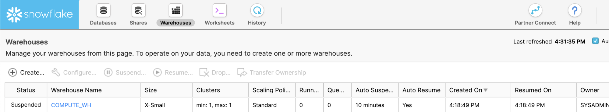

The **Worksheets** tab provides an interface for submitting SQL queries, performing DDL and DML operations and viewing results as your queries/operations complete. The default “Worksheet 1” appears.

In the left pane is the database objects browser which enables users to explore all databases, schemas, tables, and views accessible by the role selected for a worksheet. The bottom pane shows results of queries and operations.  

The various windows on this page can be resized by moving the small sliders on them. And if during the lab you need more room to work in the worksheet, collapse the database objects browser in the left pane. Many of the screenshots in this guide will have this database objects browser closed.

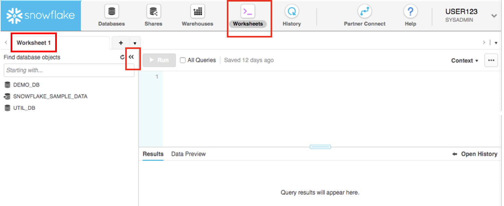

At the top left of the default “Worksheet 1,” just to the right of the worksheet tab, click on the small, downward facing arrow, select “Load Script”, then browse to the “lab_scripts.sql” file you downloaded in the prior module and select “Open”. All of the SQL commands you need to run for the remainder of this lab will now appear on a new worksheet.

**Do not run any of the SQL commands yet. We will come back to them later in the lab and execute them one at a time**


Rename the newly created worksheet to Covid19 by clicking on the worksheet name and typing Covid19 and pressing ‘Enter’


Negative
: **Warning - Do Not Copy/Paste SQL to a Worksheet** <br> Copy-pasting the SQL code into a Snowflake worksheet may result in formatting errors and the SQL may not run correctly. Make sure to use the “Load Script” method just covered.  On older or locked-down browsers, this “load script” step may not work as the browser will prevent you from opening the .sql file. If this is the case, open the .sql file with a text editor and then copy/paste all the text from the .sql file to the “Worksheet 1”

Positive
: **Worksheets vs the UI** <br> Much of the configurations in this lab will be executed via this pre-written SQL in the Worksheet in order to save time. These configurations could also be done via the UI in a less technical manner but would take more time.

The **History** tab allows you to view the details of all queries executed in the last 14 days in the Snowflake account (click on a Query ID to drill into the query for more detail).


If you click on the top right of the UI where your username appears, you will see that you can change your password, roles, or preferences. Snowflake has several system defined roles. You are currently in the default role of SYSADMIN. We will change this in the next part of the lab.


Negative
: **SYSADMIN** <br> For most of this lab you will remain in the SYSADMIN (aka System Administrator) role which has privileges to create warehouses and databases and other objects in an account. In a real-world environment, you would use different roles for the tasks in this lab, and assign the roles to your users. More on access control in Snowflake is in towards the end of this lab and also in our [documentation](https://docs.snowflake.net/manuals/user-guide/security-access-control.html)


<!-- ------------------------ -->

## Prepare Dataiku Trial Account via Snowflake Partner Connect

Duration: 10

### Create Dataiku trial via Partner Connect

At the top right of the page, confirm that your current role is `ACCOUNTADMIN`, by clicking on your profile on the top right.

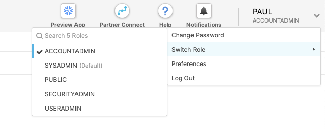

Click on Partner Connect at the top bar and scroll down to find Dataiku.


Click on the Dataiku tile. This will launch the following window, which will automatically create the connection parameters required for Dataiku to connect to Snowflake. Snowflake will create a dedicated database, warehouse, system user, system password and system role, with the intention of those being used by the Dataiku account.

```
Database:        PC_DATAIKU_DB
Warehouse:       PC_DATAIKU_WH (X-Small)
System User:     PC_DATAIKU_USER
System Password: Autogenerated & Randomized
System Role:     PC_DATAIKU_ROLE
                 Role PUBLIC will be granted to the PC_DATAIKU_RLE
                 Role PC_DATAIKU_ROLE will be granted to the SYSADMIN role

Database(s) with USAGE privilege granted: leave this blank

```

We’d like to use the **PC_DATAIKU_USER** to connect from Dataiku to Snowflake, and use the **PC_DATAIKU_WH** when performing activities within Dataiku that are pushed down into Snowflake.

This is to show that a Data Science team working on Dataiku and by extension on Snowflake can work completely independently from the Data Engineering team that works on loading data into Snowflake using different roles and warehouses.

Note that the user password (which is autogenerated by Snowflake and never displayed), along with all of the other Snowflake connection parameters, are passed to the Dataiku server so that they will automatically be used for the Dataiku connection. **DO NOT CHANGE THE PC_DATAIKU_USER password**, otherwise Dataiku will not be able to connect to the Snowflake database.


Negative
: **Informational Note:** <br> If you are using a different Snowflake account than the one created at the start, you may get the following screens asking for your email details:

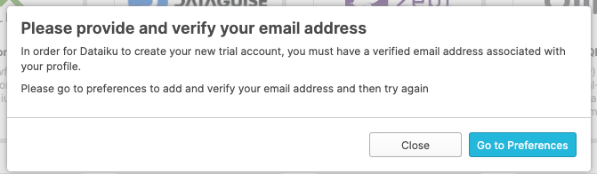

Negative
: Click on ‘Go to Preferences’ and populate with your email details

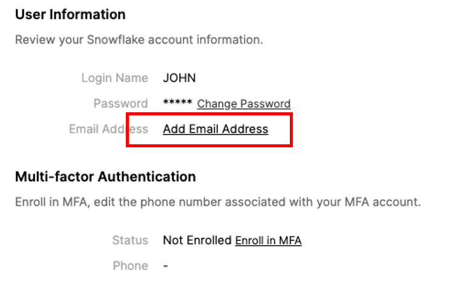


Click on **Connect**. You may be asked to provide your first and last name. If so, add them and click Connect.

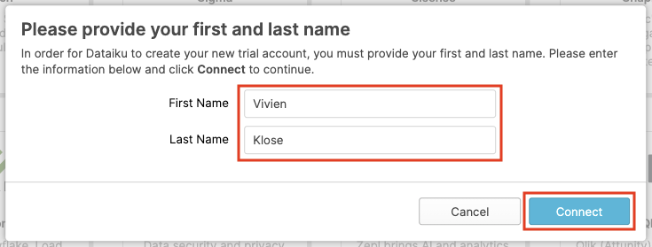

Your partner account has been created. Click on **Activate** to get it activated.

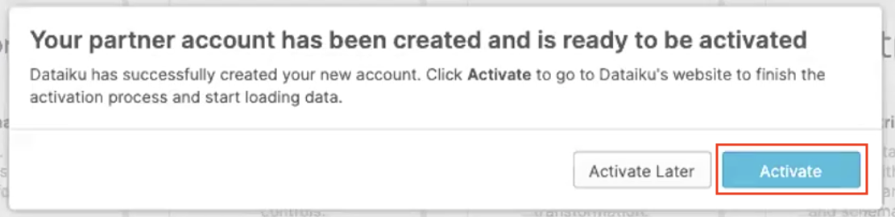

This will launch a new page that will redirect you to a launch page from Dataiku.

Here, you will have two options:

1. Login with an existing Dataiku username
2. Sign up for a new Dataiku account

We assume that you’re new to Dataiku, so ensure the “Sign Up” box is selected, and sign up with either GitHub, Google or your email address and your new password. Click sign up.

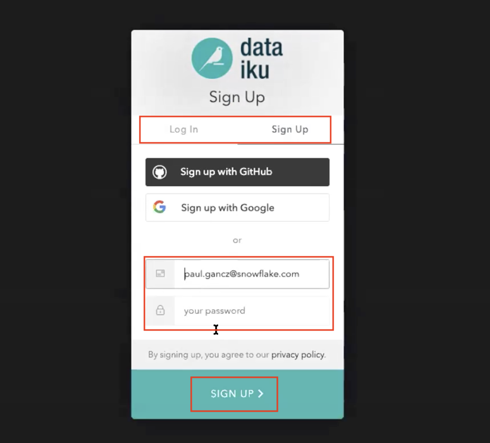

When using your email address, ensure your password fits the following criteria:

1. At least 8 characters in length
2. Should contain:
   Lower case letters (a-z)
   Upper case letters (A-Z)
   Numbers (i.e. 0-9)

You should have received an email from Dataiku to the email you have signed up with.


Activate your Dataiku account via the email sent.

### Review Dataiku Setup

Upon clicking on the activation link, please briefly review the Terms of Service of Dataiku Cloud. In order to do so, please scroll down to the bottom of the page. Click on **I AGREE**.

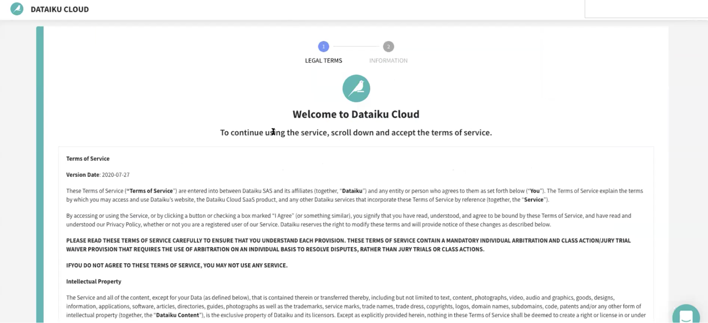


Next, you’ll need to complete your sign up with the following information:

1. First Name
2. Last Name
3. Job Title
4. How would you define yourself (drop-down options for roles)
5. Company Name
6. Company Size (drop-down)
7. What is your country (drop-down)
8. What is your goal with Dataiku Cloud? *(optional)*

Then click on **Start**.

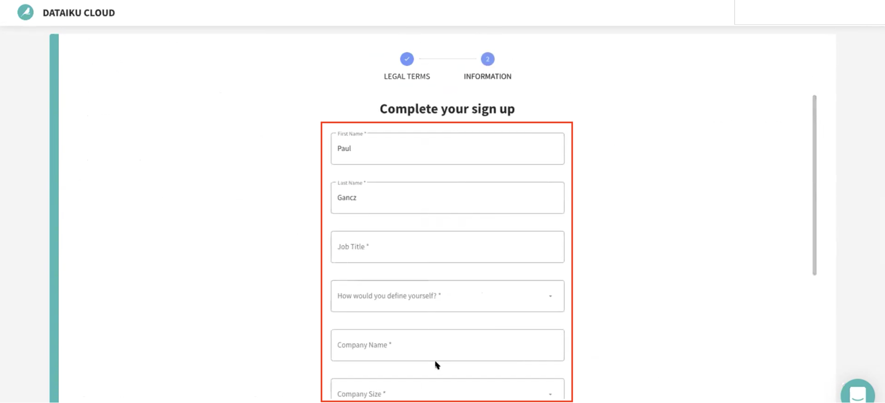

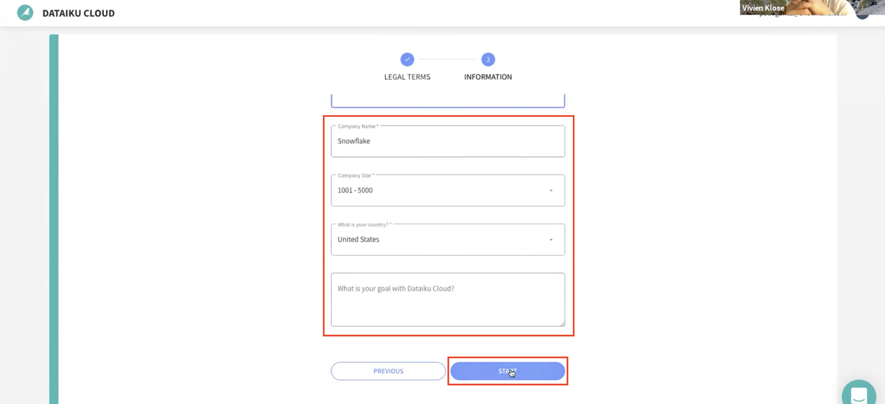

1. You will be redirected to the Dataiku Cloud Launchpad site. Click **GOT IT!** to continue.


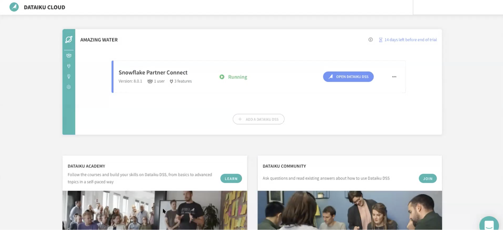

You’ve now successfully set up your Dataiku trial account via Snowflake’s Partner Connect. We are now ready to continue with the lab. For this, move back to your Snowflake browser.

Negative
: Remember that the user password (which is autogenerated by Snowflake and never displayed), along with all of the other Snowflake connection parameters, are passed to the Dataiku server so that they will automatically be used for the Dataiku connection. DO NOT CHANGE THE PC_DATAIKU_USER password, otherwise Dataiku will not be able to connect to the Snowflake database.

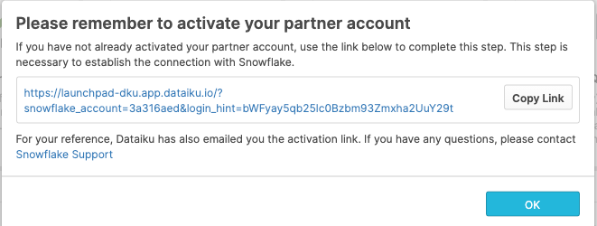

<!-- ------------------------ -->

## Getting and Preparing COVID-19 Data from the Snowflake Data Marketplace

Duration: 20

Positive
: **Snowflake's Data Sharing** <br> The Snowflake Data Marketplace is Snowflake's hosted data exchange, where any Snowflake customer can seamlessly access third-party data, and where companies can publish data and offer data services to be discovered and purchased by other Snowflake customers.
Today it contains data from over 100+ Data Providers with over 220+ data listings. Review [this webpage](https://www.snowflake.com/data-marketplace/) for more information. <br> You can also build out your own Snowflake Data Exchange and remove the need for FTP, file shares, ETL processes to create the files for your customers and standardize on Snowflake Data Exchange. This will break down data silos and allows you to frictionlessly share data in a highly governed way within your company, as well as with suppliers, partners or customers. Your Data Exchange governs live access to a single copy of the data, allows you to securely control access to data, and eliminates the cost and headaches of traditional data sharing methods like copying files or building ETL pipelines.


### Getting COVID-19 Data from the Snowflake Data Marketplace

To access the Snowflake Data Marketplace, follow the below steps.

Make sure that your current role is `ACCOUNTADMIN` (as shown in the top right). If not, update your role by clicking on your profile on the top right.

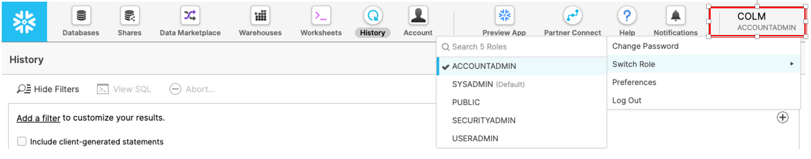

Select the **Data Marketplace** icon at the top and click on **Explore the Snowflake Data Marketplace**.

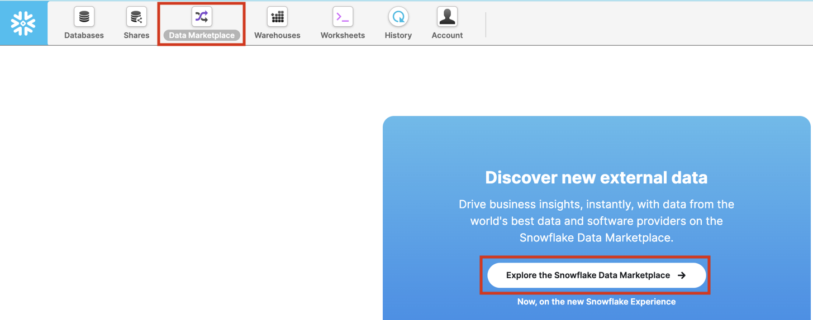

If it’s your first time using the Data Marketplace, the following screens will appear. Click **Sign in to continue** and enter your login information in the next step.


You will now be redirected to the Snowflake Data Marketplace.

It will display the variety of external data sources across a variety of industries. The Search box in the top right allows you to search for a listing or data provider. The side menu on the left shows the categories of data available in the Data Marketplace.

Since we’ll be looking at COVID-19 data, select the **Health** Category on the left-hand-side by clicking on it.

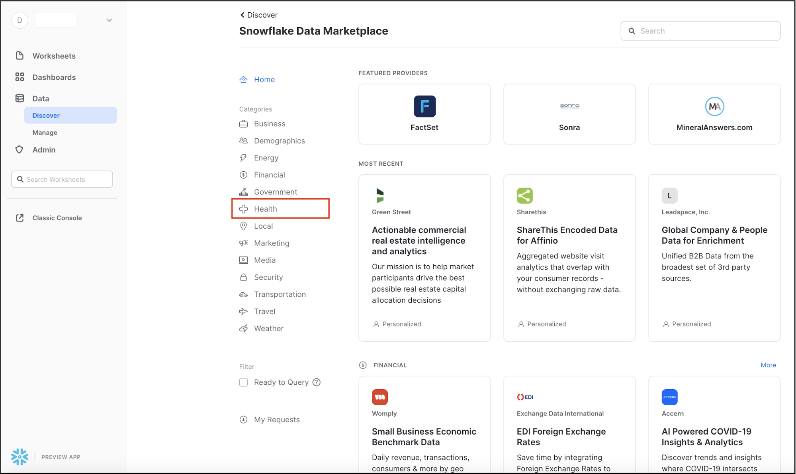

A number of COVID-19 data sets are shown here - we will be using **Starschema’s COVID-19 Epidemiological Data**. Click on that tile.

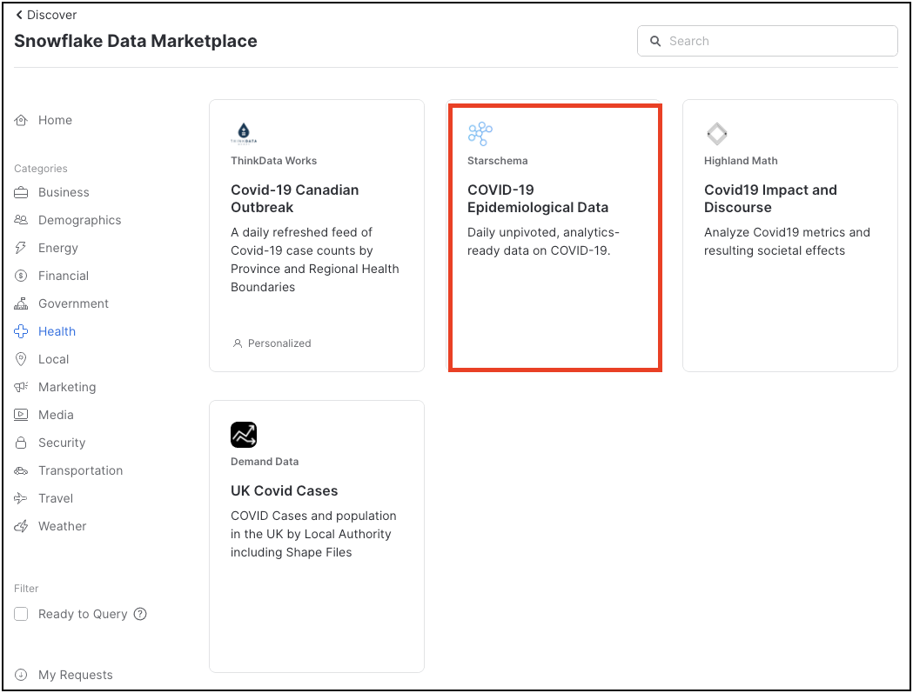

The Starschema dataset provides several tables, with daily COVID-19 incident data from the John Hopkins University, as well as local health authorities such as the European Centre for Disease Prevention and Control (ECDC), the German Robert-Koch-Institut (RKI) and American authorities. In addition, demographic data, mobility data and information about global government measures is made available in this dataset.

Ensure you’re in the `ACCOUNTADMIN` role on the top right; if not, click on the person icon to change it. Then click **Get Data**.


Change the Database name to **COVID19**. In addition, select all the roles to **Public**, so that you can access the database (click off the selection box once you have selected public) and **Accept** Snowflake’s consumers terms and Starschema’s terms of use, and finally click on **Create Database**.

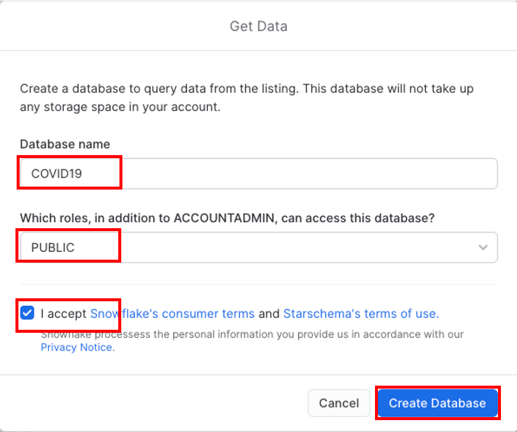

Click **View Database** for a quick peek into the database and its schemas. You’ll see two schemas: INFORMATION_SCHEMA and PUBIC. Click on **PUBLIC** to see the available tables:

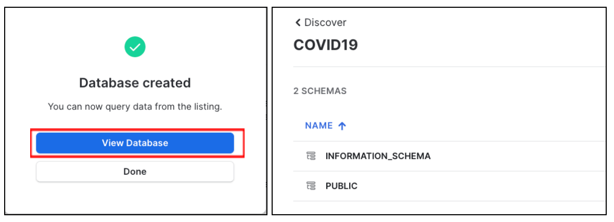

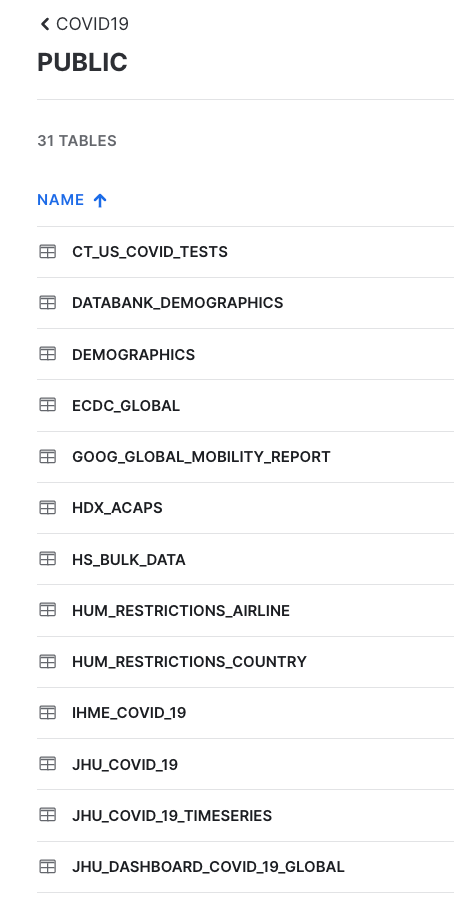

If you enter JHU in the top right hand filter you will see all tables with data sourced from [John Hopkins University](https://www.jhu.edu/)

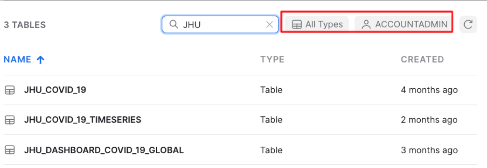

You will also see that All Types has been selected and you are using the `ACCOUNTADMIN` role by default.

Further to the right you will see the Database Details including: the owner of the share, number of tables and views in this database, source, share name and which data provider shared the information with you.


You have now successfully subscribed to the COVID-19 dataset from StarSchema which is updated daily with global COVID data. Note that we didn’t have to create databases, tables, views, or ETL processes. We simply can search for and access shared data from the Snowflake Data Marketplace.

### Analysing COVID-19 using Snowsight

Now that we’ve done some preparation work, let’s do some primarily data analysis on our COVID-19 data. For this we will use Snowsight, the SQL Worksheets replacement, which is designed to support data analyst activities.

Snowflake recently released the next generation of it’s analytics UI — **Snowsight**. On top of a redesigned interface, there are many improvements for analysts, data engineers, and business users. With Snowsight, it is easier and faster to write queries and get results and collaboration with others through sharing makes it easier to explore and visualize data across your organization. Snowsight includes many features and enhancements, including: 

- **Fast query writing:** Includes smart autocomplete for query syntax keywords or listing values that match table/column names, data filters and quick access to Snowflake documentation for specific functions.
- **Interactive query results:** View summary statistics about the data that has been returned by their query, using histograms of the distribution to identify outliers and anomalies.
- **Attractive data visualizations:** Quickly analyze data without requiring an external analytics/visualization tool, with automatic chart generation and drag-and-drop interface for creating dashboards.
- **Sharing and collaboration:** Share queries, worksheets, visualizations and dashboards securely among teams.
- **Schema browser:** Search instantly across databases and schemas accessible by the current session role for tables, views, and columns whose names contain a specified string. Pin tables for quick reference to see column names and data types.

For more information on using Snowsight, see the [documentation](https://docs.snowflake.com/en/user-guide/ui-snowsight.html).

Let’s run some preliminary analysis on the two tables that we’ll focus on. For this, we will select **Worksheets** in the top left corner.


 If this is the first time you’ve used Snowsight, you will be prompted to enable it.


 

Click “Enable Worksheets and Dashboards”, and then click on “Import Worksheets”

Open up the script we loaded earlier by clicking on the that **COVID19 Worksheet**.


 In the worksheet, ensure the correct context, on the top right: using the SYSADMIN role and the COMPUTE_WH that was created when your trial account was created.

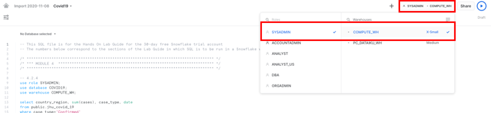

In addition, select the correct database **COVID19** on the top left of the worksheet.
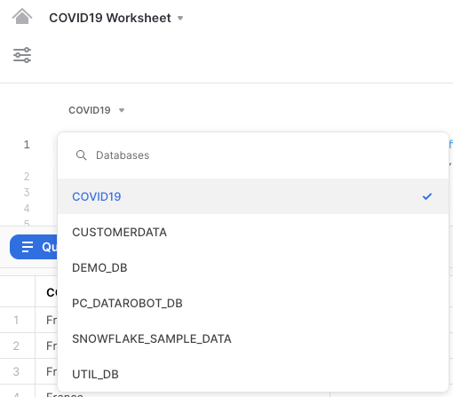

We’ll run a simple analysis of confirmed cases over time for a few European countries, incl. Germany, UK, France, Italy, Spain, The Netherlands, Poland and Sweden.

 Run the command below as provided in the script. Highlight the following text in the Covid19 worksheet and hit **‘Run’**.

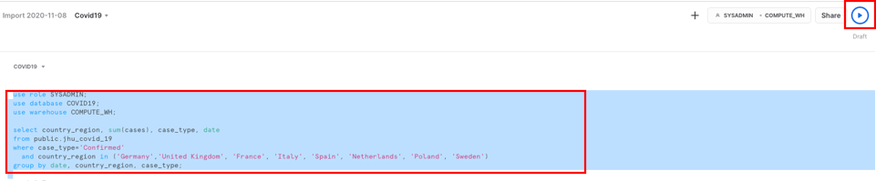


```sql
use role SYSADMIN;
use database COVID19;
use warehouse COMPUTE_WH;

select country_region, sum(cases), case_type, date from public.jhu_covid_19 where case_type='Confirmed' and country_region in ('Germany','United Kingdom', 'France', 'Italy', 'Spain', 'Netherlands', 'Poland', 'Sweden') group by date, country_region, case_type;

```

Your result will include a table of results. Click on **Chart** to get a simple visualization of the results:

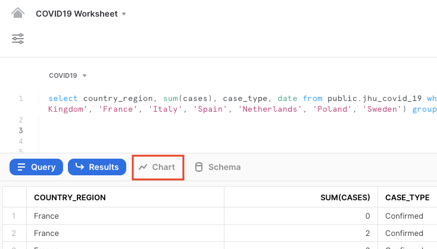

 On the right hand side of the chart, change the values as follows:

- **Line chart**
- **SUM(CASES)** for the y-axis, to show the sum of confirmed values in a line
- **DATE** for the x-axis
- Add Column, then Country_region
- **COUNTRY_REGION** as the country for each of which the sum of confirmed cases will be shown


- *Optional: Label the x-axis as “Date” and the y-axis as “Sum of confirmed cases”*


We clearly see that the number of confirmed COVID-19 cases rapidly increased in March until mid April, after which - due to several lockdown measures in place - the increase slowed down significantly.

However, with the start of the autumn season in September, we clearly see an exponential and worrying rise in COVID-19 confirmed cases, culminating in over or around 1 million confirmed cases for 3 major European countries.

In today’s news, people are typically aware of newly known infections. We can also review just how many people have an active COVID-19 infection (essentially Confirmed cases minus Recovered, which are the ‘Active’ case types).

Remain on the chart window, and run the next command, as the execution of this command will result in the corresponding chart:

```sql
select country_region, sum(cases), case_type, date from public.jhu_covid_19 where case_type='Active' and country_region in ('Germany','United Kingdom', 'France', 'Italy', 'Spain', 'Netherlands', 'Poland', 'Sweden') group by date, country_region, case_type;
```


**Note that this refers to the sum of active cases on the y-axis.**

From here, we can easily deduce that the majority of countries were able to get infections “under control” after the end of April. During summertime, the active infection cases in most countries were relatively stable or had even decreased significantly. With the second wave underway, Europe is seeing exponential growth in active cases with the rise in confirmed cases.

### Data Problem
Sometimes you go through the entire process of building a predictive model and the predictions are quite poor and you trace the issue back to data problems.  In other cases, such as this one, the data changes with time and the models go bad.  After creating the lab we had to return and dig around in the data to see what the problem was.  In summary, we used the same Snowsight visualization capabilities as above to determine that for some reason around June 2 and June 3 2021, there were a massive number of “negative deaths” that were throwing off the models.  The count should only be a positive number.   After some further digging around using Snowsight, it was discovered that Peru reported problematic data that was causing the problems with the model accuracy.   
As an optional step to discover this data problem, you can run the following SQL statement:

```sql
select DATE, province_state, SUM(CASES) 
from public.jhu_covid_19 
WHERE CASE_TYPE = 'Deaths'
and DATE >='2021-05-25'
and DATE <='2021-06-06'
and country_region = 'Peru'
group by province_state, DATE 
order by province_state, date;
```

Then create a visualization like this:


You will notice that Peru normally states how many people have died to date from COVID broken out by State but on on June 2nd 2021, most of the deaths were assigned to a new “Unknown” State then reported correctly after that.  Later on when we find the difference in total deaths per State per day, this leads to some massive negative death counts all on two days in Peru.  There are better ways to fix this data problem but an easy for this lab is to simply filter Peru out of the solution.  We will do that in a future step.


### Preparing the Data for Further Data Analysis and Consumption

Let’s now create views that reference the shared COVID19 tables we’ll be using. Switch back to the OLD UI and select the **Worksheets** tab.  

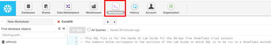


```sql
use role PC_DATAIKU_ROLE;
use database PC_DATAIKU_DB;
create or replace view JHU_COVID_19 as select * from COVID19.PUBLIC.JHU_COVID_19;
create or replace view GOOG_GLOBAL_MOBILITY_REPORT as select * from COVID19.PUBLIC.GOOG_GLOBAL_MOBILITY_REPORT;
```

Notice that we have not selected a warehouse. Statements that create database objects do not utilize a running warehouse, so it’s OK to leave this unselected for now.

Now let’s navigate to the **Warehouses** tab. Note the “Create…” option at the top is where you can quickly create a new warehouse. You’ll see two virtual warehouses -- the COMPUTE_WH that we just used for our analysis, and the PC_DATAIKU_WH that was created when we created our Dataiku account through Partner Connect.

Click on the row of this “PC_DATAIKU_WH” warehouse (not the blue hyperlink that says “PC_DATAIKU_WH”) so the entire row is highlighted. Then click on the “Configure...” text above it to see the configuration detail of the “PC_DATAIKU_WH”. We will use this warehouse to build, train, and deploy our models in Dataiku.


Let’s walk through the settings of this warehouse as there’s a lot of functionality here, much of which is unique to Snowflake versus other data warehouses.

NOTE - If you do not have a Snowflake Edition of Enterprise or greater, you will *NOT* see the “Maximum Clusters” or “Scaling Policy” configurations from the screenshot below. Multi-clustering is not utilized in this lab, but we will still discuss it as it is a key capability of Snowflake.

The “Size” drop-down is where the size of the warehouse is selected. For larger data loading operations or more compute-intensive queries, a larger warehouse will be needed. The t-shirt sizes translate to underlying compute nodes, either AWS EC2, Azure Virtual Machines, or Google Compute Engine Virtual Machines. The larger the t-shirt size, the more compute resources from the cloud provider are allocated to that warehouse. As an example, the 4-XL option allocates 128 nodes. Also, this sizing can be changed up or down on the fly with a simple click.

If you have Snowflake Enterprise Edition or greater you will see the Maximum Clusters section. This is where you can set up a single warehouse to be multi-cluster up to 10 clusters. As an example, if the 4-XL warehouse we just mentioned was assigned a maximum cluster size of 10, it could scale up to be 1280 (128 * 10) AWS EC2 or Azure VM nodes powering that warehouse...and it can do this in seconds! Multi-cluster is ideal for concurrency scenarios, such as many business analysts simultaneously running different queries using the same warehouse. In this scenario, the various queries can be allocated across the multiple clusters to ensure they run fast.

The final sections allow you to automatically suspend the warehouse so it suspends (stops) itself when not in use and no credits are consumed. There is also an option to automatically resume (start) a suspended warehouse so when a new workload is assigned to it, it will automatically start back up. This functionality enables Snowflake’s fair “pay as you use” compute pricing model which enables customers to minimize their data warehouse costs.  


Positive
: **Snowflake Compute vs Other Warehouses** <br> Many of the warehouse/compute capabilities we just covered, like being able to create, scale up and out, and auto-suspend/resume warehouses are things that are simple in Snowflake and can be done in seconds. Yet for on-premise data warehouses these capabilities are very difficult (or impossible) to do as they require significant physical hardware, over-provisioning of hardware for workload spikes, significant configuration work, and more challenges. Even other cloud data warehouses cannot scale up and down like Snowflake without significantly more configuration work and time.

Negative
: **Warning - Watch Your Spend!**

During or after this lab you should *NOT* do the following without good reason or you may burn through your $400 of free credits more quickly than desired:

- Disable auto-suspend. If auto-suspend is disabled, your warehouses will continue to run and consume credits even when not being utilized.
- Use a warehouse size that is excessive given the workload. The larger the warehouse, the more credits are consumed.

We are going to use this virtual warehouse for our Dataiku work. However, we are first going to slightly increase the size of the warehouse to increase the compute power it contains.

Change the size of this data warehouse from X-Small to Medium. Then click the “Finish” button.

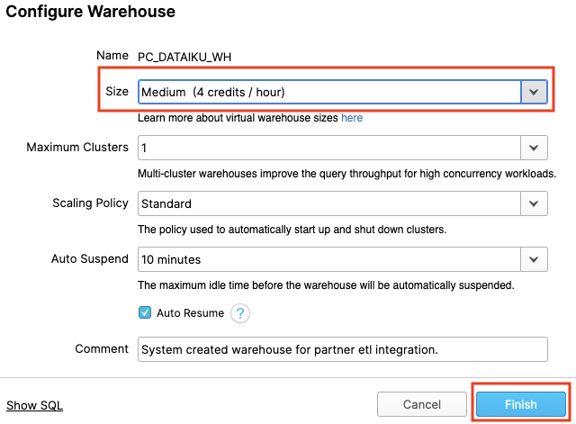

<!-- ------------------------ -->

## Creating and Running a Dataiku Project

Duration: 20

For this module, we will login into the Dataiku hosted trial account and create a Dataiku project.

Positive
: **Completed Sample Project** <br> We have added a fully finished example of the **COVID-19** project that we will create in this lab and it’s available to you as soon as you log in (along with another example project predicting **Flight Delays** - see screenshot below).

### Creating a Dataiku Project

Go back to your Dataiku Cloud instance. Click on **OPEN DATAIKU DSS** to get started.


Once you’ve logged in, **click** on **+NEW PROJECT** and **select Blank project** to create a new project.

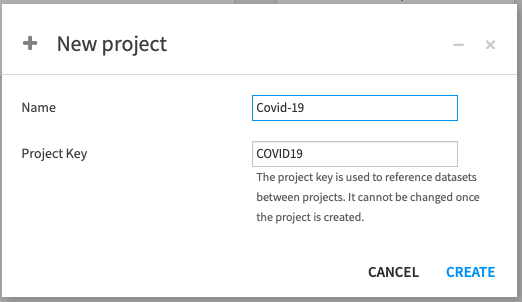

Name the project **Covid-19** as we’ll be working with COVID-19 data.

Note that the Project key will be automatically populated when creating a name, but you’re free to change it directly.

Success! You’ve now created the COVID-19 project.

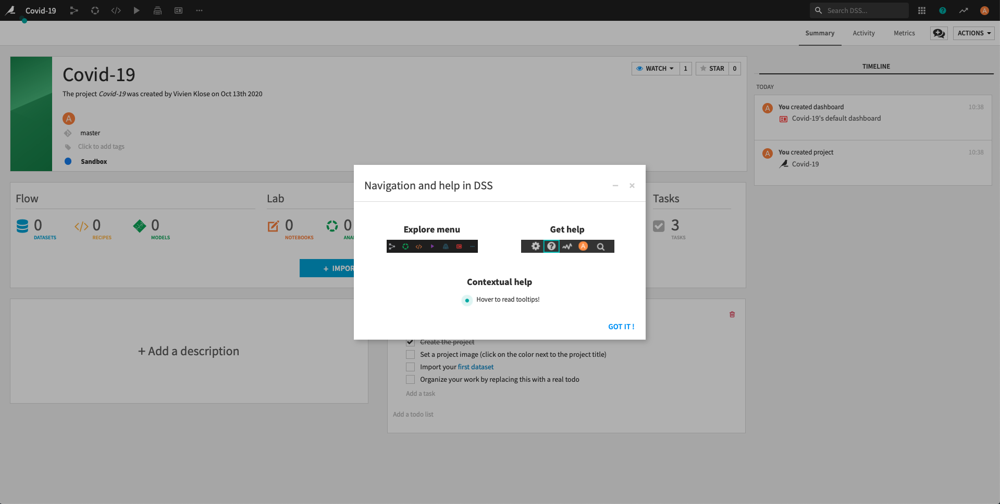

Click on **Got it!** to minimize the pop-up on **Navigation and help in DSS** and return to the project home screen.

Review the Dataiku DSS page. There are a few things to note from the project landing page on an example project:

- The project name, image associated with the project, collaborators, and optional tags:


- The number and types of objects in the project.


- A description of the project written in markdown, can link specific Dataiku objects (e.g., datasets, saved models, etc.) in the description:

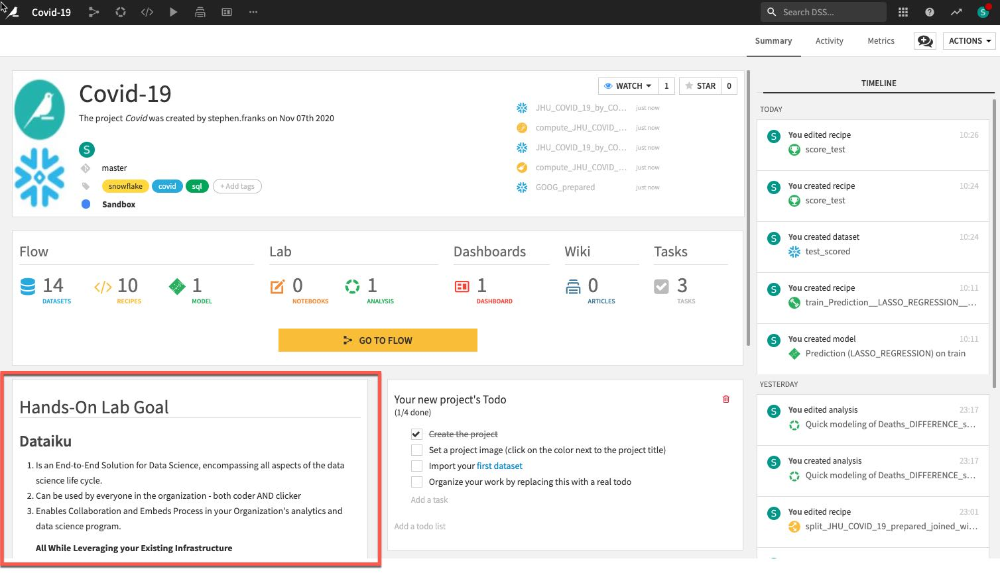

- Summary of project (history is saved in a git log) as well as a Chat function for better collaboration:

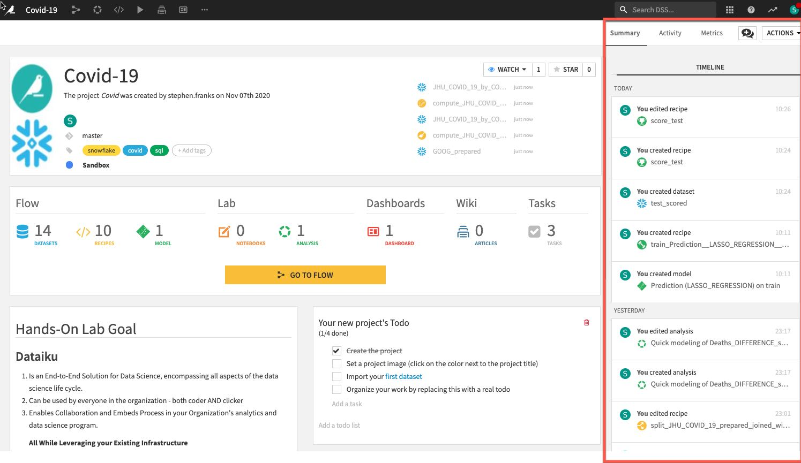


### Import Datasets

Import **JHU_COVID_19** and **GOOG_GLOBAL_MOBILITY_REPORT** datasets

Click on **+IMPORT YOUR FIRST DATASET**


Under SQL, select **Snowflake**


To load the JHU table, type in **JHU_COVID_19** (ALL UPPERCASE) under Table and **PUBLIC** under Schema. Then click **TEST TABLE** to test the connection:


If successful **click** **CREATE** to create the table:

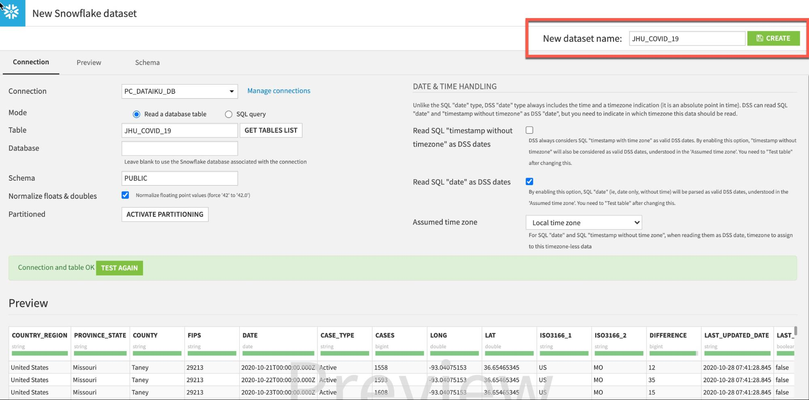

Return to the flow by clicking on the **flow** icon in the top left *(keyboard shortcut G+F)*:

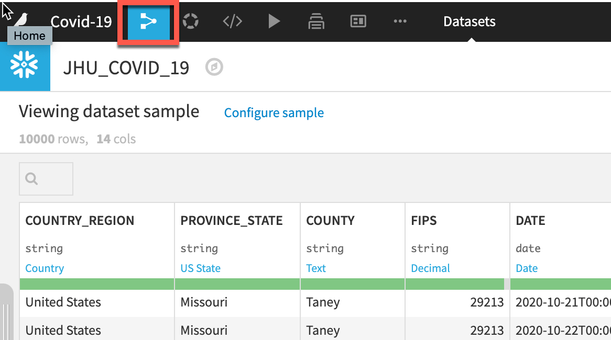

Repeat the steps to load the **GOOG_GLOBAL_MOBILITY_REPORT** table:

From the flow click **+Dataset**


Point to **SQL databases** then **Snowflake**:

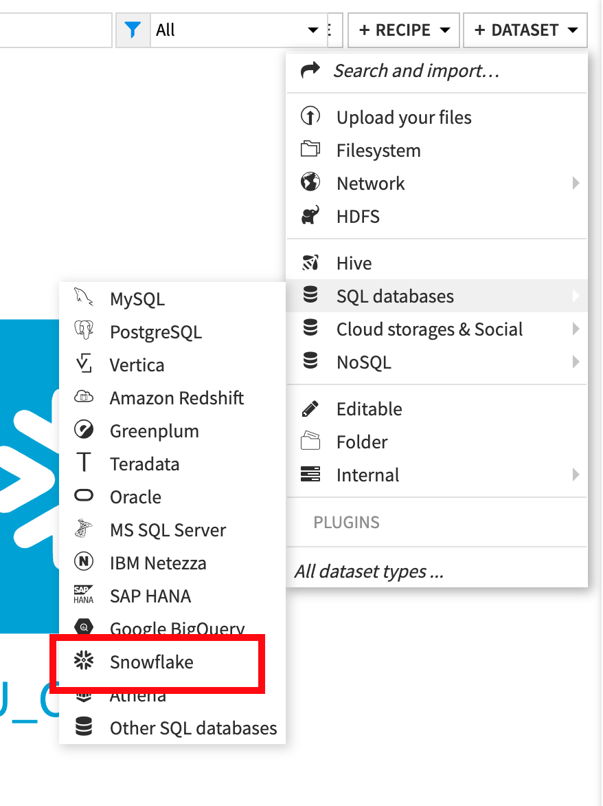

Type **GOOG_GLOBAL_MOBILITY_REPORT** (ALL UPPERCASE) under Table and **PUBLIC** under Schema:

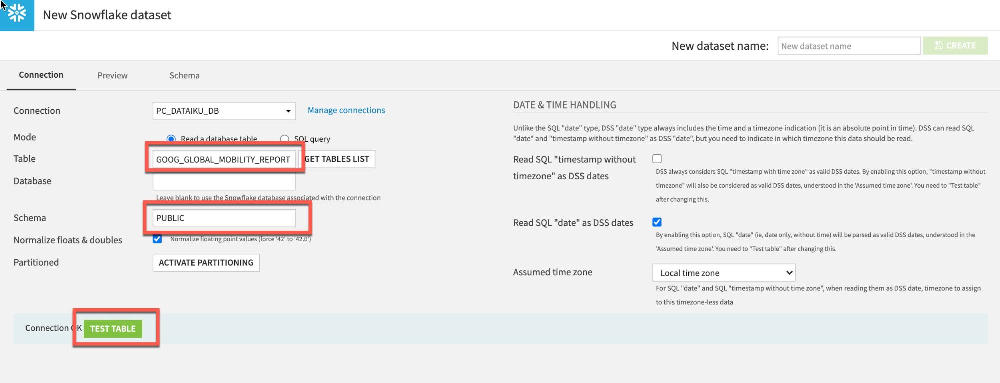

Click **Test Table**, then click **Create**:

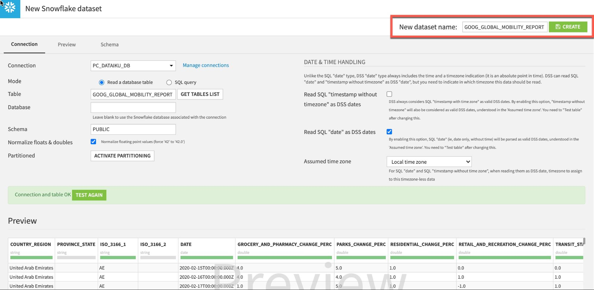

Go back to flow (keyboard shortcut G+F). Your flow should now look like this:


Double click on the **JHU_COVID_19** dataset


The **JHU_COVID_19** table contains data on a location and day basis about the number and types of cases (Active, Confirmed, Deaths, Recovered) that day.

Dataiku reads a sample of 10000 rows by default. The sampling method can be changed under **Configure Sample** but for this lab we can leave it as the default:

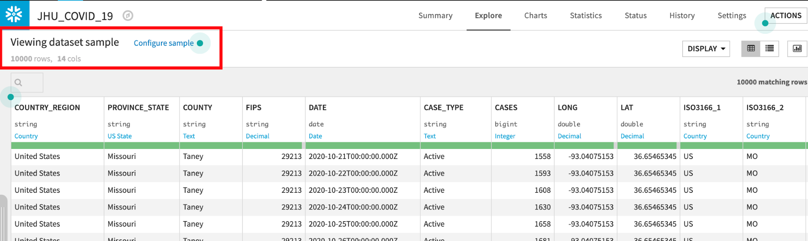

Dataiku automatically detects data type and meaning of each column. The status bar shows how much of the data is valid (green), invalid (red), and missing (grey). You can view column Stats (data quality, distributions) by clicking **Quick Column Stats** button on the right:

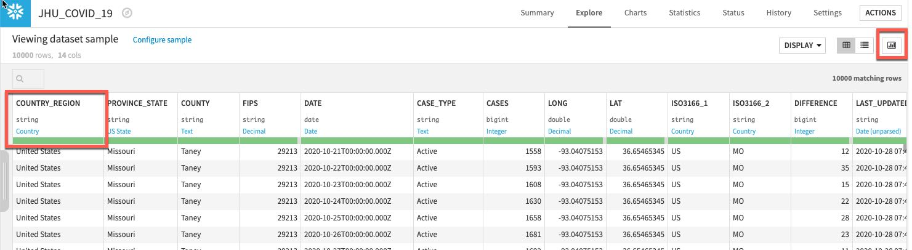

Click the **close** button when you are finished:

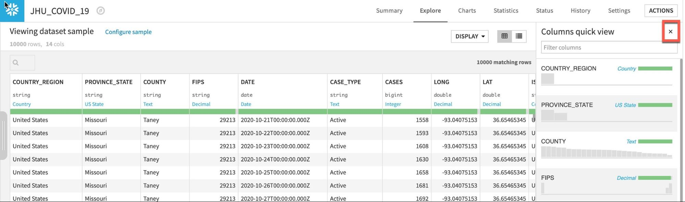

If you would like a deeper view click on a column name, then select **Analyze** to see column-level statistics (of the sample!)


Navigate back to the flow. As a reminder you can always do this simply by clicking the **Flow** menu item in the top left corner or by using one of the many keyboard shortcuts G+F.

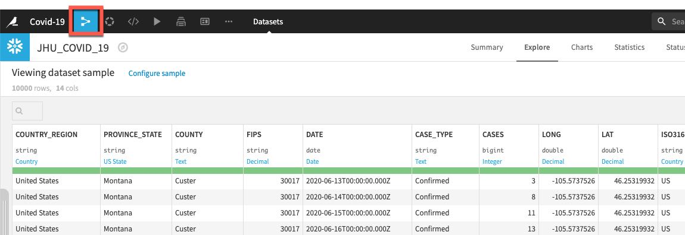

You should now see your two datasets in the flow once more:


Explore the **GOOG_GLOBAL_MOBILITY_REPORT** dataset by double clicking from the flow:

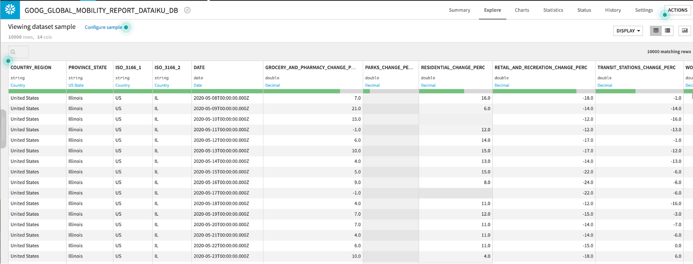

The **GOOG_GLOBAL_MOBILITY_REPORT** table contains data on a location and day basis about the percent change in movement across several categories (grocery stores and pharmacies, parks, etc.) More information about this dataset is [here](https://www.google.com/covid19/mobility/).

Navigate back to the flow. Either by clicking the **Flow** menu item in the top left corner or by using the keyboard shortcut G+F.

### Data Preparation

**Group.** We’ll start by performing some simple aggregations on our two datasets. This will help us understand changes in mobility and new cases of COVID-19 across geographic regions. To do that we’ll use the **Group** recipe.

Single click the **JHU_COVID_19** table and then select **Group** under Visual recipes on the panel on the right:

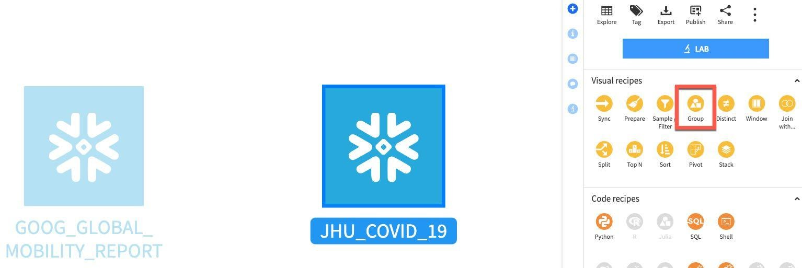

Select **COUNTRY_REGION** in the **Group By** dropdown, Click **Create Recipe**:


We’ll want to add some additional keys to group on.

In the top section **Group Keys** use the **Select key to add** dropdown followed by the **ADD** button to add grouping keys for **PROVINCE_STATE**, **DATE** and **CASE_TYPE**

In the same section uncheck the **Compute count for each group** option in the centre of the screen as we don’t require this stat.

We’d like to see new cases so in the main **Per field aggregations** section locate the field **Difference** add the aggregation **Sum.**

Your screen should now look like this:


There are four case types in the John Hopkins data but we only want to use and predict using Deaths and Confirmed.  So, we will filter out Active and Recovered records.  We will also filter out the problematic Peru data as discovered in the previous section.  
To do this: 
- Select Pre-Filter on the left of your Group recipe screen. 
- Toggle the Filter on and specify in the dropdown to Keep only rows that satisfy: ‘all the following conditions'
- Select CASE_TYPE in the dropdown, then ‘is different from’ then enter Recovered
- Click on the + Add A Condition button and select CASE_TYPE again in the dropdown, then  ‘is different from’ then enter Active
- Click on the + Add A Condition button and select COUNTRY_REGION in the dropdown, then  ‘is different from’ then enter Peru

Positive
:  Note: These values are case sensitive so ‘recovered’, ‘active’ and ‘PERU’ would not work correctly.  Also, in the step above be sure to select ‘all the following conditions’ rather than ‘all the following conditions column’

Your screen should now look like this:

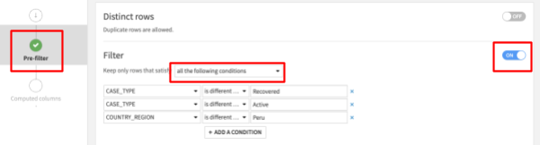

Then click **RUN** on the bottom left to execute the recipe - make sure the compute engine is **In-database (SQL)** to push computation down to Snowflake (click the three cogs to change if required).


Since we are making changes to the schema we will receive a warning of this, go ahead and click **Update Schema.**


The job will run and if all went well you will receive a **Job Succeeded** message at the foot of the page:

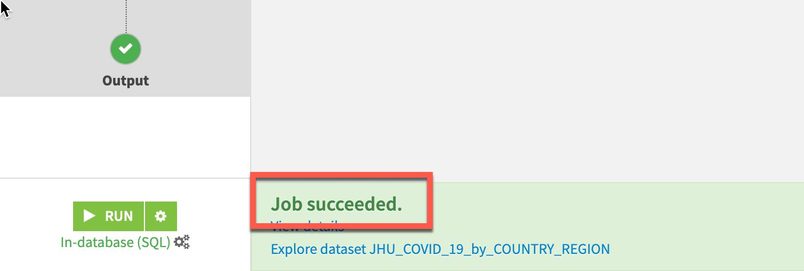

**Return to the flow** either by **clicking the Flow icon** in the top left or **press G + F on the keyboard:**

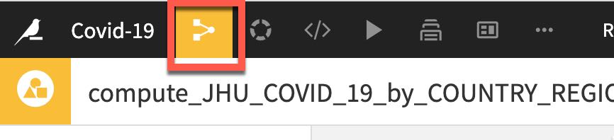

We will now aggregate on the Mobility dataset from Google. From the flow **single click** on **GOOG_GLOBAL_MOBILITY_REPORT** and select **Group** from the Visual Recipes. **Group by** **COUNTRY_REGION** and click **Create Recipe**.


In the **Group** stage of the recipe add **PROVINCE_STATE** and **DATE** as additional grouping keys in the same way as previously.

Either individually or using the mass **Actions** button check the following:

* **GROCERY_AND_PHARMACY_CHANGE_PERC**
* **PARKS_CHANGE_PERC**
* **RESIDENTIAL_CHANGE_PERC**
* **RETAIL_AND_RECREATION_CHANGE_PERC**
* **TRANSIT_STATIONS_CHANGE_PERC**
* **WORKPLACES_CHANGE_PERC**

Your screen should now look like this:

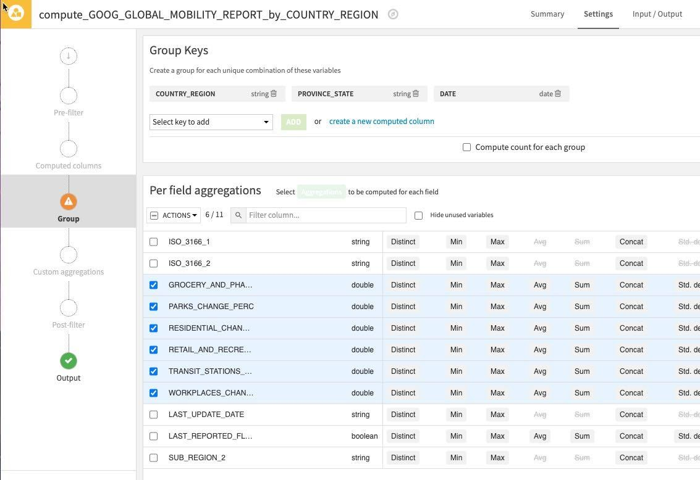

Click the **Actions** Dropdown and apply **Avg** to your six selected columns. As before **uncheck** the **Compute count for each group** since we don’t need this.


Then click **RUN** on the bottom left to execute the recipe - make sure the compute engine is In-database (SQL)


As before we are making changes to the schema we will receive a warning of this, go ahead and click **Update Schema** and once you have explored your new aggregated dataset.

**Press G + F to return to the flows screen**.

The **JHU_COVID_19** table includes a column for case type and the difference summed from the previous row that we grouped by country regions, state, date and type in our earlier step.

However, we’d like to change the data format so that case type and difference are their own separate columns (i.e. Confirmed & Deaths are separate columns). We can do this with a **Pivot** recipe.

From the flow single click the **JHU_COVID_19_by_COUNTRY_REGION** and then select **Pivot**:


In the dropdown **Pivot By** select **CASE_TYPE**.

Click **CREATE RECIPE**:


You should see this screen:

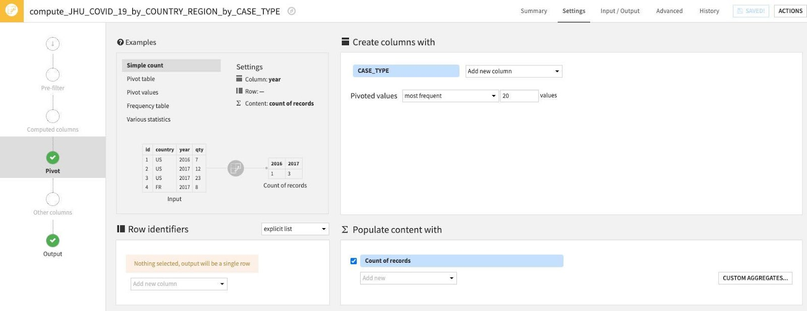

First, let’s use one of the examples from the top left **Examples** box. Select **Pivot Table**.

Then select some Row identifiers. These are columns that will be retrieved as is in the output table. Click "Add new column" under **Row identifiers**.

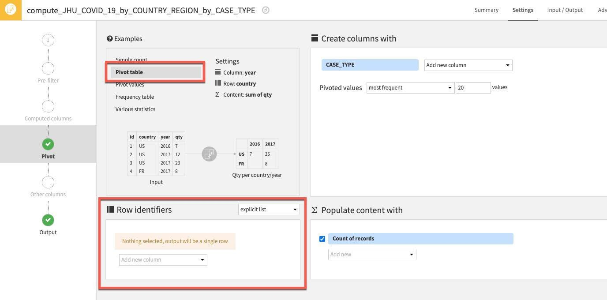

Select the following columns: **COUNTRY_REGION**, **PROVINCE_STATE** and **DATE**

(Note: The order you add the row identifiers here simply reflects the order the columns will appear in the output dataset. Although not strictly important if you wish your project datasets to mirror the ordering of the ones in this guide stick to the order below)


Next, the section **Populate content with** will define the values that go under the new columns with **CASE_TYPE**. There are a number of options for aggregations - count of values, min, max, etc.

First, **deselect** the **Count of records**:

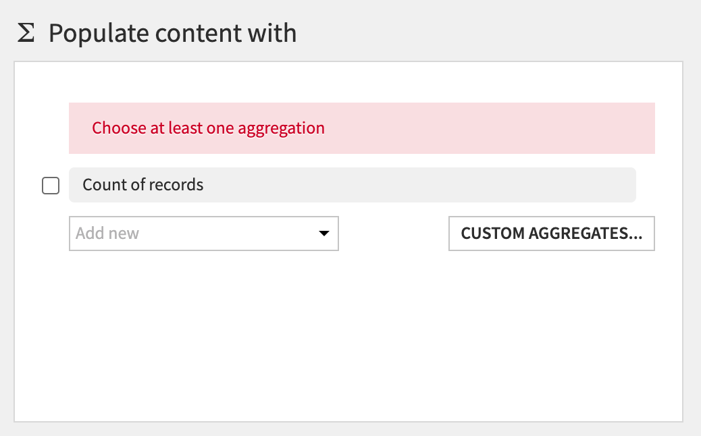

Then click on the **Add new** dropdown.

We only have one value here so select **Difference_sum**. The default aggregation is **count** which we do not want. To change this click the **down arrow** to the left of count:

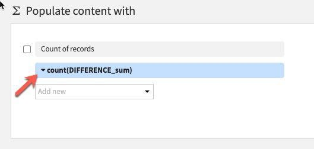

Under **Aggregation** instead of Count, select **Min**.


You should now have the following settings. Go ahead and **RUN** the Pivot recipe

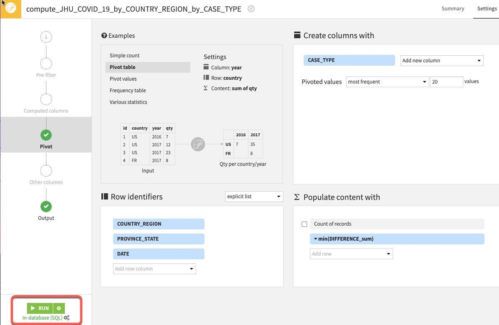

Explore your new dataset to make sure the new columns have properly been created by returning to the flow and double clicking the new dataset.

We can see we have our new columns for types of case (**Confirmed** and **Deaths**) and also see there is quite a lot of missing data for **PROVINCE_STATE**. We’ll address that in the next section.

If you have time it’s also worth **left clicking** on the **Deaths_DIFFERENCE_sum_min** column and selecting **Analyze**. What do you notice about the data distribution? It seems there is a pretty big outlier (run on **Whole data** rather than **Sample** if you do not see it). Again that is something we will want to address in the next section.

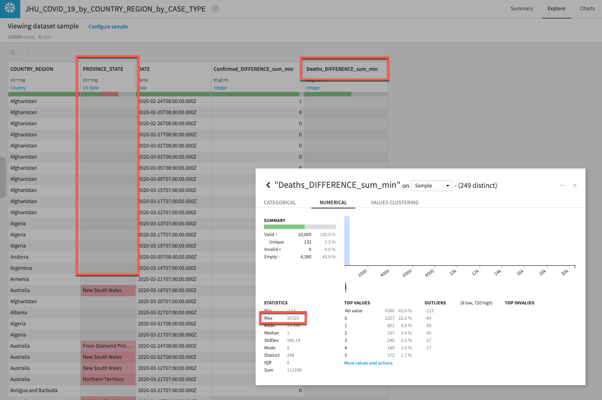

**Return to the flow** and at this stage your project flow should look like this:


Whilst the recipes we have used so far such as grouping and pivots perform a given task and are likely already familiar to you, the Prepare recipe is a little different. Think of it like a tool box but instead of having tools for DIY like hammers, chisels and tape measures we have tools for data cleansing, normalization and enrichment. In DSS terminology we call those ‘tools’ processors and in the Prepare recipe you use them in a visual and interactive way.

There are a wide range of processors we can use in the Prepare recipe and we are going to use a few of the simplest ones to help us with our missing data.

From the flow **click** on the grouped and pivoted JHU dataset, then select the **Prepare** recipe:


We can see that the automatically generated output dataset name is starting to get a little unwieldy after a few transformations.


Let’s **trim** that to **JHU_COVID_19_prepared** and then click **Create Recipe**.


We’d like to handle the missing data in our **PROVINCE_STATE** column, there are many ways the Prepare recipe can help with this and we are going to use probably the simplest technique of all and fill empty rows.

**Left click** on the column title **PROVINCE_STATE** then **select More actions** and **Fill empty rows with…**


In the break out box simply type **NA** and click **OK**.


The step gets added to the left. Next we’ll remove rows if **COUNTRY_REGION** or **DATE** is empty.

As well as context sensitive options like we just used you can also access the full library of processors.

**Click** on the **+ADD A NEW STEP** button. There are a lot of options here so select **Data Cleansing** from the Processor library and select **Remove rows where cell is empty** processor (you can also use the search box when you may not be sure where a processor lives or wish to explore what options are available for a given task).

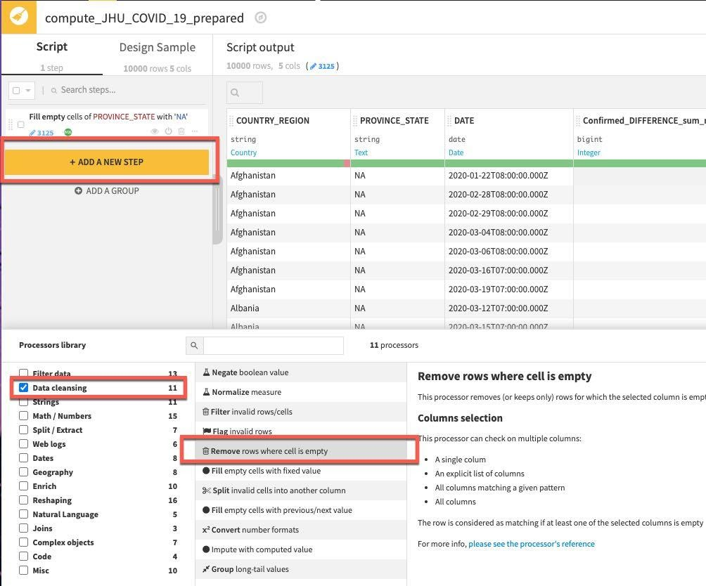

In the step created on the left select the **multiple** column option and click the **+ADD A COLUMN** button to first add **COUNTRY_REGION** and then add the **DATE** column.

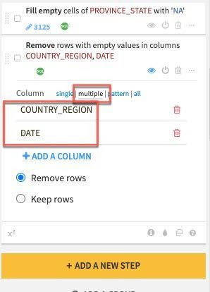


Finally let’s address the outlier we found when we analyzed the **Death_DIFFERENCE_sum_min** column after we pivoted.

**Click** the **+ADD A NEW STEP** button again to bring up the processor library. This time **check** the **Filter Data** section and **select** the **Filter rows/cells on value** processor. **Set** the action dropdown to **Remove matching rows**, the column to **DATE**, **click** the blue **+ADD VALUE** option and enter a date of **2020-08-31**

**NOTE:** We are working on a live dataset that is regularly updated and amended, if errors such as this have been purged from the JHU dataset feel free to skip this step.

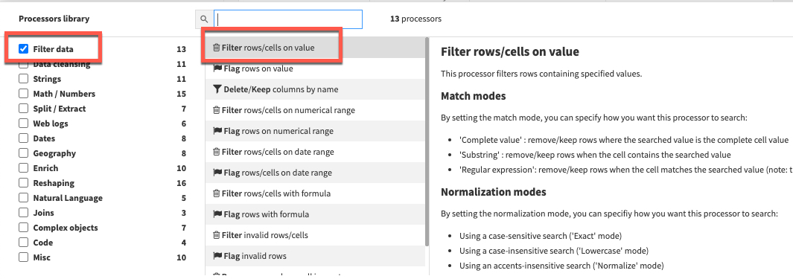


Before running the recipe **check which execution engine** will be used. If it is set to **Local stream** then **click on the three cogs** and **select In-database (SQL)** and click **RUN** to push the computation to Snowflake.


**Press G + F to return to the flows screen**

We want to perform the same simple data cleaning steps on our grouped Google Mobility data. Rather than repeat the process simply **single click** on the previously created **prepare recipe** in the flow and select **Copy** from the **Actions menu** on the right.

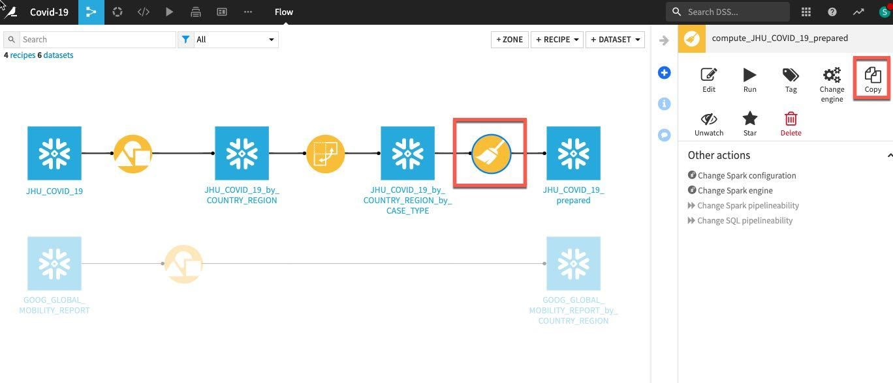

In the copy break-out box **click the drop down box** under **Replacement for** and find our earlier grouped mobility dataset **GOOG_GLOBAL_MOBILITY_REPORT_by_COUNTRY_REGION** (NOTE: make sure you select this dataset and **not** the original GOOG_GLOBAL_MOBILITY_REPORT)

We need to type an output name, call the dataset **GOOG_prepared** and click **Create Recipe**:

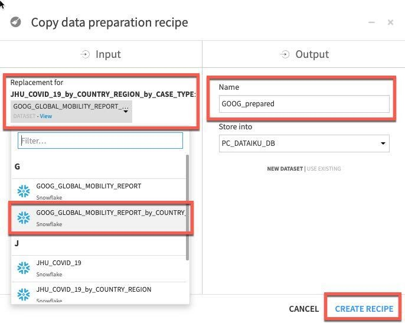

Click **RUN** to execute the copied recipe and select **Update Schema** when prompted.

Now that we’ve applied our transformations, let’s join the **JHU** and **GOOG** tables.

**Press G + F to return to the flows screen**

**Left click** on **JHU_COVID_19_prepared** then **hold down the shift key** and also **left click** on **GOOG_prepeared**. This will update the visual recipes in the right hand panel to only those applicable to multiple datasets. Choose the **Join** recipe.

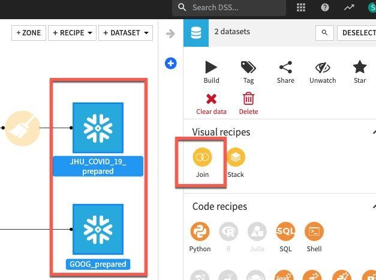

**Click** on **CREATE RECIPE.**


Dataiku automatically detects potential keys to join on. The default join type is a **Left Join**. We want to change this to an **Inner join** so we only keep matches. To change the join type and conditions, **click** on the **= sign** between one of the keys.


**Select Join Type**, then **select Inner Join** and then **Close**.

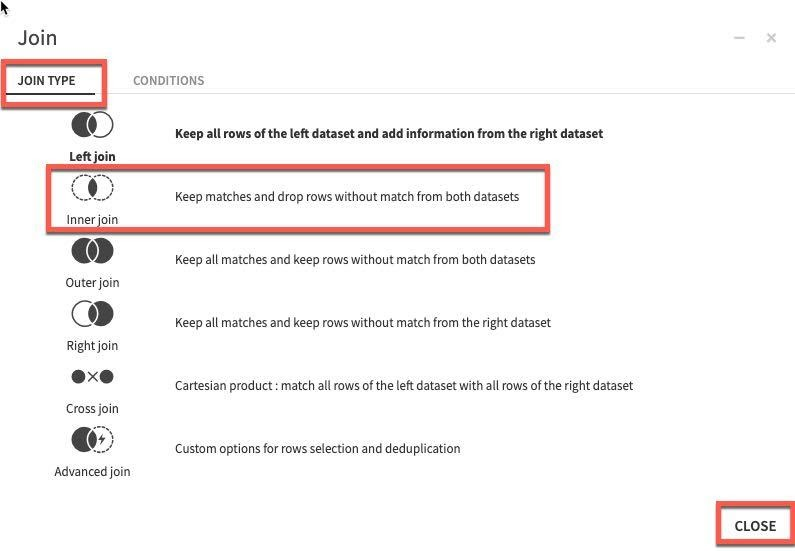

Accept the remaining defaults and click on **RUN**.

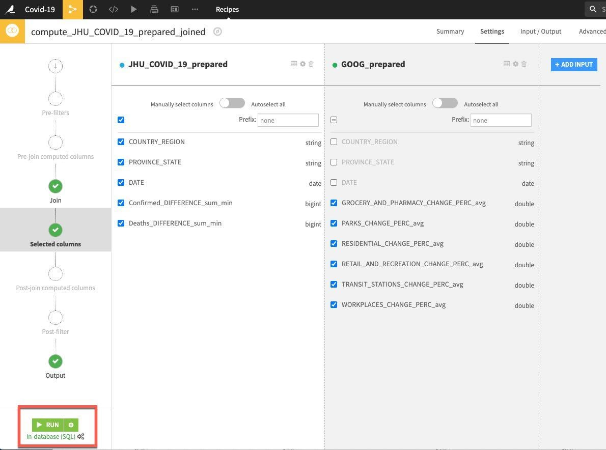

Now we have explored, cleaned, aggregated and joined our data, we now want to create some features. We’d like to compute some lag features to see if past trends can help predict future ones when we start modelling. We can use the **Window** recipe for this (and much more).

A window function performs a calculation across a set of table rows that are somehow related to the current row. This is comparable to the type of calculation that can be done with an aggregate function. But unlike regular aggregate functions, use of a window function does not cause rows to become grouped into a single output row — the rows retain their separate identities.

In other words, unlike the Group recipe we used earlier, a Window recipe does not reduce the number of rows in a dataset. It creates new columns in a dataset that are the results of computations that use all rows in a “window”, that is, a subset, of all rows of the dataset.

**Press G + F to return to the flows screen**

**Click** on the **JHU_COVID_19_prepared_joined** dataset, then the **Window** recipe. In the **New window recipe** screen accept the defaults and **click CREATE RECIPE**:

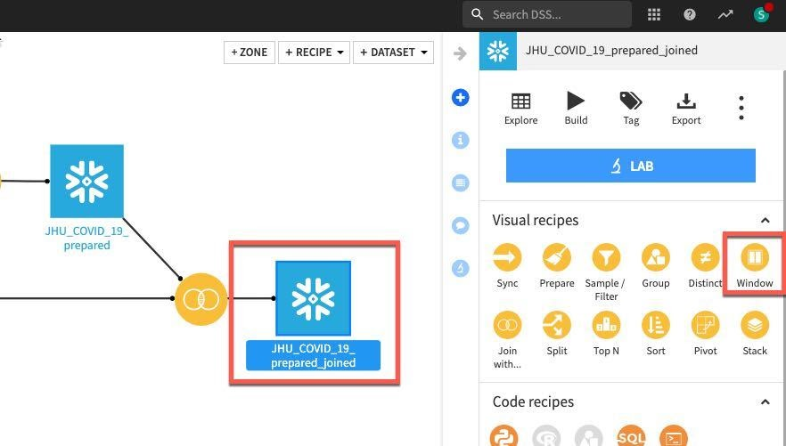


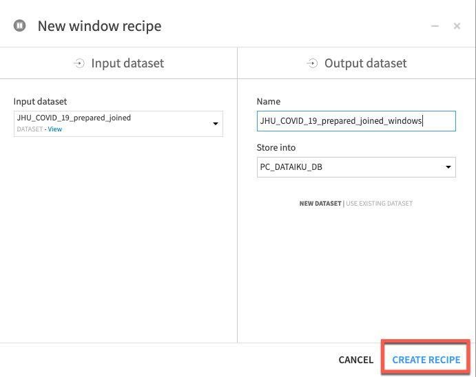


Under **Window definitions**, **toggle on Partitioning Columns** then **select COUNTRY_REGION** and **PROVINCE_STATE**. As we are creating historical lag variables lets go ahead and **toggle on Order Columns** and select **DATE**:

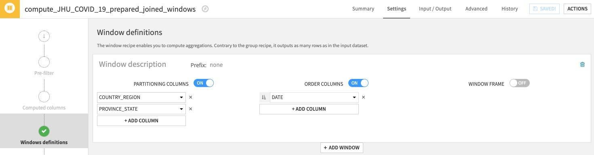

**Click** on the **Aggregations** step on the left and **select all columns** **except the ones we used for partitioning and ordering (COUNTRY_REGION, PROVINCE_STATE and DATE)**. Rather than individually select each aggregation **click the down arrow** on the **Action** button to perform a mass action.


**Retrieve** is already selected, check **Value in a previous row** and **enter 1,2,7,14 in each lag box** (this last step will need to be done individually). This gives us the previous day's value, the day before, one week and two weeks ago.


**RUN** the recipe (make sure the engine is **In-database** and **Update Schema**). Also note all the new columns (features) this recipe is creating in the schema changes dialog box.


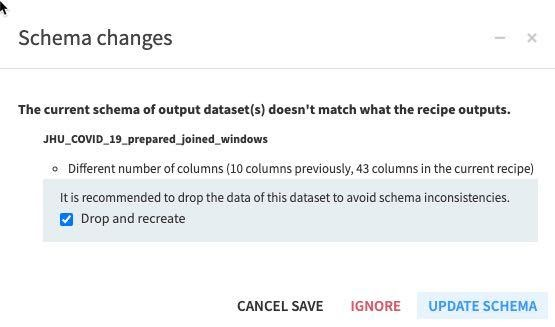

**Press G + F to return to the flows screen**

**Flow Check:** Your flow should look like this:

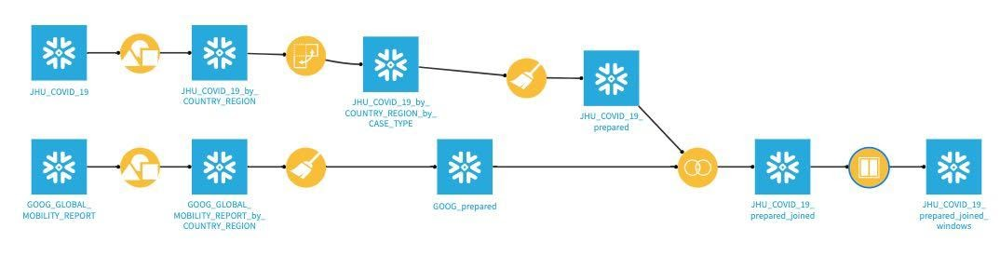

### Optional Data Preparation Steps

There are plenty of additional data prep steps that we do not have time to cover today. For example:

1. Normalize numerical features (either in a visual Prepare recipe or SQL recipe)
2. Create additional features in the Window recipe
3. Many more - feel free to explore outside of this lab!

### Machine Learning

Before applying a machine learning model, we will split the data by:

1. 80% of data → train
2. 20% of data → test

**Select the joined dataset** and then the **Split** recipe:

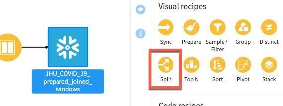

**Click ADD** to specify the two datasets (train and test):

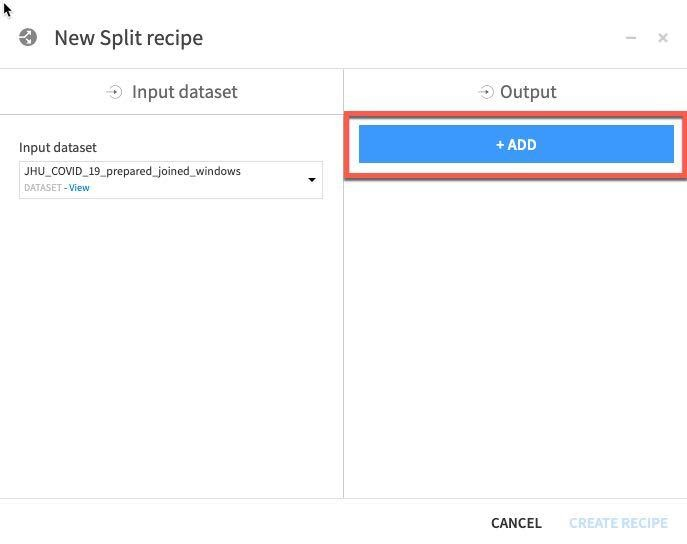

Name one of the datasets **train** and then click **CREATE DATASET**:

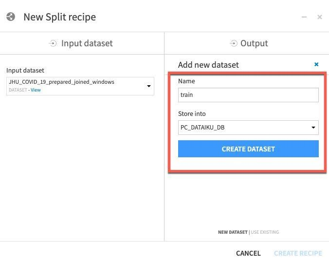

Repeat for test - click **ADD**, then name dataset **test**, then click **CREATE DATASET**.

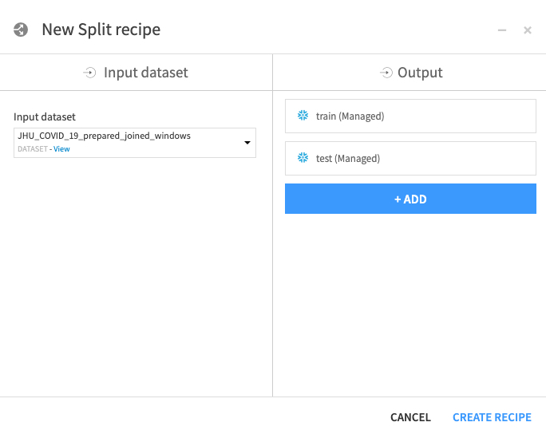

Once you’ve created both datasets, click **CREATE RECIPE:**

For splitting method, **select Dispatch percentiles of sorted data**:

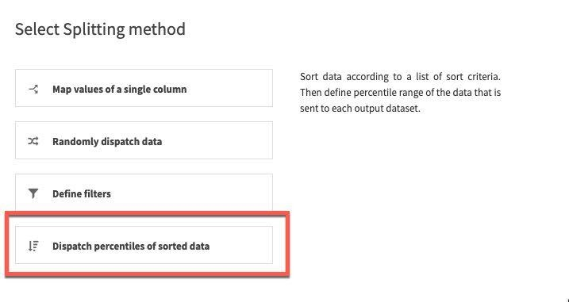

**Sort by date** and specify a standard 80/20 split for train/test:

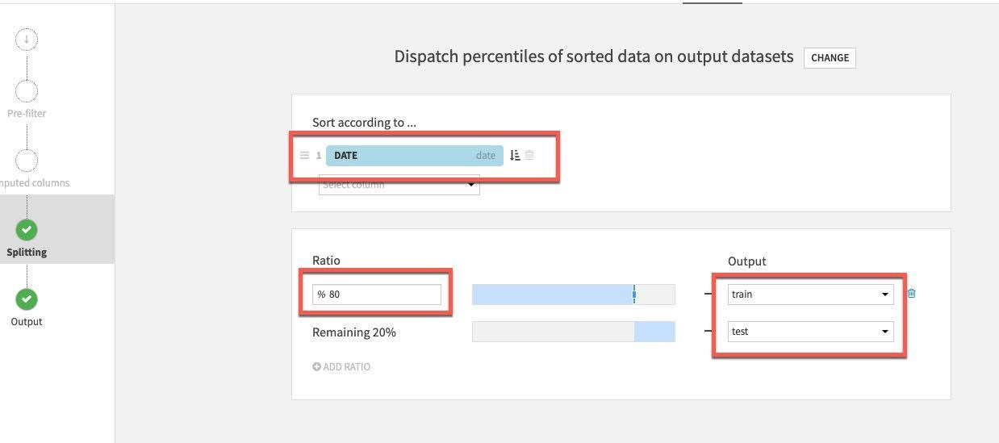

Finally select the **Pre-Filter** stage. We only want to keep rows where the death difference is greater than zero so **toggle on Filter**, then **select Deaths_DIFFERENCE_sum_min** and specify is greater than **(>) 0**.

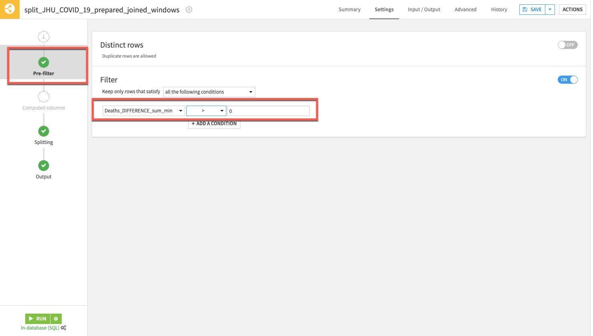


**RUN** the Split recipe:


Now we will start our modeling. As a reminder we are looking to use our historical data and the features we created in the flow to try to predict changes in death rates.

**Press G + F to return to the flows screen**

From the flow **single click** the **train set** and then click **LAB**:

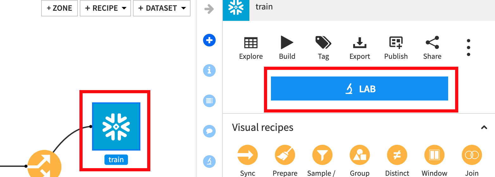

Select AutoML Prediction:

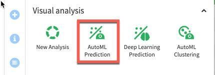

**Select** our target variable **Deaths_DIFFERENCE_sum_min**, then select **Quick Prototypes** and **Create**:


**Select** the **DESIGN** tab to configure your model training parameters. Under the **Train/Test Set** section on the left of the screen, **enable TIME ORDERING** and set **DATE** as the time variable. Since we are not working with a huge dataset we can go ahead and set the **Sampling Method** to **No Sampling (whole data)**:


Next select the **Features Handling** section. This is where we can toggle features (should they be used during machine learning? How should variable type be handled if it is used?). For our prediction we will work with just numerical data so let’s **toggle off COUNTRY_REGION, PROVINCE_STATE and DATE**. The remaining numerical features can remain as set allowing for rescaling prior to training.

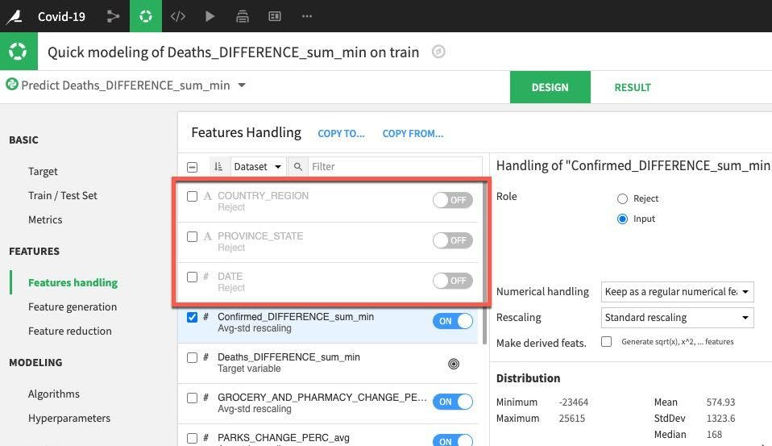

Finally select the **Algorithm** section. We have many options here but let’s concentrate on some simple regression and **toggle on** only **Ridge Regression and Lasso Regression**. Once done, **click** on the **Train** button (top right) to train the models.

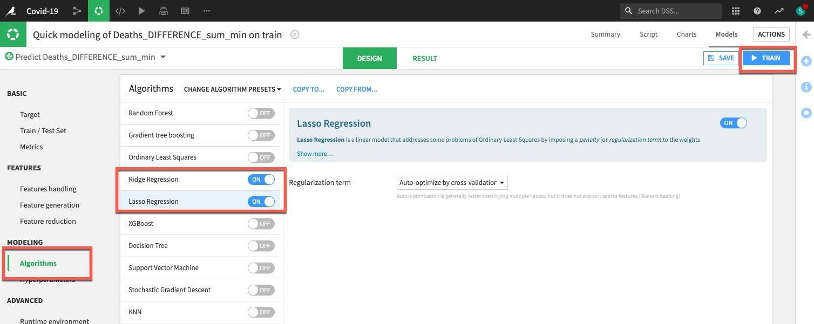

You can optionally name your training session and give a description or just leave blank. **Click Train** again.

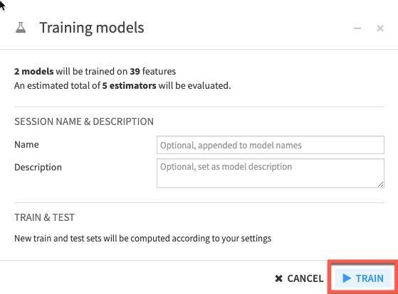

DSS will spin up resources and train the model(s) in line with our design settings. For the first session we can see that the Lasso regression outperformed the Ridge regression in regards to the metric we’re evaluating for (R2 score in this case where the closer to 1 the better).

**Drilldown** into the details of the best performing model either by **clicking** on its name in the **session window** or the **results window:**

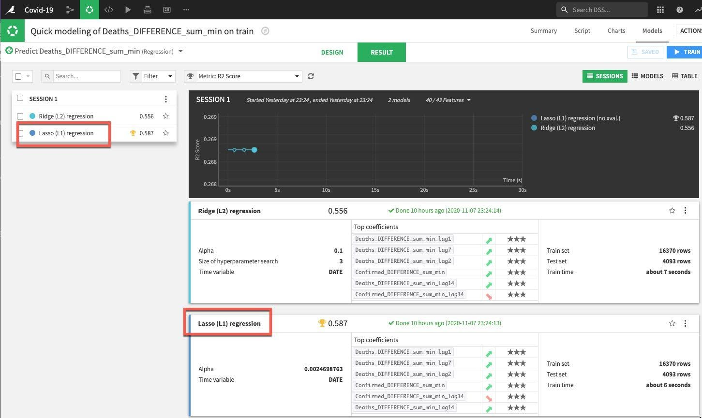

We have a number of tools and visualizations here to help us both interpret the model and better understand its performance. Let’s take a look at the coefficients by **clicking** on the **Regression coefficients** option on the left under the **INTERPRETATION** menu, perhaps unsurprisingly recent deaths are important but so too are residential changes for the training session run.

**Note:** When in the model summary screen, if you ever wish to return to your model training and design screen just **click** on **Models** at the top.


Under the **Performance** section on the left hand menu **click** on **Scatter Plot**:

If the model was perfect all the points would be on the diagonal line. This would mean that the predicted values are exactly equal to the actual values. The points below the line are underestimates, above the line are overestimates. Your general aim is to minimize the distance from the points to the diagonal.

This example could be improved on, but is reasonable for a first run:


Let's also **click** on **Subpopulation analysis** which is under the **Interpretation** menu. This can be useful for assessing if our model behaves the same across different subpopulations. In our case let's analyse by country. **Select COUTRY_REGION** from the **dropdown** and click **COMPUTE**. In my example we can see that while the model performed well on data for the US, Mexico, and India it did not do so well in many other countries.


This is something we would certainly want to explore further and we would now begin an iterative process of experimentation/refinement to understand and improve our model so feel free to work on your model (and data flow) after the lab but for now lets go ahead and deploy our model.

**Click** on **DEPLOY** button on the top right and then accept the defaults and **click CREATE**:


Now our model is deployed to our flow:

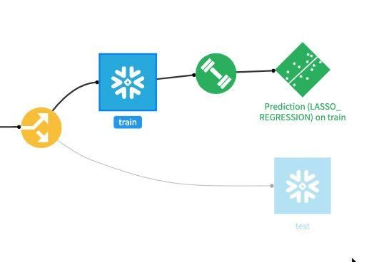

For our final task we will score our deployed model against our test dataset to evaluate model fit. **Single click** on the **model** in the Flow and then **select Score** from the **actions menu**:

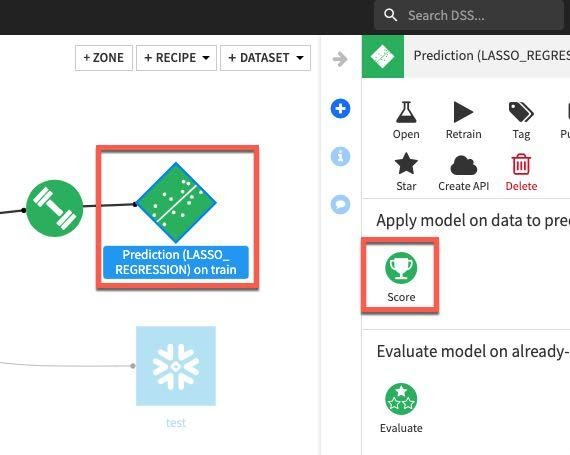

Apply our **test dataset** as the **Input dataset** and **click Create Recipe**:

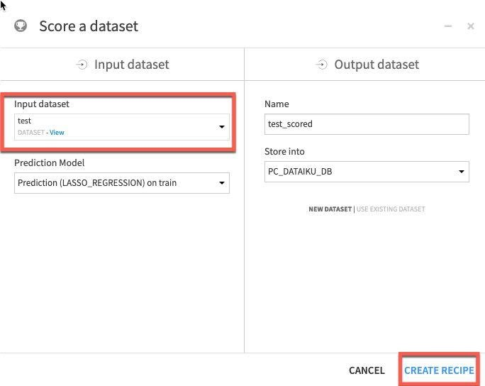

Finally ensure your execution engine is set to **In-Database (SQL) and Run**.

Congratulations! You have built and scored your model.

<!-- ------------------------ -->

## Reviewing Dataiku Predictions in Snowflake

Duration: 5

Now we’re going to look at the Snowflake table where we’ve written the predictions.

Switch back to the Snowsight Tab and set the context by running:

```sql
use role sysadmin;
use warehouse compute_wh;
use database pc_dataiku_db;
```

Now run the following SQL to see the scored data from the Dataiku model written back to Snowflake. Your table name will be something like this:

```sql
show tables like '%scored%';
select * from "COVID19_TEST_SCORED_space-3a316aed-dku_node-df3ee930";
```

Use the name returned from the ‘show tables’ command and paste in the select statement.

Now we can view the data on a chart from our results:

```sql
Add Column and select ‘Country_region’
```


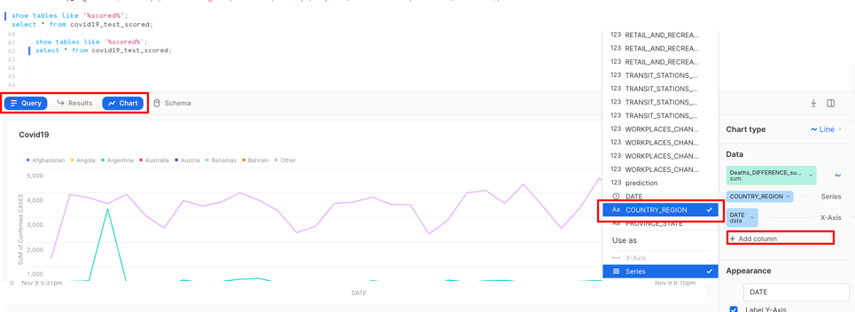

### Create an Environment for the Testing Team via Cloning

Snowflake allows you to create clones, also known as “zero-copy clones” of tables, schemas, and databases in seconds. A snapshot of data present in the source object is taken when the clone is created, and is made available to the cloned object. The cloned object is writable, and is independent of the clone source. That is, changes made to either the source object or the clone object are not part of the other.                                                                                

A popular use case for zero-copy cloning is to clone a production environment for Development & Testing to do testing and experimentation without (1) adversely impacting the production environment and (2) eliminating the need to set up and manage two separate environments for production and Development & Testing.

Positive
: **Zero-Copy Cloning FTW!** <br> A massive benefit is that the underlying data is not copied; just the metadata/pointers to the underlying data change. Hence “zero-copy” and storage requirements are not doubled when data is cloned. Most data warehouses cannot do this; for Snowflake it is easy!


Let's return to the old UI and select the worksheet Covid19.


Run the following command in the worksheet to create a development (dev) database.

```sql
use role sysadmin;
use warehouse compute_wh;
    use database pc_dataiku_db;
    use schema public;
    create database dataiku_test_db clone pc_dataiku_db;
```

If closed, expand the database objects browser on the left of the worksheet.  Click the small Refresh button in the left-hand panel and expand the object tree under the DATAIKU_TEST_DB database.   

Check that you can see a new table under the DATAIKU_TEST_DB database.  The development team now can do whatever they want with these tables, including even deleting without having any impact on the production tables or any other objects.

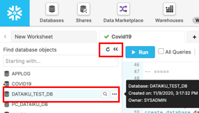   

<!-- ------------------------ -->

## Using Time Travel

Duration: 5

Snowflake’s Time Travel capability enables accessing historical data at any point within a pre-configurable period of time. The default period of time is 24 hours and with Snowflake Enterprise Edition it can be up to 90 days. Most data warehouses cannot offer this functionality; with Snowflake it is easy!

Some useful applications of this include:

- Restoring data-related objects (tables, schemas, and databases) that may have been accidentally or intentionally deleted or updated
- Duplicating and backing up data from key points in the past
- Analyzing data usage/manipulation over specified periods of time

We will run through the following scenarios.
1: A user thinks that all testing is complete and decides to drop a temporary table. Unfortunately they drop the wrong table!
2: A user updates a table but forgets the where clause. The change is made to all rows in the table!
3: Create a clone of a table at a point in time
4: Roll back all changes made to a test table to refresh the table for testing

### Drop and Undrop a Table

First let’s see how we can restore data objects that have been accidentally or intentionally deleted.

Let's set the proper context:

```sql
use database dataiku_test_db;    use schema public;
```

Let’s find the name of the table we are going to work with:  

```sql
show tables like '%scored%';
```

From the results, you can expand the name column and copy the table name that will look something like ‘COVID19_TRAIN_space-3a316aed-dku_node-df3ee930’

To make life easier, we will rename this table. Run the following SQL:

```sql
Alter table “<table name from above>” rename to di_train;Example : alter table “COVID19_TEST_SCORED_space-3a316aed-dku_node-df3ee930” rename to covid19_test_scored;
```

From the worksheet, run the following command which will drop (remove) the covid19_train table:

```sql
drop table covid19_test_scored;
```

Now run a SELECT statement on the covid19_train table. In the “**Results**” pane you should see an error because the underlying table has been dropped.

```sql
select * from covid19_test_scored limit 10;
```

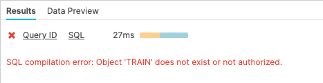

Now restore the table:

```sql
undrop table covid19_test_scored;
```

The covid19_test_scored table should be restored.


Now run a SELECT statement on the covid19_train table. In the “**Results**” pane you should see data because the underlying table has been restored.


    select * from covid19_test_scored limit 10;

### Roll Back a Table


Now let’s look at rolling back a table to a previous state to fix an unintentional DML error that replaces all the province_state names in the covid19_test_scored table with the word “oops.”

Run a query that returns the top 20 Locations - this is what it should look like before update:

```sql
select province_state as "Location", count(*) as "count"from covid19_test_scoredgroup by 1order by 2 desclimit 20;
```

Run the following command that replaces all of the province names in the table with the word “oops”.

```sql
update covid19_test_scored set province_state = 'oops';
```

Now run a query that returns the top 20 Locations - notice how we’ve screwed up the station names so we only get one row:

```sql
select province_state as "Location", count(*) as "count"from covid19_test_scoredgroup by 1order by 2 desclimit 20;
```

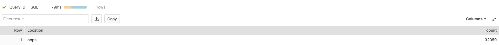

Normally, we would need to scramble and hope we have a backup lying around. But in Snowflake, we can simply review the history to find transactions that ran against the database. Let’s change the role in the main UI window to sysadmin:  

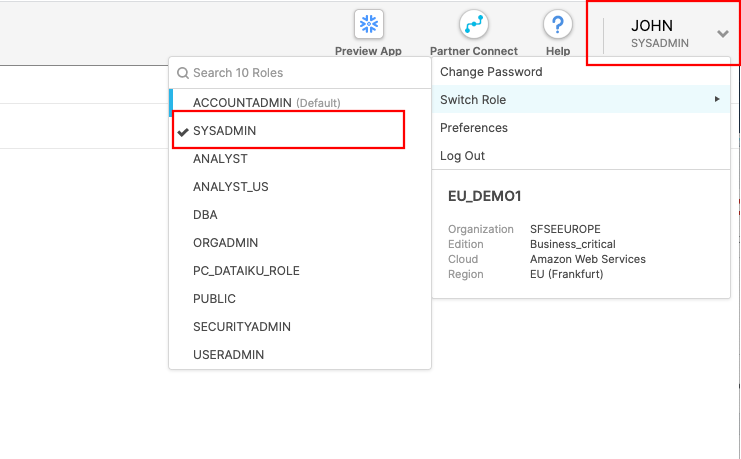

Click on the History tab:

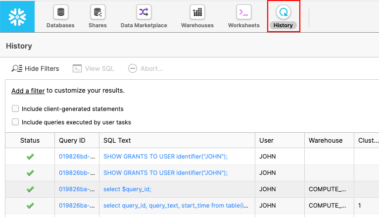

Here you can see all of the commands that you have run against Snowflake. Let’s find the command that caused the issue. If you see a filter go to 7.2.7.  

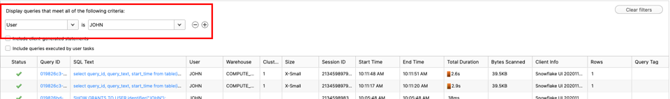

If you see no filter, please click 'Add a filter'  

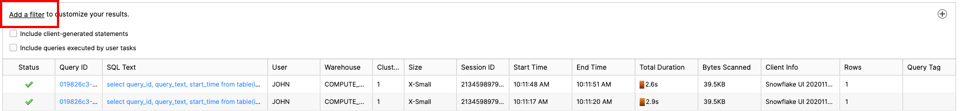

Change filter to ‘SQL Text’ and ‘oops’ like :  

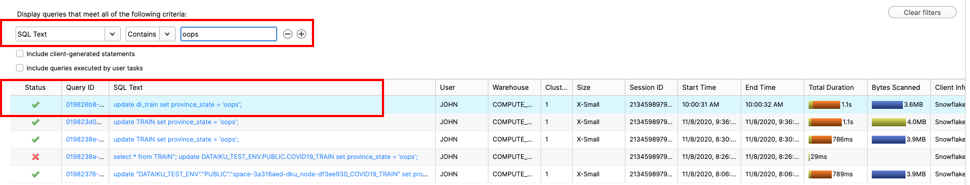

Click on the Query ID for the SQL that ran the incorrect update statement. Highlight the Query Id and copy to your clipboard:  

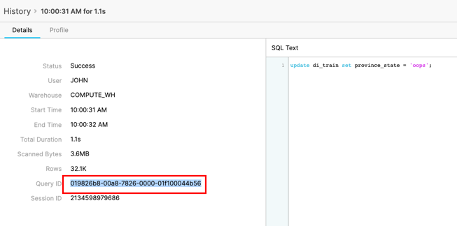

Before we make any changes, we can check to see if this transaction was the one that caused the issue. Run the following SQL replacing the Query Id that you copied earlier:  

```sql
select province_state as "Location", count(*) as "count" from covid19_test_scored before(statement => '01982883-0042-3ced-0000-01f1000463fe') group by 1 order by 2 desc limit 20;
```

Now that we have validated that this is the correct SQL, let's be safe and create a clone with the original values first, using the following SQL, again using the Query ID from earlier:  

```sql
create or replace table covid19_test_scored_rewind clone covid19_test_scored before(statement => '01982883-0042-3ced-0000-01f1000463fe');
```

Run the SELECT statement again to check that the province_state names have been restored in the newly cloned table:

```sql
select province_state  as "Location", count(*) as "Count"from covid19_test_scored_rewindgroup by 1order by 2 desclimit 20;
```

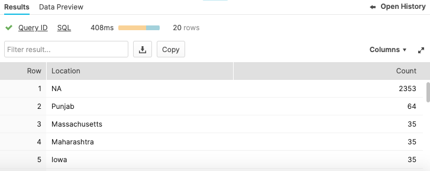

Now that we're happy the clone has the correct values, we will use another create feature in Snowflake and swap the 2 tables over. We will rename the newly created clone to the main table name and rename the broken table to the clone name.  Use the following SQL to Swap names:

```sql
alter table covid19_test_scored_rewind swap with covid19_test_scored;
```

Run the SELECT statement again to check that the province_state names have been restored in the newly swapped table:

```sql
select province_state  as "Location", count(*) as "Count"from covid19_test_scoredgroup by 1order by 2 desclimit 20;
```


Congratulations, you have now completed this lab! Let’s wrap things up in the next, and final, section. 

<!-- ------------------------ -->


## (Optional) Resetting Your Snowflake Environment

Lastly, if you would like to reset your environment by deleting all the objects created as part of this lab, run the SQL below in a worksheet.

Run this SQL to set the worksheet context:

```sql
use role accountadmin;
use warehouse compute_wh;
use database covid19;
use schema public;
```

Then run this SQL to drop all the objects we created in the lab and resize the warehouse to XSmall:

```sql
drop database if exists dataiku_test_db;
alter warehouse “PC_DATAIKU_WH” set warehouse_size = ‘XSMALL’;
```


## Conclusion & Next Steps
Duration: 1

This tutorial was designed as a hands-on introduction to Snowflake and Dataiku to simultaneously teach you how to use it, while showcasing some of its key capabilities.

We encourage you to continue with your free trial by loading in your own sample or production data and by using some of the more advanced capabilities of Snowflake not covered in this lab. There are several ways Snowflake can help you with this:

- At the very top of the UI click on the “Partner Connect” icon to get access to trial/free ETL and BI tools to help you get more data into Snowflake and then analyze it
- Read the “[Definitive Guide to Maximizing Your Free Trial](https://www.snowflake.com/test-driving-snowflake-the-definitive-guide-to-maximizing-your-free-trial/?utm_source=Snowflake&utm_medium=lab guide&utm_campaign=dataiku-vhol-download-maximizing-your-free-trial-guide)”
- Attend a Snowflake virtual or in-person [event](https://www.snowflake.com/about/webinars/) to learn more about our capabilities and how customers use us
- Contact [Sales](https://www.snowflake.com/free-trial-contact-sales/?utm_source=Snowflake&utm_medium=lab guide&utm_campaign=dataiku-vhol-contact-sales-from-lab-guide) to learn more
