summary: Snowflake 및 Dataiku로 데이터 과학 가속화
id: data_science_with_dataiku_kr
categories: Getting Started
environments: web
status: Published
Feedback Link: https://github.com/Snowflake-Labs/sfguides/issues
tags: 스노우플레이크, 데이터 사이언스, Data Science, Dataiku

# Snowflake 및 Dataiku로 데이터 과학 가속화

<!-- ------------------------ -->
## 랩 개요

Duration: 1

이 Snowflake 빠른 시작은 데이터 과학 프로젝트의 일환으로 Snowflake와 Dataiku Cloud를 함께 사용하는 것에 대한 기본 사항을 소개합니다. 두 가지 클라우드 기반 기술을 잘 통합한 몇몇 기능을 다룰 것입니다. 이는 특히나 [Snowflake 30일 무료 평가판](https://trial.snowflake.com) 및 Snowflake의 Partner Connect를 통해 Dataiku Cloud 평가판 버전과 사용하기 위해 설계되었습니다. 또한 Snowflake의 Data Marketplace와 여기에서 가져오는 타사 데이터 세트가 여러분의 Data Science 프로젝트를 강화하고 지원할 수 있는 방법에 대해 알아볼 것입니다.

이 Snowflake 랩에서 수행하는 단계를 나타나는 순서대로 진행하는 이유를 여러분이 더 잘 이해할 수 있도록 돕기 위해 COVID-19 데이터를 사용하여 이론적인 실제 ‘스토리’의 일환으로 이 랩을 진행할 것입니다.

이 랩의 스토리는 이동성 변화와 더불어 유럽의 COVID-19 사례를 조사할 것입니다. 과거 데이터를 사용하여 COVID-19 사망률을 예측하고 이동성 변화가 이에 큰 영향을 미쳤는지 확인하고자 합니다.

데이터 소스는 Snowflake Data Marketplace에서 가져온 Starschema Covid-19 데이터베이스입니다. Snowflake의 Snowsight에서 데이터를 분석한 다음 Dataiku로 이동하여 일부 변환(계산을 위해 Snowflake로 푸시다운되는 것)을 수행할 것입니다. 그런 다음 예측 모델을 생성할 것입니다.

사용할 특정 테이블은 지방과 일별로 사례 수를 보고하는 JHU_COVID_19 데이터 세트와 다양한 지역에 걸쳐 국가의 주/지역과 일별로 이동성의 퍼센트 변화를 보고하는 GOOG_GLOBAL_MOBILITY_REPORT 데이터 세트입니다.

마지막으로 이러한 예측을 Snowflake에 다시 작성할 것입니다.

이 랩을 완료하면 Snowflake와 Dataiku를 사용하여 단순한 Data Science 프로젝트를 사용하는 방법에 대해 알게 될 것입니다.

### 사전 필요 조건 및 지식

- Snowflake 30일 무료 평가판 환경 사용
- SQL, 데이터베이스 개념 및 오브젝트에 대한 기본 지식

### 학습할 내용

이 랩에서 연습은 다음과 같은 단계로 진행됩니다.

- Snowflake에서 데이터베이스, 테이블, 뷰 및 웨어하우스 생성
- Data Marketplace를 사용하여 Snowflake에 있는 데이터에 액세스
- 원활하게 Dataiku DSS Cloud 평가판을 생성하기 위해 Snowflake의 ‘Partner Connect’ 사용
- Dataiku에서 Data Science 프로젝트 생성 및 Snowflake 내에서 Dataiku를 통해 데이터에 대한 분석 수행
- Dataiku에서 단순한 머신 러닝 모델 생성, 실행 및 평가
- Snowflake에 다시 결과 작성
- 테스트 환경을 위해 클론 생성 및 타임 트래블 사용

### 구축할 것

- COVID-19 머신 러닝 모델 생성, 실행 및 평가를 위해 Snowflake 및 Dataiku 통합

<!-- ------------------------ -->
## 랩 환경 준비

Duration: 5

[Snowflake 30일 무료 평가판](https://trial.snowflake.com?utm_source=Snowflake&utm_medium=lab guide&utm_campaign=dataiku-vhol-download-free-trial-from-lab-guide)에 아직 등록하지 않았다면, 지금 등록하십시오.

여러분과 물리적으로 가까운 지역을 선택하고 Standard Edition에서는 제공되지 않는 일부 고급 기능을 활용할 수 있도록 Enterprise Edition을 선택합니다.

등록 후, 활성화 링크와 Snowflake 계정 URL이 담긴 이메일을 받게 됩니다. 추후에 쉬운 액세스를 위해 이 URL을 즐겨찾기에 추가하십시오. 활성화 후 사용자 이름과 암호를 생성하게 될 것입니다. 이러한 자격 증명을 기록해 두십시오.

이 랩 가이드와 웹 브라우저를 나란히 보고 랩 지침을 더 쉽게 따르기 위해 브라우저 창 크기를 조정하십시오. 가능하다면 보조 디스플레이에 랩 가이드만을 띄워 사용합니다.

#### 랩 리소스 다운로드:

<button>
[Download sample SQL](https://snowflake-corp-se-workshop.s3-us-west-1.amazonaws.com/VHOL_Snowflake_Dataiku/Snowflake_Dataiku_VHOL.sql) for use in Snowflake.
</button>

Negative : **화면 캡처, 샘플 코드 및 환경에 관하여** <br> 이 랩의 화면 캡처는 여러분이 이 연습을 완료하고 보게 되는 것과는 약간 다른 예시 및 결과를 보여줄 수 있습니다.

<!-- ------------------------ -->
## Snowflake 사용자 인터페이스

Duration: 10

### Snowflake 사용자 인터페이스(UI)에 로그인

브라우저 창을 열고 Snowflake 30일 평가판 환경의 URL을 입력합니다. 아래 로그인 화면이 나타납니다. 고유한 자격 증명을 입력하여 로그인합니다.

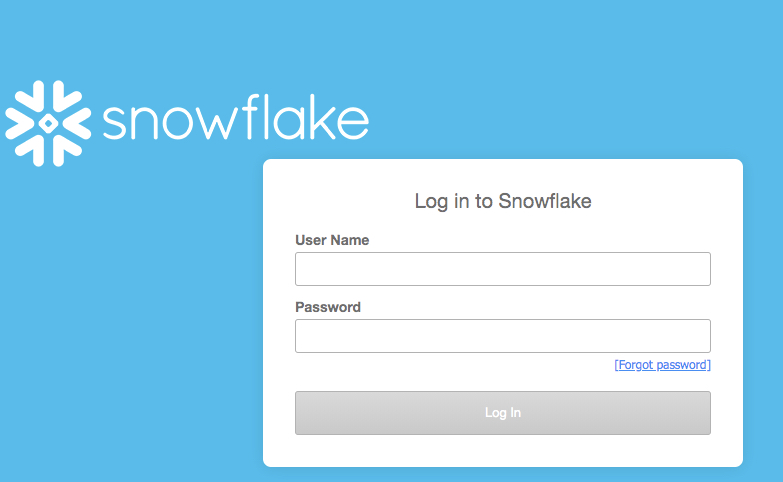

### 시작 상자 및 자습서는 모두 닫습니다

첫 로그인 시 ‘시작’ 및 ‘도우미’ 상자가 UI에 나타날 수 있습니다. 또한 ‘무료 평가판을 이용해 보세요...’ 리본이 UI 상단에 나타날 수 있습니다. 아래 스크린샷의 빨간색 상자에 있는 항목을 클릭하여 이를 최소화하고 닫습니다.

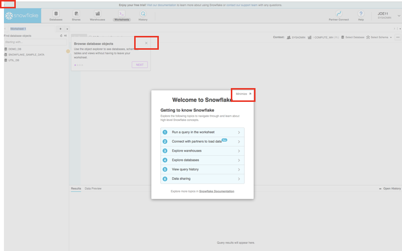

### Snowflake UI 탐색

우선 Snowflake에 대해 알아봅시다! 이 섹션은 여러분이 익숙해질 수 있도록 사용자 인터페이스의 기본적인 구성 요소를 다룹니다. UI 상단에서 왼쪽부터 오른쪽까지 이동할 것입니다.

상단 메뉴를 사용하면 다음과 같이 Snowflake의 다양한 영역 간에 전환할 수 있습니다.


**Databases** 탭은 여러분이 생성했거나 액세스 권한을 지닌 데이터베이스에 관한 정보를 보여줍니다. 데이터베이스의 소유권을 생성, 복제, 삭제 또는 이전할 수 있을 뿐만 아니라 UI에서 데이터를 로드(제한적)할 수 있습니다. 사용자 환경에 이미 여러 개의 데이터베이스가 존재합니다. 하지만 이 랩에서는 이를 사용하지는 않을 것입니다.

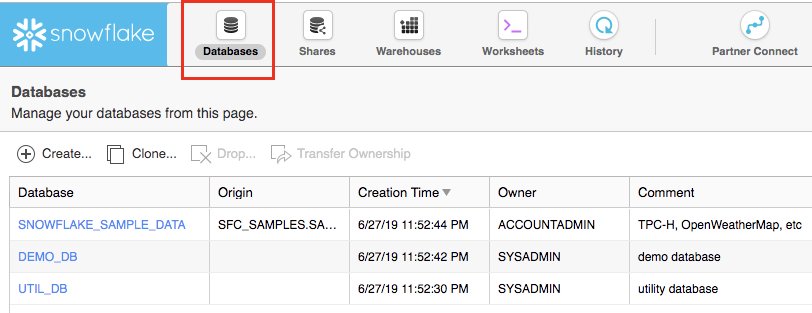

**Shares** 탭은 테이블 데이터의 다른 복사본을 생성하지 않고, 별도의 Snowflake 계정이나 외부 사용자 간에 쉽고 안전하게 Snowflake 테이블을 공유하도록 데이터 공유를 구성할 수 있는 곳입니다.

**Warehouses** 탭은 Snowflake에서 데이터를 로드하거나 쿼리하기 위해 컴퓨팅 리소스(가상 웨어하우스)를 설정하고 관리하는 곳입니다. ‘COMPUTE_WH (XS)’라는 웨어하우스가 사용자 환경에 이미 존재합니다.

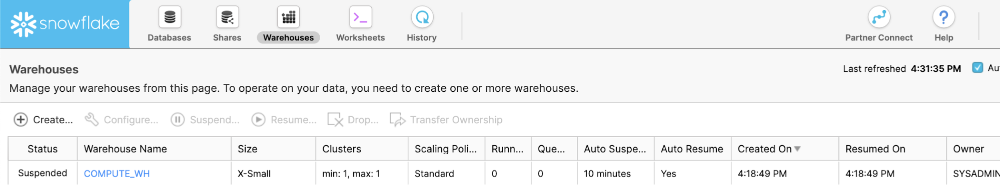

**Worksheets** 탭은 SQL 쿼리 제출, DDL 및 DML 작업 수행 그리고 쿼리/작업 완료 시 결과 확인을 위한 인터페이스를 제공합니다. 기본 ‘Worksheet 1’이 나타납니다.

왼쪽 창에는 사용자가 워크시트에 대해 선택한 역할로 액세스할 수 있는 모든 데이터베이스, 스키마, 테이블 및 뷰를 탐색할 수 있는 데이터베이스 오브젝트 브라우저가 있습니다. 하단 창에는 쿼리 및 작업 결과가 표시됩니다.

이 페이지의 다양한 창의 크기는 작은 슬라이더를 움직여 조정할 수 있습니다. 또한 랩을 진행하면서 작업을 위해 워크시트에 더 많은 공간이 필요한 경우 왼쪽 창에서 데이터베이스 오브젝트 브라우저를 축소합니다. 이 가이드의 많은 스크린샷에서는 이 데이터베이스 오브젝트 브라우저를 닫은 상태로 둘 것입니다.

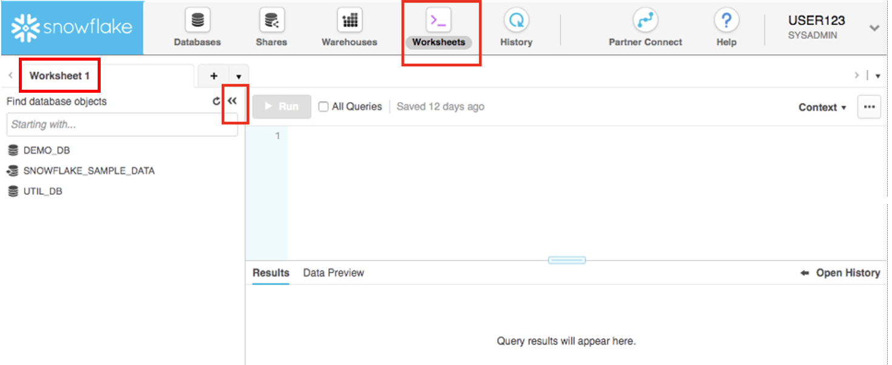

워크시트 탭 바로 오른쪽에 있는 기본 ‘Worksheet 1’의 왼쪽 상단에서 작은 아래쪽 화살표를 클릭합니다. ‘Load Script’를 클릭한 다음 이전 모듈에서 다운로드한 ‘lab_scripts.sql’ 파일을 찾고 ‘Open’을 클릭합니다. 이 랩의 나머지를 실행하기 위해 필요한 모든 SQL 명령이 이제 새로운 워크시트에 나타날 것입니다.

**아직 어떠한 SQL 명령도 실행하지 마십시오. 나중에 랩으로 돌아와서 하나씩 실행하겠습니다**

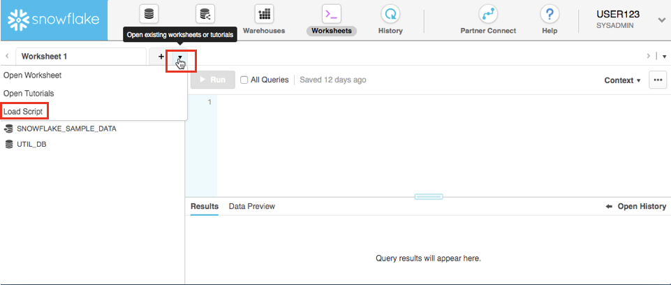

워크시트 이름을 클릭하고 Covid19를 입력한 다음 ‘Enter’ 키를 눌러 새롭게 생성된 워크시트의 이름을 Covid19라고 지정합니다

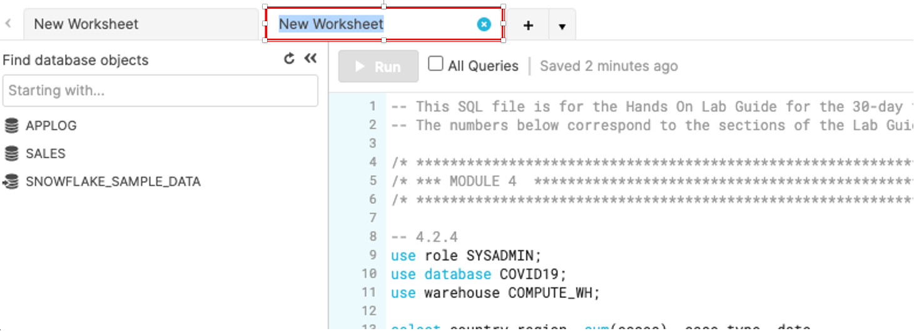

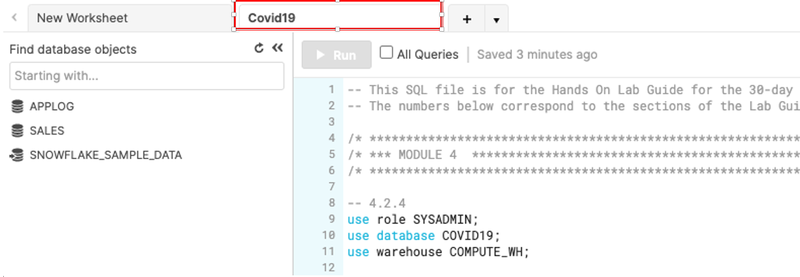

Negative : **경고 - 워크시트로 SQL 복사/붙여 넣기 금지** <br> Snowflake 워크시트에 SQL 코드를 복사하여 붙여 넣으면 형식 오류가 발생할 수 있으며 SQL이 올바르게 실행되지 않을 수 있습니다. 방금 다룬 ‘Load Script’ 메서드를 사용해야 합니다.  이전 또는 잠긴 브라우저에서는 브라우저가 여러분이 .sql 파일을 여는 것을 방해할 것이기에 이 ‘Load Script’ 단계를 수행할 수 없을지도 모릅니다. 이 경우 텍스트 편집기로 .sql 파일을 연 다음 .sql 파일에서 복사한 모든 텍스트를 ‘Worksheet 1’에 붙여 넣습니다

Positive : **워크시트 vs UI** <br> 이 랩의 많은 구성은 시간을 절약하기 위해 이 워크시트 내에 미리 작성된 SQL을 통해 실행될 것입니다. 이러한 구성은 또한 덜 기술적인 방식으로 UI를 통해 실행할 수도 있지만 시간이 더 많이 소요됩니다.

**History** 탭을 통해 지난 14일 동안 Snowflake 계정에서 실행했던 모든 쿼리의 세부 정보를 볼 수 있습니다(더 자세한 사항을 위해 쿼리를 분석하려면 Query ID 클릭).

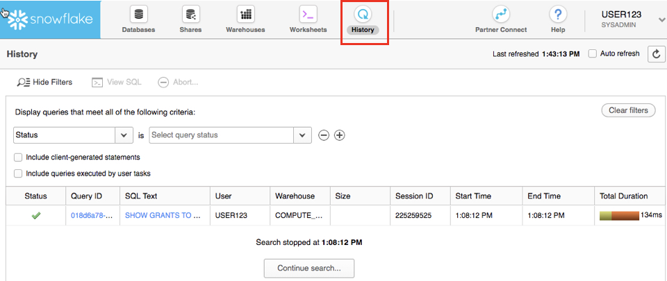

여러분의 사용자 이름이 나타나는 UI 오른쪽 상단을 클릭하면 암호, 역할 또는 기본 설정을 변경할 수 있습니다. Snowflake에는 여러 가지 시스템에서 정의된 역할이 있습니다. 현재 역할은 기본 역할인 SYSADMIN입니다. 이는 랩의 다음 파트에서 변경할 것입니다.

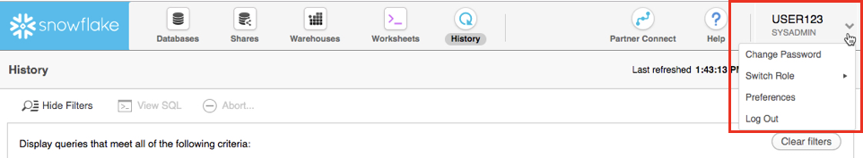

Negative : **SYSADMIN** <br> 이 랩 대부분에서는 웨어하우스, 데이터베이스 및 계정의 기타 오브젝트를 생성하기 위한 권한을 가진 SYSADMIN(또는 시스템 관리자) 역할을 유지할 것입니다. 실제 환경에서는 이 랩의 작업에 서로 다른 역할을 사용하고 사용자에게 역할을 할당합니다. Snowflake의 액세스 제어에 대한 더 자세한 내용은 이 랩의 말미와 [설명서](https://docs.snowflake.net/manuals/user-guide/security-access-control.html)에서 다룹니다.

<!-- ------------------------ -->
## Snowflake Partner Connect를 통해 Dataiku 평가판 계정 준비

Duration: 10

### Partner Connect를 통해 Dataiku 평가판 생성

페이지 오른쪽 상단에서 프로필을 클릭하여 현재 역할이 `ACCOUNTADMIN`인지 확인합니다.

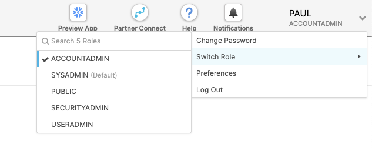

상단 바에 있는 Partner Connect를 클릭하고 Dataiku를 찾기 위해 아래로 스크롤합니다.

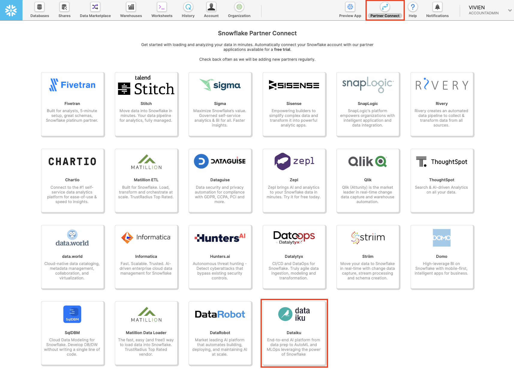

Dataiku 타일을 클릭합니다. 클릭하면 다음 창이 실행될 것입니다. 이는 Snowflake과 연결하기 위해 Dataiku에 필요한 연결 매개 변수를 자동으로 생성할 것입니다. Snowflake는 Dataiku 계정에서 사용하기 위한 목적으로 전용 데이터베이스, 웨어하우스, 시스템 사용자, 시스템 암호 및 시스템 역할을 생성할 것입니다.

```
Database:        PC_DATAIKU_DB
Warehouse:       PC_DATAIKU_WH (X-Small)
System User:     PC_DATAIKU_USER
System Password: Autogenerated & Randomized
System Role:     PC_DATAIKU_ROLE
                 Role PUBLIC will be granted to the PC_DATAIKU_RLE
                 Role PC_DATAIKU_ROLE will be granted to the SYSADMIN role

Database(s) with USAGE privilege granted: leave this blank

```

Dataiku에서 Snowflake와 연결하기 위해 **PC_DATAIKU_USER**를 사용하고자 합니다. 또한 Dataiku 내에서 활동을 수행할 때 Snowflake로 푸시다운되는 **PC_DATAIKU_WH**를 사용하고자 합니다.

이는 Snowflake 확장을 통해 Dataiku에서 작업하고 있는 데이터 과학 팀이 다른 역할 및 웨어하우스를 사용하여 Snowflake로 데이터를 로드하고 있는 데이터 엔지니어링 팀과 완벽히 별도로 작업할 수 있음을 보여줍니다.

사용자 암호(Snowflake에서 생성되며 절대 표시되지 않음)는 다른 모든 Snowflake 연결 매개 변수와 더불어 Dataiku 서버로 전달됩니다. 따라서 Dataiku 연결에 자동으로 사용될 것입니다. **PC_DATAIKU_USER 암호 변경 금지**. 암호를 변경하면 Dataiku는 Snowflake 데이터베이스와 연결할 수 없을 것입니다.

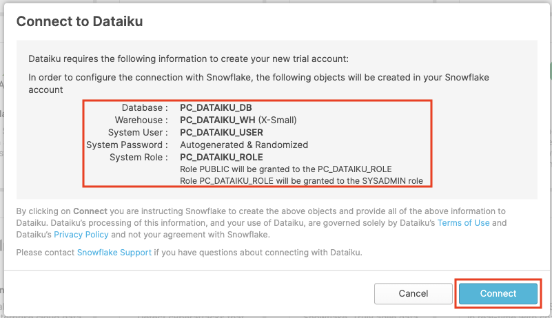

Negative : **정보 참고:** <br> 처음 생성했던 것과 다른 Snowflake 계정을 사용하고 있다면 여러분의 이메일 세부 정보를 요청하는 다음 화면이 나타날 수 있습니다.

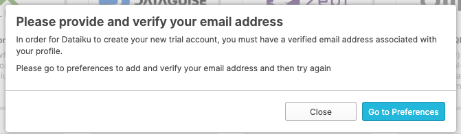

Negative : ‘Go to Preferences’를 클릭하고 이메일 세부 정보를 입력합니다


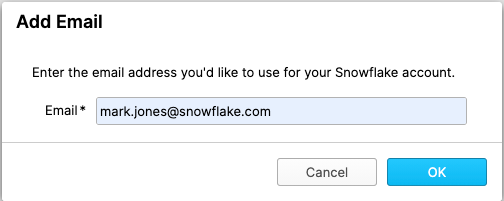

**Connect**를 클릭합니다. 여러분의 이름과 성을 요구할 수도 있습니다. 요구한다면 이를 입력한 다음 Connect를 클릭합니다.

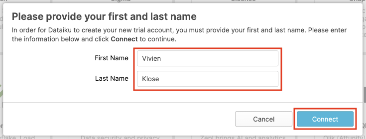

여러분의 파트너 계정이 생성되었습니다. **Activate**를 클릭하여 이를 활성화합니다.


이는 Dataiku의 실행 페이지로 여러분을 리디렉션할 새로운 페이지를 실행할 것입니다.

이 단계에는 2가지 옵션이 있습니다.

1. 기존 Dataiku 사용자 이름으로 로그인
2. 새로운 Dataiku 계정을 위해 가입

여러분이 Dataiku를 처음으로 사용하고 있다고 가정하기에 ‘Sign Up’ 상자를 선택하시기 바랍니다. 또한 GitHub, Google 또는 이메일 주소와 새로운 암호로 가입하십시오. Sign Up을 클릭합니다.

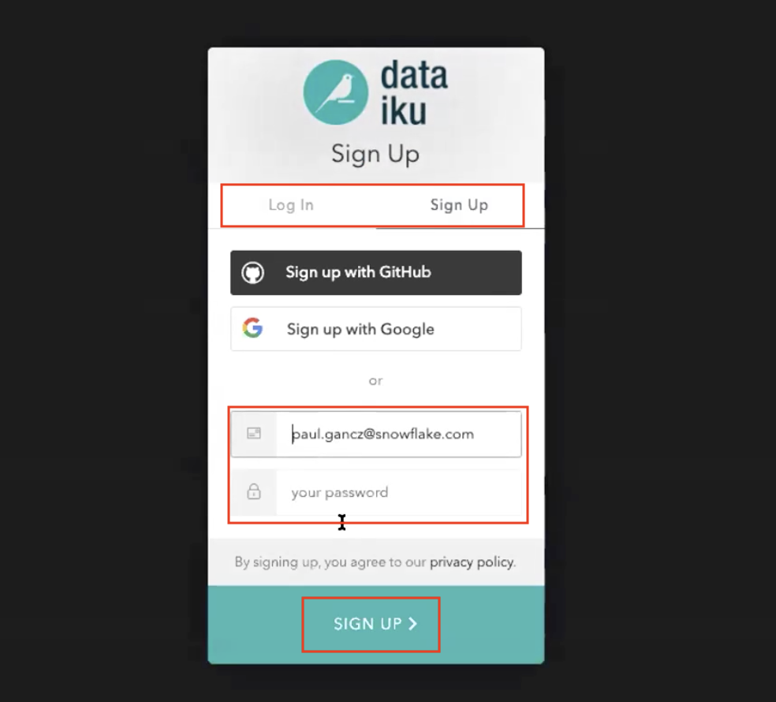

여러분의 이메일 주소를 사용할 때 암호가 다음 조건을 충족하는지 확인합니다.

1. 최소 8자의 암호 길이
2. 포함되어야 하는 요소: 소문자(a~z) 대문자(A~Z) 숫자(예: 0~9)

가입한 이메일로 Dataiku가 전송한 이메일을 받게 될 것입니다.


전송된 이메일로 Dataiku 계정을 활성화합니다.

### Dataiku 설정 검토

활성화 링크를 클릭할 때 간단히 Dataiku Cloud의 서비스 약관을 검토하십시오. 이를 위해 페이지 하단으로 스크롤을 내리십시오. **I AGREE**를 클릭합니다.

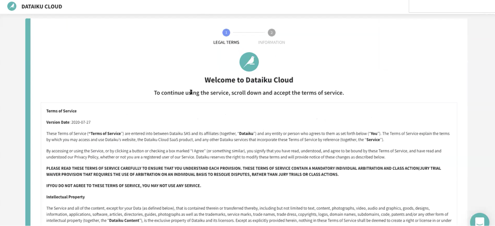

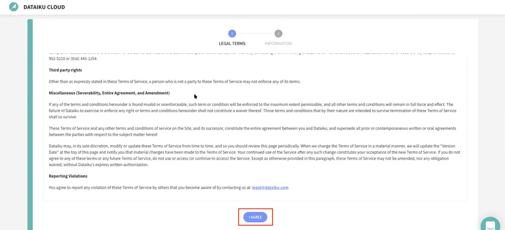

그런 다음 다음 정보를 사용하여 가입을 완료해야 할 것입니다.

1. 이름
2. 성
3. 직위
4. 여러분을 어떻게 정의하시나요(역할을 위한 드롭다운 옵션)
5. 회사 이름
6. 회사 규모(드롭다운)
7. 여러분의 국가는 어디인가요(드롭다운)
8. Dataiku Cloud를 사용하는 목적은 무엇인가요? *(선택 사항)*

그런 다음 **Start**를 클릭합니다.


1. Dataiku Cloud Launchpad 사이트로 리디렉션될 것입니다. **GOT IT!**을 클릭하여 계속합니다.

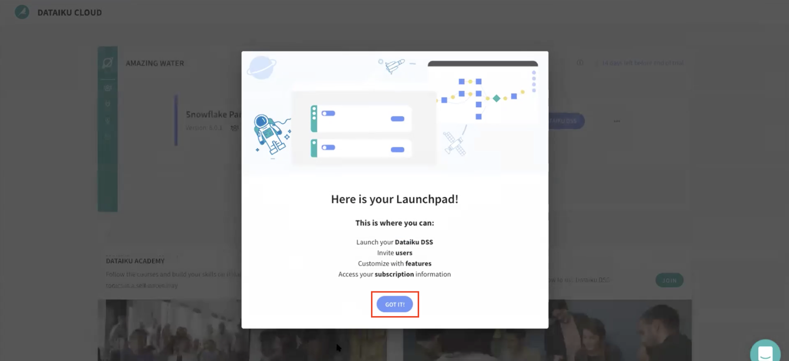


이제 Snowflake의 Partner Connect를 통해 여러분의 Dataiku 평가판 계정을 성공적으로 설정했습니다. 이제 이 랩을 계속할 준비가 되었습니다. 이를 위해 Snowflake 브라우저로 되돌아갑니다.

Negative : 사용자 암호(Snowflake에서 생성되며 절대 표시되지 않음)는 다른 모든 Snowflake 연결 매개 변수와 같이 Dataiku 서버로 전달됩니다. 따라서 Dataiku 연결에 자동으로 사용될 것입니다. PC_DATAIKU_USER 암호 변경 금지. 암호를 변경하면 Dataiku는 Snowflake 데이터베이스와 연결할 수 없을 것입니다.


<!-- ------------------------ -->
## Snowflake Data Marketplace에서 COVID-19 데이터 가져오기 및 준비

Duration: 20

Positive : **Snowflake의 데이터 공유** <br> Snowflake Data Marketplace는 Snowflake의 호스팅된 데이터 익스체인지입니다. 여기에서 모든 Snowflake 고객은 원활하게 타사 데이터에 액세스할 수 있습니다. 또한 여기에서 회사는 데이터를 게시하고 다른 Snowflake 고객이 검색하고 구매할 데이터 서비스를 제공할 수 있습니다. 오늘날 220개 이상의 데이터 목록과 더불어 100명 이상의 데이터 공급자를 보유하고 있습니다. 더 자세한 정보는 [이 웹 페이지](https://www.snowflake.com/data-marketplace/)를 검토하십시오. <br> 또한 Snowflake Data Exchange를 확장하고, 여러분의 고객을 위한 파일을 생성하기 위해 FTP, 파일 공유 및 ETL 프로세스의 필요를 없앨 수 있으며, Snowflake Data Exchange를 표준화할 수 있습니다. 이는 데이터 사일로를 허물 것이며 이를 통해 여러분의 회사, 공급업체, 파트너 또는 고객을 높은 수준으로 통제하는 방식으로 마찰 없이 데이터를 공유할 수 있습니다. 여러분의 Data Exchange는 단일 데이터 사본에 대한 실시간 액세스를 통제합니다. 이를 통해 데이터에 대한 액세스를 안전하게 제어할 수 있으며, 파일을 복사하거나 ETL 파이프라인을 구축하는 것과 같은 기존 데이터 공유 메서드의 비용과 문제를 제거합니다.

### Snowflake Data Marketplace에서 COVID-19 데이터 가져오기

Snowflake Data Marketplace에 액세스하기 위해 다음 단계를 따르십시오.

현재 역할이 `ACCOUNTADMIN`(오른쪽 상단에 표시됨)인지 확인합니다. 아니라면 오른쪽 상단에 있는 프로필을 클릭하여 역할을 업데이트합니다.


상단에 있는 **Data Marketplace** 아이콘을 클릭하고 **Explore the Snowflake Data Marketplace**를 클릭합니다.


Data Marketplace를 처음 사용하는 경우 다음 로그인 화면이 나타날 것입니다. **Sign in to continue**를 클릭하고 다음 단계에서 여러분의 로그인 정보를 입력합니다.

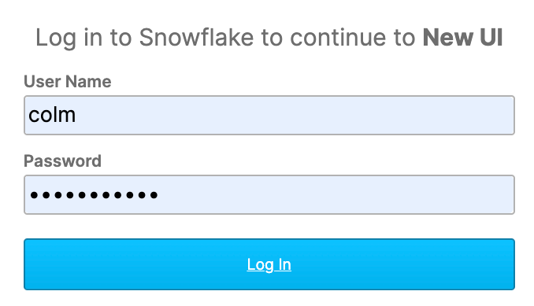

이제 Snowflake Data Marketplace로 리디렉션될 것입니다.

이는 여러 업계에 걸쳐 다양한 외부 데이터 소스를 표시할 것입니다. 오른쪽 상단에 있는 Search 상자를 통해 목록 또는 데이터 공급자를 검색할 수 있습니다. 왼쪽에 있는 사이드 메뉴는 Data Marketplace에서 사용 가능한 데이터 카테고리를 보여줍니다.

COVID-19 데이터를 찾고 있기에 왼쪽에 있는 **Health** 카테고리를 클릭하여 선택합니다.


COVID-19 데이터 세트의 수는 여기에 표시됩니다. **Starschema’s COVID-19 Epidemiological Data**를 사용할 것입니다. 해당 타일을 클릭합니다.

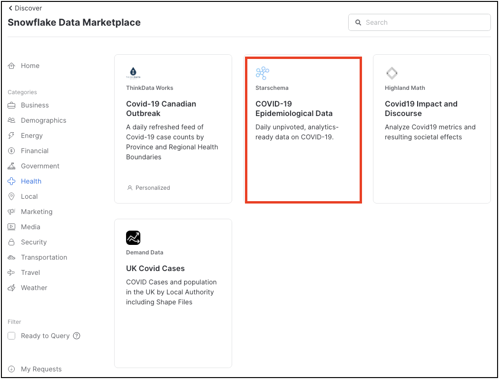

Starschema 데이터 세트는 John Hopkins University, ECDC(European Centre for Disease Prevention and Control), RKI(German Robert-Koch-Institut) 및 미국 당국과 같은 현지 보건 당국에서 가져온 일별 COVID-19 사례 데이터를 포함하여 여러 테이블을 제공합니다. 또한 글로벌 정부 조치에 대한 인구 통계 데이터, 이동성 데이터 및 정보가 이 데이터 세트에서 제공됩니다.

오른쪽 상단에서 여러분이 `ACCOUNTADMIN` 역할임을 확인합니다. 아니라면 사람 아이콘을 클릭하여 변경합니다. 그런 다음 **Get Data**를 클릭합니다.

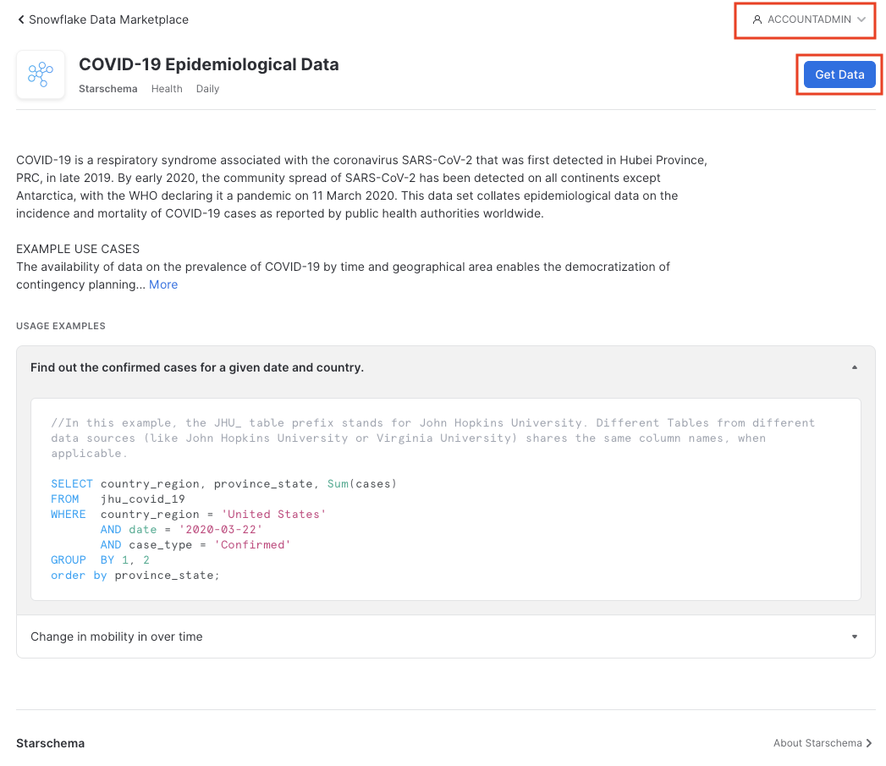

Database name을 **COVID19**로 변경합니다. 또한 여러분이 데이터베이스(Public을 선택한 뒤에 선택 박스 선택)에 액세스할 수 있도록 모든 역할을 **Public**으로 선택합니다. 또한 Snowflake의 고객 사용 약관과 Starschema의 사용 약관을 위해 **Accept**를 클릭한 다음 마지막으로 **Create Database**를 클릭합니다.


빠르게 데이터베이스와 스키마를 확인하기 위해 **View Database**를 클릭합니다. INFORMATION_SCHEMA 및 PUBIC과 같은 2개의 스키마가 보일 것입니다. **PUBLIC**을 클릭하여 사용 가능한 테이블을 확인합니다.


오른쪽 상단 필터에 JHU를 입력하면 [John Hopkins University](https://www.jhu.edu/)에서 가져온 데이터를 포함한 모든 테이블을 보게 될 것입니다.

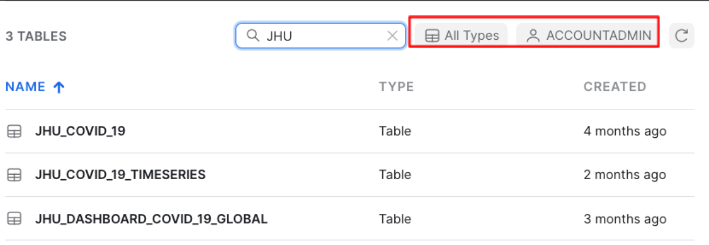

또한 All Types가 선택되었으며 기본값으로 `ACCOUNTADMIN` 역할을 사용하고 있음을 보게 될 것입니다.

오른쪽에는 공유 소유자, 이 데이터베이스에 있는 테이블 및 뷰의 수, 소스, 공유 이름 및 여러분과 데이터를 공유한 데이터 공급자를 포함한 데이터베이스 세부 정보가 보일 것입니다.

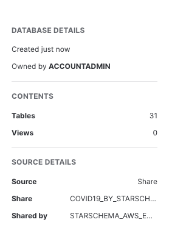

이제 전 세계 COVID 데이터로 매일 업데이트되는 StarSchema의 COVID-19 데이터 세트를 성공적으로 구독하게 되었습니다. 데이터베이스, 테이블, 뷰 또는 ETL 프로세스를 생성할 필요가 없었음을 기억하세요. 단지 검색을 통해 Snowflake 데이터 마켓플레이스에서 공유된 데이터에 액세스하기만 하면 됩니다.

### Snowsight를 사용하여 COVID-19 분석

이제 일부 준비 작업을 끝냈으니 COVID-19 데이터에 대한 데이터 분석을 중점적으로 진행하겠습니다. 이를 위해 SQL Worksheets를 대체하는 Snowsight를 사용할 것입니다. 이는 데이터 분석 활동을 지원하기 위해 설계되었습니다.

Snowflake는 최근 차세대 분석 UI인 **Snowsight**를 출시했습니다. 재설계된 인터페이스와 더불어 분석가, 데이터 엔지니어 및 비즈니스 사용자를 위한 다양한 부분이 개선되었습니다. Snowsight를 사용하면 공유를 통해 쿼리를 작성하고, 결과를 얻고, 타인과 협업하는 것이 더 빠르고 쉬워집니다. 또한 조직에 걸쳐 데이터를 탐색하고 시각화하는 것이 더 쉬워집니다. Snowsight는 다음과 같은 다양한 기능과 개선된 부분을 포함합니다.

- **빠른 쿼리 작성:** 특정 함수를 위해 테이블/열 이름, 데이터 필터 및 Snowflake 설명서에 대한 빠른 액세스와 일치하는 쿼리 구문 키워드 또는 목록 값을 위한 스마트 자동 완성을 포함합니다.
- **대화형 쿼리 결과:** 이상값과 이상을 확인하기 위해 분포 히스토그램을 사용하여 쿼리가 반환한 데이터에 대한 요약 통계를 봅니다.
- **매력적인 데이터 시각화:** 외부 분석/시각화 도구 없이 자동 차트 생성과 대시보드 생성을 위한 드래그 앤 드롭 인터페이스를 통해 데이터를 빠르게 분석합니다.
- **공유 및 협업:** 팀 간에 안전하게 쿼리, 워크시트, 시각화 및 대시보드를 공유합니다.
- **스키마 브라우저:** 지정된 문자열을 포함하는 이름을 가진 테이블, 뷰 및 열을 위해 현재 세션 역할로 액세스할 수 있는 데이터베이스와 스키마에 걸쳐 즉각적으로 검색합니다. 열 이름과 데이터 형식을 확인하기 위해 빠른 참조용으로 테이블을 고정합니다.

Snowsight 사용에 대한 자세한 내용은 [설명서](https://docs.snowflake.com/ko/user-guide/ui-snowsight.html)를 참조하십시오.

집중적으로 다룰 2개의 테이블에 대한 일부 예비 분석을 실행하겠습니다. 이를 위해 왼쪽 상단 모서리에서 **Worksheets**를 선택할 것입니다.

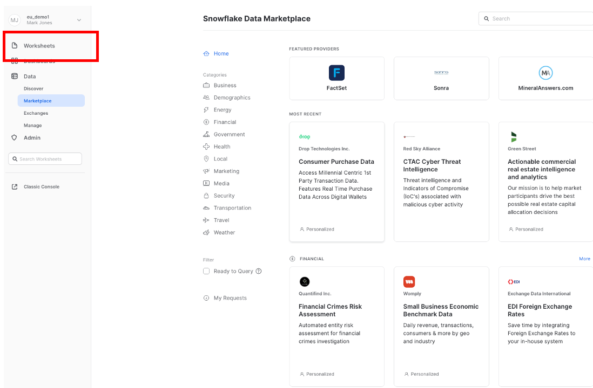

Snowsight를 처음으로 사용하는 것이라면 이를 활성화하기를 요청하는 프롬프트가 나타날 것입니다.


‘Enable Worksheets and Dashboards’를 클릭한 다음 ‘Import Worksheets’를 클릭합니다

해당 **COVID19 Worksheet**를 클릭하여 이전에 로드한 스크립트를 엽니다.

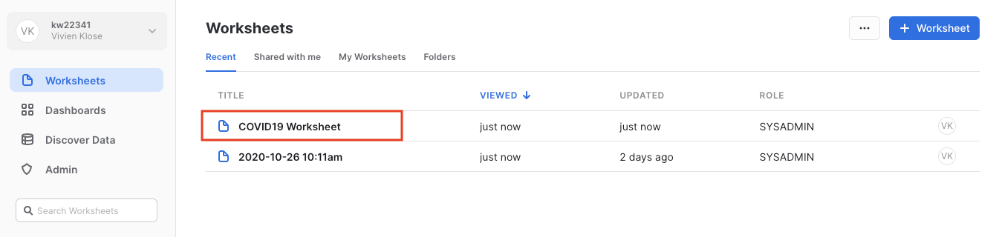

오른쪽 상단에 있는 SYSADMIN 역할과 여러분의 평가판 계정이 생성되었을 때 생성된 COMPUTE_WH를 사용하여 워크시트에서 올바른 컨텍스트를 확인합니다.


또한 워크시트의 왼쪽 상단에서 올바른 **COVID19** 데이터베이스를 선택합니다. 

시간의 경과에 따른 몇몇 유럽 국가(독일, 영국, 프랑스, 이탈리아, 네덜란드, 폴란드, 스웨덴 포함)를 대상으로 확인된 사례에 대해 단순한 분석을 실행할 것입니다.

스크립트에서 제공된 대로 아래 명령을 실행합니다. Covid19 워크시트에서 다음 텍스트를 강조 표시하고 **‘Run’**을 클릭합니다.

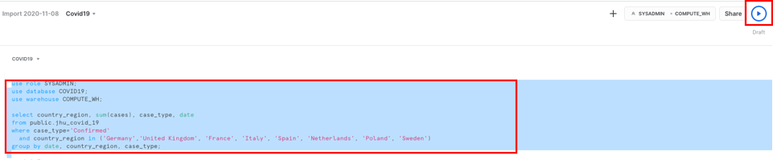

```sql
use role SYSADMIN;
use database COVID19;
use warehouse COMPUTE_WH;

select country_region, sum(cases), case_type, date from public.jhu_covid_19 where case_type='Confirmed' and country_region in ('Germany','United Kingdom', 'France', 'Italy', 'Spain', 'Netherlands', 'Poland', 'Sweden') group by date, country_region, case_type;

```

결과에는 결과 테이블이 포함될 것입니다. **Chart**를 클릭하여 결과의 단순한 시각화를 얻습니다.


차트의 오른쪽에서 다음과 같이 값을 변경합니다.

- **Line 차트**
- **SUM(CASES)** y축용, 선에서 확인된 값의 합계 표시
- **DATE** x축용
- Add Column을 클릭한 다음 Country_region을 클릭합니다
- **COUNTRY_REGION** 각각의 국가에서 확인된 사례의 합계 표시

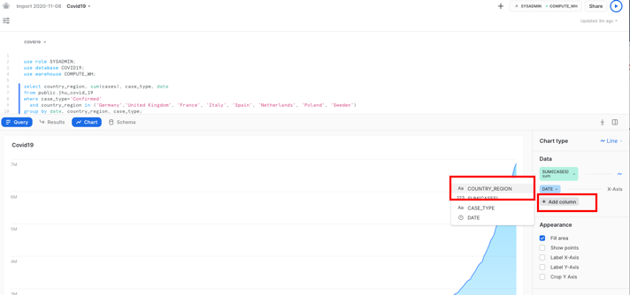

- *선택 사항: x축을 ‘Date’로, y축을 ‘Sum of confirmed cases’로 레이블을 붙입니다*

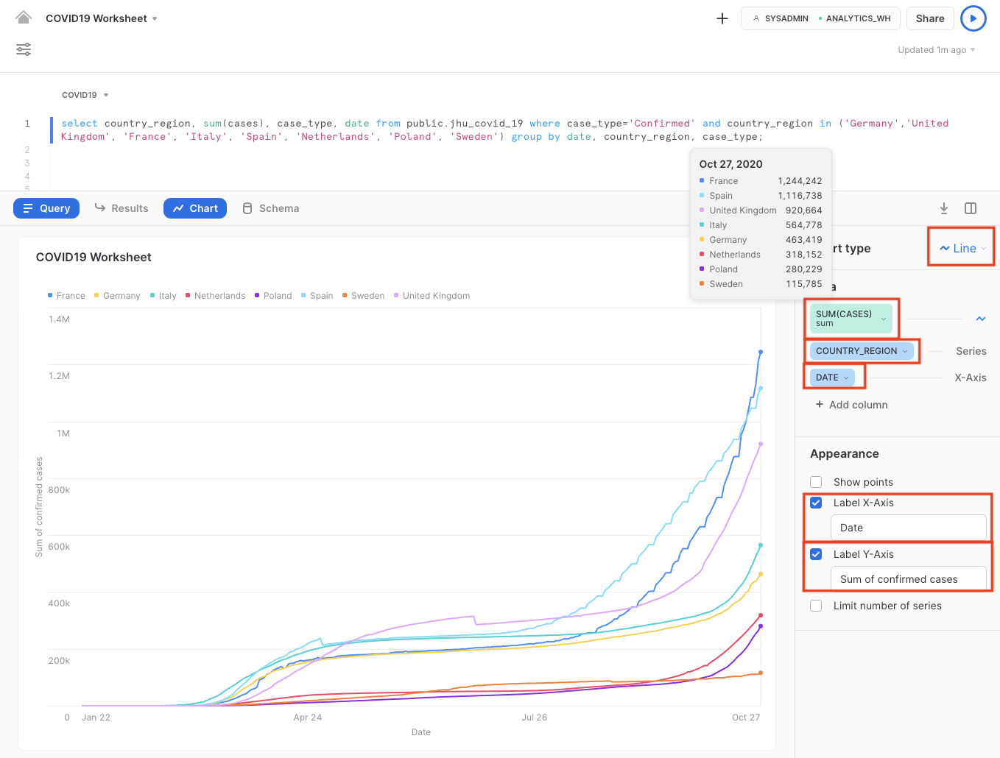

확인된 COVID-19 사례의 수가 3월에서 4월 중순까지 급격하게 증가한 것이 명확하게 확인됩니다. 그 이후에는 적용된 여러 봉쇄 조치로 인해 증가하던 추세가 큰 폭으로 느려졌습니다.

그러나 9월에 가을이 시작되면서 확인된 COVID-19 사례가 기하급수적으로 걱정되는 수준으로 늘어난 것이 명확하게 확인됩니다. 3개의 주요 유럽 국가에서 확인된 사례가 궁극적으로 100만 건을 넘거나 그 언저리였습니다.

오늘날 뉴스를 통해 사람들은 보통 새롭게 알려진 감염을 인지하고 있습니다. 또한 얼마나 많은 사람들이 COVID-19에 감염된 상태(Confirmed 사례에서 Recovered 사례를 뺀 ‘Active’ 사례 유형)인지 검토할 수 있습니다.

차트 창에서 다음 명령을 실행합니다. 이 명령을 실행하면 해당하는 차트가 나타날 것입니다.

```sql
select country_region, sum(cases), case_type, date from public.jhu_covid_19 where case_type='Active' and country_region in ('Germany','United Kingdom', 'France', 'Italy', 'Spain', 'Netherlands', 'Poland', 'Sweden') group by date, country_region, case_type;
```

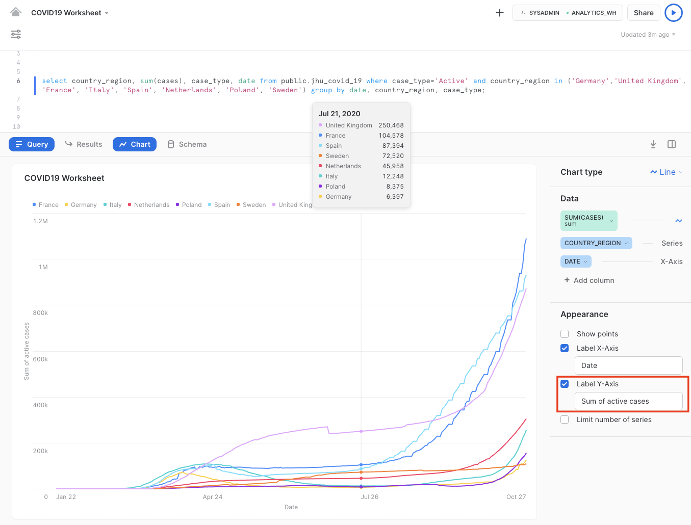

**이는 y축에서 활성 사례의 합계를 나타냅니다.**

이 단계에서 대부분 국가가 4월 말 이후로 감염을 ‘제어했음’을 쉽게 추론할 수 있습니다. 여름 동안 대부분 국가에서 활성 감염 사례가 비교적으로 안정적이거나 큰 폭으로 줄기도 했습니다. 2차 감염이 진행되면서 유럽에서 확인된 사례가 늘어나며 활성 사례가 기하급수적으로 늘어났습니다.

### 데이터 문제

종종 예측 모델 구축의 모든 프로세스를 진행하지만 예측이 그다지 정확하지 않으며 데이터 문제로 귀결되는 이슈를 추적합니다.  이와 같은 다른 경우에는 데이터가 시간이 지남에 따라 변하기에 모델을 더 이상 사용할 수 없습니다.  랩을 생성한 후 문제가 무엇이었는지 확인하기 위해 데이터로 돌아와 분석해야 했습니다.  요약하자면 2021년 6월 2일~3일쯤에 모종의 이유로 엄청난 수의 ‘음수 사망’이 발생하여 모델을 사용할 수 없어졌기에 위와 같이 결정하기 위해 동일한 Snowsight 시각화 기능을 사용했습니다.  카운트는 언제나 양수여야 합니다.   Snowsight를 사용하여 조사한 결과 Peru가 모델 정확도에 문제를 일으키는 문제가 있는 데이터를 보고했음을 발견했습니다.  
이러한 데이터 문제를 발견하기 위한 선택적 단계로 다음 SQL 문을 실행할 수 있습니다.

```sql
select DATE, province_state, SUM(CASES) 
from public.jhu_covid_19 
WHERE CASE_TYPE = 'Deaths'
and DATE >='2021-05-25'
and DATE <='2021-06-06'
and country_region = 'Peru'
group by province_state, DATE 
order by province_state, date;
```

그런 다음 다음과 같은 시각화를 생성합니다.

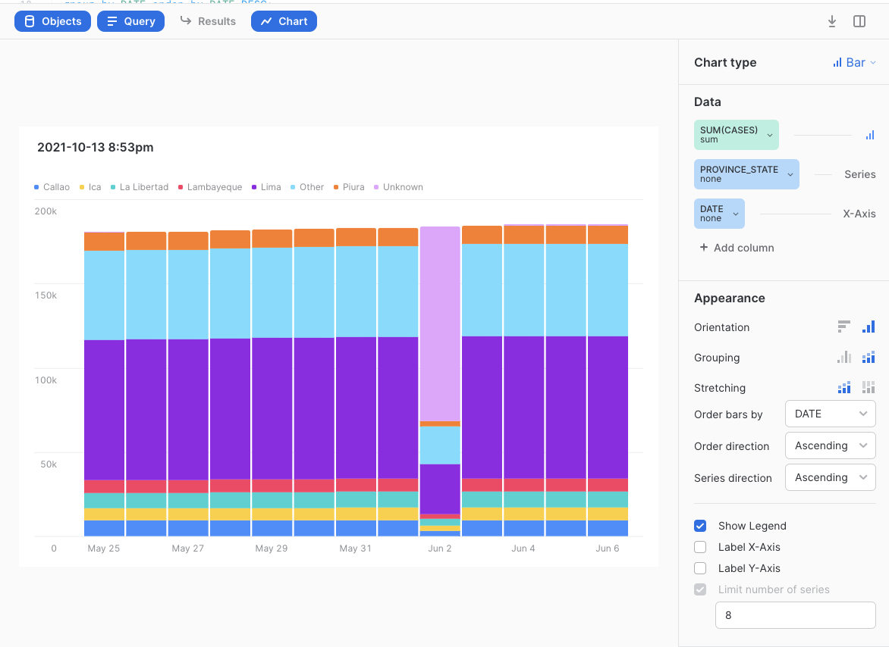

Peru가 COVID 발생 이후로 일반적으로 얼마나 많은 사람이 사망했는지를 주별로 명시함을 확인할 수 있을 것입니다. 그러나 2021년 6월 2일에 대부분의 사망이 새로운 ‘Unknown’ 상태에 할당된 다음 올바르게 보고되었습니다.  추후에 Snowflake에서 일별 주별 총 사망 수가 다름을 확인했을 때 이는 Peru의 2일로 인해 엄청난 음수 사망 수로 이어집니다.  이 데이터 문제를 해결하는 더 좋은 방법이 많이 있지만 이 랩에서 쉬운 방법은 단순히 솔루션에서 Peru를 필터링하는 것입니다.  추후 단계에서 이를 진행할 것입니다.

### 추가적인 데이터 분석 및 소비를 위한 데이터 준비

이제 사용할 공유된 COVID19 테이블을 참조하는 뷰를 생성하겠습니다. 기존 UI로 전환하고 **Worksheets** 탭을 선택합니다.


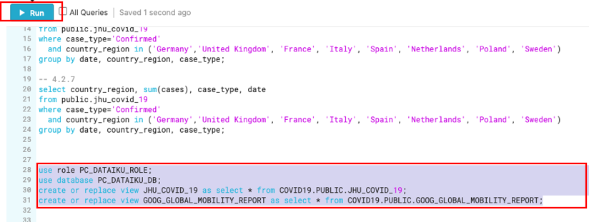

```sql
use role PC_DATAIKU_ROLE;
use database PC_DATAIKU_DB;
create or replace view JHU_COVID_19 as select * from COVID19.PUBLIC.JHU_COVID_19;
create or replace view GOOG_GLOBAL_MOBILITY_REPORT as select * from COVID19.PUBLIC.GOOG_GLOBAL_MOBILITY_REPORT;
```

웨어하우스를 선택하지 않았습니다. 데이터베이스 오브젝트를 생성하는 문은 실행 중인 웨어하우스를 활용하지 않습니다. 따라서 이 부분을 선택하지 않은 상태로 둬도 괜찮습니다.

이제 **Warehouses** 탭으로 이동하겠습니다. 상단의 ‘Create…’ 옵션에서 새로운 웨어하우스를 빠르게 생성할 수 있습니다. 방금 분석을 위해 사용한 COMPUTE_WH와 Partner Connect를 통해 Dataiku 계정을 생성했을 때 생성된 PC_DATAIKU_WH와 같은 2개의 가상 웨어하우스가 보일 것입니다.

전체 행이 강조 표시되도록 이 ‘PC_DATAIKU_WH’ 웨어하우스(‘PC_DATAIKU_WH’라고 적힌 파란색 하이퍼링크 아님)의 행을 클릭합니다. 그 다음 그 위의 “Configure...”텍스트를 클릭해서 “PC_DATAIKU_WH”의 구성 세부 사항을 확인합니다. Dataiku에서 모델을 구축하고, 학습시키고, 배포하기 위해 이 웨어하우스를 사용할 것입니다.

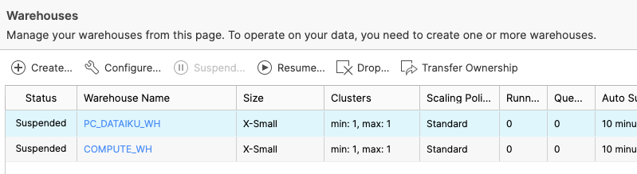

많은 기능이 있기에 이 웨어하우스의 설정을 설명하겠습니다. 대부분의 기능은 타사 데이터 웨어하우스와는 달리 Snowflake에 고유합니다.

참고 - Snowflake Enterprise Edition 이상을 보유하고 있지 않은 경우, 아래 스크린샷에서처럼 ‘Maximum Clusters’ 또는 ‘Scaling Policy’ 구성이 보이지 *않을* 것입니다. 이 랩에서는 멀티 클러스터링을 사용하지 않지만, Snowflake의 핵심 기능이기 때문에 이에 대해 논의할 것입니다.

‘Size’ 드롭다운에서 웨어하우스의 크기를 선택합니다. 더 큰 데이터 로딩 작업 또는 더 많은 컴퓨팅 집약적 쿼리를 위해 더 큰 웨어하우스가 필요할 것입니다. 티셔츠 크기는 AWS EC2, Azure Virtual Machines 또는 Google Compute Engine Virtual Machines인 기본 컴퓨팅 노드를 의미합니다. 티셔츠 크기가 커질수록, 클라우드 공급자로부터 더 많은 컴퓨팅 리소스가 이 웨어하우스에 할당됩니다. 예를 들어 4-XL 옵션은 128개의 노드를 할당합니다. 또한 이 크기는 간단한 클릭만으로 언제든지 늘리거나 줄일 수 있습니다.

Snowflake Enterprise Edition 이상을 보유하고 있다면 Maximum Clusters 섹션이 표시될 것입니다. 여기에서 단일 웨어하우스를 최대 10개의 클러스터로 이뤄진 다중 클러스터로 설정할 수 있습니다. 예를 들어 방금 언급한 4-XL 웨어하우스에 최대 클러스터 크기인 10이 할당된 경우, 이 웨어하우스를 지원하는 AWS EC2 또는 Azure VM 노드를 1280(128 * 10)개까지 확장할 수 있으며...단 몇 초면 됩니다! 다중 클러스터는 다수의 비즈니스 분석가가 동일한 웨어하우스를 사용하여 다양한 쿼리를 동시에 실행하는 동시성 시나리오에 이상적입니다. 이 시나리오에서 다양한 쿼리를 여러 클러스터에 할당하여 빠르게 실행하도록 할 수 있습니다.

마지막 섹션은 웨어하우스를 자동으로 일시 중단할 수 있게 해 사용하지 않을 때 자동으로 일시 중단(중지)하고 크레딧이 소모되지 않도록 합니다. 일시 중단된 웨어하우스를 자동으로 재개(시작)하는 옵션도 있어서 새로운 워크로드가 할당되면 자동으로 다시 시작됩니다. 이 기능은 Snowflake의 공평한 ‘사용한 만큼 지불’하는 컴퓨팅 가격 책정 모델을 가능케 합니다. 이를 통해 고객은 데이터 웨어하우스 비용을 최소화할 수 있습니다.

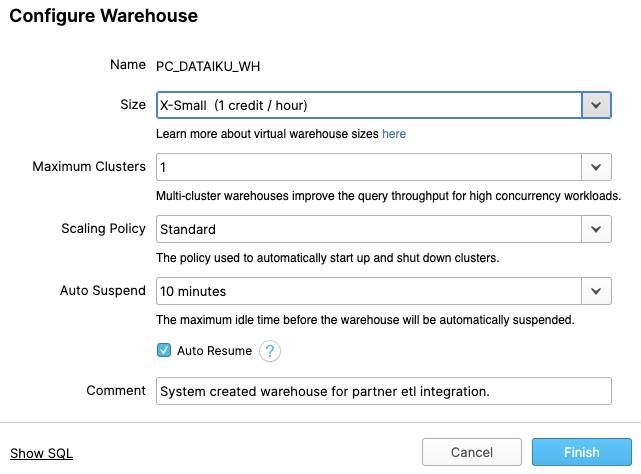

Positive : **Snowflake 컴퓨팅 vs 타사 웨어하우스** <br> 웨어하우스 생성, 스케일 업, 스케일 아웃 및 자동 일시 중단/재개 기능과 같이 방금 다룬 여러 웨어하우스/컴퓨팅 기능이 Snowflake에서는 모두 간단하게 이뤄지며 단 몇 초면 할 수 있습니다. 그러나 온프레미스 데이터 웨어하우스의 경우 이러한 기능은 상당한 물리적 하드웨어, 워크로드 급증에 대비한 과한 하드웨어 프로비저닝, 상당한 구성 작업을 필요로 하며 추가적인 문제로 인해 구현하기가 매우 어렵습니다(또는 불가능합니다). 심지어 다른 클라우드 데이터 웨어하우스는 훨씬 더 많은 구성 작업과 시간을 투자하지 않고는 Snowflake와 같은 스케일 아웃 및 스케일 다운이 가능하지 않습니다.

Negative : **경고 - 지출을 조심하십시오!**

이 랩을 진행하는 동안이나 이후에 정당한 이유 없이 다음 작업을 수행하는 걸 권장하지 *않습니다*. 왜냐면 그렇게 할 경우에는 $400의 무료 크레딧을 원하는 것보다 빨리 소진할 수도 있습니다.

- 자동 일시 중단을 비활성화합니다. 자동 일시 중단이 비활성화되면, 웨어하우스가 계속 실행되어 사용하지 않을 때도 크레딧을 소모합니다.
- 워크로드에 비해 과도하게 큰 웨어하우스를 사용합니다. 웨어하우스가 커질수록 더 많은 크레딧이 소모됩니다.

Dataiku 작업을 위해 이 가상 웨어하우스를 사용할 것입니다. 그러나 먼저 웨어하우스 크기를 약간 늘려 여기에 포함되는 컴퓨팅 파워를 늘릴 것입니다.

이 데이터 웨어하우스 크기를 X-Small에서 Medium로 변경합니다. 그런 다음 ‘Finish’ 버튼을 클릭합니다.


<!-- ------------------------ -->
## Dataiku 프로젝트 생성 및 실행

Duration: 20

이 모듈에서는 Dataiku에서 호스팅하는 평가판 계정에 로그인하고 Dataiku 프로젝트를 생성할 것입니다.

Positive : **완료된 샘플 프로젝트** <br> 이 랩에서 생성할 **COVID-19** 프로젝트의 완벽히 종료된 예를 추가했습니다. 또한 로그인하는 즉시 사용 가능합니다(아래 스크린샷에서와 같이 **Flight Delays**를 예측하는 또 다른 예시 프로젝트 포함).

### Dataiku 프로젝트 생성

Dataiku Cloud 인스턴스로 되돌아갑니다. **OPEN DATAIKU DSS**를 클릭하여 시작합니다.

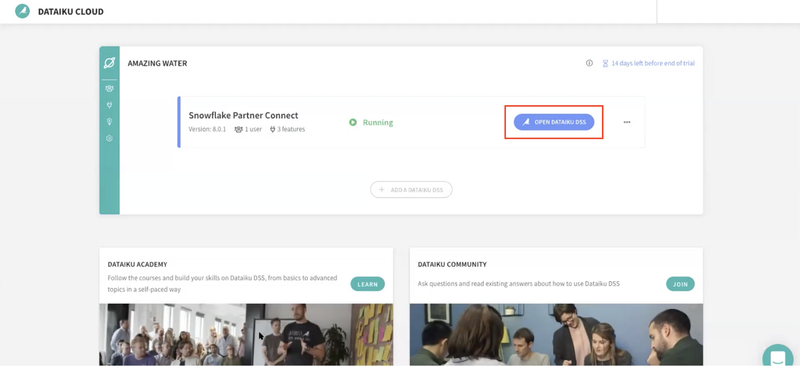

로그인했다면 **+NEW PROJECT**를 **클릭**하고 **Blank 프로젝트를 선택**하여 새로운 프로젝트를 생성합니다.


COVID-19 데이터로 작업할 예정이기에 프로젝트 이름을 **Covid-19**로 지정합니다.

이름을 생성할 때 프로젝트 키는 자동으로 채워지지만 직접 변경할 수도 있습니다.

성공했습니다! 이제 COVID-19 프로젝트를 생성했습니다.


**Got it!**을 클릭하여 **Navigation and help in DSS** 팝업을 최소화하고 프로젝트 홈 화면으로 되돌아갑니다.

Dataiku DSS 페이지 검토 예시 프로젝트의 프로젝트 랜딩 페이지에서 주의를 기울여야 하는 몇 가지 부분이 있습니다.

- 프로젝트 이름, 프로젝트와 관련된 이미지, 협력자 및 선택 태그:

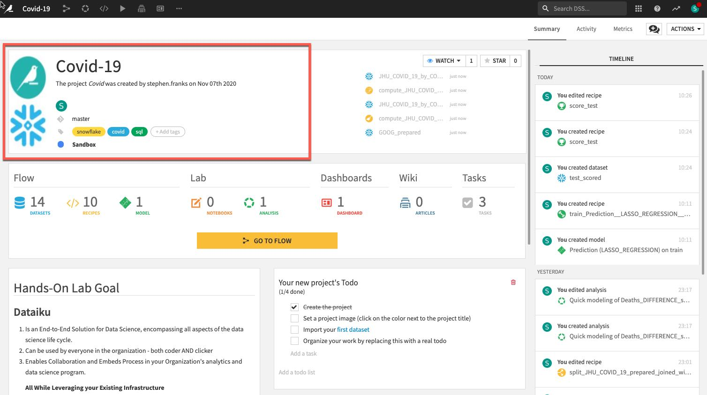

- 프로젝트에 있는 오브젝트의 수와 유형.

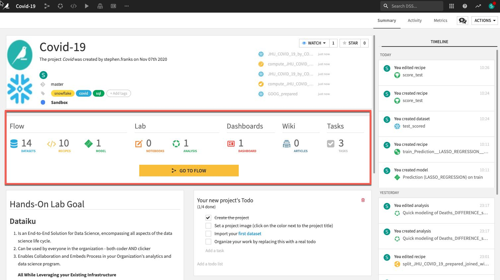

- 마크다운으로 작성된 프로젝트의 설명은 설명에 있는 특정 Dataiku 오브젝트(예: 데이터 세트, 저장된 모델 등)를 연결할 수 있습니다.


- 프로젝트 Summary(기록은 Git 로그에 저장됨)와 더불어 더 나은 협업을 위한 Chat 기능입니다.


### 데이터 세트 가져오기

**JHU_COVID_19** 및 **GOOG_GLOBAL_MOBILITY_REPORT** 데이터 세트를 가져옵니다

**+IMPORT YOUR FIRST DATASET**를 클릭합니다

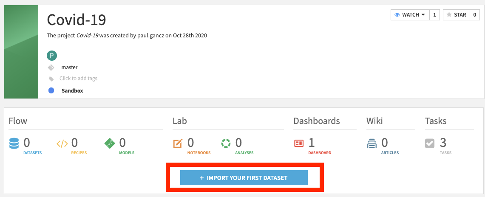

SQL에서 **Snowflake**를 선택합니다


JHU 테이블을 로드하려면 Table에 **JHU_COVID_19**(모두 대문자)를 입력하고 Schema에 **PUBLIC**을 입력합니다. 그런 다음 **TEST TABLE**을 클릭하여 연결을 테스트합니다.

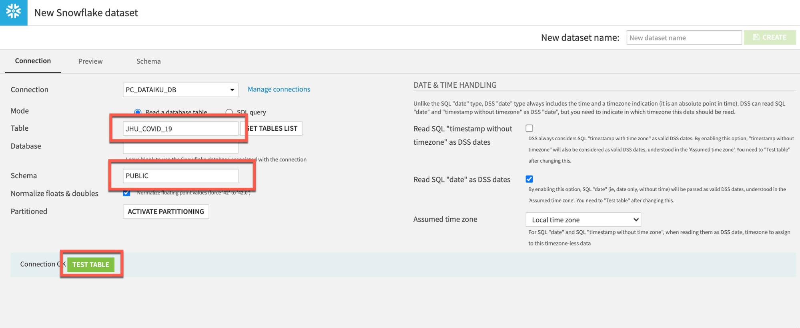

성공적이라면 **CREATE**를 **클릭**하여 테이블을 생성합니다.


왼쪽 상단*(바로 가기 키 G+F)*에 있는 **흐름** 아이콘을 클릭하여 흐름으로 되돌아갑니다.


단계를 반복하여 **GOOG_GLOBAL_MOBILITY_REPORT** 테이블을 로드합니다.

흐름에서 **+Dataset**를 클릭합니다

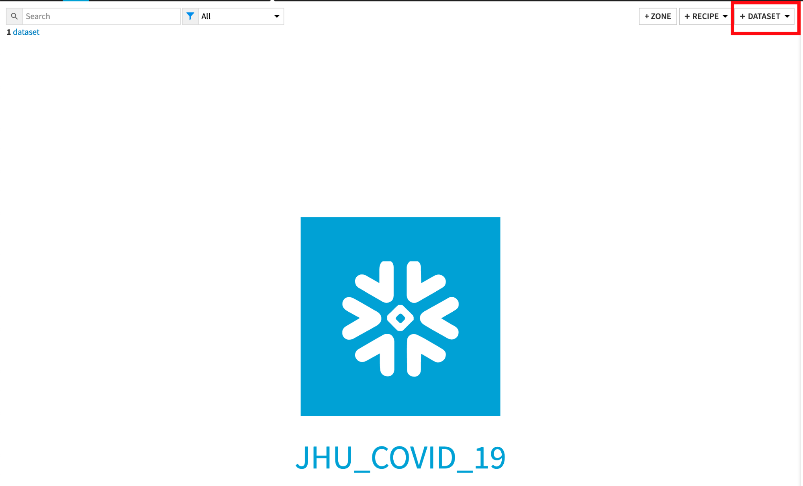

**SQL databases**에 커서를 올리고 **Snowflake**로 이동합니다.


Table에 **GOOG_GLOBAL_MOBILITY_REPORT**(모두 대문자)를 입력하고 Schema에 **PUBLIC**을 입력합니다.

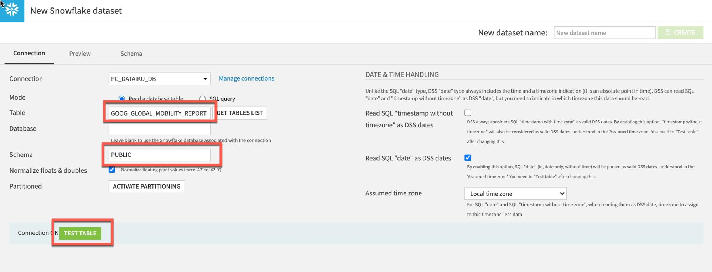

**Test Table**을 클릭한 다음 **Create**를 클릭합니다.

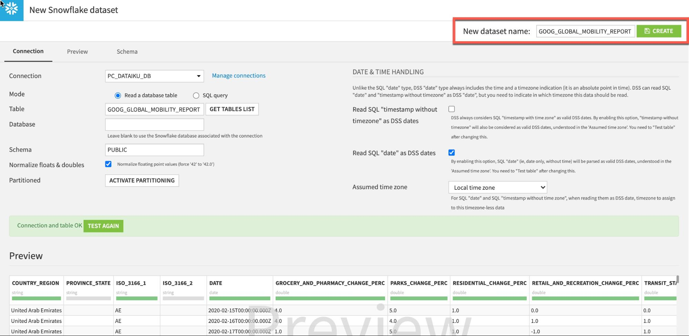

흐름으로 되돌아갑니다(바로 가기 키 G+F). 흐름은 이제 다음과 같이 나타나야 합니다.


**JHU_COVID_19** 데이터 세트를 두 번 클릭합니다

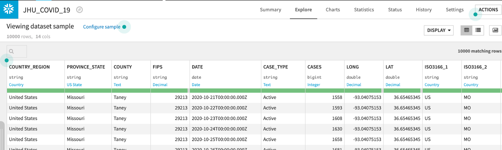

**JHU_COVID_19** 테이블에는 해당 날짜의 사례 수와 유형(Active, Confirmed, Deaths, Recovered)에 대한 위치와 일별 데이터가 포함되어 있습니다.

Dataiku는 기본값으로 10,000개의 샘플 행을 읽습니다. 샘플링 메서드는 **Configure Sample**에서 변경할 수 있지만 이 랩에서는 기본값으로 유지해도 됩니다.

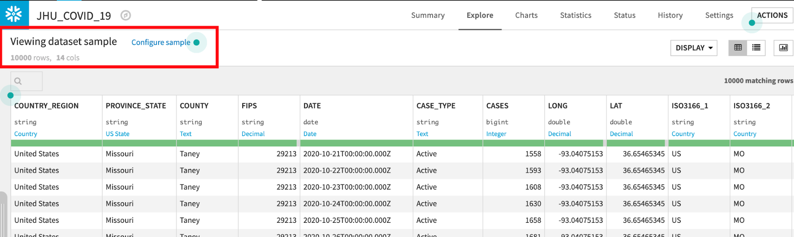

Dataiku는 자동으로 데이터 형식과 각 열의 의미를 감지합니다. 상태 표시줄은 유효한 데이터(녹색), 유효하지 않은 데이터(빨간색), 누락된 데이터(회색)의 수를 표시합니다. 오른쪽에 있는 **Quick Column Stats** 버튼을 클릭하여 Stats 열(데이터 품질, 분포)을 볼 수 있습니다.


끝났다면 **Close** 버튼을 클릭합니다.


보다 심층적인 뷰를 원한다면 열 이름을 클릭한 다음 **Analyze**를 선택하여 열 수준 통계(샘플!)를 확인합니다.

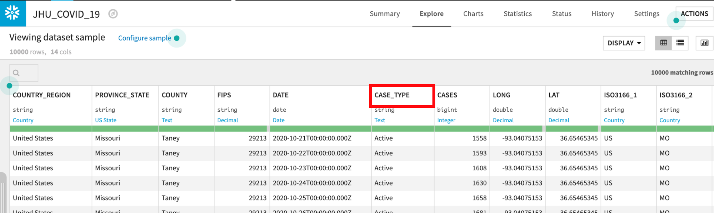

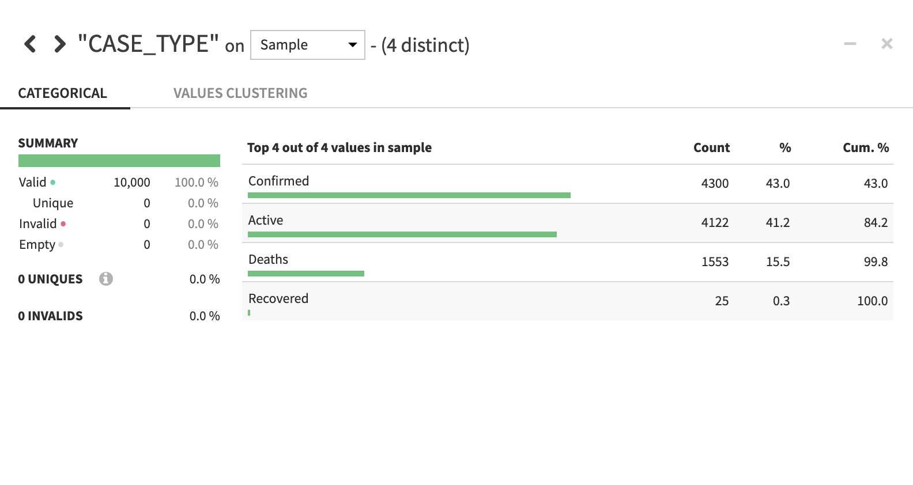

흐름으로 다시 이동합니다. 왼쪽 상단 모서리에 있는 **Flow** 메뉴 항목을 단순히 클릭하거나 바로 가기 키 G+F를 사용하여 이를 언제나 수행할 수 있습니다.


이제 흐름에서 다시 한 번 2개의 데이터 세트가 보여야 합니다.

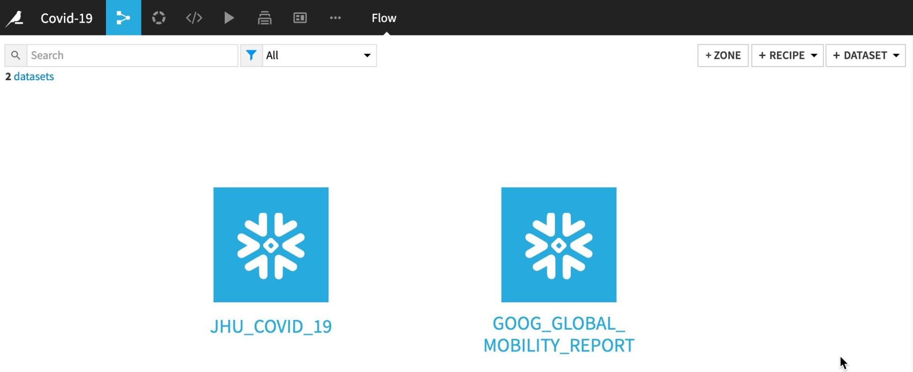

흐름에서 두 번 클릭하여 **GOOG_GLOBAL_MOBILITY_REPORT** 데이터 세트를 탐색합니다.


**GOOG_GLOBAL_MOBILITY_REPORT** 테이블에는 여러 카테고리(식료품점, 약국, 공원 등)에 걸친 퍼센트 변화에 대한 위치 및 일별 데이터가 포함되어 있습니다. 이 데이터 세트에 대한 자세한 내용은 [여기](https://www.google.com/covid19/mobility/)에서 확인하십시오.

흐름으로 다시 이동합니다. 왼쪽 상단 모서리에 있는 **Flow** 메뉴 항목을 클릭하거나 바로 가기 키 G+F를 사용할 수 있습니다.

### 데이터 준비

**Group.** 2개의 데이터 세트에서 단순한 일부 집계를 수행하며 시작하겠습니다. 이는 이동성 변화와 지리적 영역에 걸친 새로운 COVID-19 사례를 이해하는 데 도움이 될 것입니다. 이를 위해 **Group** 레시피를 사용할 것입니다.

**JHU_COVID_19** 테이블을 한 번 클릭한 다음 오른쪽에 있는 패널의 Visual 레시피 아래에 있는 **Group**을 선택합니다.


**Group By** 드롭다운에서 **COUNTRY_REGION**을 선택하고 **Create Recipe**를 클릭합니다.

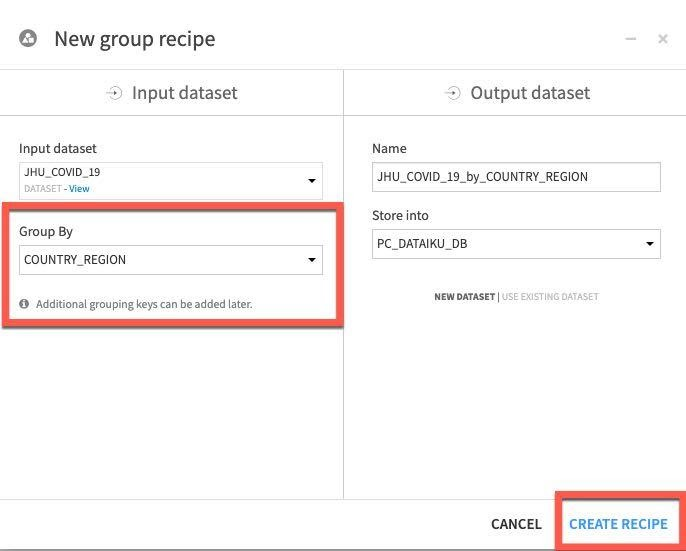

일부 추가 키를 그룹에 추가하고자 합니다.

상단 섹션에서 **Group Keys**는 **Select key to add** 드롭다운을 사용한 다음 **ADD** 버튼으로 **PROVINCE_STATE**, **DATE** 및 **CASE_TYPE**을 위한 그룹화 키를 추가합니다

동일한 섹션에서 이 통계가 필요하지 않기에 화면 중앙에 있는 **Compute count for each group** 옵션 선택을 해제합니다

새로운 사례를 확인하고자 하기에 메인 **Per field aggregations** 섹션에서 **Difference** 필드를 찾아 **Sum** 집계를 추가합니다.

이제 화면은 다음과 같이 나타나야 합니다.

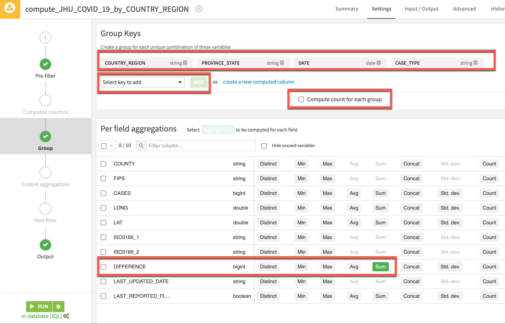

John Hopkins 데이터에는 4가지 사례 유형이 있지만 Deaths와 Confirmed만을 사용하고 예측하고자 합니다.  따라서 Active와 Recovered 레코드는 필터링할 것입니다.  또한 이전 섹션에서 밝혀진 문제 있는 Peru 데이터를 필터링할 것입니다.  
할 일:

- Group 레시피 화면의 왼쪽에서 Pre-Filter를 선택합니다.
- Filter 토글을 켜고 다음을 충족하는 행만 남도록 드롭다운에서 지정합니다. ‘all the following conditions'
- 드롭다운에서 CASE_TYPE를 선택한 다음 ‘is different from’을 선택하고 Recovered를 입력합니다.
- \+ Add A Condition 버튼을 클릭하고 CASE_TYPE를 다시 드롭다운에서 선택하고, ‘is different from’을 선택한 다음 Active를 입력합니다
- \+ Add A Condition 버튼을 클릭하고 COUNTRY_REGION를 다시 드롭다운에서 선택하고, ‘is different from’을 선택한 다음 Peru를 입력합니다

Positive :  참고: 이러한 값은 대/소문자를 구분하기에 ‘recovered’, ‘active’ 및 ‘PERU’는 올바르게 작동하지 않을 것입니다.  또한 위 단계에서 ‘all the following conditions column’이 아닌 ‘all the following conditions’를 선택해야 합니다

이제 화면은 다음과 같이 나타나야 합니다.


그런 다음 왼쪽 하단에서 **RUN**을 클릭하여 레시피를 실행합니다. 컴퓨팅 엔진은 계산을 Snowflake로 푸시다운하기 위해 **In-database (SQL)**여야 합니다(필요할 경우 톱니 3개 클릭).

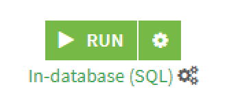

스키마를 변경하고 있기에 이에 대한 경고가 발생할 것입니다. **Update Schema**를 클릭합니다.

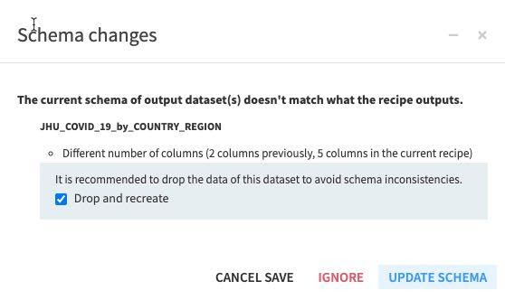

작업이 실행될 것이며 모든 것이 제대로 작동한다면 페이지 푸터에 **Job Succeeded** 메시지가 수신될 것입니다.

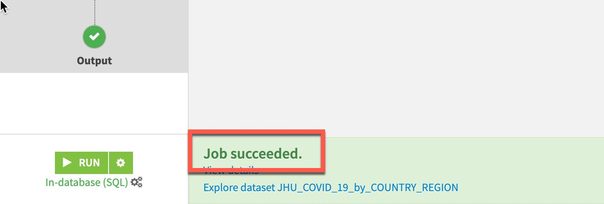

왼쪽 상단에 있는 **Flow 아이콘을 클릭**하거나 **키보드에서 G + F 키를 눌러** **흐름으로 되돌아갑니다.**

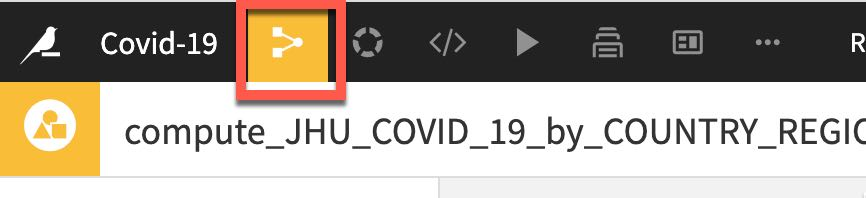

이제 Google의 Mobility 데이터 세트를 집계할 것입니다. 흐름에서 **GOOG_GLOBAL_MOBILITY_REPORT**를 **한 번 클릭**하고 Visual Recipes에서 **Group**을 선택합니다. **Group by**에서는 **COUNTRY_REGION**을 선택하고 **Create Recipe**를 클릭합니다.

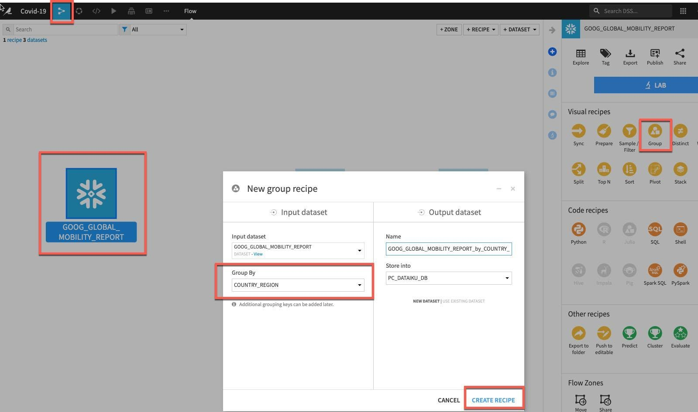

레시피의 **Group** 스테이지에서 이전과 동일한 방식으로 **PROVINCE_STATE**와 **DATE**를 추가 그룹화 키로 추가합니다.

개별적으로 또는 대량 **Actions** 버튼을 사용하여 다음을 확인합니다.

* **GROCERY_AND_PHARMACY_CHANGE_PERC**
* **PARKS_CHANGE_PERC**
* **RESIDENTIAL_CHANGE_PERC**
* **RETAIL_AND_RECREATION_CHANGE_PERC**
* **TRANSIT_STATIONS_CHANGE_PERC**
* **WORKPLACES_CHANGE_PERC**

이제 화면은 다음과 같이 나타나야 합니다.

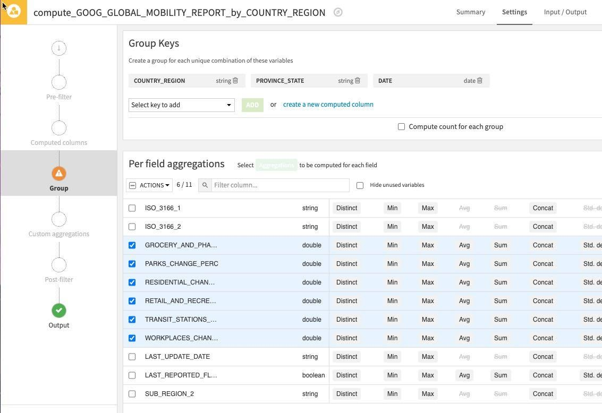

**Actions** 드롭다운을 클릭하고 선택된 6개의 열에 **Avg**를 적용합니다. 이전과 같이 필요하지 않기에 **Compute count for each group** **선택을 해제**합니다.

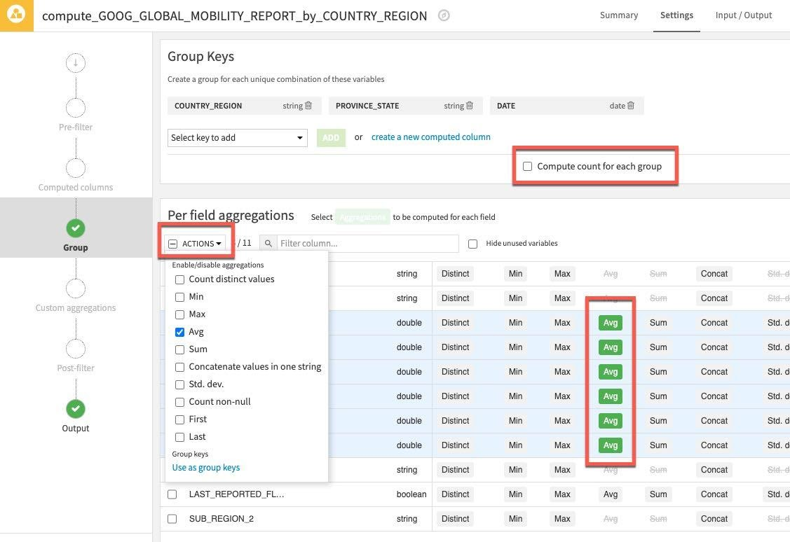

그런 In-database (SQL)이 컴퓨팅 엔진임을 확인한 다음 왼쪽 하단에서 **RUN**을 클릭하여 레시피를 실행합니다


이전과 같이 스키마를 변경하고 있기에 이에 대한 경고가 발생할 것입니다. **Update Schema**를 클릭하고 새롭게 집계된 데이터 세트를 탐색합니다.

**G + F 키를 눌러 흐름 화면으로 되돌아갑니다**.

**JHU_COVID_19** 테이블에는 이전 단계의 사례 유형과 국가 지역, 주, 날짜 및 유형별로 그룹화한 이전 열로부터 계산한 차이를 위한 열이 포함되어 있습니다.

그러나 사례 유형과 차이가 별도의 열(예: Confirmed 및 Deaths는 별도의 열임)일 수 있도록 데이터 서식을 변경하고자 합니다. **Pivot** 레시피로 이러한 작업을 수행할 수 있습니다.

흐름에서 **JHU_COVID_19_by_COUNTRY_REGION**을 클릭한 다음 **Pivot**을 선택합니다.

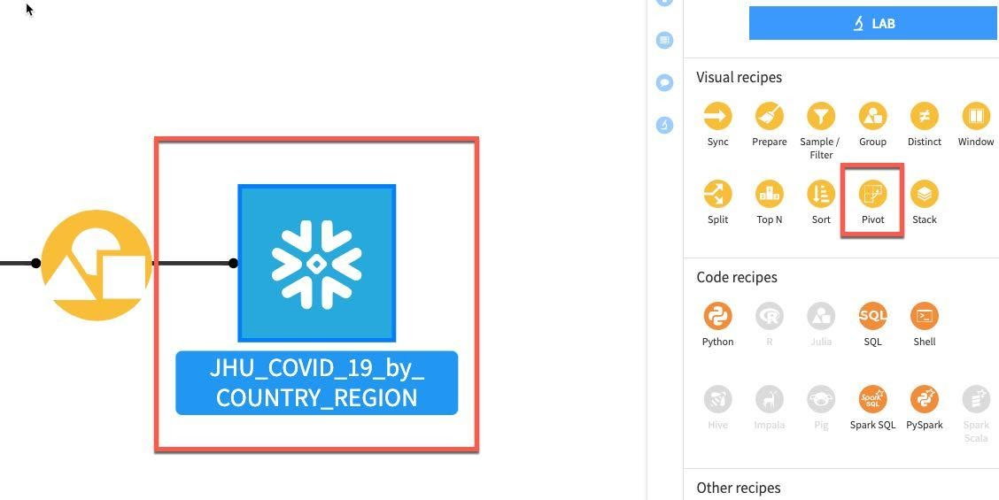

**Pivot By** 드롭다운에서 **CASE_TYPE**을 선택합니다.

**CREATE RECIPE**를 클릭합니다.

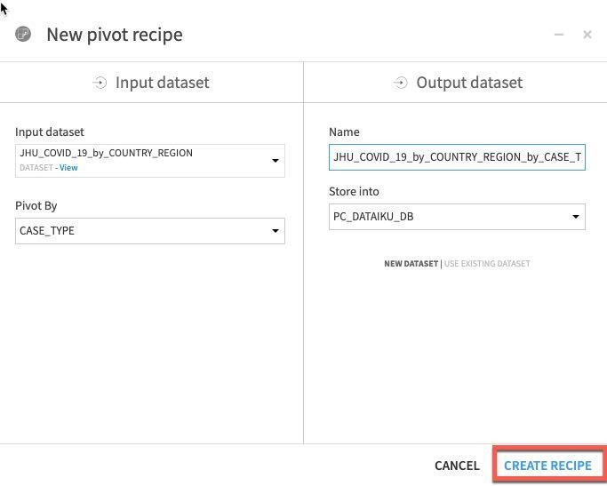

이 화면이 나타나야 합니다.


우선 왼쪽 상단에 있는 **Examples** 상자에서 가져온 예시 중 하나를 사용하겠습니다. **Pivot Table**을 선택합니다.

그런 다음 일부 Row identifiers를 선택합니다. 출력 테이블에서와 같이 검색될 열이 존재합니다. **Row identifiers** 아래에서 ‘Add new column’을 클릭합니다.


다음 열을 선택합니다. **COUNTRY_REGION**, **PROVINCE_STATE** 및 **DATE**

(참고: 여기에서 열 식별자를 추가하는 순서는 단순히 출력 데이터 세트에 열이 나타날 순서를 반영합니다. 아주 중요하지는 않지만 원한다면 여러분의 프로젝트 데이터 세트가 이 가이드에서 보이는 아래 순서를 반영하도록 할 수 있습니다.)

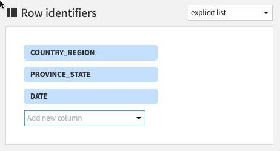

그런 다음 **Populate content with** 섹션에서는 **CASE_TYPE**을 포함한 새로운 열 아래에 속할 값을 정의할 것입니다. 집계에는 값, 최소, 최대 등의 카운트와 같은 다양한 옵션이 있습니다.

우선 **Count of records**를 **선택 해제**합니다.


그런 다음 **Add new** 드롭다운을 클릭합니다.

값이 하나밖에 없으니 **Difference_sum**을 선택합니다. 기본 집계는 원치 않는 **count**입니다. 이를 변경하려면 카운트 왼쪽에 있는 **아래쪽 화살표**를 클릭합니다.


Count 대신 **Aggregation** 아래에서 **Min**을 선택합니다.

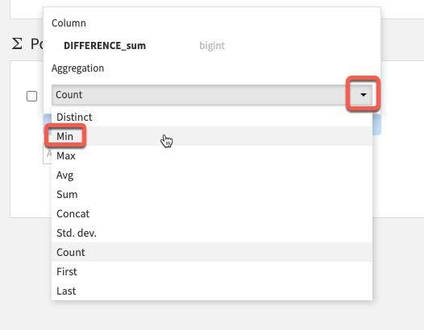

이제 다음 설정이 적용되어 있어야 합니다. Pivot 레시피에서 **RUN**을 클릭합니다

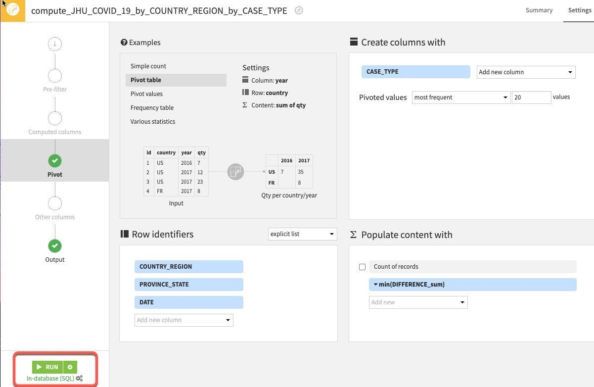

새로운 열이 정상적으로 생성되었는지 확인하기 위해 흐름으로 되돌아가 새로운 데이터 세트를 두 번 클릭하여 새로운 데이터 세트를 탐색합니다.

사례 유형(**Confirmed** 및 **Deaths**)을 위해 새로운 열이 있음을 볼 수 있으며 **PROVINCE_STATE**에서 데이터가 꽤 많이 누락된 것을 볼 수 있습니다. 이 문제는 다음 섹션에서 처리할 것입니다.

시간이 있다면 **Deaths_DIFFERENCE_sum_min** 열을 **마우스 왼쪽 버튼으로 클릭**하고 **Analyze**를 선택하는 것도 좋습니다. 데이터 분포에 대해 무엇을 알아차리셨나요? 꽤나 큰 이상값(보이지 않는다면 **Sample**에서가 아닌 **Whole data**에서 실행)이 있는 것 같습니다. 이러한 부분 또한 다음 섹션에서 처리하고자 합니다.

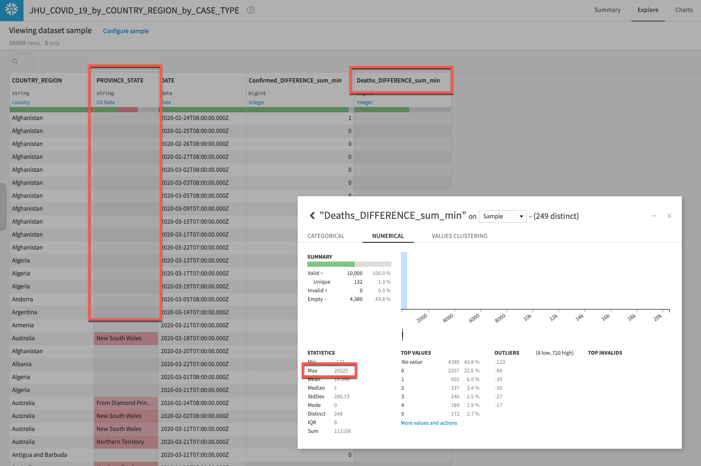

**흐름으로 되돌아가면** 이 스테이지에서는 여러분의 프로젝트 흐름이 다음과 같이 나타나야 합니다.

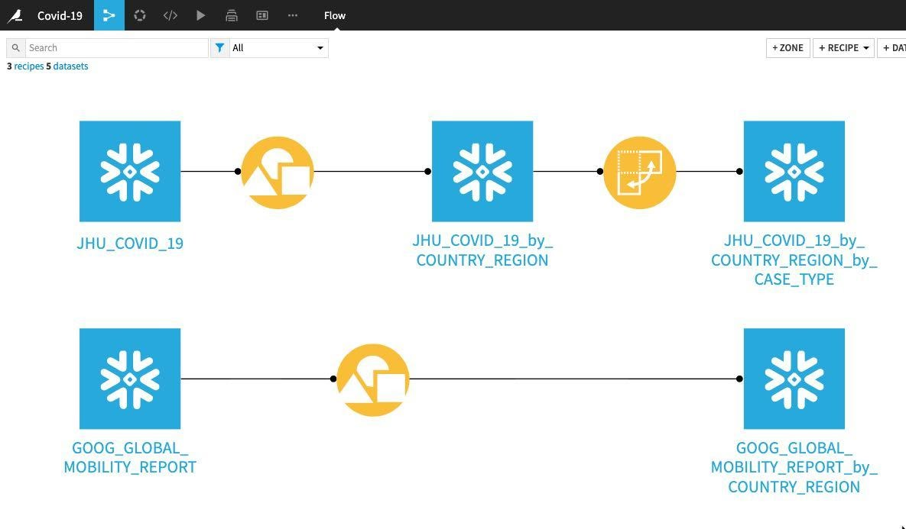

지금까지 사용한 그룹화 및 피벗과 같은 레시피는 주어진 작업을 수행하며 여러분에게 아마도 이미 익숙할 것입니다. Prepare 레시피는 약간 다릅니다. 이를 보유하고 있는 데이터 정리, 정규화 및 강화를 위한 도구를 DIY를 위한 망치, 끌 및 줄자와 같은 도구가 아닌 도구 상자라고 생각해 보십시오. DSS 전문 용어로는 이러한 ‘도구’를 프로세서라고 부르며 Prepare 레시피에서는 이를 시각적 및 대화형 방식으로 사용합니다.

Prepare 레시피에서 사용할 수 있는 다양한 프로세서가 있으며 누락된 데이터에 대한 도움을 받기 위해 가장 간단한 몇몇 도구를 사용할 것입니다.

흐름에서 그룹화되었으며 전환된 JHU 데이터 세트를 **클릭**한 다음 **Prepare** 레시피를 선택합니다.

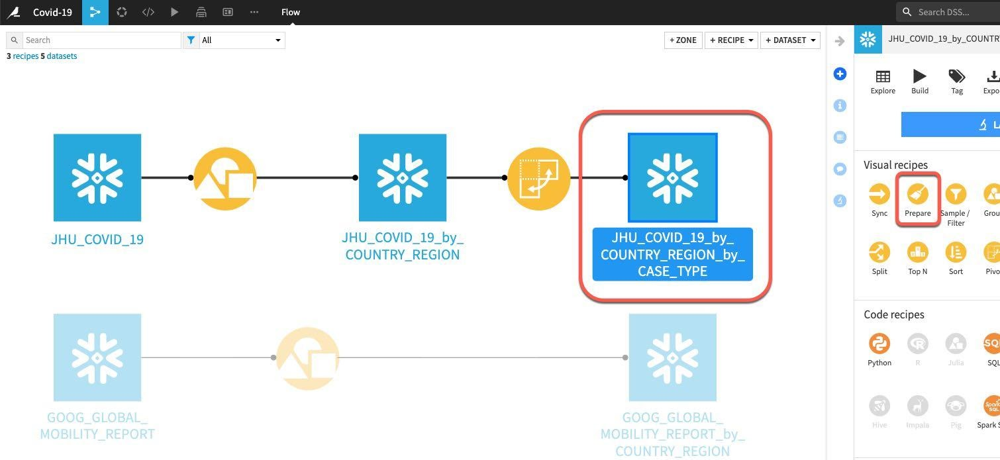

자동으로 생성된 출력 데이터 세트 이름이 몇 번의 변환 이후에 약간 다루기 힘들어진 것을 볼 수 있습니다.

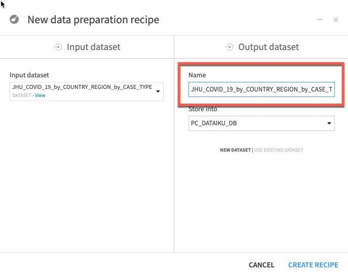

이를 **JHU_COVID_19_prepared**로 **자른** 다음 **Create Recipe**를 클릭합니다.

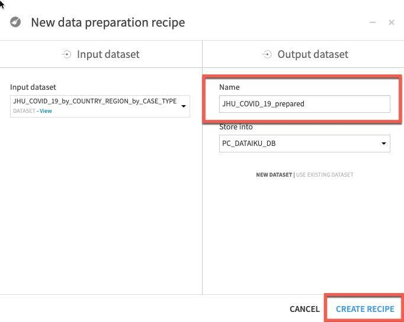

**PROVINCE_STATE** 열에서 누락된 데이터를 처리하고자 합니다. Prepare 레시피가 이 작업에 여러 방식으로 도움이 될 수 있으며 아마 가장 단순한 기술을 사용하여 비어 있는 행을 채울 것입니다.

**PROVINCE_STATE**라는 열을 **마우스 왼쪽 단추로 클릭**한 다음 **More actions를 선택**하고 **Fill empty rows with…**를 선택합니다

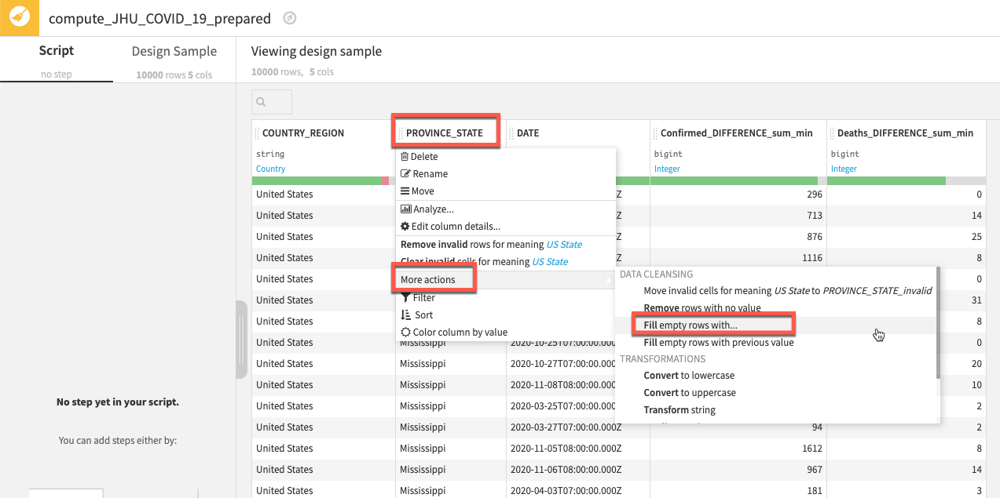

브레이크 아웃 상자에 단순히 **NA**를 입력하고 **OK**를 클릭합니다.

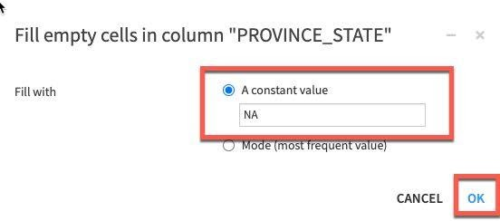

단계는 왼쪽에 추가됩니다. 그런 다음 **COUNTRY_REGION** 또는 **DATE**가 비어 있다면 행을 제거할 것입니다.

방금 사용한 것과 같은 컨텍스트에 민감한 옵션과 더불어 프로세서의 전체 라이브러리에도 액세스할 수 있습니다.

**+ADD A NEW STEP** 버튼을 **클릭**합니다. 이 단계에서는 다양한 옵션을 선택할 수 있습니다. 따라서 Processor 라이브러리에서 **Data Cleansing**을 선택하고 **Remove rows where cell is empty** 프로세서(프로세서가 있는 위치를 모르거나 주어진 작업에 사용 가능한 옵션을 탐색할 때 검색 창도 사용 가능)를 선택합니다.


왼쪽에 생성된 단계에서 **multiple** 열 옵션을 선택하고 **+ADD A COLUMN** 버튼을 클릭하여 우선 **COUNTRY_REGION**을 추가합니다. 그런 다음 **DATE** 열을 추가합니다.

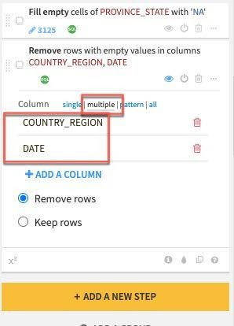

마지막으로 전환한 다음 **Death_DIFFERENCE_sum_min** 열을 분석할 때 발견한 이상값을 처리하겠습니다.

**+ADD A NEW STEP** 버튼을 다시 **클릭**하여 프로세서 라이브러리를 엽니다. 이번에는 **Filter Data** 섹션을 **선택**하고 **Filter rows/cells on value** 프로세서를 **선택**합니다. Action 드롭다운을 **Remove matching rows**로 **설정**하고, Column에 **DATE**를 설정한 다음 파란색 **+ADD VALUE** 옵션을 **클릭**하고 **2020-08-31** 날짜를 입력합니다

**참고:** 주기적으로 업데이트되고 수정되는 실시간 데이터 세트에서 작업하고 있습니다. 이와 같은 오류가 JHU 데이터 세트에서 제거되었다면 이 단계를 건너뛰어도 됩니다.

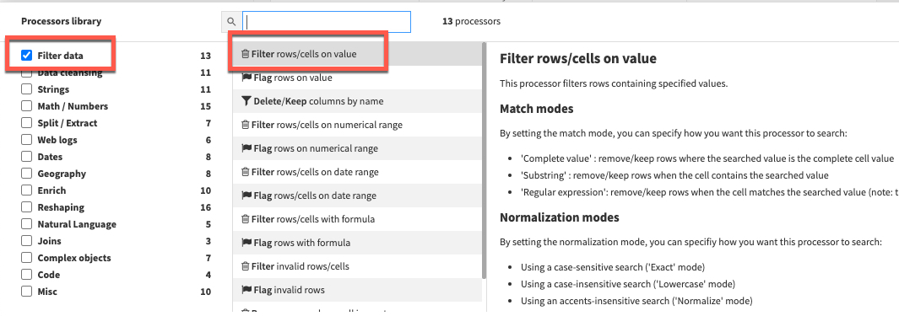

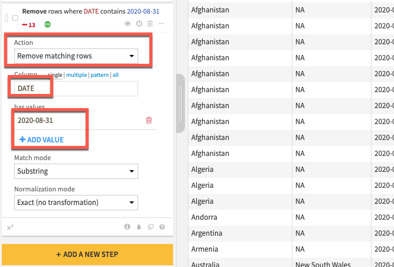

레시피를 실행하기 전에 **어떤 실행 엔진이 사용될 것인지 확인**합니다. **Local stream**으로 설정되어 있다면 **톱니 3개를 클릭**하고 **In-database (SQL)를 선택**한 다음 **RUN**을 클릭하여 Snowflake로 계산을 푸시합니다.

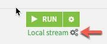

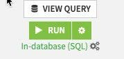

**G + F 키를 눌러 흐름 화면으로 되돌아갑니다.**

그룹화된 Google Mobility 데이터에서 동일하게 단순한 데이터 정리를 수행하고자 합니다. 프로세스를 반복하는 대신 흐름에서 단순히 이전에 생성했던 **Prepare 레시피**를 **한 번 클릭**하고 오른쪽에 있는 **Actions 메뉴**에서 **Copy**를 선택합니다.


복사 브레이크 아웃 상자에서 **Replacement for** 아래에 있는 **드롭다운 상자를 클릭**하여 이전에 그룹화한 이동성 데이터 세트인 **GOOG_GLOBAL_MOBILITY_REPORT_by_COUNTRY_REGION**(참고: 기존 GOOG_GLOBAL_MOBILITY_REPORT가 **아닌** 이 데이터 세트를 선택해야 함)을 찾습니다

출력 이름을 입력해야 합니다. 이 데이터 세트 이름을 **GOOG_prepared**라고 지정하고 **Create Recipe**를 클릭합니다.


**RUN**을 클릭하여 복사된 레시피를 실행하고 프롬프트가 나타나면 **Update Schema**를 선택합니다.

이제 변환을 적용했으니 **JHU**와 **GOOG** 테이블을 합치겠습니다.

**G + F 키를 눌러 흐름 화면으로 되돌아갑니다.**

**JHU_COVID_19_prepared**를 **마우스 왼쪽 버튼으로 클릭**한 다음 **시프트 키를 누르며** **GOOG_prepeared**를 **마우스 왼쪽 버튼으로 클릭**합니다. 이는 오른쪽 패널에 있는 통해 시각적 레시피를 여러 데이터 세트에 적용 가능한 레시피로만 업데이트할 것입니다. **Join** 레시피를 선택합니다.

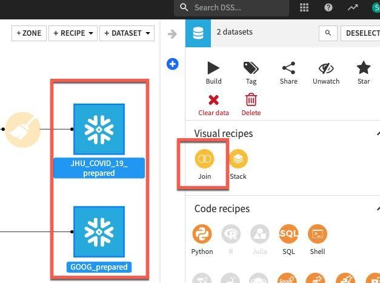

**CREATE RECIPE**를 **클릭**합니다.

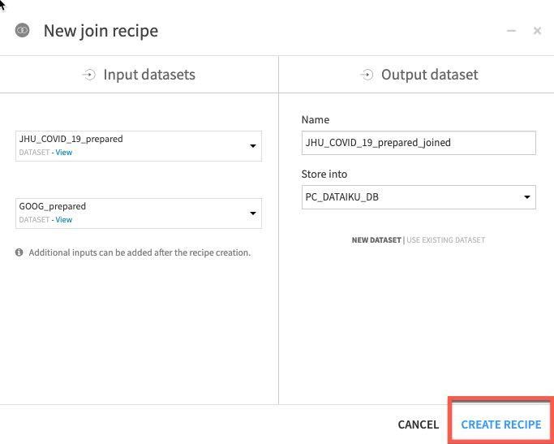

Dataiku는 자동으로 연결할 잠재적 키를 감지합니다. 기본 Join Type은 **Left Join**입니다. 일치하는 것만 남기기 위해 **Inner join**으로 이를 변경하고자 합니다. Join Type과 Conditions를 변경하려면 키 사이에 있는 **= 기호**를 **클릭**합니다.

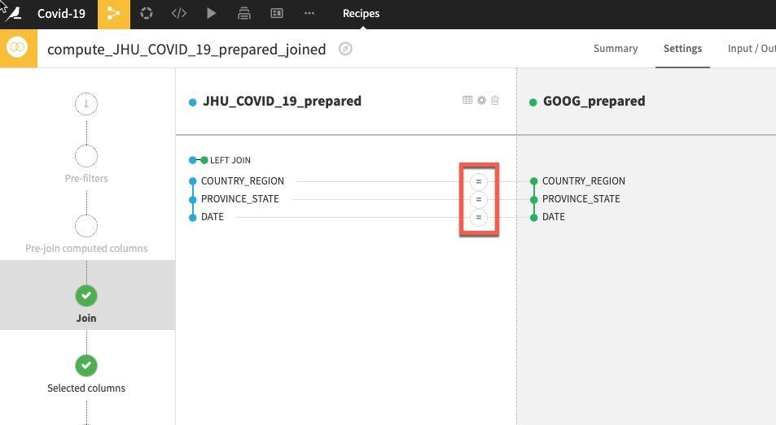

**Join Type을 선택한** 다음 **Inner Join을 선택**하고 **Close**를 클릭합니다.

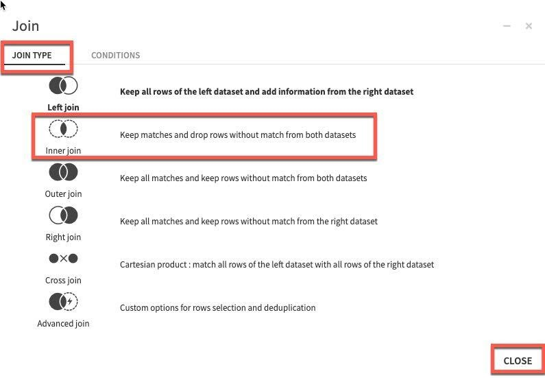

나머지 기본값을 수락하고 **RUN**을 클릭합니다.

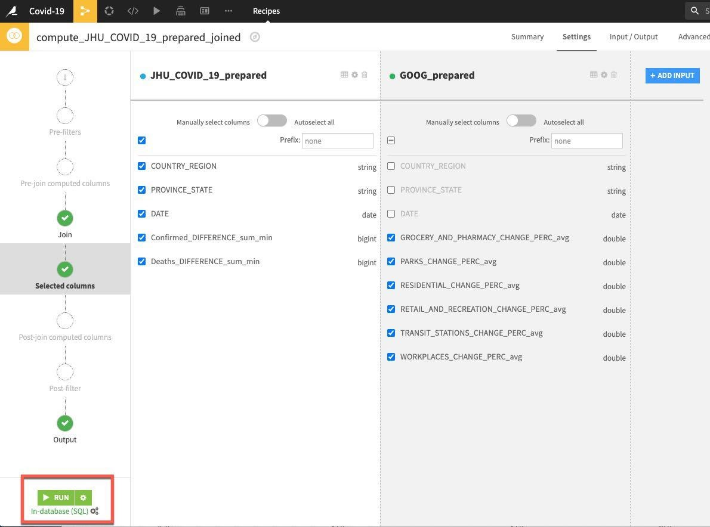

이제 데이터를 탐색하고, 정리하고, 집계하고, 합쳤으니 일부 기능을 생성하고자 합니다. 모델링을 시작할 때 과거 동향이 미래 동향을 예측하는 데 도움이 되는지 확인하기 위해 일부 지연 시간 기능을 계산하고자 합니다. 이를 위해(더 많은 작업에도 사용 가능) **Window** 레시피를 사용할 수 있습니다.

윈도우 함수는 현재 행과 일부분 관련되어 있는 테이블 행 세트에 걸쳐 계산을 수행합니다. 이는 집계 함수를 통해 수행할 수 있는 계산 유형과 유사합니다. 일반적인 집계 함수와는 달리 윈도우 함수는 열을 하나의 출력 행으로 그룹화하지 않습니다. 행은 별도의 ID를 유지합니다.

다시 말해, 이전에 사용했던 Group 레시피와는 달리 Window 레시피는 데이터 세트에서 행의 수를 줄이지 않습니다. 이는 데이터 세트의 모든 행의 하위 집합인 ‘윈도우’에서 모든 행을 사용하는 계산의 결과인 데이터 세트에서 새로운 열을 생성합니다.

**G + F 키를 눌러 흐름 화면으로 되돌아갑니다.**

**JHU_COVID_19_prepared_joined** 데이터 세트를 **클릭**한 다음 **Window** 레시피를 클릭합니다. **New window recipe** 화면에서 기본값을 수락하고 **CREATE RECIPE를 클릭**합니다.


**Window definitions** 아래에서 **Partitioning Columns 토글을 켠** 다음 **COUNTRY_REGION** 및 **PROVINCE_STATE를 선택**합니다. 과거 지연 시간 변수를 생성했으니 **Order Columns 토글을 켜고** **DATE**를 선택하겠습니다.

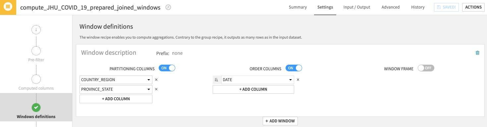

왼쪽에 있는 **Aggregations** 단계를 **클릭**하고 **분할 및 주문에 사용했던 열(COUNTRY_REGION, PROVINCE_STATE 및 DATE)을 제외한** **모든 열을 선택**합니다. 개별적으로 각 집계를 선택하는 대신 대량 작업을 수행하기 위해 **Action** 버튼에서 **아래쪽 화살표를 클릭**합니다.

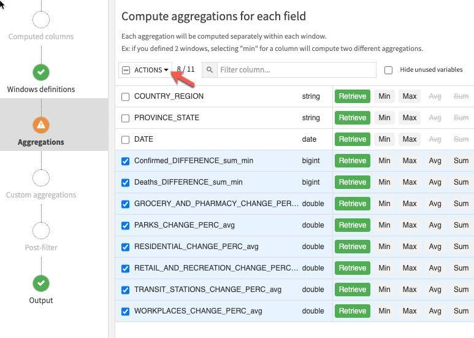

**Retrieve**가 이미 선택되었으니 **Value in a previous row**를 선택하고 **각 지연 시간 상자에 1,2,7,14를 입력**합니다(이 마지막 단계는 개별적으로 완료해야 함). 이는 전날, 그 전날, 1주 및 2주 전의 값을 제공합니다.

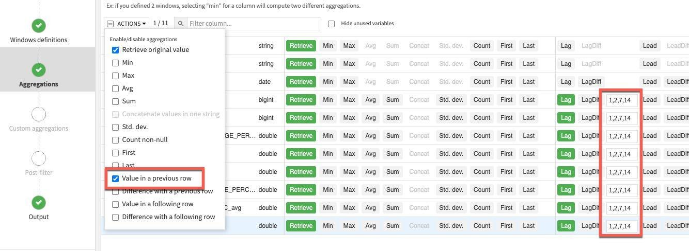

레시피(엔진이 **In-database** 및 **Update Schema**인지 확인해야 함)에서 **RUN**을 클릭합니다. 또한 이 레시피가 스키마 변경 대화 상자에서 생성하는 모든 새로운 열(기능)을 확인합니다.


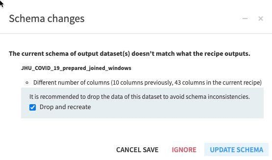

**G + F 키를 눌러 흐름 화면으로 되돌아갑니다.**

**흐름 확인:** 흐름은 다음과 같이 나타나야 합니다.

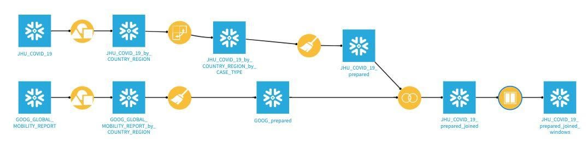

### 선택적 데이터 준비 단계

시간상 오늘은 다룰 수 없는 많은 추가 데이터 준비 단계가 있습니다. 예:

1. 숫자 기능 일반화(시각적 Prepare 레시피 또는 SQL 레시피에서)
2. Window 레시피에서 추가 기능 생성
3. 더 많은 작업이 있으니 이 랩을 종료하고도 탐색해 보십시오!

### 머신 러닝

머신 러닝 모델을 적용하기 전에 데이터를 다음과 같이 나눌 것입니다.

1. 데이터의 80% → 학습
2. 데이터의 20% → 테스트

**합쳐진 데이터 세트를 선택**한 다음 **Split** 레시피를 선택합니다.


**ADD를 클릭**하여 2개의 데이터 세트(학습 및 테스트)를 지정합니다.


하나의 데이터 세트 이름을 **train**으로 지정한 다음 **CREATE DATASET**를 클릭합니다.


테스트를 위해 반복합니다. **ADD**를 클릭한 다음 데이터 세트 이름을 **test**로 지정하고 **CREATE DATASET**를 클릭합니다.


모든 데이터 세트를 생성했다면 **CREATE RECIPE**를 클릭합니다.

분리 메서드의 경우 **Dispatch percentiles of sorted data를 선택**합니다.


**날짜별로 정렬**하고 학습/테스트를 위해 표준 80/20 분할을 지정합니다.


마지막으로 **Pre-Filter** 스테이지를 선택합니다. 사망 차이가 0보다 큰 행만 남기고 싶기에 **Filter 토글을 켠** 다음 **Deaths_DIFFERENCE_sum_min을 선택**하고 이를 **(>) 0**보다 크게 지정합니다.


Split 레시피에서 **RUN**을 클릭합니다.


이제 모델링을 시작할 것입니다. 흐름에서 생성했던 과거 데이터와 기능을 사용하여 사망률의 변화를 예측하고자 합니다.

**G + F 키를 눌러 흐름 화면으로 되돌아갑니다.**

흐름에서 **train 세트**를 **한 번 클릭**한 다음 **LAB**을 클릭합니다.


AutoML Prediction을 선택합니다.

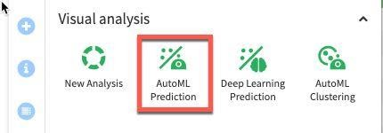

대상 변수인 **Deaths_DIFFERENCE_sum_min**을 **선택**한 다음 **Quick Prototypes**와 **Create**를 선택합니다.

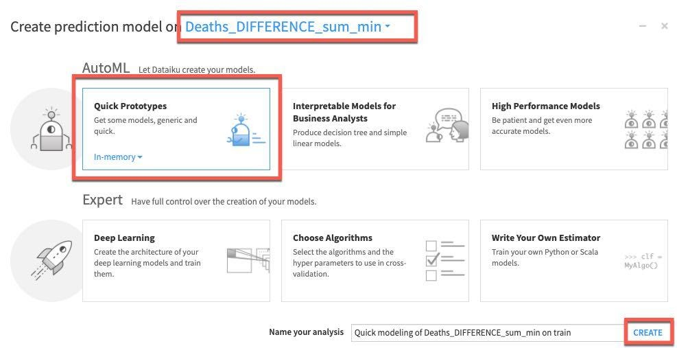

**DESIGN** 탭을 **선택**하여 모델 학습 매개 변수를 구성합니다. 화면 왼쪽에 있는 **Train/Test Set** 섹션에서 **TIME ORDERING을 활성화**하고 **DATE**를 시간 변수로 설정합니다. 방대한 데이터 세트를 사용하고 있지 않기에 **Sampling Method**를 **No Sampling (whole data)**로 설정할 수 있습니다.

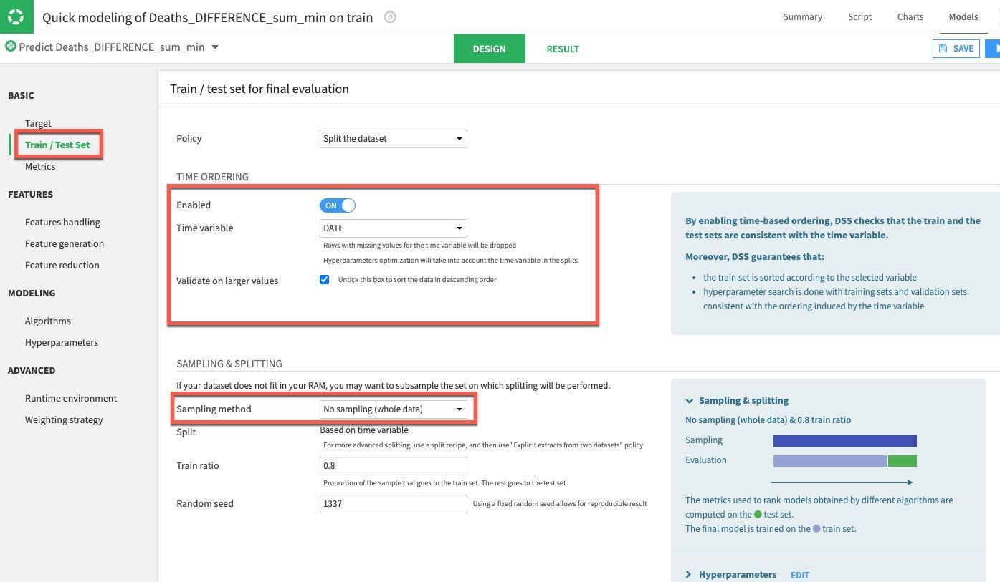

그런 다음 **Features Handling** 섹션을 선택합니다. 여기에서는 기능의 토글을 설정할 수 있습니다(머신 러닝 도중에 사용되어야 하나요? 만약 사용된다면 변수 유형은 어떻게 다뤄야 하나요?). 예측을 위해 단순히 숫자 데이터만 사용할 것이니 **COUNTRY_REGION, PROVINCE_STATE 및 DATE 토글을 끄겠습니다**. 나머지 숫자 기능은 학습 전에 크기 조정을 가능케 하는 세트로 남아 있을 수 있습니다.


마지막으로 **Algorithm** 섹션을 선택합니다. 여기에 다양한 옵션이 있지만 일부 단순한 회귀에 집중하겠습니다. 또한 **Ridge Regression 및 Lasso Regression**의 **토글만 켜겠습니다**. 끝났다면 모델을 학습시키기 위해 **Train** 버튼(오른쪽 상단)을 **클릭**합니다.

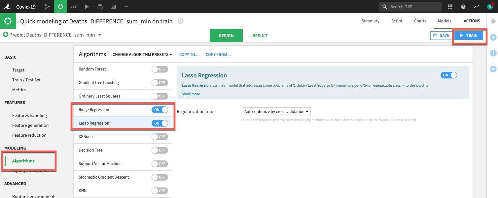

선택적으로 학습 세션의 이름을 지정하고 설명을 입력하거나 비워 둘 수 있습니다. 다시 **Train을 클릭합니다**.


DSS는 여러분의 디자인 설정에 맞춰 모델을 생성하고 학습시킬 것입니다. 첫 번째 세션에서는 평가하고 있는 메트릭의 측면(이 경우 R2 점수, 1에 가까울 수록 좋음)에서 Lasso regression이 Ridge regression을 능가했음을 확인할 수 있습니다.

**세션 창** 또는 **결과 창**에서 이름을 **클릭**하여 최고의 성능 모델에 대한 세부 정보를 **드릴다운**합니다.

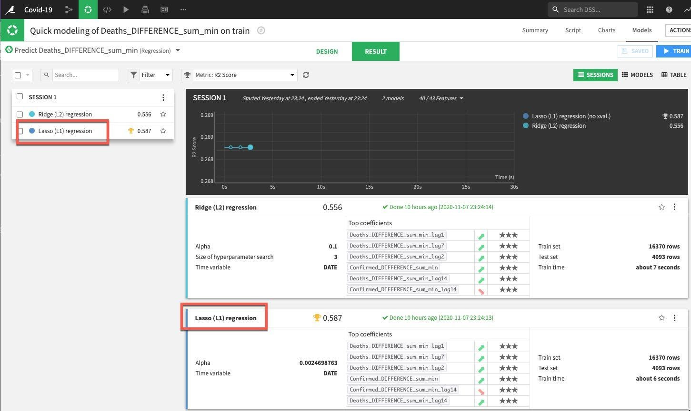

모델을 해석하고 성능에 대해 더 잘 이해하는 데 도움이 되는 몇 가지 도구와 시각화를 보유하고 있습니다. **INTERPRETATION** 메뉴 아래에서 왼쪽에 있는 **Regression coefficients** 옵션을 **클릭**하여 계수를 확인하겠습니다. 아마 놀랍지 않게도 최근 사망이 중요하지만 학습 세션을 실행하려면 거주 변화도 중요합니다.

**참고:** 모델 요약 화면에 있을 때 모델 학습 및 디자인 화면으로 되돌아가고 싶다면 상단에 있는 **Models**를 **클릭**하기만 하면 됩니다.

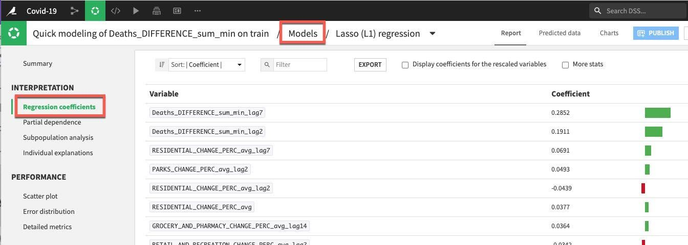

왼쪽 메뉴에 있는 **Performance** 섹션 아래에서 **Scatter Plot**을 **클릭**합니다.

모델이 완벽하다면 모든 포인트가 대각선에 위치할 것입니다. 이는 예측한 값이 실제 값과 정확하게 일치함을 의미합니다. 선 아래에 위치한 포인트는 과소평가를 의미하고 선 위에 있는 포인트는 과대평가를 의미합니다. 일반적인 목표는 포인트와 대각선 사이의 거리를 최소화하는 것입니다.

이 예는 개선할 여지가 있지만 첫 번째 실행임을 감안하면 괜찮습니다.

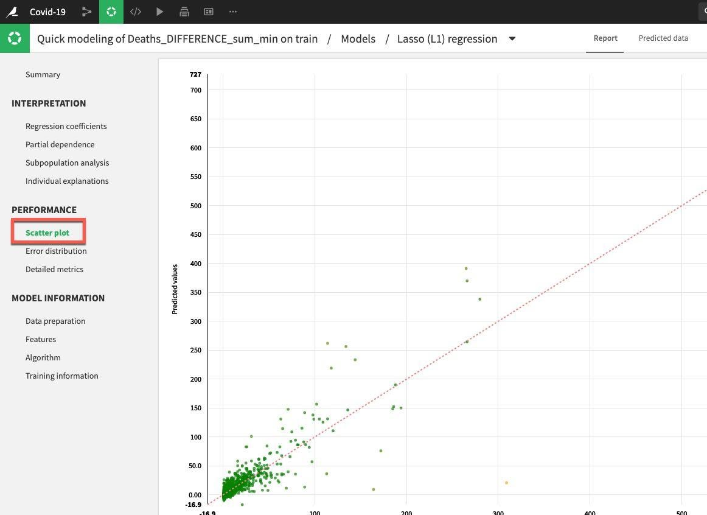

또한 **Interpretation** 메뉴 아래에 있는 **Subpopulation analysis**를 **클릭**하겠습니다. 이는 모델이 다양한 부분 모집단에 걸쳐 동일하게 작동하는지를 평가하는 데 유용할 수 있습니다. 이 경우에는 국가별로 분석하겠습니다. **드롭다운**에서 **COUTRY_REGION을 선택**하고 **COMPUTE**를 클릭합니다. 이 예에서 모델이 미국, 멕시코 및 인도 데이터를 대상으로는 잘 수행되었지만 다른 많은 국가를 대상으로는 그렇지 않았습니다.

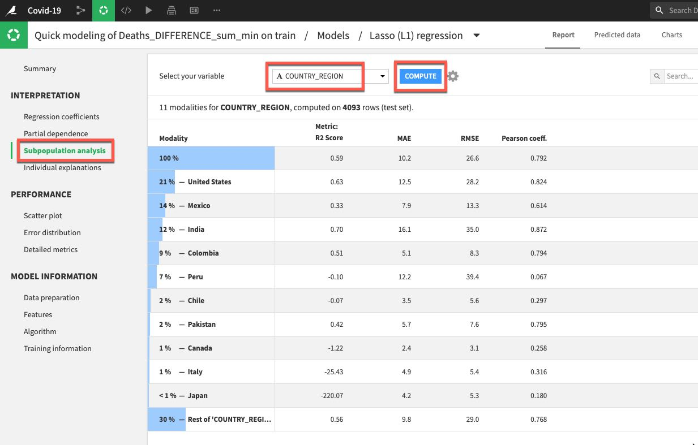

이러한 부분은 추가적으로 탐색하기를 원하기에 이제 모델을 이해하고 개선하기 위한 실험/개선의 반복적인 프로세스를 시작할 것입니다. 따라서 랩에 끝난 뒤에 모델(및 데이터 흐름)을 대상으로 작업할 수 있지만 지금은 모델을 배포하겠습니다.

오른쪽 상단에 있는 **DEPLOY** 버튼을 **클릭**한 다음 기본값을 수락하고 **CREATE를 클릭**합니다.

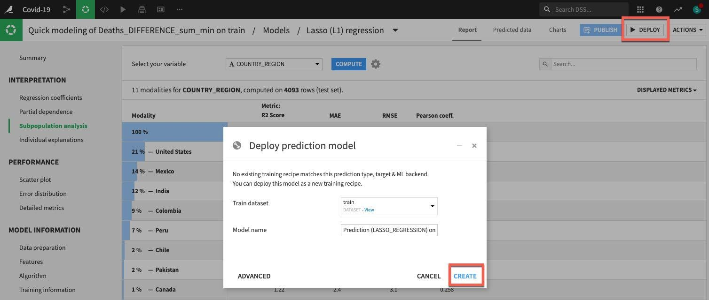

이제 모델이 흐름에 배포되었습니다.


마지막 작업의 경우 모델이 적합한지를 평가하기 위해 배포된 모델과 테스트 데이터 세트와 비교하여 점수를 매길 것입니다. 흐름에서 **모델**을 **한 번 클릭**한 다음 **Aactions 메뉴**에서 **Score를 선택**합니다.


**test 데이터 세트**를 **Input dataset**로 적용하고 **Create Recipe를 클릭**합니다.


마지막으로 실행 엔진이 **In-Database(SQL)로 설정되었는지 확인하고 Run**을 클릭합니다.

축하드립니다! 모델을 구축했으며 점수를 매겼습니다.

<!-- ------------------------ -->
## Snowflake에서 Dataiku 예측 검토

Duration: 5

이제 예측을 작성했던 Snowflake 테이블을 확인할 것입니다.

Snowsight 탭으로 전환하고 다음을 실행하여 컨텍스트를 설정합니다.

```sql
use role sysadmin;
use warehouse compute_wh;
use database pc_dataiku_db;
```

이제 다음 SQL을 실행하여 Snowflake으로 다시 작성된 Dataiku 모델의 점수가 매겨진 데이터를 확인합니다. 테이블 이름을 다음과 비슷해야 합니다.

```sql
show tables like '%scored%';
select * from "COVID19_TEST_SCORED_space-3a316aed-dku_node-df3ee930";
```

‘show tables’ 명령에서 반환된 이름을 사용하고 SELECT 문에 이를 붙여 넣습니다.

이제 결과에서 가져온 차트에서 데이터를 볼 수 있습니다.

```sql
Add Column and select ‘Country_region’
```

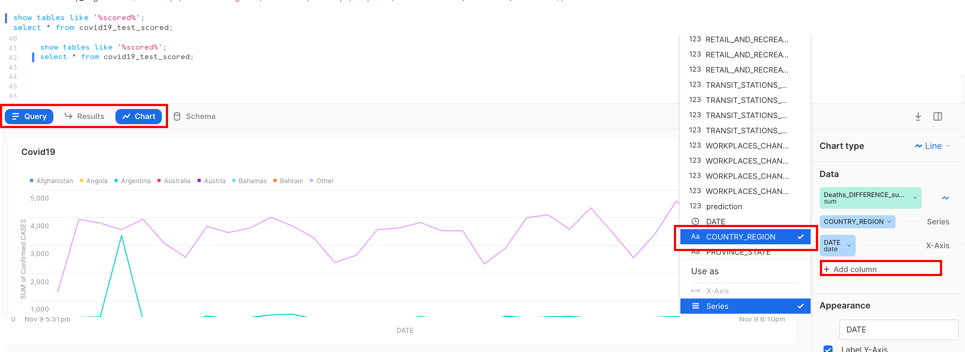

### 복제로 테스트 팀을 위한 환경 생성

Snowflake를 사용하면 "제로 카피 클론"이라고도 하는 테이블, 스키마 및 데이터베이스의 클론을 몇 초 안에 생성할 수 있습니다. 클론을 생성할 때 원본 객체에 있는 데이터의 스냅샷을 찍으며 복제된 객체에서 이를 사용할 수 있습니다. 복제된 객체는 쓰기 가능하고 클론 원본과는 독립적입니다. 즉 원본 오브젝트 또는 클론 오브젝트 중 하나에 적용된 변경 사항은 다른 오브젝트에 속하지 않습니다.

제로 카피 클론 생성의 일반적인 사용 사례는 개발 및 테스트를 위한 프로덕션 환경을 복제하여 프로덕션 환경에 부정적인 영향을 미치지 않게 두 개의 별도 프로덕션 환경을 설정 및 관리할 필요가 없도록 테스트하고 실험하는 것입니다.

Positive : **제로 카피 클론 생성은 최고입니다!** <br> 큰 이점은 기본 데이터가 복사되지 않는다는 것입니다. 기본 데이터의 메타데이터/포인터만 변경됩니다. 이런 이유로 ‘제로 카피’이며 데이터 복제 시 저장소 요구 사항이 두 배로 늘어나지 않습니다. 대부분의 데이터 웨어하우스에서는 이렇게 할 수 없지만, Snowflake에서는 쉽게 할 수 있습니다!

기존 UI로 되돌아가고 Covid19 워크시트를 선택하겠습니다.


워크시트에서 다음 명령을 실행하여 개발(dev) 데이터베이스를 생성합니다.

```sql
use role sysadmin;
use warehouse compute_wh;
    use database pc_dataiku_db;
    use schema public;
    create database dataiku_test_db clone pc_dataiku_db;
```

닫힌 경우, 워크시트 왼쪽의 데이터베이스 객체 브라우저를 확장합니다.  왼쪽 패널에서 작은 새로 고침 버튼을 클릭하고 DATAIKU_TEST_DB 데이터베이스 아래의 객체 트리를 확장합니다.

DATAIKU_TEST_DB 데이터베이스 아래에서 새로운 테이블을 볼 수 있는지 확인합니다.  이제 개발 팀은 프로덕션 테이블이나 다른 오브젝트에 영향을 주지 않고 삭제를 포함하여 이러한 테이블로 원하는 모든 작업을 수행할 수 있습니다.

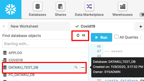

<!-- ------------------------ -->
## 타임 트래블 사용

Duration: 5

Snowflake의 타임 트래블 기능으로 사전 구성 가능한 기간 내 어느 시점이든 과거 데이터에 액세스할 수 있습니다. 기본 기간은 24시간이며 Snowflake Enterprise Edition 으로는 90일까지 가능합니다. 대부분의 데이터 웨어하우스에서는 이 기능을 제공하지 않지만, Snowflake에서는 쉽게 할 수 있습니다!

이러한 기능은 다음과 같이 응용할 수 있습니다.

- 실수로 또는 의도적으로 삭제되었거나 업데이트되었을 수도 있는 데이터 관련 오브젝트(테이블, 스키마 및 데이터베이스) 복구
- 과거의 주요 시점으로부터 데이터를 복제하고 백업
- 지정된 기간에 걸쳐 데이터 사용량/조작 분석

다음 시나리오를 진행할 것입니다. 1: 사용자는 모든 테스트가 완료되었다고 생각하며 임시 테이블을 삭제하기로 결정합니다. 애석하게도 잘못된 테이블을 삭제합니다! 2: 사용자는 테이블을 업데이트하지만 WHERE 절을 잊었습니다. 테이블의 모든 행이 변경되었습니다! 3: 어떤 시점에 테이블의 클론을 생성합니다. 4: 테스트 테이블에 적용되었던 모든 변경 사항을 롤백하여 테스트를 위해 테이블을 새로 고칩니다.

### 테이블 삭제 및 복구

먼저 실수로 또는 의도적으로 삭제한 데이터 객체를 어떻게 복구할 수 있는지 살펴보겠습니다.

적절한 컨텍스트를 설정하겠습니다.

```sql
use database dataiku_test_db;    use schema public;
```

작업할 테이블의 이름을 찾겠습니다.

```sql
show tables like '%scored%';
```

결과에서 이름 열을 확장하고 ‘COVID19_TRAIN_space-3a316aed-dku_node-df3ee930’와 비슷한 테이블 이름을 복사할 수 있습니다

작업을 더 쉽게 만들기 위해 이 테이블의 이름을 바꿀 것입니다. 다음 SQL을 실행합니다.

```sql
Alter table “<table name from above>” rename to di_train;Example : alter table “COVID19_TEST_SCORED_space-3a316aed-dku_node-df3ee930” rename to covid19_test_scored;
```

워크시트에서 covid19_train 테이블을 제거(삭제)할 다음 명령을 실행합니다.

```sql
drop table covid19_test_scored;
```

이제 covid19_train 테이블에서 SELECT 문을 실행합니다. 기본 테이블이 삭제되었기 때문에 ‘**Results**’ 창에 오류가 나타나야 합니다.

```sql
select * from covid19_test_scored limit 10;
```


이제 이 테이블을 다음과 같이 복구합니다.

```sql
undrop table covid19_test_scored;
```

covid19_test_scored 테이블을 복구해야 합니다.

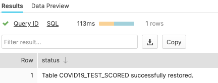

이제 covid19_train 테이블에서 SELECT 문을 실행합니다. 기본 테이블이 복원되었기 때문에 ‘**Results**’ 창에 데이터가 나타나야 합니다.

    select * from covid19_test_scored limit 10;

### 테이블 롤백

테이블을 이전 상태로 롤백하여 covid19_test_scored 테이블에 있는 모든 province_state 이름을 ‘oops’라는 단어로 대체하는 의도하지 않은 DML 오류를 수정하겠습니다.

상위 20개의 Locations를 반환하는 쿼리를 실행합니다. 업데이트하기 전에는 다음과 같이 나타나야 합니다.

```sql
select province_state as "Location", count(*) as "count"from covid19_test_scoredgroup by 1order by 2 desclimit 20;
```

테이블의 모든 지방 이름을 ‘oops’라는 단어로 대체하는 다음 명령을 실행합니다.

```sql
update covid19_test_scored set province_state = 'oops';
```

이제 상위 20개의 Locations를 반환하는 쿼리를 실행합니다. 스테이션 이름을 망쳤기에 하나의 행만 반환되었습니다.

```sql
select province_state as "Location", count(*) as "count"from covid19_test_scoredgroup by 1order by 2 desclimit 20;
```


보통의 상황이라면 놀라는것도 잠시뿐 빨리 백업이 주변에 있기를 바랄 것입니다. 그러나 Snowflake에서는 데이터베이스를 대상으로 실행된 트랜잭션을 찾기 위해 단순히 기록을 검토할 수 있습니다. 메인 UI 창에서 역할을 SYSADMIN으로 변경하겠습니다.


History 탭을 클릭합니다.

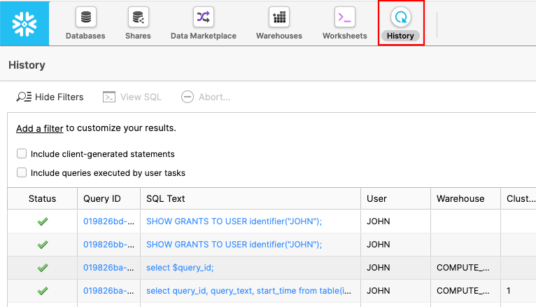

이 단계에서는 Snowflake를 대상으로 실행했던 모든 명령을 볼 수 있습니다. 이슈를 초래한 명령을 찾아보겠습니다. 필터가 보인다면 7.2.7로 이동합니다.

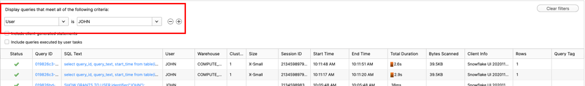

필터가 안 보인다면 'Add a filter'를 클릭합니다


필터는 다음과 같이 ‘SQL Text’ 및 ‘oops’로 변경합니다.

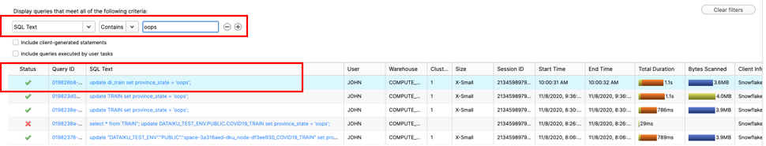

잘못된 업데이트 문을 실행한 SQL을 위해 Query ID를 클릭합니다. Query ID를 강조 표시하고 클립보드에 복사합니다.


어떠한 부분을 변경하기 전에 이 트랜잭션이 이슈를 초래했는지 확인할 수 있습니다. 이전에 복사한 Query ID를 대체하는 다음 SQL을 실행합니다.

```sql
select province_state as "Location", count(*) as "count" from covid19_test_scored before(statement => '01982883-0042-3ced-0000-01f1000463fe') group by 1 order by 2 desc limit 20;
```

이제 올바른 SQL임을 확인했으니 안전할 수 있도록 다음 SQL을 사용하여 기존 값으로 우선 클론을 생성합니다. 다시 한 번 이전에 복사한 Query ID를 사용합니다.

```sql
create or replace table covid19_test_scored_rewind clone covid19_test_scored before(statement => '01982883-0042-3ced-0000-01f1000463fe');
```

SELECT 문을 다시 실행하여 province_state 이름이 새롭게 복제된 테이블에서 복구되었는지 확인합니다.

```sql
select province_state  as "Location", count(*) as "Count"from covid19_test_scored_rewindgroup by 1order by 2 desclimit 20;
```

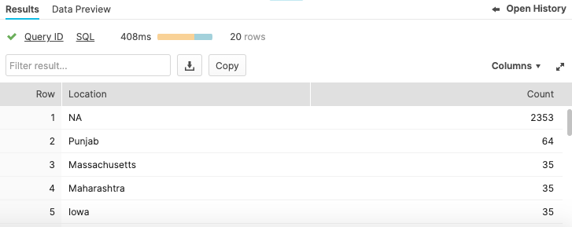

이제 클론이 올바른 값을 가지고 있음을 확인했으니 Snowflake에서 또 다른 생성 기능을 사용하고 2개의 테이블을 바꿀 것입니다. 새롭게 생성된 클론의 이름을 메인 테이블의 이름으로 바꿀 것입니다. 또한 망가진 테이블의 이름을 클론 이름으로 바꿀 것입니다.  이름을 바꾸기 위해 다음 SQL를 사용합니다.

```sql
alter table covid19_test_scored_rewind swap with covid19_test_scored;
```

SELECT 문을 다시 실행하여 province_state 이름이 새롭게 바뀐 테이블에서 복구되었는지 확인합니다.

```sql
select province_state  as "Location", count(*) as "Count"from covid19_test_scoredgroup by 1order by 2 desclimit 20;
```


축하합니다. 이제 이 랩을 완료하셨습니다! 다음 마지막 섹션에서 정리하겠습니다.

<!-- ------------------------ -->
## (선택 사항) Snowflake 환경 초기화

마지막으로 이 랩의 일부로 생성된 모든 오브젝트를 삭제하여 환경을 초기화하려면 워크시트에서 다음 SQL을 실행하십시오.

워크시트 컨텍스트를 설정하기 위해 이 SQL을 실행하십시오.

```sql
use role accountadmin;
use warehouse compute_wh;
use database covid19;
use schema public;
```

그런 다음 이 SQL을 실행하여 이 랩에서 생성했던 모든 오브젝트를 삭제하고 웨어하우스 크기를 XSmall로 조정합니다.

```sql
drop database if exists dataiku_test_db;
alter warehouse “PC_DATAIKU_WH” set warehouse_size = ‘XSMALL’;
```

## 종료 및 다음 단계

Duration: 1

이 자습서는 Snowflake와 Dataiku를 사용하는 방법을 알려주는 동시에 일부 주요 기능을 선보이기 위한 실습형 소개로 설계되었습니다.

자체 샘플 또는 제품 데이터를 로드하고 이 랩에서 다루지 않은 Snowflake의 고급 기능 중 일부를 사용하여 무료 평가판을 계속 사용해 보시길 권해 드립니다. Snowflake는 다음을 통해 여러 방법으로 도움을 줄 수 있습니다.

- Snowflake에 대한 더 많은 데이터를 얻고 분석하는 데 도움을 받기 위해 평가판/무료 ETL 및 BI 도구에 대한 액세스를 얻으려면 UI 맨 위에 있는 ‘Partner Connect’ 아이콘을 클릭하십시오
- "[무료 평가판 극대화를 위한 가이드](https://www.snowflake.com/test-driving-snowflake-the-definitive-guide-to-maximizing-your-free-trial/?utm_source=Snowflake&utm_medium=lab guide&utm_campaign=dataiku-vhol-download-maximizing-your-free-trial-guide)"를 읽으십시오
- Snowflake 가상 또는 현장 [이벤트](https://www.snowflake.com/about/webinars/)에 참석하여 Snowflake의 기능 및 고객에 관해 자세히 알아보십시오.
- 자세한 내용은 [영업](https://www.snowflake.com/free-trial-contact-sales/?utm_source=Snowflake&utm_medium=lab guide&utm_campaign=dataiku-vhol-contact-sales-from-lab-guide) 팀에 문의하십시오