summary: Begin modeling your Snowflake database online with SqlDBM 
id: database_modeling_with_sqldbm
categories: Getting-Started
environments: web
status: Published 
feedback link: https://github.com/Snowflake-Labs/sfguides/issues
tags: Getting Started, Data Modeling, Data Engineering, CICD 
authors: Serge Gershkovich

# Cloud-native Database Modeling with SqlDBM 
<!-- ------------------------ -->
## Overview 
Duration: 2

Relational database modeling enables instant visual review of a database landscape and the relationships between its entities - like a map for your data. 

[SqlDBM](https://www.SqlDBM.com) is an online database modeling tool that works with leading cloud platforms such as Snowflake and requires absolutely no coding to get started. In this Quickstart, you will see how you can model your entire Snowflake database in just a few clicks and begin taking advantage of all the time-saving features that SqlDBM delivers. 

### What you’ll learn 
* How to quickly diagram an existing schema through reverse engineering
* Create and manipulate database objects using time-saving features like copying and cloning
* The relevance of primary and foreign key relationships and how to declare them 
* Inheritance for parent/child objects 
* Track change history using Revisions
* Forward engineering & deployment of changes to Snowflake

### What You’ll Use During the Lab

* An existing or trial [Snowflake account](https://trial.snowflake.com/) with `ACCOUNTADMIN` access

* An existing or trial [SqlDBM account](https://sqldbm.com/Home/)  

### What You’ll Build
* A relational model of an entire database schema
* New tables with no coding involved
* Relate the tables through primary and foreign key constraints
* A data catalog with column-level descriptions

A sample schema diagram like the one we will create: 
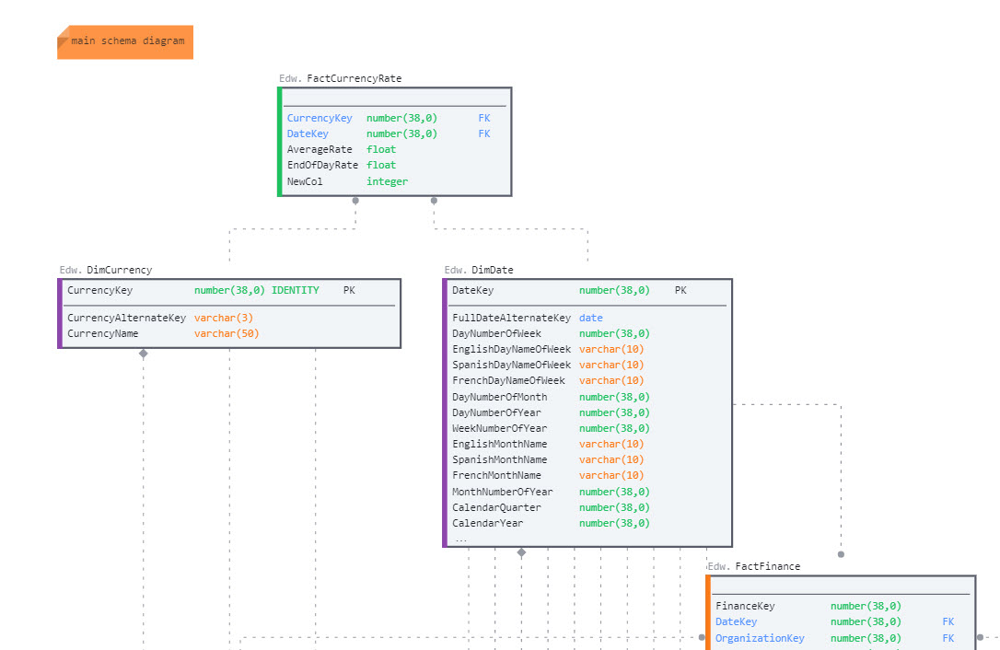

<!-- ------------------------ -->
## Use Case Overview 
Duration: 3

### What is Database Modeling?
An entity-relationship (ER) diagram is the traditional way of visualizing the tables and their relationships in a relational database. Having a diagram makes it easier to find relevant tables and gives the user an instantaneous idea of how tables can be joined for analytics purposes. 

SqlDBM takes the ER diagram’s visual, no-code approach and allows user to manipulate their database directly using the graphical perspective. Instead of writing DDL by hand, SqlDBM users can drag, drop, copy, and clone objects using an intuitive, browser-based graphical interface. Then, we take it a step further!

With SqlDBM, changes made on a diagram can be forward-engineered into neat, Snowflake-specific DDL and deployed back to the database. What’s more, the tool leverages this intuitive, code-free approach to enable collaboration, documentation, and version control. 

We’ll go through all these features in detail as part of this Quickstart, so let’s start by setting up our account. 

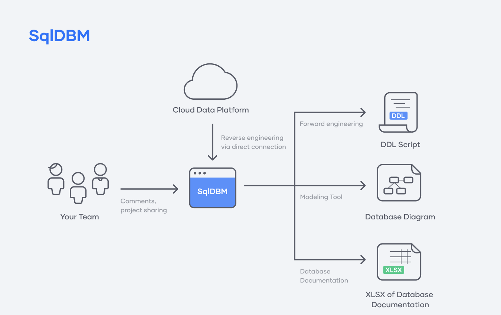   

<!-- ------------------------ -->
## Snowflake Configuration 
Duration: 3


* Log in to your Snowflake using an existing or trial account.  
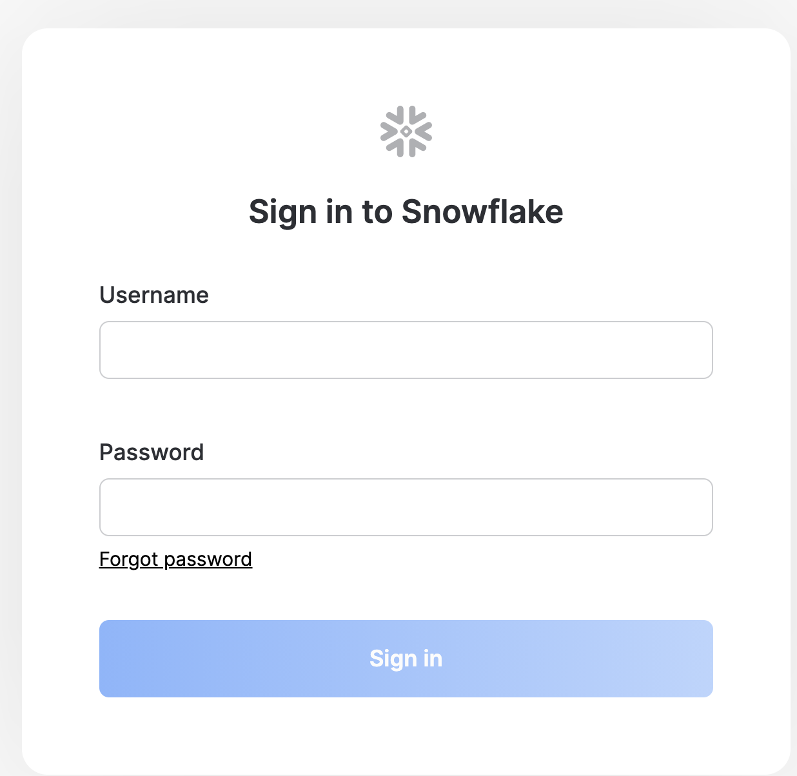  

* Familiarize yourself with the UI if logging in for the first time in the [Snowflake UI Tour](https://docs.snowflake.com/en/user-guide/snowflake-manager.html#quick-tour-of-the-web-interface).  
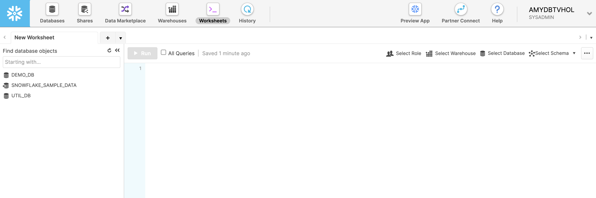  

* Ensure you are using the ACCOUNTADMIN role or that your role has the following grants assigned to follow the Quickstart. If not, we will provide sample DDL where needed. 

Privilege | Required for | Alternative
---------|----------|---------

 USAGE on DATABASE & SCHEMA| Access metadata for existing database and schema objects and bring them into a SqlDBM project | Use sample DDL provided
 REFERENCES on TABLE/VIEW | Reference the DDL for underlying tables and views | Use sample DDL provided
 USAGE on File Format, Sequence, Stored Procedure, User-Defined Function | Access the DDL for these objects | Not required for this tutorial

 ALL on schema | Deploying changes back into Snowflake | N/A

_If you wish to use an existing schema, skip this step._

* create a database in Snowflake for deploying the SqlDBM sample project at the end of this quickstart. 

`create database ADVENTUREWORKSDW`

<!-- ------------------------ -->
## Create a New SqlDBM Project 
Duration: 5

After logging in to [SqlDBM](https://www.SqlDBM.com), you will be taken to the Projects Dashboard. Otherwise, select “Dashboard” from the top-right dropdown.

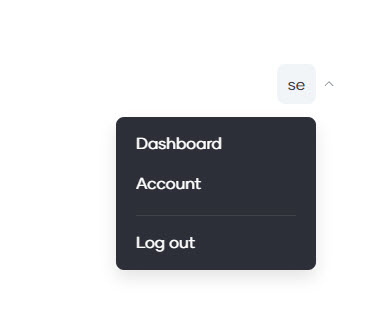  


### Option 1) Bring your existing Schema
Follow the steps to create a Snowflake project and bring your schema: 

* Click the “New Project” button at the top to get started.

* Select “Snowflake” as the database type and click “Bring your database.”

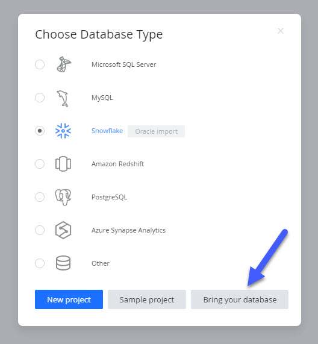

* Click the “Connect to DW” to create a live connection to Snowflake.

* Alternatively, run the GET_DDL command by hand and copy and paste the output onto the text area on the screen or save it in a file and upload via the “Drop your File” button. 

```sql
SELECT GET_DDL('schema','"DATABASE_NAME"."SCHEMA_NAME"', true);
```

* Enter your Snowflake server instance and log in with a user and role with `USAGE` privileges on the schema you wish to import.

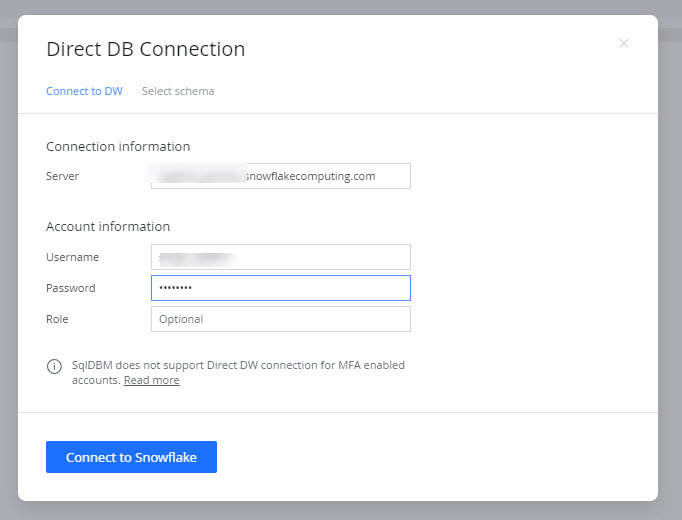

* Select the Database and Schema you wish to import and press the “Apply” button below. 


### Option 2) Use the example schema 

Download our [example DDL](https://github.com/Snowflake-Labs/sfquickstarts/blob/master/site/sfguides/src/database_modeling_with_sqldbm/assets/sample_schema.sql) 


* you can paste the contents directly into the text area on the screen.

* or upload the file by pressing the "Drop your file" button

### Parse the script to create a project

* Press the up arrow icon / “Upload SQL Script” button at the top to parse the DDL provided.

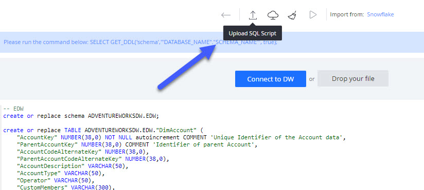

7. Review the objects that are being imported on the left panel. Optionally, you can exclude individual items from being imported by de-selecting the check-box next to them. 

8. Press the “Import” button to create a project with the selected objects. 

    * Parsing and importing DDL into a project is called **Reverse Engineering** in SqlDBM and is not limited to new projects. This can be done at any point to retrieve changes to the database made outside of SqlDBM from the Reverse Engineering screen. 
    * Note, this will not re-initiate the entire project. Users will be able to choose which objects are added, updated, or deleted from a project depending on whether or not they currently exist. 

    
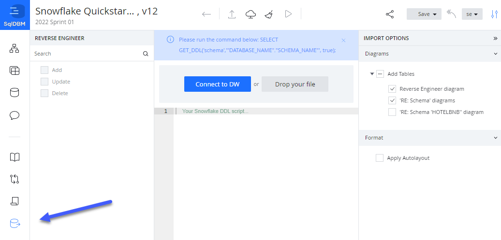

<!-- ------------------------ -->
## Configure project defaults
Duration: 5

Let’s configure some initial time-saving defaults for our project and set the visual level of detail and look-and-feel for our diagrams.

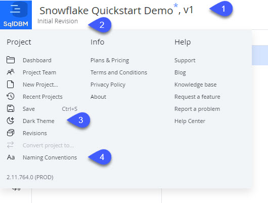

1. Save the first revision and name your project

    * Click the save button at the top right and name your project with something descriptive. [1]

2. Rename revision title

    * Let’s rename “Initial Revision” to something that fits with your way of working. Name your revisions based on the Agile Sprint, current project phase, or even calendar month. Something to allow for a meaningful grouping of changes. 

    * Click on the text “Initial Revision” to modify it. [2]

3. Enable dark theme

    * Click on the blue SqlDBM logo at the top left to bring up the project menu. Click “Dark Theme” to enable it, if that’s your thing. [3]

4. Set naming conventions for the project

    * Click on the blue SqlDBM logo at the top left to bring up the project menu and select “Naming Conventions.” [4]

    * Any changes made here can be “[applied] to all existing objects” and validated going forward by ticking the “Validate on project save” using the buttons at the bottom of the menu.

    * Case standards - set the standard naming style for the entire project (e.g., UPPER_CASE, Title_Case, PascalCase, etc.). 

    * Name mapping - here, we can set the default names for the objects in our project. Tick the check-box next to any object to override the default naming. Click the pencil icon to enter the expression editor. Here you can edit both the static part of the default naming and use the context variables available to make the name dynamic.

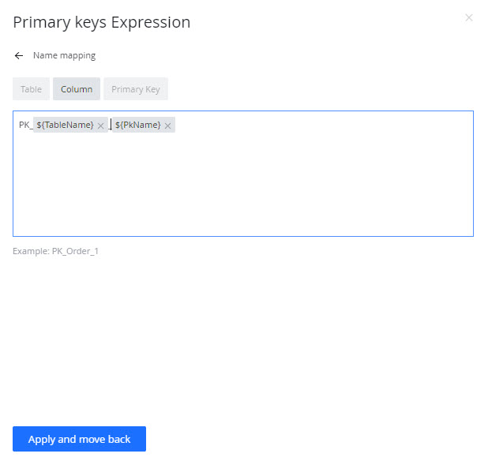

## Diagram look and feel 
Duration: 3

Get familiar with the look-and-feel configuration for diagrams and learn to view them at varying levels of detail. 

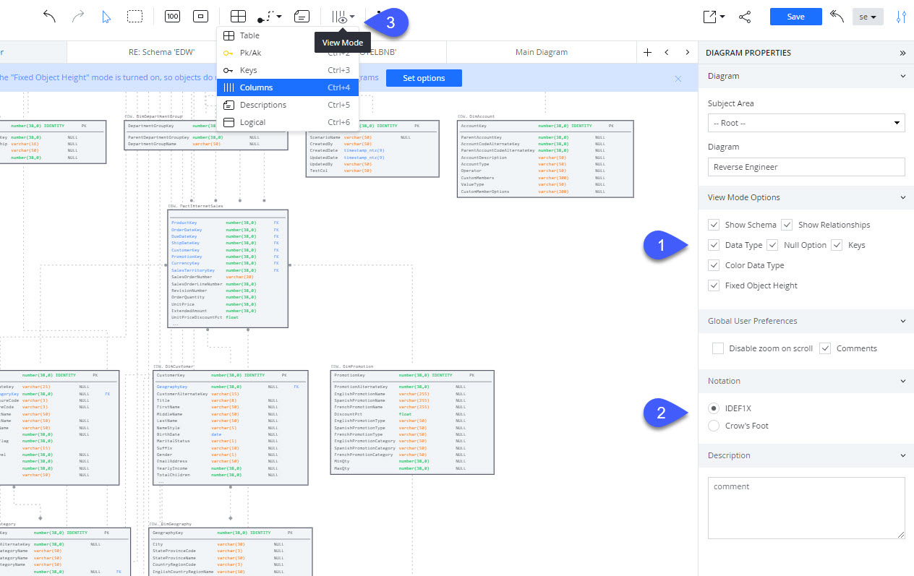

1. Set diagram properties

    * In the Diagram Explorer screen, open a diagram and expand the various options on the right-screen properties menu. 

    * In the view mode options, configure the preferred look and feel of the diagram. Here you can select which object properties will be displayed and color-coded on the diagrams. 

2. Set relational notation

    * Toggle between IDEF1X and Crow’s Foot relationship notations in the “Notation” options. Note that relationship properties such as Identifying/Non-identifying (IDEF1X) and cardinality (Crow’s Foot) will change accordingly. These properties are orientative and do not impact the generated DDL.

3. Change view modes (level of detail)

    * Once defined, database objects in SqlDBM diagrams can be viewed at varying levels of detail. This allows a single diagram to serve various business functions: from general planning to column-level auditing. 

    * You can get a feel for the different view modes by clicking on the “View Mode” selector on the top of the screen

View Mode | Description
---------|----------
 Table | Simplified view showing tables as boxes, providing a bird’s-eye view.
 PK/AK | Shows only the primary and alternate key columns.
 Keys | Shows the primary, alternate, and foreign key columns. 
 Columns | Default view. All columns and properties are displayed.
 Descriptions | Simplified view showing tables as boxes with descriptions.
 Logical | Detailed, like the “Columns” view, but hides physical names and database-specific properties.


## Editing objects
Duration: 6 

Let’s organize our project by creating some subject areas. These serve as folders for keeping your diagrams organized. Then we’ll learn to create and edit its properties, as well as add/copy fields. 

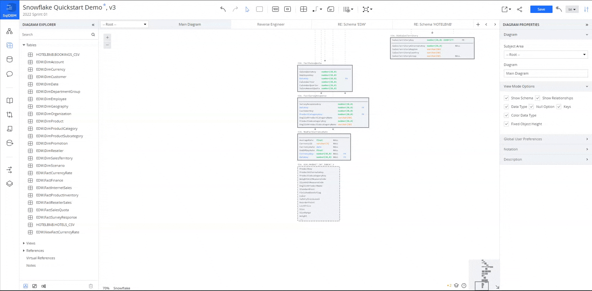

### Create a Subject Area
Subject areas serve as folders for keeping diagrams organized by categories such as department or project. Right-click on “Subject Areas” in the Diagrams screen and select “Add a Subject Area.” 

### Add a table to a diagram
Click on the “Diagram Explorer” button on the left-hand menu. Add a table to a diagram from the object catalog by searching for a part of its name, then click the “Add to Diagram” button next to it. 

Type "product" into the search box to filter the list of tables and bring "DimProduct" onto the diagram.

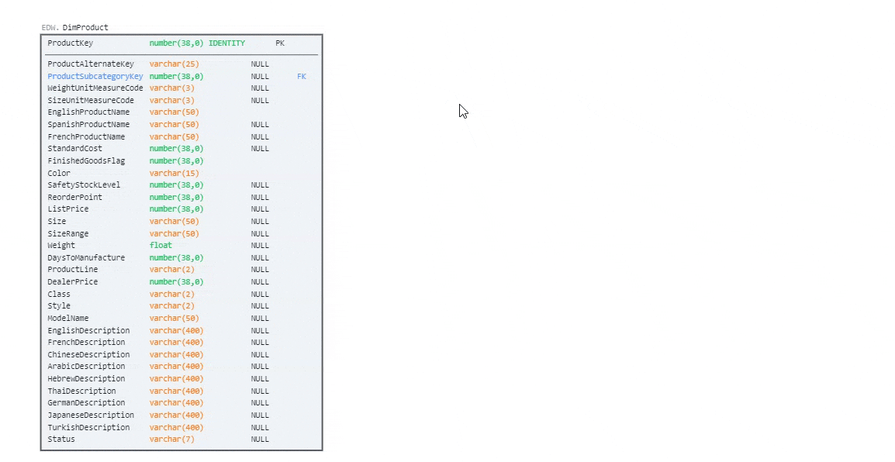

### Create a new table
Right-click anywhere on the canvas and select “Add Table.” Double-click on the new table to edit it. Give the table a name and add some columns with corresponding data types. 

Table name: DimProductPrototype

### Copy columns from an existing table
Select a column (or shift-click to select multiple) from an existing table and drag them to another table to move them. Perform the drag operation holding the Ctrl key (Command on Mac) to copy. 

Highlight and drag several columns from DimProduct to DimProductPrototype

### Add a primary key (PK) to a table
Double click on a table to enter edit mode. Create a new column at the topmost section to designate it as a primary key (replacing “\<pk column name\>”). 

Alternatively, drag any existing column to the top of the table to designate it as a PK.

create a PK column for DimProductPrototype called ProductPrototypeKey of type Integer.

### Add a foreign key (FK) to a table
Click on a table that has a PK defined. Drag the bottom-right connector to another table to add it as an FK.

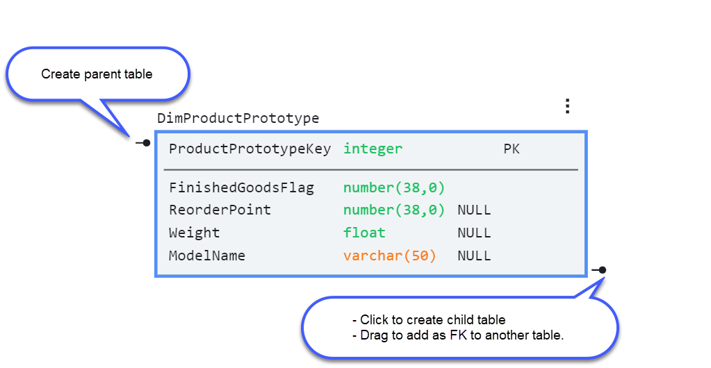

### Create a child or parent table
Select a table in the diagram. Use the top-left or bottom-right connectors to create a parent or child table, respectively. 

Parent tables PKs will cascade to the child tables.

### Create a template
Templates save time by allowing you to define and reuse columns at your convenience. 

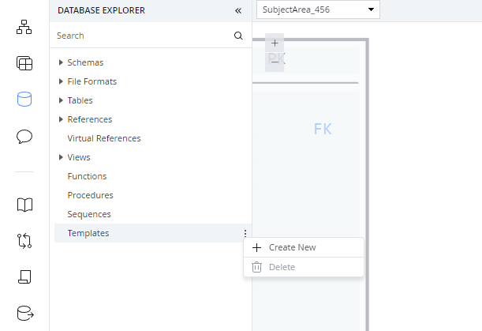

Find “Templates” in the “Database Explorer” screen (third option from the top in the left-hand menu) and click to “Create New.”

Click on the newly created template to select it and set the Template Properties on the right-hand menu.

* Template name: give the template a descriptive name, like “MetadataColumns,” for example.
* Apply to new tables: tick this option if you want this template to apply automatically to all newly created tables.
* Columns: add the columns that you would like to be part of the template. Let’s add EtlId as date and EtlName as varchar in this example. Be sure to provide a description.
* Description: provide a general description for the template
* Related tables: metadata showing which tables are currently associated with the existing template 

### Assign a template to a table 
Let’s assign the metadata columns from the template we just created to a table. Select a table to bring up its properties in the right-hand menu. Expand the “Options” menu and scroll down to the “Templates” text area. 

Begin typing the template name and select it from the auto-suggestion. Hit “Add” to associate it with the table. 

Keep in mind that while the association exists, changes to the template will be reflected in the associated tables. To break the association, click the “X” next to the template name in the table options; you will be given a choice to keep or delete the template columns in the process. 

## Working with primary and foreign keys
Duration: 2

Although we covered the technical aspect of creating and assigning PK and FK constraints, their importance in a relational database deserves its own section. But first, a refresher: 

* A primary key constraint uniquely identifies each record in a table.
* Primary keys must contain UNIQUE values and can not contain NULL values.
* A foreign key is a field (or collection of fields) in one table that refers to the PRIMARY KEY in another table.
* The table with the foreign key is called the child table, and the table with the primary key is called the referenced or parent table.

Although Snowflake does not enforce PK and FK constraints (only NOT NULL) - meaning, Snowflake will not throw an error when duplicate records are inserted, thereby violating a PK - maintaining these as part of a schema helps users understand the tables and their relationships.

Being able to quickly and visually identify PK/FK constraints helps make sense of the data and facilitates joins and logical operations where uniqueness needs to be taken into account. SqlDBM uses PK/FK constraints to link and draws table relationships on a diagram, as do many BI tools when suggesting joins. 

Observe the below tables, which have no constraints defined. Without probing the data, there is no way to determine the uniqueness of individual records or if common columns (i.e., Hotel_ID) hold the same data or use different formats.

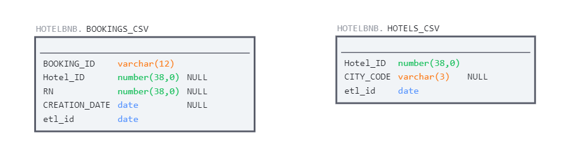

Now observe the same tables with corresponding PK/FK constraints declared. Instantly we know that a BOOKING_ID holds unique information about a booking in the bookings table and that the same is true of Hotel_ID in the hotels table. 

We also know that we can join hotels to bookings using the Hotel_ID.

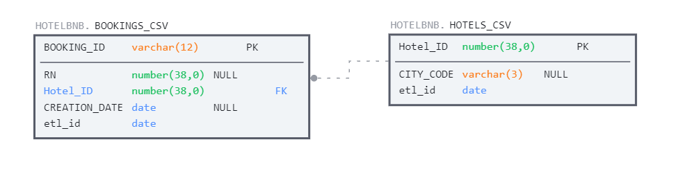

## Set Snowflake table properties
Duration: 4
SqlDBM’s no-code interface is intended to minimize syntax errors associated with manually keying DDL. By using a GUI to manipulate database objects, SqlDBM generates neat, error-free, database-specific DDL behind the scenes. 

### Column-level properties 
Select a table from your diagram and highlight the column to bring up its properties in the right-hand menu. 

* The available properties vary depending on the column data type. Set general properties like “Default Value” or data-type-specific settings like sequences accordingly.

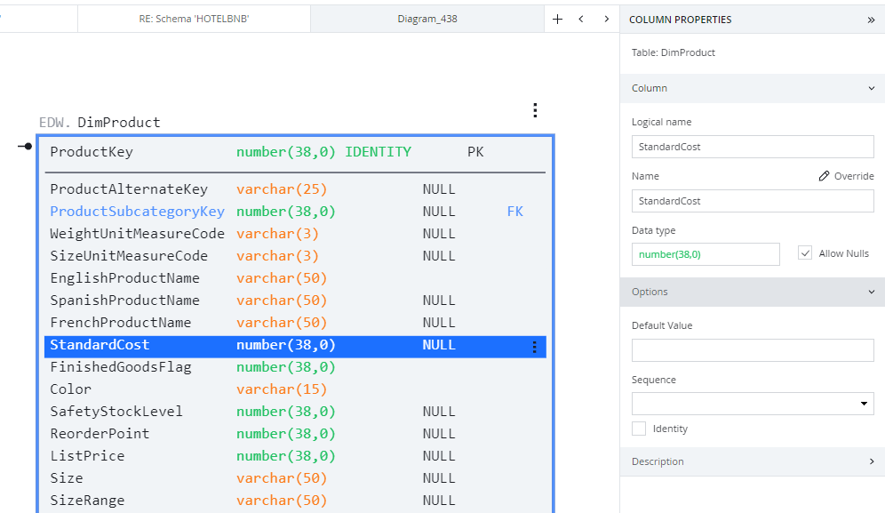

### Table-level properties
Select a table on the diagram (or from the list on Database/Diagram Explorer) to bring up its properties in the right-hand menu. 

Review and set the following options as needed: 

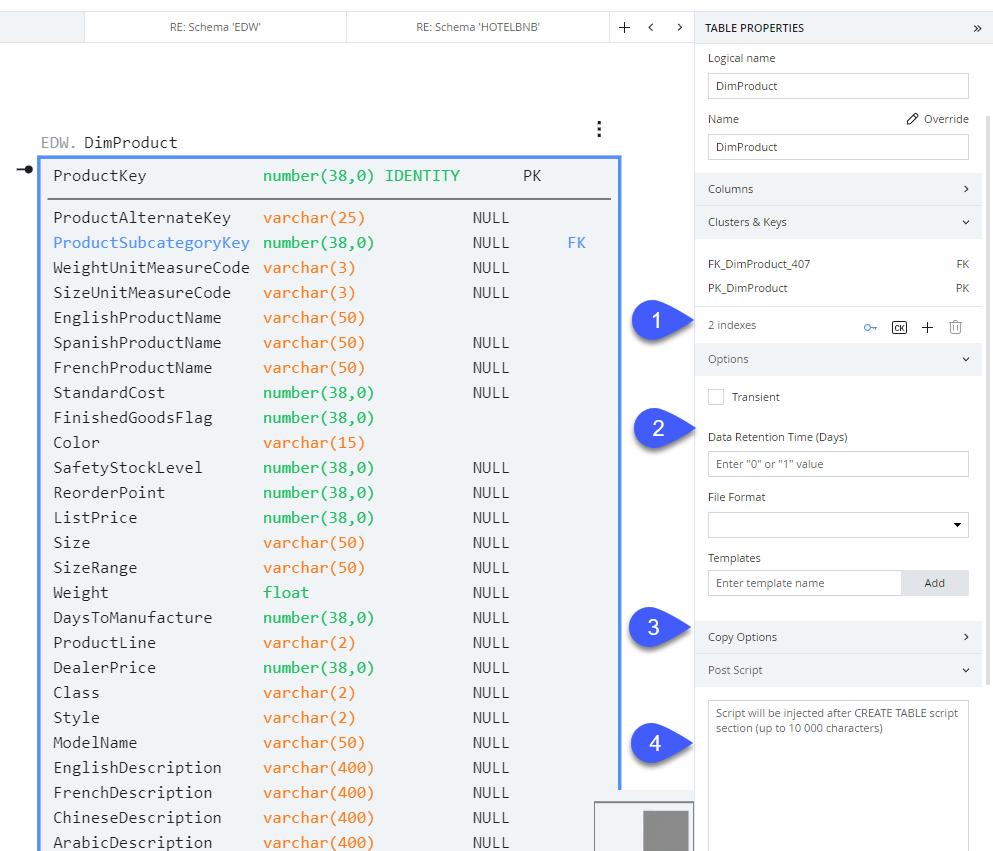

1. Clusters and Keys - use the available options in this menu to view, modify, and create primary, alternate, and clustering keys. 

1. Options - Specify transient and data retention properties as well as setting file format
    * Transient: mark this flag to designate a table as transient (no Fail-safe)
    * Data Retention Time (Days): specify 0 or 1 day for Snowflake time travel function
    * File Format: select a file format for use with loading and unloading data

1. Copy Options - specify the copy options for loading and unloading operations such as on-error and purge

1. Post Script - Specify manual post-script commands to be injected into the create statement (such as grants).


## Add functional information and comments
Duration: 5 

Add some functional details to your project to give it some context and make it easier for team members to navigate. 

### Notes on diagram
Add descriptive notes anywhere on the diagram using the “Add Note” (Ctrl+Insert) feature. 

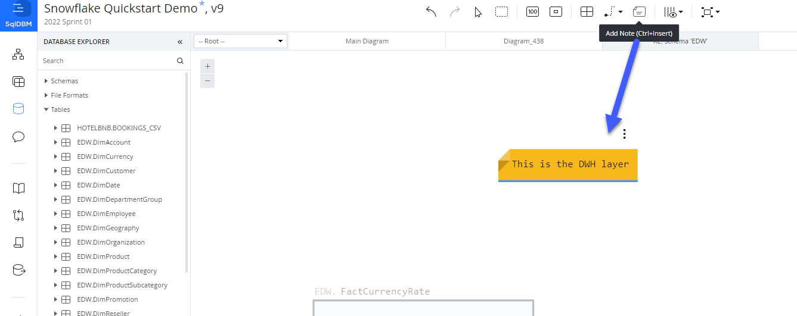

### Data dictionary
SqlDBM’s **Data Dictionary** allows users to review and edit object-level comments in one centralized and searchable screen. The descriptions provided here are intended to help the team go beyond object definitions and provide meaningful details about the data contained in the tables. 

The descriptions provided here will become part of the object DDL. They can be deployed back to the database (see Forward Engineering topic ahead) - they are not meant to serve merely as project metadata.

1. Access the Data Dictionary screen by selecting the book icon on the left-hand menu. 

2. Use the search box to perform a wildcard lookup for objects, columns, and descriptions matching a given term. 

3. Enter object-level or column-level descriptions in the description fields. By design, other DDL details such as object names, datatypes, and properties can not be changed on this screen. This allows users from any level of technical experience to contribute to a project without the possibility of changing any structural details.

4. Template descriptions - located at the bottom of the screen - can also be maintained here. Note that the description is displayed in related tables but can only be edited in the template itself.

5. The Import/Export to Excel buttons are located at the top-right of the screen. This allows users to contribute to a project by maintaining descriptions in a familiar Excel format without modifying the object structure. 

    * Click the “Export to Excel” button to generate and download the data dictionary in Excel format. 
    * The Excel follows a similar format as the Data Dictionary screen: only the descriptions are editable (highlighted in orange). Modifying any other field (not highlighted in orange) will not affect the project but will fail to update the related description.
    * Once you have added some descriptions to the file, save it, and press the “Upload” button to incorporate the changes into the project. 
    * Search for all or part of a description entered in the previous step to navigate directly to it. 
    * Save the project to complete the process

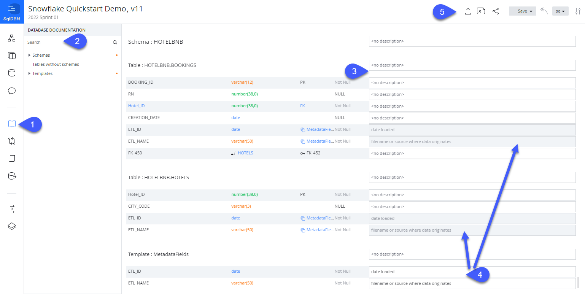

## Change tracking
Duration: 3

Every save in SqlDBM generates a versioned _revision_, which allows for change tracking and version control. SqlDBM projects store an infinite revision history, and any two revisions can be compared to track changes. The latest revision is indicated next to the project name at the top of the screen (v12 in the example below). 

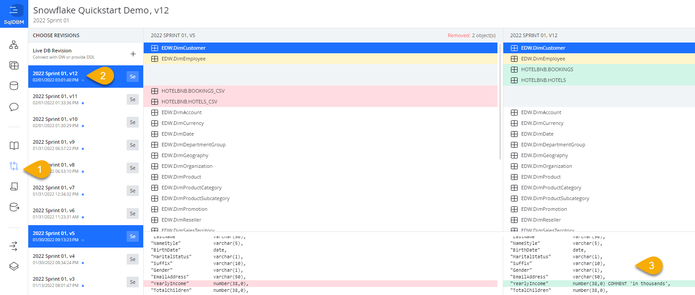

### Review the latest changes
The following section will cover deployment. To review the changes made as part of this exercise, we will use the **Compare Revisions** feature of SqlDBM. 

1. Click on the “Compare Revisions” icon on the left-hand menu.

2. The latest two revisions are selected by default. Select any two revisions to see the cumulative changes between them. Changes are highlighted based on the following color scheme:

Color | Description
---------|----------
 Green | New object / addition
 Yellow | Modification 
 Red | Deletion

3. Click on any object on the top half of the screen to see the details of the change.

## Deployment
Duration: 5

The time has come to deploy all of the changes made during this exercise to a Snowflake environment. 


In SqlDBM, DDL is generated through a function known as **Forward Engineering**. There are two options: create SQL and alter SQL. The first (create) generates a create statement for selected objects as of the latest revision. The second (alter) creates an alter script from a previous revision. 

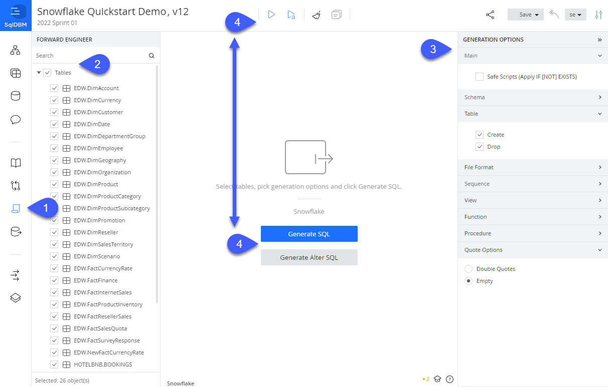

1. Access the Forward Engineering screen by clicking on the scroll icon on the left-hand menu.

### Review Errors and Warnings
While SqlDBM allows users to model and brainstorm at any level of detail (or lack thereof) with no impediment, it also offers non-intrusive “Errors and Warnings” alerts. While these notifications are available on the diagram and in Database Documentation, they are most relevant on the Forward Engineering screen. 

* Click on the colored dot next to a table name to review any possible problems which may cause deployment errors (e.g., columns without a datatype or duplicate tables or column names).

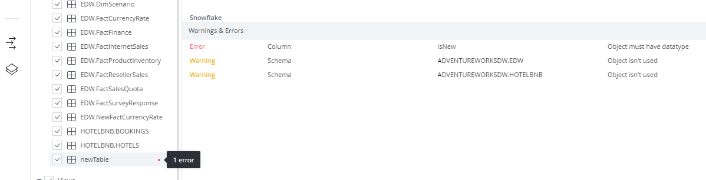

### Generate CREATE script
This option will generate a “create” script for deploying new objects (or overwriting existing ones depending on the generation options).

2. Mark the check-box for the objects that you wish to create or use the search to find the desired ones. Ensure that the "Create" option is selected for "Schema" if this is your first time deploying the project. 

3. Set the _Generation Options_ in the right-hand panel according to what you wish to deploy. Here you can mark options such as create, drop (or both, which results in `CREATE OR REPLACE`) for individual object types and set general properties like Safe Scripts or quote options (i.e., double or empty). 

4. Hit the _Generate SQL_ button in the middle of the screen or the _triangle_ icon up top to generate the script. 

### Generate ALTER script
An Alter script will generate only the changes between the latest revision and a previous one. Create, drop, or alter statements will be generated automatically, based on which changes occurred between the selected revisions. As such, only the Safe Scripts and quoting options are applicable. 

* Press the Generate Alter SQL button or the triangle+A icon as described in step [4]. 

* Select the revision you wish to alter from. Typically, you would choose to alter from the last revision deployed to the database. If this is your first deployment, choose “Revision 1”.

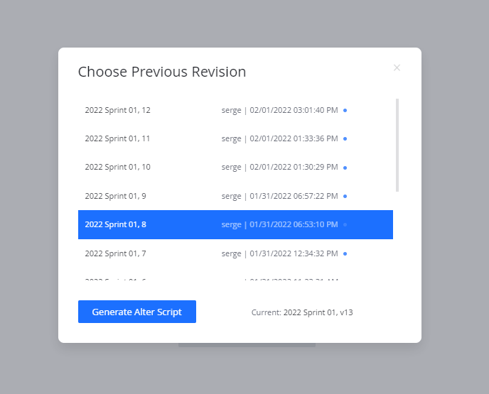

### Deploy changes
Whether you are looking to perform a fresh deployment using a Create Script, or just the latest changes from an Alter Script, the final step is to review the changes before deployment. 

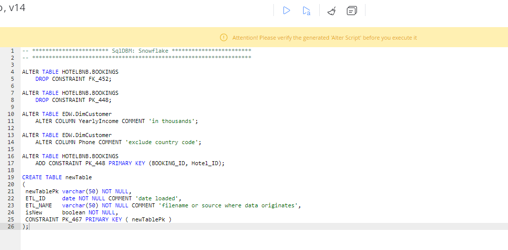

* Make sure to thoroughly review the generated script before deploying it to a database. While SqlDBm guarantees precise and well-formatted code, you should always review the final output to make sure you have selected the right objects and set the _Generation Options_ accordingly. 

* Pay special attention to the objects with _Errors and Warnings_ indicators and correct the issue where possible, as these are the most likely to cause deployment issues. 

* Once you’ve verified your code, take the script back into Snowflake and paste it into a worksheet. 

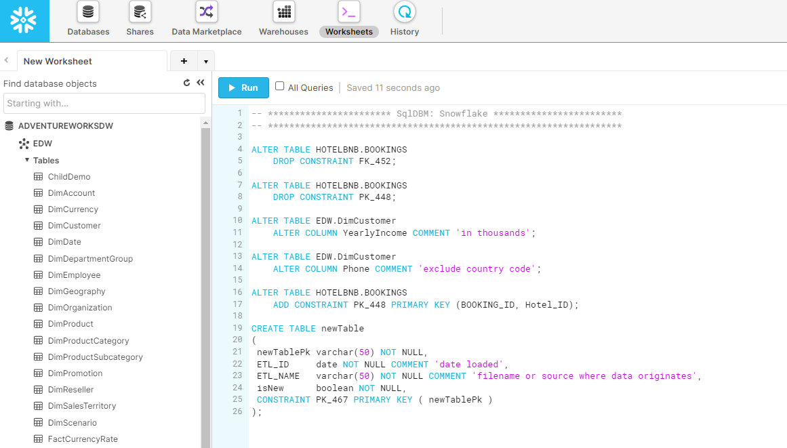

* Make sure to set the active database and schema unless specified as part of the script. 

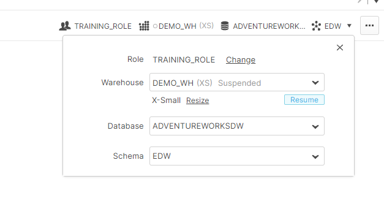

* Run the script, and enjoy a job well done. 

## Conclusion & Next Steps
Duration: 4

Visually guided database modeling can help an enterprise data team make sense of, and accelerate database development. In this Quickstart, we followed a simple development workflow: from creating and instantiating a new Snowflake project and schema, to making changes, all the way to deployment. However, the benefits of a centralized modeling tool extend well beyond the role of a developer. 

Whether it’s a project manager using **Compare Revisions** to track changes, a business user familiarizing themselves with a previously-unknown datamart through a relational diagram, or a new team-member becoming appraised of an organization through **Database Documentation** - doing this in a single tool and a coordinated fashion makes everyone’s job easier and ensures consistency throughout. 

### What we’ve covered
* Creating a project
* Reverse engineering from a Snowflake database
* Configuring project defaults and the look and feel
* GUI-based no-code editing
* Setting Snowflake object properties
* Change tracking
* Deployment

### Additional resources 
* If you have questions about any of the topics described in this Quickstart or additional functionality, please request a guided demo through our website: [SqlDBM](https://www.SqlDBM.com).
* Full documentation of all our features can be found in our [Help Center](https://intercom.help/SqlDBMhelpcenter/en).
* To learn more about database modeling best practices, find out about upcoming features, and stay connected to our growing data community, be sure to follow us on [LinkedIn](https://www.linkedin.com/company/sqldbm).
* Training videos, webinars, and new feature demos on our [Youtube channel](https://www.youtube.com/channel/UCxzY9EOGgPPhHCXj6h3ufsA).

