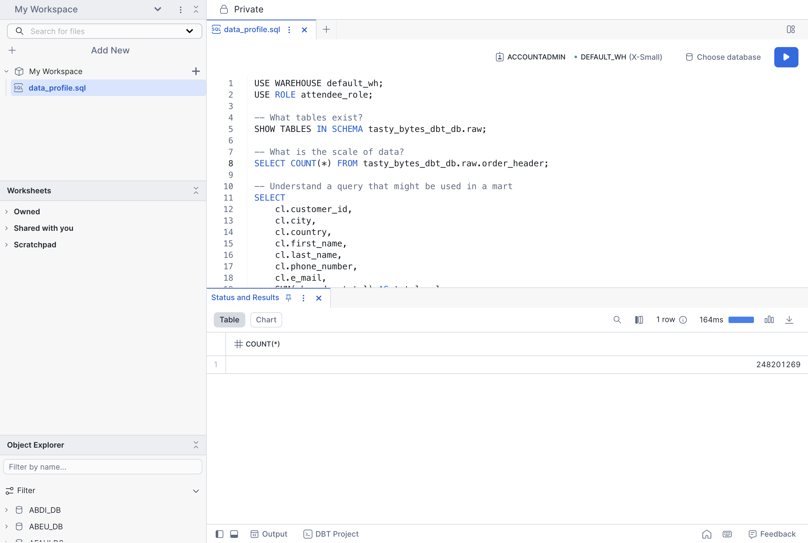
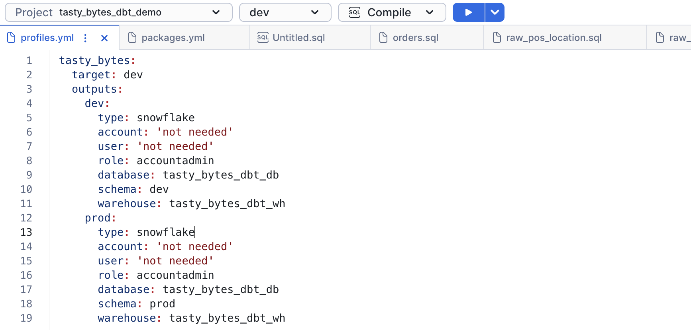
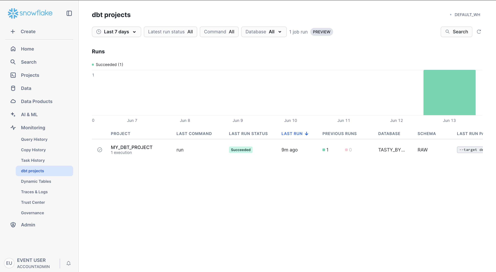

author: Charlie Hammond
id: dbt-projects-on-snowflake
categories: snowflake-site:taxonomy/solution-center/certification/quickstart, snowflake-site:taxonomy/product/data-engineering, snowflake-site:taxonomy/snowflake-feature/external-collaboration
language: en
summary: Structure dbt projects on Snowflake for scalable analytics engineering with modular SQL, testing, documentation, and CI/CD.
environments: web
status: Published 
feedback link: https://github.com/Snowflake-Labs/sfguides/issues
fork repo link: https://github.com/Snowflake-Labs/getting-started-with-dbt-on-snowflake

# Exploring dbt Projects on Snowflake
## Overview 

dbt Core is an open-source data transformation tool and framework that you can use to define, test, and deploy SQL transformations. dbt on Snowflake allows you to use familiar Snowflake features to create, edit, test, run, and manage your dbt Core projects. Snowflake integrates with Git repositories and offers Snowflake CLI commands to support continuous integration and development (CI/CD) workflows for data pipelines.

In this lab, we will go through everything you need to know to get started with [dbt Projects on Snowflake](https://docs.snowflake.com/user-guide/data-engineering/dbt-projects-on-snowflake)!

### Prerequisites
- Familiarity with dbt concepts

### What You’ll Learn 
- How to use Workspaces, Snowflake's file based IDE that integrates with dbt
- How to pull a remote dbt project into Workspaces
- How dbt Projects can be run, edited, and deployed within Snowflake
- How to deploy and orchestrate dbt Projects from within Snowflake.

### What You’ll Need 
- A Snowflake account

### What You’ll Build 
- A dbt Project running within your Snowflake account

## Setup

We will be using Tasty Bytes data in this lab. Run the script [here](https://github.com/Snowflake-Labs/getting-started-with-dbt-on-snowflake/blob/main/tasty_bytes_dbt_demo/setup/tasty_bytes_setup.sql) to build the objects and data required for this lab. 
* Run in <a href="https://app.snowflake.com/_deeplink/worksheets?utm_source=snowflake-devrel&utm_medium=developer-guides&utm_content=dbt-projects-on-snowflake&utm_cta=developer-guides-deeplink" class="_deeplink">Worksheets</a>
* Run as a new SQL file in <a href="https://app.snowflake.com/_deeplink/#/workspaces?utm_source=snowflake-devrel&utm_medium=developer-guides&utm_content=dbt-projects-on-snowflake&utm_cta=developer-guides-deeplink" class="_deeplink">Workspaces</a>

## Introduction to Workspaces

We will start with your personal Workspace. Workspaces provides a developer environment where you can  edit, test, and deploy your dbt projects, all within Snowflake. The personal workspace is your own area where you can create and edit files. 

Navigate to <a href="https://app.snowflake.com/_deeplink/#/workspaces?utm_source=snowflake-devrel&utm_medium=developer-guides&utm_content=dbt-projects-on-snowflake&utm_cta=developer-guides-deeplink" class="_deeplink">Projects > Workspaces</a> to get started.

### Explore the Data
Let's explore the data we will be using in this lab. 

1. Create a new sql file in your Workspace and name it `data_profile.sql`.
2. Copy and paste the code below into the new file
3. Run the following queries just like you would in worksheets. 

``` sql 
USE WAREHOUSE tasty_bytes_dbt_wh;
USE ROLE accountadmin; 

-- What tables exist?
SHOW TABLES IN SCHEMA tasty_bytes_dbt_db.raw;

-- What is the scale of data? 
SELECT COUNT(*) FROM tasty_bytes_dbt_db.raw.order_header;

-- Understand a query that might be used in a mart -- in this case sales grouped by customer
SELECT 
    cl.customer_id,
    cl.city,
    cl.country,
    cl.first_name,
    cl.last_name,
    cl.phone_number,
    cl.e_mail,
    SUM(oh.order_total) AS total_sales,
    ARRAY_AGG(DISTINCT oh.location_id) AS visited_location_ids_array
FROM tasty_bytes_dbt_db.raw.customer_loyalty cl
JOIN tasty_bytes_dbt_db.raw.order_header oh
ON cl.customer_id = oh.customer_id
GROUP BY cl.customer_id, cl.city, cl.country, cl.first_name,
cl.last_name, cl.phone_number, cl.e_mail;
```



### Create dbt Project from GitHub

Let's now clone an example dbt project we will use in the rest of this lab. 

1. Click the <a href="https://app.snowflake.com/_deeplink/#/workspaces?utm_source=snowflake-devrel&utm_medium=developer-guides&utm_content=dbt-projects-on-snowflake&utm_cta=developer-guides-deeplink" class="_deeplink">Workspace</a> dropdown > Create Workspace From Git Repository
2. In the popup, enter the following fields:
    1. Repository URL: `https://github.com/Snowflake-Labs/getting-started-with-dbt-on-snowflake.git`
    2. Workspace Name: `Example-dbt-Project`
    3. API Integration: `GIT_INTEGRATION`. Note: the [API Integration](https://docs.snowflake.com/en/developer-guide/git/git-setting-up#label-integrating-git-repository-api-integration) has already been configured for you. 
    4. Select Public Repository. Note: Private repos can be authenticated with personal access tokens and GitHub users can authenticate with [OAuth](https://docs.snowflake.com/en/developer-guide/git/git-setting-up#configure-for-authenticating-with-oauth).
3. Click Create!


<!-- ------------------------ -->
## Operate dbt Projects on Snowflake

### Example Project 

We will work with Tasty Bytes data in this lab. The raw data includes sales data, truck metadata, and customer information. This will all be transformed with dbt and saved as a table in Snowflake. 


#### Add a new model

We will start by adding a new model to show how you can create using workspaces. Create a SQL file called `sales_data_by_truck.sql` in tasty_bytes_dbt_demo/models/marts. Copy the following code. 

```sql
with order_details as (
    select 
        od.order_id,
        od.menu_item_id,
        od.quantity,
        od.price,
        oh.truck_id,
        oh.order_ts,
        m.menu_type,
        m.truck_brand_name,
        m.item_category
    from {{ ref('raw_pos_order_detail') }} od
    inner join {{ ref('raw_pos_order_header') }} oh on od.order_id = oh.order_id
    inner join {{ ref('raw_pos_menu') }} m on od.menu_item_id = m.menu_item_id
)

select
    truck_brand_name,
    menu_type,
    item_category,
    date_trunc('month', order_ts) as sales_month,
    sum(quantity) as total_items_sold,
    sum(price) as total_revenue,
    count(distinct order_id) as total_orders
from order_details
where truck_brand_name is not null
group by 1, 2, 3, 4
order by 1, 2, 3, 4
```


### Configure profiles.yml

Each dbt project folder in your Snowflake workspace must contain a profiles.yml file that specifies a target warehouse, database, schema, and role in Snowflake for the project. The type must be set to snowflake. 

dbt requires an account and user, but these can be left empty because the dbt project runs in Snowflake under the current account and user context.

When you run dbt commands, your workspace reads profiles.yml. When you have at least one valid target specified in profiles.yml, the selections for the targets defined in that project and the dbt commands available to run are available in the workspace menu bar.

We will keep the values in profiles.yml unchanged.



### dbt compile

We will now run `dbt compile`. From the dropdown, click compile and run it. 


#### View Compiled SQL

Once you have compiled the project, you can view the compiled SQL by clicking the View Compiled SQL button from an individual model. This shows the true tables and views the model will reference. 

#### View the DAG

You can also view the DAG to see how models interact with one another. Click DAG from the top toolbar to open the DAG.

### dbt run

Let's now run the project to pull data through our pipeline. From the dbt toolbar, select run from the dropdown, and click the play button. Once this completes, we have data in our marts tables!

### Optional - dbt deps

Note: dbt deps requires an [External Access Integration](https://docs.snowflake.com/en/developer-guide/external-network-access/creating-using-external-network-access) which is not supported in Snowflake trial accounts.

First we need to create the External Access Integration to download the dbt_utils package we will use for testing. Run the following in a new SQL worksheet or workspace. 

```sql
USE ROLE accountadmin;

CREATE OR REPLACE NETWORK RULE tasty_bytes_dbt_db.public.dbt_network_rule
  MODE = EGRESS
  TYPE = HOST_PORT
  VALUE_LIST = ('hub.getdbt.com', 'codeload.github.com');

CREATE OR REPLACE EXTERNAL ACCESS INTEGRATION dbt_access_integration
  ALLOWED_NETWORK_RULES = (tasty_bytes_dbt_db.public.dbt_network_rule)
  ENABLED = true;
```

Next, return to your dbt project uncomment out packages.yml. This will pull in two packages, `dbt_utils` and `dbt_semantic_view`.

```yml
packages:
  - package: dbt-labs/dbt_utils
    version: 1.3.0 
  - package: Snowflake-Labs/dbt_semantic_view
    version: 1.0.3
```

Now we'll run `dbt deps` to pull in the dbt_utils package. The dbt_utils package contains several usefull test that we have built into the project. 

From the dbt toolbar, you get dropdowns for the project, target, and command. Clicking the play button will run the relevant command. You can also click the down arrow to override the arguments. 

1. From the toolbar, select dev and deps. 
2. Click the dropdown arrow and enter `dbt_access_integration`. This [external access integration](https://docs.snowflake.com/en/sql-reference/sql/create-external-access-integration) has already been configured for you. 
3. Click the Deps button.


### Optional - dbt test

Note: this step requires dbt deps (above).

Let's now open tasty_bytes_dbt_demo/models/staging/__sources.yml to view data tests we have created. There are several common tests included, including ones from dbt_utils. On line 219, we have defined a maximum allowed value for order_amount. This is to flag abnormally large orders. Uncomment this code to run the test. 

Finally, let's run dbt tests to confirm the data meets our requirements. From the toolbar, select test, and click the play button. 

Oh no! There's an error with one of our tests. It looks like there is a test that doesn't quite look right. Let's update line 219 of `tasty_bytes_dbt_demo/models/staging/__sources.yml to be 10000 instead of 10. That should fix it. 

```yml
        - dbt_utils.accepted_range:  # Realistic order amount range
            min_value: 0
            max_value: 10000
            inclusive: true
```

### Optional - Build a Semantic View 

Note: this step requires dbt deps (above).

The [dbt_semantic_view package](https://docs.snowflake.com/en/user-guide/views-semantic/best-practices-dev#integration-with-dbt-projects) allows you to build [semantic views](https://docs.snowflake.com/en/user-guide/views-semantic/overview) from dbt models! Semantic views allow you to define business metrics and model business entities and their relationships. By adding business meaning to physical data, the semantic view enhances data-driven decisions and provides consistent business definitions across enterprise applications. Building semantic views in dbt allows you reference them from downstream dbt models or other places in Snowflake like [Cortex Analyst](https://docs.snowflake.com/en/user-guide/snowflake-cortex/cortex-analyst).

To get started, save the following code in a new model saved to `models/semantic_views/order_analytics.sql` in your project. Then run `dbt run` to build the view. 

```sql
{{ config(materialized='semantic_view') }}

TABLES(
  order_header AS {{ ref('raw_pos_order_header') }} PRIMARY KEY (order_id),
  order_detail AS {{ ref('raw_pos_order_detail') }} PRIMARY KEY (order_detail_id),
  menu AS {{ ref('raw_pos_menu') }} PRIMARY KEY (menu_item_id),
  truck AS {{ ref('raw_pos_truck') }} PRIMARY KEY (truck_id),
  location AS {{ ref('raw_pos_location') }} PRIMARY KEY (location_id)
)
RELATIONSHIPS (
  OrderToDetail AS order_detail(order_id) REFERENCES order_header(order_id),
  DetailToMenu AS order_detail(menu_item_id) REFERENCES menu(menu_item_id),
  OrderToTruck AS order_header(truck_id) REFERENCES truck(truck_id),
  OrderToLocation AS order_header(location_id) REFERENCES location(location_id)
)
FACTS (
  order_detail.quantity AS quantity,
  order_detail.price AS price,
  order_header.order_amount AS order_amount,
  order_header.order_total AS order_total
)
DIMENSIONS (
  order_header.order_ts AS order_ts,
  order_header.order_channel AS order_channel,
  menu.menu_item_name AS menu_item_name,
  menu.item_category AS item_category,
  menu.truck_brand_name AS truck_brand_name,
  truck.primary_city AS primary_city,
  truck.country AS country,
  truck.ev_flag AS ev_flag,
  location.city AS city,
  location.region AS region
)
METRICS (
  order_detail.total_revenue AS SUM(order_detail.price),
  order_detail.total_quantity AS SUM(order_detail.quantity),
  order_header.avg_order_value AS AVG(order_header.order_total),
  order_header.max_order_total AS MAX(order_header.order_total)
)
COMMENT = 'Semantic view for order analytics'
```

### Deploy dbt Project

Now that we have updated and validated our dbt project, let's deploy it so we can build automation. Deploying a dbt project creates a Snowflake object and allows us to create tasks based on the object. 

1. Click Deploy in the top right of workspaces
2. Ensure your role is `accountadmin`
3. Select database `tasty_bytes_dbt_db` and schema `raw`
4. Name it `dbt_project`
5. Deploy!


### View git

Workspaces are fully git backed. To view changes and commit, click changes from the file selector. In this case, we have pulled from a public repository, so we will skip committing. 


## Orchestration and Monitoring

### Orchestrate with Tasks

Navigate to <a href="https://app.snowflake.com/_deeplink/#/data/databases/TASTY_BYTES_DBT_DB/schemas/RAW?utm_source=snowflake-devrel&utm_medium=developer-guides&utm_content=dbt-projects-on-snowflake&utm_cta=developer-guides-deeplink" class="_deeplink">Catalog > Database Explorer > TASTY_BYTES_DBT_DB > RAW</a> > dbt Projects > DBT_PROJECT to view the project details. From the Run History tab, you can view all runs associated with the project.


#### Create Scheduled dbt Tasks

Let's create tasks to regularly run and test our dbt project. 

1. Navigate to the Project Details tab
2. Click Create Schedule from the Schedules dropdown
3. Enter a name, schedule, and profile, then click create


#### Complex Tasks and Alerts

We can create more complex task structure with the script below. It creates a task DAG and alerts us when there is a test failure. Copy the script below <a href="https://app.snowflake.com/_deeplink/#/workspaces?utm_source=snowflake-devrel&utm_medium=developer-guides&utm_content=dbt-projects-on-snowflake&utm_cta=developer-guides-deeplink" class="_deeplink">into a new SQL file</a> and run the commands one by one. Note the alert will fail unless you have verified your email. To verify your email, click on the user icon in the bottom left of the screen > profile > enter your email > click the link in your email.  

Note: This script assumes you have added dbt tests.

```sql
USE WAREHOUSE tasty_bytes_dbt_wh;
USE ROLE accountadmin;

CREATE OR REPLACE TASK tasty_bytes_dbt_db.raw.dbt_run_task
	WAREHOUSE=TASTY_BYTES_DBT_WH
	SCHEDULE='60 MINUTES'
	AS EXECUTE DBT PROJECT "TASTY_BYTES_DBT_DB"."RAW"."DBT_PROJECT" args='run --target dev';


CREATE OR REPLACE TASK tasty_bytes_dbt_db.raw.dbt_test_task
	WAREHOUSE=TASTY_BYTES_DBT_WH
	AFTER tasty_bytes_dbt_db.raw.dbt_run_task
	AS EXECUTE DBT PROJECT "TASTY_BYTES_DBT_DB"."RAW"."DBT_PROJECT" args='test --target dev';

-- Run the tasks once
ALTER TASK tasty_bytes_dbt_db.raw.dbt_test_task RESUME;
EXECUTE TASK tasty_bytes_dbt_db.raw.dbt_run_task;

-- Optionally create alerts from the task
-- NOTE: you must validate your email and replace it at the bottom of the alert
create or replace alert tasty_bytes_dbt_db.raw.dbt_alert
--- no warehouse selected to run serverless
schedule='60 MINUTES'          
if (exists (
    SELECT 
        NAME,
        SCHEMA_NAME
    FROM 
        TABLE(INFORMATION_SCHEMA.TASK_HISTORY(
            SCHEDULED_TIME_RANGE_START => (greatest(timeadd('DAY', -7, current_timestamp),  SNOWFLAKE.ALERT.LAST_SUCCESSFUL_SCHEDULED_TIME())),
            SCHEDULED_TIME_RANGE_END => SNOWFLAKE.ALERT.SCHEDULED_TIME(),
            ERROR_ONLY => True)) 
    WHERE database_name = 'TASTY_BYTES_DBT_DB'
        )
    ) 
THEN          
    BEGIN
        LET TASK_NAMES string := (
            SELECT
                LISTAGG(DISTINCT(SCHEMA_NAME||'.'||NAME),', ') as FAILED_TASKS
            FROM 
                TABLE(RESULT_SCAN(SNOWFLAKE.ALERT.GET_CONDITION_QUERY_UUID()))); -- results of the condition query above
        CALL SYSTEM$SEND_SNOWFLAKE_NOTIFICATION(
            SNOWFLAKE.NOTIFICATION.TEXT_HTML(
                'Tasks '||:TASK_NAMES ||' failed since '||(greatest(timeadd('DAY', -7, current_timestamp), SNOWFLAKE.ALERT.LAST_SUCCESSFUL_SCHEDULED_TIME())
                    )
                ),
            SNOWFLAKE.NOTIFICATION.EMAIL_INTEGRATION_CONFIG(
                'DEMO_EMAIL_NOTIFICATIONS_DBT',                       -- email integration
                'Snowflake DEMO Pipeline Alert',                      -- email header
                array_construct('<YOUR EMAIL HERE>')      -- validated user email addresses
                )      
        );
    END;
;

-- Execute once
EXECUTE ALERT tasty_bytes_dbt_db.raw.dbt_alert;
```

You can view the status or running tasks by going to <a href="https://app.snowflake.com/_deeplink/#/compute/history/tasks?utm_source=snowflake-devrel&utm_medium=developer-guides&utm_content=dbt-projects-on-snowflake&utm_cta=developer-guides-deeplink" class="_deeplink">Transformation > Task History</a>.


### Monitor dbt Projects

You can get an overview of dbt project status from the dbt Projects activity in Snowsight. Navigate to <a href="https://app.snowflake.com/_deeplink/#/compute/history/dbt?utm_source=snowflake-devrel&utm_medium=developer-guides&utm_content=dbt-projects-on-snowflake&utm_cta=developer-guides-deeplink" class="_deeplink">Transformation > dbt Projects</a> to view overall status of dbt Projects and quickly jump to the deployed projects.




### Tracing

dbt projects in Snowflake integrate with [Tracing and Logging](https://docs.snowflake.com/en/developer-guide/logging-tracing/logging-tracing-overview), allowing you to easily monitor and debug dbt projects. Tracing follows the OpenTelemetry standard and allows you to keep logs within a single platform. 

To view tracing, go to <a href="https://app.snowflake.com/_deeplink/#/compute/history/telemetry?utm_source=snowflake-devrel&utm_medium=developer-guides&utm_content=dbt-projects-on-snowflake&utm_cta=developer-guides-deeplink" class="_deeplink">Monitoring > Traces & Logs</a>. Click on the most recent one which should be our failed dbt test. 


### Cost Monitoring

Snowflake makes it easy to monitor usage across your account. To view consumption, go to Admin > Cost Management > Consumption Tab. Depending on your setup, you can create a dedicated warehouse to run dbt jobs to allow easy monitoring. 

Additionally, you are able to build [resource monitors](https://docs.snowflake.com/en/user-guide/resource-monitors) and alerts based on warehouse consumption. 


## Conclusion And Resources

Congratulations! You've successfully completed the "Getting Started with dbt Projects on Snowflake" lab. You now understand how dbt Core on Snowflake enables you to define, test, and deploy SQL transformations using familiar Snowflake features. You've learned how Snowflake's native integration with Git repositories and CLI commands support CI/CD workflows for your data pipelines.

If you want to learn more about dbt Projects on Snowflake, check out the [official documentation](https://docs.snowflake.com/user-guide/data-engineering/dbt-projects-on-snowflake).

### What You Learned
- How to use Workspaces, Snowflake's file-based IDE that integrates with dbt
- How to pull a remote dbt project into Workspaces
- How dbt Projects can be run, edited, and deployed within Snowflake
- How to deploy and orchestrate dbt Projects from within Snowflake

### Related Resources
- [dbt Projects on Snowflake Documentation](https://docs.snowflake.com/user-guide/data-engineering/dbt-projects-on-snowflake)
- [GitHub Repository: getting-started-with-dbt-on-snowflake](https://github.com/Snowflake-Labs/getting-started-with-dbt-on-snowflake)
- [dbt Core Documentation](https://docs.getdbt.com/)
- [Semantic View Blog](https://www.snowflake.com/en/engineering-blog/dbt-semantic-view-package/)
