author: melindawebster
id: dcdf_incremental_processing
summary: Getting Started with DCDF Data Architecture Incremental Processing/Logical Partitions
categories: architecture-patterns
environments: web
status: Published 
feedback link: https://github.com/Snowflake-Labs/sfguides/issues
tags: Getting Started, Data Cloud Deployment Framework, DCDF, Data Engineering, Data Architecture 

# Getting Started with DCDF Data Architecture Incremental Processing & Logical Partitions
<!-- ------------------------ -->
## Overview 
Duration: 3

The topics of covered in this guide were originally presented in Episode 2 of Snowflake's Data Cloud Deployment Framework (DCDF) webinar series. [DCDF Webinar Episode 2](https://www.snowflake.com/webinar/for-customers/applying-architectural-patterns-to-solve-business-questions-2023-01-11/) focused on the ELT implementation patterns to operationalize data loading, centralize the management of data transformations and restructure the data for optimal reporting and analysis.

>aside negative
>
> **Caveat:** This DCDF Data Architecture quickstart and template scripts are for illustrative purposes only. These scripts can be run in any Snowflake account in order to reinforce the concepts and patterns presented in DCDF Webinar Episode 2. They can be customized for your own business use cases.

### Prerequisites
- A Snowflake account.  Existing or a free [Trial Account](https://trial.snowflake.com/).
- ACCOUNTADMIN role (Note: Free Trial accounts provide this automatically)
- Working knowledge of Snowflake database objects and the Snowflake Web UI/Snowsight.
- Familiarity with Snowflake and Snowflake objects.
- [SnowSQL installed](https://docs.snowflake.com/en/user-guide/snowsql-install-config.html) and configured to your Snowflake account.
- Familiarity and understanding of SQL syntax

### What You Will Learn 
In this quickstart, we will build on the topics discussed in the webinar by loading and executing the SQL code used in the presentation.

- DCDF Data Architecture
- Data Ingestion
- Data Transformation
- Incremental processing and Logical Partitions

### What You Will Build 
An extensible ELT data pipeline, using logical partitions, that employs repeatable patterns for ingestion, transformation and consumable data assets.


<!-- ------------------------ -->
## DCDF Data Architecture Review
Duration: 3

Let's review the DCDF Data Architecture processing layers and the purpose of each layer.  This was discussed in detail in the [DCDF Webinar Series Episode 1](https://www.snowflake.com/webinar/for-customers/data-cloud-deployment-framework-series/).

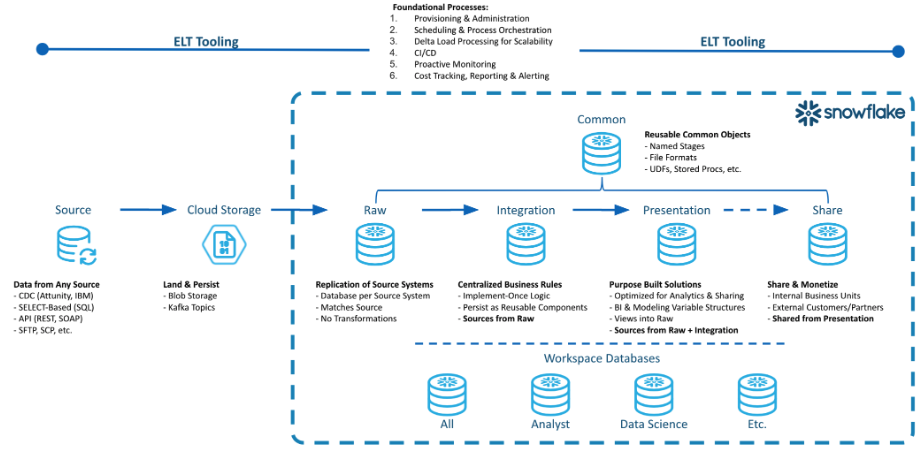

### Raw Layer
The Raw Layer represents the first processing layer within Snowflake.  It facilitates data ingestion into Snowflake and will manage the data as it exists in the source system, with no applied transformations. The following are attributes of the Raw Layer:
- One database per data source.  
- Hash generation for surrogate keys.
- Replication of data as it exists in the source system along with the creation of a surrogate key or control column for downstream transformations.

### Integration Layer
The Integration Layer is used to centralize all business rules applied to the data. This layer performs the transformation, application of business rules, and materialization of data from the Raw Layer into one central location.  The following are attributes of the Integration Layer:
- Centralized business rules.
- Intermediate results persisted as tables.
- Units of work in one place with reusable components.

### Presentation Layer
The Presentation Layer performs the organization of data from the raw and integration layers into various purpose-built solutions for reporting and analytics. The following are attributes of the Presentation Layer:
- Conforming Dimensions
- Atomic Aggregate Fact Tables
- Flat data sets for data science model building
- Views for governing exposure of data for consumption, analytics and sharing.  

>aside negative
>
> **Note** Business rules should not be implemented within the Presentation Layer. Using permanent tables for incrementally updated tables is recommended.

### Common Database
The Common Database is a single database with one or more schemas to manage objects that span the breadth of the data architecture layers. The following are attributes of the Common Database:
- User Defined Functions
- File Formats
- External and Internal Stages
- Audit Tables
- Common dimensions such as Date, Zip Code, State, Country, etc.
- Common table data that is utilized across the DCDF layers.

### Workspace Databases
A Workspace is a sandbox environment where individual teams can persist data for their own development and testing. These workspaces can be a database and related virtual warehouse for each department or team within a business entity. One example can be a Data Science team that clones data from the Presentation Layer into their workspace and run models on that data to determine actionable insights. The following are attributes of a Workspace Database:

- Persist intermediate results
- Non-production datasets for testing purposes
- Compute isolation to mitigate contention and facilitate cost governance.

<!-- ------------------------ -->
## Incremental Processing Concepts
Duration: 4
>aside positive
>
>"The best way to process big data, is to turn it into small data"

### Three steps for Incremental Processing
#### Step 1 - Define Logical Partitions
The volume of data being processed from the source system will drive the need to create logical partitions. Logical partitions are commonly defined as logical periods of time, or time series data, such as day, week, or month based on a business event represented in the data.

>aside positive
>
> In this quickstart order date will be used as the logical partition. The order date will define how to identify new or changed data.

#### Step 2 - Identify Impacted Partitions
Next we want to identify the impacted logical partitions that are represented in the delta feed from the sources system. As the delta data is ingested into our staging tables in the raw layer, the impacted logical partitions (orderdate) can be identified.  
 
#### Step 3 - Incrementally Process those Partitions
We will utilize the logical partitions identified in Step 2, to incrementally process the partitions. 

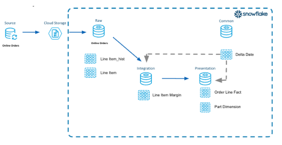

In our example above we implement the aforementioned three steps.
#### Define Logical Partitions
- We will use order date from the LINE_ITEM table.  
- This identifies the business event in our data that represents lifecycle changes over time for a given period.

#### Identify Impacted Partitions
- We will query the LINE_ITEM_STG table in the Raw Layer for distinct order dates.  
- We will insert these dates into the Common Database table DELTA_DATE because this table will be utilized across the different layers.

#### Incrementally Process those Partitions
- We will utilize the impacted partitions and process those dates of data through the raw, integration and presentation layers.  

Let's see how this works!

<!-- ------------------------ -->
## Lab Overview
Duration: 3

Below is an overview diagram of what we will be building.  Each step builds upon what was produced in the prior step.  We will only build the tables in this diagram.  

>aside positive
>
> Included in the code repository are additional table scripts that can be used to build out a dimensional model using these same concepts.


### Lab Structure
- **Explain Code Snippets**
    - We will work through the code for each DCDF data architecture layer, explaining what is happening in each code snippet.

- **Execute Code and Verify Results**
    - In these sections, you will execute the code in your environment.
    - We will validate that the data was loaded using our example tables line_items, orders and part.  

### DCDF Data Architecture Layers

- **Raw Layer**
    - In this layer, we will build the tables in the Raw Layer.
    - Transient Staging tables used for most recent loaded data and having a suffix of _stg. 
    - Permanent History tables to track the history of changes and having a suffix of _hist.

- **Integration Layer**
    - In this layer, we will identify a unit of work to derive the margin (what is margin? profit margin?) at the line item level. 
    - We will step through the code and extract these intermediate results by applying incremental processing.

- **Presentation Layer**
    - In this layer, we will create the ORDER_LINE_FACT table as well as the PART_DM dimension table as part of a dimensional model that can be used for consumption.
    - We will walk through how to incrementally process the new data coming in.

- **Common database**
    - In this layer, we will create the DW_DELTA_DATE table that will be used for incremental processing.  
> aside positive
>
> A table function named DW_DELTA_DATE_RANGE_F will be created in the Common database and utilized for the logical partitions. This will take place in the Quickstart Setup section. 

<!-- ------------------------ -->
## Quickstart Setup
Duration: 5

### Clone Repository for Quickstart
The sample code templates provided will be used to demonstrate incremental processing and logical partitions.  This code is written using SQL Scripting.  The code is tool ignostic and can be easily implemented into your tool set.

To clone the repository for this Quickstart, visit the [DCDF Incremental Processing associated GitHub Repository](https://github.com/Snowflake-Labs/samples/dcdf_incremental_processing). Click on the green "Code" icon near the top of the page to obtain the "HTTPS" link needed to clone the repository. For more information on cloning a git repository please refer to the [GitHub Docs](https://docs.github.com/en/repositories/creating-and-managing-repositories/cloning-a-repository).


>aside positive
>
> **NOTE:** This sample code contains additional tables that we will not go through as part of the quickstart.  They are just a continuation of the patterns we will be discussing to build out a purpose built dimensional model sample.

### Sample Code Information
- These code templates are written using SQL Scripting.
  - Purpose of these scripts is to illustrate incremental processing and logical partitions.
  - These scripts are tool agnostic.
  - These templates can be easily modified to your environment and implemented in your toolset.

- Naming Conventions of scripts
  - Names of the folders are prefixed with a number to identify the order they will run as part of the data pipeline.
  - Table Creation Scripts - Files with postfix of _tbl.sql
  - ELT Process Scripts - Files with postfix of _ld.sql
  - ddl_orch.sql is the parent script that will execute all the database, schema, and table creation scripts.
  - dml_orch.sql is the parent script that will execute the data pipeline.

<!-- ------------------------ -->
## Snowflake Setup
Duration: 5

### Sample Data Set
- Login to your account and verify that you have access to the SNOWFLAKE_SAMPLE_DATA database.  See screenshot below.
- SNOWFLAKE_SAMPLE_DATA data share is created by default in newer accounts.  If you are not seeing this data share, you might need to create the data share in your account.  [Using Sample Data](https://docs.snowflake.com/en/user-guide/sample-data-using.html)

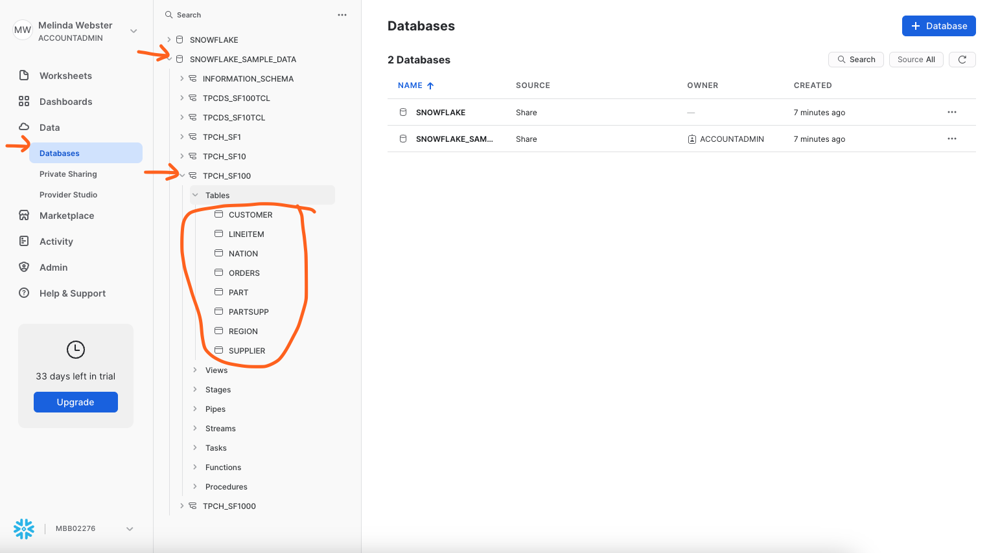

### Creating Example Databases, Schemas, Tables and Warehouse
Let's create the databases, tables and warehouse using the default names.
- Make sure you are in the folder on your laptop where you cloned the sample code.  You want to be at the top level where you see the sub-folders of 000_admin, 100_raw, etc.
- Run Snowsql from the command line.  This will create all the databases, schemas, tables and a warehouse that are needed for this lab.  
``` sql
snowsql -a <account_name> -u <username> -r sysadmin -D l_env=dev -f ddl_orch.sql -o output_file=ddl_orch.out
```
- End of the output should show success like this screenshot.

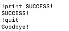

### Example Line Items
As part of the labs, we will monitor specific line item records.
1. Login to your Snowflake account and open a worksheet. 
2. Copy and paste this query into a worksheet.
``` sql
-- Sample Order
select
              row_number() over(order by uniform( 1, 60, random() ) ) as seq_no
             ,l.l_orderkey
             ,o.o_orderdate
             ,l.l_partkey
             ,l.l_suppkey
             ,l.l_linenumber
             ,l.l_quantity
             ,l.l_extendedprice
             ,l.l_discount
             ,l.l_tax
             ,l.l_returnflag
             ,l.l_linestatus
             ,l.l_shipdate
             ,l.l_commitdate
             ,l.l_receiptdate
             ,l.l_shipinstruct
             ,l.l_shipmode
             ,l.l_comment
        from
            snowflake_sample_data.tpch_sf1000.orders o
            join snowflake_sample_data.tpch_sf1000.lineitem l
              on l.l_orderkey = o.o_orderkey
        where
                o.o_orderdate >= to_date('7/1/1998','mm/dd/yyyy')
            and o.o_orderdate  < to_date('7/2/1998','mm/dd/yyyy')
            and l_orderkey = 5722076550
            and l_partkey in ( 105237594, 128236374);
```
3. Output should look like this.
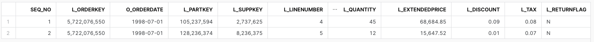

<!-- ------------------------ -->
## Data Acquistion
Duration: 7

During this step we will acquiring the data from the SNOWFLAKE_SAMPLE_DATA to load in the next step. We will use the SNOWFLAKE_SAMPLE_DATA data set, lineitem table data to generate the data files to load into our raw layer.  

### Step 1 - Explain code snippets
1. Using the Snowsight UI, select Worksheets from the left hand menu.
2. Click the ellipsis next to the blue +Worksheets button.
3. Select *"create worksheet from SQL file"* and load the 100_acquisition/line_item_acq.sql.
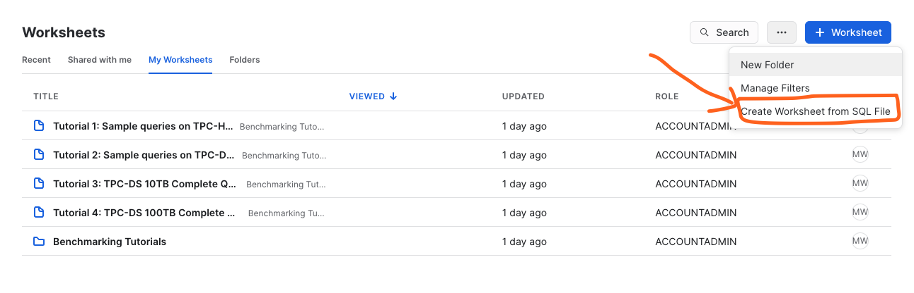
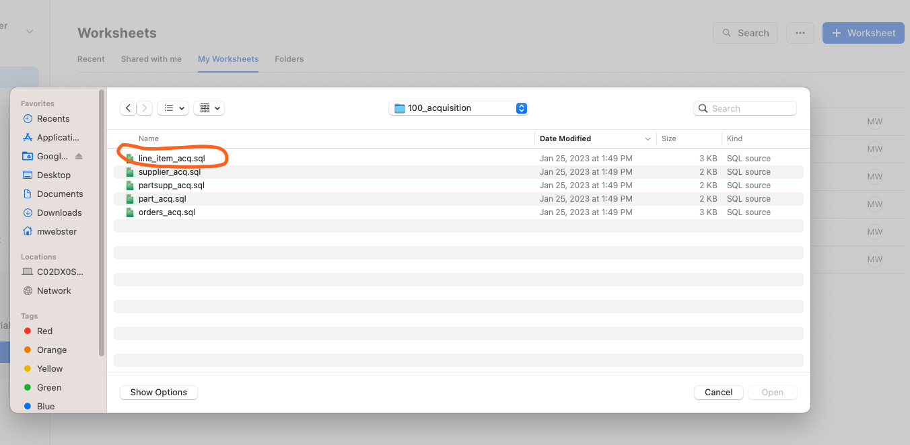
4. In the first few lines of the script we are setting the context for this script. The defaults for database are DEV_WEBINAR_ORDERS_RL_DB and TPCH for the schema. This will be refered to as the Raw Layer going forward.
``` sql
use database DEV_WEBINAR_ORDERS_RL_DB;
use schema   TPCH;
```
5. Next we are setting the date range for the data we want to acquire by setting the l_start_dt and l_end_dt variables. For the purposes of this lab, we are using a 17 day date range.  
``` sql
-- Set variables for this sample data for the time frame to acquire
set l_start_dt = dateadd( day, -16, to_date( '1998-07-02', 'yyyy-mm-dd' ) );
set l_end_dt   = dateadd( day,   1, to_date( '1998-07-02', 'yyyy-mm-dd' ) );
```
6. The *"copy into"* statement is where we are copying (Unloading) data, in CSV format, from the database SNOWFLAKE_SAMPLE_DATA into an Internal Table Stage.  As part of this *"copy into"* statement we are modifying the data to show changes in l_line_status over time.  

``` sql
-- run this 2 or 3 times to produce overlapping files with new and modified records.
copy into
    @~/line_item
from
(
    with l_line_item as
    (
        select
              row_number() over(order by uniform( 1, 60, random() ) ) as seq_no
             ,l.l_orderkey
             ,o.o_orderdate
             ,l.l_partkey
             ,l.l_suppkey
             ,l.l_linenumber
             ,l.l_quantity
             ,l.l_extendedprice
             ,l.l_discount
             ,l.l_tax
             ,l.l_returnflag
             ,l.l_linestatus
             ,l.l_shipdate
             ,l.l_commitdate
             ,l.l_receiptdate
             ,l.l_shipinstruct
             ,l.l_shipmode
             ,l.l_comment
        from
            snowflake_sample_data.tpch_sf1000.orders o
            join sample_data.tpch_sf1000.lineitem l
              on l.l_orderkey = o.o_orderkey
        where
                o.o_orderdate >= $l_start_dt
            and o.o_orderdate  < $l_end_dt
    )
    select
         l.l_orderkey
        ,l.o_orderdate
        ,l.l_partkey
        ,l.l_suppkey
        ,l.l_linenumber
        ,l.l_quantity
        ,l.l_extendedprice
        ,l.l_discount
        ,l.l_tax
        ,l.l_returnflag
        -- simulate modified data by randomly changing the status
        ,case uniform( 1, 100, random() )
            when  1 then 'A'
            when  5 then 'B'
            when 20 then 'C'
            when 30 then 'D'
            when 40 then 'E'
            else l.l_linestatus
         end                            as l_linestatus
        ,l.l_shipdate
        ,l.l_commitdate
        ,l.l_receiptdate
        ,l.l_shipinstruct
        ,l.l_shipmode
        ,l.l_comment
        ,current_timestamp()            as last_modified_dt -- generating a last modified timestamp as part of data acquisition.
    from
        l_line_item l
    order by
        l.l_orderkey
)
file_format      = ( type=csv field_optionally_enclosed_by = '"' )
overwrite        = false
single           = false
include_query_id = true
max_file_size    = 16000000
;
```

### Step 2 - Execute the code and Verify results
In this step we will unload data for the LINE_ITEM, PART and ORDERS tables.

**LINE_ITEM_ACQ.SQL**

1. If you haven't done so already, click the ellipsis next to the blue +Worksheets button.
2. Select *"create worksheet from SQL file"* and load the 100_acquisition/line_item_acq.sql.
3. Setting the context of your script.  Highlight these in your worksheet, and run them to set the context.
``` sql

use database DEV_WEBINAR_ORDERS_RL_DB;
use schema   TPCH;
use warehouse dev_webinar_wh;
```
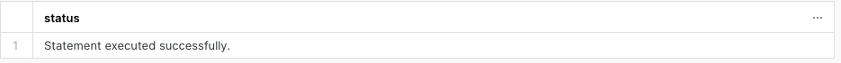

4. Highlight the code to set the variables for l_start_dt, l_end_dt and run them.
``` sql
-- Set variables for this sample data for the time frame to acquire
set l_start_dt = dateadd( day, -16, to_date( '1998-07-02', 'yyyy-mm-dd' ) );
set l_end_dt   = dateadd( day,   1, to_date( '1998-07-02', 'yyyy-mm-dd' ) );
```


5. Let's verify those variables have been set. Run the following statement in your worksheet.
``` sql
select $l_start_dt, $l_end_dt;
```
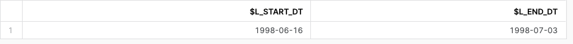

6. Set your cursor on the *"copy into"* command and run it.
7. This might take around 2-3 minutes on a small warehouse.  If you want to increase the size of your warehouse, it will run faster. The output should be similar to this.
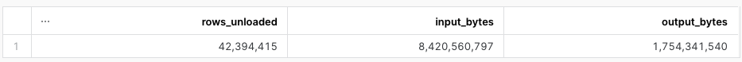

8. Let's verify the number of files created. Paste this SQL into your worksheet and run it.  Output should be similar to this.
``` sql
list @~/line_item;
```
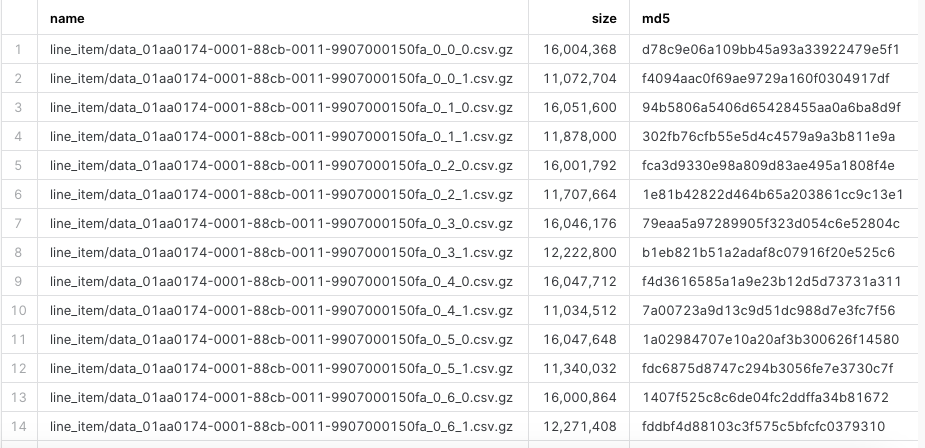

**PART_ACQ.SQL**
1. Click the ellipsis next to the blue +Worksheets button.
2. Select to *"create worksheet from SQL file"* and load the 100_acquisition/part_acq.sql.
3. Setting the context of your script.  Highlight these in your worksheet, and run them to set the context.
``` sql
use database DEV_WEBINAR_ORDERS_RL_DB;
use schema   TPCH;
use warehouse dev_webinar_wh;
```


4. Set your cursor on the *"copy into"* command and run it.  This might take a few minutes.  The output should be similar to this.
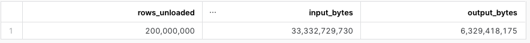

**ORDERS_ACQ.SQL**
1. Click the ellipsis next to the blue +Worksheets button.
2. Select to *"create worksheet from SQL file"* and load the 100_acquisition/orders_acq.sql.
3. Setting the context of your script.  Highlight these in your worksheet, and run them to set the context.
``` sql
use database DEV_WEBINAR_ORDERS_RL_DB;
use schema   TPCH;
use warehouse dev_webinar_wh;
```


4. Set your cursor on the *"copy into"* command and run it.  This might take a few minutes.  The output should be similar to this.
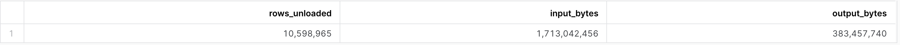

<!-- ------------------------ -->
## Raw Layer - Staging the data
Duration: 7

In this section, we will take the acquired data from the Internal Table Stage mentioned in the previous section and load it into the staging tables in the Raw layer.

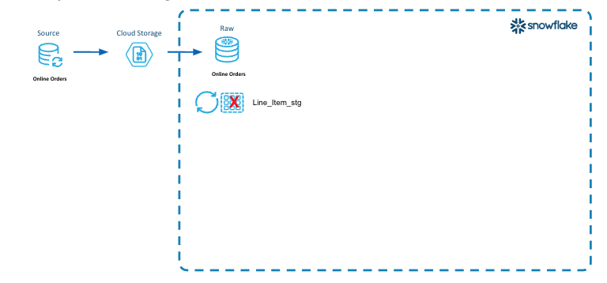
>aside positive
>
>This diagram illustrates the first steps of loading the new data files into the raw layer tables.
>
> - **Incremental Processing Step 1** is to define the logical partitions.  In the line item data we have identified the orderdate as the logical partition.
> - New data files from the Online Orders data source are placed into cloud storage.
> - A Truncate/Reload pattern is used here to load the LINE_ITEM_STG table.
> - First we truncate the prior data, and then load the new data into the LINE_ITEM_STG table.
 
### Step 1 - Explain code snippets

#### LINE_ITEM_STG_LD.SQL

1. In Snowsight, *"create worksheet from SQL file"*, select the 200_raw/line_item_stg_ld.sql
2. In the code, after setting the context, the next step is to truncate the line_item_stg table to remove any old ddata from the previous run.
``` sql
truncate table line_item_stg;
```
3. Below in the *"copy into"* statement, the data from the files produced in the acquisition steps will be loaded in one statement.  This is a bulk load.  
4. The purge parameter is set to true so that the files will be purged from the Internal Table Stage once they have been loaded.  This saves on storage usage and cost since these files are no longer needed.
``` sql
-- perform bulk load
copy into
    line_item_stg
from
    (
    select
         s.$1                                            -- l_orderkey
        ,s.$2                                            -- o_orderdate
        ,s.$3                                            -- l_partkey
        ,s.$4                                            -- l_suppkey
        ,s.$5                                            -- l_linenumber
        ,s.$6                                            -- l_quantity
        ,s.$7                                            -- l_extendedprice
        ,s.$8                                            -- l_discount
        ,s.$9                                            -- l_tax
        ,s.$10                                           -- l_returnflag
        ,s.$11                                           -- l_linestatus
        ,s.$12                                           -- l_shipdate
        ,s.$13                                           -- l_commitdate
        ,s.$14                                           -- l_receiptdate
        ,s.$15                                           -- l_shipinstruct
        ,s.$16                                           -- l_shipmode
        ,s.$17                                           -- l_comment
        ,s.$18                                           -- last_modified_dt
        ,metadata$filename                               -- dw_file_name
        ,metadata$file_row_number                        -- dw_file_row_no
        ,current_timestamp()                             -- dw_load_ts
    from
        @~ s
    )
purge         = true
pattern       = '.*line_item/data.*\.csv\.gz'
file_format   = ( type=csv field_optionally_enclosed_by = '"' )
on_error      = skip_file
--validation_mode = return_all_errors
;
```

### Step 2 - Execute code and Verify Results
In this step we will load 3 _stg tables: LINE_ITEM_STG, ORDERS_STG and PART_STG.

#### LINE_ITEM_STG_LD.SQL
1. First, we will load the Line Item data into the LINE_ITEM_STG table.
2. Make sure you have 200_raw/line_item_stg_ld.sql script open in Snowsight.  
3. Setting the context of our session, highlight these SQL statements in your worksheet, and run them to set the context.
``` sql
use role     sysadmin;
use database dev_webinar_orders_rl_db;
use schema   tpch;
use warehouse dev_webinar_wh;
```


4. Highlight the truncate command in the script and run it.
``` sql
truncate table line_item_stg;
```


5. Set your cursor on the *"copy into"* command and run it.  On a small warehouse this will take approximately 1 minute to load the files. The results should look like this.
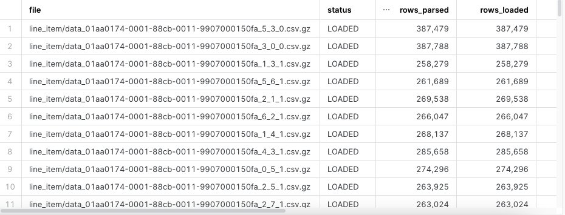

6. Let's verify the data was loaded.  Highlight the following SQL statement in your worksheet and run it.  
``` sql
select 
    *
from 
    table(information_schema.copy_history(table_name=>'LINE_ITEM_STG', start_time=> dateadd(hours, -1, current_timestamp())))
where
    status = 'Loaded'
order by
    last_load_time desc
;
```
7.  The results will look similar to this.  The file name might differ.
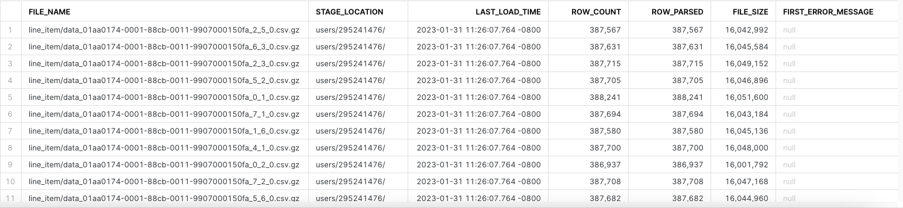

8. Let's verify that the lines that we are monitoring are loaded into the LINE_ITEM_STG table. Highlight this SQL statement in your worksheet and run it.
``` sql
select * 
from dev_webinar_orders_rl_db.tpch.line_item_stg 
where l_orderkey = 5722076550
and l_partkey in ( 105237594, 128236374); -- 2 lines
```

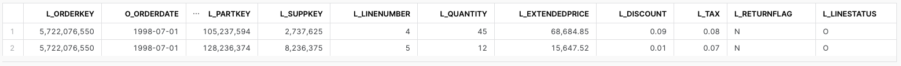

#### PART_STG_LD.SQL

1. Next, we will load the Part data into the PART_STG table. 
2. Select *"create worksheet from SQL file"* and load the 200_raw/part_stg_ld.sql.  
3. Setting the context of our script.  Highlight these in your worksheet, and run them to set the context.
``` sql
use role     sysadmin;
use database dev_webinar_orders_rl_db;
use schema   tpch;
use warehouse dev_webinar_wh;
```


4. Highlight the truncate command in the script and run it.
``` sql
truncate table part_stg;
```


5. Set your cursor on the *"copy into"* command and run it.  On a small warehouse this will take approximately 2 minutes to load the files. The results should look like this.
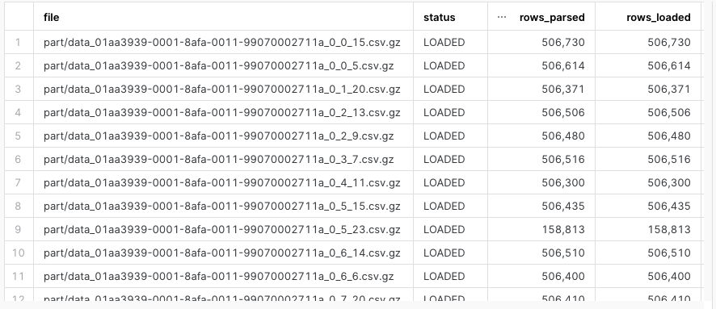

#### ORDERS_STG_LD.SQL

1. Finally, we will load the Orders data into the ORDERS_STG table. 
2. Select to *"create worksheet from SQL file"* and load the 200_raw/orders_stg_ld.sql.  
3. Setting the context of our script.  Highlight these in your worksheet, and run them to set the context.
``` sql
use role     sysadmin;
use database dev_webinar_orders_rl_db;
use schema   tpch;
use warehouse dev_webinar_wh;
```


4. Highlight the truncate command in the script and run it.
``` sql
truncate table orders_stg;
```


5. Set your cursor on the *"copy into"* command and run it.  On a small warehouse this will take approximately 2 minutes to load the files. The results should look like this.
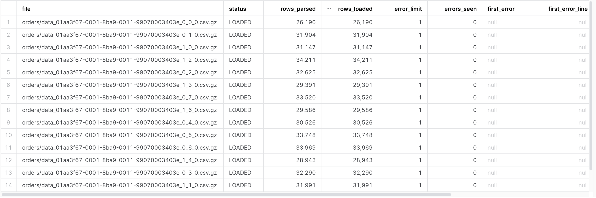

<!-- ------------------------ -->
## Raw Layer - Identify Impacted Partitions
Duration: 5

In this section we will identify the impacted partitions that were loaded into the staging tables in the Raw Layer and persist those identified partitions in a table for use in subsequent steps.

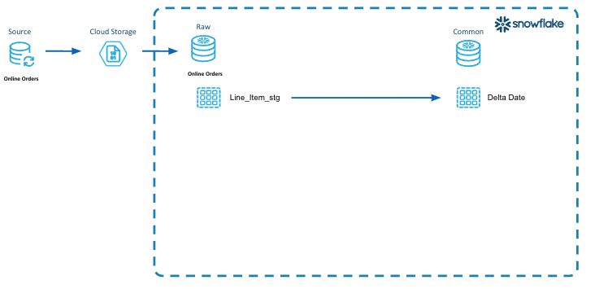

>aside positive
>
>In this diagram illustrates the concept of identifying the impacted partitions, persisting them to be utilized in all the layers of the data architecture to incrementally process the data.
>
> - **Incremental Processing Step 2** is to identify the impacted partitions.  
> - In this diagram, we select all the distinct orderdates from the LINE_ITEM_STG table that are impacted by the new data that was loaded.  
> - Then we persist those dates into a table called *"dw_delta_date"* so that we can utilize those impacted partitions to do our incremental processing at each layer (Raw, Integration and Presentation).

### Step 1 - Explain code snippets

#### DW_DELTA_DATE_LD.SQL
1. In Snowsight, *"create worksheet from SQL file"*, select the 200_raw/dw_delta_date_ld.sql
2. After setting the context there is an *"insert"* statement.  As part of the *"insert"* statement, there is a [CTE (Common Table Expression)](https://docs.snowflake.com/en/user-guide/queries-cte.html) identified by the *"with"* statement inside the *"insert"* statement. This *"select"* identifies all the orderdates that were impacted with the load into the _STG table.
``` sql
insert overwrite into dw_delta_date
with l_delta_date as
(
    select distinct
        o_orderdate as event_dt
    from
        dev_webinar_orders_rl_db.tpch.line_item_stg 
)
select
     event_dt
    ,current_timestamp()            as dw_load_ts
from
    l_delta_date
order by
    1
;
```

#### DW_DELTA_DATE_RANGE_F.SQL (Additional Information)

1. As part of the objects we created back in the Getting Started Section, we created a table function called DW_DELTA_DATE_RANGE_F. This table function will take a type of time period such as day, week, month, quarter and year as a parameter, and return rows with a start_date and end_date of that period.  
2. To review the code in Snowsight, *"create worksheet from SQL file"*, select the 000_admin/dw_delta_date_range_f.sql
``` sql
use schema   &{l_common_schema};;

create or replace function dw_delta_date_range_f
(
    p_period_type_cd   varchar
)
returns table( start_dt timestamp_ltz, end_dt timestamp_ltz )
as
$$
    select
         start_dt
        ,end_dt
    from
        (
        select
             case lower( p_period_type_cd )
                 when 'all'     then current_date()
                 when 'day'     then date_trunc( day, event_dt )
                 when 'week'    then date_trunc( week, event_dt )
                 when 'month'   then date_trunc( month, event_dt )
                 when 'quarter' then date_trunc( quarter, event_dt )
                 when 'year'    then date_trunc( year, event_dt )
                 else current_date()
             end                as partition_dt
            ,min( event_dt ) as start_dt
            ,max( event_dt ) as end_dt
        from
            dw_delta_date
        group by
            1
        )
    order by
        1
$$
;
```

### Step 2 - Execute code and Verify Results

#### DW_DELTA_DATE_LD.SQL

1. Setting the context of our script.  Highlight these in your worksheet, and run them to set the context.
``` sql
use database dev_webinar_common_db;
use schema util;
use warehouse dev_webinar_wh;
```


2. Set the cursor on the *"insert overwrite"* statement and run it. The output should look like the following.

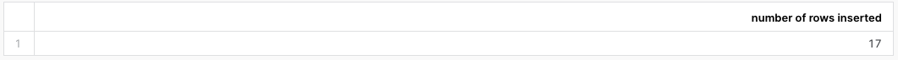

3. To verify that the order dates for 17 day window were loaded into the DW_DELTA_DATE table, highlight this query into your worksheet and run it.
``` sql
select * 
from dev_webinar_common_db.util.dw_delta_date
order by event_dt;
```
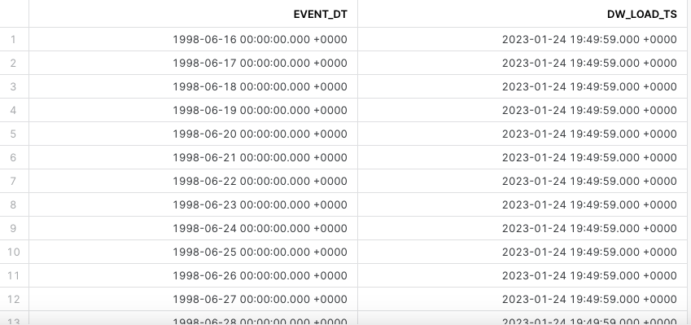

#### DW_DELTA_DATE_RANGE_F.SQL (Query the table function)

1. Verify the table function DW_DELTA_DATE_RANGE_F returns results as well. Highlight the following query your worksheet and run it.  This will return 3 rows representing 3 weeks of data.  We will utilize this table function in future scripts.
``` sql
select start_dt, end_dt 
FROM table(dev_webinar_common_db.util.dw_delta_date_range_f('week')) 
order by 1;
```
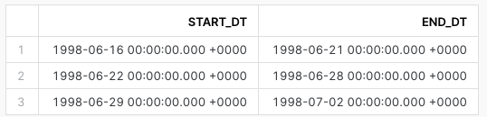


<!-- ------------------------ -->
## Raw Layer - Incrementally Process
Duration: 15

In this section we will incrementally process the data and load it into the persistent tables in the Raw layer by utilizing the impacted partitions that were identified in the prior step. 

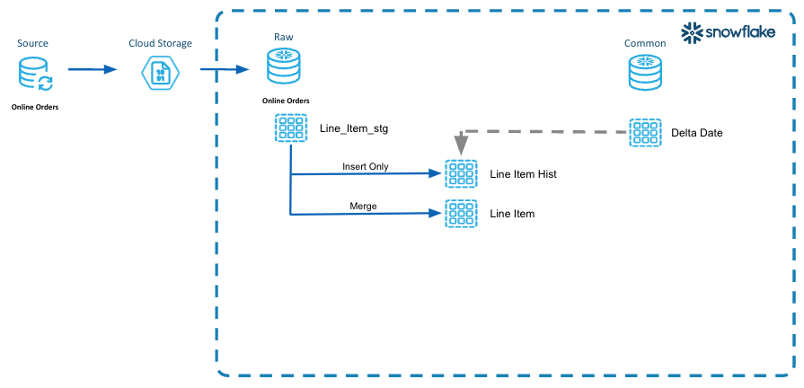

>aside positive
>In this diagram we are illustrating the concept of "looping" through the impacted partitions and processing only that data impacted into the persistent tables in the raw layer.
>
> -  **Incremental Processing Step 3** is to utilize the impacted partitions to process the data through each of the layers.
> - Here we are using the order dates stored in the DW_DELTA_DATE table to identify the dates that need to be processed into the LINE_ITEM_HIST and LINE_ITEM tables.  
> - In the LINE_ITEM_HIST table we are capturing the life cycle of the rows as they change. This is for audit purposes or tracking.
> - In the LINE_ITEM table, we are peristing the current state of that line_item row.

### Step 1 - Explain code snippets

#### LINE_ITEM_HIST_LD.SQL

1. In Snowsight, *"create worksheet from SQL file"*, select the 200_raw/line_item_hist_ld.sql
2. After we set the context, there is the *"execute immediate"* statement.  Since we are using [SQL Scripting](https://docs.snowflake.com/en/developer-guide/snowflake-scripting/index.html) this statement is used to create an anonymous block.
``` sql
execute immediate $$
```
3. In the declaration section, we are defining 2 variables (l_start_dt, and l_end_dt) that we will use to process the logical partition start and end dates.  
``` sql
declare
  l_start_dt date;
  l_end_dt   date;
```
4. Then we are declaring the cursor which holds the result of the DW_DELTA_DATE_RANGE_F table function that returns a start and end date for a week.  
``` sql
declare
  ...
  c1 cursor for select start_dt, end_dt FROM table(dev_webinar_common_db.util.dw_delta_date_range_f('week')) order by 1;
```
5.  The *"for"* loop is where the script incrementally processes the data by looping through a week at a time.
``` sql
begin
  --
  -- Loop through the dates to incrementally process based on the logical partition definition.
  -- In this example, the logical partitions are by week.
  --
  for record in c1 do
    l_start_dt := record.start_dt;
    l_end_dt   := record.end_dt;
    ...
  end for;

end;
```
6. Scroll down to the *"insert"* statement.  
7. Inside the *"with"* statement the script is creating a CTE named l_stg.
8. The surrogate key and hash diff columns (_shk) being created in this CTE will be used to assist in identifying the rows that have changed.
``` sql
insert into line_item_hist
with l_stg as
    (
        --
        -- Driving CTE to identify all records in the logical partition to be processed.
        select
            -- generate hash key and hash diff to streamline processing
             sha1_binary( concat( s.l_orderkey, '|', s.l_linenumber ) )  as dw_line_item_shk
            --
            -- note that last_modified_dt is not included in the hash diff since it only represents recency of the record versus an 
            -- actual meaningful change in the data
            ,sha1_binary( concat( s.l_orderkey
                                         ,'|', coalesce( to_char( s.o_orderdate, 'yyyymmdd' ), '~' )
                                         ,'|', s.l_linenumber
                                         ,'|', coalesce( to_char( s.l_partkey ), '~' )
                                         ,'|', coalesce( to_char( s.l_suppkey ), '~' )
                                         ,'|', coalesce( to_char( s.l_quantity ), '~' )
                                         ,'|', coalesce( to_char( s.l_extendedprice ), '~' )
                                         ,'|', coalesce( to_char( s.l_discount ), '~' )
                                         ,'|', coalesce( to_char( s.l_tax ), '~' )
                                         ,'|', coalesce( to_char( s.l_returnflag ), '~' )
                                         ,'|', coalesce( to_char( s.l_linestatus ), '~' )
                                         ,'|', coalesce( to_char( s.l_shipdate, 'yyyymmdd' ), '~' )
                                         ,'|', coalesce( to_char( s.l_commitdate, 'yyyymmdd' ), '~' )
                                         ,'|', coalesce( to_char( s.l_receiptdate, 'yyyymmdd' ), '~' )
                                         ,'|', coalesce( s.l_shipinstruct, '~' )
                                         ,'|', coalesce( s.l_shipmode, '~' )
                                         ,'|', coalesce( s.l_comment, '~' )
                                )
        
                        )               as dw_hash_diff
            ,s.*
        from
            line_item_stg s
```

8. In the CTE, the *"where"* clause is filtering the data from the LINE_ITEM_STG table to select only the rows that have an orderdate that is in the logical *"week"* partiton.
``` sql
insert into line_item_hist
with l_stg as
    (
        --
        -- Driving CTE to identify all records in the logical partition to be processed.
        select
            ...
        from
            line_item_stg s
        where
                s.o_orderdate >= :l_start_dt
            and s.o_orderdate  < :l_end_dt
    )
```

9. The next CTE named l_deduped will go through and dedupe the records in the l_stg CTE, using the hash_diff to identify duplicate rows.  This eliminates duplicates from getting loaded into the permanent Raw layer LINE_ITEM_HIST table.
``` sql
,l_deduped as
    (
        --
        -- Dedupe the records from the staging table.
        -- This assumes that there may be late arriving or duplicate data that were loaded
        -- Need to identify the most recent record and use that to update the Current state table.
        -- as there is no reason to process each individual change in the record, the last one would have the most recent updates
        select
            *
        from
            l_stg
        qualify
            row_number() over( partition by dw_hash_diff order by last_modified_dt desc, dw_file_row_no )  = 1
    )
```

10. The final outside *"select"* statement will select data from the LINE_ITEM_HIST table using the same logical *"week"* partition range, and compare it to the deduped staging records to identify what needs to be inserted into the LINE_ITEM_HIST table.
``` sql
    select
        ...
    from
        l_deduped s
    where
        s.dw_hash_diff not in
        (
            -- Select only the rows in that logical partition from the final table.
            select dw_hash_diff from line_item_hist 
            where
                    o_orderdate >= :l_start_dt
                and o_orderdate  < :l_end_dt
        )
```

11. **Important:** To optimize query performance in Snowflake, and ensure proper clustering of data in each micropartition, the *"order by"* clause sorts the rows by orderdate as they are inserted into the table.
``` sql
    order by
        o_orderdate  -- physically sort rows by a logical partitioning date
    ;
```
#### LINE_ITEM_LD.SQL

1. In Snowsight, *"create worksheet from SQL file"*, select the 200_raw/line_item_ld.sql
2. The script is very similar to line_item_hist_ld.sql except this is a merge pattern. The script has the same anonymous block, variable declarations, and cursor definition using the DW_DELTA_DATE_RANGE_F table function to loop through the logical partitions, as well as the same *"for"* loop.
``` sql
execute immediate $$

declare
  l_start_dt date;
  l_end_dt   date;
  -- Grab the dates for the logical partitions to process
  c1 cursor for select start_dt, end_dt FROM table(dev_webinar_common_db.util.dw_delta_date_range_f('week')) order by 1;

begin

  --
  -- Loop through the dates to incrementally process based on the logical partition definition.
  -- In this example, the logical partitions are by week.
  --
  for record in c1 do
    l_start_dt := record.start_dt;
    l_end_dt   := record.end_dt;
    ...
```

3. The script also has the same l_stg CTE to identify the LINE_ITEM_STG records within that week of logical partitions. It is also doing the same surrogate key and hash diff derivations.
``` sql
       with l_stg as
        (
            --
            -- Driving CTE to identify all records in the logical partition to be processed
            --
            select
                -- generate hash key and hash diff to streamline processing
                 sha1_binary( concat( s.l_orderkey, '|', s.l_linenumber ) )  as dw_line_item_shk
                --
                -- note that last_modified_dt is not included in the hash diff since it only represents recency of the record versus an 
                -- actual meaningful change in the data
                --
                ,sha1_binary( concat( s.l_orderkey
                                     ,'|', coalesce( to_char( s.o_orderdate, 'yyyymmdd' ), '~' )
                                     ,'|', s.l_linenumber
                                     ,'|', coalesce( to_char( s.l_partkey ), '~' )
                                     ,'|', coalesce( to_char( s.l_suppkey ), '~' )
                                     ,'|', coalesce( to_char( s.l_quantity ), '~' )
                                     ,'|', coalesce( to_char( s.l_extendedprice ), '~' )
                                     ,'|', coalesce( to_char( s.l_discount ), '~' )
                                     ,'|', coalesce( to_char( s.l_tax ), '~' )
                                     ,'|', coalesce( to_char( s.l_returnflag ), '~' )
                                     ,'|', coalesce( to_char( s.l_linestatus ), '~' )
                                     ,'|', coalesce( to_char( s.l_shipdate, 'yyyymmdd' ), '~' )
                                     ,'|', coalesce( to_char( s.l_commitdate, 'yyyymmdd' ), '~' )
                                     ,'|', coalesce( to_char( s.l_receiptdate, 'yyyymmdd' ), '~' )
                                     ,'|', coalesce( s.l_shipinstruct, '~' )
                                     ,'|', coalesce( s.l_shipmode, '~' )
                                     ,'|', coalesce( s.l_comment, '~' )
                                    )
            
                            )               as dw_hash_diff
                ,s.*
            from
                line_item_stg s
            where
                    s.o_orderdate >= :l_start_dt
                and s.o_orderdate  < :l_end_dt
        )
```

4. The script has the same dedupe logic.
``` sql
,l_deduped as
    (
        --
        -- Dedupe the records from the staging table.
        -- This assumes that there may be late arriving or duplicate data that were loaded
        -- Need to identify the most recent record and use that to update the Current state table.
        -- as there is no reason to process each individual change in the record, the last one would have the most recent updates
        select
            *
        from
            l_stg
        qualify
            row_number() over( partition by dw_hash_diff order by last_modified_dt desc, dw_file_row_no )  = 1
    )
```
5. However...the script does have an additional CTE l_tgt. This CTE is important for partition pruning efficiencies because it is selecting only those rows from the LINE_ITEM table that are in the logical partition range we are processing.  
``` sql
,l_tgt as
        (
            --
            -- Select the records in the logical partition from the current table. 
            -- Its own CTE, for partition pruning efficiencies
            select *
            from line_item
            where
                    o_orderdate >= :l_start_dt
                and o_orderdate  < :l_end_dt
        )
```
6. Now let's look at the *"merge"* statement.  In the *"select"* statement below, the l_deduped CTE and l_tgt CTE are joined together with a left join to identify the rows that are in the LINE_ITEM_STG table that might not be in the LINE_ITEM table; or where the hash_diff is different and the modified date is after what already exists in the table.  
``` sql
-- Merge Pattern 
    --
    merge into line_item tgt using
    (
      ...
        select
             current_timestamp()        as dw_version_ts
            ,s.*
        from
            l_deduped s
            left join l_tgt t on
                t.dw_line_item_shk = s.dw_line_item_shk
        where
            -- source row does not exist in target table
            t.dw_line_item_shk is null
            -- or source row is more recent and differs from target table
            or (
                    t.last_modified_dt  < s.last_modified_dt
                and t.dw_hash_diff     != s.dw_hash_diff
               )
        order by
            s.o_orderdate  -- physically sort rows by logical partitioning date
    ) src
```
7. **Important:** Please note the *"on"* clause of the *"merge"* statement.  The logical partition dates are used to prevent a full table scan of the LINE_ITEM table.
``` sql
-- Merge Pattern 
    --
    merge into line_item tgt using
    (
      ...
    on
    (
            tgt.dw_line_item_shk = src.dw_line_item_shk
        and tgt.o_orderdate     >= :l_start_dt
        and tgt.o_orderdate      < :l_end_dt
    )
```
### Step 2 - Execute code and Verify Results

#### LINE_ITEM_HIST_LD.SQL
1. Select *"create worksheet from SQL file"*, select the 200_raw/line_item_hist_ld.sql. Set the context of our script. Highlight the following SQL statements in your worksheet and run them to set the context.
``` sql
use role     sysadmin;
use database dev_webinar_orders_rl_db;
use schema   tpch;
use warehouse dev_webinar_wh;
```


2. Put your cursor on the *"execute immediate"* command at the top of the script and run it.
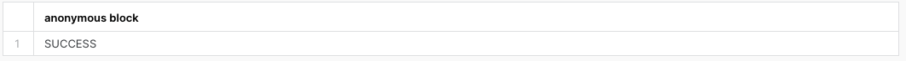

3. Let's verify that the data was loaded into the LINE_ITEM_HISTORY table. Highlight the following query in your worksheet. If you have run these acquisition and load scripts multiple times you may see history changes in this table.

>aside negative
> If you are using the Snowflake Extension for VS Code to run the scripts, the SHA1_BINARY fields will not be displayed properly. To confirm that the SHA1_BINARY was created properly, run the following query in Snowflake. 

``` sql
select * 
from dev_webinar_orders_rl_db.tpch.line_item_hist 
where l_orderkey = 5722076550 
and l_partkey in ( 105237594, 128236374)
order by 1;
```
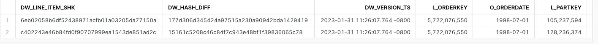

#### LINE_ITEM_LD.SQL

1. Select *"create worksheet from SQL file"* and open the the 200_raw/line_item_ld.sql file.  
2. Highlight the following SQL statements in your worksheet and run them to set the context.
``` sql
use role     sysadmin;
use database dev_webinar_orders_rl_db;
use schema   tpch;
use warehouse dev_webinar_wh;
```


2. Put your cursor on the *"execute immediate"* command and run it.


3. Let's verify that the data was loaded into the LINE_ITEM table. Highlight the following query in your worksheet and run it.
``` sql
select * 
from dev_webinar_orders_rl_db.tpch.line_item 
where l_orderkey = 5722076550 
and l_partkey in ( 105237594, 128236374)
order by 1;
```


#### PART_LD.SQL
1. Now we want to load the Part data into the PART table.  
2. Select *"create worksheet from SQL file"* and open the worksheet 200_raw/part_ld.sql.  
3. Highlight the following SQL statements in the worksheet and run them to set the context.
``` sql
use role     sysadmin;
use database dev_webinar_orders_rl_db;
use schema   tpch;
use warehouse dev_webinar_wh;
```


2. Put your cursor on the *"execute immediate"* command and run it.


3. Verify the PART table was loaded.  Highlight the following query and run it.
``` sql
select *
from dev_webinar_orders_rl_db.tpch.part
where p_partkey in ( 105237594, 128236374);
```
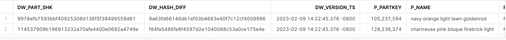

#### ORDER_LD.SQL
1. Now we want to load the Order data into the ORDERS table.  
2. Select *"create worksheet from SQL file"* and open the 200_raw/order_ld.sql file.  
3. Highlight the following SQL statements in the worksheet and run them to set the context.
``` sql
use role     sysadmin;
use database dev_webinar_orders_rl_db;
use schema   tpch;
use warehouse dev_webinar_wh;
```


2. Put your cursor on the *"execute immediate"* command and run it.


3. Verify the ORDERS table was loaded with the order data.  Highlight the following query and run it.
``` sql
select * 
from dev_webinar_orders_rl_db.tpch.orders 
where o_orderkey = 5722076550;
```
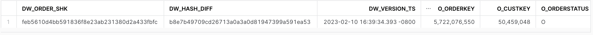

<!-- ------------------------ -->
## Integration Layer
Duration: 10

In this step we will incrementally process an isolated unit of work, deriving certain business rules from the impacted partitions that we previously identified. 

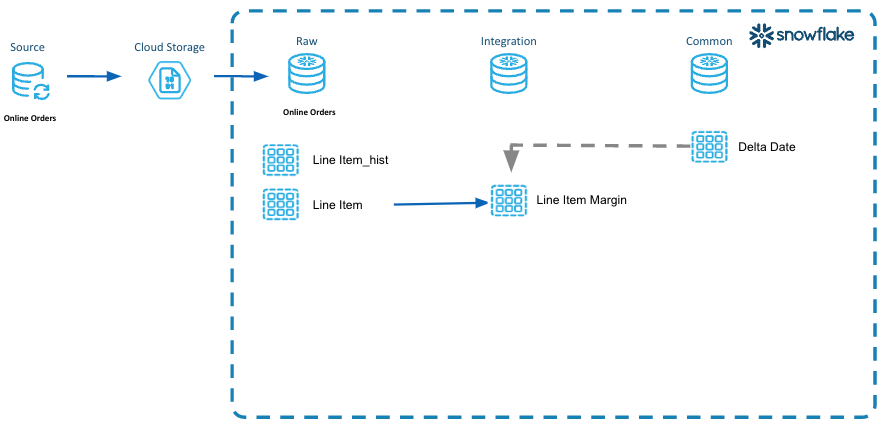
>aside positive
>
>This diagram illustrates the steps for incremental processing units of work in the integration layer of the DCDF data architecture.
>
> - A unit of work has been identified where the line item margin needs to be derived/calculated for each line item.
> - This is an isolated unit of work with business rules that should be incrementally processed each time new or changed line items are processed.  
> - Extensible, ease of maintenance for that unit of work.  As rules change to derive the margin, then they can be added/changed here in one place.
> - The impacted logical partitions have been identified and will be incrementally processed.  

### Step 1 - Explain code snippets
#### LINE_ITEM_MARGIN_LD.SQL
1. In Snowsight, *"create worksheet from SQL file"*, select the 310_derivation/line_item_margin_ld.sql
2. This script is also using the anonymous block in SQL Scripting. 
``` sql
execute immediate $$
```
3. Again, the cursor is being declared using the result of the DW_DELTA_DATE_RANGE_F table function that returns a start and end date for a given week. We are going to loop through the weeks and process a week at a time. This is the incremental processing.

``` sql
declare
  l_start_dt date;
  l_end_dt   date;
  -- Grab the dates for the logical partitions to process
  c1 cursor for select start_dt, end_dt FROM table(dev_webinar_common_db.util.dw_delta_date_range_f('week')) order by 1;

begin

  --
  -- Loop through the dates to incrementally process based on the logical partition definition.
  -- In this example, the logical partitions are by week.
  --
  for record in c1 do
    l_start_dt := record.start_dt;
    l_end_dt   := record.end_dt;
```
4. Just like the line_item_ld.sql file in the previous section, the merge processing pattern is being utilized here to select data by using the logical partitions.
``` sql
merge into line_item_margin t using
    (
        with l_src as
        (
            -- 
            -- Driving CTE to identify all the records in the logical partition to be process
            --
            select
                 s.dw_line_item_shk
                ,s.o_orderdate
                ,s.l_extendedprice - (s.l_quantity * p.ps_supplycost ) as margin_amt
                ,s.last_modified_dt
            from
                dev_webinar_orders_rl_db.tpch.line_item s
                join dev_webinar_orders_rl_db.tpch.partsupp p
                  on ( p.ps_partkey = s.l_partkey
                       and p.ps_suppkey = s.l_suppkey )
            where
                    s.o_orderdate >= :l_start_dt
                and s.o_orderdate  < :l_end_dt
        )
        ,l_tgt as
        (
            -- 
            -- Select the records in the logical partition from the current table.
            -- Its own CTE, for partition pruning efficiencies
            select *
            from line_item_margin
            where
                    o_orderdate >= :l_start_dt
                and o_orderdate  < :l_end_dt
        )
        select
             current_timestamp()        as dw_update_ts
            ,s.*
        from
            l_src s
            left join l_tgt t on
                t.dw_line_item_shk = s.dw_line_item_shk
        where
            -- source row does not exist in target table
            t.dw_line_item_shk is null
            -- or source row is more recent and differs from target table
            or (
                    t.last_modified_dt  < s.last_modified_dt
                and t.margin_amt       != s.margin_amt
               )
        order by
            s.o_orderdate
    ) s
    on
    (
        t.dw_line_item_shk = s.dw_line_item_shk
        and t.o_orderdate >= :l_start_dt 
        and t.o_orderdate  < :l_end_dt
    )
```

### Step 2 - Execute code and Verify Results
#### LINE_ITEM_MARGIN_LD.SQL
1. In Snowsight, *"create worksheet from SQL file"* and open the line_item_margin_ld.sql file. 
2. Highlight the following SQL statements in your worksheet and run them to set the context.
``` sql
use role     sysadmin;
use database dev_webinar_il_db;
use schema   main;
use warehouse dev_webinar_wh;
```


3. Place your cursor on the *"execute immediate"* command and run it.


4. Let's verify that the data was loaded into the LINE_ITEM_MARGIN table. Highlight the following SQL query in your worksheet. If you have run these load scripts multiple times you may see history changes in this table.
``` sql
-- Integration
select m.*
from dev_webinar_il_db.main.line_item_margin m
    join dev_webinar_orders_rl_db.tpch.line_item l
where l.l_orderkey = 5722076550 
and l.l_partkey in ( 105237594, 128236374)
and m.dw_line_item_shk = l.dw_line_item_shk;
```
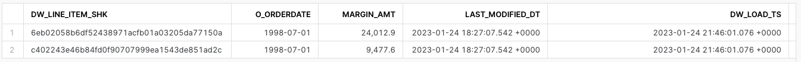
<!-- ------------------------ -->
## Presentation Layer
Duration: 6

In this step we will incrementally process the data that was loaded in the previous section, and re-organizing the data for consumption from the Presentation layer, utilizing the identified impacted partitions.

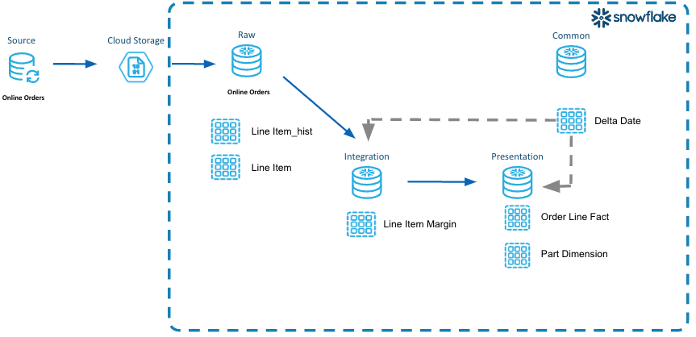
>aside positive
>
>In this diagram illustrates the steps for incremental processing for the Presentation layer of the DCDF data architecture.
>
> - Order_line_fact is a purpose built solution for consumption and analytics.
> - Dimensional model as an example to provide a solution around the orders lines and consumption at that atomic level of data.
> - The impacted logical partitions have been identified and will be incrementally processed in the presentation layer.

### Step 1 - Explain code snippets
#### ORDER_LINE_FACT_LD.SQL
1. In Snowsight, *"create worksheet from SQL file"*, select the 410_fact_atomic/order_line_fact_ld.sql
2. This script uses the anonymous block in SQL Scripting. 
``` sql
execute immediate $$
```
3. Again, the cursor is being declared using the result of the DW_DELTA_DATE_RANGE_F table function that returns a start and end date for a given week. We are going to loop through the weeks and process a week at a time. This is the incremental processing.
``` sql
declare
  l_start_dt date;
  l_end_dt   date;
  -- Grab the dates for the logical partitions to process
  c1 cursor for select start_dt, end_dt FROM table(dev_webinar_common_db.util.dw_delta_date_range_f('week')) order by 1;

begin

  --
  -- Loop through the dates to incrementally process based on the logical partition definition.
  -- In this example, the logical partitions are by week.
  --
  for record in c1 do
    l_start_dt := record.start_dt;
    l_end_dt   := record.end_dt;
```
4.  Within the *"for"* loop is a delete/insert processing pattern. The *"delete"* statement will delete from the ORDER_LINE_FACT table any rows within the logical partition. This logical partition is the week of order dates in our example. Then the *"insert"* will insert all the rows for that logical partition into the ORDER_LINE_FACT table.
5. We first apply deletes and then inserts in order to handle situations such as late arriving data. For instance if the supplier wasn't available when the order line item was first ordered, that value would be some default value. Then as the status of the line item changes, and the supplier was updated, the original defaulted row would need to be removed.
``` sql
-- Delete the records using the logical partition 
     -- Very efficient when all the rows are in the same micropartitions.  Mirrors a truncate table in other database platforms.
     delete from order_line_fact
     where orderdate >= :l_start_dt
       and orderdate <  :l_end_dt;
 
     -- Insert the logical partitioned records into the table
     -- Inserts data from same order date into the same micropartitions
     -- Enables efficient querying of the data for consumption
     insert into order_line_fact
     select
         li.dw_line_item_shk
        ,o.o_orderdate
        ,o.dw_order_shk
        ,p.dw_part_shk
        ,s.dw_supplier_shk
        ,li.l_quantity      as quantity
        ,li.l_extendedprice as extendedprice
        ,li.l_discount      as discount
        ,li.l_tax           as tax
        ,li.l_returnflag    as returnflag
        ,li.l_linestatus    as linestatus
        ,li.l_shipdate
        ,li.l_commitdate
        ,li.l_receiptdate
        ,lim.margin_amt
        ,current_timestamp() as dw_load_ts
     from
         webinar_rl_db.tpch.line_item li
         --
         join webinar_rl_db.tpch.orders o
           on o.o_orderkey = li.l_orderkey
         --
         join webinar_il_db.main.line_item_margin lim
           on lim.dw_line_item_shk = li.dw_line_item_shk
         --
         -- Left outer join in case the part record is late arriving
         --
         left outer join webinar_rl_db.tpch.part p
           on p.p_partkey = li.l_partkey
         --
         -- left outer join in case the supplier record is late arriving
         --
         left outer join webinar_rl_db.tpch.supplier s
           on s.s_suppkey = li.l_suppkey
     where 
             li.o_orderdate >= :l_start_dt
         and li.o_orderdate <  :l_end_dt
     order by o.o_orderdate;
```
6. Let's look at a dimension table load to illlustrate a different processing pattern *"insert overwrite"*.
7. In Snowsight, *"create worksheet from SQL file"*, select the 400_dimension/part_dm_ld.sql
8. This script is also using the anonymous block in SQL Scripting. 
``` sql
execute immediate $$
```
9. This script uses an *"insert overwrite"* pattern where the code will essentially be doing a truncate/insert. The advantage of doing *"insert overwrite"*, versus a truncate/insert, is that the table will never be empty. With a truncate/insert pattern there could be a time period in which the table is empty if users were to query the data.

``` sql
insert overwrite into part_dm
   select
       p.dw_part_shk
      ,p.p_partkey
      ,p.p_name as part_name
      ,p.p_mfgr as mfgr
      ,p.p_brand as brand
      ,p.p_type as type
      ,p.p_size as size
      ,p.p_container as container
      ,p.p_retailprice as retail_price
      ,p.p_comment as comment
      ,d.first_orderdate
      ,p.last_modified_dt
      ,p.dw_load_ts
      ,p.dw_update_ts
   from
       dev_webinar_orders_rl_db.tpch.part p
       left join dev_webinar_il_db.main.part_first_order_dt d
         on d.dw_part_shk = p.dw_part_shk;
```

### Step 2 - Execute code and Verify Results
#### ORDER_LINE_FACT_LD.SQL

1. In Snowsight, *"create worksheet from SQL file"* and open the worksheet for the order_line_fact_ld.sql.
2. Highlight the following SQL statements in your worksheet and run them to set the context.
``` sql
use role     sysadmin;
use database dev_webinar_pl_db;
use schema   main;
use warehouse dev_webinar_wh;
```

3. Place the cursor on the *"execute immediate"* command and run it.


4. Let's verify that the data was loaded into the ORDER_LINE_FACT table. Highlight the following query in your worksheet. If you have run these load scripts multiple times you may see history changes in this table. 
``` sql
select olf.*
from dev_webinar_pl_db.main.order_line_fact olf
  join dev_webinar_orders_rl_db.tpch.line_item l
    on l.dw_line_item_shk = olf.dw_line_item_shk
where l.l_orderkey = 5722076550 
and l.l_partkey in ( 105237594, 128236374);
```
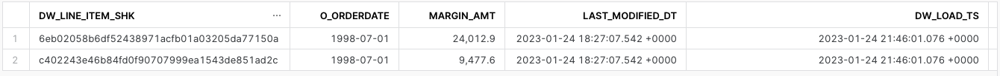

#### PART_DM_LD.SQL
1. In Snowsight, *"create worksheet from SQL file"* and open the worksheet for the 400_dimension/part_dm_ld.sql. 
2. Highlight the following SQL statements in your worksheet and run them to set the context.
``` sql
use role     sysadmin;
use database dev_webinar_pl_db;
use schema   main;
use warehouse dev_webinar_wh;
```
3. Place the cursor on the *"execute immediate"* command and run it.


4. Let's verify that the data was loaded into the PART_DM table. Highlight the following query in your worksheet. If you have run these load scripts multiple times you may see history changes in this table. 
``` sql
select *
from dev_webinar_pl_db.main.part_dm p
where p_partkey in ( 105237594, 128236374);
```
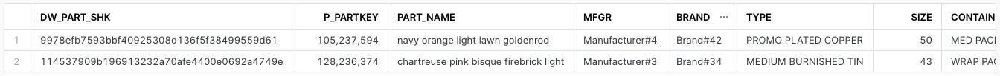


<!-- ------------------------ -->
## BONUS - Type 2 Slowly Changing Dimension
Duration: 4

>aside positive
>Slowly changing dimension type 2 changes add a new row in the dimension with the updated attribute values. This requires generalizing the primary key of the dimension beyond the natural or durable key because there will potentially be multiple rows describing each member. When a new row is created for a dimension member, a new primary surrogate key is assigned and used as a foreign key in all fact tables from the moment of the update until a subsequent change creates a new dimension key and updated dimension row. -  Kimball Group.

In this section we will go through incremental processing of a Type 2, slowly changing dimension.   

### Step 1 - Acquistion
1. Select to *"create worksheet from SQL file"* and load the 100_acquisition/customer_initial_acq.sql.
2. In the first few lines of the script we are setting the context for this script.
3. The *"copy into"* statement is where we are copying (Unloading) the data from the SNOWFLAKE_SAMPLE_DATA into CSV formatted files into an internal table stage.  
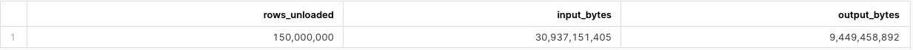

### Step 2 - Raw Layer
1. Select to *"create worksheet from SQL file"* and open the worksheet for the 100_acquisition/customer_acq.sql.
2. Highlight the following SQL commands in your worksheet and run them to set the context.
``` sql
use role     sysadmin;
use database dev_webinar_rl_orders_db;
use schema   tpch;
```


3. Make sure you have selected the *DEV_WEBINAR_WH* warehouse.
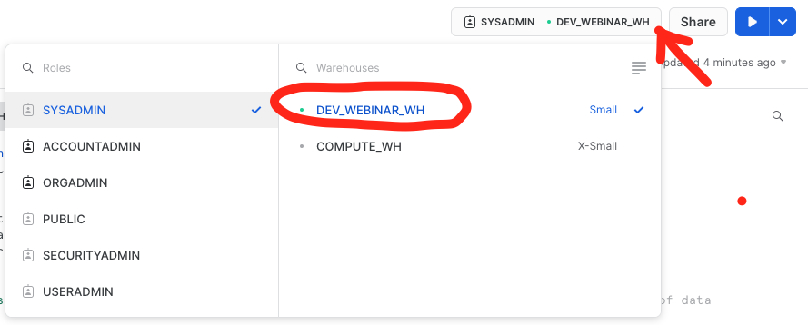
4. 


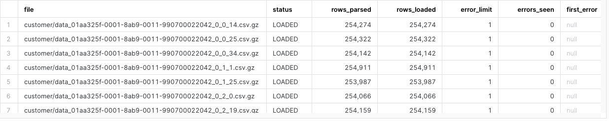

<!-- ------------------------ -->
## Cleanup
Duration: 2

This step is to cleanup and drop all the objects we created as part of this quickstart.

1. Select to *"create worksheet from SQL file"* and open the worksheet for the 000_admin/cleanup.sql.  
``` sql
-- Cleanup all the objects we created

use role sysadmin;

drop database dev_webinar_orders_rl_db;
drop database dev_webinar_il_db;
drop database dev_webinar_pl_db;
drop database dev_webinar_common_db;
```
2. Run all the SQL statements to drop all the objects that were created.


<!-- ------------------------ -->
## Conclusion & Next Steps
Duration: 4

This tutorial was designed as a hands-on introduction to the Data Cloud Deployment Framework (DCDF) data architecture incremental processing and logical partitions.

We encourage you to continue learning about the Data Cloud Deployment Framework, by watching the [Data Cloud Deployment Framework Series Webinars](https://www.snowflake.com/webinar/for-customers/data-cloud-deployment-framework-series/) either on-demand on register for upcoming episodes PLACE LINK TO NEXT WEBINAR HERE.  

Also the github repo contains more scripts than what was covered in this lab.  It's a full, working template model taking source data from the Raw layer, through the Integration layer, and finally to the Presentation layer dimension model, ready for consumption. Please take the time to go through each one of these scripts and slowly work through the examples. Feel free to use these as code templates to be implemented in your own environments and accounts for your data processing.

During this quickstart, our hope is that you noticed the repeatable patterns in these scripts which can facilitate an Agile Development Process.

### What we have covered
- A data pipeline utilizing incremental processing and logical partition definitions
- Introduced the concepts of the Raw, Integration and Presentation layers and how each utilizes incremental processing and logical partition definitions.
- Walked through code examples used for different processing patterns such as truncate/reload, insert overwrite, merge and delete/insert.