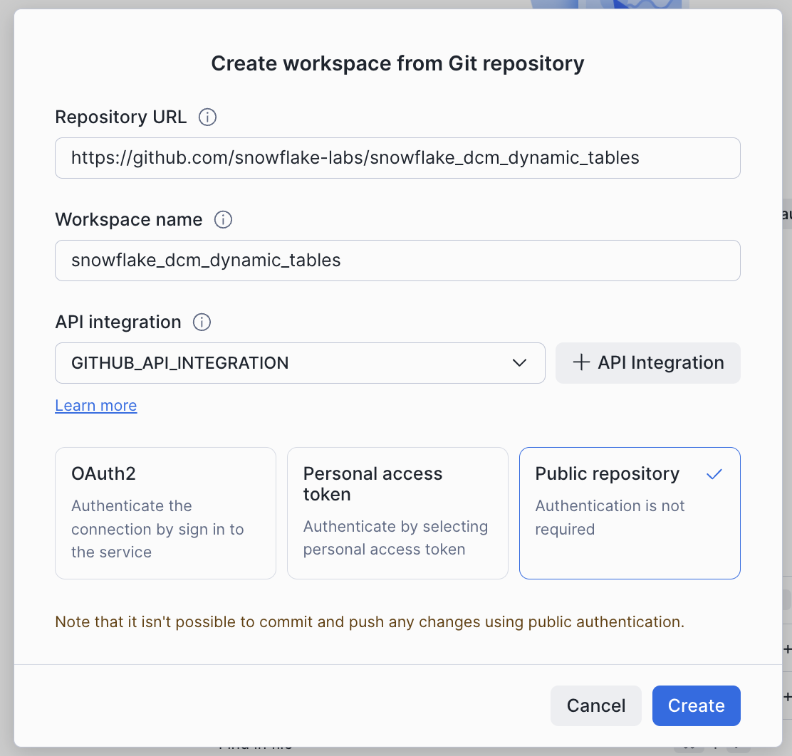
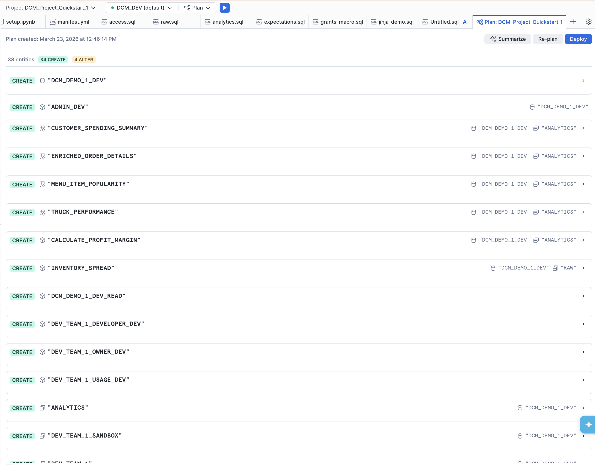
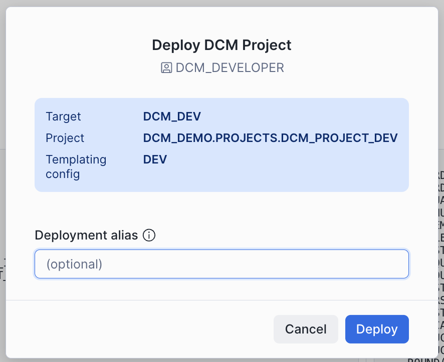
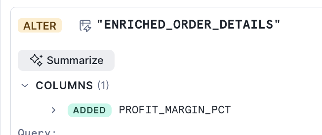

author: Yoav Ostrinsky
id: dcm-projects-for-dynamic-tables
summary: Learn how to use DCM Projects to manage dynamic table pipelines, evolve their schemas, and optimize refreshes with immutability constraints.
categories: snowflake-site:taxonomy/solution-center/certification/quickstart, snowflake-site:taxonomy/product/platform
environments: web
status: Draft
language: en
feedback link: https://github.com/Snowflake-Labs/sfguides/issues
fork repo link: https://github.com/Snowflake-Labs/snowflake_dcm_dynamic_tables

# DCM Projects for Dynamic Tables
<!-- ------------------------ -->
## Overview

Dynamic tables are the backbone of declarative data pipelines in Snowflake — you define the *what*, and Snowflake handles the *when* and *how*. But managing dynamic tables at scale introduces real challenges: How do you version-control their definitions? How do you promote changes across environments? And when you need to evolve a schema, how do you avoid an expensive full recomputation of historical data?

This guide answers all three questions by combining two powerful Snowflake features:

- **DCM Projects** — Define your entire pipeline (databases, schemas, tables, dynamic tables, roles, grants) as code, then plan and deploy changes declaratively.
- **Immutability constraints** — Tell Snowflake which rows in a dynamic table will never change, so that schema evolutions and dimension table updates only reprocess the mutable window.

You'll start by deploying a food truck analytics pipeline using DCM Projects, then evolve a dynamic table's schema by adding a new column — and see firsthand how immutability constraints prevent a full rewrite of historical data.

> **Note:** DCM Projects is currently in Public Preview. See the [DCM Projects documentation](https://docs.snowflake.com/en/user-guide/dcm-projects/dcm-projects-overview) for the latest details.

### Prerequisites
- Basic knowledge of Snowflake concepts (databases, schemas, tables, roles)
- Familiarity with SQL and dynamic tables

### What You'll Learn
- How DCM Projects define Snowflake infrastructure as code
- How to structure a DCM Project with a manifest and definition files
- How to use Jinja templating to parameterize definitions across environments
- How to plan (dry-run) and deploy changes using Snowsight Workspaces or Snowflake CLI
- Why `INITIALIZE = ON_SCHEDULE` matters for CI/CD pipelines
- How immutability constraints work on dynamic tables
- How to evolve a dynamic table's schema without triggering a full recomputation
- How to use `metadata$is_immutable` to verify which rows were reprocessed

### What You'll Need
- A [Snowflake account](https://signup.snowflake.com/?utm_source=snowflake-devrel&utm_medium=developer-guides&utm_cta=developer-guides) with ACCOUNTADMIN access (or a role with sufficient privileges)
- (Optional) [Snowflake CLI](https://docs.snowflake.com/en/developer-guide/snowflake-cli/installation/installation) v3.16.0+ if you prefer CLI over the Snowsight UI

### What You'll Build
- A fully deployed food truck analytics pipeline — databases, schemas, tables, dynamic tables, views, roles, and grants — all defined as code
- An evolved dynamic table with a new column and an immutability constraint, deployed through a DCM plan-deploy cycle with only partial recomputation

<!-- ------------------------ -->
## Create a Workspace from Git

In this step, you'll create a Snowsight Workspace linked to the sample DCM Project repository on GitHub.

1. Navigate to **Projects > Workspaces** in Snowsight.
2. Click **Create** and select **From Git repository**.
3. Enter the repository URL: `https://github.com/snowflake-labs/snowflake_dcm_dynamic_tables`
4. Select an API Integration for GitHub ([create one if needed](https://docs.snowflake.com/en/user-guide/ui-snowsight/workspaces-git#label-create-a-git-workspace)).
5. Select **Public repository**.



Once the workspace is created, you'll see the repository files in the file explorer. Navigate to **Quickstarts/DCM_DynamicTables_Quickstart** to find the project files you'll be working with.

The `scripts/` folder contains numbered SQL files that you'll run at different stages of this guide:

| File | When to Run |
|:-----|:------------|
| `01_pre_deploy.sql` | Before the first DCM Plan & Deploy |
| `02_post_deploy.sql` | After the first successful deployment |
| `03_schema_change.sql` | After the second deployment (with immutability) |
| `04_cleanup.sql` | When you're done and want to tear everything down |

Open `scripts/01_pre_deploy.sql` in a Snowsight worksheet — you'll use it in the next step.

<!-- ------------------------ -->
## Set Up Roles and Permissions

Before deploying the pipeline, you need to create a dedicated role for managing DCM Projects and a DCM Project object.

Open `scripts/01_pre_deploy.sql` in a Snowsight worksheet and run each section in order. The script does the following:

### 1. Create a DCM Developer Role

```sql
USE ROLE ACCOUNTADMIN;

CREATE ROLE IF NOT EXISTS dcm_developer;
SET user_name = (SELECT CURRENT_USER());
GRANT ROLE dcm_developer TO USER IDENTIFIER($user_name);
```

### 2. Grant Infrastructure Privileges

The DCM_DEVELOPER role needs privileges to create infrastructure objects through DCM deployments:

```sql
GRANT CREATE WAREHOUSE ON ACCOUNT TO ROLE dcm_developer;
GRANT CREATE ROLE ON ACCOUNT TO ROLE dcm_developer;
GRANT CREATE DATABASE ON ACCOUNT TO ROLE dcm_developer;
GRANT EXECUTE MANAGED TASK ON ACCOUNT TO ROLE dcm_developer;
GRANT EXECUTE TASK ON ACCOUNT TO ROLE dcm_developer;

GRANT MANAGE GRANTS ON ACCOUNT TO ROLE dcm_developer;
```

### 3. Grant Data Quality Privileges

To define and test data quality expectations, grant the following:

```sql
GRANT APPLICATION ROLE SNOWFLAKE.DATA_QUALITY_MONITORING_VIEWER TO ROLE dcm_developer;
GRANT APPLICATION ROLE SNOWFLAKE.DATA_QUALITY_MONITORING_ADMIN TO ROLE dcm_developer;
GRANT DATABASE ROLE SNOWFLAKE.DATA_METRIC_USER TO ROLE dcm_developer;
GRANT EXECUTE DATA METRIC FUNCTION ON ACCOUNT TO ROLE dcm_developer;
```

### 4. Create a Warehouse (Optional)

If you don't have a warehouse available, create one:

```sql
CREATE WAREHOUSE IF NOT EXISTS dcm_wh
WITH
    WAREHOUSE_SIZE = 'XSMALL'
    AUTO_SUSPEND = 300
    COMMENT = 'For Quickstart Demo of DCM Projects';
```

### 5. Create the DCM Project Object

```sql
USE ROLE dcm_developer;

CREATE DATABASE IF NOT EXISTS dcm_demo;
CREATE SCHEMA IF NOT EXISTS dcm_demo.projects;

CREATE OR REPLACE DCM PROJECT dcm_demo.projects.dcm_project_dev
    COMMENT = 'for testing DCM Projects with Dynamic Tables';
```

The DCM Project object `dcm_project_dev` is now created in `dcm_demo.projects`. This is the object referenced in the manifest's `DCM_DEV` target.

> **Note:** After running this script, refresh your browser so Snowsight picks up the newly created DCM Project object. It won't appear in the Workspaces project selector until you do.

> **CLI Alternative:** You can also create the DCM Project object from the command line using [Snowflake CLI](https://docs.snowflake.com/developer-guide/snowflake-cli/data-pipelines/dcm-projects):
> ```
> snow dcm create --target DCM_DEV
> ```

<!-- ------------------------ -->
## Explore the Project Files

Now that the infrastructure is in place, take a moment to explore the DCM Project structure before deploying. A DCM Project consists of a **manifest file** and one or more **definition files** organized in a `sources/` directory.

### Manifest

Open `manifest.yml` in the file explorer. The manifest is the configuration file for your DCM Project. It defines:

- **Targets** — Named deployment environments (e.g., DEV, STAGE, PROD), each pointing to a specific Snowflake account and DCM Project object
- **Templating configurations** — Variable values that change per environment (e.g., database suffixes, warehouse sizes, team lists)

Here's the manifest for this project:

```yaml
manifest_version: 2
type: DCM_PROJECT

default_target: DCM_DEV

targets:
  DCM_DEV:
    account_identifier: MYORG-MY_DEV_ACCOUNT        # update to your account identifier
    project_name: DCM_DEMO.PROJECTS.DCM_PROJECT_DEV
    project_owner: DCM_DEVELOPER
    templating_config: DEV

  DCM_STAGE:
    account_identifier: MYORG-MY_STAGE_ACCOUNT
    project_name: DCM_DEMO.PROJECTS.DCM_PROJECT_STG
    project_owner: DCM_STAGE_DEPLOYER
    templating_config: STAGE

  DCM_PROD_US:
    account_identifier: MYORG-MY_ACCOUNT_US
    project_name: DCM_DEMO.PROJECTS.DCM_PROJECT_PROD
    project_owner: DCM_PROD_DEPLOYER
    templating_config: PROD

  DCM_PROD_EU:
    account_identifier: MYORG-MY_ACCOUNT_EU
    project_name: DCM_DEMO.PROJECTS.DCM_PROJECT_PROD
    project_owner: DCM_PROD_DEPLOYER
    templating_config: PROD

templating:
  defaults:
    user: "GITHUB_ACTIONS_SERVICE_USER"
    wh_size: "X-SMALL"

  configurations:
    DEV:
      env_suffix: "_DEV"
      user: "INSERT_YOUR_USER"                          # update to your username
      project_owner_role: "DCM_DEVELOPER"
      teams:
        - name: "DEV_TEAM_1"
          data_retention_days: 1
          needs_sandbox_schema: true

    STAGE:
      env_suffix: "_STG"
      project_owner_role: "DCM_STAGE_DEPLOYER"
      teams:
        - name: "STAGE_TEAM_1"
          data_retention_days: 1
          needs_sandbox_schema: true

    PROD:
      env_suffix: ""
      wh_size: "LARGE"
      project_owner_role: "DCM_PROD_DEPLOYER"
      teams:
        - name: "Marketing"
          data_retention_days: 1
          needs_sandbox_schema: true
        - name: "Finance"
          data_retention_days: 30
          needs_sandbox_schema: false
        - name: "HR"
          data_retention_days: 7
          needs_sandbox_schema: false
        - name: "IT"
          data_retention_days: 14
          needs_sandbox_schema: true
        - name: "Sales"
          data_retention_days: 1
          needs_sandbox_schema: false
        - name: "Research"
          data_retention_days: 7
          needs_sandbox_schema: true
```

> **Important:** Before running a Plan, update `account_identifier` (line 11) and `user` (line 44) under the `DCM_DEV` target in `manifest.yml` to match your Snowflake account. The last query in `scripts/01_pre_deploy.sql` (step 6) returns both values — copy them from that output.

Notice how the `DEV` configuration uses `env_suffix: "_DEV"` while `PROD` uses `env_suffix: ""`. This allows the same definition files to create `DCM_DEMO_1_DEV` in development and `DCM_DEMO_1` in production. The `teams` list is also different per environment — DEV has a single team, while PROD has six.

### Definition Files

The `sources/definitions/` directory contains SQL files that define your Snowflake infrastructure. Each file uses `DEFINE` statements and Jinja templating variables (like `{{env_suffix}}`):

| File | What It Defines |
|:-----|:----------------|
| `raw.sql` | Database, schemas, and raw landing tables (TRUCK, MENU, CUSTOMER, etc.) |
| `access.sql` | Warehouse, database roles, account roles, and grants |
| `analytics.sql` | Dynamic tables for transformations and a UDF for profit margin calculation |
| `serve.sql` | Views for dashboards and reporting |
| `ingest.sql` | A stage and a Task for loading data from CSV files |
| `expectations.sql` | Data quality expectations using Data Metric Functions |
| `jinja_demo.sql` | Examples of Jinja loops, conditionals, and macros |

For example, here's how `raw.sql` defines the database and a table:

```sql
DEFINE DATABASE DCM_DEMO_1{{env_suffix}}
    COMMENT = 'This is a Quickstart Demo for DCM Projects';

DEFINE SCHEMA DCM_DEMO_1{{env_suffix}}.RAW;

DEFINE TABLE DCM_DEMO_1{{env_suffix}}.RAW.MENU (
    MENU_ITEM_ID NUMBER,
    MENU_ITEM_NAME VARCHAR,
    ITEM_CATEGORY VARCHAR,
    COST_OF_GOODS_USD NUMBER(10, 2),
    SALE_PRICE_USD NUMBER(10, 2)
)
CHANGE_TRACKING = TRUE;
```

The `{{env_suffix}}` variable is replaced at deployment time based on the target configuration — `_DEV` for development, empty string for production.

And here's how `analytics.sql` defines a dynamic table that joins across several raw tables to create enriched order details:

```sql
DEFINE DYNAMIC TABLE DCM_DEMO_1{{env_suffix}}.ANALYTICS.ENRICHED_ORDER_DETAILS
WAREHOUSE = DCM_DEMO_1_WH{{env_suffix}}
TARGET_LAG = 'DOWNSTREAM'
INITIALIZE = 'ON_SCHEDULE'
DATA_METRIC_SCHEDULE = 'TRIGGER_ON_CHANGES'
AS
SELECT
    oh.ORDER_ID,
    oh.ORDER_TS,
    od.QUANTITY,
    m.MENU_ITEM_NAME,
    m.ITEM_CATEGORY,
    m.SALE_PRICE_USD,
    m.COST_OF_GOODS_USD,
    (od.QUANTITY * m.SALE_PRICE_USD) AS LINE_ITEM_REVENUE,
    (od.QUANTITY * (m.SALE_PRICE_USD - m.COST_OF_GOODS_USD)) AS LINE_ITEM_PROFIT,
    c.CUSTOMER_ID,
    c.FIRST_NAME,
    c.LAST_NAME,
    INITCAP(c.CITY) AS CUSTOMER_CITY,
    t.TRUCK_ID,
    t.TRUCK_BRAND_NAME
FROM DCM_DEMO_1{{env_suffix}}.RAW.ORDER_HEADER oh
JOIN DCM_DEMO_1{{env_suffix}}.RAW.ORDER_DETAIL od ON oh.ORDER_ID = od.ORDER_ID
JOIN DCM_DEMO_1{{env_suffix}}.RAW.MENU m ON od.MENU_ITEM_ID = m.MENU_ITEM_ID
JOIN DCM_DEMO_1{{env_suffix}}.RAW.CUSTOMER c ON oh.CUSTOMER_ID = c.CUSTOMER_ID
JOIN DCM_DEMO_1{{env_suffix}}.RAW.TRUCK t ON oh.TRUCK_ID = t.TRUCK_ID;
```

> **Why `INITIALIZE = ON_SCHEDULE`?** By default, dynamic tables use `INITIALIZE = ON_CREATE`, which triggers a synchronous refresh at creation time — if that refresh fails, the `CREATE` statement fails too. In a CI/CD pipeline (e.g., GitHub Actions running `snow dcm deploy`), this means a deployment can fail because upstream tables are empty or data dependencies aren't yet met. Setting `INITIALIZE = ON_SCHEDULE` defers the first refresh to the background scheduler, so the `CREATE` always succeeds and the dynamic table is populated once its source data is ready. This is the recommended pattern for automated, multi-environment deployments.

### Macros

The `sources/macros/` directory contains reusable Jinja macros. Open `grants_macro.sql` to see a macro that creates a standard set of roles for each team:

```sql


    DEFINE ROLE {{team}}_OWNER{{env_suffix}};
    DEFINE ROLE {{team}}_DEVELOPER{{env_suffix}};
    DEFINE ROLE {{team}}_USAGE{{env_suffix}};

    GRANT USAGE ON DATABASE DCM_DEMO_1{{env_suffix}}
        TO ROLE {{team}}_USAGE{{env_suffix}};
    GRANT OWNERSHIP ON SCHEMA DCM_DEMO_1{{env_suffix}}.{{team}}
        TO ROLE {{team}}_OWNER{{env_suffix}};

    GRANT CREATE DYNAMIC TABLE, CREATE TABLE, CREATE VIEW
        ON SCHEMA DCM_DEMO_1{{env_suffix}}.{{team}}
        TO ROLE {{team}}_DEVELOPER{{env_suffix}};

    GRANT ROLE {{team}}_USAGE{{env_suffix}} TO ROLE {{team}}_DEVELOPER{{env_suffix}};
    GRANT ROLE {{team}}_DEVELOPER{{env_suffix}} TO ROLE {{team}}_OWNER{{env_suffix}};
    GRANT ROLE {{team}}_OWNER{{env_suffix}} TO ROLE {{project_owner_role}};


```

This macro is called in `jinja_demo.sql` inside a `` loop that iterates over the `teams` list from the manifest configuration. For each team, it creates a schema, a set of roles, a products table, and optionally a sandbox schema — all driven by the manifest's templating values.

<!-- ------------------------ -->
## Plan and Deploy the Initial Pipeline

Before deploying changes, always run a **Plan** first. A Plan is a dry-run that shows you exactly what changes DCM will make without actually executing them.

### Select the Project

1. In the DCM control panel above the workspace tabs, select the project **DCM_DynamicTables_Quickstart**.
2. The `DCM_DEV` target should already be selected (it's the default in the manifest).
3. Click on the target profile to verify it uses `DCM_PROJECT_DEV` and the `DEV` templating configuration.
4. Override the templating value for `user` (line 44 in `manifest.yml`) with your own Snowflake username.


> **CLI Alternative:** From the command line, plan with:
> ```
> snow dcm plan --target DCM_DEV -D "user='YOUR_USERNAME'"
> ```

### Execute the Plan

Click the play button to the right of **Plan** and wait for the definitions to render, compile, and dry-run.

Since none of the defined objects exist yet, the plan will show only **CREATE** statements. You should see planned operations for:

- 1 database (`DCM_DEMO_1_DEV`)
- Multiple schemas (`RAW`, `ANALYTICS`, `SERVE`, plus team schemas from the Jinja demo)
- Tables with change tracking enabled
- Dynamic tables with various target lags
- Views and secure views
- A warehouse, roles, and grants
- A stage and a task for data ingestion
- Data quality expectations (Data Metric Functions attached to columns)



### Review the Plan Output

In the file explorer, notice that a new `out` folder was created above `sources`. This contains the **rendered Jinja output** for all definition files.

Open the `jinja_demo.sql` file from the plan output side-by-side with the original `jinja_demo.sql` in `sources/definitions/` to see how the Jinja templating was resolved — loops expanded, conditionals evaluated, and variables replaced with their DEV configuration values.

### Deploy

If the plan result looks correct and all planned changes match your expectations, deploy:

1. Instead of **Plan**, set the operation to **Deploy**.
2. Optionally, add a **Deployment alias** (e.g., "Initial pipeline deployment") — think of it as a commit message that appears in the deployment history of your project.
3. DCM will create all objects and attach grants and expectations using the owner role of the project object.



> **CLI Alternative:** From the command line, deploy with:
> ```
> snow dcm deploy --target DCM_DEV --alias "Initial pipeline deployment"
> ```

Once the deployment completes successfully, refresh the Database Explorer on the left side of Snowsight. You should see the `DCM_DEMO_1_DEV` database and all of the created objects inside it.


<!-- ------------------------ -->
## Insert Sample Data

The deployment created the table structures, but they're empty. Now you'll insert sample data to populate the raw tables and bring the dynamic tables and views to life.

Open `scripts/02_post_deploy.sql` in a Snowsight worksheet and run each section in order.

### 1. Insert Sample Data

The script inserts data into the raw tables: trucks, menu items, customers, inventory, order headers, and order details. Run all the `INSERT` statements.

> **Note:** Orders 1024 and 1025 are inserted with `CURRENT_TIMESTAMP()` instead of a fixed date. This matters later — when you add an immutability constraint, these recent rows will fall within the mutable window and get recomputed with the new column, while older rows stay frozen.

### 2. Refresh Dynamic Tables

Because all dynamic tables use `INITIALIZE = ON_SCHEDULE`, they were created without data. The script triggers the first refresh manually:

```sql
ALTER DYNAMIC TABLE DCM_DEMO_1_DEV.ANALYTICS.ENRICHED_ORDER_DETAILS REFRESH;
ALTER DYNAMIC TABLE DCM_DEMO_1_DEV.ANALYTICS.MENU_ITEM_POPULARITY REFRESH;
ALTER DYNAMIC TABLE DCM_DEMO_1_DEV.ANALYTICS.CUSTOMER_SPENDING_SUMMARY REFRESH;
ALTER DYNAMIC TABLE DCM_DEMO_1_DEV.ANALYTICS.TRUCK_PERFORMANCE REFRESH;
```

> **CLI Alternative:** You can refresh all dynamic tables in the project at once:
> ```
> snow dcm refresh --target DCM_DEV
> ```

### 3. Verify

Run the final query in the script to see the enriched order details:

```sql
SELECT * FROM dcm_demo_1_dev.analytics.enriched_order_details;
```

You should see rows with columns like `order_id`, `order_ts`, `quantity`, `menu_item_name`, `line_item_revenue`, `line_item_profit`, `customer_city`, and `truck_brand_name`. Take note of this schema — in the next step, you'll evolve it.

<!-- ------------------------ -->
## Evolve the Dynamic Table with Immutability

This is where the guide diverges from the basics. You have a running pipeline — but now the analytics team wants a **profit margin percentage** column on `enriched_order_details`. In a traditional setup, adding a column to a dynamic table means recreating it from scratch and recomputing every row. With **immutability constraints**, you can tell Snowflake that historical rows won't change, so only recent data gets reprocessed.

### Understanding Immutability Constraints

The `IMMUTABLE WHERE` clause on a dynamic table declares a condition under which rows are considered frozen. Snowflake skips these rows during incremental refreshes, which means:

- **Schema changes** that use backfill can preserve historical data as-is, while only recomputing the mutable window.
- **Dimension table updates** (e.g., a customer changes city) don't trigger reprocessing of old fact rows that joined against that dimension.
- **`metadata$is_immutable`** — a virtual column on every dynamic table with an immutability constraint — lets you verify which rows are frozen and which were recomputed.

For more details, see the [Snowflake documentation on immutability constraints](https://docs.snowflake.com/en/user-guide/dynamic-tables-performance-optimize-immutability).

### Modify the Definition File

Open `sources/definitions/analytics.sql` in your workspace and update the `enriched_order_details` dynamic table definition. You're making two changes:

1. **Add** a `profit_margin_pct` calculated column.
2. **Add** an `IMMUTABLE WHERE` clause that freezes rows older than 1 day.

Replace the existing `enriched_order_details` definition with:

```sql
DEFINE DYNAMIC TABLE DCM_DEMO_1{{env_suffix}}.ANALYTICS.ENRICHED_ORDER_DETAILS
WAREHOUSE = DCM_DEMO_1_WH{{env_suffix}}
TARGET_LAG = 'DOWNSTREAM'
INITIALIZE = 'ON_SCHEDULE'
DATA_METRIC_SCHEDULE = 'TRIGGER_ON_CHANGES'
IMMUTABLE WHERE (ORDER_TS < CURRENT_TIMESTAMP() - INTERVAL '1 day')
AS
SELECT
    oh.ORDER_ID,
    oh.ORDER_TS,
    od.QUANTITY,
    m.MENU_ITEM_NAME,
    m.ITEM_CATEGORY,
    m.SALE_PRICE_USD,
    m.COST_OF_GOODS_USD,
    (od.QUANTITY * m.SALE_PRICE_USD) AS LINE_ITEM_REVENUE,
    (od.QUANTITY * (m.SALE_PRICE_USD - m.COST_OF_GOODS_USD)) AS LINE_ITEM_PROFIT,
    c.CUSTOMER_ID,
    c.FIRST_NAME,
    c.LAST_NAME,
    INITCAP(c.CITY) AS CUSTOMER_CITY,
    t.TRUCK_ID,
    t.TRUCK_BRAND_NAME,
    ROUND(
        ((m.SALE_PRICE_USD - m.COST_OF_GOODS_USD) / m.SALE_PRICE_USD) * 100, 2
    ) AS PROFIT_MARGIN_PCT
FROM DCM_DEMO_1{{env_suffix}}.RAW.ORDER_HEADER oh
JOIN DCM_DEMO_1{{env_suffix}}.RAW.ORDER_DETAIL od ON oh.ORDER_ID = od.ORDER_ID
JOIN DCM_DEMO_1{{env_suffix}}.RAW.MENU m ON od.MENU_ITEM_ID = m.MENU_ITEM_ID
JOIN DCM_DEMO_1{{env_suffix}}.RAW.CUSTOMER c ON oh.CUSTOMER_ID = c.CUSTOMER_ID
JOIN DCM_DEMO_1{{env_suffix}}.RAW.TRUCK t ON oh.TRUCK_ID = t.TRUCK_ID;
```

> **Note:** The new `PROFIT_MARGIN_PCT` column must be added as the **last column** in the SELECT list. Immutability backfills rows by ordinal position — inserting a column in the middle would shift existing columns and cause a schema mismatch.

Here's what changed and why:

| Change | Purpose |
|:-------|:--------|
| Added `PROFIT_MARGIN_PCT` as the **last column** | New calculated column: `((sale_price - cost) / sale_price) * 100`. Must be appended at the end — inserting mid-schema breaks immutability backfill. |
| Added `IMMUTABLE WHERE (ORDER_TS < CURRENT_TIMESTAMP() - INTERVAL '1 day')` | Orders older than 1 day are frozen — they won't be recomputed on refresh |

The immutability clause is the key. Most of the sample data has order timestamps from October 2023 — well over a day ago — so those rows will be treated as immutable. But orders 1024 and 1025, inserted with `CURRENT_TIMESTAMP()` in the previous step, fall within the 1-day mutable window. When DCM redeploys this dynamic table, Snowflake will:

1. **Backfill** the immutable rows from the old version (preserving them without recomputation — `PROFIT_MARGIN_PCT` will be `NULL`).
2. **Compute** the mutable rows (orders 1024 and 1025) using the new definition — `PROFIT_MARGIN_PCT` will have a calculated value.

This means you'll see both behaviors side-by-side after a single refresh — no need to insert additional data.

<!-- ------------------------ -->
## Redeploy and Verify

Now push your definition change through the DCM plan-deploy cycle.

### Plan the Change

1. In the DCM control panel, click the play button next to **Plan**.
2. This time, the plan output will look different from the initial deployment. Instead of all CREATEs, you'll see an **ALTER** or **REPLACE** operation for `enriched_order_details` — DCM detected that the definition changed and will update only the affected object.



Review the rendered output in the `out` folder to confirm the `IMMUTABLE WHERE` clause and the new `profit_margin_pct` column appear correctly.

### Deploy the Change

1. Instead of **Plan**, set the operation to **Deploy**.
2. Add a deployment alias like "Add profit margin with immutability".
3. DCM will recreate the dynamic table with the new schema and immutability constraint.

### Refresh and Verify

After deployment, open `scripts/03_schema_change.sql` in a Snowsight worksheet and run each section in order.

First, refresh the dynamic table:

```sql
ALTER DYNAMIC TABLE DCM_DEMO_1_DEV.ANALYTICS.ENRICHED_ORDER_DETAILS REFRESH;
```

Then query the table and include the `metadata$is_immutable` virtual column:

```sql
SELECT
    ORDER_ID,
    ORDER_TS,
    MENU_ITEM_NAME,
    LINE_ITEM_REVENUE,
    PROFIT_MARGIN_PCT,
    metadata$is_immutable AS IS_IMMUTABLE
FROM DCM_DEMO_1_DEV.ANALYTICS.ENRICHED_ORDER_DETAILS
ORDER BY ORDER_TS DESC;
```

You should see results like this:

| ORDER_ID | ORDER_TS | MENU_ITEM_NAME | LINE_ITEM_REVENUE | PROFIT_MARGIN_PCT | IS_IMMUTABLE |
|:---------|:---------|:---------------|:-------------------|:------------------|:-------------|
| 1025 | 2026-03-27 ... | Margherita Pizza | 12.00 | 62.50 | FALSE |
| 1024 | 2026-03-27 ... | Beef Birria Tacos | 34.50 | 73.91 | FALSE |
| 1023 | 2023-10-30 11:30:00 | ... | ... | NULL | TRUE |
| 1022 | 2023-10-30 11:00:00 | ... | ... | NULL | TRUE |
| ... | ... | ... | ... | NULL | TRUE |

The two most recent orders (1024 and 1025) have:
- `PROFIT_MARGIN_PCT` with a calculated value — they were recomputed using the new definition
- `IS_IMMUTABLE = FALSE` — they fell within the mutable window

All historical orders (October 2023) have:
- `PROFIT_MARGIN_PCT = NULL` — they were backfilled from the previous version, not recomputed
- `IS_IMMUTABLE = TRUE` — Snowflake skipped them entirely

This is immutability in action: a schema change was deployed, and Snowflake only reprocessed the rows that needed it.

<!-- ------------------------ -->
## Cleanup

When you're done, open `scripts/04_cleanup.sql` in a Snowsight worksheet and run it to tear down all objects:

```sql
USE ROLE dcm_developer;

DROP DATABASE IF EXISTS dcm_demo_1_dev;
DROP WAREHOUSE IF EXISTS dcm_demo_1_wh_dev;

DROP ROLE IF EXISTS dcm_demo_1_dev_read;
DROP ROLE IF EXISTS dev_team_1_owner_dev;
DROP ROLE IF EXISTS dev_team_1_developer_dev;
DROP ROLE IF EXISTS dev_team_1_usage_dev;

USE ROLE ACCOUNTADMIN;
DROP DCM PROJECT IF EXISTS dcm_demo.projects.dcm_project_dev;
DROP SCHEMA IF EXISTS dcm_demo.projects;
DROP DATABASE IF EXISTS dcm_demo;

DROP ROLE IF EXISTS dcm_developer;
DROP WAREHOUSE IF EXISTS dcm_wh;
```

<!-- ------------------------ -->
## Conclusion and Resources

In this guide, you learned how to:

- **Define a complete data pipeline as code** using DCM Projects — databases, schemas, tables, dynamic tables, views, roles, and grants in SQL definition files
- **Deploy and manage** your pipeline through the DCM plan-deploy cycle in Snowsight Workspaces
- **Evolve a dynamic table's schema** by adding a new column to the definition file and redeploying through DCM
- **Use immutability constraints** (`IMMUTABLE WHERE`) to prevent full recomputation of historical data when a dynamic table is recreated
- **Verify partial recomputation** using `metadata$is_immutable` — confirming that historical rows were backfilled without reprocessing, while only new data was computed with the updated definition

The combination of DCM Projects and immutability constraints gives you a production-grade workflow: version-controlled pipeline definitions, environment-aware deployments, and efficient schema evolution that respects the cost of reprocessing large datasets.

### Related Resources
- [DCM Projects Documentation](https://docs.snowflake.com/en/user-guide/dcm-projects/dcm-projects-overview)
- [Managing DCM Projects using Snowflake CLI](https://docs.snowflake.com/developer-guide/snowflake-cli/data-pipelines/dcm-projects)
- [Dynamic Tables — Immutability Constraints](https://docs.snowflake.com/en/user-guide/dynamic-tables-performance-optimize-immutability)
- [Understanding Immutability Constraints (Concepts)](https://docs.snowflake.com/en/user-guide/dynamic-tables-immutability-constraints)
- [Sample DCM Projects Repository](https://github.com/Snowflake-Labs/snowflake_dcm_dynamic_tables)
