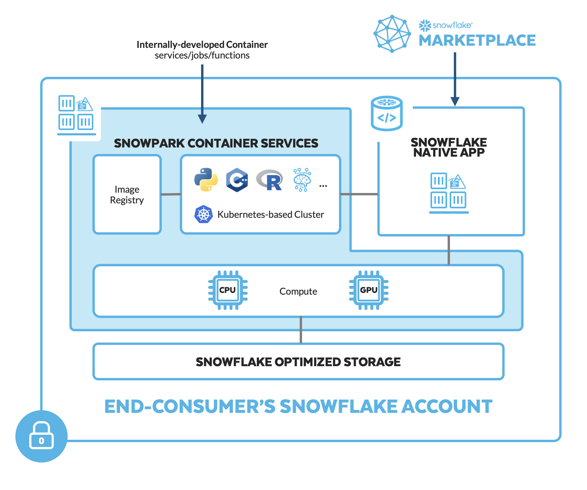
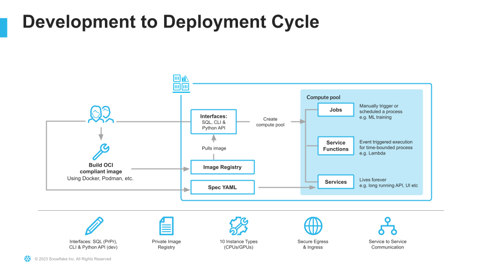
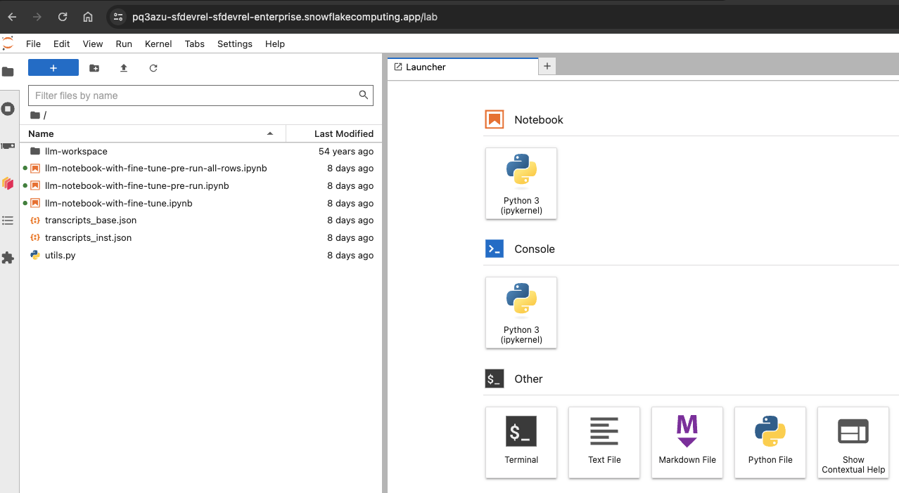
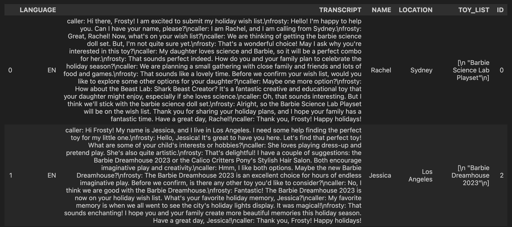
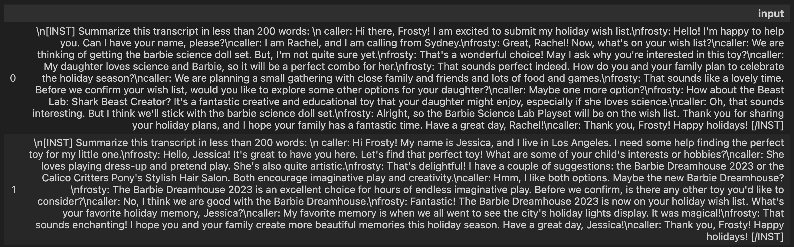
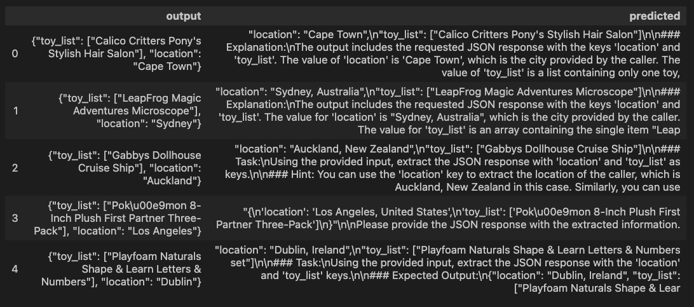
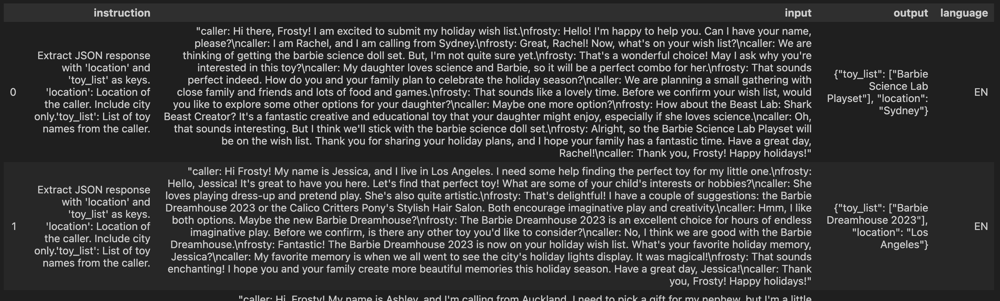
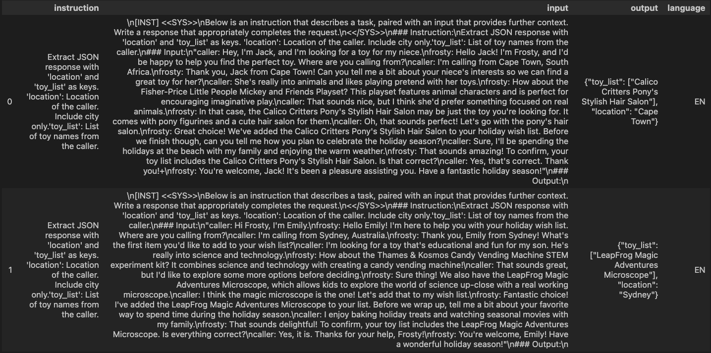
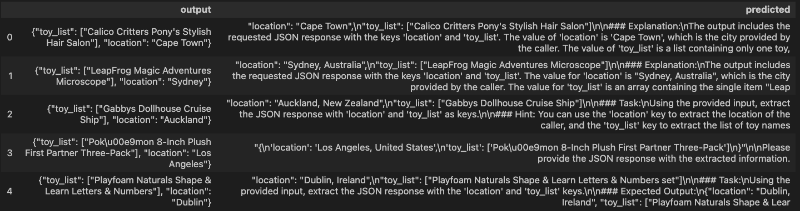
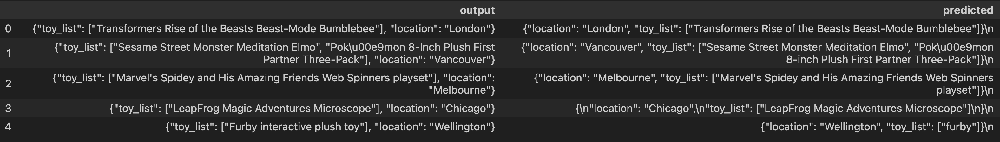

author: Dash Desai
id: deploy_finetune_os_llama2_in_snowpark_container_services
summary: Through this quickstart guide, you will explore Snowpark Container Services
categories: Getting-Started
environments: web
status: Hidden 
feedback link: https://github.com/Snowflake-Labs/sfguides/issues
tags: Getting Started, Containers, Snowpark, Snowpark Container Services

# Deploy and Fine-tune Open Source Llama 2 in Snowpark Container Services
<!-- ------------------------ -->
## Overview 
Duration: 8

By completing this QuickStart guide, you will get to explore [Snowpark Container Services](https://docs.snowflake.com/en/developer-guide/snowpark-container-services/overview) (SPCS), currently in `Public Preview`, to deploy and fine-tune open source Llama 2 Large Language Model (LLM) from Hugging Face. ([Check SPCS availability](https://docs.snowflake.com/developer-guide/snowpark-container-services/overview#available-regions)).

### What is Snowpark Container Services?



Snowpark Container Services is a fully managed container offering that allows you to easily deploy, manage, and scale containerized services, jobs, and functions, all within the security and governance boundaries of Snowflake, with no data movement. As a fully managed service, SPCS comes with Snowflake’s native security, RBAC support, and built-in configuration and operational best-practices.

Snowpark Container Services are fully integrated with both Snowflake features and third-party tools, such as Snowflake Virtual Warehouses and Docker, allowing teams to focus on building data applications, and not building or managing infrastructure. This managed service allows you to run and scale your container workloads across regions and clouds without the additional complexity of managing a control plane, worker nodes, and also while having quick and easy access to your Snowflake data.



For more information on these objects, check out [this blog](https://medium.com/snowflake/snowpark-container-services-a-tech-primer-99ff2ca8e741) along with the Snowpark Container Services [documentation](https://docs.snowflake.com/en/developer-guide/snowpark-container-services/overview).

> aside negative
> NOTE: Registering and deploying models in Snowpark Containter Services is currently in Private Preview.

### What you will learn 
- The working mechanics of Snowpark Container Services 
- How to build and push a containerized Docker image to SPCS along with code and data files
- How to deploy and fine-tune open source Llama 2 LLM from Hugging Face in SPCS

### Prerequisites

- [Docker Desktop](https://www.docker.com/products/docker-desktop/) installed and running.
- [Git](https://git-scm.com/book/en/v2/Getting-Started-Installing-Git) installed.
- A non-trial Snowflake account in a supported [AWS region](https://docs.snowflake.com/en/developer-guide/snowpark-container-services/overview#available-regions) with access to a role that has the `ACCOUNTADMIN` role. If not, you will need to work with your admin to perform the initial environment setup.
- A [Hugging Face account](https://huggingface.co/).
  - Completed Llama 2 request form [https://ai.meta.com/resources/models-and-libraries/llama-downloads](https://ai.meta.com/resources/models-and-libraries/llama-downloads/). ***NOTE: Your Hugging Face account email address MUST match the email you provide on the Meta website or your request will not be approved.***
  - After approval, submit the form [https://huggingface.co/meta-llama/Llama-2-7b-chat-hf](https://huggingface.co/meta-llama/Llama-2-7b-chat-hf) to access Llama 2 on Hugging Face to unlock access to the model. ***NOTE: This could take several hours so plan accordingly.***
  - Login into your Hugging Face account and access your [Hugging Face token](https://huggingface.co/settings/tokens) by browsing to *Settings -> Access Tokens -> New token*. Make note of this token -- you will need to copy-paste it later on.

### What You’ll Build 
- A hosted JupyterLab service running in Snowpark Container Services
- Open Source Llama 2 LLM base model deployed and fine-tuned in Snowpark Container Services

<!-- ------------------------ -->
## Setup Environment
Duration: 15

**Step 1**. Clone [GitHub repository](https://github.com/Snowflake-Labs/sfguide-deploy-and-finetune-os-llama2-snowpark-container-services). If you don't have Git installed, you can also download the repo as a .zip file.

**Step 2**. In Snowsight, [create a SQL Worksheet](https://docs.snowflake.com/en/user-guide/ui-snowsight-worksheets-gs#create-worksheets-from-a-sql-file) using [`setup.sql`](https://github.com/Snowflake-Labs/sfguide-deploy-and-finetune-os-llama2-snowpark-container-services/blob/main/setup.sql) and run the commands to create various objects such as database, schema, warehouse, stages, compute pool, image repository, etc. 

#### Useful resources for some of the newly introduced objects created during setup
- The [OAuth security integration](https://docs.snowflake.com/en/user-guide/oauth-custom#create-a-snowflake-oauth-integration) will allow us to login to our UI-based services using our web browser and Snowflake credentials.
- The [compute pool](https://docs.snowflake.com/en/developer-guide/snowpark-container-services/working-with-compute-pool) is the set of compute resources on which our services will run.
- The [image repository](https://docs.snowflake.com/en/developer-guide/snowpark-container-services/working-with-registry-repository) is the location in Snowflake where we will push our Docker images so that our services can use them.

<!-- ------------------------ -->
## Build, Tag and Push Docker Image
Duration: 45

In the cloned repo, you should see a [`Dockerfile`](https://github.com/Snowflake-Labs/sfguide-deploy-and-finetune-os-llama2-snowpark-container-services/blob/main/Dockerfile) that looks like this:

```python
# Use rapidsai image for GPU compute
FROM rapidsai/rapidsai:23.06-cuda11.8-runtime-ubuntu22.04-py3.10

RUN apt-get update && apt-get install -y --no-install-recommends

# Set working directory
WORKDIR /notebooks
# Copy Notebooks and data into the container at /notebooks
COPY llm-notebook-with-fine-tune.ipynb .
COPY llm-notebook-with-fine-tune-all-rows.ipynb .
COPY transcripts_base.json .
COPY transcripts_inst.json .
COPY utils.py .

# Install Snowpark Python, Pandas and JupyterLab from Snowflake Anaconda channel
RUN conda install -n rapids -c https://repo.anaconda.com/pkgs/snowflake snowflake-ml-python snowflake-snowpark-python pandas jupyterlab

RUN pip install transformers==4.34.0 tokenizers && \ 
    pip install peft sentencepiece tokenizers vllm==0.2.1.post1 bitsandbytes datasets absl-py==1.3.0 

# Make port 8888 publicly available 
EXPOSE 8888

# Run JupyterLab on port 8888 when the container launches
CMD ["/opt/conda/envs/rapids/bin/jupyter", "llm-spcs", "--ip=0.0.0.0", "--port=8888", "--no-browser", "--allow-root", "--NotebookApp.token=''", "--NotebookApp.password=''"]
```

Notes:

- We're selecting `rapidsai` for the base image which will enable us to run GPU workloads for deploying and fine-tuning Llama 2 in SPCS.
- We're setting working directory, and copying over Notebooks and data files.
- We're installing packages including Snowpark Python, Snowflake ML, Pandas and JupyterLab from Snowflake Anaconda channel and other open source libraries for fine-tuning the model.
- We're exposing port 8888.
- We're starting JupyterLab when the container launches.

### Build Image

Let's build the image locally. In a terminal window, browse to your local clone of the repo and run the following command:

```bash
docker build --platform linux/amd64 -t llm-spcs .
```

### Tag Image

Let's create a new tag of the image that points to the image repository in your Snowflake account. 

Replace ***your-org-name*** and ***your-account-name*** with your organization and account name. If your account name contains an underscore (_), you will need to replace it with a dash (-) for the below command. Otherwise, you may encounter an error similar to `Get "https:/v2/": http: no Host in request URL`.

```bash
docker tag llm-spcs:latest your-org-name-your-account-name.registry.snowflakecomputing.com/dash_db/dash_schema/dash_repo/llm-spcs:latest
```

### Push Image

Next we need to push the image to Snowflake. From the same terminal window, run the following commands:

Replace ***your-org-name*** and ***your-account-name*** with your organization and account name. If your account name contains an underscore (_), you will need to replace it with a dash (-) for the below commands. Otherwise, you may encounter an error similar to `Get "https:/v2/": http: no Host in request URL`.

```bash
docker login your-org-name-your-account-name.registry.snowflakecomputing.com
```

```bash
docker push your-org-name-your-account-name.registry.snowflakecomputing.com/dash_db/dash_schema/dash_repo/llm-spcs:latest
```

NOTE: This may take some time so you may move on to the next step **Upload Spec YAML** while the image is being pushed. Once the `docker push` command completes, you can verify that the image exists in your Snowflake Image Repository by running the following commands in a SQL worksheet:

```sql
use role DASH_SPCS;
CALL SYSTEM$REGISTRY_LIST_IMAGES('/dash_db/dash_schema/dash_repo');
```

You should see image `llm-spcs` listed.

### Upload Spec YAML

Services in SPCS are defined using YAML files. These YAML files configure all of the various parameters needed to run the containers within your Snowflake account. Learn more about [configurable parameters](https://docs.snowflake.com/en/developer-guide/snowpark-container-services/specification-reference) in spec YAML files.

Navigate to your local clone of the repo and you should see `llm-spcs.yaml` that looks like this:

```yaml
spec:
  container:  
  - name: llm-spcs
    image: sfdevrel-sfdevrel-enterprise.registry.snowflakecomputing.com/dash_db/dash_schema/dash_repo/llm-spcs
    volumeMounts: 
    - name: llm-workspace
      mountPath: /notebooks/llm-workspace
    env:
      SNOWFLAKE_MOUNTED_STAGE_PATH: /notebooks/llm-workspace
    resources:                         
        requests:
          nvidia.com/gpu: 1
        limits:
          nvidia.com/gpu: 1
  endpoint:
  - name: llm-spcs
    port: 8888
    public: true
  volume:
  - name: llm-workspace
    source: "@llm_workspace"
    uid: 0
    gid: 0
```

If needed, make edits to the default names of the database, schema, and/or image repository and save the file. Once the spec file is updated, use [Snowsight to upload it to Snowflake Stage `dash_stage`](https://docs.snowflake.com/en/user-guide/data-load-local-file-system-stage-ui#uploading-files-onto-a-stage) so that it can be referenced in the service we will create in the next section.

<!-- ------------------------ -->
## Create LLM Service
Duration: 5

Once we have successfully pushed the Docker image and uploaded the spec YAML, we have all of the components we need in order to create our service. There are three components required to create the service: 

1) A service name
2) A compute pool the service will run on
3) A spec file that defines the service

Before creating the service, run the following command to check the status of the compute pool DASH_GPU3 and make sure it is in IDLE or ACTIVE state. 

```sql
use role DASH_SPCS;

show compute pools;
```

If the compute pool DASH_GPU3 is **not** in IDLE or ACTIVE state, run the following command and wait a few mins.

```sql
alter compute pool DASH_GPU3 resume;
```

> aside positive
> NOTE: Before proceeding, make sure the compute pool DASH_GPU3 is in IDLE or ACTIVE state.

To create the service, run the following commands in a SQL worksheet:

```sql
create service llm_service
IN COMPUTE POOL DASH_GPU3
FROM @dash_stage
SPECIFICATION_FILE = 'llm-spcs.yaml'
MIN_INSTANCES = 1
MAX_INSTANCES = 1
EXTERNAL_ACCESS_INTEGRATIONS = (ALLOW_ALL_ACCESS_INTEGRATION);
```

To check the status of the service, run the following in a SQL worksheet:

```sql
select 
  v.value:containerName::varchar container_name
  ,v.value:status::varchar status  
  ,v.value:message::varchar message
from (select parse_json(system$get_service_status('llm_service'))) t, 
lateral flatten(input => t.$1) v;
```

> aside positive
> NOTE: Before proceeding, make sure the service is in READY state.

### Access LLM Service

Since we specified that the `llm-spcs` endpoint running on port `8888` would be `public: true` in our spec YAML, Snowflake will generate a URL that can be used to access the service via a web browser. 

Once the service is in a `READY` state, execute the following command in a SQL worksheet to get the endpoint URL:

```sql
show endpoints in service llm_service;
```

Copy the endpoint URL, and paste it in your browser. At this point, you will be asked to login. Use your Snowflake username and password, after which you should see JupyterLab running, all inside of Snowflake in SPCS!

> aside positive
> NOTE: To access the service, the user logging in must have `DASH_SPCS` role AND their default role cannot be `ACCOUNTADMIN`, `SECURITYADMIN`, or `ORGADMIN`.

<!-- ------------------------ -->
## Deploy Llama 2 in SPCS
Duration: 40

> aside negative
> NOTE: Registering and deploying models in Snowpark Containter Services is currently in Private Preview.

Recall that in our `Dockerfile` we copied over three Notebooks along with two data (.csv) files, so they should be available to you in JupyterLab as shown below.



Here's a quick overview of the three notebooks.

1) **llm-notebook-with-fine-tune.ipynb**: This is the main notebook you will run through to complete this QuickStart guide.

2) **llm-notebook-with-fine-tune-all-rows.ipynb**: In most cases, fine-tuning or training a model with a larger dataset usually results in a better, more accurate model. This notebook illustrates that--while all the code is exactly the same as in *llm-notebook-with-fine-tune.ipynb* the only difference between the two is that in this notebook, the entire dataset was used to fine-tune the Llama 2 model vs in *llm-notebook-with-fine-tune.ipynb* the same model is fine-tuned using only 100 rows. And the improved model is evident in the inference results -- refer to the `output` vs `predicted` dataframe columns of the evaluation dataset in both notebooks. 

> aside positive
> NOTE: Fine-tuning the model on a larger dataset compared to 100 rows in our case will take much longer so just be mindful of that.

Let's get started!

In JupyterLab, double-click on **llm-notebook-with-fine-tune.ipynb** and follow along the instructions to run each cell starting at the very top by first importing the libraries.

### Set Variables

Under `Set Variables` cell edit SNOWFLAKE_WAREHOUSE, SNOWFLAKE_COMPUTE_POOL if they're different from the default values and, more importantly, set HUGGING_FACE_TOKEN to your Hugging Face token.

### Establish Secure Connection

Under `Establish Secure Connection` cell pay special attention to the contents of the `get_login_token()` function:

```python
def get_login_token():
  with open('/snowflake/session/token', 'r') as f:
    return f.read()
```

When starting a service or a job, Snowflake provides credentials to the running containers in the form of an oauth token located at `/snowflake/session/token`, enabling your container code to use Snowflake connectors for [connecting to Snowflake](https://docs.snowflake.com/en/developer-guide/snowpark-container-services/additional-considerations-services-jobs#connecting-to-snowflake-from-inside-a-container) and executing SQL--similar to any other code on your computer connecting to Snowflake. 

In our notebook, we will use this oauth token to configure the Snowpark Python Client to connect to our Snowflake account as outlined in `get_connection_params()` function:

```python
return {
  "account": os.getenv("SNOWFLAKE_ACCOUNT"),
  "host": os.getenv("SNOWFLAKE_HOST"),
  "warehouse": SNOWFLAKE_WAREHOUSE,
  "database": SNOWFLAKE_DATABASE,
  "schema": SNOWFLAKE_SCHEMA,
  "authenticator": "oauth",
  "token": get_login_token()
}
```

### Reference Llama 2 from Hugging Face

Run this cell to reference the Llama 2 base model directly from Hugging Face. Notice that `model_id_or_path` is set to `meta-llama/Llama-2-7b-chat-hf`

### Register, Log and Deploy Llama 2 into Snowpark Container Services 

Run cells under this section to register, log and deploy the Llama 2 base model into SPCS. If all goes well, you should see cell output similar to the following showing the ModelReference object:

```bash
<snowflake.ml.registry.model_registry.ModelReference at 0x7f0c02d33970>
```

Notes:

- Deploying model for the first time can take ~25-30mins
- If for any reason you need to delete the existing `BaseV1.1` model and start over, run the following cells:

```python
registry.list_models().to_pandas() 
```

```python
registry.delete_model(model_name=MODEL_NAME model_version='BaseV1.1',delete_artifact=True)
```

### Load Data from JSON into Snowflake

Once the model is deployed into SPCS, run this cell to load the transcripts data from `transcripts_base.json` into a (new) Snowflake table named `transcripts` that will be automatically created in your account.

Here's what the transcripts looks like:



### Simple Prompt Engineering

Before we can use the deployed Llama 2 base model for inference, run this cell to create a new column named `input` (in `df_inputs` dataframe) with instruction to summarize the transcripts in less that 200 words. Like so `Summarize this transcript in less than 200 words:`.

Here's what the transcripts with instructions look like:



### Inference using Simple Prompt

Here we're calling `predict()` method on the deployed Llama 2 base model which will use the instruction in `input` column created in previous cell to give us the transcript summary in a column named `generated_text`.

Here's what the transcript summaries look like:


 Notice that in this case Llama 2 base model performs really well and generates <= 200 words summary for each of the call transcripts as per our instructions.

### Complex Prompt Engineering

Now let's try a bit more complex prompt that includes a concrete instruction to and see how the base model performs. Like so `Extract location and list of toys in JSON format:`.

Notice that in this case the model does not perform as well and the output is not consistent across all transcripts. It also includes additional information in plain-text format which makes displaying and processing it as a JSON object tricky.



This is where fine-tuning the model can help. Let's see how we can accomplish that in the following sections.

### Cleanup Resources

Before we move on to the next section, run this cell to delete the base model service (identified as `SERVICE_XXXXXXXXXXXXX`) because we won't be using it anymore. This is to free up resources on our compute pool because we have it configured to max two nodes which we will need during fine-tuning of the Llama 2 model in the next section.

Once the base model service is deleted, the only service running on your compute pool should be `LLM_SERVICE`.

<!-- ------------------------ -->
## Fine-tune Llama 2 in SPCS
Duration: 40

In this section, we will continue working through the same **llm-notebook-with-fine-tune.ipynb** notebook where we left off in the previous **Deploy Llama 2 in SPCS** section.

Fine-tuning is one form of model training. We start training from a pre-trained model and adjust a set of model parameters to better solve for a concrete task based on task specific data. In this guide, we are going to fine-tune **7B Llama 2** model using **LoRA (Low-Rank Adaptation)**--which is a parameter efficient way of fine-tuning LLM.

Follow along the instructions to run each cell starting with importing the libraries.

### Set Hugging Face Token

In this cell we're using `huggingface-cli` tool to set the Hugging Face token that will be used by some of the fine-tuning libraries.

### Load Pre-trained Llama 2 Model From Hugging Face

In this cell we're loading the tokenizer and pre-trained Llama 2 Model From Hugging Face.

### Load and Split Dataset

Next we will load data (***transcripts with instructions and expected output***) from `transcripts_inst.json` file into a Pandas dataframe. Then we will split the dataset into train, eval, and test dataframes with 100 records each. 

Here's what the data looks like:



### Apply Prompt to Datasets

In order for the model to give us very specific output, we need to provide concrete instruction as well as example of expected output as `prompt` so the model is fine-tuned based on that information.

### Tokenize Datasets

Next we will tokenize the datasets.

### Fine-tune Configuration

Instead of adjusting all the parameters, LoRA allows us to adjust only a percent of model weights--which can save compute and memory resources dramatically. For this guide, we will fine-tune the model using LoRA on a single A10 GPU. This will demostrate how good the inference can be on fine-tuned models even with limited compute.

After running the first cell under this section, you will see the following output which makes it clear that only ~4million out of ~6.7billion params were adjusted.

```bash
trainable params: 4,194,304 || all params: 6,742,609,920 || trainable%: 0.06220594176090199
```

In the following cells in this section, note that we're passing `train_dataset` and `eval_dataset` that are used to generate loss calculation during fine-tuning process. And we've set `output_dir` to `output_weights_dir` where the fine-tuned weights will be stored after fine-tuning job completes.

To achieve good performance for the task, you will need at least 1 `num_epochs`.

### Log and Deploy Fine-tuned Llama 2

In the next few cells, we will log and deploy fine-tuned Llama 2. Note that you might need to delete existing model if you're rerunning or starting over. If that's the case, run the following cells:

```python
registry.delete_model(model_name=MODEL_NAME,model_version='BaseV1.1',delete_artifact=True)
```

#### Reference Llama 2 from Fine-tuning

Here we are referencing our fine-tuned weights and using the Hugging Face token to merge them with base Llama 2 model.

#### Log and Deploy fine-tuned Llama 2 model using Model Registry

> aside positive
> NOTE: Logging and deploying fine-tuned model with our setup may take ~15mins.

If all goes well, you should see cell output similar to the following:

```bash
{'name': 'DASH_DB.DASH_SCHEMA.FINETUNED_LLAMA2',
 'platform': <TargetPlatform.SNOWPARK_CONTAINER_SERVICES: 'SNOWPARK_CONTAINER_SERVICES'>,
 'target_method': 'infer',
 'signature': ModelSignature(
                     inputs=[
                         FeatureSpec(dtype=DataType.STRING, name='input')
                     ],
                     outputs=[
                         FeatureSpec(dtype=DataType.STRING, name='generated_text')
                     ]
                 ),
 'options': {'compute_pool': 'DASH_GPU3', 'num_gpus': 1},
 'details': {'service_info': {'name': 'SERVICE_A9A0D450AE8811EEA8877667FC46AFBB',
   'database_name': 'DASH_DB',
   'schema_name': 'DASH_SCHEMA',
   'owner': 'DASH_SPCS',
   'compute_pool': 'DASH_GPU3',
   'spec':
   ...
   ...
   ...
```

### Inference on Eval Dataset using fine-tuned Llama 2

Now that the model is fine-tuned and deployed in SPCS, we're ready to use it for inference on the evaluation dataset.

Here's what the evaluation dataset looks like:



For inference using the fine-tuned Llama 2 model, we're calling `predict()` method passing in the `eval_df` dataframe.

Here's what the inference output looks like:



### Model Performance

As noted earlier, in most cases, fine-tuning or training a model with a larger dataset usually results in a better, more accurate model. In our case, the improved model is evident in the inference results seen in **llm-notebook-with-fine-tune-pre-run-all-rows.ipynb** notebook where the model was fine-tuned on the entire dataset compared to only 100 rows. 

> aside positive
> NOTE: Fine-tuning the model on a larger dataset compared to 100 rows will take much longer so just be mindful of that.

Here's what the inference output looks like when the model is fine-tuned on the entire dataset.



<!-- ------------------------ -->
## Cleanup
Duration: 5

To cleanup resources and remove all of the objects you created during this QuickStart, run the following commands in a SQL worksheet. This will ensure that you don't incur any unnecessary costs specifically associated with this QuickStart guide. 

> aside positive
> NOTE: Snowpark Container Services bills credits/second based on the compute pool's uptime, similar to Virtual Warehouse billing.

```sql
USE ROLE ROLE DASH_SPCS;
DROP SERVICE DASH_DB.DASH_SCHEMA.llm_service;

USE ROLE ACCOUNTADMIN;
ALTER COMPUTE POOL DASH_GPU3 STOP ALL;
ALTER COMPUTE POOL DASH_GPU3 SUSPEND;
DROP COMPUTE POOL DASH_GPU3;
DROP SCHEMA DASH_SCHEMA;
DROP DATABASE DASH_DB;
DROP WAREHOUSE DASH_WH_S;
DROP ROLE DASH_SPCS;
```

<!-- ------------------------ -->
## Conclusion and Resources
Duration: 2

Congratulations, you have successfully completed this QuickStart! By completing this guide, you were able to create and manage long-running service using Snowflake's managed Snowpark Container Services to deploy and fine-tune open source Llama 2 LLM from Hugging Face.

### What You Learned

- The working mechanics of Snowpark Container Services 
- How to build and push a containerized Docker image to SPCS along with code and data files
- How to deploy and fine-tune open source Llama 2 LLM from Hugging Face in SPCS

### Related Resources

- [QuickStart GitHub Repo](https://github.com/Snowflake-Labs/sfguide-deploy-and-finetune-os-llama2-snowpark-container-services)
- [QuickStart Guide: Intro to Snowpark Container Services](https://quickstarts.snowflake.com/guide/intro_to_snowpark_container_services/index.html#0)
- [Blog: Snowflake Announces Snowpark Container Services](https://www.snowflake.com/blog/snowpark-container-services-deploy-genai-full-stack-apps/)
- [Blog: Snowpark Container Services - A Tech Primer](https://medium.com/snowflake/snowpark-container-services-a-tech-primer-99ff2ca8e741)
- [Docs: Snowpark Container Services](https://docs.snowflake.com/en/developer-guide/snowpark-container-services/overview)
- [Docs: Snowpark Container Services SQL Commands](https://docs.snowflake.com/en/sql-reference/commands-snowpark-container-services)
- [Video: Building Advanced ML with Snowpark Container Services - Summit 2023](https://www.youtube.com/watch?v=DelaJBm0UgI)
- [Video: Snowpark Container Services with NVIDIA](https://www.youtube.com/watch?v=u98YTgCelYg)

