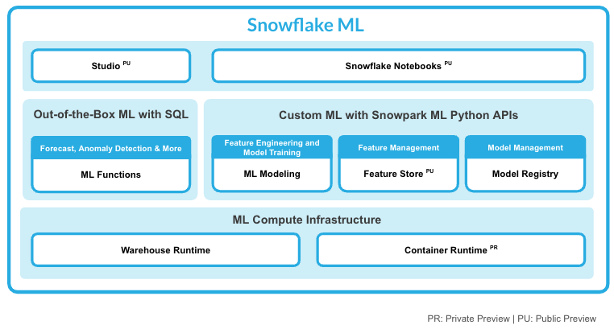

author: Mats Stellwall
id: deploying-custom-models-to-snowflake-model-registry
categories: snowflake-site:taxonomy/solution-center/certification/quickstart, snowflake-site:taxonomy/product/ai, snowflake-site:taxonomy/snowflake-feature/model-development, snowflake-site:taxonomy/snowflake-feature/ml-functions
language: en
summary: Deploy custom ML models to Snowflake Model Registry for versioning, governance, metadata tracking, and production inference.
environments: web
status: Published 
feedback link: https://github.com/Snowflake-Labs/sfguides/issues
fork repo link: https://github.com/Snowflake-Labs/sfguide-getting-started-with-iceberg-tables-tasty-bytes


# Deploying Custom Models To Snowflake Model Registry
<!-- ------------------------ -->
## Overview 

Through this quickstart guide, you will learn how to add a custom model to the Snowflake Model Registry. You will set up your Snowflake and Python environments, train a model using the PyCaret library, deploy that model to the Model Registry and run the inference within your Snowflake environment.

### What Is Snowpark?

Snowpark is the set of libraries and runtimes that securely enable developers to deploy and process Python code in Snowflake.

**Client Side Libraries** - Snowpark libraries can be installed and downloaded from any client-side notebook or IDE and are used for code development and deployment. Libraries include the Snowpark API for data pipelines and apps and the Snowpark ML API for end to end machine learning.

**Elastic Compute Runtimes** - Snowpark provides elastic compute runtimes for secure execution of your code in Snowflake. Runtimes include Python, Java, and Scala in virtual warehouses with CPU compute or Snowpark Container Services (public preview) to execute any language of choice with CPU or GPU compute.

Learn more about [Snowpark](http://www.snowflake.com/snowpark).

### What Is Snowpark ML?

[Snowflake ML](https://docs.snowflake.com/en/developer-guide/snowpark-ml/overview) is the integrated set of capabilities for end-to-end machine learning in a single platform on top of your governed data. Snowflake ML can be used for fully custom and out-of-the-box workflows. For ready-to-use ML, analysts can use [ML Functions](https://docs.snowflake.com/en/guides-overview-ml-functions) to shorten development time or democratize ML across your organization with SQL from Studio, our no-code user interface. For custom ML, data scientists and ML engineers can easily and securely develop and productionize scalable features and models without any data movement, silos or governance tradeoffs.



This qucikstart will focus on the Snowflake Model Registry, which provides scalable and secure model management of ML models in Snowflake, regardless of origin.

### What Is Snowflake Model Registry?  

The [Snowflake Model Registry](https://docs.snowflake.com/en/developer-guide/snowpark-ml/snowpark-ml-mlops-model-registry) allows customers to securely manage models and their metadata in Snowflake, regardless of origin. The model registry stores machine learning models as first-class schema-level objects in Snowflake so they can easily be found and used by others in your organization. You can create registries, and store models in them, using classes in the Snowpark ML library. Models can have multiple versions, and you can designate a version as the default.

The Snowflake Model Registry has built-in types support for the most common model types, including scikit-learn, xgboost, LightGBM, PyTorch, TensorFlow, Hugging Face pipelines, and MLFlow pyfunc models. Other types of models via the snowflake.ml.model.CustomModel class

This quickstart will focus on
*  how to create models using the snowflake.ml.model.CustomModel class, log them to the Snowflake Model Registry, and use them. 

### What You’ll Learn 
* how to train a PyCaret model
* how to create a CustomModel class for a PyCaret model 
* how to log a CustoModel to Snowflake Model Registry
* how to run inference in Snowflake using a custom model.

### Prerequisites
- [Git](https://git-scm.com/book/en/v2/Getting-Started-Installing-Git) installed
    >
    >Download the [git repo](https://github.com/Snowflake-Labs/sfguide-deploying-custom-models-snowflake-model-registry)
- [Anaconda](https://www.anaconda.com/) installed
- [Python 3.10](https://www.python.org/downloads/) installed
    - Note that you will be creating a Python environment with 3.10 in the **Setup the Python Environment** step
- A Snowflake account with [Anaconda Packages enabled by ORGADMIN](https://docs.snowflake.com/en/developer-guide/udf/python/udf-python-packages.html#using-third-party-packages-from-anaconda). If you do not have a Snowflake account, you can register for a [free trial account](https://signup.snowflake.com/?utm_source=snowflake-devrel&utm_medium=developer-guides&utm_cta=developer-guides).
- A Snowflake account login with a role that has the ability to create database, schema, tables, stages, user-defined functions, and stored procedures. If not, you will need to register for a free trial or use a different role.

### What You’ll Build 
A set on notebooks that trains a PyCaret model, creates a CustomModel for it and log and use it in Snowflake.

<!-- ------------------------ -->

## Setup The Environment

### Clone The Git Repository
The very first step is to clone the [GitHub repository](https://github.com/Snowflake-Labs/sfguide-deploying-custom-models-snowflake-model-registry). This repository contains all the code you will need to successfully complete this QuickStart Guide.

Using HTTPS:

```shell
git clone https://github.com/Snowflake-Labs/sfguide-deploying-custom-models-snowflake-model-registry.git
```

OR, using SSH:

```shell
git clone git@github.com:Snowflake-Labs/sfguide-deploying-custom-models-snowflake-model-registry.git
```


### Setup Snowflake

Run the following SQL commands in a SQL worksheet to create the [warehouse](https://docs.snowflake.com/en/sql-reference/sql/create-warehouse.html), [database](https://docs.snowflake.com/en/sql-reference/sql/create-database.html) and [schema](https://docs.snowflake.com/en/sql-reference/sql/create-schema.html).

```SQL
USE ROLE ACCOUNTADMIN;
CREATE OR REPLACE WAREHOUSE MRCM_HOL_WH; --by default, this creates an XS Standard Warehouse
CREATE OR REPLACE DATABASE MRCM_HOL_DB; -- will be used to store the custom model
CREATE OR REPLACE SCHEMA MRCM_HOL_SCHEMA;  -- will be used to store the custom model
```

These can also be found in the [setup.sql](https://github.com/Snowflake-Labs/sfguide-deploying-custom-models-snowflake-model-registry/blob/main/setup.sql) file.

### Setup The Python Environment

#### Install The Snowpark For Python And Snowpark ML Libraries

- Download and install the miniconda installer from [https://conda.io/miniconda.html](https://conda.io/miniconda.html). (OR, you may use any other Python environment with Python 3.10, for example, [virtualenv](https://virtualenv.pypa.io/en/latest/)).

- Open a new terminal window and execute the following commands in the same terminal window:

  1. Make sure you are in the **sfguide-deploying-custom-models-snowflake-model-registry** directory
  2. Create the conda environment.
  ```
  conda env create -f conda_env.yml
  ```

  3. Activate the conda environment.
  ```
  conda activate custom-model-hol
  ```

  4. `Optionally` start notebook server:
  ```
  $ jupyter notebook &> /tmp/notebook.log &
  ```  

- Update [connection.json](connection.json) with your Snowflake account details and credentials.
  Here's a sample based on the object names we created in the last step:

```
{
  "account"   : "<your_account_identifier_goes_here>",
  "user"      : "<your_username_goes_here>",
  "password"  : "<your_password_goes_here>",
  "role"      : "ACCOUNTADMIN",
  "warehouse" : "MRCM_HOL_WH",
  "database"  : "MRCM_HOL_DB",
  "schema"    : "MRCM_HOL_SCHEMA"
}
```

> 
> 
> **Note:** For the account parameter above, specify your account identifier and do not include the snowflakecomputing.com domain name. Snowflake automatically appends this when creating the connection. For more details on that, refer to the documentation.

<!-- ------------------------ -->
## Train A PyCaret Model

During this step we will train a PyCaret model and save it to local disc.

* Open the following jupyter notebook and run each of the cells: [1_train_pycaret_model.ipynb](https://github.com/Snowflake-Labs/sfguide-deploying-custom-models-snowflake-model-registry/blob/main/1_train_pycaret_model.ipynb)

> 
> 
> **Note:** PyCaret can not currently run directly, i.e you can not use it with import, in a Snowflkae Notebook so make sure you use an external notbook enviroment such as Visual Studio Code or Jupyter.

<!-- ------------------------ -->
## Create And Deploy A Custom Model

During this step we will create a CustomModel class that we will use with our trained PyCaret model, created in previous notebook, log it into the Snowflake Model Registry and do inference using the logged model on a Snowpark DataFrame.

* Open the following jupyter notebook and run each of the cells: [2_create_and_deploy_custom_model.ipynb](https://github.com/Snowflake-Labs/sfguide-deploying-custom-models-snowflake-model-registry/blob/main/2_create_and_deploy_custom_model.ipynb)

<!-- ------------------------ -->
## Conclusion And Resources
Congratulations, you have successfully completed this quickstart! Through this quickstart, we were able to showcase how you can use the CustomModel class to log a model trained with a Machine Learning library that is not supported by default, but exists in the Snowflake Anaconda channel.

### What You Learned
* How to train a PyCaret model
* How to to create a Custom Modle for the trained PyCaret model
* How to to store the Custom Model in Snowflake Model Registry
* How to use the Custom Model with data in Snowflake

### Related Resources
- [Source Code on GitHub](https://github.com/Snowflake-Labs/sfguide-deploying-custom-models-snowflake-model-registry/)
- [Storing Custom Models in the Snowflake Model Registry](https://docs.snowflake.com/en/developer-guide/snowpark-ml/model-registry/custom-models)
- [Snowpark ML API Docs](https://docs.snowflake.com/en/developer-guide/snowpark-ml/index)
<!-- ------------------------ -->
