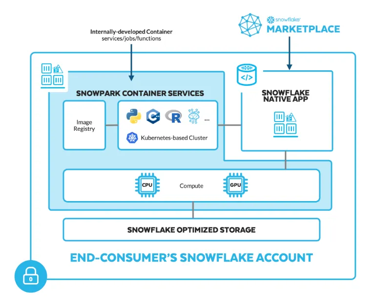
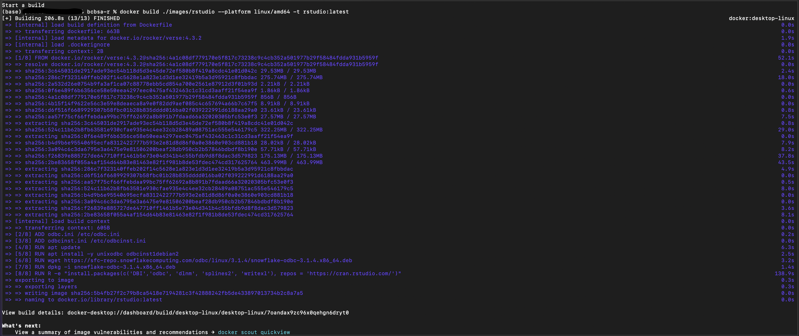
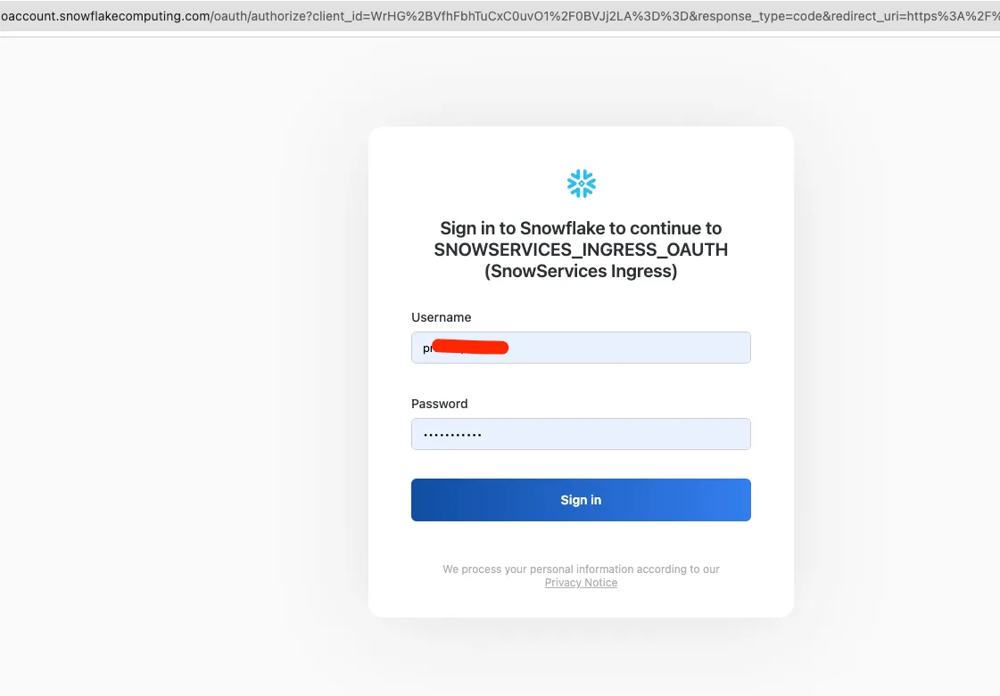
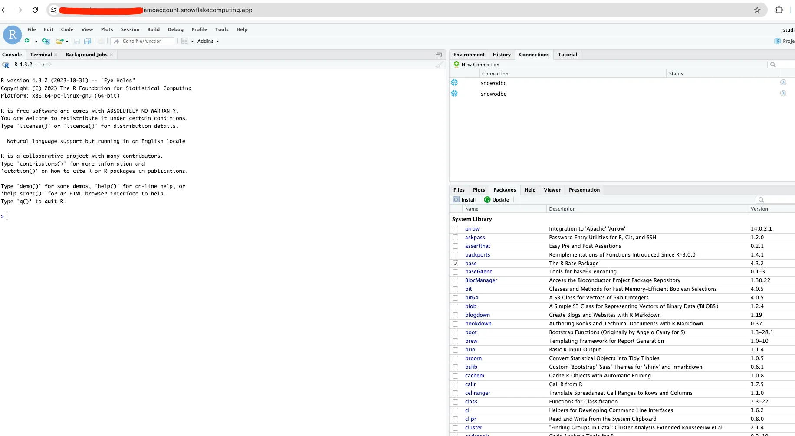

author: sfc-gh-pradeepsavadi
id: deploying-rstudio-with-snowpark-container-services-a-quickstart-guide
summary: This guide demonstrates how to deploy RStudio using Snowpark Container Services
categories: Getting-Started, Data-Science 
environments: web
status: Published 
feedback link: https://github.com/Snowflake-Labs/sfguides/issues
tags: Getting Started, Data Science, RStudio, Snowpark Container Services

# Deploying RStudio with Snowpark Container Services: A Quickstart Guide
<!-- ------------------------ -->
## Overview 
Duration: 1

This guide will walk you through the process of deploying RStudio inside Snowflake using Snowpark Container Services (SPCS). SPCS allows organizations to deploy containerized applications within their Snowflake accounts, providing a seamless integration of data science tools with your data platform.

### Prerequisites
- Familiarity with SQL and basic Docker commands
- `ACCOUNTADMIN` privileges on your Snowflake account
- Docker Desktop installed on your local machine

### What You'll Learn 
- How to set up the necessary Snowflake objects for SPCS
- How to build and push a Docker image for RStudio
- How to deploy RStudio as a service in SPCS
- How to connect to and use RStudio within Snowflake

### What You'll Need 
- A Snowflake account with SPCS enabled
- Docker Desktop installed on your local machine
- Access to a terminal or command prompt

### What You'll Build 
- A fully functional RStudio environment running inside Snowflake


### What is Snowflake Container Services 

Snowpark Container Services (SPCS) is a fully managed container offering within the Snowflake Data Cloud. It allows users to deploy, manage, and scale containerized applications directly within Snowflake, ensuring that data remains within the Snowflake environment for processing. This service simplifies container management by providing a Kubernetes-like framework optimized for Snowflake, enabling seamless execution of OCI (Open Container Initiative) images.

#### Snowflake Container Services Architecture




#### Docker Tutorial 
[](https://www.youtube.com/watch?v=3c-iBn73dDE)


### Key Features
- **Fully Managed Service**: Handles security, configuration, and scaling, allowing users to focus on development.
- **Integration with Snowflake**: Applications can connect to Snowflake, run SQL queries, and access data files directly within the Snowflake environment.
- **Support for Various Languages**: Beyond SQL, Python, Java, and Scala, SPCS supports additional languages like C++, Ruby, .NET, and more.
- **GPU-Accelerated Compute**: Offers GPU-accelerated compute instances for high computational power needs.

### Benefits

#### **Performance**
- **Reduced Data Movement**: Colocating container runtime and data storage within Snowflake reduces latency and improves performance.

#### **Security**
- **Enhanced Security**: Keeping data within Snowflake's security perimeter minimizes the risk of data breaches.

#### **Flexibility**
- **Support for Long-Running and Real-Time Applications**: Ideal for real-time AI/ML applications and other long-running services.
- **Integration with Third-Party Tools**: Seamlessly integrates with tools like Docker and Snowflake Virtual Warehouses for easy management and deployment.

#### **Use Cases**
- **Real-Time AI/ML Applications**: Suitable for applications requiring real-time data processing and analysis.

<!-- ------------------------ -->
## Setting Up Snowflake Objects
Duration: 10

First, we'll create the necessary Snowflake objects using SQL commands. This includes creating roles, databases, schemas, and granting appropriate permissions.

1. Open your Snowflake worksheet and connect as `ACCOUNTADMIN`.

2. Run the following SQL commands to create a role and necessary objects:

```sql
-- Create a role for the demo
USE ROLE USERADMIN;
CREATE OR REPLACE ROLE OSS_R_DEMO_ROLE;

USE ROLE SECURITYADMIN;
GRANT ROLE OSS_R_DEMO_ROLE TO ROLE SYSADMIN;

-- Create objects for demo
USE ROLE SYSADMIN;

CREATE OR REPLACE DATABASE OSSR;

CREATE OR REPLACE SCHEMA OSSR.DEVOPS;

CREATE OR REPLACE IMAGE REPOSITORY OSSR.DEVOPS.IMAGES;

CREATE OR REPLACE STAGE OSSR.DEVOPS.RSTUDIO ENCRYPTION = (TYPE='SNOWFLAKE_SSE');

CREATE OR REPLACE COMPUTE POOL OSSR
MIN_NODES=1
MAX_NODES=1
INSTANCE_FAMILY=CPU_X64_S;

-- run 'DESCRIBE COMPUTE POOL OSSR' to check the compute pool state. NOTE the compute pool is not ready to deploy a service or job before reaching ACTIVE or IDLE state.

DESCRIBE COMPUTE POOL OSSR; 

```


3. Grant the necessary privileges:

```sql
USE ROLE SECURITYADMIN;
GRANT USAGE ON DATABASE OSSR TO ROLE OSS_R_DEMO_ROLE;
GRANT USAGE ON SCHEMA OSSR.DEVOPS TO ROLE OSS_R_DEMO_ROLE;
GRANT USAGE ON SCHEMA OSSR.PUBLIC TO ROLE OSS_R_DEMO_ROLE;
GRANT ALL PRIVILEGES ON SCHEMA OSSR.PUBLIC TO ROLE OSS_R_DEMO_ROLE;
GRANT READ ON IMAGE REPOSITORY OSSR.DEVOPS.IMAGES TO ROLE OSS_R_DEMO_ROLE;
GRANT READ, WRITE ON STAGE OSSR.DEVOPS.RSTUDIO TO ROLE OSS_R_DEMO_ROLE;
GRANT USAGE, MONITOR ON COMPUTE POOL OSSR TO ROLE OSS_R_DEMO_ROLE;
```

4. Set up security integration and network rules:

```sql
USE ROLE ACCOUNTADMIN;


GRANT BIND SERVICE ENDPOINT ON ACCOUNT TO ROLE OSS_R_DEMO_ROLE;

CREATE OR REPLACE NETWORK RULE OSSR.PUBLIC.ALLOW_ALL_RULE
  TYPE = 'HOST_PORT'
  MODE = 'EGRESS'
  VALUE_LIST= ('0.0.0.0:443', '0.0.0.0:80');

CREATE OR REPLACE EXTERNAL ACCESS INTEGRATION ALLOW_ALL_EAI
ALLOWED_NETWORK_RULES = (OSSR.PUBLIC.ALLOW_ALL_RULE)
ENABLED = true;

GRANT USAGE ON NETWORK RULE OSSR.PUBLIC.ALLOW_ALL_RULE TO ROLE OSS_R_DEMO_ROLE;
GRANT USAGE ON INTEGRATION ALLOW_ALL_EAI TO ROLE OSS_R_DEMO_ROLE;
```

<!-- ------------------------ -->
##  Building and Pushing the RStudio Docker Image

Duration: 15
Now that we have set up the Snowflake objects, we need to build and push the RStudio Docker image to our Snowflake image repository.

1. Open a terminal or command prompt.
2. Navigate to the directory containing your Dockerfile for RStudio.
3. Save this as Dockerfile:

```bash
FROM rocker/verse:4.3.2

ADD odbc.ini /etc/odbc.ini
ADD odbcinst.ini /etc/odbcinst.ini
RUN apt update
RUN apt install -y unixodbc odbcinst1debian2
RUN wget https://sfc-repo.snowflakecomputing.com/odbc/linux/3.1.4/snowflake-odbc-3.1.4.x86_64.deb
RUN dpkg -i snowflake-odbc-3.1.4.x86_64.deb
RUN R -e "install.packages(c('DBI','odbc', 'dlnm', 'splines2', 'writexl'), repos = 'https://cran.rstudio.com/')"
```

4. Go to the directory and build the docker (ex: /images/rstudio):

```bash
docker build ./images/rstudio --platform linux/amd64 -t rstudio:latest
```





4. Tag the image for your Snowflake repository. Replace <your-org>-<your-account> with your Snowflake organization and account names:

```bash
docker tag rstudio:latest <your-org>-<your-account>.registry.snowflakecomputing.com/ossr/devops/images/rstudio:latest
```

5. Log in to your Snowflake image registry:

```bash
docker login https://<your-org>-<your-account>.registry.snowflakecomputing.com -u <your-user>
``` 

6. Push the image to your Snowflake account's image registry:

```bash
docker push <your-org>-<your-account>.registry.snowflakecomputing.com/ossr/devops/images/rstudio:latest
```


<!-- ------------------------ -->
## Deploying RStudio as a Service

Duration: 10
With the image pushed to our repository, we can now create the RStudio service in SPCS.

1. Return to your Snowflake worksheet.
2. Verify that your compute pool is ready:

```sql
USE ROLE OSS_R_DEMO_ROLE;
DESCRIBE COMPUTE POOL OSSR;
```

The status should be 'IDLE'.

3. Create the RStudio service. Replace <your-org>-<your-account> with your Snowflake organization and account names:

```sql
USE ROLE OSS_R_DEMO_ROLE;
CREATE SERVICE OSSR.PUBLIC.RSTUDIO
  IN COMPUTE POOL OSSR
  FROM SPECIFICATION $$
    spec:
      containers:
        - name: rstudio
          image: <your-org>-<your-account>.registry.snowflakecomputing.com/ossr/devops/images/rstudio:latest
          volumeMounts:
            - name: rstudio-home
              mountPath: /home/rstudio
          env: 
            DISABLE_AUTH: true
      endpoints:
        - name: rstudio
          port: 8787
          public: true
      networkPolicyConfig:
          allowInternetEgress: true
      volumes:
          - name: rstudio-home
            source: "@ossr.devops.rstudio"
            uid: 1000
            gid: 1000
      $$
   MIN_INSTANCES=1
   MAX_INSTANCES=1
   EXTERNAL_ACCESS_INTEGRATIONS = (ALLOW_ALL_EAI);
   ```

4. Describe the service to verify it was created successfully:

```sql
DESCRIBE SERVICE OSSR.PUBLIC.RSTUDIO;
```

5. Get the endpoint URL for accessing RStudio:

```sql
SHOW ENDPOINTS IN SERVICE OSSR.PUBLIC.RSTUDIO;
```


<!-- ------------------------ -->
## Accessing and Using RStudio

Duration: 5
Now that RStudio is deployed, you can access and use it within Snowflake.

Copy the endpoint URL from the previous step.
Paste the URL into your web browser.
Log in using your Snowflake credentials.




You now have access to RStudio running inside Snowflake





<!-- ------------------------ -->
## Conclusion and Next Steps
Duration: 2
Congratulations! You've successfully deployed RStudio using Snowpark Container Services. Here's what you've accomplished:

Set up necessary Snowflake objects for SPCS
Built and pushed a Docker image for RStudio
Deployed RStudio as a service in SPCS
Learned how to access and use RStudio within Snowflake

Next Steps

Explore using Snowflake data within your RStudio environment
Experiment with different R packages and analyses
Consider setting up version control for your R projects using the built-in Git integration in RStudio

Related Resources

Snowpark Container Services Documentation

* [Snowpark Container Services Documentation](https://docs.snowflake.com/en/developer-guide/snowpark-container-services/overview)

* [Detailed Medium Article](https://medium.com/@pradeep.savadi_75016/seamless-r-and-snowflake-integration-analyze-data-where-it-lives-with-rstudio-3e7a972961bd)

