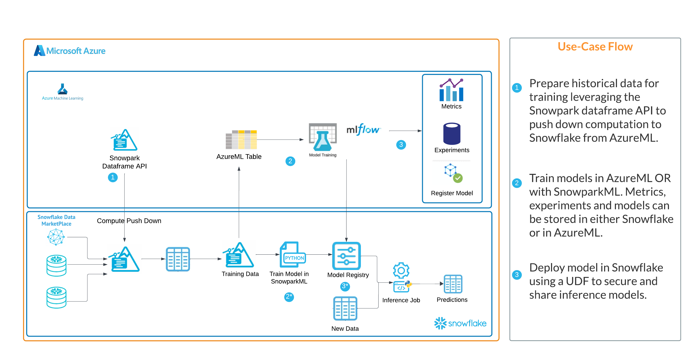
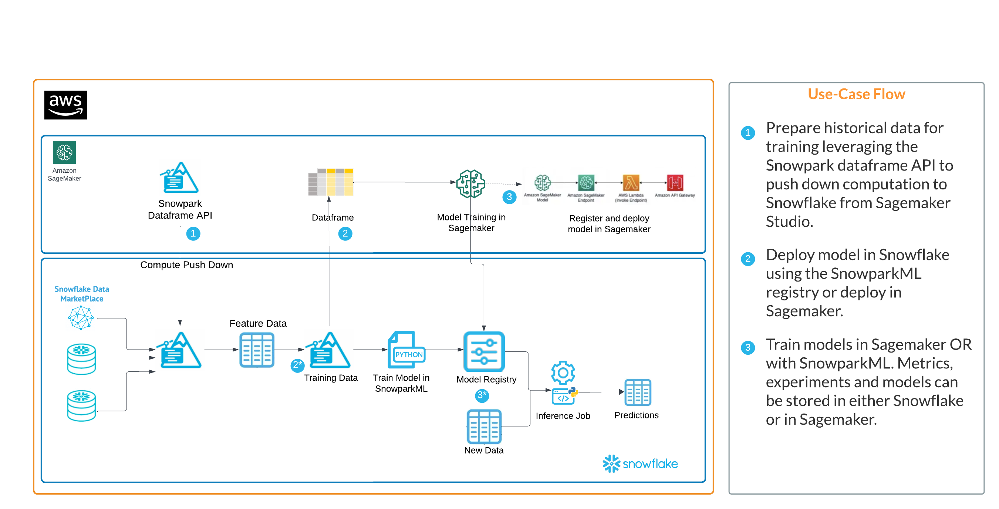

id: deploying_models_from_azureml_and_sagemaker_to_snowparkml
summary: Learning how to easily access models from AzureML and Amazon Sagemaker then deploy them to Snowpark ML registries
categories: featured,getting-started,snowpark, azure, aws, streamlit, genai, ai, ml, azureml
environments: web
status: Published
feedback link: <https://github.com/Snowflake-Labs/sfguides/issues>
tags: Getting Started, AI, Snowpark, Azure, AWS
authors: Matt Marzillo,

# Deploying Models from AzureML and Sagemaker to Snowpark ML 
<!-- ------------------------ -->
## Overview

Duration: 10

In this quickstart we will walk you through how to access models deployed with Snowflake's major CSP partners and deploy them to Snowflake.

In summary this is what you will do:
- Learn how to deploy models to the Snowpark ML registry from a Sagemaker and/or AzureML registry.
- Understand the nuance of deploying models from these platforms to Snowpark ML.

### What is Snowpark ML
Snowpark ML is the Python library and underlying infrastructure for end-to-end ML workflows in Snowflake, including components for model development and operations. With Snowpark ML, you can use familiar Python frameworks for preprocessing, feature engineering, and training. You can deploy and manage models entirely in Snowflake without any data movement, silos, or governance tradeoffs.

A part of Snowpark ML Operations (MLOps), the Snowpark Model Registry allows customers to securely manage models and their metadata in Snowflake, regardless of origin. The Snowpark Model Registry stores machine learning models as first-class schema-level objects in Snowflake so they can easily be found and used by others in your organization. You can create registries, and store models in them, using Snowpark ML. Models can have multiple versions, and you can designate a version as the default.

More details on Snowpark ML can be found in Snowflake's [documentation](https://docs.snowflake.com/en/developer-guide/snowpark-ml/index)

### What is Amazon Sagemaker?
Amazon SageMaker is a fully managed machine learning (ML) service. With SageMaker, data scientists and developers can quickly and confidently build, train, and deploy ML models into a production-ready hosted environment. It provides a UI experience for running ML workflows that makes SageMaker ML tools available across multiple integrated development environments (IDEs).

### What is AzureML?
Azure Machine Learning empowers data scientists and developers to build, deploy, and manage high-quality models faster and with confidence. It accelerates time to value with industry-leading machine learning operations (MLOps), open-source interoperability, and integrated tools. This trusted AI learning platform is designed for responsible AI applications in machine learning.

### Pre-requisites
- Familiarity with [Snowflake](https://quickstarts.snowflake.com/guide/getting_started_with_snowflake/index.html#0) and a Snowflake account.
- [AWS Account](https://aws.amazon.com/premiumsupport/knowledge-center/create-and-activate-aws-account/).
- The AWS account should be a sandbox account with open network policies or you you should [create a VPC](https://docs.aws.amazon.com/vpc/latest/userguide/working-with-vpcs.html) in the same region as the Snowflake account with access to Sagemaker.
- Similarly users will want to have an [Azure Account](https://azure.microsoft.com/en-us/free) with an AzureML with open network policies or a VNET n the same region as the Snowflake account with access to AzureML.
-  A model registered in either Sagemaker or AzureML.

### What you’ll build
In this quickstart you will work through two examples of how to deploy models to Snowpark ML Registries from cloud CSPs. The workflow provided is relevant to #3 in the architectures below.

#### Azure + Snowpark ML


#### AWS + Snowpark ML


<!-- ------------------------ -->
## Use Case / Workload
Duration: 5

Customers who use Snowflake with AzureML or AWS Sagemaker will have models trained and registered in either cloud ML tool and may prefer to deploy those models to Snowflake for batch inference. Often it's the case that all (or most) of the inference data is in Snowflake and customers prefer the ease of use, performance and security of having the model deployed in Snowflake.

<!-- ------------------------ -->
## Solution and Workbooks

Duration: 10

*Please review the “Important Notes” section below before preparing your code to run.

### Sagemaker
For models registered in the AWS Sagemaker model registry you can use the code below  to access the model from the Sagemaker registry and push it to the Snowflake registry.

```python
# import packages
import boto3
from sagemaker import get_execution_role
import sagemaker
from joblib import load

# create clients for S3 and sagemaker
s3 = boto3.client("s3")
sm_boto3 = boto3.client("sagemaker")
sess = sagemaker.Session()


# using model arn from model registry describe model details
sm_client = boto3.Session().client('sagemaker')
sm_client.describe_model_package(ModelPackageName='<model arn>')

# download model from S3 using information from above
s3_client = boto3.client('s3')
s3_client.download_file('<bucket from ModelDataUrl>', 'model file path from ModelDataURL', '<new model name in local sagemaker env>.tar.gz')

# unzip and load model
!tar -xf '<new model name in local sagemaker env>.tar.gz' -C .
sm_model = load("model.joblib")
sm_model

# connect to Snowflake with Snowpark
import pandas as pd
from snowflake.snowpark.session import Session
from snowflake.snowpark.functions import *
from snowflake.snowpark.types import *
from snowflake.ml.registry import registry

connection_parameters = {
    "account": "<locator>", # e.g. xy12345.us-east-2.aws 
    "user": "<username>", 
    "password": "<password>",
    "role": "<role>",
    "warehouse": "<virtual warehouse>",
    "database": "<database>",
    "schema": "<schema>"
    }
session = Session.builder.configs(connection_parameters).create()

# connect to Snowpark registry and log model
reg = registry.Registry(session=session)
reg.log_model(sm_model, model_name='<name of model in Snowflake>', version_name='v1', sample_input_data=<sample dataframe>)

# verify model deployment and view functions associated with the model
mv = reg.get_model('<name of model in Snowflake>').version('v1')
mv.show_functions()
```

### Azure ML

For models registered in the AzureML model registry you can use the code below to access the model from the AzureML registry and push it to the Snowflake registry.

```python
from azureml.core import Workspace, Dataset
import numpy as np

# Connect to the Workspace
ws = Workspace.from_config()

# Access model using model name
from azureml.core import Model
model_path = Model.get_model_path(model_name = '<model name>', version = 1, _workspace= ws)
model_path

# Load model
from joblib import load
aml_model = load(model_path + "/model.pkl")
aml_model

# Look at model environment
with open(model_path +  '/./python_env.yaml') as f:
    print(f.read())

# Look at model requirements
with open(model_path +  '/./requirements.txt') as f:
    print(f.read())

# connect to Snowflake with Snowpark
import pandas as pd
from snowflake.snowpark.session import Session
from snowflake.snowpark.functions import *
from snowflake.snowpark.types import *
from snowflake.ml.registry import registry

connection_parameters = {
    "account": "<locator>", # e.g. xy12345.us-east-2.aws 
    "user": "<username>", 
    "password": "<password>",
    "role": "<role>",
    "warehouse": "<virtual warehouse>",
    "database": "<database>",
    "schema": "<schema>"
    }
session = Session.builder.configs(connection_parameters).create()

# connect to Snowpark registry and log model
reg = registry.Registry(session=session)
reg.log_model(aml_model, model_name='<name of model in Snowflake>', version_name='v1', sample_input_data=<sample dataframe>)

# verify model deployment and view functions associated with the model
mv = reg.get_model('<name of model in Snowflake>').version('v1')
mv.show_functions()

```

Both of these notebooks can also be found [here](https://github.com/Snowflake-Labs/sf-samples/tree/main/samples/ml)

<!-- ------------------------ -->
## Important Notes

Duration: 10

For both AzureML and Sagemaker deployment patterns users will need to make sure that they have properly installed all of the necessary libraries in their Python environments. For the required Snowflake packages this can usually be done with the instructions [here](https://docs.snowflake.com/en/developer-guide/snowpark-ml/index#installing-snowpark-ml)

Additionally, when using log_model() to push the model into the Snowflake registry users may need to use specific dependencies and versions. This can be done with an additional argument in the function. Please see the documentation [here](https://docs.snowflake.com/en/developer-guide/snowpark-ml/reference/latest/api/registry/snowflake.ml.registry.Registry#snowflake.ml.registry.Registry)

An example will look like this:

```python
reg = registry.Registry(session=session)
reg.log_model(sm_model, model_name='<name of model in Snowflake>', version_name='v1', sample_input_data=<sample dataframe>)

reg.log_model(sm_model, model_name='<name of model in Snowflake>', version_name='v1', sample_input_data=<sample dataframe>,conda_dependencies=["mlflow<=2.4.0", "scikit-learn", "scipy"])
```
Users will want to make sure that their model is supported by libraries that are included in the Snowflake [conda channel](https://repo.anaconda.com/pkgs/snowflake/).

If the model is not supported then users will need to consider installing the libraries as 3rd party packages or using [Snowpark Container Services to deploy their model as an application](https://docs.snowflake.com/en/developer-guide/snowpark-container-services/overview).

With Sagemaker there is no way easy programmatic way to access the dependencies associated with a registered model. Customers are advised to be aware of the libraries used to build/train models so they can better understand what is required to deploy models to Snowflake. If customers are unaware of those dependencies they can reference the [Sagemaker prebuilt docker containers here to review the source code and requirements](https://docs.aws.amazon.com/sagemaker/latest/dg/docker-containers-prebuilt.html).

<!-- ------------------------ -->
## Benefits of Deploying to Snowpark ML Registries

Duration: 5

Customers prefer deploying models to Snowpark for several reasons. These reasons include:
Bringing the model to the inference data. If all (or most) of your inference data is in Snowflake then having the model with the data makes for a more efficient and secure experience. Data doesn’t have to leave the Snowflake plane and results are returned more quickly
Security and Flexibility. With the model deployed in the SnowparkML Registry admins can leverage Snowflake’s RBAC to easily control access and organizations have the flexibility to allow privileged users the ability to generate predictions with their Snowpark model.
Enhanced prediction functionality. With SnowparkML models registered now come pre built with robust inference functionality like predict(), predict_proba() and decision_functiuon() so that more can be done with models deployed to SnowparkML

<!-- ------------------------ -->
## Conclusion

Duration: 5

### What we covered
Working through the provided notebooks you likely used one of two examples that allowed you to deploy models to Snowpark ML Registries from cloud CSPs, that you can now access from Snowflake to generate inference from a model that is deployed in the same environment as your data!

### What You Learned

- How to access models and dependencies from CSP ML platforms.
- How to deploy those models to Snwopark ML.

### Things to Consider

There are several things to be aware of when deploying model to SnowparkML registries, they are:
1. Models deployed to SnowparkML should be batch or micro-batch inference use cases. True real-time inference use cases are not supported by SnowparkML deployments.
2. Model monitoring and tracking is not currently supported by SnowparkML so users will have to manually create reports in order to track model deployments. 
3. As previously mentioned the Snowpark Warehouse comes with a robust set of libraries however if users are using additional libraries they will have to install those libraries as 3rd party packages prior to deployment.


### Related resources 
- [Snowpark ML](https://docs.snowflake.com/en/developer-guide/snowpark-ml/index)
- [Sagemaker Documentation](https://docs.aws.amazon.com/sagemaker/)
- [Azure ML](https://learn.microsoft.com/en-us/azure/machine-learning/?view=azureml-api-2)
- [Introduction to ML with Snowpark ML](https://quickstarts.snowflake.com/guide/intro_to_machine_learning_with_snowpark_ml_for_python/index.html?index=..%2F..index#0)

If you have any questions, reach out to your Snowflake account team!
