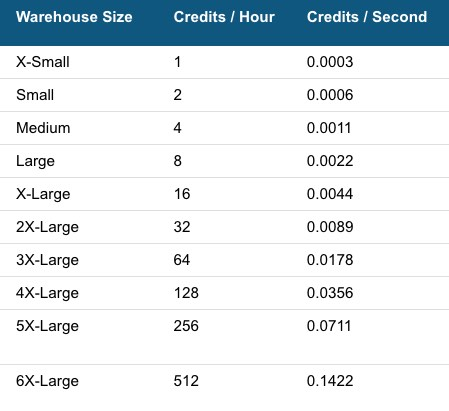
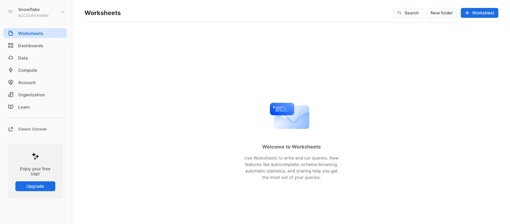
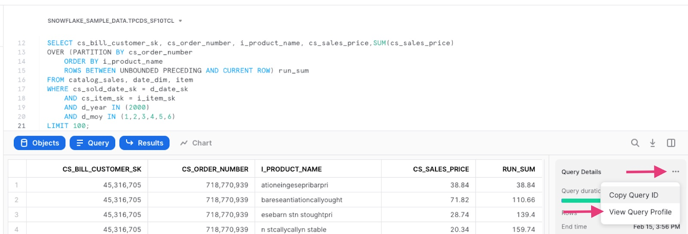
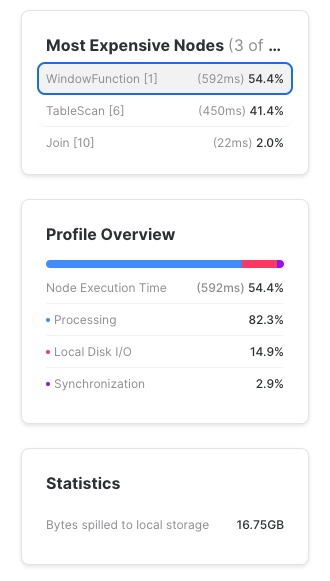
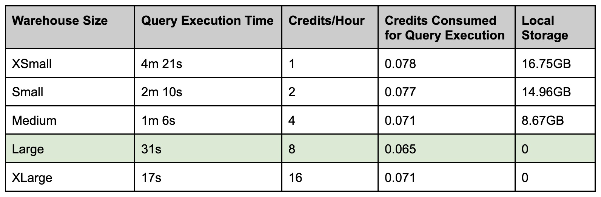

author: Lorena Diaconescu
id: determining_warehouse_size
summary: Determine the best warehouse size to use for your query
categories: undefined
environments: web
status: Hidden
feedback link: https://github.com/Snowflake-Labs/sfguides/issues
tags: Getting Started, Data Science, Data Engineering

# Determine Appropriate Warehouse Sizes

<!-- ------------------------ -->

## Overview

Duration: 1

At Snowflake, compute resources (or warehouses) can be configured based on your needs. This guide will introduce you to warehouses and show how to determine the appropriate warehouse size for your query. Using the correct warehouse size can help you get the best experience from your Snowflake account.

> aside positive
> 
>  **Note** - Completing this guide in its entirety consumes approximately 3 credits.

### Prerequisites

- Use of the [Snowflake free 30-day trial environment](https://signup.snowflake.com/?referrer=quickstart-warehouse-sizing)

### What You’ll Learn

- What is a Warehouse
- How to determine the best warehouse size to use for a query

<!-- ------------------------ -->

## What is a Warehouse

Duration: 1

A warehouse is a cluster of compute resources in Snowflake. A warehouse provides the required resources, such as CPU, memory, and temporary storage, to perform the following operations in a Snowflake session:

- Executing SQL [SELECT](https://docs.snowflake.com/en/sql-reference/sql/select.html) statements that require compute resources (e.g. retrieving rows from tables and views).
- Performing DML operations, such as:
  - Updating rows in tables ([DELETE](https://docs.snowflake.com/en/sql-reference/sql/delete.html), [INSERT](https://docs.snowflake.com/en/sql-reference/sql/insert.html), [UPDATE](https://docs.snowflake.com/en/sql-reference/sql/update.html)).
  - Loading data into tables ([COPY INTO \<table\>](https://docs.snowflake.com/en/sql-reference/sql/copy-into-table.html)).
  - Unloading data from tables ([COPY INTO \<location\>](https://docs.snowflake.com/en/sql-reference/sql/copy-into-location.html)).

> aside positive
> 
>  To perform these operations, a warehouse must be running and in use for the session. While a warehouse is running, it consumes Snowflake credits.

### Warehouse Sizes

Size specifies the set of compute resources available in a warehouse, which can be adjusted at any time. Usage is billed per second based on the number of credits consumed, with a 60 second minimum each time the warehouse starts.



To learn more about warehouses, visit the Snowflake [documentation](https://docs.snowflake.com/en/user-guide/warehouses-overview.html).

<!-- ------------------------ -->

## Evaluating warehouse sizes

Duration: 1

In the following sections, you will run the same query on different sized warehouses to determine which is the best size for the query.

You will disable the query result cache and suspend the warehouse after each test so that performance of the next query is not artificially enhanced.

> aside positive
> 
>  **Tip** - When executing queries outside of this guide environment, you do not need to disable the query result cache or restart warehouses prior to each query.

<!-- ------------------------ -->

## Preparing your environment

Duration: 2

Login to your Snowflake trial account. If you do not already have an account, you can sign up for a free 30-day trial at [signup.snowflake.com](https://signup.snowflake.com/?referrer=quickstart-warehouse-sizing).

Once in your account:

1. Navigate to the Worksheets tab.



2. Create a new worksheet.
3. Set the context for your worksheet.

```sql
USE ROLE ACCOUNTADMIN;
CREATE WAREHOUSE IF NOT EXISTS SAMPLE_WH;
USE SNOWFLAKE_SAMPLE_DATA.TPCDS_SF10TCL;
```

<!-- ------------------------ -->

## Run a sample query with an extra small warehouse

Duration: 7

1. Change the size of your warehouse to XSmall.

```sql
ALTER WAREHOUSE SAMPLE_WH SET WAREHOUSE_SIZE = XSmall;
```

2. Suspend and resume the warehouse to make sure its Data Cache is empty, disable the query result cache and set a query tag.

```sql
ALTER WAREHOUSE SAMPLE_WH SUSPEND;
ALTER WAREHOUSE SAMPLE_WH RESUME;
ALTER SESSION SET USE_CACHED_RESULT = FALSE;
ALTER SESSION SET QUERY_TAG = 'SAMPLE_WH_Sizing';
```

> aside positive
> 
>  **Tip** - Run specific queries within a worksheet by selecting the queries you want to run and pressing Cmd/Ctrl + Enter.

3. Run the following query to list detailed catalog sales data along with a running sum of sales price within the order. This will be your test query and will be used throughout the guide. The query will take several minutes to run.

```sql
SELECT cs_bill_customer_sk, cs_order_number, i_product_name, cs_sales_price,
  SUM(cs_sales_price)
OVER (PARTITION BY cs_order_number
  ORDER BY i_product_name
  ROWS BETWEEN UNBOUNDED PRECEDING AND CURRENT ROW) run_sum
FROM catalog_sales, date_dim, item
WHERE cs_sold_date_sk = d_date_sk
  AND cs_item_sk = i_item_sk
  AND d_year IN (2000)
  AND d_moy IN (1,2,3,4,5,6)
LIMIT 100;
```

4. View the Query Profile. This will open in a new tab.



5. In the “Most Expensive Nodes” section of the query profile, click on the operator `WindowFunction [1]` .
   Take note of the performance metrics for this operator on the XSmall warehouse. You should see significant spilling to local storage and possibly spilling to remote storage.

   - The spill to local storage indicates the warehouse did not have enough memory.
   - If it spills to remote storage, the warehouse did not have enough SSD storage to store the spill from memory on its local SSD drive.



<!-- ------------------------ -->

## Run a sample query with a small warehouse

Duration: 4

1. Return to your worksheet.
2. Suspend your warehouse, change its size to small and resume it.

```sql
ALTER WAREHOUSE SAMPLE_WH SUSPEND;
ALTER WAREHOUSE SAMPLE_WH SET WAREHOUSE_SIZE = Small;
ALTER WAREHOUSE SAMPLE_WH RESUME;
```

> aside negative
> 
>  If running `ALTER WAREHOUSE SAMPLE_WH SUSPEND;` generates the error `Invalid state. Warehouse 'SAMPLE_WH' cannot be suspended.` , it means your warehouse has been automatically suspended due to inactivity. There is no need to suspend the warehouse again. Continue to the next query to set the warehouse size.

3. Re-run the test query.

```sql
SELECT cs_bill_customer_sk, cs_order_number, i_product_name, cs_sales_price,
  SUM(cs_sales_price)
OVER (PARTITION BY cs_order_number
  ORDER BY i_product_name
  ROWS BETWEEN UNBOUNDED PRECEDING AND CURRENT ROW) run_sum
FROM catalog_sales, date_dim, item
WHERE cs_sold_date_sk = d_date_sk
  AND cs_item_sk = i_item_sk
  AND d_year IN (2000)
  AND d_moy IN (1,2,3,4,5,6)
LIMIT 100;
```

4. View the query profile and click the operator `WindowFunction [1]`.
5. Take note of the performance metrics for this operator. You should see lower amounts spilling to local storage and remote disk, as well as faster execution.

<!-- ------------------------ -->

## Run a sample query with a medium warehouse

Duration: 3

1. Return to your worksheet.
2. Suspend your warehouse, change its size to medium and resume it.

```sql
ALTER WAREHOUSE SAMPLE_WH SUSPEND;
ALTER WAREHOUSE SAMPLE_WH SET WAREHOUSE_SIZE = Medium;
ALTER WAREHOUSE SAMPLE_WH RESUME;
```

3. Re-run the test query.

```sql
SELECT cs_bill_customer_sk, cs_order_number, i_product_name, cs_sales_price,
  SUM(cs_sales_price)
OVER (PARTITION BY cs_order_number
  ORDER BY i_product_name
  ROWS BETWEEN UNBOUNDED PRECEDING AND CURRENT ROW) run_sum
FROM catalog_sales, date_dim, item
WHERE cs_sold_date_sk = d_date_sk
  AND cs_item_sk = i_item_sk
  AND d_year IN (2000)
  AND d_moy IN (1,2,3,4,5,6)
LIMIT 100;
```

4. View the query profile and click the operator `WindowFunction [1]`.
5. Take note of the performance metrics for this operator. You should see lower amounts spilling to local storage and remote disk, as well as faster execution.

<!-- ------------------------ -->

## Run a sample query with a large warehouse

Duration: 2

1. Return to your worksheet.
2. Suspend your warehouse, change its size to large, and resume it.

```sql
ALTER WAREHOUSE SAMPLE_WH SUSPEND;
ALTER WAREHOUSE SAMPLE_WH SET WAREHOUSE_SIZE = Large;
ALTER WAREHOUSE SAMPLE_WH RESUME;
```

3. Re-run the test query.

```sql
SELECT cs_bill_customer_sk, cs_order_number, i_product_name, cs_sales_price,
  SUM(cs_sales_price)
OVER (PARTITION BY cs_order_number
  ORDER BY i_product_name
  ROWS BETWEEN UNBOUNDED PRECEDING AND CURRENT ROW) run_sum
FROM catalog_sales, date_dim, item
WHERE cs_sold_date_sk = d_date_sk
  AND cs_item_sk = i_item_sk
  AND d_year IN (2000)
  AND d_moy IN (1,2,3,4,5,6)
LIMIT 100;
```

4. View the query profile and click the operator `WindowFunction [1]`.
5. Take note of the performance metrics for this operator. You will see that there is no spilling to local or remote storage.

<!-- ------------------------ -->

## Run a sample query with an extra large warehouse

Duration: 2

1. Return to your worksheet.
2. Suspend your warehouse, change its size to extra large, and resume it.

```sql
ALTER WAREHOUSE SAMPLE_WH SUSPEND;
ALTER WAREHOUSE SAMPLE_WH SET WAREHOUSE_SIZE = XLarge;
ALTER WAREHOUSE SAMPLE_WH RESUME;
```

3. Re-run the test query.

```sql
SELECT cs_bill_customer_sk, cs_order_number, i_product_name, cs_sales_price,
  SUM(cs_sales_price)
OVER (PARTITION BY cs_order_number
  ORDER BY i_product_name
  ROWS BETWEEN UNBOUNDED PRECEDING AND CURRENT ROW) run_sum
FROM catalog_sales, date_dim, item
WHERE cs_sold_date_sk = d_date_sk
  AND cs_item_sk = i_item_sk
  AND d_year IN (2000)
  AND d_moy IN (1,2,3,4,5,6)
LIMIT 100;
```

4. View the query profile and click the operator `WindowFunction [1]`.
5. Take note of the performance metrics for this operator.
6. Navigate back to worksheets. Suspend your warehouse and change its size back to XSmall.

```sql
ALTER WAREHOUSE SAMPLE_WH SUSPEND;
ALTER WAREHOUSE SAMPLE_WH SET WAREHOUSE_SIZE = XSmall;
```

<!-- ------------------------ -->

## Summarize results

Duration: 2

1. Run a query showing the query history results for these performance tests.

```sql
SELECT query_id,query_text, warehouse_size,(execution_time / 1000) Time_in_seconds, partitions_total, partitions_scanned,
        bytes_spilled_to_local_storage, bytes_spilled_to_remote_storage,
        query_load_percent
FROM "SNOWFLAKE"."ACCOUNT_USAGE"."QUERY_HISTORY"
WHERE query_tag = 'SAMPLE_WH_Sizing'
  AND WAREHOUSE_SIZE IS NOT NULL
  AND QUERY_TYPE LIKE 'SELECT'
ORDER BY start_time DESC;
```

2. Determine the right warehouse size for the query.
   <br><br>
   The ideal size to use for the test query is a Large Warehouse due to its optimal balance of time and cost.
   Factors to consider are:

   - **Query Execution Time**: As the warehouse size increased, the query execution time decreased.
   - **Credits Consumed**: Credit consumption is a factor of warehouse size and execution time.
   - **Bytes in Local Storage**: Did query execution spill over to local/remote storage?



<!-- ------------------------ -->

## Clean up

Duration: 1

1. Reset the query tag.

```sql
ALTER SESSION UNSET QUERY_TAG;
```

2. Enable the cache.

```sql
ALTER SESSION UNSET USE_CACHED_RESULT;
```

<form>
  <name>Did you find this content helpful?</name>
  <input type="radio" value="Yes">
  <input type="radio" value="No">
</form>
