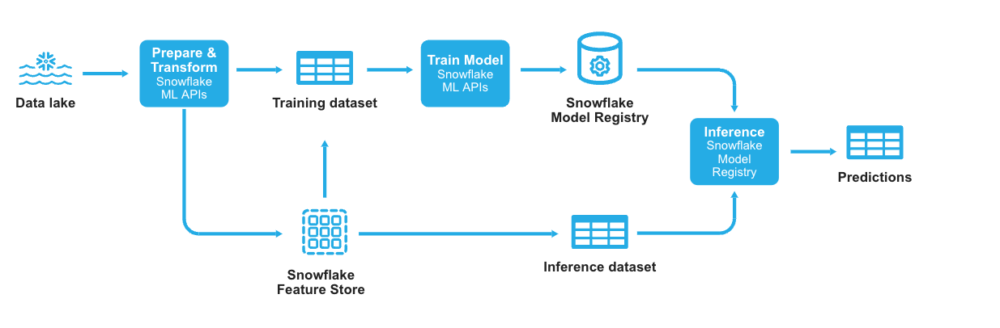

author: Charlie Hammond
id: develop-and-manage-ml-models-with-feature-store-and-model-registry
categories: snowflake-site:taxonomy/solution-center/certification/quickstart, snowflake-site:taxonomy/solution-center/certification/certified-solution, snowflake-site:taxonomy/solution-center/includes/architecture, snowflake-site:taxonomy/product/ai, snowflake-site:taxonomy/snowflake-feature/transformation, snowflake-site:taxonomy/snowflake-feature/ml-functions
language: en
summary: Manage ML experiments with Snowflake Feature Store and Model Registry for reproducible, governed, and versioned model development.
environments: web
status: Published 
feedback link: https://github.com/Snowflake-Labs/sfguides/issues

# Develop and Manage ML Models with Feature Store and Model Registry
<!-- ------------------------ -->
## Overview 

[Snowflake ML](/en/data-cloud/snowflake-ml/) is an integrated set of capabilities for end-to-end machine learning in a single platform on top of your governed data. Data scientists and ML engineers can easily and securely develop and productionize scalable features and models without any data movement, silos, or governance tradeoffs. The Snowpark ML Python library (the snowflake-ml-python package) provides APIs for developing and deploying your Snowflake ML pipelines.

This is part 3 of a 3-part introduction quickstart series to Snowflake Feature Store (check out part 1 [here](/en/developers/guides/intro-to-feature-store/) and part 2 [here](/en/developers/guides/overview-of-feature-store-api/)). This quickstart demonstrates an end-to-end ML experiment cycle including feature creation, training data generation, model training and inference. The workflow touches on key Snowflake ML features including [Snowflake Feature Store](https://docs.snowflake.com/en/developer-guide/snowpark-ml/feature-store/overview), [Dataset](https://docs.snowflake.com/en/developer-guide/snowpark-ml/dataset), [Snowflake ML APIs](https://docs.snowflake.com/en/developer-guide/snowpark-ml/modeling), and [Snowflake Model Registry](https://docs.snowflake.com/en/developer-guide/snowpark-ml/model-registry/overview). 



### What You Will Learn 
- The key features of Snowflake Feature Store including [entities](https://docs.snowflake.com/en/developer-guide/snowflake-ml/feature-store/entities) and [feature views](https://docs.snowflake.com/en/developer-guide/snowflake-ml/feature-store/feature-views).
- How to train a model using [Snowflake ML APIs](https://docs.snowflake.com/en/developer-guide/snowpark-ml/modeling)
- How to log and reference models using [Snowflake Model Registry](https://docs.snowflake.com/en/developer-guide/snowpark-ml/model-registry/overview)

### What You’ll Need 
- A [Snowflake](https://app.snowflake.com/) Account

### What You’ll Build 
- An ML model using Snowflake Feature Store and Model Registry

<!-- ------------------------ -->
## Setup Your Account

Complete the following steps to setup your account:
- Navigate to Worksheets, click "+" in the top-right corner to create a new Worksheet, and choose "SQL Worksheet".
- Paste and the following SQL in the worksheet 
- Adjust <YOUR_USER> to your user
- Run all commands to create Snowflake objects

```sql
USE ROLE ACCOUNTADMIN;

-- Using ACCOUNTADMIN, create a new role for this exercise and grant to applicable users
CREATE OR REPLACE ROLE ML_MODEL_ROLE;
GRANT ROLE ML_MODEL_ROLE to USER <YOUR_USER>;

-- create our virtual warehouse
CREATE OR REPLACE WAREHOUSE ML_MODEL_WH AUTO_SUSPEND = 60;

GRANT ALL ON WAREHOUSE ML_MODEL_WH TO ROLE ML_MODEL_ROLE;

-- Next create a new database and schema,
CREATE OR REPLACE DATABASE ML_MODEL_DATABASE;
CREATE OR REPLACE SCHEMA ML_MODEL_SCHEMA;

GRANT OWNERSHIP ON DATABASE ML_MODEL_DATABASE TO ROLE ML_MODEL_ROLE COPY CURRENT GRANTS;
GRANT OWNERSHIP ON ALL SCHEMAS IN DATABASE ML_MODEL_DATABASE TO ROLE ML_MODEL_ROLE COPY CURRENT GRANTS;
```

<!-- ------------------------ -->
## Run the Notebook

- Download the notebook from this [link](https://github.com/Snowflake-Labs/sfguide-develop-and-manage-ml-models-with-feature-store-and-model-registry/blob/main/notebooks/0_start_here.ipynb)
- Download [feature-store-ui.png](https://github.com/Snowflake-Labs/sfguide-develop-and-manage-ml-models-with-feature-store-and-model-registry/blob/main/notebooks/feature-store-ui.png) and [model-registry-ui.png](https://github.com/Snowflake-Labs/sfguide-develop-and-manage-ml-models-with-feature-store-and-model-registry/blob/main/notebooks/model-registry-ui.png)
- Change role to ML_MODEL_ROLE
- Navigate to Projects > Notebooks in Snowsight
- Click Import .ipynb from the + Notebook dropdown
- Create a new notebok with the following settings
  - Notebook Location: ML_MODEL_DATABASE, ML_MODEL_SCHEMA
  - Run on Warehouse
  - Warehouse: ML_MODEL_WH
- Create Notebook
- Click Packages in the top right, add `snowflake-ml-python` and `snowflake-snowpark-python`
- Upload both image files by clicking the plus button on the file explorer in the left pane
- Run cells in the notebook!


<!-- ------------------------ -->
## Conclusion And Resources

Snowflake ML offers a comprehensive, integrated platform for end-to-end machine learning, allowing data scientists and ML engineers to develop and deploy scalable models seamlessly, all within a governed data environment. With the Snowpark ML Python library, you can build and manage your ML pipelines without the need for data movement or compromising on governance.

This Quickstart has demonstrated how to execute an entire ML experiment cycle—from feature creation to model training and inference—while highlighting key features such as the Snowflake Feature Store, Dataset, Snowpark ML Modeling, and the Snowflake Model Registry.

Ready to elevate your machine learning projects? Dive into the full potential of Snowflake ML and start transforming your data into actionable insights today. Check out the links below to get started and explore more advanced capabilities.

### What You Learned
- The key features of Snowflake Feature Store including [entities](https://docs.snowflake.com/en/developer-guide/snowflake-ml/feature-store/entities) and [feature views](https://docs.snowflake.com/en/developer-guide/snowflake-ml/feature-store/feature-views).
- How to train a model using [Snowflake ML APIs](https://docs.snowflake.com/en/developer-guide/snowpark-ml/modeling)
- How to log and reference models using [Snowflake Model Registry](https://docs.snowflake.com/en/developer-guide/snowpark-ml/model-registry/overview)

### Related Quickstarts
- Part 1: [Introduction to Snowflake Feature Store with Snowflake Notebooks](/en/developers/guides/intro-to-feature-store/)
- Part 2: [Getting Started with Snowflake Feature Store API](/en/developers/guides/overview-of-feature-store-api/)

### Related Resources
- [Snowflake Feature Store](https://docs.snowflake.com/en/developer-guide/snowflake-ml/feature-store/overview)
- [Entities](https://docs.snowflake.com/en/developer-guide/snowflake-ml/feature-store/entities)
- [Feature Views](https://docs.snowflake.com/en/developer-guide/snowflake-ml/feature-store/feature-views)
- [Datasets](https://docs.snowflake.com/en/developer-guide/snowflake-ml/feature-store/modeling#generating-datasets-for-training)
- [Snowflake ML Webpage](/en/data-cloud/snowflake-ml/)

- [Fork Repo on GitHub](https://github.com/Snowflake-Labs/sfguide-getting-started-with-snowflake-notebook-container-runtime/blob/main/notebooks/0_start_here.ipynb?_fsi=EwgOAmF4&_fsi=EwgOAmF4)
- [Download Reference Architecture](https://drive.google.com/file/d/1GA_pt6Pdy76tWkxyPFKL2xH_YG3v5ZRM/view?usp=sharing)
- [Read Engineering Blog](/en/engineering-blog/machine-learning-container-runtime/)
- [Watch the Demo](https://youtu.be/5zXP6Kj5gM4?list=TLGGiXdaWh2xmL4yMjA5MjAyNQ)
