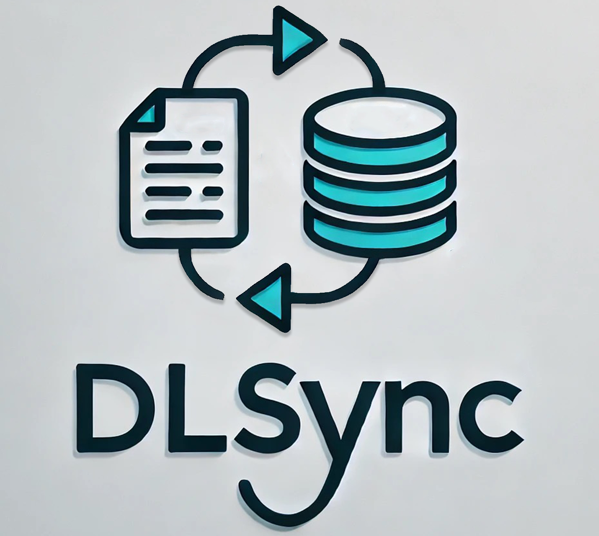
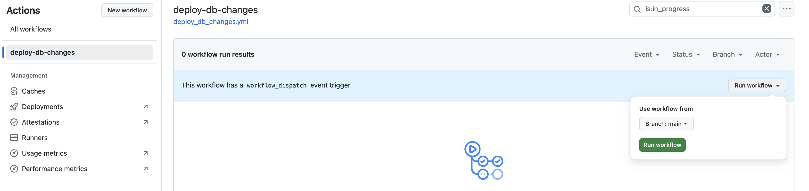
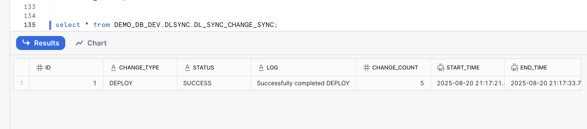
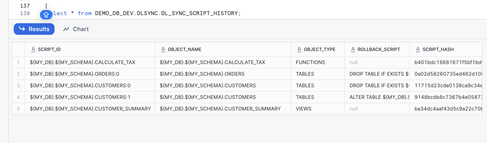

author: Ytbarek Hailu
id: devops-dcm-dlsync-github
categories: snowflake-site:taxonomy/solution-center/certification/quickstart, snowflake-site:taxonomy/product/data-engineering
language: en
summary: Synchronize Snowflake database changes with GitHub using DL Sync for declarative, version-controlled deployments and other DevOps best practices.
environments: web
status: Published 
feedback link: https://github.com/Snowflake-Labs/sfguides/issues


# DevOps: Database Change Management with DLSync and GitHub
<!-- ------------------------ -->
## Overview



This guide will provide step-by-step instructions for how to build a simple CI/CD pipeline for Snowflake with GitHub Actions using [DLSync](https://github.com/Snowflake-Labs/dlsync). DLSync is a database change management tool designed to streamline the development and deployment of Snowflake changes. By associating each database object (view, table, udf, etc.) with a corresponding SQL script file, DLSync tracks every modification, ensuring efficient and accurate updates. DLSync automatically handles script dependencies during deployment, ensuring that database objects are created and updated in the correct order based on their interdependencies. Additionally, DLSync includes built-in unit testing capabilities that allow you to validate your database objects with test scripts before deployment, ensuring code quality and reliability.

DevOps is concerned with automating the development, release, and maintenance of software applications. This guide focuses on automated release management for Snowflake by leveraging GitHub Actions and DLSync.

### Prerequisites

* Familiarity with Snowflake
* Familiarity with Git and GitHub actions

### What You Will Learn

* A brief overview of GitHub Actions and how to use them for CI/CD
* A comprehensive overview of DLSync and its capabilities
* How database change management tools like DLSync work with Snowflake
* How to structure DLSync projects with state-based and migration-based scripts
* How to create realistic database objects (tables, views, functions) with DLSync
* How to set up Snowflake environments for DLSync deployments
* How to configure GitHub Action secrets for secure credential management
* How to create and configure GitHub Actions workflows for automated deployments
* How to run DLSync directly in CI/CD pipelines
* How to implement unit testing with DLSync
* How to monitor and verify successful deployments in Snowflake
* Ideas for advanced CI/CD pipelines with multiple environments

### What You Will Need

1. **Snowflake**
    1. A Snowflake Account ([Create snowflake trial account](https://signup.snowflake.com/?utm_source=snowflake-devrel&utm_medium=developer-guides&utm_cta=developer-guides)) 
    1. A Snowflake Database and schema (e.g., DEMO_DB.DEMO_SCHEMA)
    1. A Snowflake User with appropriate permissions
1. **GitHub**
    1. A GitHub Account ([Join GitHub](https://github.com/join))
    1. A GitHub Repository ([Create a new repository](https://github.com/new))
1. **Integrated Development Environment (IDE)**
    1. Your favorite IDE with Git integration (e.g., [Visual Studio Code](https://code.visualstudio.com/))
    1. Your project repository cloned to your computer

### What You Will Build

* A simple, working release pipeline for Snowflake in GitHub Actions using DLSync

<!-- ------------------------ -->
## GitHub Overview

GitHub provides a complete, end-to-end set of software development tools to manage the SDLC, including collaborative coding, automation & CI/CD, security, project management, and more.

### GitHub Actions

GitHub Actions makes it easy to automate all your software workflows, including CI/CD. You can build, test, and deploy your code right from GitHub. This guide will focus on using GitHub Actions for database change management with DLSync.

<!-- ------------------------ -->
## DLSync Overview

DLSync is a database change management tool for Snowflake. It tracks changes to database objects by associating each object with a unique SQL script file. DLSync supports both state-based and migration-based change management, unit testing, change detection, dependency resolution, parametrization, rollback, verification, and script creation.

For more information, see the [DLSync project page](https://github.com/Snowflake-Labs/dlsync).

> 
> 
>  **Note** - DLSync is a community-developed tool, not an official Snowflake offering. It comes with no support or warranty.

<!-- ------------------------ -->
## Project Structure And Scripts

To use DLSync, create a script root directory containing all scripts and configurations. Here's an example structure for our demo:

```text
/db_scripts
├── /main
│   ├── /DEMO_DB
│   │   ├── /DEMO_SCHEMA
│   │   │   ├── /VIEWS
│   │   │   │   ├── CUSTOMER_SUMMARY.SQL
│   │   │   ├── /TABLES
│   │   │   │   ├── CUSTOMERS.SQL
│   │   │   │   ├── ORDERS.SQL
│   │   │   ├── /FUNCTIONS
│   │   │   │   ├── CALCULATE_TAX.SQL
├── /test
│   ├── /DEMO_DB
│   │   ├── /DEMO_SCHEMA
│   │   │   ├── /VIEWS
│   │   │   │   ├── CUSTOMER_SUMMARY_TEST.SQL
│   │   │   ├── /FUNCTIONS
│   │   │   │   ├── CALCULATE_TAX_TEST.SQL
├── config.yml
├── parameter-dev.properties
├── parameter-prod.properties
```

### Create Scripts

**State Script Example** (`main/DEMO_DB/DEMO_SCHEMA/VIEWS/CUSTOMER_SUMMARY.SQL`):
```sql
CREATE OR REPLACE VIEW ${MY_DB}.${MY_SCHEMA}.CUSTOMER_SUMMARY AS
SELECT 
    c.customer_id,
    c.customer_name,
    COUNT(o.order_id) as total_orders,
    SUM(o.order_amount) as total_spent
FROM ${MY_DB}.${MY_SCHEMA}.CUSTOMERS c
LEFT JOIN ${MY_DB}.${MY_SCHEMA}.ORDERS o 
    ON c.customer_id = o.customer_id
GROUP BY c.customer_id, c.customer_name;
```

**Migration Script Example** (`main/DEMO_DB/DEMO_SCHEMA/TABLES/CUSTOMERS.SQL`):
```sql
---version: 0, author: demo_user
CREATE OR REPLACE TABLE ${MY_DB}.${MY_SCHEMA}.CUSTOMERS(
    customer_id NUMBER,
    customer_name VARCHAR(100),
    email VARCHAR(100)
);
---rollback: DROP TABLE IF EXISTS ${MY_DB}.${MY_SCHEMA}.CUSTOMERS;
---verify: SELECT * FROM ${MY_DB}.${MY_SCHEMA}.CUSTOMERS LIMIT 1;

---version: 1, author: demo_user
ALTER TABLE ${MY_DB}.${MY_SCHEMA}.CUSTOMERS ADD COLUMN created_date DATE;
---rollback: ALTER TABLE ${MY_DB}.${MY_SCHEMA}.CUSTOMERS DROP COLUMN created_date;
---verify: SELECT created_date FROM ${MY_DB}.${MY_SCHEMA}.CUSTOMERS LIMIT 1;
```


`main/DEMO_DB/DEMO_SCHEMA/TABLES/ORDERS.SQL`:
```sql
---version: 0, author: demo_user
CREATE OR REPLACE TABLE ${MY_DB}.${MY_SCHEMA}.ORDERS(
    order_id NUMBER,
    customer_id NUMBER,
    order_amount NUMBER(10,2),
    order_date DATE DEFAULT CURRENT_DATE
);
---rollback: DROP TABLE IF EXISTS ${MY_DB}.${MY_SCHEMA}.ORDERS;
---verify: SELECT * FROM ${MY_DB}.${MY_SCHEMA}.ORDERS LIMIT 1;

```

`main/DEMO_DB/DEMO_SCHEMA/FUNCTIONS/CALCULATE_TAX.SQL`:
```sql
CREATE OR REPLACE FUNCTION ${MY_DB}.${MY_SCHEMA}.CALCULATE_TAX(amount NUMBER, country VARCHAR)
RETURNS NUMBER
LANGUAGE SQL
AS
$$
  CASE 
    WHEN country = 'US' THEN amount * 0.08
    WHEN country = 'CA' THEN amount * 0.12
    WHEN country = 'UK' THEN amount * 0.20
    ELSE amount * 0.05
  END
$$;
```

**Test Script Example** (`test/DEMO_DB/DEMO_SCHEMA/VIEWS/CUSTOMER_SUMMARY_TEST.SQL`):
```sql
WITH CUSTOMERS AS (
    SELECT * FROM VALUES
        (1, 'John Doe', 'john@example.com'),
        (2, 'Jane Smith', 'jane@example.com')
    AS T(customer_id, customer_name, email)
),
ORDERS AS (
    SELECT * FROM VALUES
        (101, 1, 250.00),
        (102, 1, 100.00),
        (103, 2, 300.00)
    AS T(order_id, customer_id, order_amount)
),
EXPECTED_DATA AS (
    SELECT 
        1 as customer_id, 
        'John Doe' as customer_name, 
        2 as total_orders, 
        350.00 as total_spent
    UNION ALL
    SELECT 
        2 as customer_id, 
        'Jane Smith' as customer_name, 
        1 as total_orders, 
        300.00 as total_spent
)
SELECT * FROM ${MY_DB}.${MY_SCHEMA}.CUSTOMER_SUMMARY;
```

`test/DEMO_DB/DEMO_SCHEMA/FUNCTIONS/CALCULATE_TAX_TEST.SQL`:
```sql
WITH MOCK_DATA AS (
    SELECT * FROM VALUES
        (100.00, 'US'),
        (200.00, 'CA'),
        (300.00, 'UK'),
        (400.00, 'DE')
    AS T(amount, country)
),
EXPECTED_DATA AS (
    SELECT 
        8.00 as expected_tax
    UNION ALL
    SELECT  
        24.00 as expected_tax
    UNION ALL
    SELECT 
        60.00 as expected_tax
    UNION ALL
    SELECT 
        20.00 as expected_tax
)
SELECT 
    ${MY_DB}.${MY_SCHEMA}.CALCULATE_TAX(m.amount, m.country) as calculated_tax
FROM MOCK_DATA m;
```

**Configuration Files:**

`config.yml`:
```yaml
version: 1.0
continueOnFailure: "false"
```

`parameter-dev.properties`:
```properties
MY_DB=DEMO_DB_DEV
MY_SCHEMA=DEMO_SCHEMA_DEV
```

`parameter-prod.properties`:
```properties
MY_DB=DEMO_DB_PROD
MY_SCHEMA=DEMO_SHCMEA_PROD
```

<!-- ------------------------ -->
## Setup Snowflake

Before configuring GitHub Actions, you need to set up the necessary Snowflake objects. Connect to your Snowflake account and run the following commands to create the required role, database, and schema:

```sql
-- Create the demo role
CREATE ROLE demo_role;

-- Create the development database
CREATE DATABASE demo_db_dev;

-- Create the demo schema
CREATE SCHEMA demo_db_dev.demo_schema;

-- Create dlsync shcema for dlsync
CREATE SCHEMA demo_db_dev.dlsync;

-- Grant necessary privileges to the role
GRANT ALL PRIVILEGES ON DATABASE demo_db_dev TO ROLE demo_role;
GRANT ALL PRIVILEGES ON SCHEMA demo_db_dev.demo_schema TO ROLE demo_role;
GRANT ALL PRIVILEGES ON SCHEMA demo_db_dev.dlsync TO ROLE demo_role;

-- Create the demo warehouse and grant usage on the warehouse to the role
GRANT USAGE ON WAREHOUSE DEMO_WH TO ROLE demo_role;

-- Create the service DEMO_USER account and Grant the role to your user
GRANT ROLE demo_role TO USER DEMO_USER;
```

> 
> 
>  You may also want to create similar objects for production environments (e.g., `demo_db_prod`).

<!-- ------------------------ -->
## Create Action Secrets

Action Secrets in GitHub are used to securely store values/variables for your CI/CD pipelines. For DLSync, you will need to create secrets for each Snowflake connection parameter and any other required environment variables.

From your repository, go to **Settings > Secrets and variables > Actions**. Add the following secrets (adjust names/values as needed):

| Secret name | Secret value |
|-------------|--------------|
| SNOWFLAKE_ACCOUNT | xy12345.east-us-2.azure |
| SNOWFLAKE_USERNAME | DEMO_USER |
| SNOWFLAKE_PASSWORD | ***** |
| SNOWFLAKE_ROLE | DEMO_ROLE |
| SNOWFLAKE_WAREHOUSE | DEMO_WH |
| SNOWFLAKE_DATABASE | DEMO_DB |
| SNOWFLAKE_SCHEMA | DLSYNC |
| SNOWFLAKE_PROFILE | dev |

> 
> 
>  **Tip** - For more details on Snowflake connection properties, see the [JDBC Driver connection parameter reference](https://docs.snowflake.com/en/developer-guide/jdbc/jdbc-parameters).

<!-- ------------------------ -->
## Create an Actions Workflow

Action Workflows are defined as YAML files in your repository under `.github/workflows`. Here is an example workflow to test and deploy changes using DLSync:

`dlsync-action.yml`:
```yaml
name: deploy-db-changes

on:
  push:
    branches:
      - main
    paths:
      - 'db_scripts/**'
  workflow_dispatch:

jobs:
  deploy-snowflake-changes-job:
    environment: dev
    runs-on: ubuntu-latest
    steps:
      - name: Checkout repository
        uses: actions/checkout@v2

      - name: Set up JDK 11
        uses: actions/setup-java@v3
        with:
          java-version: '11'
          distribution: 'temurin'

      - name: Clone DLSync repository
        uses: actions/checkout@v4
        with:
          repository: Snowflake-Labs/dlsync
          path: dlsync-src

      - name: Build DLSync JAR
        run: |
          cd dlsync-src
          ./gradlew clean build
   
      - name: Run DLSync Test
        env:
          account: ${{ secrets.SNOWFLAKE_ACCOUNT }}
          user: ${{ secrets.SNOWFLAKE_USERNAME }}
          password: ${{ secrets.SNOWFLAKE_PASSWORD }}
          role: ${{ secrets.SNOWFLAKE_ROLE }}
          warehouse: ${{ secrets.SNOWFLAKE_WAREHOUSE }}
          db: ${{ vars.SNOWFLAKE_DATABASE }}
          schema: ${{ vars.SNOWFLAKE_SCHEMA }}
          profile: ${{ secrets.SNOWFLAKE_PROFILE }}
        run: |
          java -jar dlsync-src/build/libs/dlsync-*.jar \
            test \
            --script-root ${{ github.workspace }}/db_scripts \
            --profile "$profile"

      - name: Run DLSync Deploy
        env:
          account: ${{ secrets.SNOWFLAKE_ACCOUNT }}
          user: ${{ secrets.SNOWFLAKE_USERNAME }}
          password: ${{ secrets.SNOWFLAKE_PASSWORD }}
          role: ${{ secrets.SNOWFLAKE_ROLE }}
          warehouse: ${{ secrets.SNOWFLAKE_WAREHOUSE }}
          db: ${{ vars.SNOWFLAKE_DATABASE }}
          schema: ${{ vars.SNOWFLAKE_SCHEMA }}
          profile: ${{ secrets.SNOWFLAKE_PROFILE }}
        run: |
          java -jar dlsync-src/build/libs/dlsync-*.jar \
            deploy \
            --script-root ${{ github.workspace }}/db_scripts \
            --profile "$profile"
```

> 
> 
>  **Tip** - Adjust the script root and profile as needed for your project structure.

### Commit and Push Changes to Git

After creating or updating your scripts, you need to commit and push the changes to Git to trigger the GitHub Actions workflow. 

<!-- ------------------------ -->
## Run Actions Workflow

To manually run the workflow:

1. Go to the **Actions** tab in your GitHub repository.
2. Select the workflow (e.g., `snowflake-dlsync-demo`).
3. Click **Run workflow** and confirm.

 

You can view the output of each step, including the DLSync deployment logs.

<!-- ------------------------ -->
## Confirm Deployment Changes

After running the workflow, log into your Snowflake account and confirm:

- New or updated database objects as defined in your scripts
- A new record about the status and details of deployemnt in `DL_SYNC_CHANGE_SYNC` 



- new or updated records for each object changes in `DL_SYNC_SCRIPT_HISTORY`



- new records in `DL_SYNC_SCRIPT_EVENT` for each operations performed by DLSync

Check the contents of the tracking tables to see deployment history and script status.

<!-- ------------------------ -->
## Add More Changes

Add new or updated SQL scripts to your script root directory. Let's create a new view that demonstrates how DLSync handles additional database objects and add update to existing. 

Create a new file `db_scripts/main/DEMO_DB/DEMO_SCHEMA/VIEWS/SALES_REPORT.SQL`:

```sql
CREATE OR REPLACE VIEW ${MY_DB}.${MY_SCHEMA}.SALES_REPORT AS
SELECT 
    DATE_TRUNC('month', o.order_date) as sales_month,
    COUNT(o.order_id) as total_orders,
    SUM(o.order_amount) as total_sales,
    SUM(${MY_DB}.${MY_SCHEMA}.CALCULATE_TAX(o.order_amount, 'US')) as total_tax,
    AVG(o.order_amount) as avg_order_value
FROM ${MY_DB}.${MY_SCHEMA}.ORDERS o
GROUP BY DATE_TRUNC('month', o.order_date)
ORDER BY sales_month DESC;
```

update the file `main/DEMO_DB/DEMO_SCHEMA/TABLES/ORDERS.SQL` to add new version (alter table):
```sql
---version: 0, author: demo_user
CREATE OR REPLACE TABLE ${MY_DB}.${MY_SCHEMA}.ORDERS(
    order_id NUMBER,
    customer_id NUMBER,
    order_amount NUMBER(10,2),
    order_date DATE DEFAULT CURRENT_DATE
);
---rollback: DROP TABLE IF EXISTS ${MY_DB}.${MY_SCHEMA}.ORDERS;
---verify: SELECT * FROM ${MY_DB}.${MY_SCHEMA}.ORDERS LIMIT 1;

---version: 1, author: demo_user
ALTER TABLE ${MY_DB}.${MY_SCHEMA}.ORDERS ADD COLUMN status VARCHAR(20) DEFAULT 'PENDING';
---rollback: ALTER TABLE ${MY_DB}.${MY_SCHEMA}.ORDERS DROP COLUMN status;
---verify: SELECT status FROM ${MY_DB}.${MY_SCHEMA}.ORDERS LIMIT 1;
```

### Commit and Push Changes to Git

After creating or updating your scripts, you need to commit and push the changes to Git to trigger the GitHub Actions workflow. 

<!-- ------------------------ -->
## Conclusion And Resources

Now that you have a working Snowflake CI/CD pipeline with DLSync and GitHub Actions, consider the following next steps:


* Extend your workflow to include multiple stages (e.g., dev, test, prod) by using different profiles and environments. See [Workflow syntax for GitHub Actions](https://docs.github.com/en/actions/learn-github-actions/workflow-syntax-for-github-actions).

* Incorporate unit testing for your database objects using DLSync's test module. For complete dlsync unit testing guide refere [dlsync documentation](https://github.com/Snowflake-Labs/dlsync?tab=readme-ov-file#3-test-script).

### What You Learned

* A brief overview of GitHub Actions
* A brief overview of DLSync
* How database change management tools like DLSync work
* How to create CI/CD pipelines in GitHub Actions
* How to deploy database changes using dlsync
* How to get started with unit testing using dlsync

### Related Resources

* [DLSync Technical Guide (Medium)](https://medium.com/snowflake/dlsync-a-modern-way-to-manage-your-snowflake-database-changes-8dc8a1413ae8)
* [DLSync github repo](https://github.com/Snowflake-Labs/dlsync)
* [GitHub Actions](https://github.com/features/actions)
