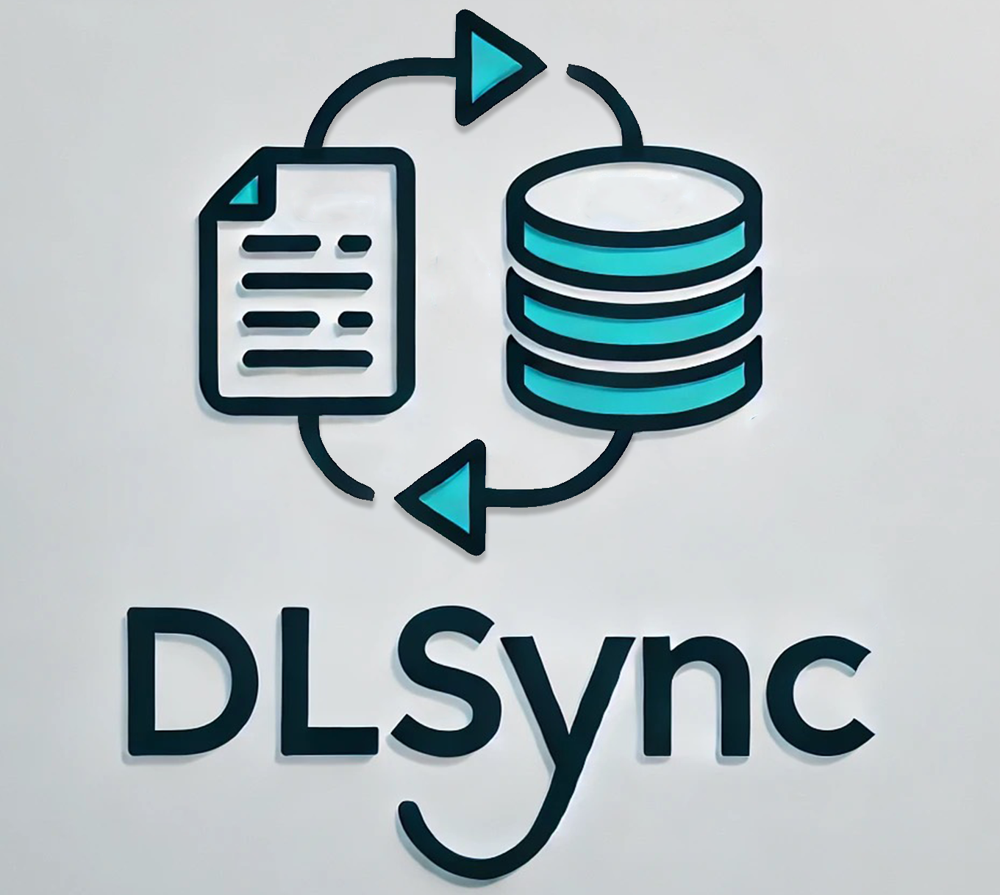
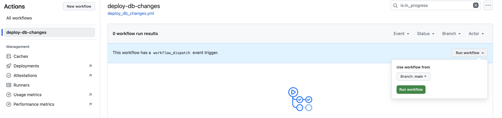
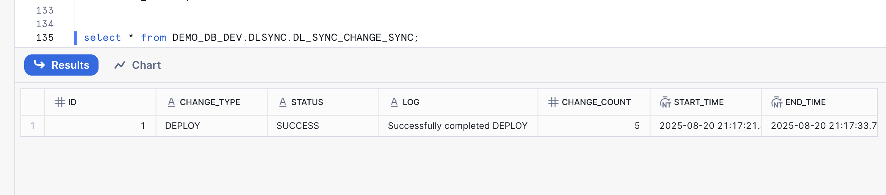
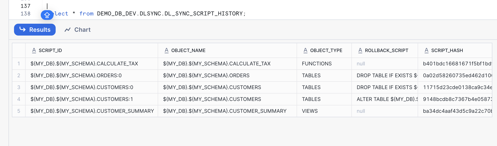

author: Ytbarek Hailu
id: devops-dcm-dlsync-github
categories: snowflake-site:taxonomy/solution-center/certification/quickstart, snowflake-site:taxonomy/product/data-engineering
language: en
summary: Automate Snowflake database change management with DLSync and GitHub Actions by building CI/CD pipelines that leverage declarative and migration-based scripts, unit testing, and multi-environment deployments.
environments: web
status: Published 
feedback link: https://github.com/Snowflake-Labs/dlsync/issues


# DevOps: Database Change Management with DLSync and GitHub
<!-- ------------------------ -->
## Overview



This guide provides step-by-step instructions for building a CI/CD pipeline for Snowflake with GitHub Actions using [DLSync](https://github.com/Snowflake-Labs/dlsync). DLSync is a database change management tool designed to streamline the development and deployment of Snowflake changes. By associating each database object (view, table, UDF, etc.) with a corresponding SQL script file, DLSync tracks every modification, ensuring efficient and accurate updates.

DLSync keeps track of what changes have been deployed to the database by using a hash. This allows DLSync to identify what scripts have changed since the last deployment and only deploy those changed scripts. DLSync also understands interdependencies between different scripts, applying changes in the correct dependency order.

### Key Features

- **Hybrid Change Management**: Combines declarative and migration-based change management
- **Account-Level and Database-Level Objects**: Supports both account-level objects (databases, schemas, roles, warehouses, integrations, etc.) and database-level objects (views, tables, functions, procedures, etc.)
- **Unique Script per Object**: Each object has a corresponding unique script file
- **Unit Testing**: Write and execute test scripts for database objects
- **Change Detection**: Detects changes between the previous deployment and the current script state using hashes
- **Dependency Resolution**: Reorders scripts based on their dependencies before deploying
- **Parametrization**: Supports variables that change between different database instances (dev, staging, prod)
- **Rollback**: Supports rollback to the previous deployment state
- **Verification**: Verifies deployed objects against current scripts to detect out-of-sync changes
- **Script Creation**: Creates script files from existing database objects
- **Plan**: Preview changes before deploying (dry-run)

### Prerequisites

- Familiarity with Snowflake
- Familiarity with Git and GitHub Actions

### What You Will Learn

- A comprehensive overview of DLSync and its capabilities
- How database change management tools like DLSync work with Snowflake
- How to structure DLSync projects with declarative and migration-based scripts
- How to manage account-level and database-level objects
- How to configure parameter profiles for multi-environment deployments
- How to write unit tests for database objects using DLSync
- How to set up Snowflake environments and required privileges for DLSync
- How to configure GitHub Action secrets for secure credential management
- How to create GitHub Actions workflows for automated deployments
- How to use DLSync commands: deploy, test, plan, rollback, verify, and create_script
- How to monitor deployments using DLSync metadata tables

### What You Will Need

1. **Snowflake**
    1. A Snowflake Account ([Create Snowflake trial account](https://signup.snowflake.com/?utm_source=snowflake-devrel&utm_medium=developer-guides&utm_cta=developer-guides)) 
    1. A Snowflake Database and schema (e.g., DEMO_DB.DEMO_SCHEMA)
    1. A Snowflake User with appropriate permissions
1. **GitHub**
    1. A GitHub Account ([Join GitHub](https://github.com/join))
    1. A GitHub Repository ([Create a new repository](https://github.com/new))
1. **Integrated Development Environment (IDE)**
    1. Your favorite IDE with Git integration (e.g., [Visual Studio Code](https://code.visualstudio.com/))
    1. Your project repository cloned to your computer

### What You Will Build

- A CI/CD pipeline for Snowflake in GitHub Actions using DLSync with declarative scripts, migration scripts, unit tests, and multi-environment parameter profiles

> **Note** - DLSync is a community-developed tool, not an official Snowflake offering. It comes with no support or warranty.

<!-- ------------------------ -->
## GitHub Actions Overview

GitHub provides a complete, end-to-end set of software development tools to manage the SDLC, including collaborative coding, automation & CI/CD, security, project management, and more.

GitHub Actions makes it easy to automate all your software workflows, including CI/CD. You can build, test, and deploy your code right from GitHub. This guide will focus on using GitHub Actions for database change management with DLSync.

<!-- ------------------------ -->
## DLSync Overview

DLSync is a database change management tool for Snowflake. It tracks changes to database objects by associating each object with a unique SQL script file.

DLSync categorizes scripts into two types:

- **Declarative Scripts**: Define the desired state of an object using `CREATE OR REPLACE`. When a change is made, DLSync replaces the current object with the updated definition. Used for: VIEWS, FUNCTIONS, PROCEDURES, FILE_FORMATS, PIPES, MASKING_POLICIES, ROW_ACCESS_POLICIES, TAGS, NOTEBOOKS, CORTEX_SEARCH_SERVICES, SEMANTIC_VIEWS, AGENTS, STREAMLITS, RESOURCE_MONITORS, NETWORK_POLICIES, SESSION_POLICIES, PASSWORD_POLICIES, AUTHENTICATION_POLICIES, API_INTEGRATIONS, NOTIFICATION_INTEGRATIONS, SECURITY_INTEGRATIONS, STORAGE_INTEGRATIONS, and WAREHOUSES.

- **Migration Scripts**: Contain versioned, sequential changes applied to an object. Each version is immutable once deployed. Used for: TABLES, SEQUENCES, STAGES, STREAMS, TASKS, ALERTS, DYNAMIC_TABLES, and account-level objects like DATABASES, SCHEMAS, and ROLES.

DLSync also supports:
- **Unit Testing** for Views and UDFs
- **Plan** for previewing changes before deployment (dry-run)
- **Rollback** for reverting to a previous deployment state
- **Verify** for checking deployed objects against current scripts
- **Create Script** for generating script files from existing database objects

For more information, see the [DLSync project page](https://github.com/Snowflake-Labs/dlsync).

<!-- ------------------------ -->
## Project Structure

To use DLSync, create a script root directory containing all scripts and configurations. Here is the directory structure:

```text
/db_scripts
├── /main
│   ├── /ACCOUNT
│   │   ├── /DATABASES
│   │   │   ├── DATABASE_NAME.SQL
│   │   ├── /SCHEMAS
│   │   │   ├── DATABASE_NAME.SCHEMA_NAME.SQL
│   │   ├── /ROLES
│   │   │   ├── ROLE_NAME.SQL
│   │   ├── /WAREHOUSES
│   │   │   ├── WAREHOUSE_NAME.SQL
│   ├── /DEMO_DB
│   │   ├── /DEMO_SCHEMA
│   │   │   ├── /VIEWS
│   │   │   │   ├── CUSTOMER_SUMMARY.SQL
│   │   │   ├── /TABLES
│   │   │   │   ├── CUSTOMERS.SQL
│   │   │   │   ├── ORDERS.SQL
│   │   │   ├── /FUNCTIONS
│   │   │   │   ├── CALCULATE_TAX.SQL
├── /test
│   ├── /DEMO_DB
│   │   ├── /DEMO_SCHEMA
│   │   │   ├── /VIEWS
│   │   │   │   ├── CUSTOMER_SUMMARY_TEST.SQL
│   │   │   ├── /FUNCTIONS
│   │   │   │   ├── CALCULATE_TAX_TEST.SQL
├── config.yml
├── parameter-dev.properties
├── parameter-prod.properties
```

Where:
- **ACCOUNT**: A special directory for account-level objects not scoped to a specific database or schema (DATABASES, SCHEMAS, ROLES, WAREHOUSES, integrations, etc.)
- **DEMO_DB / DEMO_SCHEMA**: The database and schema directories for database-level objects
- **Object type directories**: One of the following: VIEWS, FUNCTIONS, PROCEDURES, FILE_FORMATS, TABLES, SEQUENCES, STAGES, STREAMS, TASKS, STREAMLITS, PIPES, ALERTS, DYNAMIC_TABLES, MASKING_POLICIES, ROW_ACCESS_POLICIES, TAGS, NOTEBOOKS, CORTEX_SEARCH_SERVICES, SEMANTIC_VIEWS, AGENTS
- **config.yml**: Configuration file for DLSync behavior
- **parameter-[profile].properties**: Parameter-to-value map files for each deployment instance (dev, prod, etc.)

> **Note**: Schema object filenames in the ACCOUNT directory should include the database name in the format `database_name.schema_name.sql` (e.g., `DEMO_DB.DEMO_SCHEMA.SQL`).

<!-- ------------------------ -->
## Script Files

Each object has a single SQL file to track changes. The SQL file is named using the object's name and placed in the appropriate directory path.

### Declarative Scripts

Declarative scripts define the current desired state of an object using a `CREATE OR REPLACE` statement. Every time you make a change, DLSync replaces the object with the new definition.

Rules:
1. The file name must match the database object name in the `CREATE OR REPLACE` statement
2. The file should contain only one SQL DDL script
3. For database-level objects, use the fully qualified name (database.schema.object_name)
4. For account-level objects, use the object name without database scope

> **Note**: If the object name is parametrized (e.g., `SAMPLE_${TENANT}_VIEW`), the file name should use the same parameter syntax (e.g., `SAMPLE_${TENANT}_VIEW.SQL`).

Create the view script `main/DEMO_DB/DEMO_SCHEMA/VIEWS/CUSTOMER_SUMMARY.SQL`:
```sql
CREATE OR REPLACE VIEW ${MY_DB}.${MY_SCHEMA}.CUSTOMER_SUMMARY AS
SELECT 
    c.customer_id,
    c.customer_name,
    COUNT(o.order_id) as total_orders,
    SUM(o.order_amount) as total_spent
FROM ${MY_DB}.${MY_SCHEMA}.CUSTOMERS c
LEFT JOIN ${MY_DB}.${MY_SCHEMA}.ORDERS o 
    ON c.customer_id = o.customer_id
GROUP BY c.customer_id, c.customer_name;
```

Create the function script `main/DEMO_DB/DEMO_SCHEMA/FUNCTIONS/CALCULATE_TAX.SQL`:
```sql
CREATE OR REPLACE FUNCTION ${MY_DB}.${MY_SCHEMA}.CALCULATE_TAX(amount NUMBER, country VARCHAR)
RETURNS NUMBER
LANGUAGE SQL
AS
$$
  CASE 
    WHEN country = 'US' THEN amount * 0.08
    WHEN country = 'CA' THEN amount * 0.12
    WHEN country = 'UK' THEN amount * 0.20
    ELSE amount * 0.05
  END
$$;
```

### Migration Scripts

Migration scripts contain versioned, sequential changes applied to an object. Each version is immutable — once deployed, you cannot change it. You can only add new versions.

Each migration version has the following format:
```text
---version: VERSION_NUMBER, author: NAME
CONTENT;
---rollback: ROLLBACK_CONTENT;
---verify: VERIFY_CONTENT;
```

Where:
- `VERSION_NUMBER`: Unique, incremental version number per script file
- `NAME`: Author of the script (optional, for informational purposes)
- `CONTENT`: The DDL or DML statement (must end with `;`)
- `ROLLBACK_CONTENT`: Script to rollback the change (optional, single line, must end with `;`)
- `VERIFY_CONTENT`: Script to verify the change (optional, single line, must end with `;`)

Rules:
1. Each change must be wrapped in the migration format above
2. The migration header starts on a new line with `---` and contains version and author
3. Version numbers must be unique and in incremental order
4. Content goes on a new line after the header and must end with `;`
5. Rollback starts on a new line with `---rollback: ` (single line, ends with `;`)
6. Verify starts on a new line with `---verify:` (single line, ends with `;`)
7. Migration versions are immutable once deployed

Create the table script `main/DEMO_DB/DEMO_SCHEMA/TABLES/CUSTOMERS.SQL`:
```sql
---version: 0, author: demo_user
CREATE OR REPLACE TABLE ${MY_DB}.${MY_SCHEMA}.CUSTOMERS(
    customer_id NUMBER,
    customer_name VARCHAR(100),
    email VARCHAR(100)
);
---rollback: DROP TABLE IF EXISTS ${MY_DB}.${MY_SCHEMA}.CUSTOMERS;
---verify: SELECT * FROM ${MY_DB}.${MY_SCHEMA}.CUSTOMERS LIMIT 1;

---version: 1, author: demo_user
ALTER TABLE ${MY_DB}.${MY_SCHEMA}.CUSTOMERS ADD COLUMN created_date DATE;
---rollback: ALTER TABLE ${MY_DB}.${MY_SCHEMA}.CUSTOMERS DROP COLUMN created_date;
---verify: SELECT created_date FROM ${MY_DB}.${MY_SCHEMA}.CUSTOMERS LIMIT 1;
```

Create the table script `main/DEMO_DB/DEMO_SCHEMA/TABLES/ORDERS.SQL`:
```sql
---version: 0, author: demo_user
CREATE OR REPLACE TABLE ${MY_DB}.${MY_SCHEMA}.ORDERS(
    order_id NUMBER,
    customer_id NUMBER,
    order_amount NUMBER(10,2),
    order_date DATE DEFAULT CURRENT_DATE
);
---rollback: DROP TABLE IF EXISTS ${MY_DB}.${MY_SCHEMA}.ORDERS;
---verify: SELECT * FROM ${MY_DB}.${MY_SCHEMA}.ORDERS LIMIT 1;
```

Create the account-level role script `main/ACCOUNT/ROLES/ANALYST.SQL`:
```sql
---version: 0, author: admin
CREATE OR REPLACE ROLE ANALYST;
---rollback: DROP ROLE IF EXISTS ANALYST;

---version: 1, author: admin
GRANT ROLE ANALYST TO ROLE ACCOUNTADMIN;
---rollback: REVOKE ROLE ANALYST FROM ROLE ACCOUNTADMIN;
```

### Test Scripts

DLSync supports unit testing for Views and UDFs. Test scripts follow a 3-step process:

1. Mock table dependencies using CTEs with the table name as the CTE name
2. Add expected data in a CTE named `EXPECTED_DATA`
3. Add a SELECT statement referencing the database object

Rules:
1. The file name must match the object name with a `_TEST` suffix
2. The file must be placed in the test directory mirroring the same path as the corresponding object script
3. The test script must be a single query with CTE expressions
4. Use the table name as the CTE name to mock data from that table
5. Use `MOCK_DATA` as the CTE name to define input data for UDFs
6. Expected data must be in a CTE named `EXPECTED_DATA`
7. Expected data must have the same schema as the actual data returned by the database object
8. The test script must end with a SELECT statement that selects actual data from the database object

DLSync generates an assertion query that compares `EXPECTED_DATA` with `ACTUAL_DATA` using `EXCEPT` in both directions. If the assertion query returns any rows, the test fails.

Create the view test script `test/DEMO_DB/DEMO_SCHEMA/VIEWS/CUSTOMER_SUMMARY_TEST.SQL`:
```sql
WITH CUSTOMERS AS (
    SELECT * FROM VALUES
        (1, 'John Doe', 'john@example.com'),
        (2, 'Jane Smith', 'jane@example.com')
    AS T(customer_id, customer_name, email)
),
ORDERS AS (
    SELECT * FROM VALUES
        (101, 1, 250.00),
        (102, 1, 100.00),
        (103, 2, 300.00)
    AS T(order_id, customer_id, order_amount)
),
EXPECTED_DATA AS (
    SELECT 
        1 as customer_id, 
        'John Doe' as customer_name, 
        2 as total_orders, 
        350.00 as total_spent
    UNION ALL
    SELECT 
        2 as customer_id, 
        'Jane Smith' as customer_name, 
        1 as total_orders, 
        300.00 as total_spent
)
SELECT * FROM ${MY_DB}.${MY_SCHEMA}.CUSTOMER_SUMMARY;
```

Create the function test script `test/DEMO_DB/DEMO_SCHEMA/FUNCTIONS/CALCULATE_TAX_TEST.SQL`:
```sql
WITH MOCK_DATA AS (
    SELECT * FROM VALUES
        (100.00, 'US'),
        (200.00, 'CA'),
        (300.00, 'UK'),
        (400.00, 'DE')
    AS T(amount, country)
),
EXPECTED_DATA AS (
    SELECT 
        8.00 as expected_tax
    UNION ALL
    SELECT  
        24.00 as expected_tax
    UNION ALL
    SELECT 
        60.00 as expected_tax
    UNION ALL
    SELECT 
        20.00 as expected_tax
)
SELECT 
    ${MY_DB}.${MY_SCHEMA}.CALCULATE_TAX(m.amount, m.country) as calculated_tax
FROM MOCK_DATA m;
```

<!-- ------------------------ -->
## Configuration

### Parameter Profiles

Parameter files define variables that change between deployment instances (dev, staging, prod). They are property files placed in the script root directory with the naming format:

```text
parameter-[profile].properties
```

Where `[profile]` is the instance name (e.g., dev, prod, uat). You provide the profile name via command line or environment variable when running DLSync.

Use parameters in scripts with the `${parameter_name}` syntax.

### Config File

The `config.yml` file configures DLSync behavior and is placed in the script root directory:

```yaml
version: 1.0
configTables:
scriptExclusion:
continueOnFailure: "false"
dependencyOverride:
  - script:
    dependencies:
connection:
    account:
    user:
    password:
    role:
    warehouse:
    db:
    schema:
    authenticator:
    private_key_file:
    private_key_pwd:
```

Where:
- **configTables**: List of configuration tables (used by create_script module to include table data in scripts)
- **scriptExclusion**: List of script files to exclude from deploy, verify, rollback, and create_script
- **continueOnFailure**: `"true"` tries to deploy all items before failing; `"false"` fails on first error
- **dependencyOverride**: Additional dependencies for scripts
- **connection**: Snowflake connection parameters (for local development only)

> **Warning**: Avoid adding connection information to `config.yml` since it is checked into your Git repository. Use environment variables instead for connection details.

For this guide, use a minimal config:

`config.yml`:
```yaml
version: 1.0
continueOnFailure: "false"
```

`parameter-dev.properties`:
```properties
MY_DB=DEMO_DB_DEV
MY_SCHEMA=DEMO_SCHEMA
```

`parameter-prod.properties`:
```properties
MY_DB=DEMO_DB_PROD
MY_SCHEMA=DEMO_SCHEMA_PROD
```

<!-- ------------------------ -->
## DLSync Commands

DLSync provides six main commands. Each requires Snowflake connection parameters via environment variables and the script root directory and profile via command line arguments.

### Environment Variables

```text
account=my_account
db=database
schema=dl_sync
user=user_name
password=password
authenticator=externalbrowser
warehouse=my_warehouse
role=my_role
private_key_file=my_private_key_file.p8
private_key_pwd=my_private_key_password
```

### Deploy

Deploys changes to the database. DLSync identifies changed scripts by comparing hashes, orders them by dependency, and deploys sequentially.

```bash
dlsync deploy --script-root path/to/db_scripts --profile dev
```

To mark scripts as deployed without executing them (useful when migrating from other tools):

```bash
dlsync deploy --only-hashes --script-root path/to/db_scripts --profile dev
```

### Test

Runs unit tests for database objects:

```bash
dlsync test --script-root path/to/db_scripts --profile dev
```

### Plan

Previews changes before deployment without modifying the database (read-only dry-run):

```bash
dlsync plan --script-root path/to/db_scripts --profile dev
```

Example output:
```text
========== DEPLOYMENT PLAN ==========
Total changes to deploy: 2
========== DEPLOYMENT ORDER ==========
1 of 2: MY_DB.MY_SCHEMA.SAMPLE_TABLE
   Type: Migration
   Object: MY_DB.MY_SCHEMA.SAMPLE_TABLE (Version: 1)
   Author: john.doe@company.com
   Hash: a1b2c3d4e5f6g7h8
   Content:
   CREATE TABLE MY_DB.MY_SCHEMA.SAMPLE_TABLE(id VARCHAR, my_column VARCHAR);
========== END CONTENT ==========
2 of 2: MY_DB.MY_SCHEMA.SAMPLE_VIEW
   Type: Declarative
   Object: MY_DB.MY_SCHEMA.SAMPLE_VIEW
   Object Type: VIEW
   Hash: b2c3d4e5f6g7h8i9
   Content:
   CREATE VIEW MY_DB.MY_SCHEMA.SAMPLE_VIEW AS SELECT * FROM MY_DB.MY_SCHEMA.SAMPLE_TABLE;
========== END CONTENT ==========
========== END PLAN ==========
```

### Rollback

Rolls back changes to the previous deployment. Trigger this after rolling back the Git repository of scripts. For declarative scripts, DLSync replaces objects with the current (rolled-back) script. For migration scripts, it uses the rollback statements from the deployed versions that are no longer present.

```bash
dlsync rollback --script-root path/to/db_scripts --profile dev
```

### Verify

Verifies deployed objects are in sync with current scripts. For declarative scripts, it compares script content with the DDL of the database object. For migration scripts, it uses the verify statement from the latest deployed version.

```bash
dlsync verify --script-root path/to/db_scripts --profile dev
```

### Create Script

Creates script files from existing database objects. Useful when migrating from other tools to DLSync.

```bash
dlsync create_script --script-root path/to/db_scripts --profile dev
```

To target specific schemas:

```bash
dlsync create_script --script-root path/to/db_scripts --profile dev --target-schemas schema1,schema2
```

<!-- ------------------------ -->
## DLSync Metadata Tables

DLSync stores deployment metadata in three tables within the database and schema specified in the connection parameters. DLSync creates these tables automatically if they do not exist.

> **Important**: Do not delete or modify these tables. If DLSync cannot find them, it assumes it is running for the first time.

### DL_SYNC_SCRIPT_HISTORY

Stores metadata for script files:

| Column | Description |
|--------|-------------|
| script_id | Declarative: script name; Migration: script name + version number |
| object_name | The object name of the script |
| object_type | The type of the object (VIEWS, TABLES, etc.) |
| rollback_script | The rollback script for the migration version |
| script_hash | The hash of the script file |
| deployed_hash | The hash of the deployed script |
| change_sync_id | The ID of the change sync |
| created_by | The DB user who added this change |
| created_ts | Timestamp when the change was added |
| updated_by | The DB user who updated this change |
| updated_ts | Timestamp when the change was updated |

### DL_SYNC_CHANGE_SYNC

Stores deployment history:

| Column | Description |
|--------|-------------|
| id | The change sync ID |
| change_type | Type of change (DEPLOY, ROLLBACK, VERIFY) |
| status | Status of the change (SUCCESS, FAILED) |
| log | Log output of the change |
| change_count | Number of changes in this sync |
| start_time | Start time of the change |
| end_time | End time of the change |

### DL_SYNC_SCRIPT_EVENT

Stores logs for each script activity:

| Column | Description |
|--------|-------------|
| id | The script event ID |
| script_id | The script ID |
| object_name | The object name |
| script_hash | The hash of the script |
| status | Status (SUCCESS, FAILED) |
| log | Log output |
| changeSyncId | The change sync ID |
| created_by | The DB user who added this change |
| created_ts | Timestamp when the change was added |

<!-- ------------------------ -->
## Setup Snowflake

Before configuring GitHub Actions, set up the necessary Snowflake objects. Connect to your Snowflake account and run the following:

```sql
-- Create the demo role
CREATE ROLE IF NOT EXISTS demo_role;

-- Create the development database and schemas
CREATE DATABASE IF NOT EXISTS demo_db_dev;
CREATE SCHEMA IF NOT EXISTS demo_db_dev.demo_schema;

-- Create DLSync metadata schema
CREATE SCHEMA IF NOT EXISTS demo_db_dev.dlsync;

-- Grant necessary privileges
GRANT ALL PRIVILEGES ON DATABASE demo_db_dev TO ROLE demo_role;
GRANT ALL PRIVILEGES ON SCHEMA demo_db_dev.demo_schema TO ROLE demo_role;
GRANT ALL PRIVILEGES ON SCHEMA demo_db_dev.dlsync TO ROLE demo_role;

-- Grant warehouse usage
GRANT USAGE ON WAREHOUSE DEMO_WH TO ROLE demo_role;

-- Grant the role to your user
GRANT ROLE demo_role TO USER DEMO_USER;
```

### Required Privileges

The Snowflake role must have the following privileges depending on the object types being deployed:

**Warehouse & Database Access:**
- `USAGE` on the warehouse, database, and schemas

**DLSync Schema (Metadata Tracking):**
- `CREATE TABLE` on the DLSync schema (for metadata tables)

**Database-Level Objects:**
- `USAGE` on the target schema
- `CREATE` privileges for each object type being deployed (CREATE VIEW, CREATE FUNCTION, CREATE TABLE, etc.)
- `ALTER` privileges on existing objects
- `SELECT` privileges on tables (for queries and verification)

**Account-Level Objects:**
- `CREATE DATABASE`, `CREATE SCHEMA`, `CREATE ROLE`, `MANAGE GRANTS`, `CREATE WAREHOUSE`, `CREATE INTEGRATION`, `CREATE RESOURCE MONITOR`, `CREATE NETWORK POLICY` as needed

> You may also want to create similar objects for production environments (e.g., `demo_db_prod`).

<!-- ------------------------ -->
## Create Action Secrets

Action Secrets in GitHub securely store values for your CI/CD pipelines. From your repository, go to **Settings > Secrets and variables > Actions**. Add the following secrets:

| Secret name | Secret value |
|-------------|--------------|
| SNOWFLAKE_ACCOUNT | xy12345.east-us-2.azure |
| SNOWFLAKE_USERNAME | DEMO_USER |
| SNOWFLAKE_PASSWORD | ***** |
| SNOWFLAKE_ROLE | DEMO_ROLE |
| SNOWFLAKE_WAREHOUSE | DEMO_WH |

And the following variables under **Settings > Secrets and variables > Actions > Variables**:

| Variable name | Variable value |
|---------------|----------------|
| SNOWFLAKE_DATABASE | DEMO_DB_DEV |
| SNOWFLAKE_SCHEMA | DLSYNC |
| PROFILE | dev |

> **Tip** - For more details on Snowflake connection properties, see the [JDBC Driver connection parameter reference](https://docs.snowflake.com/en/developer-guide/jdbc/jdbc-parameters).

<!-- ------------------------ -->
## Create Actions Workflows

Action Workflows are defined as YAML files in your repository under `.github/workflows`. This guide uses two workflows to separate validation from deployment:

1. **Validate workflow** — runs `plan` and `test` on every pull request targeting `develop` or `main` as mandatory checks
2. **Deploy workflow** — runs `deploy` after changes are pushed to `develop` or `main`

### Validate Workflow (Pull Request)

This workflow runs on pull requests targeting `develop` or `main` and acts as a required status check. Both `plan` and `test` must pass before the PR can be merged.

`.github/workflows/dlsync-validate.yml`:
```yaml
name: validate-db-changes

on:
  pull_request:
    branches:
      - develop
      - main
    paths:
      - 'db_scripts/**'

permissions:
  contents: read
  pull-requests: write

jobs:
  validate-snowflake-changes-job:
    environment: dev
    env:
      PROFILE: ${{ vars.PROFILE }}
      DLSYNC_VERSION: "3.2.0"
    runs-on: ubuntu-latest
    steps:
      - name: Checkout repository
        uses: actions/checkout@v4

      - name: Set up JDK 11
        uses: actions/setup-java@v3
        with:
          java-version: '11'
          distribution: 'temurin'

      - name: Download DLSync JAR
        run: |
          curl -sL -o "$GITHUB_WORKSPACE/dlsync.jar" \
            "https://github.com/Snowflake-Labs/dlsync/releases/download/v${DLSYNC_VERSION}/dlsync-${DLSYNC_VERSION}.jar"

      - name: Run DLSync Plan
        id: plan
        env:
          account: ${{ secrets.SNOWFLAKE_ACCOUNT }}
          user: ${{ secrets.SNOWFLAKE_USERNAME }}
          password: ${{ secrets.SNOWFLAKE_PASSWORD }}
          role: ${{ secrets.SNOWFLAKE_ROLE }}
          warehouse: ${{ secrets.SNOWFLAKE_WAREHOUSE }}
          db: ${{ vars.SNOWFLAKE_DATABASE }}
          schema: ${{ vars.SNOWFLAKE_SCHEMA }}
        run: |
          set -o pipefail
          java -jar "$GITHUB_WORKSPACE/dlsync.jar" \
            plan \
            --script-root "$GITHUB_WORKSPACE/db_scripts" \
            --profile "$PROFILE" 2>&1 | tee /tmp/dlsync-plan.log
          PLAN_OUTPUT=$(sed -n '/DEPLOYMENT PLAN/,/END PLAN/p' /tmp/dlsync-plan.log)
          if [ -z "$PLAN_OUTPUT" ]; then
            PLAN_OUTPUT="No deployment plan changes detected."
          fi
          DELIM=$(uuidgen)
          echo "PLAN_OUTPUT<<$DELIM" >> $GITHUB_ENV
          echo "$PLAN_OUTPUT" >> $GITHUB_ENV
          echo "$DELIM" >> $GITHUB_ENV

      - name: Post Plan Output to PR
        uses: actions/github-script@v7
        with:
          script: |
            const planOutput = process.env.PLAN_OUTPUT;
            const body = `### DLSync Deployment Plan\n\n\`\`\`\n${planOutput}\n\`\`\``;
            const { data: comments } = await github.rest.issues.listComments({
              owner: context.repo.owner,
              repo: context.repo.repo,
              issue_number: context.issue.number,
            });
            const existing = comments.find(c => c.body.startsWith('### DLSync Deployment Plan'));
            if (existing) {
              await github.rest.issues.updateComment({
                owner: context.repo.owner,
                repo: context.repo.repo,
                comment_id: existing.id,
                body,
              });
            } else {
              await github.rest.issues.createComment({
                owner: context.repo.owner,
                repo: context.repo.repo,
                issue_number: context.issue.number,
                body,
              });
            }

      - name: Run DLSync Test
        env:
          account: ${{ secrets.SNOWFLAKE_ACCOUNT }}
          user: ${{ secrets.SNOWFLAKE_USERNAME }}
          password: ${{ secrets.SNOWFLAKE_PASSWORD }}
          role: ${{ secrets.SNOWFLAKE_ROLE }}
          warehouse: ${{ secrets.SNOWFLAKE_WAREHOUSE }}
          db: ${{ vars.SNOWFLAKE_DATABASE }}
          schema: ${{ vars.SNOWFLAKE_SCHEMA }}
        run: |
          set -o pipefail
          java -jar "$GITHUB_WORKSPACE/dlsync.jar" \
            test \
            --script-root "$GITHUB_WORKSPACE/db_scripts" \
            --profile "$PROFILE" 2>&1 | tee /tmp/dlsync-test.log
          DELIM=$(uuidgen)
          echo "TEST_OUTPUT<<$DELIM" >> $GITHUB_ENV
          sed -n '/Started Test module/,$p' /tmp/dlsync-test.log >> $GITHUB_ENV
          echo "$DELIM" >> $GITHUB_ENV

      - name: Post Test Results to PR
        if: always()
        uses: actions/github-script@v7
        with:
          script: |
            const testOutput = process.env.TEST_OUTPUT || 'No test output';
            const body = `### DLSync Test Results\n\n\`\`\`\n${testOutput}\n\`\`\``;
            const { data: comments } = await github.rest.issues.listComments({
              owner: context.repo.owner,
              repo: context.repo.repo,
              issue_number: context.issue.number,
            });
            const existing = comments.find(c => c.body.startsWith('### DLSync Test Results'));
            if (existing) {
              await github.rest.issues.updateComment({
                owner: context.repo.owner,
                repo: context.repo.repo,
                comment_id: existing.id,
                body,
              });
            } else {
              await github.rest.issues.createComment({
                owner: context.repo.owner,
                repo: context.repo.repo,
                issue_number: context.issue.number,
                body,
              });
            }
```

### Deploy Workflow (After Merge)

This workflow runs after changes are pushed to `develop` or merged to `main` and deploys the scripts to Snowflake.

`.github/workflows/dlsync-deploy.yml`:
```yaml
name: deploy-db-changes

on:
  push:
    branches:
      - develop
      - main
    paths:
      - 'db_scripts/**'
  workflow_dispatch:

permissions:
  contents: read

jobs:
  deploy-snowflake-changes-job:
    environment: dev
    env:
      PROFILE: ${{ vars.PROFILE }}
      DLSYNC_VERSION: "3.2.0"
    runs-on: ubuntu-latest
    steps:
      - name: Checkout repository
        uses: actions/checkout@v4

      - name: Set up JDK 11
        uses: actions/setup-java@v3
        with:
          java-version: '11'
          distribution: 'temurin'

      - name: Download DLSync JAR
        run: |
          curl -sL -o "$GITHUB_WORKSPACE/dlsync.jar" \
            "https://github.com/Snowflake-Labs/dlsync/releases/download/v${DLSYNC_VERSION}/dlsync-${DLSYNC_VERSION}.jar"

      - name: Run DLSync Deploy
        env:
          account: ${{ secrets.SNOWFLAKE_ACCOUNT }}
          user: ${{ secrets.SNOWFLAKE_USERNAME }}
          password: ${{ secrets.SNOWFLAKE_PASSWORD }}
          role: ${{ secrets.SNOWFLAKE_ROLE }}
          warehouse: ${{ secrets.SNOWFLAKE_WAREHOUSE }}
          db: ${{ vars.SNOWFLAKE_DATABASE }}
          schema: ${{ vars.SNOWFLAKE_SCHEMA }}
        run: |
          java -jar "$GITHUB_WORKSPACE/dlsync.jar" \
            deploy \
            --script-root "$GITHUB_WORKSPACE/db_scripts" \
            --profile "$PROFILE"
```

### Enable Required Status Checks

To enforce the validate workflow as a mandatory check before merging:

1. Go to **Settings > Branches** in your GitHub repository.
2. Add a branch protection rule for `main`.
3. Enable **Require status checks to pass before merging**.
4. Search for and select the `validate-snowflake-changes-job` check.

This ensures that `plan` and `test` must pass on every pull request before it can be merged, and `deploy` only runs after the merge.

### Commit and Push Changes

After creating or updating your scripts and workflows, commit and push the changes to Git. Open a pull request to trigger the validate workflow, and merge it to trigger the deploy workflow.

<!-- ------------------------ -->
## Run Actions Workflows

### On Pull Request

When you open or update a pull request that modifies files under `db_scripts/`, the **validate-db-changes** workflow runs automatically. Both `plan` and `test` must pass before the PR can be merged.

### On Merge to Main

After changes are pushed to `develop` or merged to `main`, the **deploy-db-changes** workflow runs automatically and deploys the changes to Snowflake. You can also trigger it manually from the **Actions** tab using **Run workflow**.

 

You can view the output of each step, including the DLSync plan, test, and deployment logs.

<!-- ------------------------ -->
## Confirm Deployment

After running the workflow, log into your Snowflake account and confirm:

- New or updated database objects as defined in your scripts
- A new record about the deployment status in `DL_SYNC_CHANGE_SYNC`:



- New or updated records for each object change in `DL_SYNC_SCRIPT_HISTORY`:



- New records in `DL_SYNC_SCRIPT_EVENT` for each operation performed by DLSync

You can query these tables to inspect deployment history:

```sql
SELECT * FROM DEMO_DB_DEV.DLSYNC.DL_SYNC_CHANGE_SYNC ORDER BY START_TIME DESC;
SELECT * FROM DEMO_DB_DEV.DLSYNC.DL_SYNC_SCRIPT_HISTORY;
SELECT * FROM DEMO_DB_DEV.DLSYNC.DL_SYNC_SCRIPT_EVENT ORDER BY CREATED_TS DESC;
```

<!-- ------------------------ -->
## Add More Changes

Add new or updated SQL scripts to your script root directory. DLSync will detect the changes via hash comparison and deploy only the modified scripts.

Update the existing view `db_scripts/main/DEMO_DB/DEMO_SCHEMA/VIEWS/CUSTOMER_SUMMARY.SQL` to include `email` and `avg_order_value`. For declarative scripts, simply edit the file with the new definition — DLSync will replace the object with the updated version:

```sql
CREATE OR REPLACE VIEW ${MY_DB}.${MY_SCHEMA}.CUSTOMER_SUMMARY AS
SELECT 
    c.customer_id,
    c.customer_name,
    c.email,
    COUNT(o.order_id) as total_orders,
    SUM(o.order_amount) as total_spent,
    AVG(o.order_amount) as avg_order_value
FROM ${MY_DB}.${MY_SCHEMA}.CUSTOMERS c
LEFT JOIN ${MY_DB}.${MY_SCHEMA}.ORDERS o 
    ON c.customer_id = o.customer_id
GROUP BY c.customer_id, c.customer_name, c.email;
```

Create a new file `db_scripts/main/DEMO_DB/DEMO_SCHEMA/VIEWS/SALES_REPORT.SQL`:

```sql
CREATE OR REPLACE VIEW ${MY_DB}.${MY_SCHEMA}.SALES_REPORT AS
SELECT 
    DATE_TRUNC('month', o.order_date) as sales_month,
    COUNT(o.order_id) as total_orders,
    SUM(o.order_amount) as total_sales,
    SUM(${MY_DB}.${MY_SCHEMA}.CALCULATE_TAX(o.order_amount, 'US')) as total_tax,
    AVG(o.order_amount) as avg_order_value
FROM ${MY_DB}.${MY_SCHEMA}.ORDERS o
GROUP BY DATE_TRUNC('month', o.order_date)
ORDER BY sales_month DESC;
```

Update the file `db_scripts/main/DEMO_DB/DEMO_SCHEMA/TABLES/ORDERS.SQL` to add a new migration version:
```sql
---version: 0, author: demo_user
CREATE OR REPLACE TABLE ${MY_DB}.${MY_SCHEMA}.ORDERS(
    order_id NUMBER,
    customer_id NUMBER,
    order_amount NUMBER(10,2),
    order_date DATE DEFAULT CURRENT_DATE
);
---rollback: DROP TABLE IF EXISTS ${MY_DB}.${MY_SCHEMA}.ORDERS;
---verify: SELECT * FROM ${MY_DB}.${MY_SCHEMA}.ORDERS LIMIT 1;

---version: 1, author: demo_user
ALTER TABLE ${MY_DB}.${MY_SCHEMA}.ORDERS ADD COLUMN status VARCHAR(20) DEFAULT 'PENDING';
---rollback: ALTER TABLE ${MY_DB}.${MY_SCHEMA}.ORDERS DROP COLUMN status;
---verify: SELECT status FROM ${MY_DB}.${MY_SCHEMA}.ORDERS LIMIT 1;
```

### Commit and Push Changes

Commit and push the changes to a new branch, then open a pull request. The **validate-db-changes** workflow will run `plan` and `test` as mandatory checks. Once the PR is approved and merged, the **deploy-db-changes** workflow will deploy only the changed scripts to Snowflake.

<!-- ------------------------ -->
## Conclusion And Resources

You now have a working Snowflake CI/CD pipeline with DLSync and GitHub Actions. Consider these next steps:

- Extend your workflow to include multiple environments (dev, test, prod) by using different parameter profiles and GitHub environments. See [Workflow syntax for GitHub Actions](https://docs.github.com/en/actions/learn-github-actions/workflow-syntax-for-github-actions).
- Use the `verify` command to check for out-of-sync database objects.
- Use `create_script` to onboard existing database objects into DLSync.
- Incorporate unit testing for all views and UDFs. See the [DLSync documentation](https://github.com/Snowflake-Labs/dlsync).

### What You Learned

- How DLSync manages database changes using hash-based change detection and dependency resolution
- How to structure a DLSync project with declarative scripts, migration scripts, and test scripts
- How to manage account-level and database-level Snowflake objects
- How to configure parameter profiles for multi-environment deployments
- How to use DLSync commands: deploy, test, plan, rollback, verify, and create_script
- How to monitor deployments using DLSync metadata tables
- How to create CI/CD pipelines in GitHub Actions for automated Snowflake deployments

### Related Resources

- [DLSync GitHub Repository](https://github.com/Snowflake-Labs/dlsync)
- [DLSync Technical Guide (Medium)](https://medium.com/snowflake/dlsync-a-modern-way-to-manage-your-snowflake-database-changes-8dc8a1413ae8)
- [GitHub Actions](https://github.com/features/actions)
- [Snowflake JDBC Driver Parameters](https://docs.snowflake.com/en/developer-guide/jdbc/jdbc-parameters)
