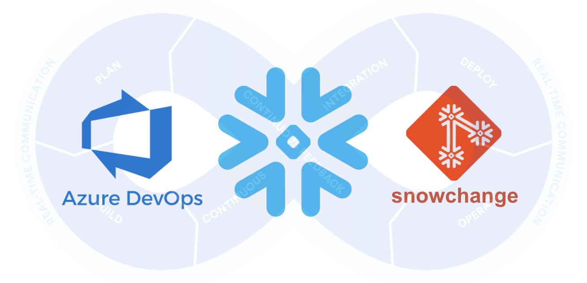
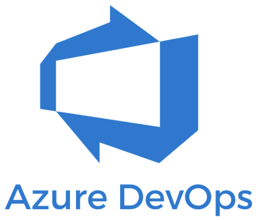
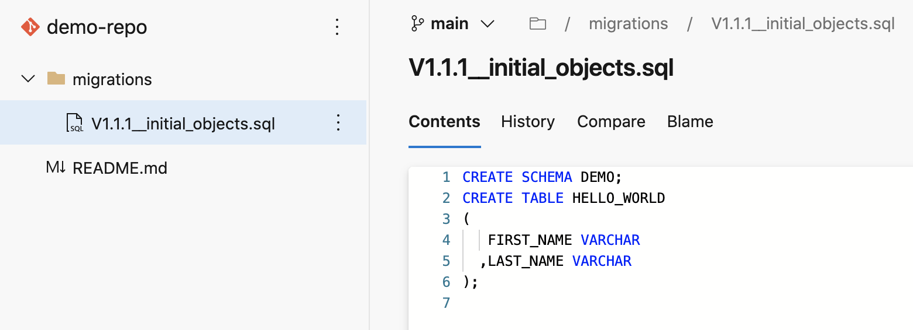
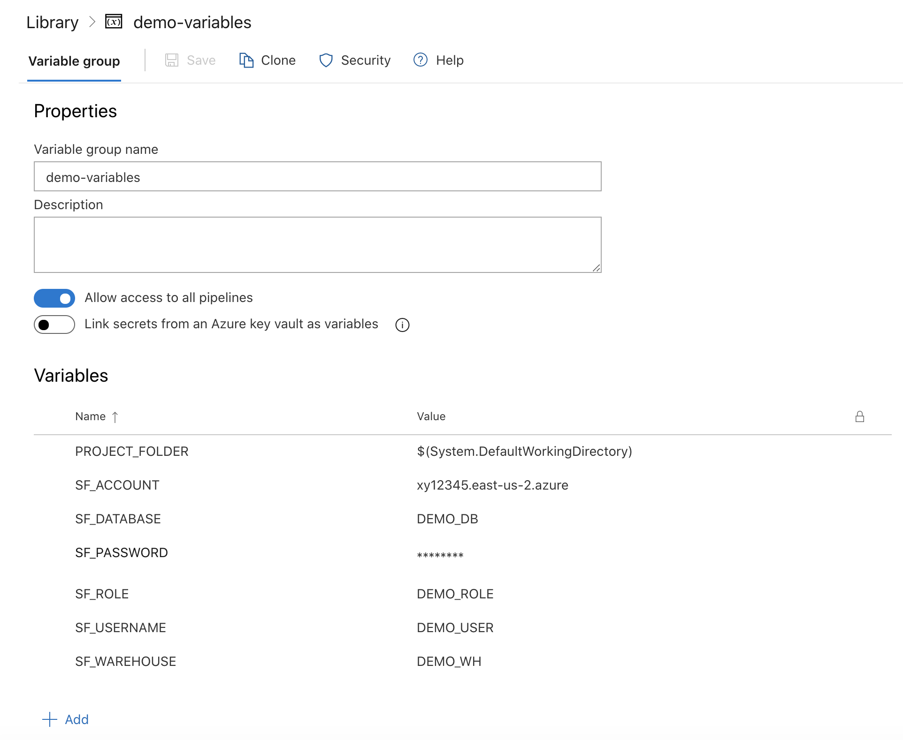

author: Jeremiah Hansen
id: devops_dcm_schemachange_azure_devops
summary: This guide will provide step-by-step details for getting started with DevOps on Snowflake by leveraging schemachange and Azure DevOps
categories: Getting Started
environments: web
status: Published 
feedback link: https://github.com/Snowflake-Labs/sfguides/issues
tags: Getting Started, Data Engineering 

# DevOps: Database Change Management with schemachange and Azure DevOps
<!-- ------------------------ -->
## Overview 
Duration: 2



This guide will provide step-by-step instructions for how to build a simple CI/CD pipeline for Snowflake with Azure DevOps. My hope is that this will provide you with enough details to get you started on your DevOps journey with Snowflake and Azure DevOps.

DevOps is concerned with automating the development, release and maintenance of software applications. As such, DevOps is very broad and covers the entire Software Development Life Cycle (SDLC). The landscape of software tools used to manage the entire SDLC is complex since there are many different required capabilities/tools, including:

- Requirements management
- Project management (Waterfall, Agile/Scrum)
- Source code management (Version Control)
- Build management (CI/CD)
- Test management (CI/CD)
- Release management (CI/CD)

This guide will focus primarily on automated release management for Snowflake by leveraging the Azure Pipelines service from Azure DevOps. Additionally, in order to manage the database objects/changes in Snowflake I will use the schemachange Database Change Management (DCM) tool.
Let’s begin with a brief overview of Azure DevOps and schemachange.

Let’s begin with a brief overview of Azure DevOps and schemachange.

<!-- ------------------------ -->
## Azure DevOps Overview
Duration: 2



“Azure DevOps provides developer services for support teams to plan work, collaborate on code development, and build and deploy applications. Developers can work in the cloud using Azure DevOps Services or on-premises using Azure DevOps Server.” (from Microsoft’s [What is Azure DevOps?](https://docs.microsoft.com/en-us/azure/devops/user-guide/what-is-azure-devops?view=azure-devops))

Azure DevOps provides a complete, end-to-end set of software development tools to manage the SDLC. In particular Azure DevOps provides the following services (from Microsoft’s [What is Azure DevOps?](https://docs.microsoft.com/en-us/azure/devops/user-guide/what-is-azure-devops?view=azure-devops)):

- **Azure Repos** provides Git repositories or Team Foundation Version Control (TFVC) for source control of your code
- **Azure Pipelines** provides build and release services to support continuous integration and delivery of your apps
- **Azure Boards** delivers a suite of Agile tools to support planning and tracking work, code defects, and issues using Kanban and Scrum methods
- **Azure Test** Plans provides several tools to test your apps, including manual/exploratory testing and continuous testing
- **Azure Artifacts** allows teams to share packages such as Maven, npm, NuGet and more from public and private sources and integrate package sharing into your CI/CD pipelines

If you’ve worked with Microsoft products for a while you will know that over time product names evolve. The first version of what is today called Azure DevOps was released on March 17, 2006 as a component of the Visual Studio 2005 Team System under the name Team Foundation Server (TFS). Over the years it has been known by various names including Team Foundation Server (TFS), Visual Studio Online (VSO), Visual Studio Team Services (VSTS), and Azure DevOps. For fun, here is the history of product names from [Wikipedia’s Azure DevOps Server page](https://en.wikipedia.org/wiki/Azure_DevOps_Server#History):

<table>
    <thead>
        <tr>
            <th>Product name</th>
            <th>Form</th>
            <th>Release year</th>
        </tr>
    </thead>
    <tbody>
        <tr>
            <td>Visual Studio 2005 Team System</td>
            <td>On-premises</td>
            <td>2006</td>
        </tr>
        <tr>
            <td>Visual Studio Team System 2008</td>
            <td>On-premises</td>
            <td>2008</td>
        </tr>
        <tr>
            <td>Team Foundation Server 2010</td>
            <td>On-premises</td>
            <td>2010</td>
        </tr>
        <tr>
            <td>Team Foundation Service Preview</td>
            <td>Cloud</td>
            <td>2012</td>
        </tr>
        <tr>
            <td>Team Foundation Server 2012</td>
            <td>On-premises</td>
            <td>2012</td>
        </tr>
        <tr>
            <td>Visual Studio Online</td>
            <td>Cloud</td>
            <td>2013</td>
        </tr>
        <tr>
            <td>Team Foundation Server 2013</td>
            <td>On-premises</td>
            <td>2013</td>
        </tr>
        <tr>
            <td>Team Foundation Server 2015</td>
            <td>On-premises</td>
            <td>2015</td>
        </tr>
        <tr>
            <td>Visual Studio Team Services</td>
            <td>Cloud</td>
            <td>2015</td>
        </tr>
        <tr>
            <td>Team Foundation Server 2017</td>
            <td>On-premises</td>
            <td>2017</td>
        </tr>
        <tr>
            <td>Team Foundation Server 2018</td>
            <td>On-premises</td>
            <td>2017</td>
        </tr>
        <tr>
            <td>Azure DevOps Services</td>
            <td>Cloud</td>
            <td>2018</td>
        </tr>
        <tr>
            <td>Azure DevOps Server 2019</td>
            <td>On-premises</td>
            <td>2019</td>
        </tr>
    </tbody>
</table>

This guide will be focused on the Azure Pipelines service.

<!-- ------------------------ -->
## schemachange Overview
Duration: 2

Database Change Management (DCM) refers to a set of processes and tools which are used to manage the objects within a database. It’s beyond the scope of this post to provide details around the challenges with and approaches to automating the management of your database objects. If you’re interested in more details, please see my blog post [Embracing Agile Software Delivery and DevOps with Snowflake](https://www.snowflake.com/blog/embracing-agile-software-delivery-and-devops-with-snowflake/).

schemachange is a lightweight Python-based tool to manage all your Snowflake objects. It follows an imperative-style approach to database change management (DCM) and was inspired by [the Flyway database migration tool](https://flywaydb.org/). When schemachange is combined with a version control tool and a CI/CD tool, database changes can be approved and deployed through a pipeline using modern software delivery practices.

For more information about schemachange please see [the schemachange project page](https://github.com/Snowflake-Labs/schemachange).

<!-- ------------------------ -->
## Prerequisites
Duration: 2

This post assumes that you have a basic working knowledge of Git repositories. You will need the following things before beginning:

1. **A Snowflake Account.**
1. **A Snowflake Database named DEMO_DB.**
1. **A Snowflake User created with appropriate permissions.** This user will need permission to create objects in the DEMO_DB database.
1. **An Azure DevOps Services Account.** If you don’t already have an Azure DevOps Services account you can create a Basic Plan for free. Click on the “Start free” button on [the Azure DevOps Overview page](https://azure.microsoft.com/en-us/services/devops/).
1. **An Azure DevOps Organization.** If you don’t already have an Organization created, log in to [Azure DevOps](https://dev.azure.com/) and click on the “New organization” link in the left navigation bar.
1. **An Azure DevOps Project.** If you don’t already have a Project created, log in to [Azure DevOps](https://dev.azure.com/), make sure the correct Organization is selected in the left navigation bar, and click on the “+ New project” button near the top right of the window. Keep the default setting for a Private project with Git version control.
1. **An Azure DevOps Git Repository.** A Git repository should have automatically been created in your Project when the Project was created (and by default has the same name as the Project). If you don’t have one, or would like to create a new one, open the Project, click on “Repos” in the left navigation bar, click on the drop down arrow next to the current repository name in the top navigation bar breadcrumbs and click on “+ New repository”.
1. **Your favorite IDE with Git integration.** If you don’t already have a favorite IDE that integrates with Git I would recommend the great, free, open-source [Visual Studio Code](https://code.visualstudio.com/).
1. **Your project repository cloned to your computer.** For connection details about the Git repository in your project, open the Project and click on the “Repos” icon in the left navigation bar. If your repository is empty you will see the options for cloning to your computer. If your repository has files in it already you will see a “Clone” button near the top right of the window which will give you the options.

<!-- ------------------------ -->
## Create Your First Database Migration
Duration: 2

Open up your cloned repository in your favorite IDE and create a folder named “migrations”. In that new folder create a script named “V1.1.1__initial_objects.sql” (make sure there are two underscores after the version number) with the following contents:

```sql
CREATE SCHEMA DEMO;
CREATE TABLE HELLO_WORLD
(
   FIRST_NAME VARCHAR
  ,LAST_NAME VARCHAR
);
```

Then commit the new script and push the changes to your Azure DevOps repository. Assuming you started from an empty repository, initialized with only a README.md file, your repository should look like this:



<!-- ------------------------ -->
## Create a Library Variable Group
Duration: 2

Libraries in the Azure Pipelines service are used to securely store variables and files which will be used in your CI/CD pipelines. In this step we will create a variable group to store all the parameters used by schemachange.

In the left navigation bar, click on “Pipelines” and then “Library”. On the Library page, the Variable groups tab should be selected. Click on the “+ Variable group” button. Name your variable group “**demo-variables**” and add the following variables to the group (adjusting the values as appropriate):

<table>
    <thead>
        <tr>
            <th>Variable name</th>
            <th>Variable value</th>
            <th>Secret?</th>
        </tr>
    </thead>
    <tbody>
        <tr>
            <td>PROJECT_FOLDER</td>
            <td>$(System.DefaultWorkingDirectory)</td>
            <td>No</td>
        </tr>
        <tr>
            <td>SF_ACCOUNT</td>
            <td>xy12345.east-us-2.azure</td>
            <td>No</td>
        </tr>
        <tr>
            <td>SF_USERNAME</td>
            <td>DEMO_USER</td>
            <td>No</td>
        </tr>
        <tr>
            <td>SF_PASSWORD</td>
            <td>*****</td>
            <td>Yes</td>
        </tr>
        <tr>
            <td>SF_ROLE</td>
            <td>DEMO_ROLE</td>
            <td>No</td>
        </tr>
        <tr>
            <td>SF_WAREHOUSE</td>
            <td>DEMO_WH</td>
            <td>No</td>
        </tr>
        <tr>
            <td>SF_DATABASE</td>
            <td>DEMO_DB</td>
            <td>No</td>
        </tr>
    </tbody>
</table>

When you’re finished adding all the variables, don’t forget to click the “Save” icon below the name of the variable group. And for more details on how to structure the account name in SF_ACCOUNT, see the account name discussion in [the Snowflake Python Connector install guide](https://docs.snowflake.com/en/user-guide/python-connector-install.html#step-2-verify-your-installation). Your variable group should look like this:



Note: For an even better solution to managing your secrets, you can leverage Azure Key Vault. See [Link secrets from an Azure key vault](https://docs.microsoft.com/en-us/azure/devops/pipelines/library/variable-groups?view=azure-devops&tabs=yaml#link-secrets-from-an-azure-key-vault) for the details.

<!-- ------------------------ -->
## Create and Run a Deployment Pipeline
Duration: 2

Pipelines in the Azure Pipelines service represent any automated pipeline, which includes both build and release pipelines. In this step we will create a deployment pipeline which will run schemachange and deploy changes to our Snowflake database.

In the left navigation bar, click on “Pipelines” and then “Pipelines”. Click on the “Create Pipeline” button (or “New pipeline” in the upper right if you already have another pipeline defined). On the first “Where is your code?” screen click on “Azure Repos Git”, then select your repository on the next screen. On the “Configure your pipeline” page select “Starter pipeline”. And on the final “Review your pipeline YAML page” copy and paste the following YAML pipeline definition (overwriting the sample pipeline code):

```yaml
# Deploy database changes using schemachange
# https://github.com/Snowflake-Labs/schemachange
# (see https://aka.ms/yaml for the YAML schema reference)
trigger:
  branches:
    include:
    - main
  paths:
    include:
    - /migrations
pool:
  vmImage: 'ubuntu-latest'
variables:
- group: demo-variables
steps:
- task: UsePythonVersion@0
  displayName: 'Use Python 3.8.x'
  inputs:
    versionSpec: '3.8.x'
- task: Bash@3
  inputs:
    targetType: 'inline'
    script: |
      echo 'Starting bash task'
      echo "PROJECT_FOLDER $(PROJECT_FOLDER)"
      python --version
      echo 'Step 1: Installing schemachange'
      pip install schemachange --upgrade
      echo 'Step 2: Running schemachange'
      schemachange -f $(PROJECT_FOLDER)/migrations -a $(SF_ACCOUNT) -u $(SF_USERNAME) -r $(SF_ROLE) -w $(SF_WAREHOUSE) -d $(SF_DATABASE) -c $(SF_DATABASE).SCHEMACHANGE.CHANGE_HISTORY --create-change-history-table
  env:
    SNOWFLAKE_PASSWORD: $(SF_PASSWORD)
```

Finally, click on the “Save and run” near the top right of the window (and on the “Save and run” button in the pop up window). On the pipeline run overview page click on the “Job” job to see the output of each step in the pipeline. In particular, look through the “Bash” step logs to see the output from schemachange.

A few things to point out from the YAML pipeline definition:

- The YAML pipeline definition is saved as a file in your repository. The default name is “azure-pipelines.yml” but that can (and should) be changed when you have multiple pipelines.
- The trigger definition configures the pipeline to automatically run when a change is committed anywhere in the “migrations” folder on the “main” branch of the repository. So any change committed outside of that folder or in a different branch will not automatically trigger the pipeline to run.
- Please note that if you are re-using an existing Azure DevOps Account and Organization your new Project Repository might retain the old “master” branch naming. If so, please update the YAML above (see the “trigger” section).
- We’re using the default Microsoft-hosted Linux agent pool to execute the pipeline.
- The “env” section of the Bash task allows us to set environment variables which will be available to the Bash script. In particular, this allows us to securely pass secret values (like the Snowflake password) to applications/scripts running in the pipeline like schemachange.

Note: Under Pipelines in the left navigation bar you will see both “Pipelines” and “Releases”. In earlier versions of the service build and release pipelines were separate and were created graphically using a UI. While these [classic release pipelines](https://docs.microsoft.com/en-us/azure/devops/pipelines/release/?view=azure-devops) can still be used, Azure DevOps is moving to a single pipeline definition using YAML.

<!-- ------------------------ -->
## Create Your Second Database Migration
Duration: 2

Open up your cloned repository in your favorite IDE and create a script named “V1.1.2__updated_objects.sql” (make sure there are two underscores after the version number) in the same “migrations” folder with the following contents:

```sql
USE SCHEMA DEMO;
ALTER TABLE HELLO_WORLD ADD COLUMN AGE NUMBER;
```

Then commit the new script and push the changes to your Azure DevOps repository. Because of the continuous integration trigger we created in the YAML definition, your pipeline should have automatically started a new run. Open up the pipeline, click on the newest run, then click on the “Job” job to see the output.

<!-- ------------------------ -->
## Conclusion
Duration: 1

So now that you’ve got your first Snowflake CI/CD pipeline set up, what’s next? The software development life cycle, including CI/CD pipelines, gets much more complicated in the real-world. Best practices include adopting a branching strategy, pushing changes through a series of environments, and incorporating a comprehensive testing strategy, to name a few.

### Branching Strategy
Branching strategies can be complex, but there are a few popular ones out there that can help get you started. To begin with I would recommend keeping it simple with [GitHub flow](https://guides.github.com/introduction/flow/) (and see also [an explanation of GitHub flow by Scott Chacon in 2011](http://scottchacon.com/2011/08/31/github-flow.html)). Another simple framework to consider is [GitLab flow](https://about.gitlab.com/blog/2014/09/29/gitlab-flow/).

### Pipeline Stages
In the real-world you will have multiple stages in your build and release pipelines. A simple, helpful way to think about stages in a deployment pipeline is to think about them as environments, such as dev, test, and prod. Your Azure Pipelines YAML definition file can be extended to include a stage for each of your environments. For more details around how to define stages, please refer to [Azure DevOp’s Add stages, dependencies, & conditions page](https://docs.microsoft.com/en-us/azure/devops/pipelines/process/stages?view=azure-devops&tabs=yaml).

### Testing
Testing is an important part of any software development process, and is absolutely critical when it comes to automated software delivery. But testing for databases and data pipelines is complicated and there are many approaches, frameworks, and tools out there. In my opinion, the simplest way to get started testing data pipelines is with [dbt](https://www.getdbt.com/) and the [dbt Test features](https://docs.getdbt.com/docs/building-a-dbt-project/tests/). Another popular Python-based testing tool to consider is [Great Expectations](https://greatexpectations.io/).

With that you should now have a working CI/CD pipeline in Azure DevOps and some helpful ideas for next steps on your DevOps journey with Snowflake. Good luck!
