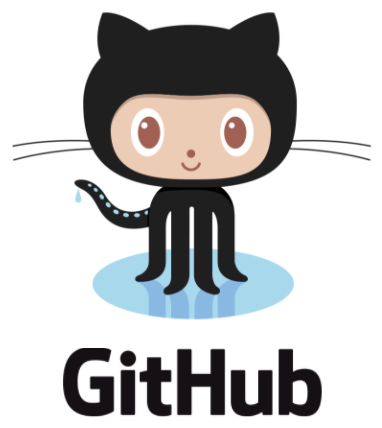
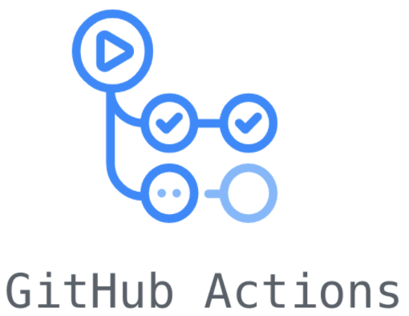
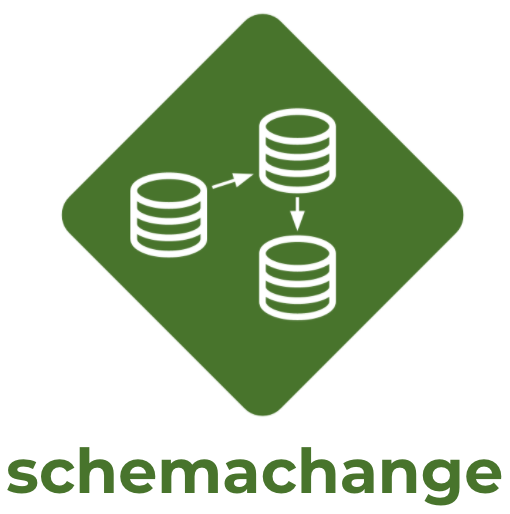

author: Jeremiah Hansen
id: devops_dcm_schemachange_github
summary: This guide will provide step-by-step details for getting started with DevOps on Snowflake by leveraging schemachange and GitHub
categories: Getting Started
environments: web
status: Published 
feedback link: https://github.com/Snowflake-Labs/sfguides/issues
tags: Getting Started, Data Engineering 

# DevOps: Database Change Management with schemachange and GitHub
<!-- ------------------------ -->
## Overview 
Duration: 2

This guide will provide step-by-step instructions for how to build a simple CI/CD pipeline for Snowflake with GitHub Actions. My hope is that this will provide you with enough details to get you started on your DevOps journey with Snowflake and GitHub Actions.

DevOps is concerned with automating the development, release and maintenance of software applications. As such, DevOps is very broad and covers the entire Software Development Life Cycle (SDLC). The landscape of software tools used to manage the entire SDLC is complex since there are many different required capabilities/tools, including:

- Requirements management
- Project management (Waterfall, Agile/Scrum)
- Source code management (Version Control)
- Build management (CI/CD)
- Test management (CI/CD)
- Release management (CI/CD)

This guide will focus primarily on automated release management for Snowflake by leveraging the GitHub Actions service from GitHub. Additionally, in order to manage the database objects/changes in Snowflake I will use the schemachange Database Change Management (DCM) tool.

Let’s begin with a brief overview of GitHub and schemachange.

<!-- ------------------------ -->
## GitHub Overview
Duration: 2

### GitHub
GitHub provides a complete, end-to-end set of software development tools to manage the SDLC. In particular GitHub provides the following services (from GitHub's [Features](https://github.com/features)):

- Collaborative Coding
- Automation & CI/CD
- Security
- Client Apps
- Project Management
- Team Administration
- Community

### GitHub Actions
"GitHub Actions makes it easy to automate all your software workflows, now with world-class CI/CD. Build, test, and deploy your code right from GitHub. Make code reviews, branch management, and issue triaging work the way you want" (from GitHub’s [GitHub Actions](https://github.com/features/actions)). GitHub Actions was [first announced in October 2018](https://github.blog/2018-10-16-future-of-software/) and has since become a popular CI/CD tool. To learn more about GitHub Actions, including migrating from other popular CI/CD tools to GitHub Actions check out [Learn GitHub Actions](https://docs.github.com/en/actions/learn-github-actions).

This guide will be focused on the GitHub Actions service.

<!-- ------------------------ -->
## schemachange Overview
Duration: 2

Database Change Management (DCM) refers to a set of processes and tools which are used to manage the objects within a database. It’s beyond the scope of this post to provide details around the challenges with and approaches to automating the management of your database objects. If you’re interested in more details, please see my blog post [Embracing Agile Software Delivery and DevOps with Snowflake](https://www.snowflake.com/blog/embracing-agile-software-delivery-and-devops-with-snowflake/).

schemachange is a lightweight Python-based tool to manage all your Snowflake objects. It follows an imperative-style approach to database change management (DCM) and was inspired by [the Flyway database migration tool](https://flywaydb.org/). When schemachange is combined with a version control tool and a CI/CD tool, database changes can be approved and deployed through a pipeline using modern software delivery practices.

For more information about schemachange please see [the schemachange project page](https://github.com/Snowflake-Labs/schemachange).

Negative
: **Note** - schemachange is a community-developed tool, not an official Snowflake offering. It comes with no support or warranty.
