author: Adrian Lee
id: devops_dcm_schemachange_jenkins
summary: This is a sample Snowflake Guide
categories: Getting Started
environments: web
status: Published 
feedback link: https://github.com/Snowflake-Labs/sfguides/issues
tags: Getting Started, Data Science, Data Engineering, Twitter 

# DevOps: Database Change Management with schemachange and Jenkins

<!-- ------------------------ -->
## Overview 
Duration: 1

This guide will provide a step-by-step instruction on how to use Jenkins, a very popular CI/CD pipeline tool among developers, for Snowflake in connection with schemachange, dockers and github.  

DevOps is concerned with automating release management as part of the Software Development Lifecycle (SDLC). This guide will be focused on doing automated release management for Snowflake by leveraging on 

- GitHub as our Source Version Control(SVN)
- Jenkins for automating release management (CI/CD)
- Docker to run our schemachange inside Jenkins
- schemachange to perform the Database Change Management (DCM)

Let's begin first with an overview of Jenkins, GitHub and schemachange. 

### Prerequisites
-  This guide assumes that you have an idea on what Jenkins is. If you do not know what Jenkins is, please refer [here](https://www.jenkins.io/)

### What You’ll Learn 
- A brief idea and overview of GitHub
- A brief idea and overview of Jenkins 
- A brief idea and overview of schemachange 
- How does schemachange help in database change management
- How does Jenkins help to create a pipeline for schemachange 
- How do we incorporate containers to easily run Jenkins and schemachange
- How do we have Jenkins serve as a "front-end" for on-demand requests

### What You’ll Need 
You will need the following things before beginning:

1. Snowflake
  1. **A Snowflake Account.**
  1. **A Snowflake Database named DEMO_DB.**
  1. **A Change History table inside the SCHEMACHANGE schema.**
  1. **A Snowflake User created with appropriate permissions.** This user will need permission to create objects in the DEMO_DB database.
1. GitHub
  1. **A GitHub Account.** If you don’t already have a GitHub account you can create one for free. Visit the [Join GitHub](https://github.com/join) page to get started.
  1. **A GitHub Repository.** If you don't already have a repository created, or would like to create a new one, then [Create a new respository](https://github.com/new). For the type, select `Public` (although you could use either). And you can skip adding the README, .gitignore and license for now.
1. Integrated Development Environment (IDE)
  1. **Your favorite IDE with Git integration.** If you don’t already have a favorite IDE that integrates with Git I would recommend the great, free, open-source [Visual Studio Code](https://code.visualstudio.com/).
  1. **Your project repository cloned to your computer.** For connection details about your Git repository, open the Repository and copy the `HTTPS` link provided near the top of the page. If you have at least one file in your repository then click on the green `Code` icon near the top of the page and copy the `HTTPS` link. Use that link in VS Code or your favorite IDE to clone the repo to your computer.
1. Docker
  1. **Docker Desktop on your laptop.**  We will be running Jenkins as a container. Please install docker Desktop on your desired OS by following [this](https://docs.docker.com/desktop/)

### What You’ll Build 

- A simple, working Jenkins pipeline service for Snowflake

<!-- ------------------------ -->
## GitHub Overview
Duration: 2

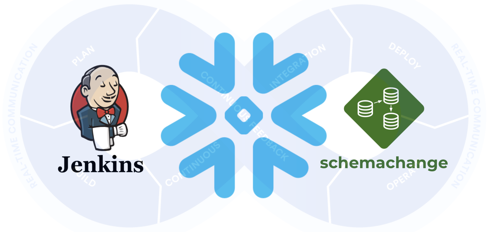

### GitHub
GitHub provides a complete, end-to-end set of software development tools to manage the SDLC. In particular GitHub provides the following services (from GitHub's [Features](https://github.com/features)):

- Collaborative Coding
- Automation & CI/CD
- Security
- Client Apps
- Project Management
- Team Administration
- Community


<!-- ------------------------ -->
## Jenkins Overview
Duration: 2


### Jenkins
Jenkins is an open-source automation tool written in Java with plugins built for Continuous Integration purposes (from Jenkins's [Features](https://www.jenkins.io/doc/)):

- Automation
- Continuous Integration
- Continuous Deployment
- Security

<!-- ------------------------ -->
## schemachange Overview
Duration: 2


Database Change Management (DCM) refers to a set of processes and tools which are used to manage the objects within a database. It’s beyond the scope of this guide to provide details around the challenges with and approaches to automating the management of your database objects. If you’re interested in more details, please see my blog post [Embracing Agile Software Delivery and DevOps with Snowflake](https://www.snowflake.com/blog/embracing-agile-software-delivery-and-devops-with-snowflake/).

schemachange is a lightweight Python-based tool to manage all your Snowflake objects. It follows an imperative-style approach to database change management (DCM) and was inspired by [the Flyway database migration tool](https://flywaydb.org/). When schemachange is combined with a version control tool and a CI/CD tool, database changes can be approved and deployed through a pipeline using modern software delivery practices.

For more information about schemachange please see [the schemachange project page](https://github.com/Snowflake-Labs/schemachange).

Negative
: **Note** - schemachange is a community-developed tool, not an official Snowflake offering. It comes with no support or warranty.


<!-- ------------------------ -->
## Create Your First Database Migration
Duration: 4

In the Snowflake console, run the below sql statements to create the database and the schema history table

```sql
USE DATABASE DEMO_DB;

// create the schema.change_history
CREATE TABLE IF NOT EXISTS SCHEMACHANGE.CHANGE_HISTORY
(
    VERSION VARCHAR
   ,DESCRIPTION VARCHAR
   ,SCRIPT VARCHAR
   ,SCRIPT_TYPE VARCHAR
   ,CHECKSUM VARCHAR
   ,EXECUTION_TIME NUMBER
   ,STATUS VARCHAR
   ,INSTALLED_BY VARCHAR
   ,INSTALLED_ON TIMESTAMP_LTZ
)
```

Open up your cloned repository in your favorite IDE and create a folder named `migrations`. In that new folder create a script named `V1.1.1__initial_objects.sql` (make sure there are two underscores after the version number) with the following contents:

```sql
USE DATABASE DEMO_DB;
CREATE SCHEMA IF NOT EXISTS DEMO_DB.DEMO;
USE SCHEMA DEMO_DB.DEMO;

// create the table hello_world
CREATE TABLE HELLO_WORLD
(
   FIRST_NAME VARCHAR
  ,LAST_NAME VARCHAR
);
```

Then commit the new script and push the changes to your GitHub repository. Assuming you started from an empty repository, your repository should look like this:

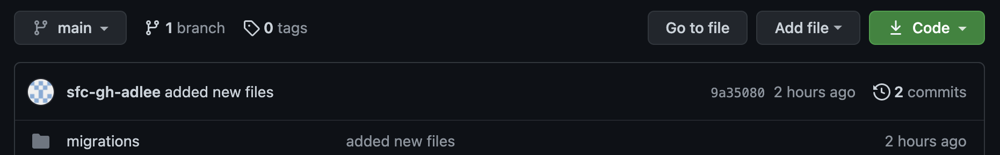

<!-- ------------------------ -->
## Deploying Jenkins
Duration: 5

To deploy Jenkins activate docker desktop on your laptop and run the below command. This will run a Jenkins container on your laptop.

```
docker run -p 8080:8080 \
  -v /var/run/docker.sock:/var/run/docker.sock \
  --name jenkins \
  jenkins/jenkins:lts

```
After which, we will install docker onto the Jenkins container. The purpose of installing docker onto the Jenkins container is so that we can run the schemachange docker image thereafter. 

```
docker exec -it -u root jenkins bash
apt-get update && apt-get install -y docker.io
chmod 666 /var/run/docker.sock
```

Now browse to your url and enter in ```localhost:8080```. Click on the ```installed suggested plugins``` and after installing the plugins, create a user for yourself. In this case we name our user ```admin```. 

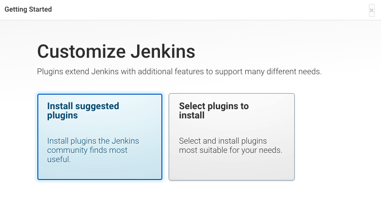
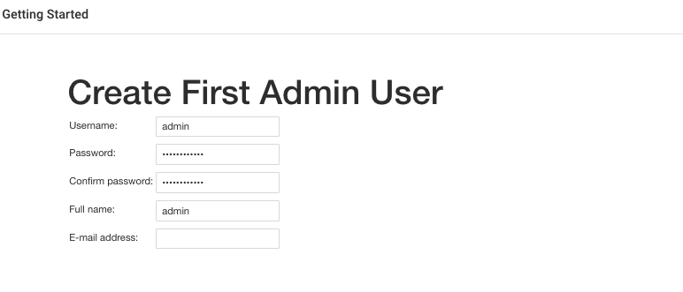

Leave the Instance configuration Jenkins URL as ```http://localhost:8080```. After which, you should now be presented with a Jenkins login page and you can login with the credentials that you had created earlier.

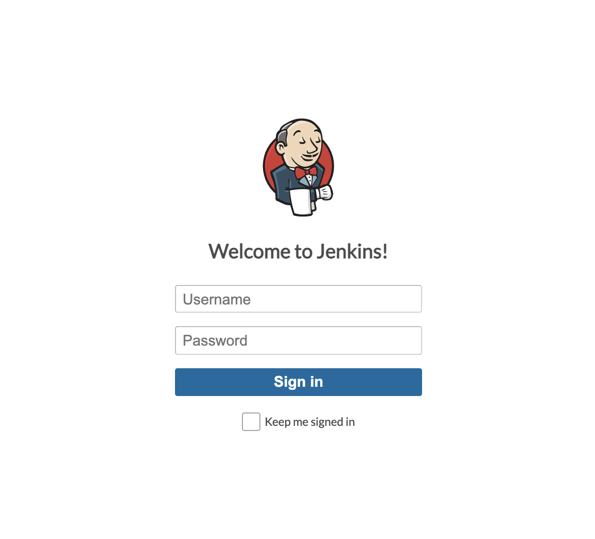

Next we will install the Docker Pipeline plugin for Jenkins. This plugins allows Jenkins Pipeline Projects to build and test using Docker images. Head over to ```Manage Jenkins``` > ```Manage plugins``` and find the ```Docker plugin``` under the avialable plugin tabs as shown below. Click on ```install without restart```. 

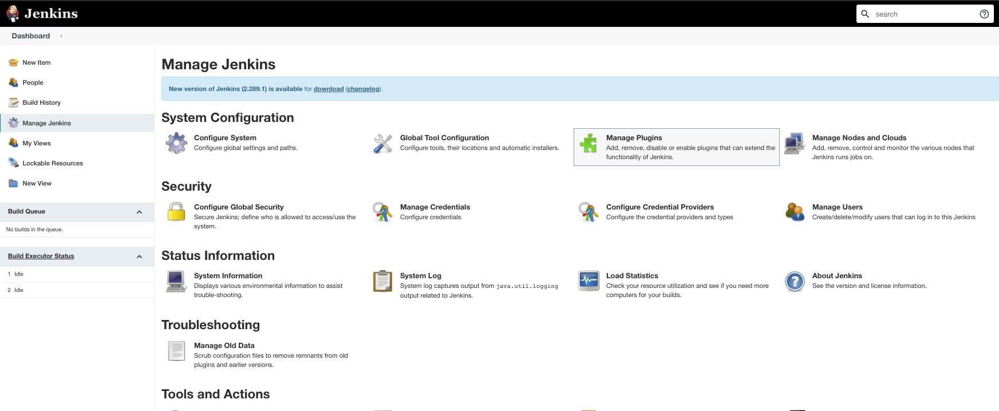
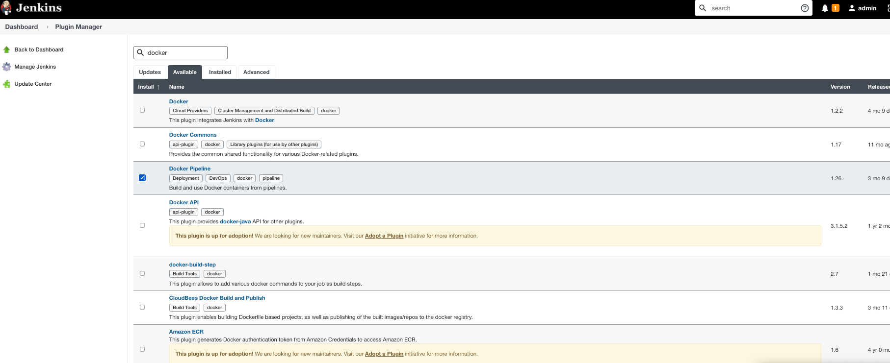

<!-- ------------------------ -->
## Configuring Jenkins pipeline

Login and we are now ready to set up our pipeline in Jenkins. 

First, let us set up our Jenkinsfile and commit to our repository. Toggle back to you IDE and create a Jenkinsfile and place the code below in a file entitled ```Jenkinsfile```

```
pipeline {
    agent { 
        docker { 
            image "python:3.7"
            args '--user 0:0'
        } 
        
    }
    environment {
       SNOWFLAKE_PASSWORD="${SNOWFLAKE_PASSWORD}"
       ROOT_FOLDER="${ROOT_FOLDER}"
       SNOWFLAKE_ACCOUNT="${SNOWFLAKE_ACCOUNT}"
       SNOWFLAKE_USER="${SNOWFLAKE_USER}"
       SNOWFLAKE_ROLE="${SNOWFLAKE_ROLE}"
       SNOWFLAKE_WAREHOUSE="${SNOWFLAKE_WAREHOUSE}"
       SNOWFLAKE_METADATACHANGE="${SNOWFLAKE_METADATACHANGE}"
   }    
    stages {

        stage('Deploying Schemachange') {
            steps {
                sh "pip install schemachange --upgrade && schemachange -f $ROOT_FOLDER -a $SNOWFLAKE_ACCOUNT -u $SNOWFLAKE_USER -r $SNOWFLAKE_ROLE -w $SNOWFLAKE_WAREHOUSE -c $SNOWFLAKE_METADATACHANGE"
            }
        }
    }
}
```

Commit your code to GitHub. It should look like this. 

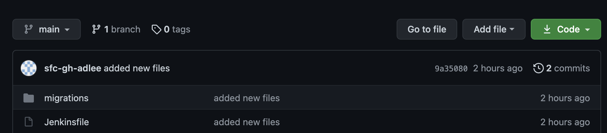

Now take note of your repository url. You can find it under the code button as indicated in the image below. 

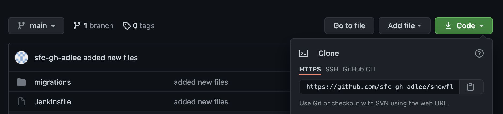

We are ready to set up our Jenkins pipeline in the Jenkins console. To do so, go to ```localhost:8080``` login and create a new pipeline item. We will name this pipeline item as ```schema-jenkins-demo```

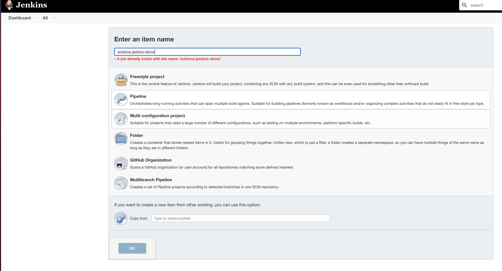

Click on ```configure``` and then on the option ```this project is parameterised```. Click on ```Add Paramter``` and follow the table for the corresponding paramter type, Name and Parameter Type. Leave the ROOT_FOLDER as migrations and the SNOWFLAKE_METADATCHANGE as DEMO_DB.SCHEMACHANGE.CHANGE_HISTORY

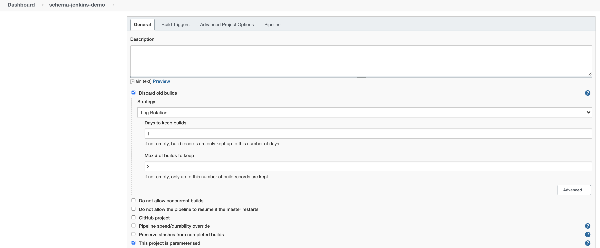

<table>
    <thead>
        <tr>
            <th>Parameter Type</th>
            <th>Parameter name</th>
            <th>Parameter value</th>
        </tr>
    </thead>
    <tbody>
        <tr>
            <td>String Parameter</td>
            <td>SNOWFLAKE_ACCOUNT</td>
            <td>xy12345.apsoutheast-1</td>
        </tr>
        <tr>
            <td>String Parameter</td>
            <td>SNOWFLAKE_USER</td>
            <td>DEMO_USER</td>
        </tr>
        <tr>
            <td>Password Parameter</td>
            <td>SNOWFLAKE_PASSWORD</td>
            <td>*****</td>
        </tr>
        <tr>
            <td>String Parameter</td>
            <td>SNOWFLAKE_ROLE</td>
            <td>DEMO_ROLE</td>
        </tr>
        <tr>
            <td>String Parameter</td>
            <td>SNOWFLAKE_WAREHOUSE</td>
            <td>DEMO_WH</td>
        </tr>
        <tr>
            <td>String Parameter</td>
            <td>ROOT_FOLDER</td>
            <td>migrations</td>
        </tr>
        <tr>
            <td>String Parameter</td>
            <td>SNOWFLAKE_METADATACHANGE</td>
            <td>DEMO_DB.SCHEMACHANGE.CHANGE_HISTORY</td>
        </tr>
    </tbody>
</table>

A sample of a parameter configuration in the Jenkins console is shown in the image below

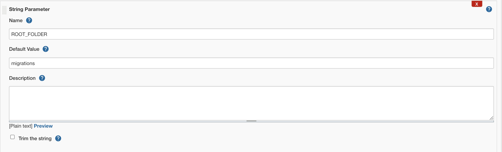

Under the ```Pipeline``` section for Definition, choose ```Pipeline script from SCM``` and then choose ```Git``` under SCM. Input the repository url that we had noted above. Click advanced and for the enter the items for the below parameters

1) Name: ```origin```

2) Refspec: ```+refs/pull/*:refs/remotes/origin/pr/*```

3) Branches to build : leave blank

4) Script Path : ```Jenkinsfile```

5) Uncheck lightweight checkout

If all is good, it should look like this

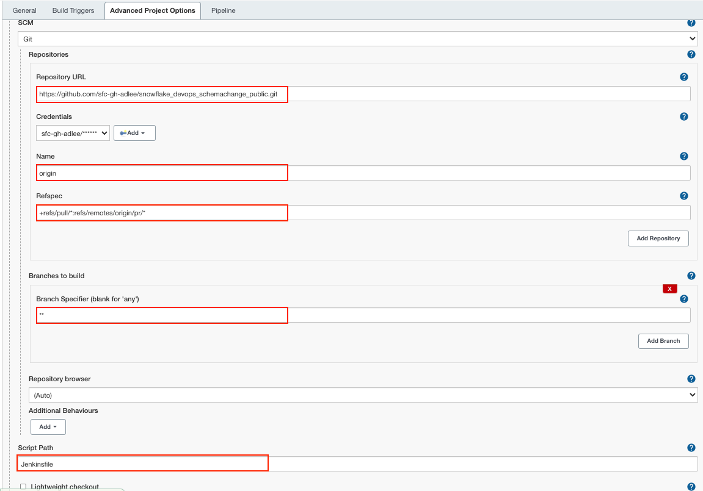


Positive
: **Tip** - If you are using a private GitHub repository, then you would need to input your credentials to your GitHub repository. If not you can just leave the credentials as blank. 

Positive
: **Tip** - I have attached my repsitory here in case you want a [reference](https://github.com/sfc-gh-adlee/snowflake_devops_schemachange_public.git).  

<!-- ------------------------ -->
## Running our Jenkins pipeline

We are now ready to run our Jenkins pipeline. To run the pipeline, click on the ```schema-jenkins-demo``` pipeline and then hit ```build with parameters``` as seen in the image below. 

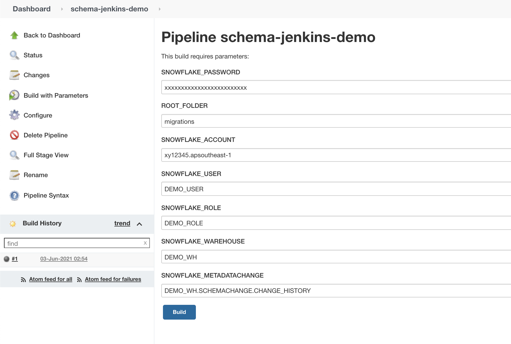

If all goes well, you should see a successful output that indicates the build was successful

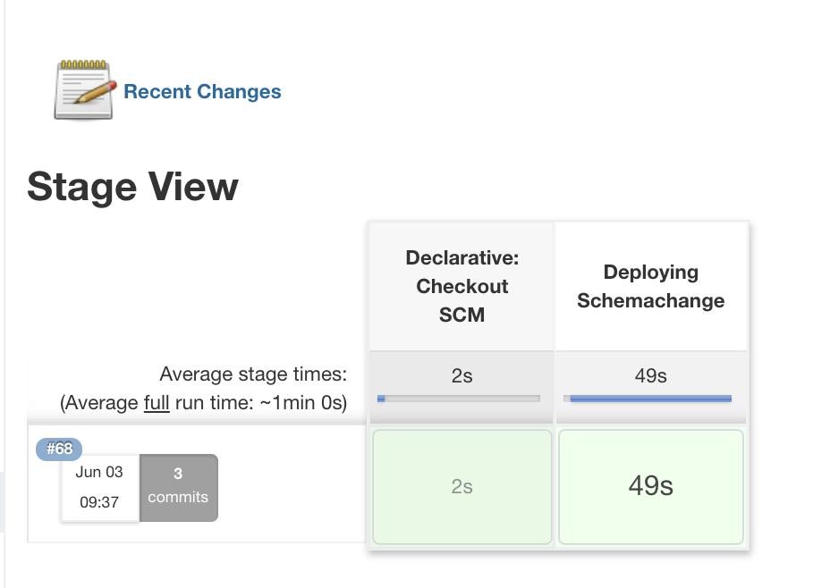

Let us go over to our snowflake portal and you can see that the table ```hello_world``` has been created!

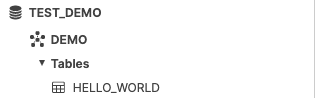

Positive
: **Tip** - As we have deployed Jenkins on a localhost environment, we are not able to configure push and pull requests because it isn't reachable over the public Internet. However, if you choose to deploy in an instance where it is publicly accessible (say in AWS, Azure or GCP), you can follow this guide to configure a GitHub hook trigger for [GITScm] (https://www.blazemeter.com/blog/how-to-integrate-your-github-repository-to-your-jenkins-project)

<!-- ------------------------ -->
## Running a new change in our table with Jenkins pipeline

Now let's introduce a new change into our table. We are going to add in a new column (```middle_name```) into the ```hello_world``` table  we created above. 

Create a new file in the ```migrations``` folder entitled ```V1.1.2__updated_objects.sql.sql```.

Inside ```V1.1.2__updated_objects.sql.sql```, paste in the below sql statement and commit your code. 

```sql
USE DATABASE DEMO_DB;
USE SCHEMA DEMO_DB.DEMO;

// create the table hello_world
ALTER TABLE HELLO_WORLD ADD COLUMN MIDDLE_NAME VARCHAR;

```
Your migrations folder should look like this as shown below. 

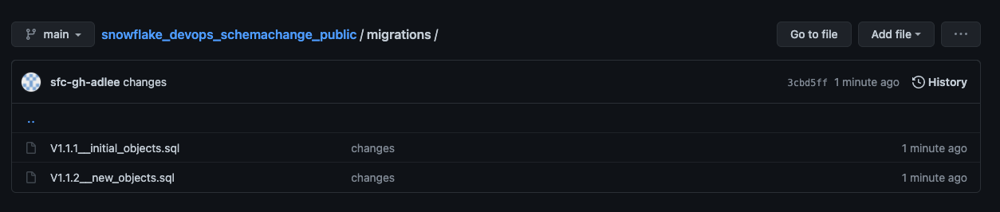

Now, toggle back to the Jenkins url and trigger the pipeline again. You will see that the table has been updated successfully to include in the new column.  


<!-- ------------------------ -->
## Conclusion & Next Steps
Duration: 4

So now that you’ve got your Snowflake CI/CD pipeline set up with Jenkins - one of the most popular open source CI/CD tooling. The software development life cycle, including CI/CD pipelines, gets much more complicated in the real-world. Best practices include pushing changes through a series of environments, adopting a branching strategy, and incorporating a comprehensive testing strategy, to name a few.

#### Pipeline Stages
In the real-world you will have multiple stages in your build and release pipelines. A simple, helpful way to think about stages in a deployment pipeline is to think about them as environments, such as dev, test, and prod. With Jenkins, you can create different pipelines for the corresponding branches as referenced [here](https://www.jenkins.io/doc/book/pipeline/multibranch/).

#### Branching Strategy
Branching strategies can be complex, but there are a few popular ones out there that can help get you started. To begin with I would recommend keeping it simple with [GitHub flow](https://guides.github.com/introduction/flow/) (and see also [an explanation of GitHub flow by Scott Chacon in 2011](http://scottchacon.com/2011/08/31/github-flow.html)). Another simple framework to consider is [GitLab flow](https://about.gitlab.com/blog/2014/09/29/gitlab-flow/).

#### Testing Strategy
Testing is an important part of any software development process, and is absolutely critical when it comes to automated software delivery. But testing for databases and data pipelines is complicated and there are many approaches, frameworks, and tools out there. In my opinion, the simplest way to get started testing data pipelines is with [dbt](https://www.getdbt.com/) and the [dbt Test features](https://docs.getdbt.com/docs/building-a-dbt-project/tests/). Another popular Python-based testing tool to consider is [Great Expectations](https://greatexpectations.io/).

With that you should now have a working CI/CD pipeline in Jenkins and some helpful ideas for next steps on your DevOps journey with Snowflake. Good luck!

### What We've Covered

* A brief history and overview of Jenkins
* A brief history and overview of schemachange
* How database change management tools like schemachange work
* How a simple release pipeline works
* How to create CI/CD pipelines in Jenkins
* Ideas for more advanced CI/CD pipelines with stages
* How to get started with branching strategies
* How to get started with testing strategies

### Related Resources

* [schemachange](https://github.com/Snowflake-Labs/schemachange)
* [Jenkins Pipelines](https://www.jenkins.io/doc/book/pipeline/)