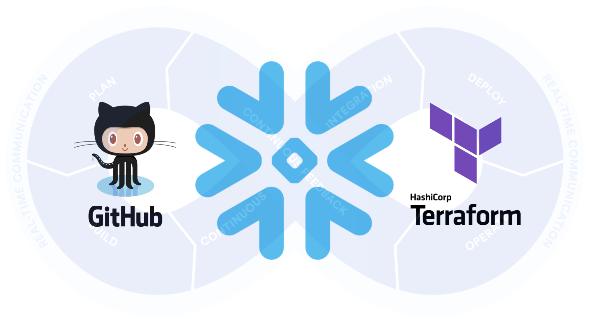
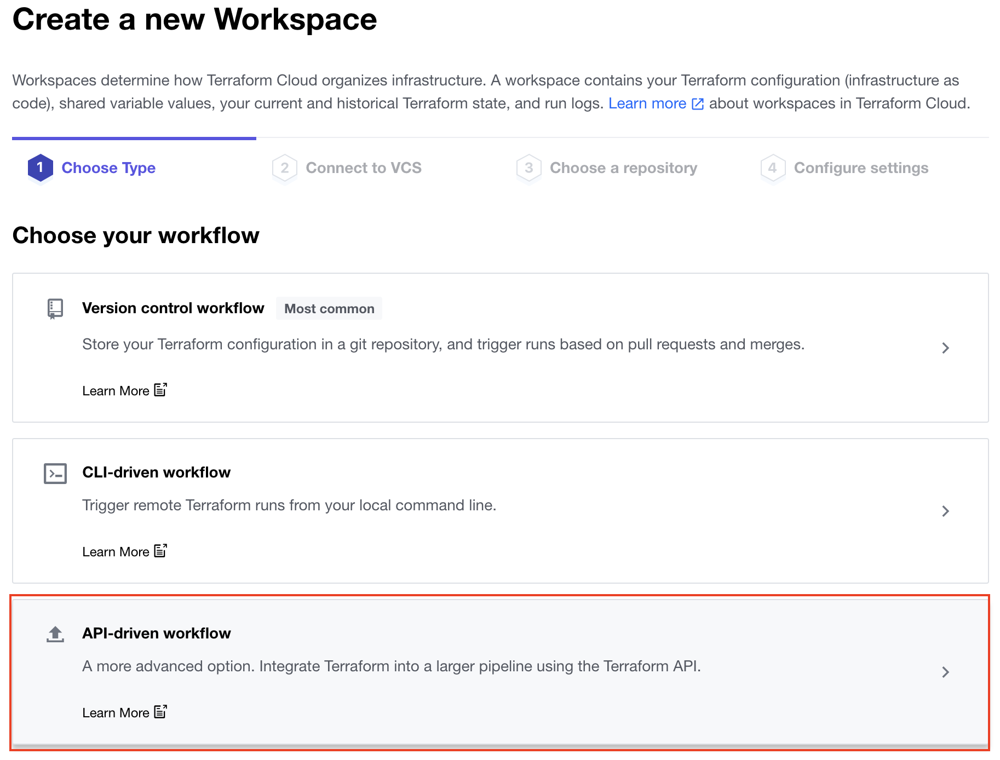
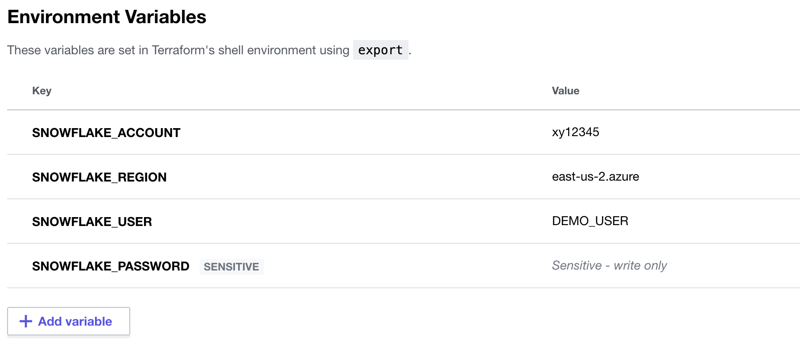
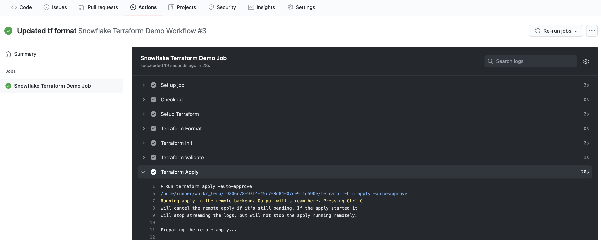
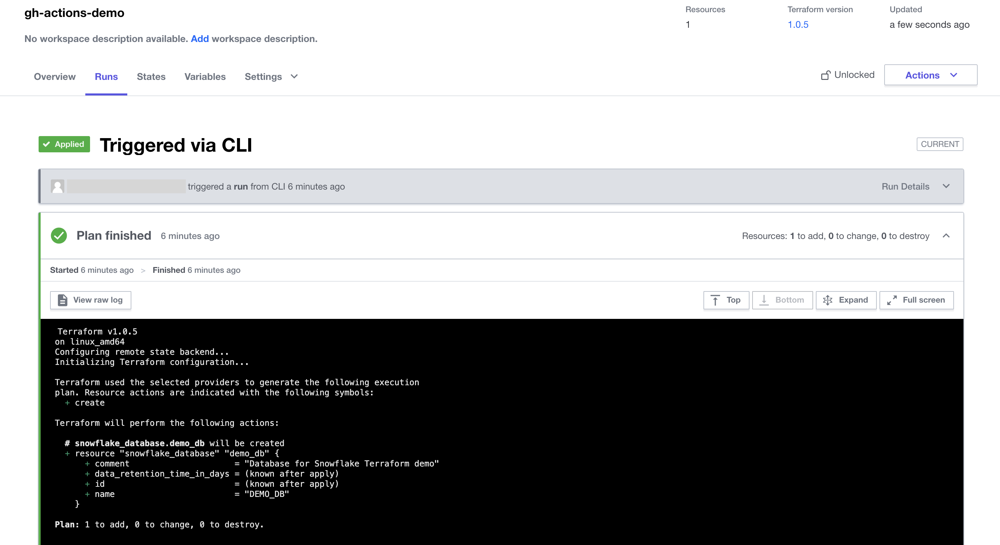

author: Jeremiah Hansen
id: devops_dcm_terraform_github
summary: This quickstart will provide step-by-step details for getting started with DevOps on Snowflake by leveraging Terraform and GitHub
categories: DevOps
environments: web
status: Published 
feedback link: https://github.com/Snowflake-Labs/sfquickstarts/issues
tags: DevOps, Data Engineering

# DevOps: Database Change Management with Terraform and GitHub
<!-- ------------------------ -->
## Overview 
Duration: 2



This quickstart will provide step-by-step instructions for how to build a simple CI/CD pipeline for Snowflake with GitHub Actions and Terraform. My hope is that this will provide you with enough details to get you started on your DevOps journey with Snowflake, GitHub Actions, and Terraform.

DevOps is concerned with automating the development, release and maintenance of software applications. As such, DevOps is very broad and covers the entire Software Development Life Cycle (SDLC). The landscape of software tools used to manage the entire SDLC is complex since there are many different required capabilities/tools, including:

- Requirements management
- Project management (Waterfall, Agile/Scrum)
- Source code management (Version Control)
- Build management (CI/CD)
- Test management (CI/CD)
- Release management (CI/CD)

This quickstart will focus primarily on automated release management for Snowflake by leveraging the GitHub Actions service from GitHub and Terraform for the Database Change Management. Database Change Management (DCM) refers to a set of processes and tools which are used to manage the objects within a database. It’s beyond the scope of this quickstart to provide details around the challenges with and approaches to automating the management of your database objects. If you’re interested in more details, please see my blog post [Embracing Agile Software Delivery and DevOps with Snowflake](https://www.snowflake.com/blog/embracing-agile-software-delivery-and-devops-with-snowflake/).

Positive
: **Tip** - For a more complete introduction to using Terraform with Snowflake, please check out our related quickstart [Terraforming Snowflake](https://quickstarts.snowflake.com/guide/terraforming_snowflake/index.html?index=..%2F..index#0).

Let’s begin with a brief overview of GitHub and Terraform.

### Prerequisites

This quickstart assumes that you have a basic working knowledge of Git repositories.

### What You'll Learn

* A brief history and overview of GitHub Actions
* A brief history and overview of Terraform and Terraform Cloud
* How database change management tools like Terraform work
* How a simple release pipeline works
* How to create CI/CD pipelines in GitHub Actions
* Ideas for more advanced CI/CD pipelines with stages
* How to get started with branching strategies
* How to get started with testing strategies

### What You'll Need

You will need the following things before beginning:

1. Snowflake
  1. **A Snowflake Account.**
  1. **A Snowflake User created with appropriate permissions.** This user will need permission to create databases.
1. GitHub
  1. **A GitHub Account.** If you don’t already have a GitHub account you can create one for free. Visit the [Join GitHub](https://github.com/join) page to get started.
  1. **A GitHub Repository.** If you don't already have a repository created, or would like to create a new one, then [Create a new respository](https://github.com/new). For the type, select `Public` (although you could use either). And you can skip adding the README, .gitignore and license for now.
1. Terraform Cloud
  1. **A Terraform Cloud Account.** If you don't already have a Terraform Cloud account you can create on for free. Visit the [Create an account](https://app.terraform.io/signup/account) page to get started.
1. Integrated Development Environment (IDE)
  1. **Your favorite IDE with Git integration.** If you don’t already have a favorite IDE that integrates with Git I would recommend the great, free, open-source [Visual Studio Code](https://code.visualstudio.com/).
  1. **Your project repository cloned to your computer.** For connection details about your Git repository, open the Repository and copy the `HTTPS` link provided near the top of the page. If you have at least one file in your repository then click on the green `Code` icon near the top of the page and copy the `HTTPS` link. Use that link in VS Code or your favorite IDE to clone the repo to your computer.

### What You'll Build

* A simple, working release pipeline for Snowflake in GitHub Actions

<!-- ------------------------ -->
## GitHub Overview
Duration: 2


### GitHub
GitHub provides a complete, end-to-end set of software development tools to manage the SDLC. In particular GitHub provides the following services (from GitHub's [Features](https://github.com/features)):

- Collaborative Coding
- Automation & CI/CD
- Security
- Client Apps
- Project Management
- Team Administration
- Community


### GitHub Actions
"GitHub Actions makes it easy to automate all your software workflows, now with world-class CI/CD. Build, test, and deploy your code right from GitHub. Make code reviews, branch management, and issue triaging work the way you want" (from GitHub’s [GitHub Actions](https://github.com/features/actions)). GitHub Actions was [first announced in October 2018](https://github.blog/2018-10-16-future-of-software/) and has since become a popular CI/CD tool. To learn more about GitHub Actions, including migrating from other popular CI/CD tools to GitHub Actions check out [Learn GitHub Actions](https://docs.github.com/en/actions/learn-github-actions).

This quickstart will be focused on the GitHub Actions service.

<!-- ------------------------ -->
## Terraform Overview
Duration: 7


### Terraform
[Terraform](https://www.terraform.io/) is an open-source Infrastructure as Code (IaC) tool created by [HashiCorp](https://www.hashicorp.com/) that "allows you to build, change, and version infrastructure safely and efficiently. This includes low-level components such as compute instances, storage, and networking, as well as high-level components such as DNS entries, SaaS features, etc. Terraform can manage both existing service providers and custom in-house solutions." (from [Introduction to Terraform](https://www.terraform.io/intro/index.html)). With Terraform the primary way to describe your infrastructure is by creating human-readble, declarative configuration files using the high-level configuration language known as [HashiCorp Configuration Language (HCL)](https://www.terraform.io/docs/language/index.html).

### Chan Zuckerberg Provider
While Terraform began as an IaC tool it has expanded and taken on many additional use cases (some listed above). Terraform can be extended to support these different uses cases and systems through a [Terraform Provider](https://registry.terraform.io/browse/providers). There is no official, first-party Terraform-managed Provider for Snowflake, but the [Chan Zuckerberg Initiative (CZI)](https://chanzuckerberg.com/) has created a popular [Terraform Provider for Snowflake](https://registry.terraform.io/providers/chanzuckerberg/snowflake/latest).

Please note that this CZI Provider for Snowflake is a community-developed Provider, not an official Snowflake offering. It comes with no support or warranty.

Negative
: **REALLY IMPORTANT** - **Do not use this provider to manage your Snowflake tables.** Currently the CZI Snowflake Provider drops and re-creates a table each time you make changes to it. So when using Terraform with Snowflake use it to create/manage the account level objects (warehouses, roles, integrations, databases, schemas, etc.) and then use a separate DCM tool for most objects within the database schema (tables, views, stored procedures, etc.).

### State Files
Another really important thing to understand about Terraform is how it tracks the state of the resources/objects being managed. Many declarative style tools like this will do a real-time comparison between the objects defined in code and the deployed objects and then figure out what changes are required. But Terraform does not operate in this manner, instead it maintains a State file which keeps track of things. See Terraform's overview of [State](https://www.terraform.io/docs/language/state/index.html) and in particular their discussion of why they chose to require a State file in [Purpose of Terraform State](https://www.terraform.io/docs/language/state/purpose.html).

State files in Terraform introduce a few challenges, the most significant that the State file can get out of sync with the actual deployed objects. This will happen if you use a different process/tool than Terraform to update the deployed object (including making manual changes to the deployed object). The State file can also get out of sync (or corrupted) when multiple developers/process are trying to access it at the same time. See Terraform's [Remote State](https://www.terraform.io/docs/language/state/remote.html) page for recommended solutions, including Terraform Cloud which will be discussed next.

### Terraform Cloud
"Terraform Cloud is HashiCorp’s managed service offering that eliminates the need for unnecessary tooling and documentation to use Terraform in production. Provision infrastructure securely and reliably in the cloud with free remote state storage. As you scale, add workspaces for better collaboration with your team." (from [Why Terraform Cloud?](https://www.terraform.io/cloud))

Some of the key features include (from [Why Terraform Cloud?](https://www.terraform.io/cloud)):
* **Remote state storage**: Store your Terraform state file securely with encryption at rest. Track infrastructure changes over time, and restrict access to certain teams within your organization.
* **Flexible Workflows**: Run Terraform the way your team prefers. Execute runs from the CLI or a UI, your version control system, or integrate them into your existing workflows with an API.
* **Version Control (VCS) integration**: Use version control to store and collaborate on Terraform configurations. Terraform Cloud can automate a run as soon as a pull request is merged into a main branch.
* **Collaborate on infrastructure changes**: Facilitate collaboration on your team. Review and comment on plans prior to executing any change to infrastructure.

<!-- ------------------------ -->
## Setup and Configure Terraform Cloud
Duration: 7

As discussed in the Overview section, you will need to have a Terraform Cloud Account for this quickstart. If you don't already have a Terraform Cloud account you can create on for free. Visit the [Create an account](https://app.terraform.io/signup/account) page to get started. After you create your account you'll be asked to provide an organization name.

Begin by [logging in to your Terraform Cloud account](https://app.terraform.io/). Please note your organization name, we'll need it later. If you've forgotten, you can find your organization name in the top navigation bar and in the URL.

### Create a new Workspace
From the Workspaces page click on the "+ New workspace" button near the top right of the page. On the first page, where it asks you to choose the type of workflow, select "API-driven workflow".



On the second page, where it asks for the "Workspace Name" enter `gh-actions-demo` and then click the "Create workspace" button at the bottom of the page.

### Setup Environment Variables
In order for Terraform Cloud to be able to connect to your Snowflake account you'll need to store the settings in Environment variables. Fortunately, Terraform Cloud makes this easy. From your new workspace homepage click on the "Variables" tab. Then for each variable listed below click on "+ Add variable" button (under the "Environment Variables" section) and enter the name given below along with the appropriate value (adjusting as appropriate).

<table>
    <thead>
        <tr>
            <th>Variable key</th>
            <th>Variable value</th>
            <th>Sensitive?</th>
        </tr>
    </thead>
    <tbody>
        <tr>
            <td>SNOWFLAKE_ACCOUNT</td>
            <td>xy12345</td>
            <td>No</td>
        </tr>
        <tr>
            <td>SNOWFLAKE_REGION</td>
            <td>east-us-2.azure</td>
            <td>No</td>
        </tr>
        <tr>
            <td>SNOWFLAKE_USER</td>
            <td>DEMO_USER</td>
            <td>No</td>
        </tr>
        <tr>
            <td>SNOWFLAKE_PASSWORD</td>
            <td>*****</td>
            <td>Yes</td>
        </tr>
    </tbody>
</table>

Positive
: **Tip** - For more details on the supported arguments please check out the [CZI Terraform Provider for Snowflake documentation](https://registry.terraform.io/providers/chanzuckerberg/snowflake/latest/docs).

When you’re finished adding all the secrets, the page should look like this:



### Create an API Token
The final thing we need to do in Terraform Cloud is to create an API Token so that GitHub Actions can securely authenticate with Terraform Cloud. Click on your user icon near the top right of the screen and then click on "User settings". Then in the left navigation bar click on the user settings page click on the "Tokens" tab.

Click on the "Create an API token" button, give your token a "Description" (like `GitHub Actions`) and then click on the "Create API token" button. Pay careful attention on the next screen. You need to save the API token because once you click on the "Done" button the token **will not be displayed again**. Once you've saved the token, click the "Done" button.


<!-- ------------------------ -->
## Create the Actions Workflow
Duration: 8

### Create Actions Secrets
Action Secrets in GitHub are used to securely store values/variables which will be used in your CI/CD pipelines. In this step we will create secrets to store the API token to Terraform Cloud.

From the repository, click on the "Settings" tab near the top of the page. From the Settings page, click on the "Secrets" tab in the left hand navigation. The "Actions" secrets should be selected.

Click on the "New repository secret" button near the top right of the page. For the secret "Name" enter `TF_API_TOKEN` and for the "Value" enter the API token value you saved from the previous step.

Positive
: **Tip** - For an even better solution to managing your secrets, you can leverage [GitHub Actions Environments](https://docs.github.com/en/actions/reference/environments). Environments allow you to group secrets together and define protection rules for each of your environments.

### Action Workflows
Action Workflows represent automated pipelines, which inludes both build and release pipelines. They are defined as YAML files and stored in your repository in a directory called `.github/workflows`. In this step we will create a deployment workflow which will run Terraform and deploy changes to our Snowflake account.

Positive
: **Tip** - For more details about Action Workflows and runs check out the [Introduction to GitHub Actions](https://docs.github.com/en/actions/learn-github-actions/introduction-to-github-actions) page and the [Workflow syntax for GitHub Actions](https://docs.github.com/en/actions/reference/workflow-syntax-for-github-actions).

- From the repository, click on the "Actions" tab near the top middle of the page.
- Click on the "set up a workflow yourself ->" link (if you already have a workflow defined click on the "new workflow" button and then the "set up a workflow yourself ->" link)
- On the new workflow page
  - Name the workflow `snowflake-terraform-demo.yml`
  - In the "Edit new file" box, replace the contents with the the following:

```yaml
name: "Snowflake Terraform Demo Workflow"

on:
  push:
    branches:
      - main

jobs:
  snowflake-terraform-demo:
    name: "Snowflake Terraform Demo Job"
    runs-on: ubuntu-latest
    steps:
      - name: Checkout
        uses: actions/checkout@v2

      - name: Setup Terraform
        uses: hashicorp/setup-terraform@v1
        with:
          cli_config_credentials_token: ${{ secrets.TF_API_TOKEN }}

      - name: Terraform Format
        id: fmt
        run: terraform fmt -check

      - name: Terraform Init
        id: init
        run: terraform init

      - name: Terraform Validate
        id: validate
        run: terraform validate -no-color

      - name: Terraform Apply
        id: apply
        run: terraform apply -auto-approve
```

Finally, click on the green "Start commit" button near the top right of the page and then click on the green "Commit new file" in the pop up window (you can leave the default comments and commit settings). You'll now be taken to the workflow folder in your repository.

A few things to point out from the YAML pipeline definition:

- The `on:` definition configures the pipeline to automatically run when a change is pushed on the `main` branch of the repository. So any change committed in a different branch will not automatically trigger the workflow to run.
- Please note that if you are re-using an existing GitHub repository it might retain the old `master` branch naming. If so, please update the YAML above (see the `on:` section).
- We’re using the default GitHub-hosted Linux agent to execute the pipeline.

<!-- ------------------------ -->
## Create Your First Database Migration
Duration: 4

Open up your cloned GitHub repository in your favorite IDE and create a new file in the root named `main.tf` with the following contents. *Please be sure to replace the organization name with your Terraform Cloud organization name.*

```terraform
terraform {
  required_providers {
    snowflake = {
      source  = "chanzuckerberg/snowflake"
      version = "0.25.17"
    }
  }

  backend "remote" {
    organization = "my-organization-name"

    workspaces {
      name = "gh-actions-demo"
    }
  }
}

provider "snowflake" {
}

resource "snowflake_database" "demo_db" {
  name    = "DEMO_DB"
  comment = "Database for Snowflake Terraform demo"
}
```

Then commit the new script and push the changes to your GitHub repository. By pushing this commit to our GitHub repository the new workflow we created in the previous step will run automatically.

<!-- ------------------------ -->
## Confirm Changes Deployed to Snowflake
Duration: 5

By now your first database migration should have been successfully deployed to Snowflake, and you should now have a `DEMO_DB` database available. There a few different places that should check to confirm that everything deployed successfully, or to help you debug in the event that an error happened.

### GitHub Actions Log

From your repository in GitHub, click on the "Actions" tab. If everything went well, you should see a successful workflow run listed. But either way you should see the run listed under the "All workflows". To see details about the run click on the run name. From the run overview page you can further click on the job name (it should be `Snowflake Terraform Demo Job`) in the left hand navigation bar or on the node in the yaml file viewer. Here you can browse through the output from the various steps. In particular you might want to review the output from the `Terraform Apply` step.



### Terraform Cloud Log

While you'll generally be able to see all the Terraform output in the GitHub Actions logs, you may need to also view the logs on Terraform Cloud. From your Terraform Cloud Workspace, click on the "Runs" tab. Here you will see each run listed out, and for the purposes of this quickstart, each run here corresponds to a run in GitHub Actions. Click on the run to open it and view the output from the various steps.



### Snowflake Objects

Log in to your Snowflake account and you should see your new `DEMO_DB` database! Additionaly you can review the queries that were executed by Terraform by clicking on the "History" tab at the top of the window.

<!-- ------------------------ -->
## Create Your Second Database Migration
Duration: 2

Now that we've successfully deployed our first change to Snowflake, it's time to make a second one. This time we will add a schema to the `DEMO_DB` and have it deployed through our automated pipeline.

Open up your cloned repository in your favorite IDE and edit the `main.tf` file by appending the following lines to end of the file:

```terraform
resource "snowflake_schema" "demo_schema" {
  database = "DEMO_DB"
  name     = "DEMO_SCHEMA"
  comment  = "Schema for Snowflake Terraform demo"
}
```

Then commit the changes and push them to your GitHub repository. Because of the continuous integration trigger we created in the YAML definition, your workflow should have automatically started a new run. Toggle back to your GitHub and open up the "Actions" page. From there open up the most recent workflow run and view the logs. Go through the same steps you did in the previous section to confirm that the new `DEMO_SCHEMA` has been deployed successfully.

Congratulations, you now have a working CI/CD pipeline with Terraform and Snowflake!

<!-- ------------------------ -->
## Bonus: Advanced Actions Workflow
Duration: 4

In the previous sections we created and tested a simple GitHub Actions workflow with Terraform. This section provides a more advanced workflow that you can test out. This one adds the capability for having Terraform validate and plan a change before it's actually deployed. This pipeline adds CI triggers that cause it to run when a Pull Request (PR) is created/updated. During that process it will run a `terraform plan` and stick the results in the PR itself for easy review. Please give it a try!

```terraform
name: "Snowflake Terraform Demo Workflow"

on:
  push:
    branches:
      - master
  pull_request:

jobs:
  snowflake-terraform-demo:
    name: "Snowflake Terraform Demo Job"
    runs-on: ubuntu-latest
    steps:
      - name: Checkout
        uses: actions/checkout@v2

      - name: Setup Terraform
        uses: hashicorp/setup-terraform@v1
        with:
          cli_config_credentials_token: ${{ secrets.TF_API_TOKEN }}

      - name: Terraform Format
        id: fmt
        run: terraform fmt -check

      - name: Terraform Init
        id: init
        run: terraform init

      - name: Terraform Validate
        id: validate
        run: terraform validate -no-color

      - name: Terraform Plan
        id: plan
        if: github.event_name == 'pull_request'
        run: terraform plan -no-color
        continue-on-error: true

      - uses: actions/github-script@0.9.0
        if: github.event_name == 'pull_request'
        env:
          PLAN: "terraform\n${{ steps.plan.outputs.stdout }}"
        with:
          github-token: ${{ secrets.GITHUB_TOKEN }}
          script: |
            const output = `#### Terraform Format and Style 🖌\`${{ steps.fmt.outcome }}\`
            #### Terraform Initialization ⚙️\`${{ steps.init.outcome }}\`
            #### Terraform Validation 🤖\`${{ steps.validate.outcome }}\`
            #### Terraform Plan 📖\`${{ steps.plan.outcome }}\`
            
            <details><summary>Show Plan</summary>
            
            \`\`\`\n
            ${process.env.PLAN}
            \`\`\`
            
            </details>
            
            *Pusher: @${{ github.actor }}, Action: \`${{ github.event_name }}\`, Working Directory: \`${{ env.tf_actions_working_dir }}\`, Workflow: \`${{ github.workflow }}\`*`;
            
            github.issues.createComment({
              issue_number: context.issue.number,
              owner: context.repo.owner,
              repo: context.repo.repo,
              body: output
            })

      - name: Terraform Plan Status
        if: steps.plan.outcome == 'failure'
        run: exit 1

      - name: Terraform Apply
        if: github.ref == 'refs/heads/master' && github.event_name == 'push'
        run: terraform apply -auto-approve
```

<!-- ------------------------ -->
## Conclusion & Next Steps
Duration: 4

So now that you’ve got your first Snowflake CI/CD pipeline set up, what’s next? The software development life cycle, including CI/CD pipelines, gets much more complicated in the real-world. Best practices include pushing changes through a series of environments, adopting a branching strategy, and incorporating a comprehensive testing strategy, to name a few.

#### Pipeline Stages
In the real-world you will have multiple stages in your build and release pipelines. A simple, helpful way to think about stages in a deployment pipeline is to think about them as environments, such as dev, test, and prod. Your GitHub Actions workflow can be extended to include a stage for each of your environments. For more details around how to work with environments, please refer to [Environments](https://docs.github.com/en/actions/reference/environments) in GitHub.

#### Branching Strategy
Branching strategies can be complex, but there are a few popular ones out there that can help get you started. To begin with I would recommend keeping it simple with [GitHub flow](https://guides.github.com/introduction/flow/) (and see also [an explanation of GitHub flow by Scott Chacon in 2011](http://scottchacon.com/2011/08/31/github-flow.html)). Another simple framework to consider is [GitLab flow](https://about.gitlab.com/blog/2014/09/29/gitlab-flow/).

#### Testing Strategy
Testing is an important part of any software development process, and is absolutely critical when it comes to automated software delivery. But testing for databases and data pipelines is complicated and there are many approaches, frameworks, and tools out there. In my opinion, the simplest way to get started testing data pipelines is with [dbt](https://www.getdbt.com/) and the [dbt Test features](https://docs.getdbt.com/docs/building-a-dbt-project/tests/). Another popular Python-based testing tool to consider is [Great Expectations](https://greatexpectations.io/).

With that you should now have a working CI/CD pipeline in GitHub Actions and some helpful ideas for next steps on your DevOps journey with Snowflake. Good luck!

### What We've Covered

* A brief history and overview of GitHub Actions
* A brief history and overview of Terraform and Terraform Cloud
* How database change management tools like Terraform work
* How a simple release pipeline works
* How to create CI/CD pipelines in GitHub Actions
* Ideas for more advanced CI/CD pipelines with stages
* How to get started with branching strategies
* How to get started with testing strategies

### Related Resources

* [Terraform](https://www.terraform.io/)
* [Chan Zuckerberg Terraform Provider for Snowflake](https://registry.terraform.io/providers/chanzuckerberg/snowflake/latest)
* [Terraforming Snowflake Quickstart](https://quickstarts.snowflake.com/guide/terraforming_snowflake/index.html?index=..%2F..index#0)
* [GitHub Actions](https://github.com/features/actions)
