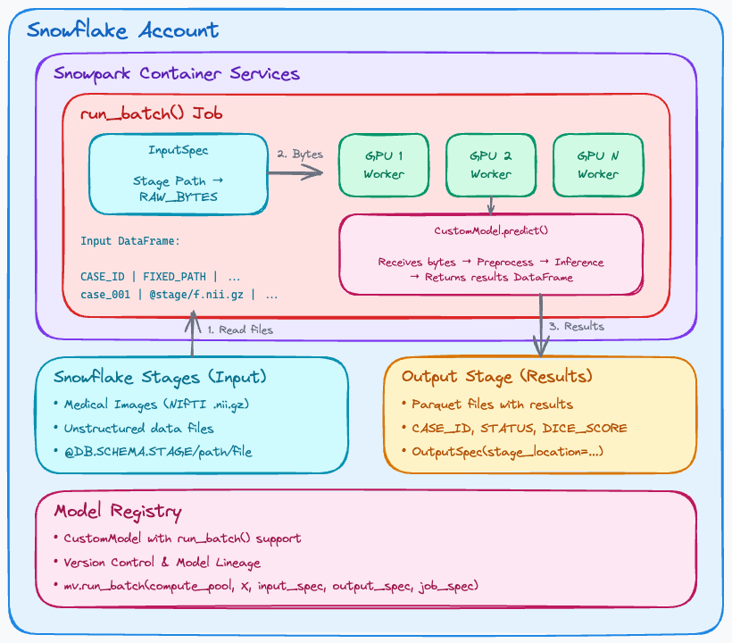
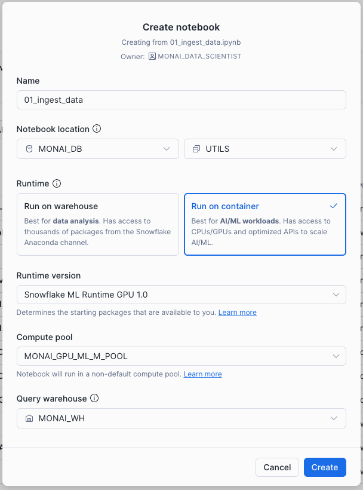
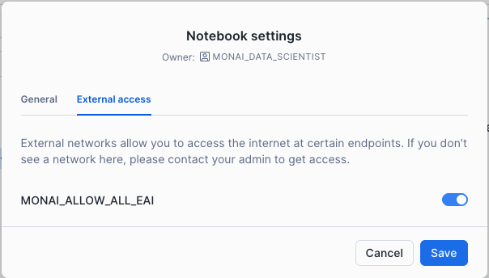
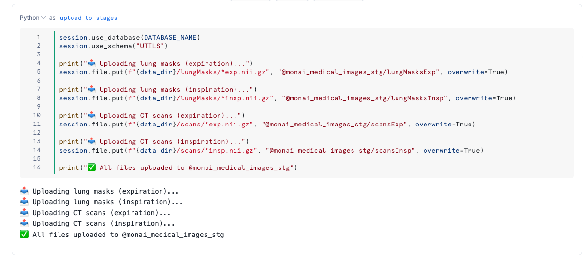
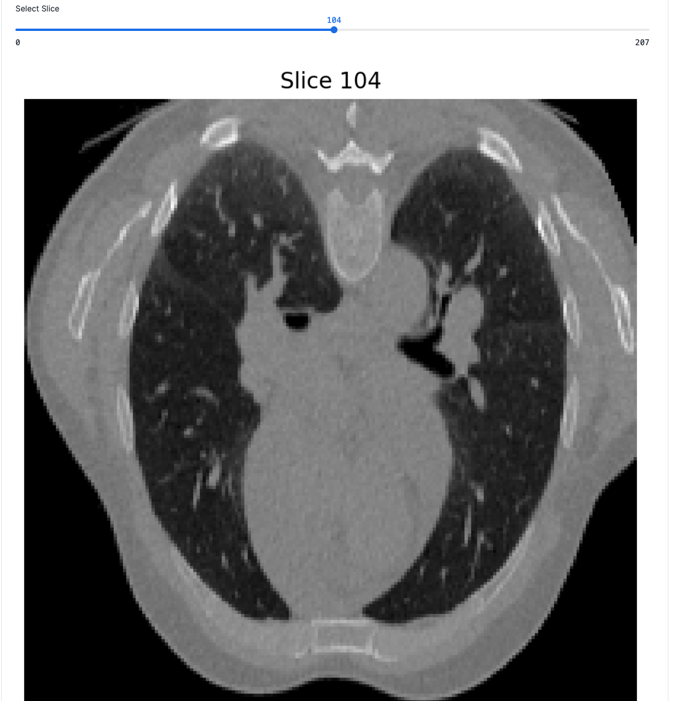
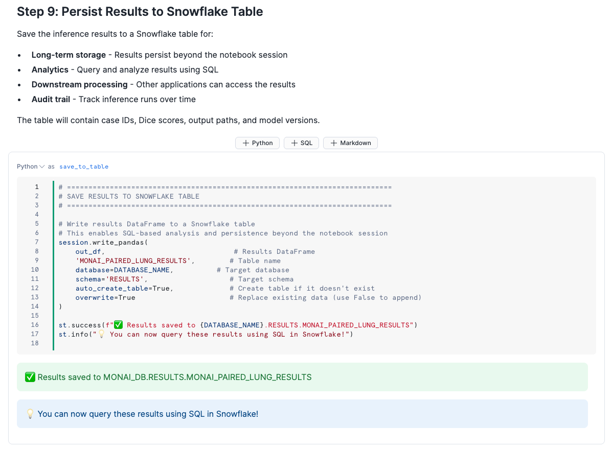

author: Carlos Guzman, Jeevan Rag, Joviane Bellegarde
id: distributed-medical-image-processing-with-monai
summary: Build a distributed medical image registration pipeline using MONAI on Snowflake's Container Runtime with GPU acceleration
categories: snowflake-site:taxonomy/solution-center/certification/quickstart, snowflake-site:taxonomy/solution-center/certification/certified-solution, snowflake-site:taxonomy/industry/healthcare-and-life-sciences, snowflake-site:taxonomy/product/ai, snowflake-site:taxonomy/snowflake-feature/model-development, snowflake-site:taxonomy/snowflake-feature/snowpark-container-services
environments: web
language: en
status: Published
feedback link: https://github.com/Snowflake-Labs/sfguides/issues
tags: Getting Started, MONAI, Medical Imaging, GPU, Container Runtime, Ray, ML, Deep Learning
fork repo link: https://github.com/Snowflake-Labs/sfguide-distributed-medical-image-processing-with-monai

# Distributed Medical Image Processing with MONAI on Snowflake

## Overview

Medical image registration is a critical task in healthcare AI, enabling the alignment of CT scans taken at different times or breathing phases. This guide demonstrates how to build a production-ready distributed training and inference pipeline using **MONAI** (Medical Open Network for AI) on **Snowflake's Container Runtime with GPU acceleration**.

In this Guide, you will build a complete medical image registration system that:
- Downloads and processes lung CT scans from public datasets
- Trains a LocalNet deep learning model using distributed Ray computing
- Registers the trained model in Snowflake's Model Registry
- Runs distributed inference across multiple GPUs

### What You Will Build
- Data ingestion pipeline for NIfTI medical images
- Distributed training system using Ray and MONAI
- Model registration workflow with Snowflake Model Registry
- Distributed inference pipeline with parallel processing
- Results table with registration quality metrics

### What You Will Learn
- How to use Snowflake Container Runtime Notebooks with GPU compute pools
- How to integrate MONAI medical imaging framework with Snowflake
- How to leverage Ray for distributed deep learning workloads
- How to use Snowflake Model Registry for ML model management
- How to store and retrieve medical images from Snowflake stages

### Prerequisites
- Familiarity with Python and deep learning concepts
- Familiarity with medical imaging (helpful but not required)
- A Snowflake account with access to Container Runtime and GPU compute pools
- Go to the [Snowflake](https://signup.snowflake.com/?utm_source=snowflake-devrel&utm_medium=developer-guides&utm_cta=developer-guides) sign-up page and register for a free account

<!-- ------------------------ -->
## Architecture Overview

### Solution Architecture

The MONAI medical image processing solution consists of three notebooks running on Snowflake Container Runtime with GPU acceleration:

1. **Data Ingestion** (`01_ingest_data.ipynb`)
   - Downloads paired lung CT scans from public dataset
   - Uploads NIfTI files to encrypted Snowflake stages
   
2. **Model Training** (`02_model_training.ipynb`)
   - Initializes Ray cluster for distributed computing
   - Trains LocalNet registration model
   - Saves checkpoints to Snowflake stages
   - Registers model in Snowflake Model Registry

3. **Model Inference** (`03_model_inference.ipynb`)
   - Loads model from Model Registry
   - Runs distributed inference across GPUs
   - Saves registered images and metrics to Snowflake

### Key Technologies

| Technology | Purpose |
|------------|---------|
| **MONAI** | Medical imaging transforms, networks, and losses |
| **Ray** | Distributed computing across GPU nodes |
| **PyTorch** | Deep learning framework |
| **Snowflake Container Runtime** | GPU-accelerated notebook execution |
| **Snowflake Model Registry** | Model versioning and deployment |

<!-- ------------------------ -->
## Setup Snowflake Environment

In this step, you'll create all the Snowflake objects needed for the MONAI solution.

### Step 1: Create Database Objects

1. In Snowsight, click `Projects`, then `Workspaces` in the left navigation, or [click here](https://app.snowflake.com/_deeplink/#/workspaces?utm_source=quickstart&utm_medium=quickstart&utm_campaign=-us-en-all&utm_content=app-distributed-medical-image-processing-with-monai) to go there directly
2. Click `+ Add new` to create a new Workspace
3. Click `SQL File` to create a new SQL file
4. Copy the setup script from [setup.sql](https://github.com/Snowflake-Labs/sfguide-distributed-medical-image-processing-with-monai/blob/main/scripts/setup.sql) and paste it into your SQL file

### Step 2: Run Infrastructure Setup (Sections 1-7)

Run the first part of the setup script to create:
- **Role**: `MONAI_DATA_SCIENTIST` with appropriate privileges
- **Warehouse**: `MONAI_WH` (SMALL size)
- **Database**: `MONAI_DB` with `UTILS` and `RESULTS` schemas
- **Stages**: `NOTEBOOK`, `MONAI_MEDICAL_IMAGES_STG`, `RESULTS_STG`
- **Network Rule + External Access Integration**: For pip install
- **GPU Compute Pool**: `MONAI_GPU_ML_M_POOL` (GPU_NV_M instances)

### Step 3: Import Notebooks

Download each notebook from GitHub:
- [01_ingest_data.ipynb](https://github.com/Snowflake-Labs/sfguide-distributed-medical-image-processing-with-monai/blob/main/notebooks/01_ingest_data.ipynb)
- [02_model_training.ipynb](https://github.com/Snowflake-Labs/sfguide-distributed-medical-image-processing-with-monai/blob/main/notebooks/02_model_training.ipynb)
- [03_model_inference.ipynb](https://github.com/Snowflake-Labs/sfguide-distributed-medical-image-processing-with-monai/blob/main/notebooks/03_model_inference.ipynb)

Then import each notebook into Snowflake:

1. In Snowsight, navigate to `Projects` → `Notebooks`, or [click here](https://app.snowflake.com/_deeplink/#/notebooks?utm_source=quickstart&utm_medium=quickstart&utm_campaign=-us-en-all&utm_content=app-distributed-medical-image-processing-with-monai) to go there directly
2. Click the dropdown arrow on **+ Notebook** and select **Import .ipynb file**
3. Upload a notebook file and configure:
   - **Name**: Keep the default (e.g., `01_ingest_data`)
   - **Notebook location**: `MONAI_DB` / `UTILS`
   - **Runtime**: Select **Run on container**
   - **Runtime version**: Select a GPU runtime
   - **Compute pool**: `MONAI_GPU_ML_M_POOL`
   - **Query warehouse**: `MONAI_WH`
4. Click **Create**

5. After the notebook opens, click the **⋮** menu → **Notebook settings**
6. Click the **External access** tab
7. Toggle **ON** the `MONAI_ALLOW_ALL_EAI` integration and click **Save**

8. Repeat steps 2-7 for all 3 notebooks

<!-- ------------------------ -->
## Run Data Ingestion Notebook

### Step 1: Open the Notebook

1. In Snowsight, navigate to `Projects` → `Notebooks`, or [click here](https://app.snowflake.com/_deeplink/#/notebooks?utm_source=quickstart&utm_medium=quickstart&utm_campaign=-us-en-all&utm_content=app-distributed-medical-image-processing-with-monai) to go there directly
2. Find `MONAI_01_INGEST_DATA` in the `MONAI_DB.UTILS` schema
3. Click to open the notebook

### Step 2: Start Container Runtime

1. Click the **Start** button in the top-right corner
2. Wait for the Container Runtime to initialize (this may take 2-3 minutes on first run)
3. You should see the notebook kernel become active

### Step 3: Install Dependencies and Restart Kernel

1. Run the **install_monai** cell (`!pip install monai`) to install the MONAI library
2. A "Kernel restart may be needed" message appears with a **Show me how** button - click it
3. A dropdown menu opens from the top (next to the **Active** button)
4. Click **Restart kernel** to load the new packages

### Step 4: Run Remaining Cells

After the kernel restarts:

1. Click **Run all** at the top of the notebook to execute all cells

This will execute the remaining cells:
- **Initialize Session**: Connects to Snowflake and sets query tags
- **Download Data**: Downloads paired lung CT scans from Zenodo (~266MB)
- **Upload to Stages**: Uploads NIfTI files to Snowflake stages

### Expected Output

After successful execution, you should see:
- 20 paired lung CT scan cases uploaded
- Files organized in `lungMasksExp`, `lungMasksInsp`, `scansExp`, `scansInsp` folders
- All files stored with Snowflake Server-Side Encryption

### Step 5: Exit and Proceed to Next Notebook

1. Click the **←** back arrow in the top-left corner
2. In the "End session?" dialog, click **End session**
3. Proceed to the next notebook (02_model_training)

<!-- ------------------------ -->
## Run Model Training Notebook

### Step 1: Open and Run the Training Notebook

1. Navigate to `Projects` → `Notebooks`, or [click here](https://app.snowflake.com/_deeplink/#/notebooks?utm_source=quickstart&utm_medium=quickstart&utm_campaign=-us-en-all&utm_content=app-distributed-medical-image-processing-with-monai) to go there directly
2. Open your imported `02_model_training` notebook
3. Click **Start** to initialize Container Runtime
4. Once active, click **Run all** to execute all cells

### Step 2: Understand the Training Pipeline

The notebook executes these key steps:

1. **Ray Cluster Setup**: Initializes distributed computing with 4 worker nodes
2. **Dependency Installation**: Installs MONAI, PyTorch, nibabel on all nodes
3. **Data Loading**: Reads paired CT scan paths from stages
4. **Model Definition**: Creates LocalNet registration network
5. **Training Loop**: Trains with Mutual Information + Bending Energy loss
6. **Model Registry**: Saves best model to Snowflake Model Registry

### Step 3: Monitor Training Progress

The training loop displays:
- Epoch number and total loss
- Similarity loss (image alignment quality)
- Regularization loss (deformation smoothness)
- Validation Dice score (segmentation overlap)

The notebook also includes interactive CT scan visualization to inspect the training data:

### Step 4: Verify Model Registration

After training completes, the notebook automatically registers the model in the Snowflake Model Registry. You should see `LUNG_CT_REGISTRATION` with version `v1` in the output.

### Step 5: Exit and Proceed to Next Notebook

1. Click the **←** back arrow in the top-left corner
2. In the "End session?" dialog, click **End session**
3. Proceed to the next notebook (03_model_inference)

<!-- ------------------------ -->
## Run Model Inference Notebook

### Step 1: Open and Run the Inference Notebook

1. Navigate to `Projects` → `Notebooks`, or [click here](https://app.snowflake.com/_deeplink/#/notebooks?utm_source=quickstart&utm_medium=quickstart&utm_campaign=-us-en-all&utm_content=app-distributed-medical-image-processing-with-monai) to go there directly
2. Open your imported `03_model_inference` notebook
3. Click **Start** to initialize Container Runtime
4. Once active, click **Run all** to execute all cells

### Step 2: Review Inference Results

The notebook:

1. **Loads Model**: Retrieves trained model from Model Registry
2. **Configures Ray Workers**: Sets up parallel inference actors
3. **Processes Images**: Runs registration on all test cases
4. **Saves Results**: Writes registered images to stages and metrics to table

The notebook displays results automatically and saves them to `MONAI_DB.RESULTS.MONAI_PAIRED_LUNG_RESULTS`.

<!-- ------------------------ -->
## Cleanup

To remove all resources created by this guide:

1. **Stop any running notebooks** in Snowsight
2. **Delete the notebooks** manually in Snowsight (Projects → Notebooks → select → Delete)
3. Open your **setup.sql** Workspace (the same one you used during setup)
4. Scroll to the **TEARDOWN SCRIPT** section at the bottom
5. **Uncomment** the DROP statements
6. **Run** the teardown commands

The teardown script will remove all compute pools, integrations, database objects, warehouses, and roles created by this guide.

<!-- ------------------------ -->
## Conclusion and Resources

Congratulations! You have successfully built a distributed medical image registration pipeline using MONAI on Snowflake.

### What You Learned
- How to configure Snowflake Container Runtime with GPU compute pools
- How to use MONAI for medical image processing tasks
- How to leverage Ray for distributed training and inference
- How to manage ML models with Snowflake Model Registry
- How to store and process medical images in Snowflake stages

### Related Resources

**Blog:**
- [Medium: Distributed Medical Image Processing with MONAI](https://medium.com/@carlos.guzman_87814/ff68e1b09544)

**Snowflake Documentation:**
- [Notebooks on Container Runtime](https://docs.snowflake.com/en/user-guide/ui-snowsight/notebooks-on-spcs)
- [Model Registry](https://docs.snowflake.com/en/developer-guide/snowpark-ml/model-registry/overview)

**MONAI Resources:**
- [MONAI Documentation](https://monai.readthedocs.io/en/latest/)
- [MONAI GitHub](https://github.com/Project-MONAI/MONAI)
- [MONAI Tutorials](https://github.com/Project-MONAI/tutorials)

**Ray Documentation:**
- [Ray Train](https://docs.ray.io/en/latest/train/train.html)
