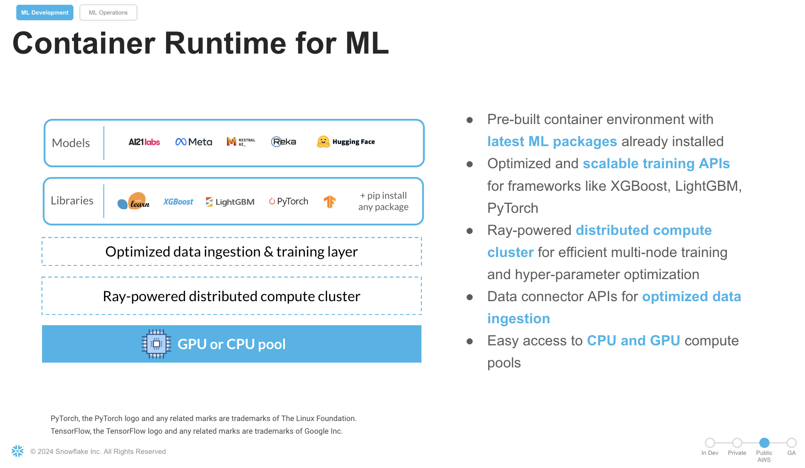

author: Kala Govindarajan
id: defect_detection_using_distributed_pyTorch_with_snowflake_notebooks
summary: Perform multiclass defect detection on PCB images using distributed PyTorch training across multiple nodes and workers within a Snowflake Notebook. This guide utilizes a pre-trained Faster R-CNN model with ResNet50 as the backbone from PyTorch, fine-tuned for the task. The trained model is logged in the Snowpark Model Registry for future use. Additionally, a Streamlit app is developed to enable real-time defect detection on new images, making inference accessible and user-friendly
categories: data-science-&-ml,Getting-Started
environments: web
status: Published 
feedback link: https://github.com/Snowflake-Labs/sfguides/issues
tags: Getting Started, Data Science, Data Science, Unstructured Data


# Defect Detection Using Distributed PyTorch With Snowflake Notebooks
<!-- ------------------------ -->
## Overview 

Duration: 1

In today's fast-paced manufacturing landscape, ensuring product quality early in the production process is crucial for minimizing defects and optimizing resources. With advancements in machine learning, manufacturers can now leverage computer vision models to automate defect detection, improving efficiency and accuracy.

In this Quickstart guide, we will train a computer vision model for multiclass defect detection using Snowflake Notebooks on Container Runtime easily and efficiently. The dataset comprises labeled Printed Circuit Boards (PCBs) with annotations including defect labels and bounding boxes for each image. This approach aims to help manufacturers implement early Quality Control, reducing costs, time, and resource usage in production processes.

The process includes the following steps:
- Preprocessing the dataset, which involves using the annotated data with labels and bounding boxes information for each image.
- Convert the image to a base64 bytes and store the contents in Snowflake table
- Training a PyTorch RCNN Object Detection model with distributed processing on multi-GPUs.
- Registering the trained model in the Snowflake Model Registry.
- Running detections and visualizing recommendations in a Streamlit app.
- Displaying inference results for any selected PCB image within the Streamlit app.


#### What is Snowflake ML?

Snowflake ML is the integrated set of capabilities for end-to-end machine learning in a single platform on top of your governed data. Data scientists and ML engineers can easily and securely develop and productionize scalable features and models without any data movement, silos or governance tradeoffs.

#### What is Snowflake Notebooks on Container Runtime?

Snowflake Notebooks are natively built into Snowsight, and provide everything you need for interactive development, cell by cell execution of Python, Markdown and SQL code.  By using Snowflake Notebooks one can increase the productivity since it simplifies connecting to the data and using popular OSS libraries for ML usecases.

Notebooks on Container Runtime offer a robust environment with a comprehensive repository of pre-installed CPU and GPU machine learning packages and frameworks, significantly reducing the need for package management and dependency troubleshooting. This allows you to quickly get started with your preferred frameworks and even import models from external sources. Additionally, you can use pip to install any custom package as needed.

The runtime also features an optimized data ingestion layer and provides a set of powerful APIs for training and hyperparameter tuning. These APIs extend popular ML packages, enabling you to train models efficiently within Snowflake.

At the core of this solution is a Ray-powered distributed compute cluster, giving you seamless access to both CPU and GPU resources. This ensures high performance and optimal infrastructure usage without the need for complex setup or configuration, allowing you to focus solely on your machine learning workloads.

Key Features:

- Managed Environment: Focus on your ML projects without the overhead of managing underlying infrastructure.
  
- Scalability: Leverage distributed computing resources to efficiently handle large datasets and complex computations.
  
- Integration: Seamlessly combine with Snowflake's ML operations for a cohesive workflow.
  
- Flexibility: While common ML packages come pre-installed, you have the option to install custom packages as needed.





### Prerequisites
- A GitHub Account
- A Snowflake Account with Accountadmin access OR
- Necessary Privileges to create a user, database,compute pool and a warehouse in Snowflake
- Access to run Notebooks in Snowflake
- AWS Commercial deployments (non-free trial accounts)
Container Runtime Enabled in the Account


### What You’ll Learn
- How to leverage Snowflake Notebooks on Container Runtime(GPUs) to carry model training using a Computer Vision Object Detection model.
- How to use the ShardedDataConnector that defines the training process for an individual worker during the training process. 
- How to achieve independent execution on each worker during the distributed training.
- How to use the PyTorchDistributor to distribute and manage the execution of the training function across multiple workers.
- How to log a trained model to Snowflake Model Registry
- How to create a streamlit application to carry ongoing inference on new images.


### What You’ll Build 
- A Object Detection Model from PyTorch that was trained with distributed processing on GPUS in Snowflake Notebooks to carry multiclass defect detection.
- A Streamlit app that will fetch the predictions and plot the bounding boxes around the defects with the class and prediction score.


## Setup Environment
<!-- ------------------------ -->
Duration: 2

This section will walk you through creating various objects. 
Access the setup file [here](https://github.com/Snowflake-Labs/sfguide-distributed-training-using-pytorch-object-detection-in-snowflake-notebooks/tree/main/scripts)


**Initial Setup**. -

In Snowsight navigate to Worksheets, click "+" in the top-right corner to create a new Worksheet, and choose "SQL Worksheet".
Run the following SQL commands  to create Snowflake objects (database, schema, tables).

```sql
ALTER SESSION SET query_tag = '{"origin":"sf_sit-is", "name":"distributed_ml_crt_imageanomaly_detection", "version":{"major":1, "minor":0,},"attributes":{"is_quickstart":1, "source":"sql"}}';
use role ACCOUNTADMIN;


create database PCB_DATASET;
create warehouse BUILD_WH WAREHOUSE_SIZE=SMALL;

use database PCB_DATASET;
use schema PUBLIC;
use warehouse BUILD_WH;
create compute pool NOTEBOOK_POOL
min_nodes = 1
max_nodes = 2
instance_family = GPU_NV_S
auto_suspend_secs = 7200;
create stage DATA_STAGE;

```
Be sure to review and comply with the licensing terms and usage guidelines before utilizing the PCB dataset. Load the PCB Images from the external location into the Snowflake stage data_stage for training

- **Load Data into Snowflake**. -
The next step is to load the PCB dataset into a Snowflake stage.  The dataset can be accessed from [this](https://github.com/Charmve/Surface-Defect-Detection) link. 

- **Store Image as Base64 format**. -
Read the image data and store the Base64 encoded contents along with the filename and labels in the training table. The label would typically stored as class, Filename INT,
 The data structure of the training table is:

```sql
   create or replace TABLE PCB_DATASET.PUBLIC.TRAIN_IMAGES_LABELS (
	FILENAME NUMBER(38,0),
	IMAGE_DATA VARCHAR(16777216),
	CLASS NUMBER(38,0),
	XMIN FLOAT,
	YMIN FLOAT,
	XMAX FLOAT,
	YMAX FLOAT

```
Setup is now complete and we will move to the Distributed Model training.

<!-- ------------------------ -->
## Distributed Model Training in Snowflake Notebooks
Duration: 2

It is time to set up a distributed training pipeline for training a PyTorch-based Faster R-CNN (Region-based Convolutional Neural Network) model for multiclass defect detection. The training is performed on a dataset of images (specifically, PCBs) with annotations for bounding boxes and labels, using Snowflake's Container Runtime, and utilizes GPUs for accelerated training. 

Import the notebook available [here](https://github.com/Snowflake-Labs/sfguide-distributed-training-using-pytorch-object-detection-in-snowflake-notebooks/blob/main/notebooks/0_Distributed_Model_Training_Snowflake_Notebooks.ipynb)

Navigate to Project > Notebooks from the left menu bar.
Import the .ipynb file you have downloaded into your Snowflake Notebook by using the Import from .ipynb button located on the top right of the Notebooks page.
Let's break down step by step what the training code performs: 

### Step 3.1 Distributed Setup

We will explore specific syntax in the distributed trainer that coordinates the training across multiple GPUs.

- context = get_context() & rank = context.get_rank(): The get_context() function from Snowflake's framework provides the worker's rank (ID in the distributed system).
- dist.init_process_group(backend="nccl"): Initializes the process group for distributed training. NCCL is a backend optimized for multi-GPU training.
- torch.cuda.device(rank): Ensures the model runs on the specific GPU based on the rank of the process.

### Step 3.2 Custom Dataset: FCBData

-  IterableDataset: This class wraps the source dataset (PCB images with annotations) to make it iterable for training.
-  Image Loading: The contents from IMAGE_DATA is decoded from Base64, loaded as a PIL image, and then transformed into a tensor.
-  Bounding Boxes and Labels:
Extracts bounding box coordinates (XMIN, YMIN, XMAX, YMAX) and defect class labels from the dataset.Prepares a target dictionary containing the bounding boxes, labels, image IDs, and other metadata required by the Faster R-CNN model.


### Step 3.3 Model Setup

- Loading Pre-trained Model:
  - weights = FasterRCNN_ResNet50_FPN_Weights.DEFAULT: Loads the pre-trained Faster R-CNN model with ResNet50 as the backbone.
  - num_classes = 6: Sets the number of classes (including background) for defect detection.
  - FastRCNNPredictor: Modifies the model’s prediction head to match the custom number of classes.
- The model is moved to the appropriate GPU (model.to(rank)) and wrapped in Distributed Data Parallel (DDP).

### Step 3.4 Model Training Setup

- optimizer and lr_scheduler: Adam optimizer is used to update model parameters. The learning rate is reduced every 3 epochs (StepLR).
- DataLoader: Handles loading the dataset into batches.
collate_fn groups the data into batches because the Faster RCNN model requires a custom way to handle images and targets together.
Pinning memory to GPU: By specifying pin_memory=True, the data loading process is optimized for GPU usage.

### Step 3.5 Training Loop

- For each epoch:
  - The model switches to training mode (model.train()).
  - The images and targets are moved to the corresponding GPU for training.
  - The loss is computed by the model on each batch of images. The optimizer updates the model weights based on the computed loss and the learning rate is updated after each epoch via the scheduler.

### Step 3.6 Save model dict and Logging the model to Snowflake Registry

-  torch.save(model.module.state_dict(), model_file): Saves the trained model (only on the master node, rank 0) to a temporary file /tmp/models/detectionmodel.pt
- Using a custom model wrapper class  DefectDetectionModel(), we use the trained model to be register in Snowflake registry with a model name, version, and the other parameters.

<!-- ------------------------ -->
## Streamlit App 
Duration: 2

Follow these steps to build a Streamlit application in Snowsight.


- Step 1. Click on Streamlit on the left navigation menu

- Step 2. Click on + Streamlit App on the top right

- Step 3. Enter App title

- Step 4. Select App location (pcb_dataset and Public Schema) and a warehouse
  
- Step 5. Click on Create. Replace the code with the streamlit code in the file
 
Also upload the remaining files from [this](https://github.com/Snowflake-Labs/sfguide-distributed-training-using-pytorch-object-detection-in-snowflake-notebooks/tree/main/scripts/streamlitapp) folder to the Streamlit stage by navigating to: 
* Snowsight->Data
* Database->PCB_Dataset
* Schemas->Public
* Stages-> streamlitstage


Come back to the Streamlitapp and click Run. Choose an image and click the button to carry Defect Detection .


## Conclusion and Resources

Congratulations! You have successfully performed  distributed model training in Snowflake Notebooks on Container Runtime.
By following these steps, you have trained a PyTorch Object Detection model with Snowflake, carry unstructured data(images) processing, train a PyTorch RCNN Object Detection model , log it in Snowflake Model Registry, and use Streamlit to visualize the inference results.

To cleanup resources and remove all of the objects and compute pools that you created during this QuickStart. This will ensure that you don't incur any unnecessary costs specifically associated with this QuickStart guide.

### What You Learned

- Leverage Snowflake Notebooks on Container Runtime with seamless access to GPUs to carry model training using a Computer Vision Object Detection model.
- Leverage ShardedDataConnector that defines the training process for an individual worker during the training process. 
- Carry independent execution on each worker during the distributed training.
- Use the PyTorchDistributor to distribute and manage the execution of the training function across multiple workers.
- Log a trained model to Snowflake Model Registry
- Create a streamlit application to carry ongoing inference on new images.

### Related Resources

- #### [Source Code on GitHub](https://github.com/Snowflake-Labs/sfguide-distributed-training-using-pytorch-object-detection-in-snowflake-notebooks)
- #### [Notebooks](https://docs.snowflake.com/user-guide/ui-snowsight/notebooks)
- #### [Notebooks on Container Runtime](https://docs.snowflake.com/en/user-guide/ui-snowsight/notebooks-on-spcs)
- #### [Snowflake Model Registry](https://docs.snowflake.com/en/developer-guide/snowflake-ml/model-registry/overview)
- #### [Snowflake ML Webpage](https://www.snowflake.com/en/data-cloud/snowflake-ml)
### Attribution
PyTorch, the PyTorch logo and any related marks are trademarks of The Linux Foundation.

