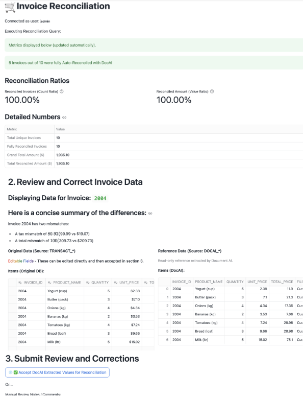

author: Anthony Melatti
id: doc-ai-invoice-reconciliation
categories: snowflake-site:taxonomy/solution-center/certification/quickstart, snowflake-site:taxonomy/product/ai, snowflake-site:taxonomy/snowflake-feature/transformation, snowflake-site:taxonomy/snowflake-feature/document-ai
language: en
summary: Automate invoice reconciliation with Snowflake Document AI for accounts payable processing, matching, validation, and financial automation.
environments: web
status: Published 
feedback link: https://github.com/Snowflake-Labs/sfguides/issues

# Document AI Invoice Reconciliation
<!-- ------------------------ -->
## Overview 

This QuickStart is designed to help you build out an automated invoice reconciliation pipeline in Snowflake using Document AI, which is designed for seamless and reusable document processing. The pipeline enables users to load their invoice files into a Snowflake stage and leverages streams, tasks, and Document AI's Table Extraction feature for efficient data extraction, validation, and downstream integration.

The pipeline uses a Document AI table extraction model to automatically extract data from invoice documents uploaded to a Snowflake internal stage, and then an initial reconciliation is performed to compare the bronze extracted data against the bronze layer main database tables. 

If the data matches, then the invoice is considered 'auto-reconciled' and its data is passed to the gold layer table to become the official reconciled result for the invoices.

If there are discrepancies, the results of the reconciliation are then passed to a Streamlit application in Snowflake for viewing and manual review of the discrepancies in invoice values. After manual review and reconciliation approval, the invoice values are passed to the final gold layer table.

### What is Document AI?
Document AI is a Snowflake machine learning feature that uses a large language model (LLM) to extract data from documents. With Document AI, you can prepare pipelines for continuous processing of new documents of a specific type, such as invoice or finance statement documents.

Document AI uses a model that provides both zero-shot extraction and fine-tuning. Zero-shot means that the foundation model is trained on a large volume of various documents, so the model broadly understands the type of document being processed. In this way, it can locate and extract information specific to this document type, even if the model has never seen the document before.

Additionally, you can create your own customized, fine-tuned Document AI model to improve your results by training the model on the documents specific to your use case.

### Prerequisites
- Familiarity with SQL and Python
- A <a href=https://signup.snowflake.com/?utm_source=snowflake-devrel&utm_medium=developer-guides&utm_cta=developer-guides>Snowflake account</a>. If you do not have a Snowflake account, you can register for a free trial account.
- A Snowflake account login with a role that has the ability to create role, database, schema, tables, stages and assign permissions. If not, you will need to register for a free trial or use a different role.

### What You’ll Learn 
- How to integrate Snowflake with a Document AI model for data extraction.
- How to set up and automate an invoice Document AI pipeline using Document AI's table extraction model.
- How to perform automated invoice reconciliation against a main database.
- How to monitor results and perform manual reconciliation using Streamlit UI in Snowflake.

### What You’ll Need 
- Files from [GitHub](https://github.com/Snowflake-Labs/sfguide-document-ai-invoice-reconciliation) 
- A Snowflake instance

### What You’ll Build 
- A robust invoice reconciliation pipeline leveraging Snowflake’s advanced features and DOC AI capabilities. By the end of this guide, you will have a fully functional system that:
- Automatically ingests and extracts values from invoices.
- Performs reconciliation between invoice and main database values.
- Identifies discrepancies that may exist between invoice and main database.
- Enables manual review of discrepancies for quick resolution and validation.

<!-- ------------------------ -->
## Snowflake Environment

The `docai_invoice_qs_setup.sql` script is designed to set up the necessary environment for the Document AI pipeline. When executed in your Snowflake account, it will:
- Create a new role called **DOC_AI_QS_ROLE** and assign it the appropriate permissions for DocAI + building an automated pipeline.
- Create a new database named **DOC_AI_QS_DB**.
- Establish a schema called **DOC_AI_SCHEMA** within this database.
- Set up a warehouse named **DOC_AI_QS_WH** for processing tasks.
- Define an internal stage **DOC_AI_STAGE** for document storage and management.
- Create tables, a stream, and a task essential for the bronze layer of the pipeline's operation.

### Setup Instructions

To set up your environment, copy the code from the [`docai_invoice_qs_setup.sql`](https://github.com/Snowflake-Labs/sfguide-document-ai-invoice-reconciliation) script available in the GitHub repository and execute it in your Snowflake account.

This will configure the necessary infrastructure to support invoice ingestion and extraction, the first part of our Document AI pipeline.

<!-- ------------------------ -->
## Document AI Model

Download sample documents from the [GitHub repository](https://github.com/Snowflake-Labs/sfguide-document-ai-invoice-reconciliation). These AI-generated sample invoices will be used to demonstrate processing multiple Document AI models in a single pipeline.

### Create Document AI Model

1. **Go to Snowsight:** Navigate to **AI & ML → Document AI**.

2. **Create First Model:** Click the `+ Build` button and fill in:

   - **Build Name:** `DOC_AI_QS_INVOICES`
   - **Location:** `DOC_AI_QS_DB`
   - **Schema:** `DOC_AI_SCHEMA`

3. **Define Values to Extract:**

   - Upload one of the documents from the folder [extraction documents](https://github.com/Snowflake-Labs/sfguide-document-ai-invoice-reconciliation).
   - Click on a document and select the **Document Processing Type** (labels/columns to extract).

  

   - For this quickstart we will select the **Table Model** for the LLM model to extract invoice table data.

  

  - Use the following values and prompts for this QuickStart:

  
  

   - Click **Accept All and Close** after reviewing the single document. One invoice will suffice for this quickstart.

   - Finally, publish the model in the **Document AI Model** screen.
     
    

For this quickstart, we don't need to train our Document AI model before publishing, as it has been designed to handle these types of invoices out of the box.

<!-- ------------------------ -->
## Invoice Reconciliation Pipeline

The `docai_invoice_qs_reconcile.sql` script is designed to set up the infrastructure for the invoice reconciliation layers, as well as kick it off by supplying invoice data to our bronze database. When executed in your Snowflake account, it will:
- Create two stored procedures **SP_RUN_ITEM_RECONCILIATION()** and **SP_RUN_TOTALS_RECONCILIATION()** that contain our invoice reconciliation logic.
- Create two streams **BRONZE_DB_STREAM** and **BRONZE_DOCAI_STREAM** to record changes in our bronze database or our bronze docai extraction table.
- Create a task **RECONCILE** that will call our two stored procedures when either of our bronze streams indicate data has changed in the bronze tables they are monitoring.
- Create tables for our reconciliation layer and for our final gold layer results
- Insert some rows of invoice data into our bronze database tables, with some rows intentionally modified to have information differences from what the actual invoices contain.

### Setup Instructions

To set up your environment, copy the code from the [`docai_invoice_qs_reconcile.sql`](https://github.com/Snowflake-Labs/sfguide-document-ai-invoice-reconciliation) script available in the GitHub repository and execute it in your Snowflake account.

This will configure the necessary infrastructure to support invoice reconciliation, the final part of our Document AI pipeline.

<!-- ------------------------ -->
## Streamlit Application

### Deploying the Streamlit App

The final step is to create a Streamlit app to provide manual review of documents that were unable to be auto-reconciled.

1. **Open Snowsight**: Navigate to **Projects → Streamlit** on the left panel.
2. **Create a New App**: Click the `+ Streamlit App` blue button in the top right corner.
3. **Configure the App**:
   - Name your app.
   - Select the **Database**, **Schema**, and **Warehouse** created earlier in this QuickStart.
   - Click **Create**.
4. **Replace Default Code**:
   - Remove the default Python code.
   - Copy and paste the code from the [docai_invoice_qs_app.py](https://github.com/Snowflake-Labs/sfguide-document-ai-invoice-reconciliation) file.
5. **Add Required Packages**:
   - In the **Packages** dropdown, select:
     - `pypdfium2`

    

6. **Run the App**: Click **Run**.

### Streamlit App Features

The Streamlit app provides full manual review capabilities for the invoice reconciliation process. It shows:
- **Live reconciliation metrics** - includes quantities of reconciled documents and dollar amounts reconciled
- **Document upload widget** - allows for easy invoice uploading to the stage right from the streamlit app.
- 1. **Invoices Awaiting Review** - select any invoices that had discrepancies between the bronze database table (intentionally added) and the bronze Document AI data extraction.
- 2. **Review and Correct Invoice Data** - displays the summary of discrepancies for the selected invoice, as well as an editable side-by-side comparison of values, in addition to a drop down bar that can display the image of the invoice in question.
- 3. **Submit Review and Corrections** - select the "Accept DocAI Extracted Values for Reconciliation" to automatically reconcile using the Document AI extracted values as correct, or manually edit the document in section 2 and then leave some notes before pressing the "Accept Manual Edits above for Reconciliation." Either button will then process the reconciliation and send the final results to the gold layer table while maintaining a record in the reconciliation table.

### Putting the Invoice Reconciliation in Action

1. **Load Sample Invoices**:
   - Upload all sample documents from [extraction documents](https://github.com/Snowflake-Labs/sfguide-document-ai-invoice-reconciliation) to your `DOC_AI_STAGE` stage.
   This can be done using the databases gui path:

Or by using the upload document widget in the streamlit app!

2. **Wait a few minutes for your automated tasks to execute, then review the results**:
   - Open the Streamlit UI.
   - Observe the auto-reconciled metrics
   - Review the invoices with discrepancies and provide manual final reconciliation

This step completes the quickstart, allowing you to see the invoice reconciliation process in action!

<!-- ------------------------ -->
## Cleanup

If you'd like, you can clean up the objects you created after completing this QuickStart. Run the cleanup script available at:  
[`docai_invoice_qs_cleanup.sql`](https://github.com/Snowflake-Labs/sfguide-document-ai-invoice-reconciliation)

<!-- ------------------------ -->
## Conclusion and Resources
### Conclusion

This QuickStart provides an introduction to automating a Document AI invoice reconciliation pipeline that extracts table values from invoice documents and reconciles them against an invoice database. In real-world scenarios, invoice reconciliation logic can be customized, batch processing can be optimized, and validation rules can be enhanced to improve accuracy. This pipeline serves as a foundation for scalable, AI-powered document processing solutions.

### What You Learned

- How to automate invoice processing and reconciliation using Snowflake Document AI and its table extraction model.
- How to extract, reconcile, and review document data efficiently.
- How to use Streamlit for metric dashboarding and manual review of invoice reconciliation workflows.

### Resources

- [Snowflake Document AI Overview](https://docs.snowflake.com/en/user-guide/snowflake-cortex/document-ai/overview)
- [Repo for Code and Example Documents (GitHub)](https://github.com/Snowflake-Labs/sfguide-document-ai-invoice-reconciliation)
