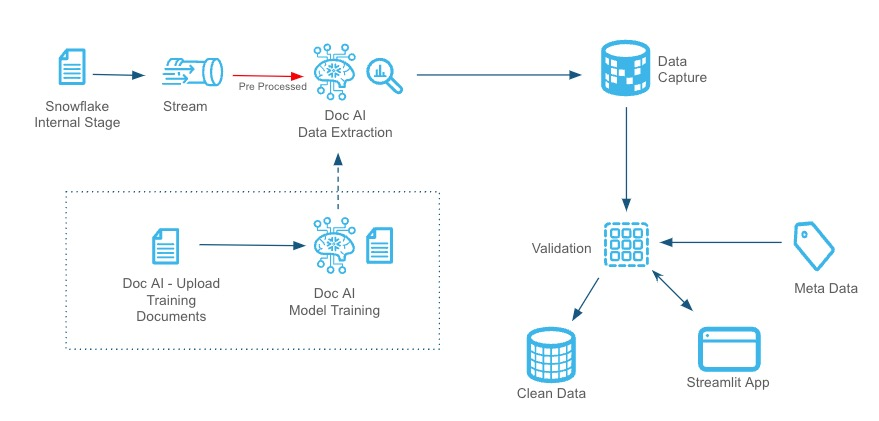
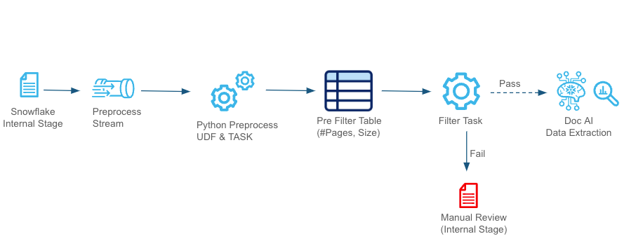
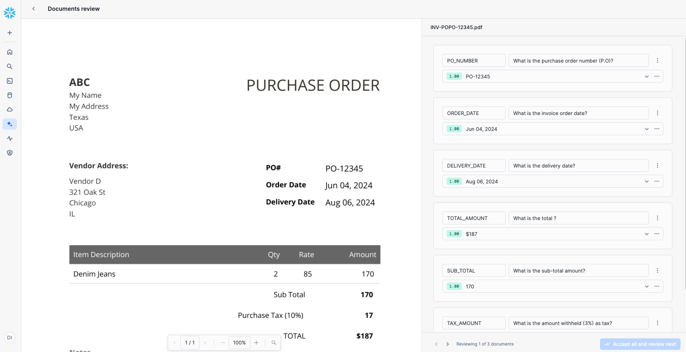
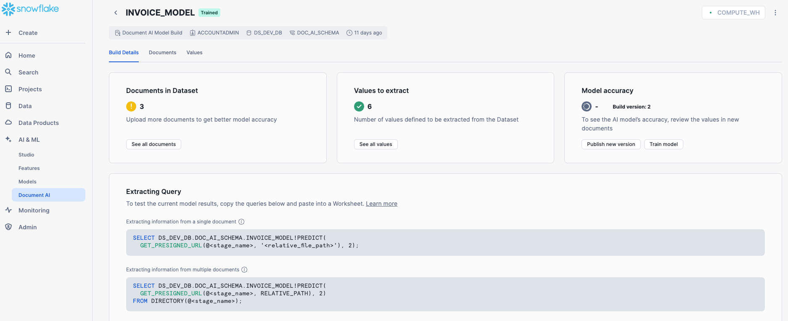
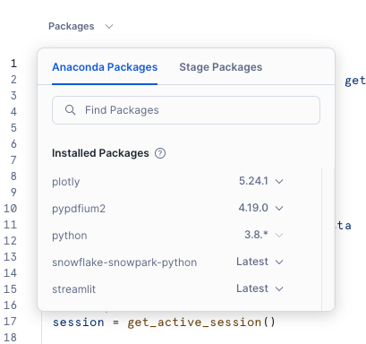
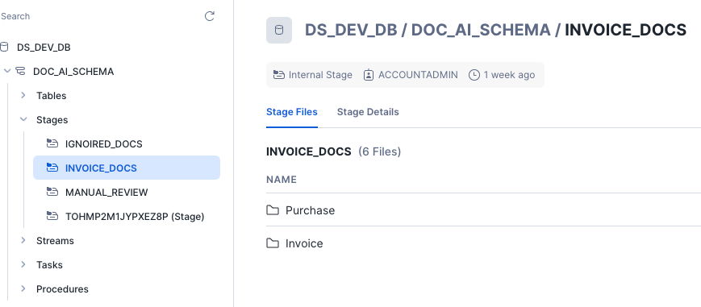
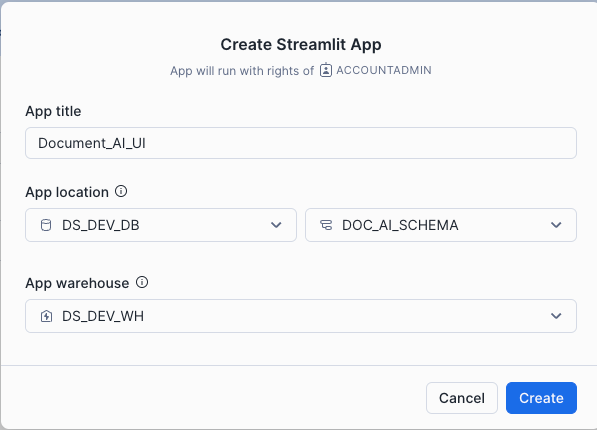
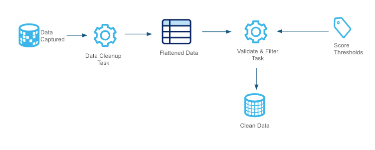

author: Sarathi Balakrishnan
id: doc-ai-pipeline-automation
categories: snowflake-site:taxonomy/solution-center/certification/quickstart, snowflake-site:taxonomy/product/ai, snowflake-site:taxonomy/snowflake-feature/transformation, snowflake-site:taxonomy/snowflake-feature/document-ai
language: en
summary: Automate document processing pipelines with Snowflake Document AI for invoice extraction, OCR, form digitization, and validation.
environments: web
status: Published 
feedback link: https://github.com/Snowflake-Labs/sfguides/issues


# Document AI Pipeline Automation
<!-- ------------------------ -->
## Overview 

This QuickStart help you understand and build the Snowflake Document AI Data Extraction & Validation Pipeline, designed for seamless and reusable document processing. The pipeline enables users to load their files into a Snowflake stage and leverages streams, tasks, and Python-based procedures for efficient data extraction, validation, and downstream integration. It can be easily adapted to work with multiple Document AI models by creating an appropriate end table to capture the final data points.



The pipeline ensures that documents meet business expectations through pre-processing checks, feeds suitable documents into a DOC AI model for data extraction, validates the extracted data against business-specific accuracy thresholds, and routes clean data to downstream systems. Additionally, the Streamlit UI provides a live view of the data flow and key performance metrics, enabling real-time monitoring and insights into pipeline performance. This flexible, automated solution is ideal for handling diverse document processing requirements.


### Prerequisites
- Familiarity with SQL and Python
- A <a href=https://signup.snowflake.com/?utm_source=snowflake-devrel&utm_medium=developer-guides&utm_cta=developer-guides>Snowflake account</a>. If you do not have a Snowflake account, you can register for a free trial account.
- A Snowflake account login with a role that has the ability to create role, database, schema, tables, stages and assign permissions. If not, you will need to register for a free trial or use a different role.

### What You’ll Learn 
- How to set up and automate Document AI pipeline with mutiple Doc AI models.
- How to validate and pre-process documents for specific requirements.
- How to integrate Snowflake with a Document AI model for data extraction.
- How to apply score-based validation criteria to extracted data.
- How to manage and route documents through different stages.s
- How to monitor and enhance the pipeline using Streamlit UI.

### What You’ll Need 
- Files from [GitHub](https://github.com/Snowflake-Labs/sfguide-document-ai-pipeline-automation-in-snowflake) 
- A Snowflake instance


### What You’ll Build 
- A robust document processing pipeline leveraging Snowflake’s advanced features and DOC AI capabilities. By the end of this guide, you will have a fully functional system that:
- Automatically ingests and validates documents.
- Routes documents to appropriate stages (e.g., Manual Review or Processing).
- Extracts key data fields from documents using DOC AI models.
- Validates extracted data points against predefined business thresholds.


<!-- ------------------------ -->
## Pre-Processing 

The pre-processing stage validates document attributes such as size and page count to ensure only processable documents proceed further. Criteria can be customized to align with business needs and Document AI guidelines, as outlined in the [Snowflake Documentation](https://docs.snowflake.com/en/user-guide/snowflake-cortex/document-ai/preparing-documents)
Files failing these checks are routed to a "Manual Review" stage, where users can review and, if necessary, resend documents for processing via a Streamlit app.




Documents are ingested from the Internal Stage and processed through a stream. A Python-based UDF evaluates the attributes, storing results in a pre-filter table. Documents passing the validation move to the DOC AI Data Extraction, while invalid ones are redirected for manual review.


<!-- ------------------------ -->
## Create Tables, Stages & Metadata 

The `DOC_AI_QuickStart.SQL` script is designed to set up the necessary environment for the Document AI pipeline. When executed in your Snowflake account, it will:

- Create a new database named **DS_DEV_DB**.
- Establish a schema called **DOC_AI_SCHEMA** within this database.
- Set up a warehouse named **DOC_AI_WH** for processing tasks.
- Define internal stages for document storage and management.
- Create tables, views, streams, stored procedures, and tasks essential for the pipeline's operation.

### Setup Instructions

To set up your environment, copy the code from the [`DOC_AI_QuickStart.SQL`](https://github.com/Snowflake-Labs/sfguide-document-ai-pipeline-automation-in-snowflake/blob/main/DOC_AI_QuickStart.SQL) script available in the GitHub repository and execute it in your Snowflake account.

This will configure the necessary infrastructure to support document ingestion, preprocessing, extraction, and validation, ensuring a seamless Document AI pipeline execution.


<!-- ------------------------ -->
## Document AI Model Training

Download sample documents from the [GitHub repository](https://github.com/Snowflake-Labs/sfguide-document-ai-pipeline-automation-in-snowflake/tree/main/sample_docs). These AI-generated sample invoices will be used to demonstrate processing multiple Document AI models in a single pipeline.

We will use two Document AI models for this demonstration, but you can add more as needed. The pipeline will process all models sequentially.

### Create Document AI Models

1. **Go to Snowsight:** Navigate to **AI & ML → Document AI**.

2. **Create First Model:** Click the `+ Build` button and fill in:

   - **Build Name:** `INVOICE_MODEL`
   - **Location:** `DS_DEV_DB`
   - **Schema:** `DOC_AI_SCHEMA`

3. **Train the Model:**

   - Upload a few documents from the [sample dataset](https://github.com/Snowflake-Labs/sfguide-document-ai-pipeline-automation-in-snowflake/tree/main/sample_docs).
   - In production, training with at least 20 varied documents ensures higher accuracy.
   - Click on a document and add **Values** (labels/columns to extract).
   - Enter a **Prompt/Question** for the LLM model to extract relevant data.
   - Use the following values and prompts for this QuickStart:

   | **Value Name**  | **Prompt** |
   |---------------|------------------------------------------------|
   | `PO_NUMBER`   | What is the purchase order number (P.O)?       |
   | `ORDER_DATE`  | What is the invoice order date?                 |
   | `DELIVERY_DATE` | What is the delivery date?                   |
   | `TOTAL_AMOUNT` | What is the total?                            |
   | `SUB_TOTAL`   | What is the sub-total amount?                  |
   | `TAX_AMOUNT`  | What is the amount withheld (3%) as tax?       |

   - Review and correct extracted values if needed. Accept corrections to improve accuracy.
   - Click **Accept All and Close** after reviewing all documents.

4. **Create the Second Model:** Repeat the steps for another model.

   - **Build Name:** `PURCHASE_MODEL`
   - **Location:** `DS_DEV_DB`
   - **Schema:** `DOC_AI_SCHEMA`




Once both models are trained, they will be processed sequentially through the pipeline. Continue with the next steps to configure and execute the pipeline.

<!-- ------------------------ -->
## Model Inference

Once the models are trained, publish them in the **Document AI Model Training** screen.

To test model results, copy and execute the SQL queries listed under **Extracting Query**:



### For a Single Document

```sql
SELECT DS_DEV_DB.DOC_AI_SCHEMA.INVOICE_MODEL!PREDICT(
    GET_PRESIGNED_URL(@<stage_name>, <relative_file_path>), 1
);
```

### For a Batch of Files in Stage

```sql
SELECT DS_DEV_DB.DOC_AI_SCHEMA.INVOICE_MODEL!PREDICT(
    GET_PRESIGNED_URL(@<stage_name>, RELATIVE_PATH), 1
)
FROM DIRECTORY(@<stage_name>);
```

Here, the number `1` represents the model version. Ensure you replace <stage_name> and <relative_file_path> with actual values from your setup before execution.

<!-- ------------------------ -->
## Streamlit App

### Deploying the Streamlit App

The final step is to create a Streamlit app to visualize the pipeline in action.

1. **Open Snowsight**: Navigate to **Projects → Streamlit** on the left panel.
2. **Create a New App**: Click the `+ Streamlit App` blue button in the top right corner.
3. **Configure the App**:
   - Name your app.
   - Select the **Database**, **Schema**, and **Warehouse** created earlier in this QuickStart.
   - Click **Create**.
4. **Replace Default Code**:
   - Remove the default Python code.
   - Copy and paste the code from the [Streamlit-in-Snowflake.py](https://github.com/Snowflake-Labs/sfguide-document-ai-pipeline-automation-in-snowflake/blob/main/Streamlit-in-Snowflake.py) file.
5. **Add Required Packages**:
   - In the **Packages** dropdown, select:
     - `plotly`
     - `pypdfium2`
6. **Run the App**: Click **Run**.




### Streamlit App Features

The Streamlit app provides full control over the pipeline and enables real-time monitoring. It shows:
- Live tracking of documents as they progress through each step in the pipeline.
- Key metrics, such as the average time taken to process a document.

### Testing the Pipeline in Action

1. **Load Sample Documents**:
   - Upload all sample documents from [GitHub Sample Docs](https://github.com/Snowflake-Labs/sfguide-document-ai-pipeline-automation-in-snowflake/tree/main/sample_docs) to your `INVOICE_DOCS` stage under the folder `Invoice`.
   - For this QuickStart, load the same set of files into another folder called `Purchase`.




2. **Monitor the Pipeline in Streamlit**:
   - Open the Streamlit UI.
   - Select the Document AI model.
   - Observe the documents flowing through the pipeline in real time.

This step completes the setup, allowing you to see the automated document processing pipeline in action!




<!-- ------------------------ -->
## Data Validation

Once extracted, data is validated to ensure accuracy. Key data points, such as the **invoice number**, are assigned high validation scores since incorrect values impact downstream processes. Validation rules help maintain data integrity and ensure only high-quality data is processed.


<!-- ------------------------ -->
## Cleanup

Remember to clean up the objects you created after completing this QuickStart. Run the cleanup script available at:  
[Cleanup](https://github.com/Snowflake-Labs/sfguide-document-ai-pipeline-automation-in-snowflake/blob/main/Cleanup.sql)

<!-- ------------------------ -->
## Conclusion and Resources
### Conclusion

This QuickStart provides an introduction to automating a Document AI pipeline that processes multiple models and pre-processes documents efficiently. In real-world scenarios, pre-processing logic can be customized, batch processing can be optimized, and validation rules can be enhanced to improve accuracy. This pipeline serves as a foundation for scalable, AI-powered document processing solutions.

### What You Learned

- How to automate document processing using Snowflake Document AI.
- How to pre-process, extract, validate, and monitor document data efficiently.
- How to integrate multiple Document AI models within a single pipeline.
- How to use Streamlit for real-time tracking and visualization of document workflows.

### Resources

- [Snowflake Document AI Overview](https://docs.snowflake.com/en/user-guide/snowflake-cortex/document-ai/overview)
- [Known Limitations of Document AI](https://docs.snowflake.com/en/user-guide/snowflake-cortex/document-ai/limitations)
- [Sample Scripts and Pipelines (GitHub)](https://github.com/Snowflake-Labs/sfguide-document-ai-pipeline-automation-in-snowflake)
