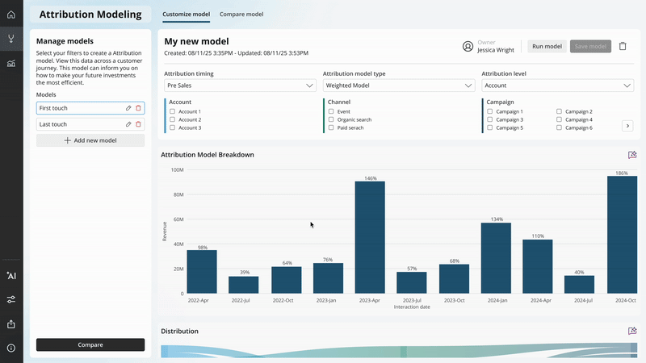
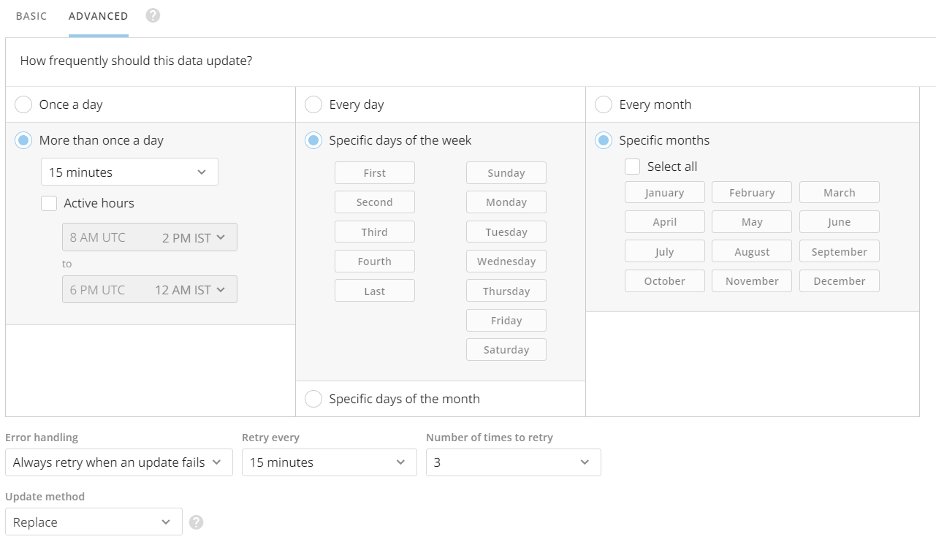
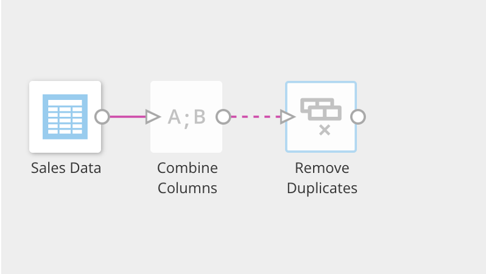
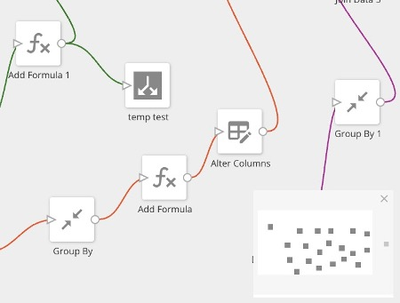
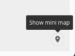
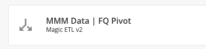
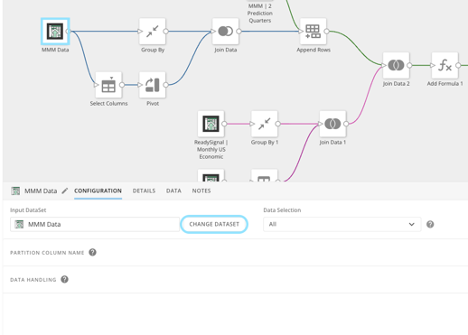
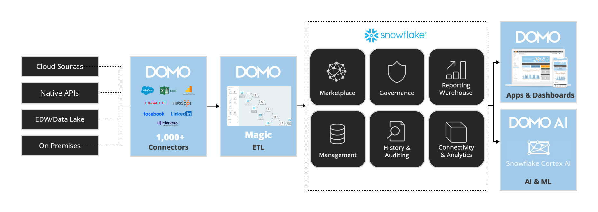

author: Jon Tiritilli
id: domo-marketing-attribution-quickstart
categories: snowflake-site:taxonomy/solution-center/certification/quickstart, snowflake-site:taxonomy/solution-center/certification/partner-solution, snowflake-site:taxonomy/solution-center/includes/architecture, snowflake-site:taxonomy/industry/advertising-media-and-entertainment, snowflake-site:taxonomy/product/data-engineering
language: en
summary: Build marketing attribution and media mix models with Domo and Snowflake for campaign ROI and spend optimization.
environments: web
status: Published
feedback link: https://github.com/Snowflake-Labs/sfguides/issues

# Getting Started with Domo Marketing Attribution

<!-- ------------------------ -->

## Overview

In this quickstart, we’ll walk through how to use Domo’s Marketing app—available in the Snowflake Marketplace—to build powerful marketing attribution and media mix models that can transform your business. By the end of this guide, you'll be equipped to deploy and utilize the suite's capabilities to drive data-driven marketing decisions and optimize your campaign performance.

### What is Domo’s Marketing App?

Domo’s Marketing app is a comprehensive, cloud-based platform designed to empower marketing professionals with advanced data insights. Even if you don’t have a technical background in data analytics, the Marketing app guides you through analyzing marketing performance, tracking key metrics, and optimizing marketing spend across all your channels.

The app enables users to easily connect data sources, apply out-of-the-box attribution models (such as first touch, last touch, and weighted touch), and customize metrics to suit specific business needs. Whether you want to monitor marketing ROI, pipeline performance, or customer acquisition costs, Domo’s Marketing app centralizes all your data into Snowflake, providing a unified view for smarter decision-making.

For more advanced users, the platform offers powerful AI and automation tools. These allow marketers to create custom attribution models, automate workflows, and build sophisticated analytics without needing extensive technical expertise. Additionally, the Domo Marketing app offers flexible deployment options, enabling seamless integration with existing marketing tools and data environments.

### Prerequisites:

- Basic understanding of Snowflake
- A Snowflake account. If you do not have a Snowflake account, you can register for a [free trial account](https://signup.snowflake.com/?utm_source=snowflake-devrel&utm_medium=developer-guides&utm_cta=developer-guides).
- A Domo account and a basic understanding of Domo
- Access to data

### What You’ll Learn:

- How to deploy Domo’s Marketing app from the Snowflake Marketplace
- How to intialize a dataset using Domo Connectors
- How to create a Magic ETL and create consumable data
- How to leverage Domo’s Marketing app to gain better insights into your marketing efforts

### What You'll Build:

- A Marketing app to access and analyze marketing data, view marketing attribution, and conduct Media Mix Modeling.

## Install

Request the Domo Marketing app:

- Open the Domo provider page in the **Snowflake Marketplace**.
- Locate and click the Domo Marketing app listing.
- Click **Request**.
- Fill out then submit the request form.

The Domo team will review the request and contact you with more information.

## Data Power-Up

Over the next few sections, you'll supercharge your marketing data by leveraging SQL in Snowflake alongside Domo’s Magic ETL. Connect key sources such as Adobe Analytics, Google Analytics, Marketo, NetSuite, Salesforce, Facebook, and Instagram. Use customizable join logic and preparatory steps tailored to your data environment to build a cohesive, centralized data foundation. These preparatory steps allow for advanced attribution models and media mix analysis, ensuring you have the insights needed to optimize your marketing strategy.

Leverage the Domo Data Warehouse to access your data wherever it sits to transform & visualize.

## Add a DataSet using a Connector

When you add a DataSet, you are automatically assigned as the DataSet owner. For information about changing the owner of a DataSet, see Changing the Owner of a DataSet.

You can access the interface for adding Connector DataSets via the Appstore, the Data Center, or the menu.

**To add a DataSet using a Connector**

1. Choose one of the following:

   - (Conditional) If you want to connect to data via the **APPSTORE**, do the following:

     - Select _Appstore_ in the toolbar at the top of the screen.
     - Click the _Search_ tab.
     - Click the _Connector_ checkbox under Capability.
     - Use the search bar or page navigation to locate the Connector you want to connect to, then click it to open its details view.
     - Click _Get the Data_.

     - Alternatively, for some of the most popular Connectors, a _Get the Cards_ button is available. This allows you to power up several prebuilt, live Cards based on your own data, without having to configure advanced options. This is a great way to "preview" the Connector to make sure it provides the data you want. If you choose this option, you are asked to select the desired account or input your account information if you haven't created an account for this Connector yet.

   - (Conditional) If you want to connect to data via the **DATA CENTER**, do the following:

     - Select _Data_ in the toolbar at the top of the screen.
     - In the Connect Data area at the top of the screen, select _Connectors_, _File_, or _Database_, depending on the connection type.

     - You can use the following table to learn more about these Connector types:

       | Connector Type | Description                                                                                                                                                                                   |
       | -------------- | --------------------------------------------------------------------------------------------------------------------------------------------------------------------------------------------- |
       | Connectors     | A Connector for a third-party app in which data is stored in the cloud. Most of Domo's Connectors fall into this category. Examples include Facebook, Salesforce, Adobe Analytics, and so on. |
       | File           | A Connector used to pull files into Domo. Examples include Excel, Google Sheets, and Box.                                                                                                     |
       | Database       | A Connector in which you write a query to pull data from a database into Domo. Examples include MySQL, Amazon Redshift, and MongoDB.                                                          |

     - The other two icons in this area denote other non-Connector methods for bringing data into Domo. Federated refers to federated DataSets, and API refers to Domo's development environment, where you can build your own custom Connectors. For more information on Federated DataSets, see Connecting to Data Using Workbench 5.
     - Select the Connector type you want.
     - Click the desired Connector tile.

     _Note: Popular Connectors are marked with a Preferred tag. This is also used when there are several different Connectors to the same data, such as Facebook. The most commonly used option will display the Preferred tag._

   - (Conditional) If you want to connect to data via the menu, do the following:
     - Select > _Data_.
     - Select _Connectors_, _File_, or _Database_. _For more information about these Connector types, see the above table._
     - Click the desired Connector tile.

1. Specify the settings in each section. - Refer to the general information included in this topic and to the help in the specific data Connector.
   _For more information about configuring specific data Connectors, see Configuring Each Connector.
   As applicable, click Connect, Next, or Save and open the next section._
1. When finished, click _Save_.
   - You are taken to the details view for the DataSet in the Data Center. For more information about this view, see Data Center Layout.

## Connector Settings

All Connector types in Domo have different options for setting up a DataSet.

Most Connectors require you to enter login credentials, an API key, a server URL, or a combination of these to access the Connector. If you cannot connect after entering your credentials, you have most likely entered incorrect credentials.

For information about finding credentials, see the documentation for your specific Connector. You can find this under [API Connectors](https://domo-support.domo.com/s/topic/0TO5w000000ZaoQGAS).

After you connect, you are usually asked for information about the data you want to pull and the desired format. Most Connectors have two or more associated report types. In addition, many Connectors request a timeframe for the data to be retrieved. You may also be asked to submit a query for retrieving data. For example, when connecting to JIRA you can enter a JQL query to retrieve data for a specified search filter.

For most Connectors, you are also asked to schedule data updates. You can use basic scheduling, in which you select a single, specific unit of time (such as "Every hour") and enter the time of day when the update is to occur, if required. Or you can use advanced scheduling, in which you can select multiple update times.

The information in this section is general and may or may not be required for a certain Connector. For specific requirements for Connectors, see [API Connectors](https://domo-support.domo.com/s/topic/0TO5w000000ZaoQGAS).

### Connector Credentials

If required, specify the credentials for connecting to the data provider. If available, you can select an account or create an account to use in connecting. For more information about accounts, see [Manage Connector Accounts](https://domo-support.domo.com/s/article/360042926054).

Some Connectors, such as Google Drive, use OAuth to connect. This means that you only need to enter your credentials once for a given account. In the future, when you go to create a DataSet using this Connector account, your credentials are passed in automatically. Other Connectors do not use OAuth, so you must enter your credentials each time you create a DataSet using this Connector account.

### Connector Details

Most Connectors include a Details settings category. Here you usually specify options like the report to run, the timeframe for the data, a data query for pulling specific information from a database, and so on. If a query is required, the type of query you need to use depends on the Connector type and the source data in your system.

Click _Load Preview_ to verify that your data is accessible. If connection errors occur, verify the specified connection information.

## Connector Scheduling

In the **Scheduling** settings category, you can specify the update schedule, retry settings, and update method you want for this DataSet.
You can use either basic or advanced scheduling for connectors.

### Basic scheduling

In the **Basic Scheduling** tab, you can create a basic update schedule in which you specify a predefined update interval for this DataSet (such as "every Monday at 10:00 AM").

By default, schedules are set from the current time. Update intervals include every hour, day, weekday, week, month, and manually. Schedule times are based on UTC and will also show what time that is for you based on your Company Time Zone setting.
For hour, day, and week options, you can specify the interval (every # hours/days/weekdays) and the start period.

_Note: If you set a Connector schedule using the hourly method, the end time is not inclusive. For example, if the schedule is set to hourly with the active hours set to run 8 AM UTC to 7 AM UTC it will skip the 7 AM UTC run because the end hour is not treated as inclusive.
If you select Manually for your update interval, you can instruct Domo to send you a notification when the data has not been updated for a given period of time. Time periods range from one hour to three months._

  

_Note: If you need your DataSet to update faster than every 15 minutes, please reach out to your account team for evaluation._

#### Update Method

When creating or editing a DataSet, you can specify whether to append or replace data when updates occur. The update options are found at the bottom of the Basic Scheduling and Advanced Scheduling tabs.
| Option | Description |
|----|----|
| Replace | Replace the current version of the data with a new version of the data. Previous versions are preserved. |
| Append | Add data to the current version of the data, increasing the size of the DataSet. |
Upsert | Update DataSets with restated data to ensure you have the most up-to-date information. Available for selected connectors only. For a list of available connectors, see [DataSet Update Methods](https://domo-support.domo.com/s/article/360043430733). |
Partition | Select a rolling window of data to keep, making it easier to focus on relevant data. Available for selected connectors only. For a list of available connectors, see [DataSet Update Methods](https://domo-support.domo.com/s/article/360043430733).

### Advanced Scheduling

In the **Advanced Scheduling** tab, you have more control over when data is updated than you do when using basic scheduling. You can create schedules by month, day of the month, or day of the week. You can even specify which days of the week out of the month you want to update (for example, every second and fourth Sunday).

You can indicate whether updates are done on a set interval (such as "every 15 minutes," "every 8 hours," etc.) or at a specified time. You can also set the start time (based on the current minute). If you want, you can set the update schedule to start immediately.

_Note: If you need your DataSet to update faster than every 15 minutes, please reach out to your account team for evaluation.
Schedule times are based on UTC but can be seen in your timezone._

  
  

## Connector Error handling

Retry settings determine whether Domo should attempt to retry if updates fail for this DataSet and, if so, the frequency and maximum number of retries. These settings apply only to scheduled runs, not manual runs. You access the retry options dialog by selecting *Always retry when an update fails*.

  

The options in this dialog are as follows:
| Option | Description |
|----|----|
| Always retry when an update fails | Domo retries to update the DataSet. After retrying the specified number of times, Domo sends a notification if the update attempt is unsuccessful. |
| Do not retry when update fails | Domo sends a notification if the update attempt is unsuccessful, and no retries are made.|

## Create a Magic ETL DataFlow

Follow these steps to create a *Magic ETL* DataFlow:

1. Navigate to the Domo *Data Center*.

1. In the ribbon at the top of the Data Center, select *Transform Data* > *Magic ETL* to open the Magic ETL canvas.

    

1. In the left panel, expand DataSets and drag an Input DataSet tile to the canvas.

    

1. The tile editor expands below the canvas.

    

1. In the tile editor, select Choose DataSet to choose the DataSet you want to transform.

1. Drag other tiles to the canvas, depending on what transformations you want to make, and make sure they are all connected by dragging the nodes on the sides of each tile to the node on the next tile.

1. Configure the Output DataSet tile:

   1. Connect a tile to the Output DataSet tile.
   1. Select the Output DataSet tile, then enter a name for the new output DataSet.
   1. (Optional) Schedule the DataFlow. By default, you must run the DataFlow manually. You can schedule it to run when a trigger activates. See [Advanced DataFlow Triggering](https://domo-support.domo.com/s/article/000005216) to learn more.
   1. Enter a name and description for the DataFlow.
   1. Select Save to keep your changes, adding an optional version description before saving again.
   1. When you save a DataFlow, an entry for this version is added to the Versions tab in the Details view for the DataFlow. If you add a version description, it appears in the version entry. Learn about Viewing the Version History for a DataFlow.

### Tips and Notes

- You must configure each tile in the editor before you can configure the following tile. If a tile is not configured, the connector to the next tile appears as a dashed line.  
  

- Use the search tool in the left panel to find the tile you need.  
  

- The Mini Map displays in the corner of the screen and helps you see the layout and navigate around complex and detailed DataFlows. Click and drag the white square in the mini map to move to a certain view of the DataFlow on the canvas.  
  

- If you close the mini map, reopen it by selecting the map pointer icon.  
  

- You can get help on a specific tile in the canvas by clicking the tile, then clicking .

- You can select a number of tiles at once by clicking on the canvas then dragging the mouse pointer over them. When multiple tiles are selected, you can drag all of the selected tiles as a group to where you want them. You can also delete the selected tiles by selecting Delete in the left panel.

Why are output DataSets not marked as Updated when the DataFlow completes successfully?

This is usually because the data has not actually changed—no update has occurred. The DataSets show as updated if the data has changed during a successful DataFlow execution.

### Best Practices for Magic ETL DataFlows

We recommend the following for your DataFlow:

- Only include the DataSets that are necessary to create the output DataSet.
- Filter out rows that you don't need at the beginning of the DataFlow. Learn about Filter tiles.
- Reduce the number of columns to only those you need.
- Use descriptive names for each tile in your DataFlow.
- List the following in your DataFlow description:
  - The input DataSets being transformed and their owner's names.
  - The output DataSet created.
- Give your DataFlow the same name as the output DataSet.
  - This is because the outputs of a DataFlow become their own DataSet in the Data Center, and this allows you to more easily identify which DataFlows contribute to which output DataSets.
- Be aware that some tiles take longer to execute than others, including:
  - Group By
  - Rank & Window
  - Join Data
  - Remove Duplicates
  - Pivot
  - Scripting tiles
  - Data Science tiles

## Connect to Your Data

1. Select the _DataFlows_ icon on the left  
  

1. Locate the Mixed Media Model Dataflow  
  

1. Select the input dataset and click _Change Dataset_ to replace the sample data with the data you have created through this quickstart.  
  

## Leveraging Attribution and Models

With the Marketing App, you’ll analyze historical attribution data and performance to uncover key trends across your marketing efforts. Using tailored machine learning models, you'll simulate various spend scenarios to predict their potential impact on future campaigns. This data-driven approach allows you to test different media mix strategies, optimize your budget allocation, and maximize ROI by identifying the most effective marketing channels and tactics for your business.

## Conclusion and Resources

### Conclusion

With these tools, you're now equipped to optimize campaign performance, enhance marketing ROI, and refine your strategy with actionable insights.

### What You Learned
By following this guide, you’ve learned how to deploy and utilize Domo’s marketing app from the Snowflake Marketplace, connect your data sources, and leverage
advanced attribution and media mix models to make smarter, data-driven marketing decisions.

### Resources

For further learning, explore the following resources:
- [Marketing App Blog post](https: //medium. com/snowflake/introducing-domos-marketing-app-enriching-marketing-analytics-with-snowflake-integration-11d48e7b8ad4)
- [Domo Knowledge Base](https://domo-support.domo.com/s/knowledge-base?language=en_US)
- [Snowflake Marketplace](/en/data-cloud/marketplace/)
- [Domo Community](https://www.domo.com/domo-central/community)
- [Domo Community Forum](https://community-forums.domo.com/main)
- [How to Join the Domo Community](https://www.domo.com/blog/how-to-join-the-community-forums-step-by-step/)
- [Domo Support](https://www.domo.com/login/customer-community)
- [Read Medium Blog](https://medium.com/snowflake/introducing-domos-marketing-app-enriching-marketing-analytics-with-snowflake-integration-11d48e7b8ad4)
- [Watch the Demo](https://youtu.be/yjoDM6FOkZQ?si=urgLa_WqNpmU7JI4)
- Architecture  
  
  
