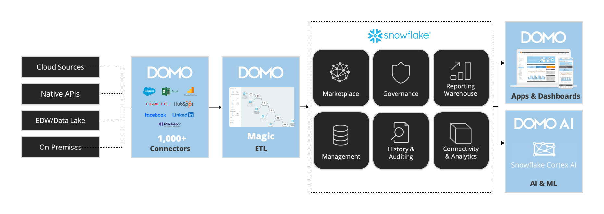

author: Jon Tiritilli
id: domo_mmds_quickstart
summary: Build powerful marketing attribution and media mix models
categories: Getting-Started
environments: web
status: Published
feedback link: https://github.com/Snowflake-Labs/sfguides/issues
tags: Getting Started, Data Science, Data Engineering

# Domo MMDS QuickStart
<!-- ------------------------ -->
## Overview

In this quickstart, we’ll walk through how to use Domo’s marketing app—available in the Snowflake Marketplace—to build powerful marketing attribution and media mix models that can transform your business. By the end of this guide, you'll be equipped to deploy and utilize the suite's capabilities to drive data-driven marketing decisions and optimize your campaign performance.

### What is Domo’s Marketing App?

Domo’s marketing app is a comprehensive, cloud-based platform designed to empower marketing professionals with advanced data insights. Even if you don’t have a technical background in data analytics, the marketing app guides you through analyzing marketing performance, tracking key metrics, and optimizing marketing spend across all your channels.

The app enables users to easily connect data sources, apply out-of-the-box attribution models (such as first touch, last touch, and weighted touch), and customize metrics to suit specific business needs. Whether you want to monitor marketing ROI, pipeline performance, or customer acquisition costs, Domo’s marketing app centralizes all your data into Snowflake, providing a unified view for smarter decision-making.

For more advanced users, the platform offers powerful AI and automation tools. These allow marketers to create custom attribution models, automate workflows, and build sophisticated analytics without needing extensive technical expertise. Additionally, the Domo marketing app offers flexible deployment options, enabling seamless integration with existing marketing tools and data environments.

### Prerequisites:

- Basic understanding of Snowflake
- Domo account
- Access to data

### What You’ll Learn:

- How to deploy Domo’s marketing app from the Snowflake Marketplace
- How to swap the sample data provided with your own
- How to leverage Domo’s marketing app to gain better insights into your marketing efforts

### What You'll Build:

- A marketing app to access and analyze marketing data, view marketing attribution, and conduct Media Mix Modeling.

## Install

Request the Domo marketing app:

- Open the Domo provider page in the Snowflake Marketplace.
- Locate and click the Domo marketing app listing.
- Click Request.
- Fill out then submit the request form.

The Domo team will review the request and contact you with more information.

## Data Power-Up

In this section, you'll supercharge your marketing data by leveraging SQL in Snowflake alongside Domo’s Magic ETL. Connect key sources such as Adobe Analytics, Google Analytics, Marketo, NetSuite, Salesforce, Facebook, and Instagram. Use customizable join logic and preparatory steps tailored to your data environment to build a cohesive, centralized data foundation. These preparatory steps allow for advanced attribution models and media mix analysis, ensuring you have the insights needed to optimize your marketing strategy.

## Leveraging Marketing Attribution and Media Mix Models

With the marketing app, you’ll analyze historical attribution data and performance to uncover key trends across your marketing efforts. Using tailored machine learning models, you'll simulate various spend scenarios to predict their potential impact on future campaigns. This data-driven approach allows you to test different media mix strategies, optimize your budget allocation, and maximize ROI by identifying the most effective marketing channels and tactics for your business.

## Conclusion and Resources

By following this guide, you’ve learned how to deploy and utilize Domo’s marketing app from the Snowflake Marketplace, connect your data sources, and leverage advanced attribution and media mix models to make smarter, data-driven marketing decisions. With these tools, you're now equipped to optimize campaign performance, enhance marketing ROI, and refine your strategy with actionable insights.

For further learning, explore the following resources:

- [Domo Knowledge Base](https://domo-support.domo.com/s/knowledge-base?language=en_US)
- [Snowflake Marketplace](https://www.snowflake.com/en/data-cloud/marketplace/)
- [Domo Community](https://www.domo.com/domo-central/community)
- [Domo Support](https://www.domo.com/client-services/domo-support)
- Architecture
  