author: Andreina Toledo Men - Domo
id: domo-mmm-guide
categories: snowflake-site:taxonomy/solution-center/certification/quickstart, snowflake-site:taxonomy/solution-center/certification/partner-solution, snowflake-site:taxonomy/industry/advertising-media-and-entertainment, snowflake-site:taxonomy/product/data-engineering
language: en
summary: Build Marketing Mix Models with Domo MMM and Snowflake Cortex AI to measure channel incrementality, optimize budgets, and maximize marketing ROI.
environments: web
status: Published
feedback link: https://github.com/Snowflake-Labs/sfguides/issues


# Getting Started with Domo Marketing Mix Modelling

<!-- ------------------------ -->

## Overview

In this quickstart, you'll learn how to use Domo to consolidate your marketing performance data from multiple sources and run Marketing Mix Modelling analysis using Domo MMM. By the end of this guide, you'll have a unified marketing dataset connected to an AI-powered analysis that shows which channels drive true incremental revenue, where budget is being wasted, and how to reallocate spend for maximum impact. You'll also be able to interrogate your model results using natural language through Snowflake Intelligence, asking questions like "What happens if I cut social spend by 20%?" and receiving evidence-based answers in plain English.


### What is Domo MMM?

Every marketing team faces the same question from finance: which channels actually work? Platform metrics show clicks and conversions, but they cannot separate correlation from causation. They cannot tell you which sales would have happened anyway, or explain the impact of channels that don't have direct tracking.

Domo MMM answers these questions using Bayesian statistical modelling. It analyses your historical marketing spend alongside revenue data to isolate the incremental impact of each channel, accounting for seasonality, carryover effects, and diminishing returns. The result is a confidence interval for each channel's true return on investment, not a single point estimate that hides uncertainty.

What makes Domo MMM different is how you interact with these results. Traditional MMM outputs require a statistician to interpret. Domo MMM integrates with Snowflake Intelligence to create a conversational layer over your model. Ask "Which channel should I prioritise next quarter?" or "Why is the model recommending I reduce TV spend?" and receive answers drawn directly from your analysis. The system understands marketing concepts like saturation, diminishing returns, and incremental contribution, translating statistical findings into decisions you can act on immediately. 

### Prerequisites

- Basic understanding of Snowflake
- A Snowflake account. If you do not have a Snowflake account, you can register for a [free trial account](https://signup.snowflake.com/?utm_source=snowflake-devrel&utm_medium=developer-guides&utm_cta=developer-guides).
- A Domo account and a basic understanding of Domo
- Access to data
- Familiarity with marketing metrics and KPIs

### What You'll Learn

- How to request and deploy Domo MMM from Domo
- How to initialise a dataset using Domo Connectors
- How to prepare and structure your marketing data for MMM analysis
- How to configure field mappings in Domo MMM
- How to run and interpret Bayesian Marketing Mix Model results
- How to use budget optimisation recommendations
- How to set up and use Snowflake Intelligence for natural language queries
- How to generate AI-powered insights using Cortex Analysis

### What You'll Need

- A [Snowflake](https://signup.snowflake.com/?utm_source=snowflake-devrel&utm_medium=developer-guides&utm_cta=developer-guides) account
- A [Domo](https://www.domo.com/) account with admin privileges
- Marketing performance data with revenue and channel spend (minimum 8 weeks, recommended 2 years)

### What You'll Build

- A Marketing Mix Modeling solution to analyze channel performance, view iROAS metrics with confidence intervals, decompose revenue by channel, and optimize budget allocation using AI-powered recommendations.

<!-- ------------------------ -->
## Install
### Request Access

Request the Domo MMM app:

- Open the Domo provider page in the **Snowflake Marketplace**.
- Locate and click the Domo MMM app listing.
- Click **Request**.
- Fill out then submit the request form.

The Domo team will review the request and contact you with more information.

**Important**: Domo MMM cannot be self-installed from the Snowflake Marketplace. You must contact Domo to provision the application for your instance.

### What Domo Configures For You

| Component | Description |
|-----------|-------------|
| **Custom App** | Domo MMM application deployed to your instance |
| **Snowflake Connection** | Cortex AI integration (if requested) |

<!-- ------------------------ -->

## Prepare Your Data

Before running your MMM analysis, you need to consolidate your marketing performance data into a single dataset. Most organisations have this data scattered across multiple platforms: revenue in their CRM or ERP, digital spend in Google and Meta, offline spend in separate tracking systems. Domo's connectors and Magic ETL bring these sources together into the unified structure that Domo MMM requires.

Over the next few sections, you'll supercharge your marketing data by leveraging SQL in Snowflake alongside Domo's Magic ETL. Connect key sources such as Adobe Analytics, Google Analytics, Marketo, NetSuite, Salesforce, Facebook, and Instagram. Use customizable join logic and preparatory steps tailored to your data environment to build a cohesive, centralized data foundation. These preparatory steps allow for advanced attribution models and media mix analysis, ensuring you have the insights needed to optimize your marketing strategy.

Leverage the Domo Data Warehouse to access your data wherever it sits to transform & visualize.
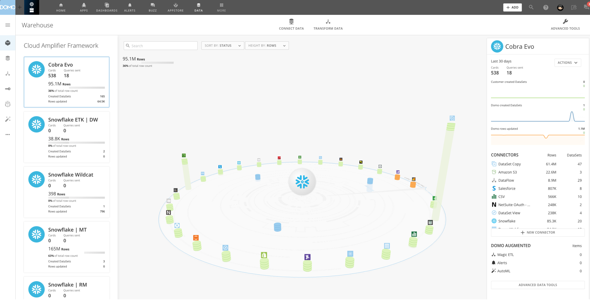

### Add a DataSet using a Connector

When you add a DataSet, you are automatically assigned as the DataSet owner. For information about changing the owner of a DataSet, see Changing the Owner of a DataSet.

You can access the interface for adding Connector DataSets via the Appstore, the Data Center, or the menu.

**To add a DataSet using a Connector**

1. Choose one of the following:

   - (Conditional) If you want to connect to data via the **APPSTORE**, do the following:

     - Select _Appstore_ in the toolbar at the Features Section of the left menu
     - Use the search bar to locate the Connector you want to connect to, then click it to open its details view.
     - Click _Get the Data_.

   - (Conditional) If you want to connect to data via the **DATA CENTER**, do the following:

     - Go to  _Datasets_ in the Features Section at the left menu.
     - Select Connect Data at the top menu
     - In the Connect Data submenu at the top of the screen, select _Connectors_, _Upload a spreadsheet_, depending on the connection type.

     - You can use the following table to learn more about these Connector types:

       | Connector Type | Description                                                                                                                                                                                   |
       | -------------- | --------------------------------------------------------------------------------------------------------------------------------------------------------------------------------------------- |
       | Connectors     | A Connector for a third-party app in which data is stored in the cloud. Most of Domo's Connectors fall into this category. Examples include Facebook, Salesforce, Adobe Analytics, and so on. |
       | Upload a Spreadsheet           | A Connector used to pull files into Domo. Examples include Excel, Google Sheets, and Box.                                                                                                     |
       

     - The other  icons in this area denote other non-Connector methods for bringing data into Domo. Federated refers to federated DataSets, and Cloud Integration refers to native integration with different CDW (i.e. Snowflake).
     - Select the Connector type you want.
     - Click the desired Connector tile.

     _Note: Popular Connectors are marked with a Preferred tag. This is also used when there are several different Connectors to the same data, such as Facebook. The most commonly used option will display the Preferred tag._

1. Specify the settings in each section. - Refer to the general information included in this topic and to the help in the specific data Connector.
   _For more information about configuring specific data Connectors, see Configuring Each Connector.
   As applicable, click Connect, Next, or Save and open the next section._
1. When finished, click _Save_.
   - You are taken to the details view for the DataSet in the Data Center. For more information about this view, see Data Center Layout.

### Connector Settings

All [Connector](https://domo-support.domo.com/s/topic/0TO5w000000ZammGAC/connect-data-to-domo?language=en_US) types in Domo have different options for setting up a DataSet.

Most Connectors require you to enter login credentials, an API key, a server URL, or a combination of these to access the Connector. If you cannot connect after entering your credentials, you have most likely entered incorrect credentials.

After you connect, you are usually asked for information about the data you want to pull and the desired format. Most Connectors have two or more associated report types. In addition, many Connectors request a timeframe for the data to be retrieved. You may also be asked to submit a query for retrieving data. For example, when connecting to JIRA you can enter a JQL query to retrieve data for a specified search filter.

For most Connectors, you are also asked to schedule data updates. You can use basic scheduling, in which you select a single, specific unit of time (such as "Every hour") and enter the time of day when the update is to occur, if required. Or you can use advanced scheduling, in which you can select multiple update times.

### Connector Credentials

If required, specify the credentials for connecting to the data provider. If available, you can select an account or create an account to use in connecting. For more information about accounts, see [Manage Connector Accounts](https://domo-support.domo.com/s/article/360042926054).

Some Connectors, such as Google Drive, use OAuth to connect. This means that you only need to enter your credentials once for a given account. In the future, when you go to create a DataSet using this Connector account, your credentials are passed in automatically. Other Connectors do not use OAuth, so you must enter your credentials each time you create a DataSet using this Connector account.

#### Connector Details

Most Connectors include a Details settings category. Here you usually specify options like the report to run, the timeframe for the data, a data query for pulling specific information from a database, and so on. If a query is required, the type of query you need to use depends on the Connector type and the source data in your system.

Click _Load Preview_ to verify that your data is accessible. If connection errors occur, verify the specified connection information.

### Connector Scheduling

In the **Scheduling** settings category, you can specify the update schedule, retry settings, and update method you want for this DataSet.
You can use either basic or advanced scheduling for connectors.

#### Basic scheduling

In the **Basic Scheduling** tab, you can create a basic update schedule in which you specify a predefined update interval for this DataSet (such as "every Monday at 10:00 AM").

By default, schedules are set from the current time. Update intervals include every hour, day, weekday, week, month, and manually. Schedule times are based on UTC and will also show what time that is for you based on your Company Time Zone setting.
For hour, day, and week options, you can specify the interval (every # hours/days/weekdays) and the start period.

_Note: If you set a Connector schedule using the hourly method, the end time is not inclusive. For example, if the schedule is set to hourly with the active hours set to run 8 AM UTC to 7 AM UTC it will skip the 7 AM UTC run because the end hour is not treated as inclusive.
If you select Manually for your update interval, you can instruct Domo to send you a notification when the data has not been updated for a given period of time. Time periods range from one hour to three months._

  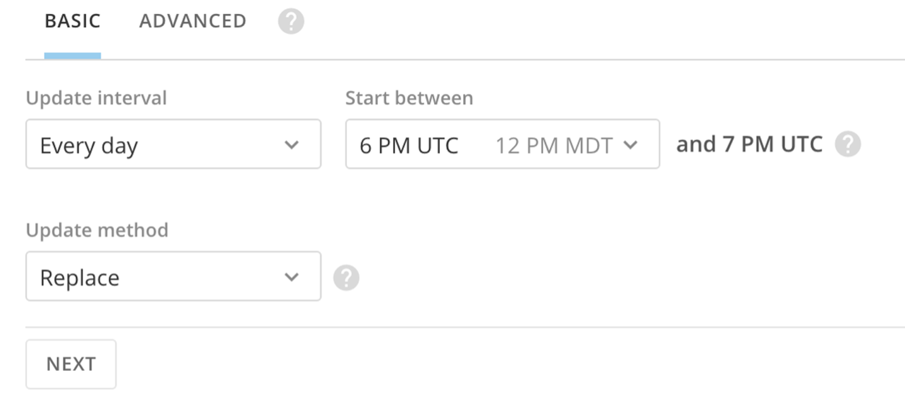

_Note: If you need your DataSet to update faster than every 15 minutes, please reach out to your account team for evaluation._

#### Update Method

When creating or editing a DataSet, you can specify whether to append or replace data when updates occur. The update options are found at the bottom of the Basic Scheduling and Advanced Scheduling tabs.
| Option | Description |
|----|----|
| Replace | Replace the current version of the data with a new version of the data. Previous versions are preserved. |
| Append | Add data to the current version of the data, increasing the size of the DataSet. |
Upsert | Update DataSets with restated data to ensure you have the most up-to-date information. Available for selected connectors only. For a list of available connectors, see [DataSet Update Methods](https://domo-support.domo.com/s/article/360043430733). |
Partition | Select a rolling window of data to keep, making it easier to focus on relevant data. Available for selected connectors only. For a list of available connectors, see [DataSet Update Methods](https://domo-support.domo.com/s/article/360043430733).

### Advanced Scheduling

In the **Advanced Scheduling** tab, you have more control over when data is updated than you do when using basic scheduling. You can create schedules by month, day of the month, or day of the week. You can even specify which days of the week out of the month you want to update (for example, every second and fourth Sunday).

You can indicate whether updates are done on a set interval (such as "every 15 minutes," "every 8 hours," etc.) or at a specified time. You can also set the start time (based on the current minute). If you want, you can set the update schedule to start immediately.

_Note: If you need your DataSet to update faster than every 15 minutes, please reach out to your account team for evaluation.
Schedule times are based on UTC but can be seen in your timezone._

  
  


### Connector Error handling

Retry settings determine whether Domo should attempt to retry if updates fail for this DataSet and, if so, the frequency and maximum number of retries. These settings apply only to scheduled runs, not manual runs. You access the retry options dialog by selecting *Always retry when an update fails*.

  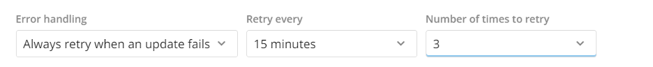

The options in this dialog are as follows:
| Option | Description |
|----|----|
| Always retry when an update fails | Domo retries to update the DataSet. After retrying the specified number of times, Domo sends a notification if the update attempt is unsuccessful. |
| Do not retry when update fails | Domo sends a notification if the update attempt is unsuccessful, and no retries are made.|


### Connecting to Snowflake
Domo's native Snowflake integration enables direct, real-time connectivity to your Snowflake data warehouse without the need to extract, copy, or move data into Domo's infrastructure. Using Cloud Integration to Snowflake, Domo pushes query execution directly to Snowflake, leveraging its compute power while keeping your data securely in place. This approach eliminates data duplication, reduces storage costs, and ensures you're always working with the most current data available in your Snowflake environment

### Create a Magic ETL DataFlow

Follow these steps to create a *Magic ETL* DataFlow:

1. Navigate to the Domo *Data Center*.

1. In the ribbon at the top of the Data Center, select *Transform Data* > *Magic ETL* to open the Magic ETL canvas.

    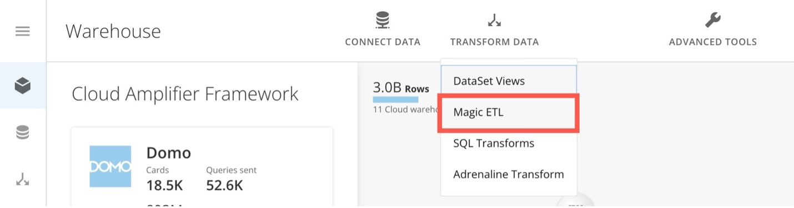

1. In the left panel, expand DataSets and drag an Input DataSet tile to the canvas.

    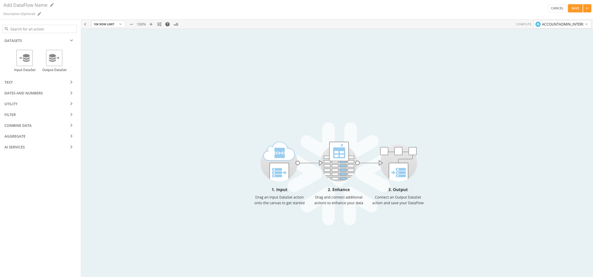

1. The tile editor expands below the canvas.

    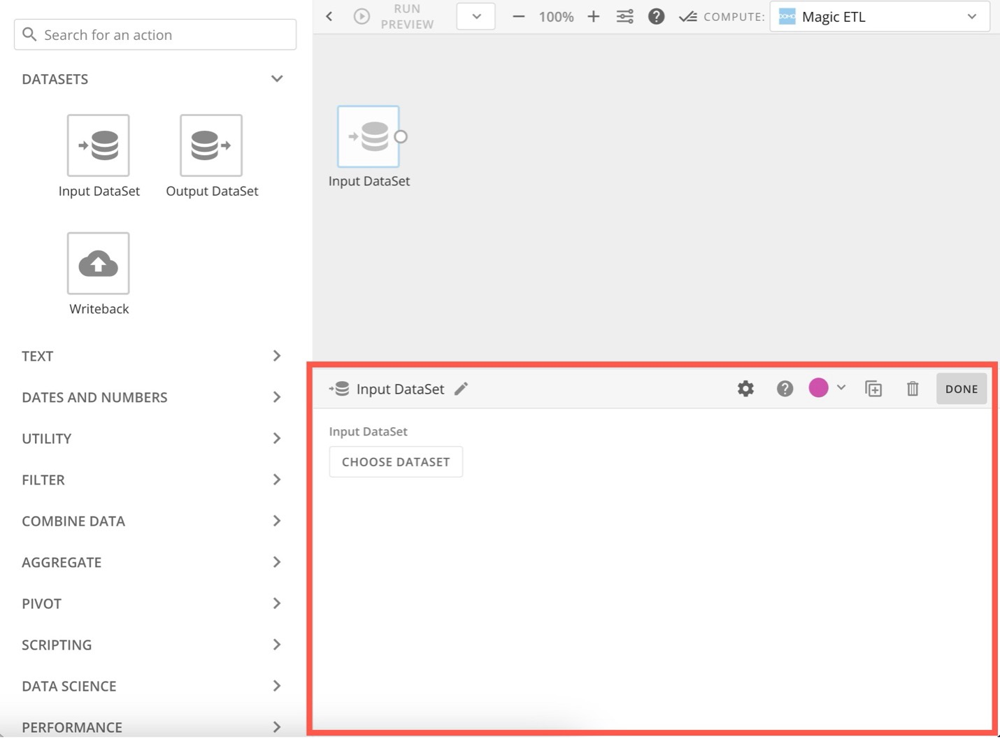

1. In the tile editor, select Choose DataSet to choose the DataSet you want to transform.

1. Drag other tiles to the canvas, depending on what transformations you want to make, and make sure they are all connected by dragging the nodes on the sides of each tile to the node on the next tile.

1. Configure the Output DataSet tile:

   1. Connect a tile to the Output DataSet tile.
   1. Select the Output DataSet tile, then enter a name for the new output DataSet.
   1. (Optional) Schedule the DataFlow. By default, you must run the DataFlow manually. You can schedule it to run when a trigger activates. See [Advanced DataFlow Triggering](https://domo-support.domo.com/s/article/000005216) to learn more.
   1. Enter a name and description for the DataFlow.
   1. Select Save to keep your changes, adding an optional version description before saving again.
   1. When you save a DataFlow, an entry for this version is added to the Versions tab in the Details view for the DataFlow. If you add a version description, it appears in the version entry. Learn about Viewing the Version History for a DataFlow.

### Tips and Notes

- You must configure each tile in the editor before you can configure the following tile. If a tile is not configured, the connector to the next tile appears as a dashed line.  
  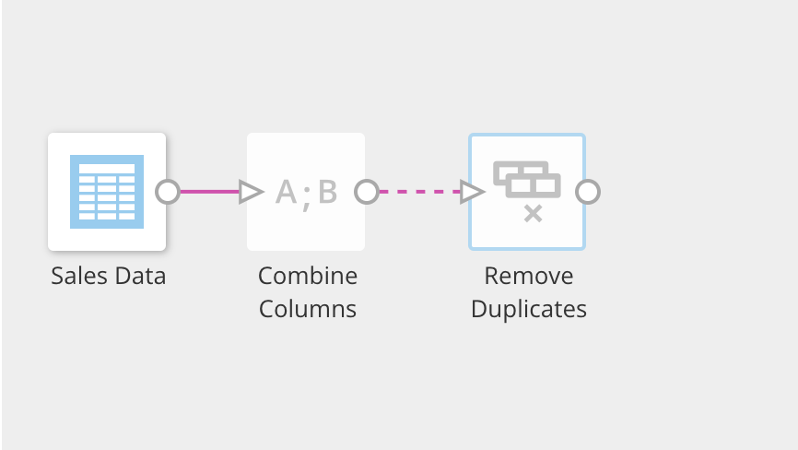

- Use the search tool in the left panel to find the tile you need.  
  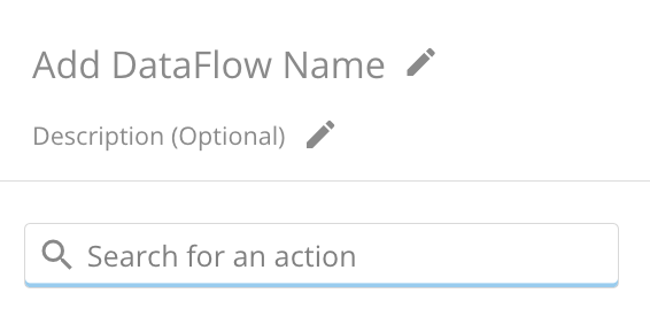

- The Mini Map displays in the corner of the screen and helps you see the layout and navigate around complex and detailed DataFlows. Click and drag the white square in the mini map to move to a certain view of the DataFlow on the canvas.  
  

- If you close the mini map, reopen it by selecting the map pointer icon.  
  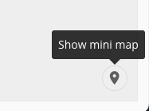

- You can get help on a specific tile in the canvas by clicking the tile, then clicking .

- You can select a number of tiles at once by clicking on the canvas then dragging the mouse pointer over them. When multiple tiles are selected, you can drag all of the selected tiles as a group to where you want them. You can also delete the selected tiles by selecting Delete in the left panel.

Why are output DataSets not marked as Updated when the DataFlow completes successfully?

This is usually because the data has not actually changed—no update has occurred. The DataSets show as updated if the data has changed during a successful DataFlow execution.

#### Best Practices for Magic ETL DataFlows

We recommend the following for your DataFlow:

- Only include the DataSets that are necessary to create the output DataSet.
- Filter out rows that you don't need at the beginning of the DataFlow. Learn about Filter tiles.
- Reduce the number of columns to only those you need.
- Use descriptive names for each tile in your DataFlow.
- List the following in your DataFlow description:
  - The input DataSets being transformed and their owner's names.
  - The output DataSet created.
- Give your DataFlow the same name as the output DataSet.
  - This is because the outputs of a DataFlow become their own DataSet in the Data Center, and this allows you to more easily identify which DataFlows contribute to which output DataSets.
- Be aware that some tiles take longer to execute than others, including:
  - Group By
  - Rank & Window
  - Join Data
  - Remove Duplicates
  - Pivot
  - Scripting tiles
  - Data Science tiles

### Connect to Your Data

1. Select the _DataFlows_ icon on the left  
  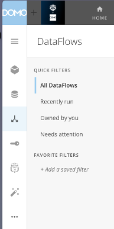

1. Locate the Mixed Media Model Dataflow  
  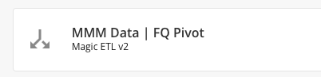

1. Select the input dataset and click _Change Dataset_ to replace the sample data with the data you have created through this quickstart.
  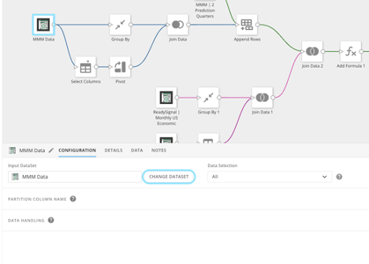

#### Data Structure Requirements

**Required Fields**

| Field Type | Description | Example |
|------------|-------------|---------|
| **Revenue** | Numeric sales/revenue metric | `total_revenue`, `sales_amount` |
| **Date** | Time dimension (weekly recommended) | `week_start_date`, `report_date` |
| **Channel Spend** | Marketing spend per channel (2-10 channels) | `facebook_spend`, `google_ads_spend` |

**Optional Fields**

| Field Type | Description | Example |
|------------|-------------|---------|
| **Control Variables** | External factors affecting revenue | `seasonality_index`, `competitor_activity` |
| **Custom Variables** | Binary or numeric indicators | `promotion_flag`, `holiday_indicator` |

#### Example Data Schema

```sql
-- Example: Marketing Performance Dataset
SELECT
    week_start_date,           -- Date field
    total_revenue,             -- Revenue field
    facebook_ads_spend,        -- Channel 1
    google_search_spend,       -- Channel 2
    google_display_spend,      -- Channel 3
    tiktok_spend,              -- Channel 4
    email_marketing_spend,     -- Channel 5
    tv_advertising_spend,      -- Channel 6
    seasonality_index,         -- Control variable
    is_holiday_week            -- Custom variable
FROM marketing_performance
WHERE week_start_date BETWEEN '2022-01-01' AND '2024-12-31'
ORDER BY week_start_date;
```

#### Data Requirements

| Requirement | Specification |
|-------------|---------------|
| Minimum Channels | 2 marketing channels |
| Maximum Channels | 10 marketing channels |
| Minimum Date Range | 52 weeks |
| Maximum Date Range | 104 weeks (~2 years) |
| Currency | All channels should use same currency |
| Granularity | Weekly  granularity (weekly recommended) |


<!-- ------------------------ -->

## Configure the Model

Domo MMM uses your prepared dataset to build a Bayesian Marketing Mix Model. The configuration wizard guides you through three key decisions: which revenue metric to optimise, which marketing channels to include in the analysis, and any external factors (like seasonality or promotions) that affect revenue independently of marketing spend.

The model will then run 4,000 Bayesian simulations to calculate the incremental contribution of each channel, accounting for adstock (the carryover effect of marketing spend) and saturation (diminishing returns at higher spend levels). This typically takes 5 to 15 minutes depending on your data volume.

Once complete, you'll have access to channel performance dashboards, statistical validation metrics, budget optimisation recommendations, and AI-powered natural language insights through Snowflake Cortex AI.

### Step 1: Launch the Application

1. Navigate to **App Studio** in your Domo instance
2. Search for "Domo MMM"
3. Click to launch the application
4. You'll see the **Welcome** screen


### Step 2: Field Mapping

Click **"Get Started"** to begin the configuration wizard.

#### Select Revenue Dataset

1. Click **"Select Dataset"** dropdown
2. Search for your marketing performance dataset
3. Select the dataset containing revenue and channel data

#### Map Revenue and Date Fields

1. In **"Revenue Amount"** dropdown, select your revenue metric
2. In **"Date Field"** dropdown, select your time dimension
3. Select the date range using the date pickers
4. Ensure you have at least 8 weeks of data

#### Add Marketing Channels

For each marketing channel:

1. Map the spend field (e.g., `facebook_ads_spend`)
2. 6. Repeat for all channels (minimum 2, maximum 10)
3. If there is more than 10 marketing Channel, click **"+ Add Channel"**
4. Map the aditional spend field (e.g., `facebook_ads_spend`)


#### Add Control Variables (Optional)

Control variables help account for external factors:

1. Click **"+ Add Control Variable"**
2. Select the control variable field
3. Examples: `seasonality_index`, `competitor_price_index`

### Step 3: Set iROAS Priors (Optional)

iROAS priors incorporate your domain knowledge into the model:

> **What are Priors?** In Bayesian statistics, priors represent your existing knowledge before seeing the data. Setting iROAS priors helps the model converge faster and can improve accuracy when you have reliable historical benchmarks.

1. Click **"Set iROAS Priors"** (optional section)
2. For each channel, enter expected iROAS value
3. Leave blank to let the model determine values from data

| Channel | Example Prior | Rationale |
|---------|--------------|-----------|
| Facebook Ads | 2.5 | Historical platform benchmarks |
| Google Search | 3.5 | High-intent traffic typically performs well |
| Display Ads | 1.2 | Awareness channels often have lower direct iROAS |
| Email Marketing | 5.0 | Low cost channel with high returns |


### Step 4: Save Configuration

1. Review all mappings in the summary panel
2. Click **"Save Mapping"**
3. System validates configuration:
   - Minimum 2 channels
   - 52-104 weeks of data
   - No duplicate column mappings
   - Required fields present

     
<!-- ------------------------ -->

## Run the Analysis

### Launching Model Execution

After saving your configuration:

1. Click **"Run Stella MMM Analysis"**

     
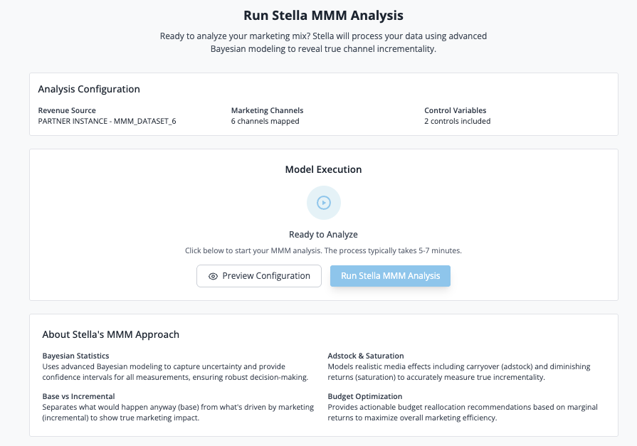

3. The workflow execution modal appears
4. Monitor progress through 6 phases:

### Execution Phases

| Phase | Description |
|-------|-------------|
| Data Validation | Verifying data quality and completeness |
| Feature Engineering |  Creating adstock transformations and normalizations |
| Bayesian Model Setup |  Initializing PyMC model with priors |
| MCMC Sampling |  Running Markov Chain Monte Carlo sampling |
| Posterior Analysis | Computing statistics on posterior distributions |
| Generating Insights | Calculating metrics and preparing visualizations |

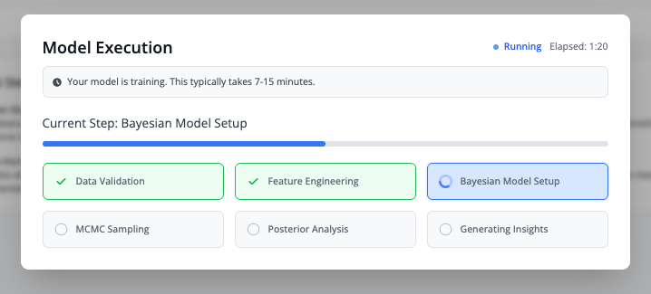

### What Happens Behind the Scenes

The Domo Code Engine executes a PyMC-based Bayesian model that:

1. **Applies Adstock Transformation** - Models carryover effects of marketing spend
2. **Applies Saturation Curves** - Uses Hill function to model diminishing returns
3. **Runs MCMC Sampling** - Generates thousands of samples from posterior distribution
4. **Calculates Key Metrics** - iROAS with confidence intervals, channel contribution, revenue decomposition

> **Note**: Model execution typically takes 5-15 minutes depending on data volume and number of channels. Do not close the browser during execution.

### Output Datasets

When the model execution completes, the following datasets are created in Snowflake to support the visualizations:

| Dataset Name | Purpose | Visualization |
|--------------|---------|---------------|
| Stella MMM metrics summary data | Core model metrics (R², MAPE, incremental revenue) | Metric Cards |
| Stella MMM metrics Channel Performance | Channel-level iROAS and attribution | iROAS Chart |
| Stella MMM metrics Waterfall Decomposition Data | Revenue decomposition by component | Waterfall Chart |
| Stella MMM metrics Contribution Breakdown over time | Weekly contribution trends | Contribution Over Time Chart |
| Stella MMM metrics VIF Results | Variance Inflation Factor (multicollinearity) | VIF Analysis |
| Stella MMM Correlation Matrix | Variable correlation values | Correlation Matrix Heatmap |
| Stella MMM metrics Out of Sample Data | Model validation on test data | Out of Sample Chart |
| Stella MMM metrics Budget Optimization Data | Current budget allocation | Budget Allocation |
| Stella MMM metrics Budget Optimization Summary Data | Optimization summary metrics | Budget Summary Cards |
| Stella MMM Optimization Details | Budget optimizer results | Optimization Results |
| Stella MMM Allocation Summary | Channel allocation recommendations | Allocation Comparison |

These datasets can be accessed in Domo's Data Center for further analysis or custom reporting.

<!-- ------------------------ -->

## Interpret Results

Once the model completes, you'll be taken to the **Insights Dashboard** with four main tabs.

### Tab 1: Channel Performance

Contains two view toggles: **Performance View** and **Contribution View**.

#### iROAS Chart

Displays the Incremental Return on Ad Spend for each marketing channel with 95% confidence intervals.

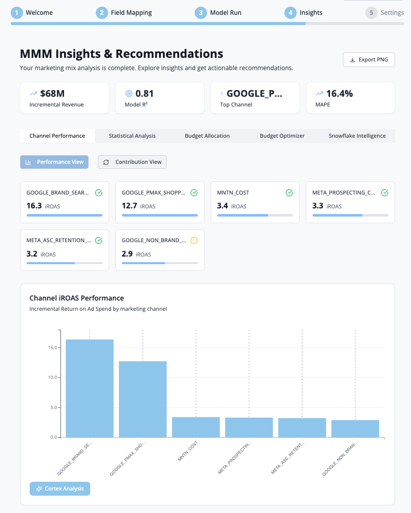

#### Revenue Waterfall Analysis

Shows the incremental revenue contribution by marketing channel.

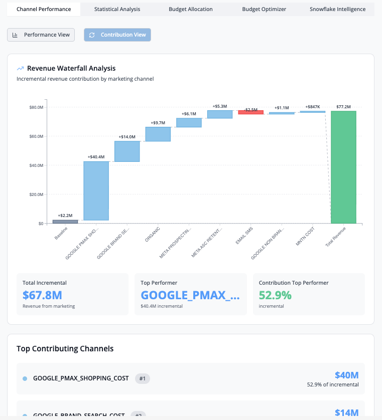


### Tab 2: Statistical Analysis

This tab provides statistical validation metrics and diagnostics to assess model quality and reliability.

**Model R²**: Measures how well the model explains revenue variance (higher is better, target >0.70)

**MAPE (Mean Absolute Percentage Error)**: Average prediction error as a percentage (lower is better, target <15%)

**Total Incremental Revenue**: Sum of all marketing-driven revenue across channels

#### VIF Analysis

Variance Inflation Factor (VIF) measures multicollinearity between marketing variables. VIF values above 10 indicate high correlation between channels, which may affect model reliability.


#### Correlation Matrix

Heatmap displaying pairwise correlations between all model variables.

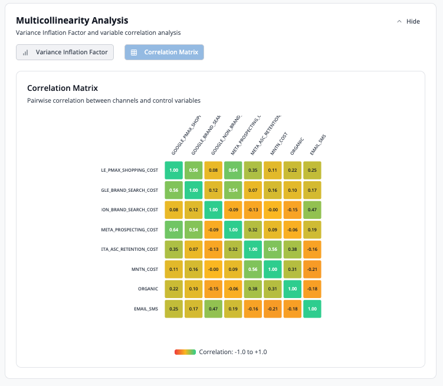


#### Out of Sample Analysis

Model performance metrics on unseen test data with prediction intervals to validate accuracy.

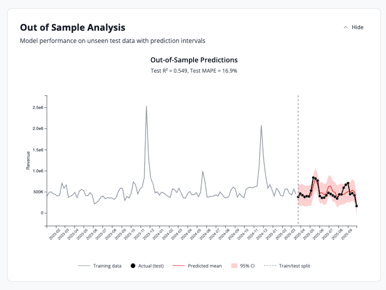

### Tab 3: Budget Allocation

Displays KPI cards (Total Budget, Recommended Allocation, Optimized Revenue, Revenue Lift %) and model-recommended budget allocation by channel based on iROAS rankings.

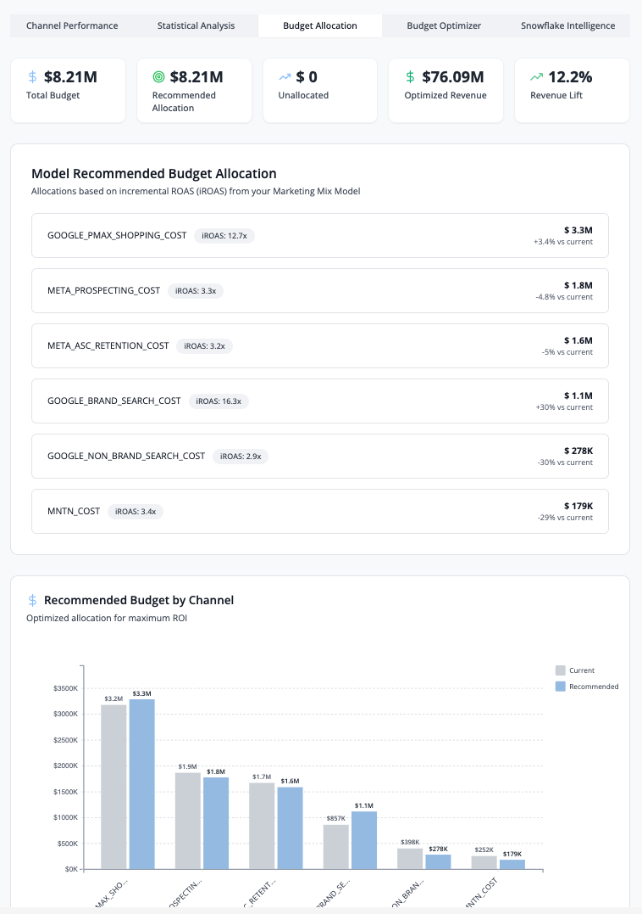

### Tab 4: Budget Optimizer

The Budget Optimizer recommends optimal spend allocation across channels, maximizing total revenue within your budget constraints.

**Features:**
- **Current Allocation**: Your existing budget distribution
- **Recommended Allocation**: AI-optimized budget distribution
- **Projected Lift**: Expected revenue increase from optimization
- **Constraints**: Set min/max budgets per channel to reflect business requirements

**How to Use:**
1. Review current vs. recommended allocations
2. Adjust constraints if needed (e.g., minimum brand spend)
3. Click "Apply Scenario" to see projected impact
4. Export recommendations for planning

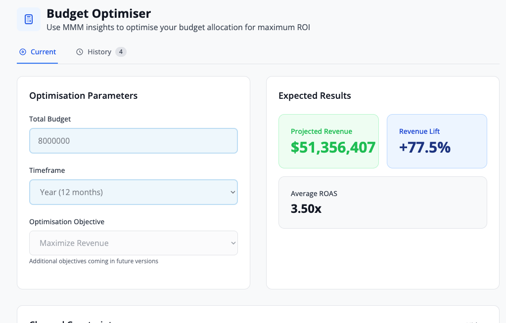

<!-- ------------------------ -->

## AI-Powered Insights with Snowflake Cortex

> **Snowflake Cortex Integration**: This feature provides AI-powered natural language insights on your MMM results.

### Enabling Cortex Analysis

The **Cortex Analysis** button is available in the **Channel Performance** and **Statistical Analysis** tabs:

1. Navigate to Channel Performance or Statistical Analysis tab
2. Click the **"Cortex Analysis"** button
3. AI analyzes the current view and generates insights

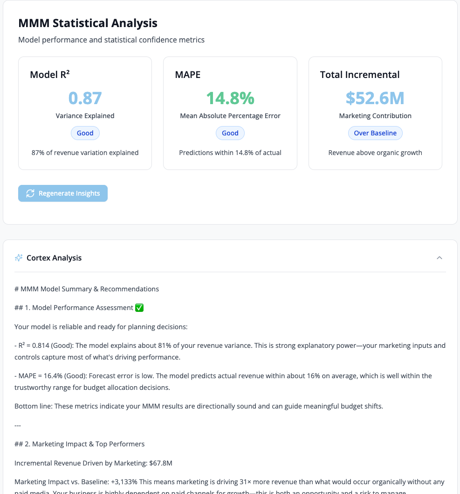

<!-- ------------------------ -->

## Snowflake Intelligence Integration

AI-powered chat interface for natural language insights on your MMM results. This feature enables you to ask questions in natural language about your model execution results and receive contextually relevant answers powered by Snowflake Cortex AI.

### How It Works

The Snowflake Intelligence integration uses a **Semantic View** to define relationships between the MMM output datasets. The semantic view is built around a central concept: the **Document ID**, which serves as the execution identifier that links all output tables from a single model run.

When you run the Domo MMM analysis, each execution generates a unique `documentID`. This identifier is written to every output dataset, creating a relational structure that allows the Cortex Agent to understand how data across different tables relates to a specific model execution.

### Setting Up Snowflake Intelligence

To enable this feature, you need to configure two components in your Snowflake environment:

**1. Create the Semantic View**

In Snowflake, create a Semantic View that includes the 10 output datasets generated by Domo MMM:

- `STELLA_MMM_VARIABLES` (base table - model configuration and inputs)
- `STELLA_MMM_METRICS_SUMMARY_DATA`
- `STELLA_MMM_METRICS_CHANNEL_PERFORMANCE`
- `STELLA_MMM_CORRELATION_MATRIX`
- `STELLA_MMM_ACTUAL_VS_PREDICTED_DATA`
- `STELLA_MMM_METRICS_OUT_OF_SAMPLE_DATA`
- `STELLA_MMM_METRICS_CONTRIBUTION_BREAKDOWN_OVER_TIME`
- `STELLA_MMM_METRICS_WATERFALL_DECOMPOSITION_DATA`
- `STELLA_MMM_METRICS_BUDGET_OPTIMIZATION_DATA`
- Additional optimization tables as needed

Define relationships between these tables using `DOCUMENTID` as the join key. This ensures that when the Cortex Agent answers questions, it retrieves coherent results from a single model execution. Each table should include business definitions for all columns and metrics to help the AI understand the semantic meaning of the data.

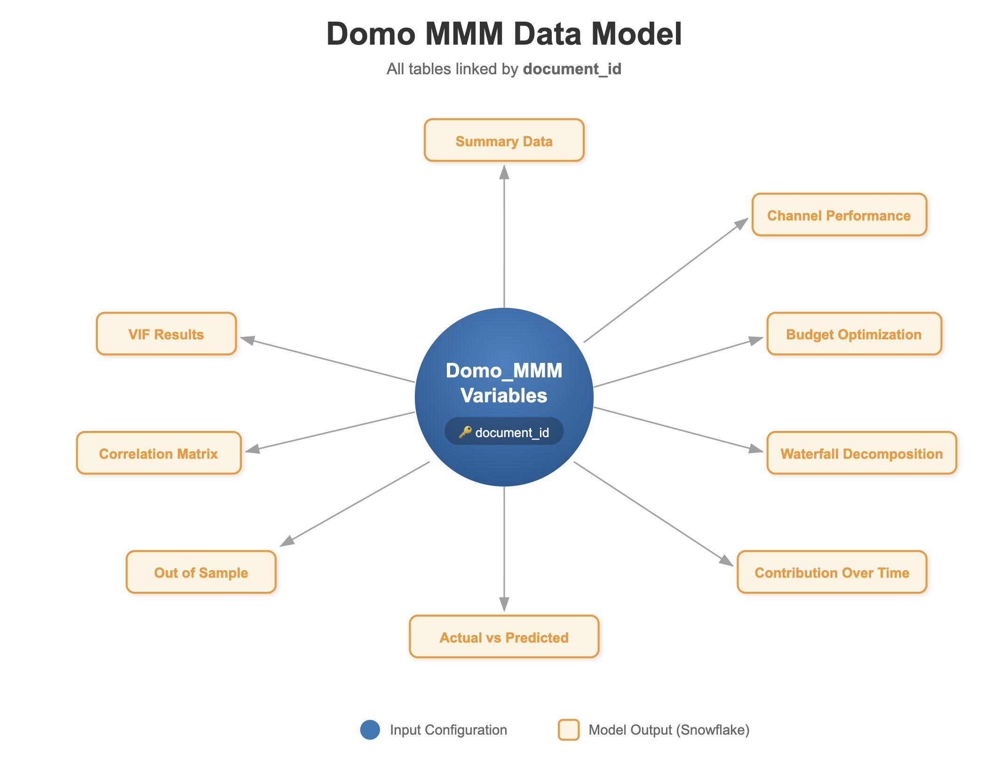

**2. Create a Cortex Agent**

Create a Snowflake Cortex Agent that uses the Semantic View you configured. The agent interprets natural language queries and generates SQL to retrieve answers from the semantic view.

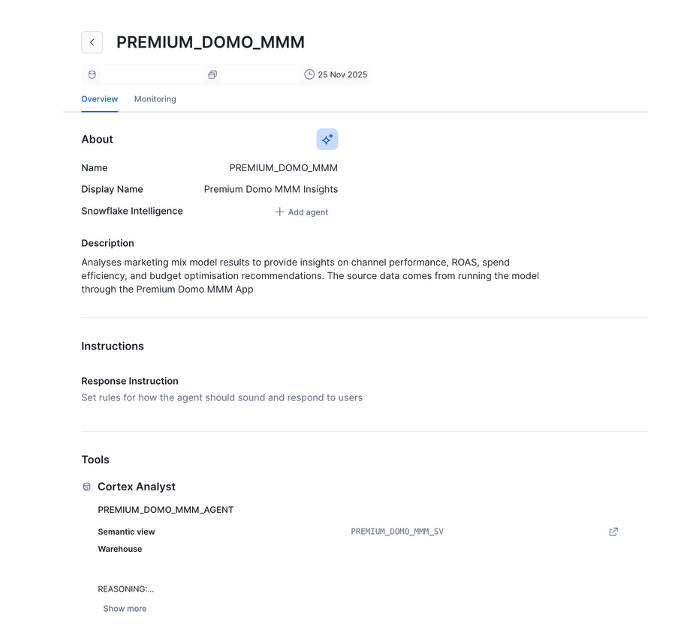

**3. Configure Agent Behavior**

Define the agent's behavior to ensure responses are relevant to marketing mix modeling:

- Provide context about MMM concepts (iROAS, incrementality, Bayesian modeling)
- Instruct the agent to always filter by `documentID` when answering questions
- Configure response style (concise, data-driven, with statistical context)
- Set parameters for response length and specificity

**4. Connect to Domo MMM**

Once the Cortex Agent is deployed:

1. Note the agent's endpoint and authentication credentials
2. In Domo MMM configuration, provide the Snowflake connection details
3. Grant appropriate permissions for the agent to access MMM datasets

### Using Snowflake Intelligence in Domo MMM

Once configured, the Snowflake Intelligence tab provides:

- **Natural Language Queries**: Ask questions about model results in plain English
- **Contextual Responses**: Answers are automatically filtered to the current execution (documentID)
- **Data-Driven Insights**: Agent retrieves actual values from output datasets, not generic recommendations
- **Follow-Up Questions**: Maintain conversation context for deeper analysis

**Example Queries:**

- "Which channel should I invest more in based on iROAS?"
- "What's the confidence interval for Facebook's incremental contribution?"
- "How does my model fit compare to best practices?"
- "What budget reallocation would maximize revenue?"

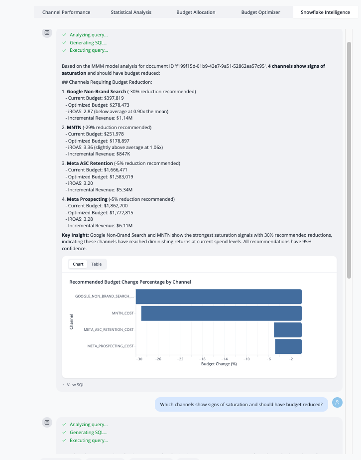

### Requirements Summary

To enable Snowflake Intelligence, ensure:

- Snowflake account with **Cortex Agents** feature enabled
- MMM output datasets written to Snowflake (via Domo connector or federated dataset)
- **Semantic View** created with proper `documentID` relationships and business definitions
- **Cortex Agent** deployed and connected to the semantic view
- Domo MMM configured with Snowflake connection details
- Proper database and schema permissions for the agent service account


<!-- ------------------------ -->

## Best Practices

### Data Quality

| Practice | Why It Matters |
|----------|----------------|
| Use weekly aggregation | Optimal balance of granularity and statistical power |
| Include 1-2 years of data | Captures seasonality and long-term patterns |
| Validate spend data with finance | Ensures accuracy of channel attribution |
| Remove test/invalid data | Prevents model contamination |

<!-- ------------------------ -->

## Troubleshooting

### Common Issues and Solutions

#### Model Won't Run

| Symptom | Cause | Solution |
|---------|-------|----------|
| "Minimum 2 channels required" | Less than 2 channels mapped | Add more marketing channels |
| "Insufficient data" | Less than 8 weeks | Extend date range or add more data |
| "Duplicate column mapping" | Same field used twice | Review and remove duplicate mappings |

#### Poor Model Quality

| Symptom | Cause | Solution |
|---------|-------|----------|
| Low R² (< 0.70) | Missing important variables | Add control variables |
| High MAPE (> 25%) | Data quality issues | Review and clean input data |
| High VIF (> 10) | Multicollinearity | Combine correlated channels |

#### Unexpected Results

| Symptom | Cause | Solution |
|---------|-------|----------|
| Negative iROAS | Data issues or wrong mapping | Verify spend/revenue mapping |
| All channels similar iROAS | Insufficient variation | Need more diverse spending patterns |
| Baseline dominates | Marketing has low impact | Normal for some businesses, or check data |

### Getting Help

If you encounter issues not covered here:

1. **Domo Support**: Contact through the Domo Help Center

<!-- ------------------------ -->

## Conclusion and Resources

### Conclusion

With Domo MMM, you're now equipped to measure true marketing incrementality, optimize campaign performance, and maximize ROI through data-driven budget allocation. The Bayesian approach provides statistical confidence in your results, while Snowflake Cortex AI integration enables natural language insights for faster decision-making.

### What You Learned

By following this guide, you've learned how to:
- Request and deploy Domo MMM for your organization
- Prepare marketing data with proper structure and requirements
- Configure field mappings and set iROAS priors
- Run Bayesian Marketing Mix Model analysis
- Interpret iROAS, contribution, and diagnostic metrics
- Use AI-powered budget optimization recommendations
- Leverage Snowflake Cortex for natural language insights

### Related Resources

For further learning, explore the following resources:
- [Domo Knowledge Base](https://domo-support.domo.com/s/knowledge-base?language=en_US)
- [Snowflake Marketplace](https://www.snowflake.com/en/data-cloud/marketplace/)
- [Marketing Mix Modeling Overview](https://en.wikipedia.org/wiki/Marketing_mix_modeling)
- [Stella](https://www.stellaheystella.com/)
- [Snowflake Cortex AI](https://docs.snowflake.com/en/user-guide/snowflake-cortex/overview)
- [Domo Community](https://www.domo.com/domo-central/community)
- [Domo Community Forum](https://community-forums.domo.com/main)
- [Domo Support](https://www.domo.com/login/customer-community)
- Architecture
  
