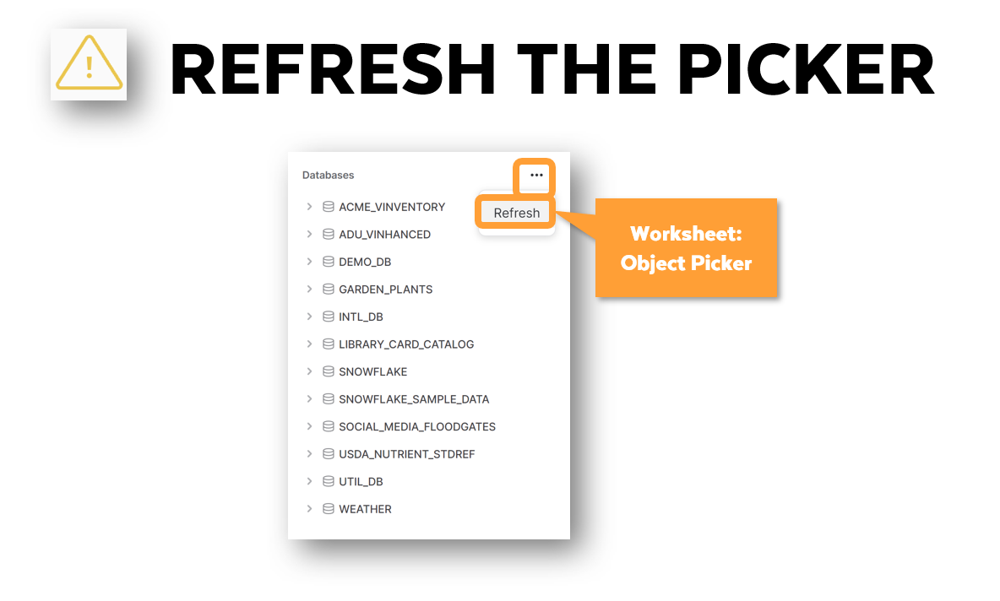

author: Gilberto Hernandez
id: snowflake-auto-grader
summary: In this guide, you'll set up Snowflake's Auto-Grader.
categories: Getting-Started
environments: web
status: Hidden 
feedback link: https://github.com/Snowflake-Labs/sfguides/issues
tags: Getting Started, Data Science, Data Engineering, Twitter 

# How to Setup the Snowflake Auto-Grader
<!-- ------------------------ -->
## Overview 
Duration: 0

In this guide, you'll learn how to setup Snowflake's auto-grader.

The auto-grader runs in your Snowflake account and can be used to check successful completion of tasks within a Snowflake account.


### What You’ll Learn 
- How to setup the auto-grader


### What You’ll Need 
- A Snowflake account

<!-- ------------------------ -->
## Create the API integration
Duration: 2

In your Snowflake account, open a new SQL worksheet and run the following code:

```sql
use role accountadmin;

create or replace api integration dora_api_integration 
api_provider = aws_api_gateway 
api_aws_role_arn = 'arn:aws:iam::321463406630:role/snowflakeLearnerAssumedRole' 
enabled = true 
api_allowed_prefixes = ('https://awy6hshxy4.execute-api.us-west-2.amazonaws.com/dev/edu_dora');
```

This code will create an API integration in your Snowflake account under the `ACCOUNTADMIN` role. To confirm that the integration was created, you can run the following:

```sql
show integrations;
```

If the integration was successfully created, you should see output similar to the following:

| **name**             | **type**     | **category** | **enabled** | **comment** | **created_on**                |
|----------------------|--------------|--------------|-------------|-------------|-------------------------------|
| _API_INTEGRATION | EXTERNAL_API | API          | true        |             | 2023-02-03 12:36:22.470 -0700 |


<!-- ------------------------ -->
## Create the `grader` function
Duration: 2

Next, create the `grader` function. This function will be used for validating the successful completion of lab steps in your account.

Run the following code in a new SQL worksheet:

```sql
use role accountadmin;

create database util_db;

create or replace external function util_db.public.grader(        
 step varchar     
 , passed boolean     
 , actual integer     
 , expected integer    
 , description varchar) 
 returns variant 
 api_integration = dora_api_integration 
 context_headers = (current_timestamp,current_account, current_statement, current_account_name) 
 as 'https://awy6hshxy4.execute-api.us-west-2.amazonaws.com/dev/edu_dora/grader'  
;  
```

The `grader` function will be located in the `UTIL_DB.PUBLIC` schema in your account. If you don't see the function, refresh the objects in the **Databases** section of your account. In addition, ensure you are using the `ACCOUNTADMIN` role.


<!-- ------------------------ -->
## Confirm that the auto-grader is provisioned correctly
Duration: 1

To confirm that the auto-grader is functioning as intended, open a new SQL worksheet and run the following code:

```sql
use role accountadmin;
use database util_db;
use schema public;

select grader(step, (actual = expected), actual, expected, description) as graded_results from (SELECT
 'DORA_IS_WORKING' as step
 ,(select 123) as actual
 ,123 as expected
 ,'The Snowflake auto-grader has been successfully set up in your account!' as description
);
```

If the auto-grader is correctly provisioned, you should see a **GRADED_RESULTS** column with several pieces of information, including a checkbox and a message `"description": "The Snowflake auto-grader has been successfully set up in your account!"`.
<!-- ------------------------ -->
## Create the `greeting` function
Duration: 2

Next, you'll create the `greeting` function. This function will link your Snowflake account to our badging system. If you don't complete this step, you'll risk not receiving your badge.

Run the following code in new SQL worksheet:

```sql
use role accountadmin;

use database util_db;

create or replace external function util_db.public.greeting(
      email varchar
    , firstname varchar
    , middlename varchar
    , lastname varchar)
returns variant
api_integration = dora_api_integration
context_headers = (current_timestamp, current_account, current_statement, current_account_name) 
as 'https://awy6hshxy4.execute-api.us-west-2.amazonaws.com/dev/edu_dora/greeting'
; 
```

The `greeting` function will be located in the `UTIL_DB.PUBLIC` schema in your account. If you don't see the function, please refresh the objects in the **Databases** section of your account. In addition, ensure you are using the `ACCOUNTADMIN` role.

<!-- ------------------------ -->
## Register your name and email
Duration: 1

Next, you'll need to register your name and email. You'll do this by running the `greeting` function with your name and email. This information will be used to issue your badge. Here are some important rules to follow PRIOR to running the SQL below:

* Do **not** use all capital letters.
* Do **not** use all lowercase letters.
* Do **not** use CamelCase – put spaces between your words if there are spaces between the words in your name.
* You must enter both a first and last name. Middle names are optional. Single letters do not count as names.
* You can use accents or letters from any language.
* You can use as many words as you want. For example, you can have a 3-word first name, a 3-word middle name and a 3-word last name! But please ensure there are spaces between the words in your name.

Ensure that you follow these rules when running the SQL below in a new worksheet:

```sql
use role accountadmin;
use database util_db;

-- Replace <email> with your email address
-- Replace <first name> <middle name> <last name> with your names
select util_db.public.greeting(<email>, <first name>, <middle name>, <last name>);

-- select util_db.public.greeting('my@email.com', 'Snowflake', 'The', 'Bear');
```

<!-- ------------------------ -->
## Conclusion
Duration: 1

That's it! You should now have the auto-grader correctly provisioned in your account.

Resources:

- [Snowflake Auto-Grader](https://learn.snowflake.com/news)
