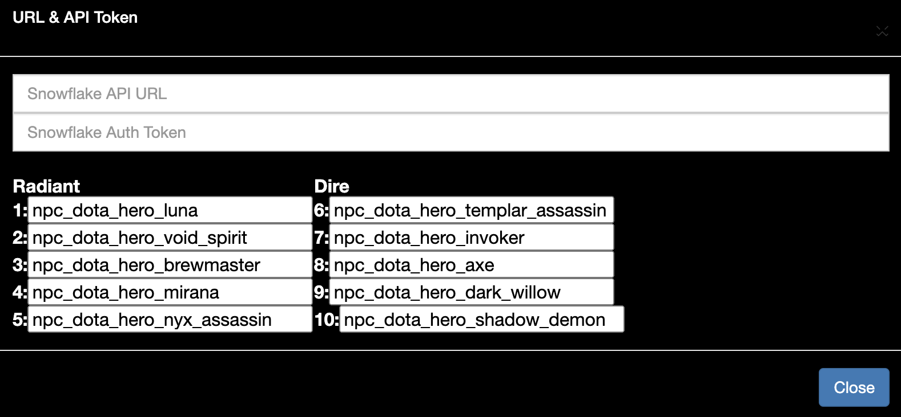
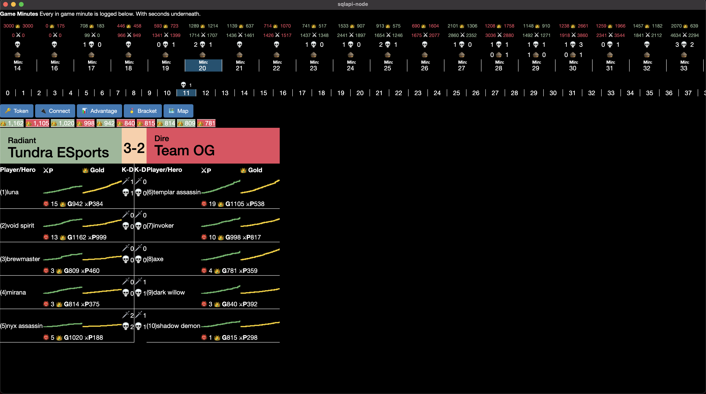
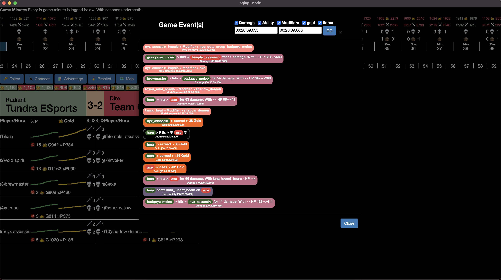

summary: Parse a Dota 2 game replay
id: dota2_game_replay_parser 
categories: undefined
environments: web
status: Hidden 
feedback link: https://github.com/Snowflake-Labs/sfguides/issues
tags: Getting Started, Data Science, Data Engineering, Dota2
authors: Marius Ndini

# Dota2 game replay parser

<!-- ------------------------ -->
## Overview 
Duration: 3

Parse a replay into a table as described above as it is necessary.  Welcome to Snowflake! This guide designed for database and data warehouse administrators and architects will help you navigate the Snowflake interface and introduce you to some of our core capabilities. [Sign up for a free 30-day trial of Snowflake](https://trial.snowflake.com) and follow along with this lab exercise. Once we cover the basics you’ll be ready to start processing your own data and diving into Snowflake’s more advanced features like a pro.


### Prerequisites:

- Use of the [Snowflake free 30-day trial environment](https://trial.snowflake.com)
- Basic knowledge of SQL, database concepts, and objects


### What You'll Learn:

- how to parse a game replay
- how to load structured and semi-structured data
- how to query data including joins between tables
- how to clone objects
- how to undo user errors
- how to create roles and users, and grant them privileges
- how to securely and easily share data with other accounts

<!-- ------------------------ -->
## Prepare Your Lab Environment
Duration: 2

### Steps to Prepare Your Lab Environment

If you haven’t already, register for a [Snowflake free 30-day trial](https://trial.snowflake.com).

The Snowflake edition (Standard, Enterprise, Business Critical, e.g.), cloud provider (AWS, Azure, e.g.), and Region (US East, EU, e.g.) do not matter for this lab. We suggest you select the region which is physically closest to you and the Enterprise Edition, our most popular offering. After registering, you will receive an email with an activation link and your Snowflake account URL.


### Create the Necessary Tables & Views

Copy the DDL below and execute it in your Snowflake account.

```SQL
create or replace database DOTA;
create or replace schema PUBLIC;


-- Create a raw data table for replay

create or replace table RAW as
select parse_json(parse_game_replay_udf('@replay_files/YOUR - REPLAY FILE.dem'))::variant as RAW_DATA;


-- Flatten table into individual rows
select value::Variant as E 
from RAW, table(flatten(input => RAW_DATA))
;

------------------------------------------------------------------------------------------------
----- INSERT THE ROWS IN THE RESULT SET ABOVE INTO THE GAME TABLE BELOW ------------------------
------------------------------------------------------------------------------------------------

-- Please save your parsed replay here
create or replace TABLE GAME (
	E VARIANT
);

create or replace materialized view ALL_DAMAGE as
select E:Time::TIME as time, 
E:Attacker::string as attacker, 
E:Target::string as target, 
E:DamageCategory::int as CATEGORY,
E:DmgType::int AS TYPE,
E:LH::int as LH,
E:NetWorth::int as NW,
E:Inflictor::string as inflictor,
nullif(E:Value::string,'')::int as value, 
nullif(E:HP::string,'')::int as HP, 
nullif(E:NHP::string,'')::int as NHP


from DOTA.PUBLIC.GAME
where E:Type = 'DOTA_COMBATLOG_DAMAGE'
;


create or replace materialized view BUILDINGS as
select E:Time::TIME as Time
,E:AttackerTeam::String as ATTACKERTEAM
,E:Name::STRING as Building
,E:TargetTeam::STRING AS TARGETTEAM
,E:Units::STRING AS UNIT

from DOTA.PUBLIC.GAME
where E:Type = 'DOTA_COMBATLOG_TEAM_BUILDING_KILL'

;


create or replace materialized view CREEP_KILLS as
select E 
,E:Time::time::String AS T
,E:Attacker::STRING AS ATTACKER
,E:Target::STRING AS Target
,count(*) AS UNIT

from DOTA.PUBLIC.GAME
where E:Type = 'DOTA_COMBATLOG_DEATH'
GROUP BY 1, 2, 3, 4
;


create or replace materialized view GOLD as
select E, 
E:Time::time::String AS T, 
E:Time::TIME AS TIME, 
E:Target::String as TARGET,
E:Reason::integer AS REASON,
IFF(E:Direction::STRING = '-', (E:Gold::INT) * -1, (E:Gold::INT)) as GOLD,
E:Direction::String AS DIRECTION,
E:X::Double AS X,
E:Y::Double AS Y
from dota.public.game
where E:Type = 'DOTA_COMBATLOG_GOLD'
;


create or replace materialized view HERO_DAMAGE as
select E:Time::TIME as time, 
E:Attacker::string as attacker, 
E:Target::string as target, 
E:DamageCategory::int as CATEGORY,
E:DmgType::int AS TYPE,
E:LH::int as LH,
E:NetWorth::int as NW,
E:Inflictor::string as inflictor,
nullif(E:Value::string,'')::int as value, 
nullif(E:HP::string,'')::int as HP, 
nullif(E:NHP::string,'')::int as NHP


from DOTA.PUBLIC.GAME
where E:Type = 'DOTA_COMBATLOG_DAMAGE'
and E:Target like 'npc_dota_hero%'
and E:Attacker like 'npc_dota_hero%' 


;


create or replace materialized view HERO_DEATHS as
select  E:Time::TIME as Time, 
replace(E:Target::STRING,' (illusion)','') as hero
, count(E:Target) as death

from DOTA.PUBLIC.GAME
where E:Type = 'DOTA_COMBATLOG_DEATH'
AND (E:Target like 'npc_dota_hero%')

group by 1,2
;


create or replace materialized view HERO_ITEMS as

select E:Time::TIME as time
,E:NetWorth::INT as NW
,E:Target::String as target
,E:Value::STRING as item

from DOTA.PUBLIC.GAME
where E:Type = 'DOTA_COMBATLOG_PURCHASE'
;


create or replace materialized view HERO_KILLS as
select E:Time::TIME as Time, 
replace(E:Attacker::STRING,' (illusion)','') as attacker
, count(E:Target) as kill

from DOTA.PUBLIC.GAME
where E:Type = 'DOTA_COMBATLOG_DEATH'
AND (E:Target like 'npc_dota_hero%')

group by 1,2
;


create or replace materialized view XP as
select E, 
E:Time::time::String AS T, 
E:Time::TIME AS TIME, 
E:Target::String as TARGET,
E:Reason::integer AS REASON,
E:XP::integer AS xp,
E:Direction::String AS DIRECTION,
E:X::Double AS X,
E:Y::Double AS Y
from GAME
where E:Type = 'DOTA_COMBATLOG_XP'
;

CREATE OR REPLACE FILE FORMAT CSV
;
CREATE OR REPLACE FILE FORMAT JSON
	TYPE = JSON
	NULL_IF = ()
	COMPRESSION = NONE
;

```

### Set up Key Pair Authentication

You will have to set up Key pair authentication to utilize Snowflake APIs which are referenced below. 
Please follow the steps outlined here [alt text](https://docs.snowflake.com/en/user-guide/key-pair-auth.html#step-1-generate-the-private-key).

Once you have completed the steps above, place the public and private keys in the api-auth folder.

<!-- ------------------------ -->
## Java UDF
Duration: 2

PLACE JAVA UDF DOCS HERE

<!-- ------------------------ -->
## Front End Viz App
Duration: 5

The visualization app is a node.js front end. It is pre-built for mac and windows in the **Front End/Dist** folder and available for download or should you want to combile the source code is provided. 

Once the app is downloaded and open - You will have to connect to Snowflake via the app utilizing Snowflake SQL Apis.

If you would like to skip the line and view the app via web please go here [a](https://appslications.s3.amazonaws.com/dota2analysis/snowflake/index.html).

## Connecting to Snowflake
Click the **Token** button. This will bring a pop-up like below:


In the **Snowflake API URL** type the following: **https://YourSFCAccount.Region.Snowflakecomputing.com/api/statements**. This is so Snowflake knows where the app will route your APIs.

In the **Snowflake Auth Token** Generate a Token using the Node.js codebase in **Front End/api-auth**. You can also do so using python with this code here [alt text](https://docs.snowflake.com/en/developer-guide/sql-api/guide.html#using-key-pair-authentication).

Below that Please - please position your players as necessary within the 10 input boxes. You can do this by having a select statement. Take a look at the image above as an example. Each game may have different heros that players slect and thus these inputs will change depending on which game/replay you are attempting to visualize.

Finally, close this input pane and then click connect in the main menu. If all is done correctly, This will connect to Snowflake and run the necessary quiries.

### Viewing the Data
The replay data will like below. At the top you will have a timeline of the game, where you can click on the minute to advance the game. Below that you will a second by second bar where you will get any/all events which happened in that minute.



### Second Replay Events Below
Click here for more fun



<!-- ------------------------ -->
## Conclusion & Next Steps
Duration: 1

The Conclusion and Next Steps section is one of the most important parts of a guide. This last section helps to sum up all the information the reader has gone through, and in many ways should read like a [TLDR summary](https://www.howtogeek.com/435266/what-does-tldr-mean-and-how-do-you-use-it/#post-435266:~:text=How%20Do%20You%20Use%20TLDR%3F,you%E2%80%99re%20the%20author%20or%20commenter.%20Using). 


It's also important to remember that by the time a reader has completed a Guide, the goal is that they have actually built something! Guides teach through hands-on examples -- not just explaining concepts.

### What We've Covered
- creating steps and setting duration
- adding code snippets
- embedding images, videos, and surveys
- importing other markdown files

### Related Resources
- [SFGuides on GitHub](https://github.com/Snowflake-Labs/sfguides)
- [Learn the GitHub Flow](https://guides.github.com/introduction/flow/)
- [Learn How to Fork a project on GitHub](https://guides.github.com/activities/forking/)


