author: Kuo Lun Lo
id: e2emigration-sql-and-data
categories: snowflake-site:taxonomy/solution-center/certification/quickstart, snowflake-site:taxonomy/product/platform, snowflake-site:taxonomy/snowflake-feature/migrations
language: en
summary: Migrate databases to Snowflake with SQL conversion, data transfer, and validation for complete platform transitions.
environments: web
status: Published 
feedback link: https://github.com/Snowflake-Labs/sfguides/issues


# End-to-End Migration to Snowflake: SQL Code Conversion and Data Migration

## Overview

Want to migrate to Snowflake in less than 90 minutes? Come to this hands-on lab. We will work through Snowflake's migration strategy and automation tools—for example, SnowConvert to assess, move, and validate an entire pipeline with data into Snowflake. Our data will be in another data warehouse, a data lake, and even on prem. Can we move it into Snowflake? Our pipelines are written in Jupyter notebooks utilizing Spark. Can those fully exist in Snowflake? Can all of it happen in Snowflake? Let's find out.

### Prerequisites

- Basic knowledge of SnowConvert

### What You'll Learn

- Migrate SQL Server Adventure Works' DDLs
- Fix issues derived from SnowConvert conversion output code
- Migrate SQL Server Adventure Works' Historical Data

### What You'll Need

- [SnowConvert](/en/migrate-to-the-cloud/snowconvert-ai/) Installed
- [VSCode](https://code.visualstudio.com/download) and [Snowflake Extension](https://marketplace.visualstudio.com/items?itemName=snowflake.snowflake-vsc) Installed
- [Snowflake Account](https://signup.snowflake.com/?utm_source=snowflake-devrel&utm_medium=developer-guides&utm_cta=developer-guides).

### Scenario

AdventureWorks is a retail company established 20 years ago. They have been using SQL Server since their inception. As they grew and data processing evolved, they decided to start running some pipelines using Spark to take advantage of distributed computing. They also created SQL Server data marts in Azure in an early attempt to move into the cloud.

Over time, they have decided to consider using Snowflake. They want to take one of their SQL Server datamarts and all of the pipelines that are feeding it… and move it into Snowflake. This sounds like a daunting task. How should they approach it? 

AdventureWorks has decided to do a Proof of Concept (POC) with a single database. The goal is to move everything from this database into Snowflake, as well as at least one of the pipelines bringing data into this database and at least one of the reporting notebooks they have connected to this database.

## Assessment

Assessing what you have and developing a plan is the most essential part of a migration. When done right, this will set you up for success over the remainder of the migration. Whether it’s one table, pipeline, or data warehouse, you need to have a plan that takes into account not just your data, but everything that interacts with your data. A successful migration is built at the beginning with a complete picture of what you want to migrate. With that assessment, comes a plan of attack on how to migrate.

In order to migrate across platforms, AdventureWorks needs to utilize a migration framework and strategy that will account for everything required to get the database up and running. Moving some of the data or some of the notebooks… this will not be enough. They need to move the entire system of pipelines that is connected to that data and those notebooks. 

Here’s a migration strategy espoused by Snowflake:


There are many phases in this migration framework, but most of them can be bucketed into three larger categories:

- **Assessment** - Understand what you have
- **Conversion** - Move it to the new platform
- **Validation** - Test that everything works

We will walk through all the nine phases shown above in this Hand-On-Lab, but note that the primary activities we are doing are the three listed above. If you get lost or you’re not su    re where to go next, remember to assess -> convert -> test. Let’s start with the assessment phase. 

> 
> Note that executing a migration requires a close eye on access and security. You will be running two platforms in parallel, and getting a whole new environment setup. For the purpose of time in this lab, we have already set up the target (Snowflake) environment for you, and we will assume you are the only user of this environment. But full RBAC management and support is something every database administrator will have to deal with.

### Planning and Design

As was mentioned previously, this migration will take a single database that the AdventureWorks company has and migrate it to Snowflake. This will include any data pipelines that are bringing data in and out of this mart. 

To better understand everything that is bringing this data in and out of the pipeline, let’s put together an architecture diagram. 

#### Source Architecture

Getting an architecture diagram is often one of the first steps in understanding what you have. If you’ve never built an architecture diagram, it can seem like a daunting task. A few suggestions would be:

- **Start simple.** Don’t try to create a complete picture in an orderly way. Identify key components, then start listing the components that interact with this data.
- **Socialize your drafts.** Data owners across any organization will know best how users are interacting with the data. The knowledge is not always consolidated with the systems or IT team.
- **Identify opportunities for improvement.** When you can visually see the connection points in your system, sometimes the opportunities for improvements in performance, price, or complexity are immediately identifiable.
- **Revisit it.** Most organizations' data landscapes change wildly in a very short period of time. These static diagrams are quickly out of date, and when the discussion of modernization occurs, the creators are not around anymore or they are simply not aware of changes that have occurred.

Snowflake won’t suggest a specific tool that will help you manage your architecture, but there are tools available. 
Here’s a simple diagram.
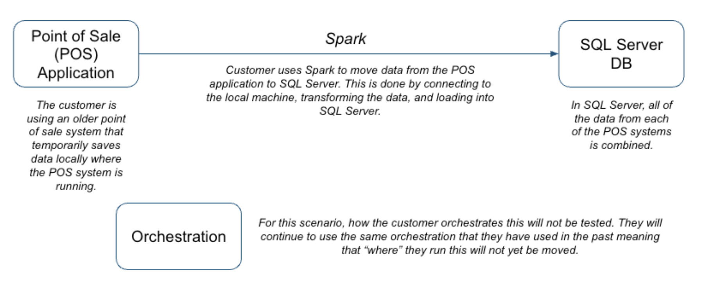

Spark is being used across this organization in a variety of ways, but for this POC, it is simply being used as ETL. It is being orchestrated by Airflow, but that is assumed to continue for the moment. 

#### Target Architecture

This is the source system that we have. Let’s consider the future state

As we migrate, this is going to be our goal. Our inventory of artifacts in the source configuration will map over to objects in the target.


Note that this is a **lift-and-shift migration**. This means we are going to recreate exactly what is in the source in the target environment. Everything that was in our SQL Server data mart plus everything that was connected to it will be recreated as is. Once you are on the new platform, then you can optimize.

Some may advocate for a different approach to the migration that is more of a lift-adjust-shift. While this approach may yield some optimization benefits sooner in the migration process, most projects will take longer and the testing will be considerably more challenging. Most migration projects benefit from the lift-and-shift approach, but it especially makes makes the most sense for our two goals:

- Prove the migration is possible
- And do it in 90 minutes.

As a result, we will be moving the following and testing them in Snowflake:

- SQL Server Database

#### Inventories

In order to get started with this, we will need to build some object inventories of what we have in our existing system. We may know that we have a SQL Server data mart that we want to move with some Jupyter notebooks, but what objects are we migrating? What local files are we reading from? What dependencies exist across those objects and files?

For a smaller migration like this, this may be easy to track down manually. But for large migrations with multiple data sources, multiple different types of pipelines, and multiple different data owners, this can be nearly impossible. The challenge of understanding what you have often leads to the project never even getting off the ground. 

Luckily, Snowflake has some tools to help you understand what you have. These tools are not specific to building an object inventory, but rather are comprehensive tools for assessment and conversion of source code to Snowflake. These two tools will be with us most of the way, so let’s go ahead and introduce them now:

- **SnowConvert**: SnowConvert is a tool that scans source code, reports on what it finds in the code, and inventories that code.

Each of these tools is built on the basic principle that your codebase can be scanned, and a semantic model of everything that is happening in your code can be built. From this model, various reports (like an object inventory) and the output code can be generated.

So let’s do this for real. Let’s start getting our inventory of objects together. 

For expediency in this lab, we are going to go straight from the assessment into the conversion phase. This means that we will look at the assessment data while we work through the conversion. Note that in reality, we would want to understand everything we have, before we start to move it.

Now that we have an inventory of the artifacts we’re looking to move to Snowflake, let’s go ahead and move them. 
We’ll walk through moving the following steps:

- Database Code Conversion
- Data Migration

While at the highest level, this phase focuses on moving or converting from the source to Snowflake, there will often be testing and additional pieces of code to assess as we move through it. Meaning that while we do this conversion, it will be iterative with the testing intermixed into the process.

## Database Code Conversion

We will start by assessing what we have. SnowConvert.

### Project Creation

We have an adventure works database in SQL Server, and we have some spark scripts that load data into the sql server. The customer wants to move all of this into Snowflake.

The SQL Server is in an Azure environment that we have in Snowflake, but can make public for a temporary amount of time?

How do we connect to it? Through SnowConvert. Let’s do that now.

Open SnowConvert. Currently, [it can be downloaded from here](/en/migrate-to-the-cloud/snowconvert-ai/). An installation package file will be created. You can then open this file and install the application on your machine.

Agree to the Terms of Use by selecting “Agree”.
> 
> Note that if you are on a Mac, you may be asked to move the application to your windows folder.

**Open SnowConvert**: When you open the application it may prompt you to update it:


We won’t do that at this time, but when working with the application, it is generally better to keep it as up to date as possible. This is a local application. Keeping it up to date not only ensures the functionality of the application, but also ensures that you have the most up to date version of the conversion core.

**Select New Project**:
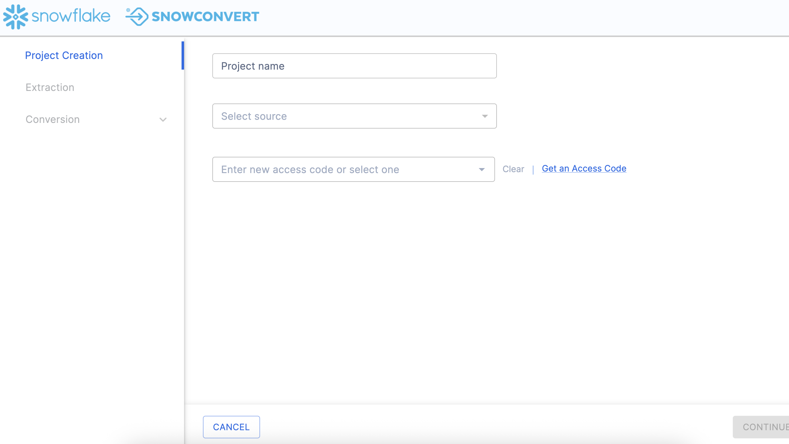

To begin using any version of SnowConvert, you will need to create a project. Think of a project as a local config file that will be saved to your machine. This will preserve any settings and will allow you to continue where you left off if you need to step away.

Let’s call our project: **SQL Server ADW Test.**

We then need to select a source. In this case, it is SQL Server.


To run any element of a project in SnowConvert, you will need to provide an access code. Unless you have used SnowConvert before, you will need an access code. Happily, you can request access in the tool by selecting “Get an access code” next to the access code drop down. 


Note that if you have already activated an access code, you will see options in the dropdown menu in the license screen as shown here:

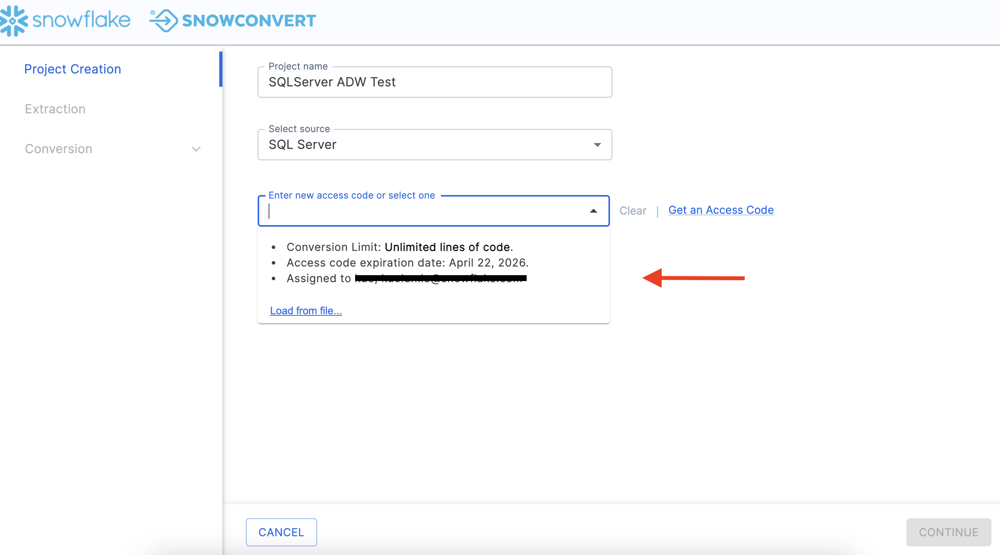

You can choose an access code from this list if you have already activated one.  

Assuming we do not yet have an access code, let’s request an access code. Choose “Get an access code” from the menu to the right side of the dropdown menu. When you do this, the access code form will pop up:
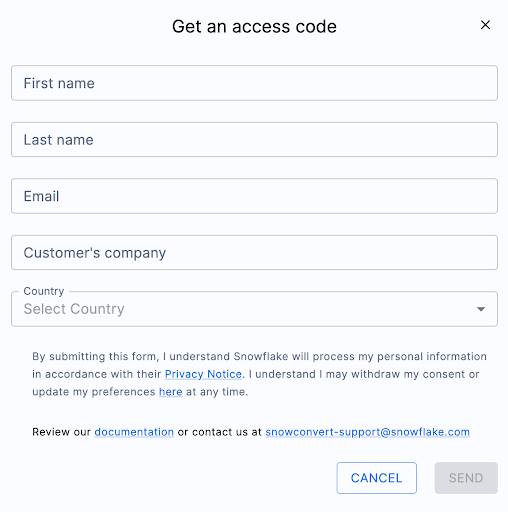

This information is needed to confirm who you are to Snowflake. It will not be used by the SnowConvert team to start sending you the latest and greatest update on what’s new in migrations. (Though if that’s something you’d be interested in… let us know.) 

Once you complete the form, you will receive an email with an access code. It will look something like this:

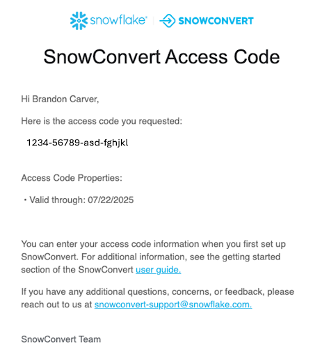

Paste this access code into the application where it says “Enter new access code or select one” in SnowConvert. When your access code has been accepted, you will get a small message under the dropdown menu that says **“Access code activated successfully”**.

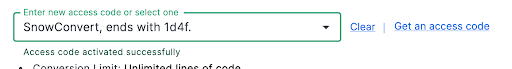

You will need to have an active internet connection in order to activate your access code. If you are unable to activate your access code, check out the [troubleshooting section](https://docs.snowconvert.com/sc/general/frequently-asked-questions-faq#why-am-i-not-receiving-an-access-code) of the SnowConvert documentation.

Now that we’re active, let’s Extract! It’s time!

### Extract

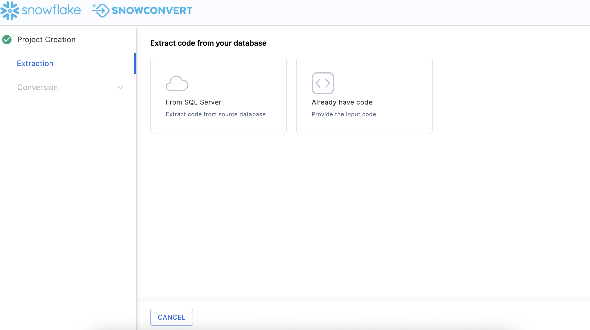

From the Project Creation menu, select the blue **CONTINUE** button in the bottom right corner of the application. Then click on **From SQL Server** in order to extract code from source database.


When you scroll down, you will have to enter the connection information:


For this Hands on Lab, we will provide you with some credentials. However, if you are executing this outside of the friendly confines of this hands on lab, you will need to enter your own credentials. 

Fill the connection information to connect to Adventure Works, you can build your own Adventure Works environment [here](https://learn.microsoft.com/en-us/sql/samples/adventureworks-install-configure?view=sql-server-ver17&tabs=ssms) as well. 

- Authentication Method: Standard
- Server URL: *PLEASE FIND YOUR Server URL of your Adventure Works database instance*
- Database: *AdventureWorks*
- Port: *1433*
- Username: *Fill the user name here*
- Password: *Fill the password here*

Check both boxes for “Trust Server Certificate” and “Encrypt Connection”. 

Next, we will have to specify a local path for our project folder. Anything that we do SnowConvert will be preserved in this project path as well as anything that is created locally. Choose a path that is fully accessible to you. This is the path I chose: `/Users/userName/tmp/SQLServer_ADW_Test`


Finally, you can click `CONNECT TO DATABASE`, then you will get a pop up that says “Connect Established” when you have connected. SnowConvert will then take you to the catalog screen:


The catalog screen allows you to browse objects that were found in the database. For SQL Server, this could be tables, views, procedures, or functions. Nothing has been converted yet. This is merely an inventory of what SnowConvert found in the source. 

Using the catalog, we can select a set of objects for which we’d like to extract the DDL. Using the filter options, you can search for a specific object or set of objects. Using the checkboxes, you can select a specific subset of objects or select the highest checkbox to select everything:


In this example, we will select the top checkbox and select everything. This will include tables, views, and functions. Then select “EXTRACT OBJECTS” to extract the DDL. 


This will create a folder on the local machine preservig the structure of the objects in the database with a file for the DDL for each object.
When the extraction is complete, you will see a results screen similar to this: 

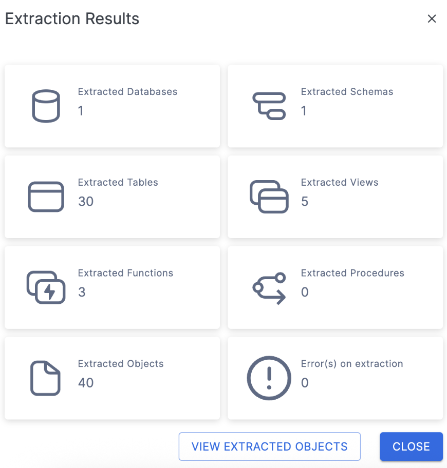

This will give you a brief overview of what was extracted. If there were errors or something was not able to be extracted, it will be reported to you here.

You can select “VIEW EXTRACTED OBJECTS” to see where SnowConvert put the extracted DDL. But since the number of objects we have extracted matches what we expected and there are no errors, we can close this dialog menu and return to the catalog.

Note that now we can see a green checkbox where the DDL was successfully extracted for the object:


If there was an error extracting the DDL, you would see a red X and would need to resolve why that was not extracted.

### Conversion

At this point, we’ve extracted the objects in the database and we’re ready to assess the compatibility with Snowflake and begin the conversion process. There are some optional steps we can do before we get to the conversion itself. Let’s take a look at this by selecting “GO TO MAPPINGS ->” in the bottom right corner of the application.

This brings us to the mapping screen.


On this screen, you can choose a new name for a specific object in Snowflake (i.e. map a single object from SQL Server to Snowflake). You can also choose BULK MAPPING to apply a prefix or suffix to all of the objects or a subset of them (such as tables or view).

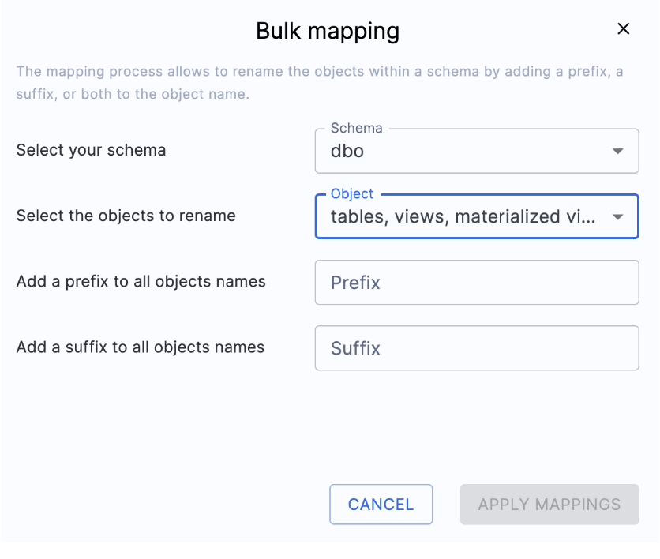

Note that this is completely optional when doing the migration. In this scenario, we will not do any custom mappings. 

Because this is a poc, we’ll apply the suffix “_poc” to all the objects that we have in our database. Because this applies the change to the object itself, any relationship to the object will be updated to reflect the new name. (For example, if the name of TABLE_A was changed to TABLE_A_poc, and TABLE_A was referenced by FUNCTION_B, the reference to TABLE_A in FUNCTION_B will be changed to TABLE_A_poc.)


In the suffix panel, we can add the suffix we want to fix to each object name. Select “APPLY MAPPINGS” and you will see the name changes in the Target Name column of the catalog:

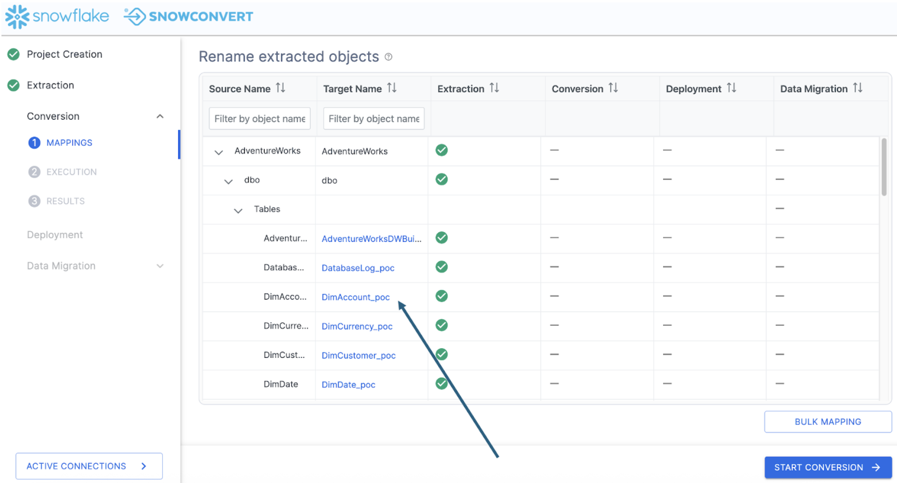

Note that you can still edit individual object names if so desired.

Now that we’ve mapped all of the source and target objects, we can run the conversion and view the assessment information. Select “START CONVERSION”.
Since we are leaving our object names unaffected, let’s start the conversion process. Select “START CONVERSION” in the bottom right had corner of the application.

It’s possible you will view an error message similar to this one:

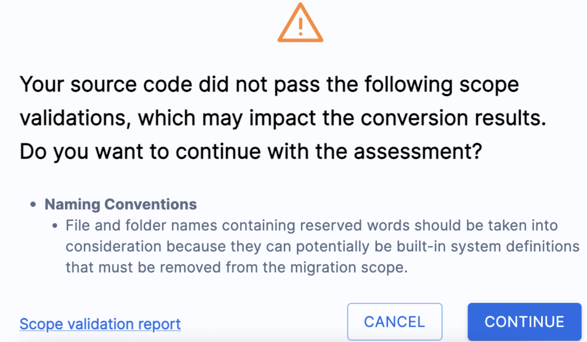

This simply means that SnowConvert has scanned the code that it extracted from the database before it runs its conversion script, and has found some things that COULD cause errors. It will tell you some things you might want to change in the source before converting. These can be found in the “Scope validation report” that you can read. In this scenario, we’ll just click “CONTINUE”.

SnowConvert will then execute its conversion engine. This is done by scanning the codebase and creating a semantic model of the source codebase. This model is then used by SnowConvert to create the output Snowflake code as well as the generated reports. 

When the conversion is finished, each step will be highlighted:


Select “VIEW RESULTS” to… well… view the results.

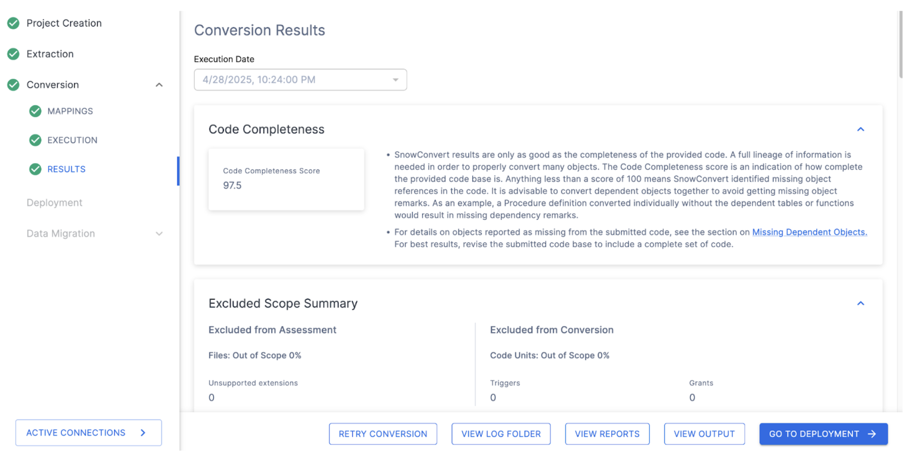

The results page will give you a code completeness score initially, but there is more information below if you scroll down. There is more information on each element of the output report in the SnowConvert documentation, but we’ll just highlight a few elements of the report for this lab, and we’ll do the followup for each of them which will explore more in depth. 

**Code Completeness**: This is a reference to any missing elements or objects that are not present in the codebase. If you have 100% code completeness, then you do not have any missing objects or references to missing elements in the codebase. 

In this scenario, we have an overall 97.5% completeness. This is broken down in the Assessed Conversion Scope Summary (scroll down in the application to find this section):


> 
> 
> We may not need to resolve any missing dependencies (it’s unlikely in this scenario because we did a direct extract from the database), but we still want to see why SnowConvert is telling us that something is missing. 

To do this, let’s visit the additional reports that are generated by SnowConvert. Select “VIEW REPORTS” from the bottom of the application:

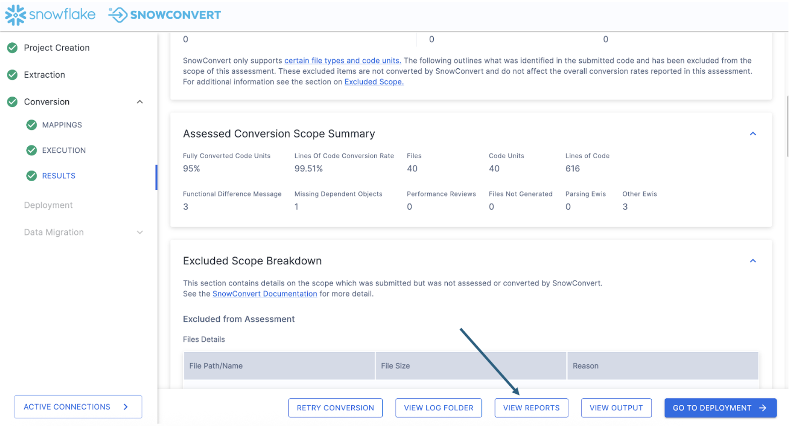

This will take you to your file explorer, specifically to the local directory where the reports generated by SnowConvert have been created. This will be within the directory that you specified in the project creation menu at the start of the project. 


> 
>
> Note that the extracted and converted code are also in this directory structure, but we’ll get to those later.

In the SnowConvert folder, you will find many reports. We’ll view some of them later, but for now, let’s focus on the MissingObjectReferences.csv report. Open this one.
In this file, we’ll find the name of a referenced element that is not present in the DDL of the output code. 


Let’s validate that this is a missing reference. There are several ways we can do this, but the first would be to simply open the object inventory and validate that this function actually does exist. The inventory of all code objects in this scan is in the **TopLevelCodeUnits.<datetime>.csv** file: 

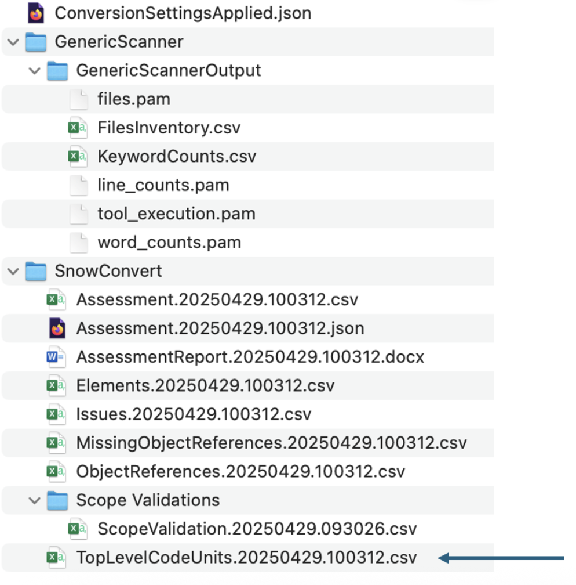

Opening this file, we can search for this reference in the CodeUnitId column:

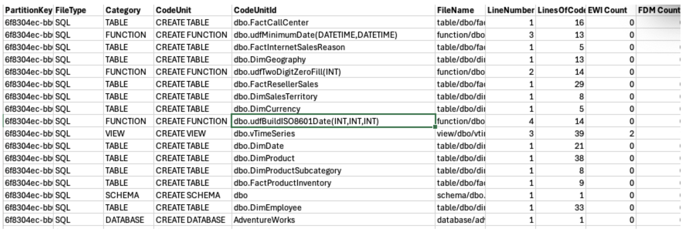

Huzzah! I have found it here. This means that the object does exist. Why did SnowConvert identify it as a missing object? That’s a great question. It could be that it’s called in a way that SnowConvert could not resolve. It could be that there was an error with SnowConvert, and it did not resolve the function name with the function DDL. We’ll have to dive deeper into why when we work through the issues. For now, it’s enough to know that the object does exist and we do not need to figure out how essential it is to track down. This may still come out when working through the issues, but let’s find out then. 

If the result is 100% code completeness:

In this scenario, we have 100% code completeness. This makes sense given that we are exporting this directly from the source. If you do have missing objects here, the recommendation would be to open the reports folder and validate that the missing objects are either known to be missing or find the DDL for this object.

**Conversion Overview**: Now that we have seen that we have the code that we need for this, let’s see how much of our code was converted. Let’s review the Code Units Summary section here:


Looks like we have tables, views, and functions in this codebase, but not a lot of code in general (this looks like less than 1000 lines of code in total). There also are only three “EWI’s” (in the last column), meaning that the majority of this extracted DDL can be moved over to Snowflake just by using SnowConvert. We’ll look through the EWI’s in a moment. 

Understanding what we have is essential to successfully completing a migration. If we were pre-migration, we would likely stop here and review the object inventory.

Since we have a good understanding of what needs to be done and it’s relatively small, let’s go ahead and attack this. Let’s resolve the issues that we have present. Before we do that, let’s take a look at the status in our object inventory. Select “GO TO DEPLOYMENT” in the application.

## Deployment And Issues

This will take you back to the inventory screen. It should look something like this:

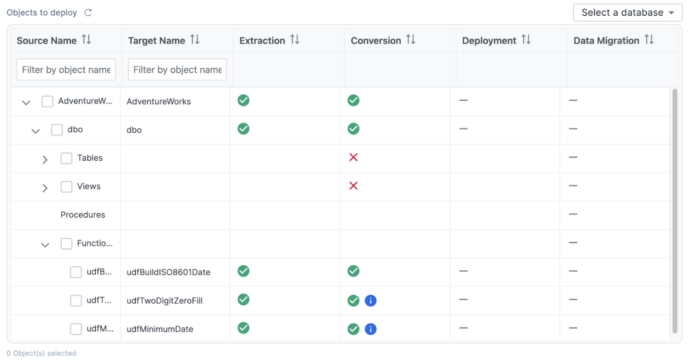

This is the same inventory that we have already seen, but note that now we can see a status in the conversion column. There are a few different elements that we can see here that are based on the conversion status. This lets us know which objects were fully converted (a green checkmark), which objects have a warning that you should consider (a green checkmark with a blue “i” icon), and which objects have a conversion error that must be addressed (a red “X”). These statuses are determined by the error messaging that SnowConvert has placed into the converted code. The objects with a red “X” have an error message that will produce an error if you attempt to run that SQL in Snowflake. If you resolve the errors, then you will be able to deploy the output code. SnowConvert is connected to your project directory, so as long as you keep the files in the same location that SnowConvert put them when it converted the code from the source. 

Let’s see this in action by resolving the issues.

### Resolving Issues (powered by Cortex AI)

SnowConvert will generate you an inventory of all issues that it encounters. This is in the issues.csv file. Let’s take a look at issues that we have available in this execution of SnowConvert.

To find the issues report, go to “VIEW OUTPUT” in the bottom of the SnowConvert application. 

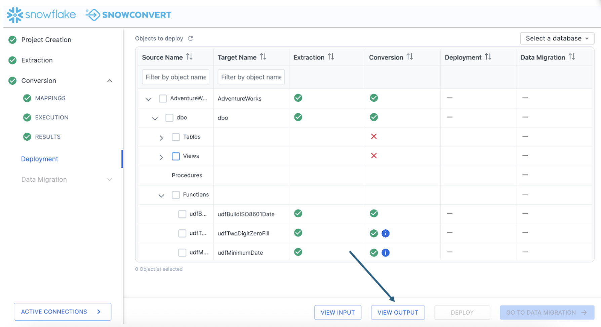

This will take you to a directory title “Conversion-<datetime>” within the directory you originally created in the project creation screen at the start of the project. This output will have three different sub directories:

- Logs
- Output
- Reports

Let’s first visit the reports directory to see what issues SnowConvert identified with this conversion.

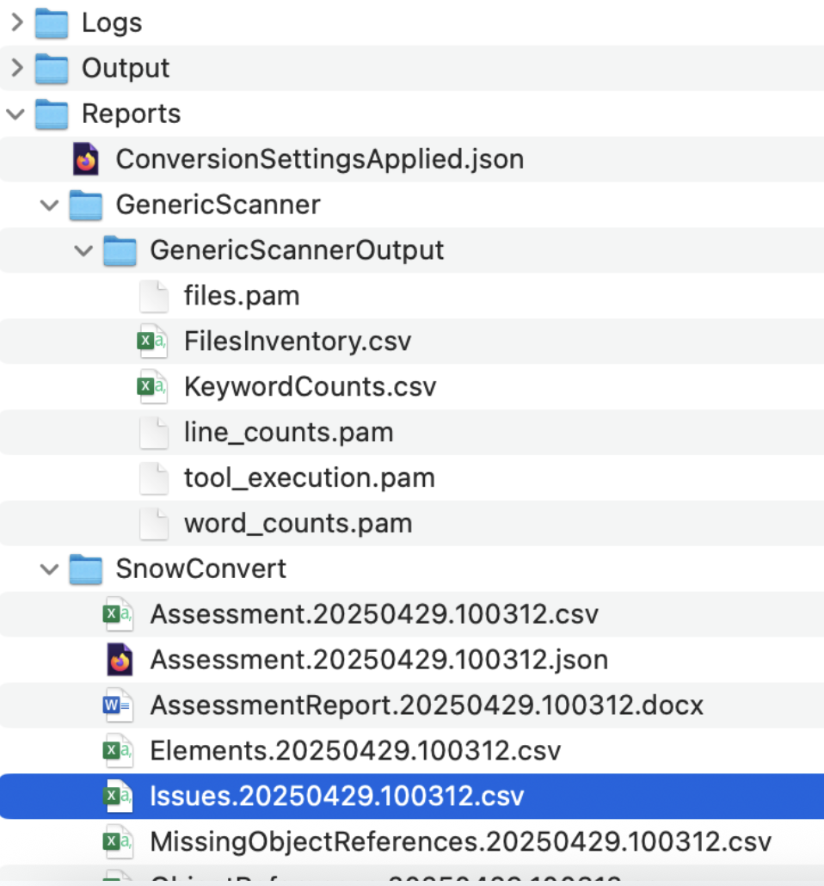

The issues.<datetime>.csv report will be available in the reports folder under the SnowConvert subfolder. In this report, you will find the type of each error as well as its location and a description of the error. There are three major types of error generated by SnowConvert:

- **Conversion Error (EWI)**: generally, this is something that the tool could not convert or hasn’t seen before
- **Functional Difference (FDM)**: this is code that has been converted, but may be functionally different in Snowflake. These errors should be treated as warnings, but paid close attention to during testing.
- **Performance Reviews (PRF)**: this is something that SnowConvert identifies that will run in Snowflake, but may be suboptimal. You should consider optimizing this once you’re up and running in Snowflake.

There’s more information on each of these [in the SnowConvert documentation](https://docs.snowconvert.com/sc/general/technical-documentation/issues-and-troubleshooting). Let’s look at what we have in this execution:


We can see that some issues share an issue code, but we can see specifically which file has the issue in it and a description of what the issue is. This is a very low number of issues. There will not be a ton of things to work through.

There are many approaches to dealing with the conversion issues generated by SnowConvert. We would recommend that you start in the same order you would want to deploy the objects: tables first, then views and functions, followed by procedures and scripts. You could pivot this table by the root folder (which will have the object name in it), then sort by severity and type. Depending on your timeline and business need, this would allow you to deal programmatically with the most critical issues in the order of deployment.

However, in this lab, there are such a small number of issues, we don’t really need to pivot this file. However, we will still start with the same approach. Where are we going to deal with these issues? Snowflake would recommend that you use the Snowflake Visual Studio Code Extension, and that is what we are going to use right now.

Throughout this lab, anytime that we are going to interact with the code, we are going to use the Snowflake extension for VS Code. We can open it now and leave it open for the duration of this lab. If you have not yet downloaded the [VS Code extension](https://docs.snowflake.com/en/user-guide/vscode-ext), you can do so from within VS Code or from the [VS Code Marketplace](https://marketplace.visualstudio.com/items?itemName=snowflake.snowflake-vsc).

When you first open VS Code, navigate to the settings for your extensions. In the settings for the Snowflake extension, you will need to enable the SnowConvert Migration Assistant:

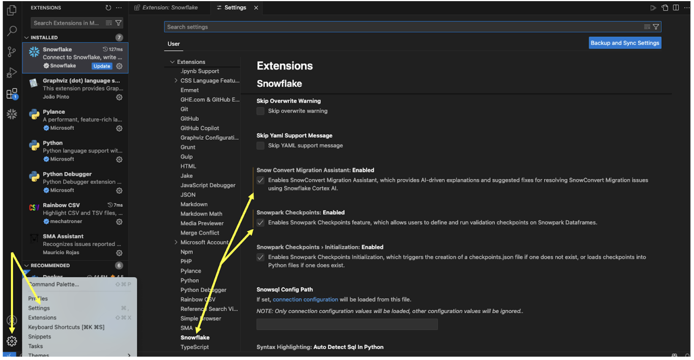

When you enable this, VS Code may prompt you to restart. Even if it doesn’t, it’s a good idea to restart the application now.

Once you’ve restarted VS Code, open the Snowflake extension and login to your Snowflake account. For this lab, Snowflake accounts have been created for you and provided via the information available for this lab. 

Now we should be ready, let’s open a new browser window, and make our root directory the same one we created in the project creation menu. This will allow us to access both the extracted source code and the output Snowflake code that has our issues in it.

You should see a folder that has the name of the project you created in the project creation screen:

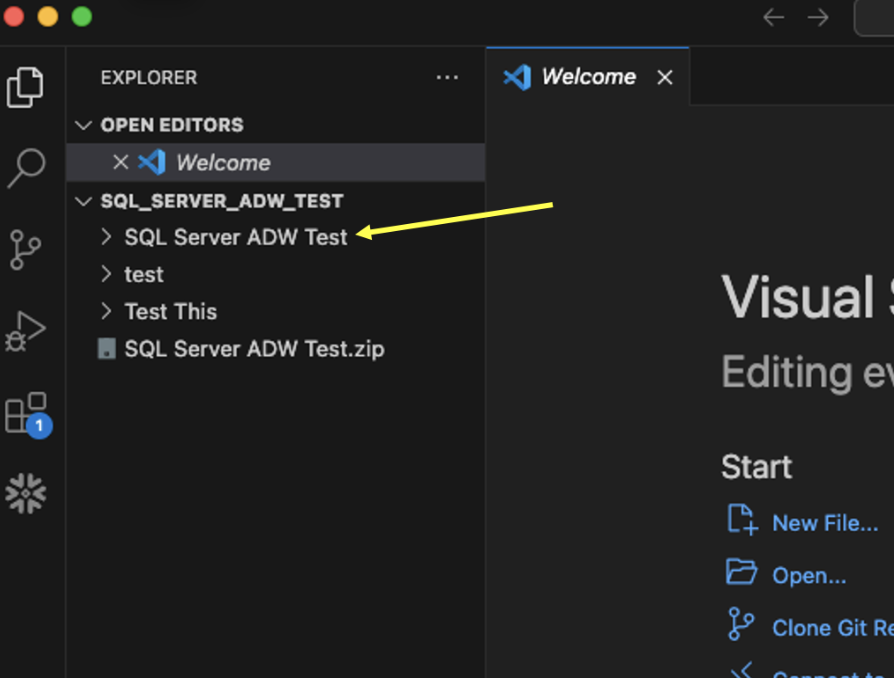

> 
> Note: if you expand that folder, you should see an input and an output directory

The extracted code is in the input directory, and the Snowflake code generated by SnowConvert is in the output folder. But we will not need to navigate this folder structure to find our issues. We can use the Snowflake extension.

Open the Snowflake extension, and you should see a section called **SNOWCONVERT ISSUES**. It should automatically load the list of issues under the VS Code's root directory.

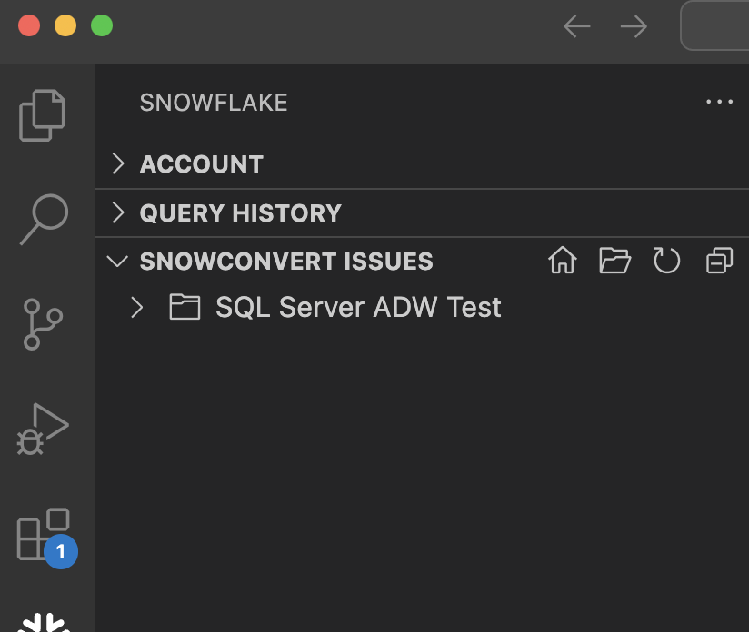

Let’s expand this so we can see it a bit better:


You can see each of the files that has an EWI in it and the exact location.

> 
> Note: for most migrations, this will be exceptionally large. It would be good to plan how to approach the issues using the issues.csv spreadsheet as mentioned earlier.

If you select a specific error, it will take you to the place in the code where that error can be found:


Let’s not start with the first error posted, but instead start in the order that was recommended earlier: tables, views, functions, then procedures/scripts. In this example, we have 1 table (in the file **databaselog.sql**) with an error in it. Let’s take a look:


This error is an EWI saying that a datatype was converted to a different datatype in Snowflake. This doesn’t look like a problem, but more looks like SnowConvert is trying to tell us to validate that this is not a problem before we deploy. 

If we’re not sure that this datatype should be converted to VARIANT, let’s use the SnowConvert Migration Assistant to generate some more information on this error. To do this, let’s select the light bulb icon in the SNOWCONVERT ISSUES menu in the extension:


> 
> Note that a new window will pop up saying “Loading explanation and suggestion…”. This is connecting to your Snowflake account and passing the error message that SnowConvert generated to Cortex in your connected Snowflake account. It will give you an explanation after it has had a moment to think through it:

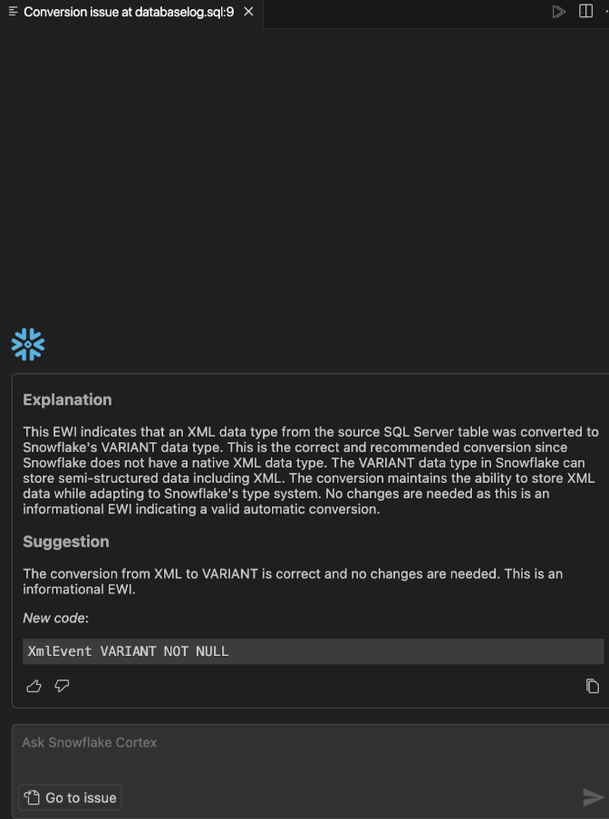

This explanation seems to validate that the conversion is correct. VARIANT is the right translation for an XML file. From this menu you can:

- Copy the replacement code that it has generated
- Chat with Cortex
- Return to the issue

Let’s say that we are not sure that this is the right conversion. We could ask Cortex if there are any other options for XML data in Snowflake.

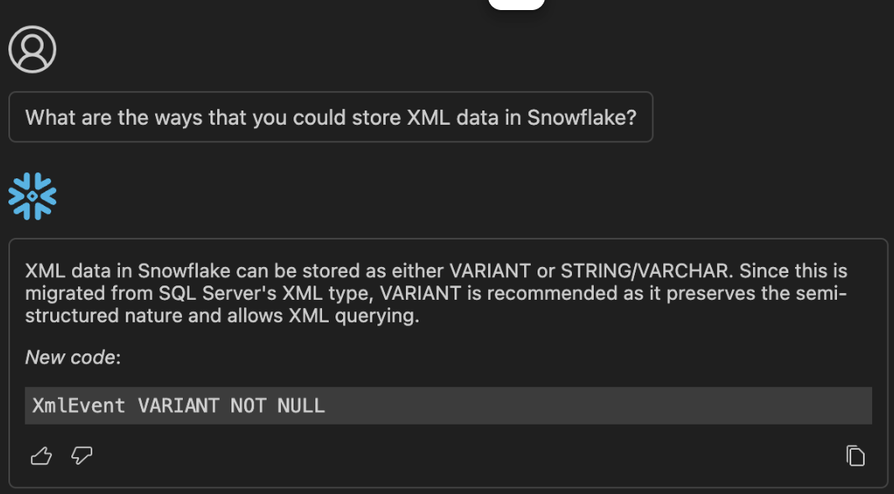

Your results may vary, but this is what Cortex returned to me. VARIANT is still the recommendation. We’ll take a look that the data matches depending on how we are using this XML data when we test the result of this conversion.

For now, let’s replace the code with the EWI with the code that Cortex has recommended (which is essentially, to remove the EWI). Our new code looks like this:

```sql
CREATE OR REPLACE TABLE dbo.DatabaseLog (
    DatabaseLogID INT NOT NULL,
    PostTime TIMESTAMP_NTZ(3) NOT NULL,
    DatabaseUser VARCHAR(128) NOT NULL,
    Event VARCHAR(128) NOT NULL,
       "Schema" VARCHAR(128) NULL,
    Object VARCHAR(128) NULL,
    TSQL VARCHAR NOT NULL,
    XmlEvent VARIANT NOT NULL
   )
   COMMENT = '{ "origin": "sf_sc", "name": "snowconvert", "version": {  "major": 1,  "minor": 6,  "patch": "0.0" }, "attributes": {  "component": "transact",  "convertedOn": "05/22/2025",  "domain": "snowflake" }}'
   ;
```

And the EWI message is gone. Note, however, that the file and issue still appear in the SnowConvert Issues section of the Snowflake extension even after we refresh the list:


> 
> To remove this, we need to save the changes that we’ve made to the file. This will allow us to update the extension and the SnowConvert application. Let’s take a look at this.


Now let’s refresh the SNOWCONVERT ISSUES list in the Snowflake extension, and the issue no longer appears. We can see this same behavior in the SnowConvert application.

If you return to the application, we should still be on the deployment screen. If you expand the “Tables” section of the deployment screen, you will see that “DatabaseLog” is marked with a red “X” indicating that it cannot be deployed.

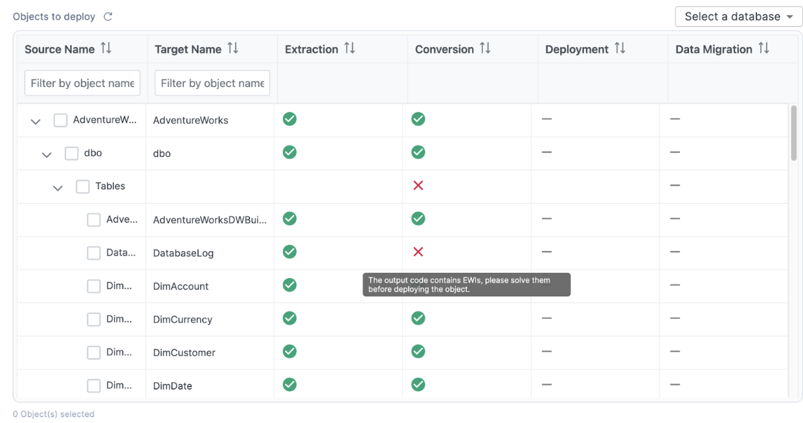

However, now that we’ve resolved the EWIs in the DDL for that object, we can refresh this list by selecting the refresh icon in the top left of the application:

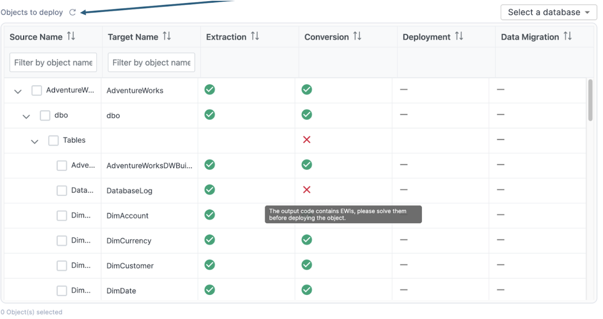

We should see that the red “X” now changes to a green checkmark.

If it does not change, then there are still errors associated with that DDL that need to be resolved. That does not appear to be the case here.

We can now continue to resolve the rest of the errors in our execution. The tables now all appear to have their issues resolved. (You can validate that they are ready to deploy by scrolling through the catalog in SnowConvert to see that all objects are marked with a green checkmark.)

If you are doing a large project, it might be a good idea to go ahead and deploy the tables. To validate that those are correct. However, views and functions should both be done before they are deployed. 

Let’s take a look at the remaining issues we have:


We have two remaining issues in two different functions, but they have the same error code. Note that this is also a FDM code, so there may not be a solution we need to apply here. Let’s select the first issue and call Cortex to tell us more about it. 

This is an interesting issue. SnowConvert has decided that this UDF should be turned into a stored procedure. This is an interesting decision as a stored procedure cannot be called in the same way as a function. But there are things that you can do with functions in SQL Server that you cannot do with a function in Snowflake. And if you ask Cortex what it thinks, it will disagree with SnowConvert and turn this back into a UDF:

```sql
CREATE OR REPLACE FUNCTION dbo.udfMinimumDate(X TIMESTAMP_NTZ(3), Y TIMESTAMP_NTZ(3))
RETURNS TIMESTAMP_NTZ(3)
LANGUAGE SQL
AS
$$
  IFF(X <= Y, X, Y)
$$
```

This is where you need someone familiar with how this function is used across the workload. Normally, we would inventory any reference to this function across the entire workload. Since this is a small POC, this function is not used anywhere else in this function. You can validate this in a couple of ways. The first is to simply search for the name of this object in the input directory in VS Code: 


There is only reference to this function and it is in the create function statement. So it is not being used anywhere. We can also check the dependent objects inventory generated by SnowConvert. (You could do this in a file browser or in VS code directly.)


We can see that while there are many mentions of this object in the reports, there is no mention of this object in the **ObjectReferences.<datetime>.csv** report. As a result, this function is not used anywhere, so we’re not sure how this will be called.

So, should we go with what SnowConvert has generated or listen to Cortex? There are advantages and disadvantages to both, but the primary reason would be turning this function into a procedure means it WILL fail if it is called in a way that a procedure cannot be called. This means that you will be immediately alerted to this when you test this output. Leaving it as a function means that there may be functional differences that you may not immediately be aware of. 

In this situation:

- Interpreting what the function is trying to do versus the way it is written, I think this could be a UDF.
- It’s also likely that this is going to be called in a way that is not going to work for a procedure. 

So I’m going to make the choice to use the Cortex recommended code and put in the function code. However… I will add my own comment to the file that contains the code as a stored procedure. That way I can revisit it if I need to when it comes time to test these functions. That looks like this:

```sql
CREATE OR REPLACE FUNCTION dbo.udfMinimumDate(X TIMESTAMP_NTZ(3), Y TIMESTAMP_NTZ(3))
RETURNS TIMESTAMP_NTZ(3)
LANGUAGE SQL
AS
$$
  IFF(X <= Y, X, Y)
$$

-- SnowConvert turned this into a stored procedure. Leaving as a comment.
--** SSC-FDM-0029 - USER DEFINED FUNCTION WAS TRANSFORMED TO SNOWFLAKE PROCEDURE **
/* CREATE OR REPLACE PROCEDURE dbo.udfMinimumDate (X TIMESTAMP_NTZ(3), Y TIMESTAMP_NTZ(3))
RETURNS VARCHAR
LANGUAGE SQL
COMMENT = '{ "origin": "sf_sc", "name": "snowconvert", "version": {  "major": 1,  "minor": 6,  "patch": "0.0" }, "attributes": {  "component": "transact",  "convertedOn": "05/23/2025",  "domain": "snowflake" }}'
EXECUTE AS CALLER
AS
$$
    DECLARE
        Z TIMESTAMP_NTZ(3);
    BEGIN
         
        IF (:X <= :Y) THEN
            Z := :X;
        ELSE
            Z := :Y;
        END IF;
        RETURN (:Z);
    END;
$$; */
```

> 
> Note that I have left the FDM message in the code. This means that the SnowConvert catalog will still alert me that there is a warning present in this function.

I will save the file, and update the SNOWCONVERT ISSUES list in the Snowflake VS Code Extension. Note that this still leaves the FDM.

> 
> Note that this still leaves FDM in the browser because I intentionally left it in the file.

I will collapse this and take a look at the last issue. Since this issue has the same error code as the previous one, it is likely to be a similar case with a similar solution.

```sql
CREATE OR REPLACE FUNCTION dbo.udfTwoDigitZeroFill(NUMBER INT)
RETURNS VARCHAR
LANGUAGE SQL
AS
$$
  CASE 
      WHEN NUMBER > 9 THEN CAST(LEFT(NUMBER::STRING, 2) AS CHAR(2))
      ELSE CAST(LEFT('0' || NUMBER::STRING, 2) AS CHAR(2))
  END
$$
```

And… it is a similar issue. This function is doing something slightly different, but I will make the same decision here that I made before to trust that the function will give me the right result, preserve the procedure as a comment, and test this later on. 

Let’s save the file, and now… we are done! We have successfully navigated through the issues generated by SnowConvert.

Note that there are a large number of issues that SnowConvert can generate. The ones that we see here are generally something that you need to make a decision on the best solution path for your situation. 

Let’s validate this in SnowConvert. If you’ve saved each of the files, you should be able to see checkmark across all of the objects, though there will still be some blue “i” icon:

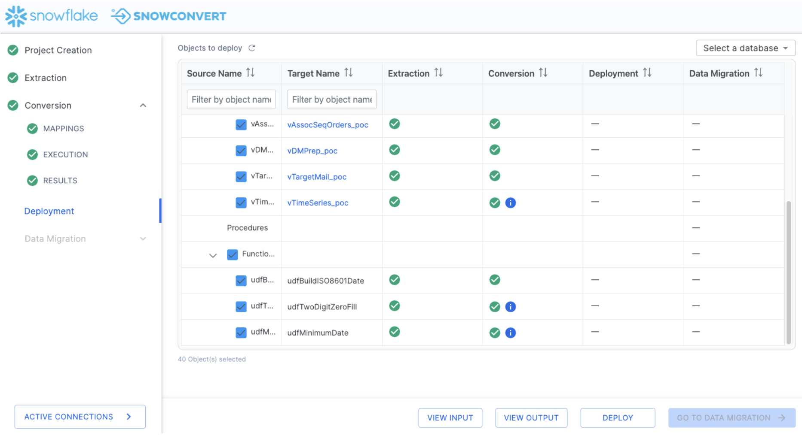

Let’s move forward in the process and deploy the code. This will run all of the DDL that we have extracted from SQL Server (and subsequently, resolved any issues with) to Snowflake. To deploy the code, select “DEPLOY” at the bottom of the application:


### Deploy objects

In order to deploy, you need to be connected to a Snowflake account. You will be prompted for your Snowflake connection information:


When you enter your login information, you may be taken to a webpage with this message.
```Your identity was confirmed and propagated to Snowflake Node.js driver. You can close this window now and go back where you started from.```
Most Snowflake accounts require authentication and this is a part of that authentication. You can return to the SnowConvert application to resume the deployment process. You should see some results from your deployment similar to this:


Now, we know there should be more than 1 object here. There is one error on deployment. You may also see an error message like this one:

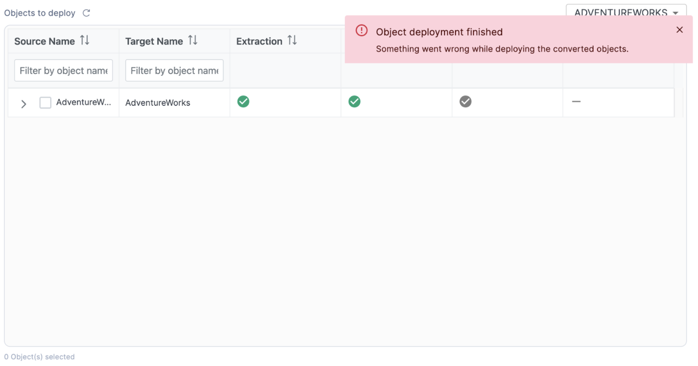

If you do see this, you can see why the error occurred in the catalog in SnowConvert by hovering your mouse over the top of the error symbol.

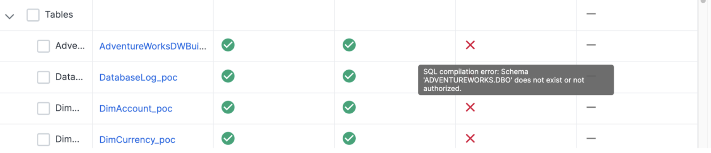

In this case, there is a permissions problem. Check the connection you are using. If this fails, you may want to create the DATABASE and the SCHEMA manually in the Snowflake, especially if the database you are creating already exists. You could troubleshoot this in SnowConvert, but it would be better to do so in Snowflake.

I have gone into Snowflake and created the database and schema we are using with the same credentials I am using to deploy in SnowConvert. Now I will try it again. This time, let’s just start with the tables. I will select the tables:


This time, the results will show that we were able to successfully deploy some objects.
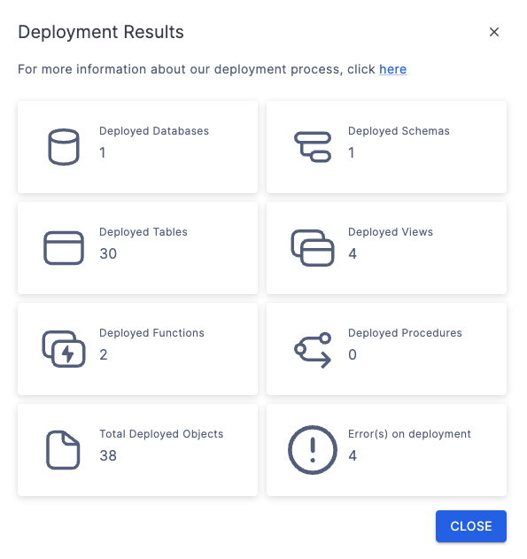

This can be validated by querying the database in Snowflake:

```sql
describe schema adventureworks.dbo
```

I can see each of the tables that were just deployed. Now, let’s do the views and functions to complete the deployment. When we do, some of the functions and views deploy successfully, but there are still some errors.

Let’s see what is in those errors. If you return to the menu and hover over an object in the deployment column, it will tell you a bit more about why the object was not deployed:


In this case, the view that we are hovering over has a dependency on a function. This function exists in this deployment, but SnowConvert is using a “brute force” method of deployment. This brute force method of deployment will lead to errors oftentimes because it is trying different combinations of deployment methods as opposed to ordering the deployment based on dependencies.

We can manually resolve this in the SnowConvert application though. Let’s start by seeing which object may have the first level of dependencies:

It looks like the view vTimeSeries is dependent on function **udfBuildISO8601Date**, and **udfBuildISO8601Date** is dependent on function **udfTwoDigitZeroFill**. 

Let’s try the last two objects in order with the function first, followed by the last view.

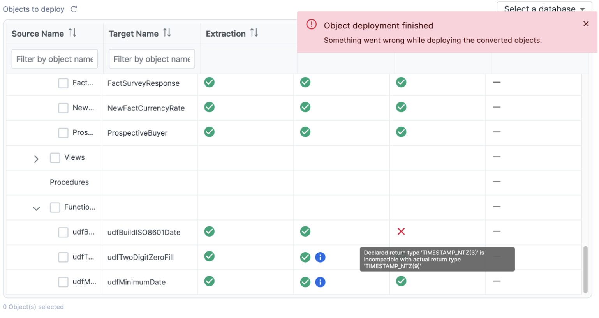

Another failure! Looks like the timestamp type that was moved from SQL Server to Snowflake was not compatible. So we need to change it to be compatible. If we look at a side by side comparison in VS Code of the source SQL Server code and the Snowflake code, we can see that the code in SQL Server is only returning a “datetime” value, not a TIMESTAMP_NTZ(3).

So let’s change the TIMESTAMP_NTZ(3) value to a TIMESTAMP_NTZ(9), but make a note to review this during testing.

```sql
CREATE OR REPLACE FUNCTION dbo.udfBuildISO8601Date (YEAR INT, MONTH INT, DAY INT)
RETURNS TIMESTAMP_NTZ(9)
LANGUAGE SQL
COMMENT = '{ "origin": "sf_sc", "name": "snowconvert", "version": {  "major": 1,  "minor": 6,  "patch": "0.0" }, "attributes": {  "component": "transact",  "convertedOn": "05/26/2025",  "domain": "snowflake" }}'
AS
$$
	SELECT
		TO_TIMESTAMP_NTZ(CAST(YEAR AS VARCHAR) || '-' || dbo.udfTwoDigitZeroFill(MONTH) || '-' || dbo.udfTwoDigitZeroFill(DAY) || 'T00:00:00', 'MM-DD-YYYY')
$$;
```

Save the file and refresh the SnowConvert application. Let’s try to deploy the last function again.

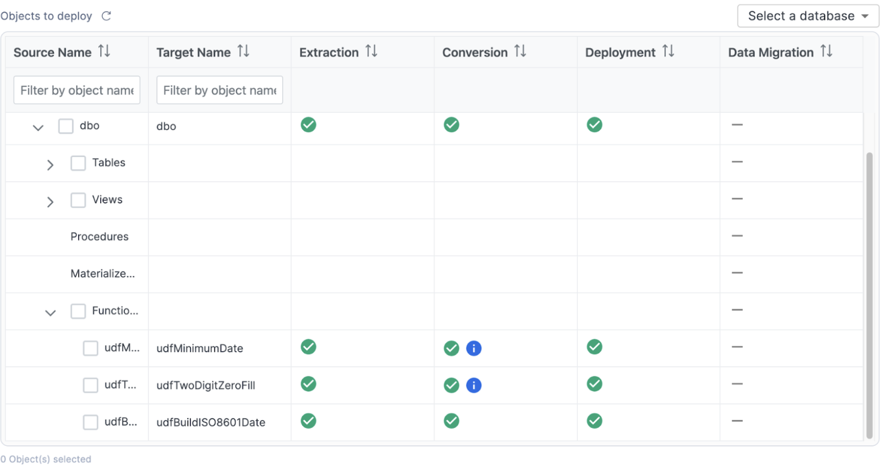

Success! We have all of our tables and functions deployed. There was one view that was not able to be deployed, but it was dependent on the functions being deployed. Let’s a take a look at that view right now. Let’s try to deploy the last view:


Success again! We have officially deployed all of the schema to Snowflake. There’s one more thing we can do in the SnowConvert application, and that is move the data from the original SQL Server database into Snowflake. Select “GO TO DATA MIGRATION” at the bottom right of the screen.

## Data Migration

The Data Migration page will give you the same catalog that you can see on the previous screens. For the migration of the data, note that only the data in tables will be migrated. The rest of the DDL is already present, but there is no “data” present in a view or a function, so the tables will be what is migrated. Also note that no data can be migrated to a table where the DDL wasn’t already successfully deployed. 

To migrate the data, select all of the tables (or you can choose the entire database or schema) and choose “MIGRATE DATA” at the bottom of the application:


While the data is migrating, it will let you know how it’s doing:

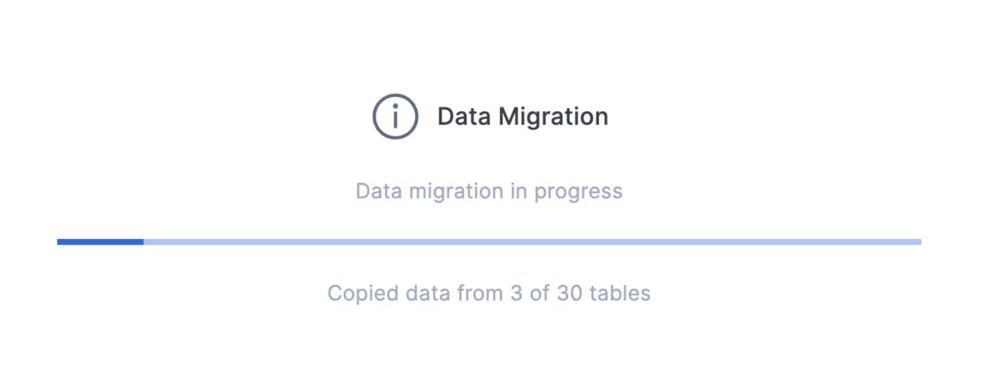

It’s important to note that SnowConvert is migrating the data by passing it through your local machine. It is running a select statement on the data in the original object, then doing a COPY INTO to the data in the Snowflake object. This means that the speed of the data transfer will be directly affected by your connection from the local machine where you are running SnowConvert.

If you are moving a large amount of data, this will not be the most efficient way to move that data. You should consider using another data movement or ETL solution. However, in this scenario, this works just fine for us. There are only 30 tables. 

Note that if you are connected via SSO, Snowconvert may take you to a login page in your browser. If you have MFA setup on your Snowflake account, you will be taken to your authenticator to validate your connection.

Looks like we did not receive any error message for this migration. Let’s expand the object catalog to see if all the tables were migrated:


Select “VIEW DATA MIGRATION RESULTS” to see a summary of what just happened.

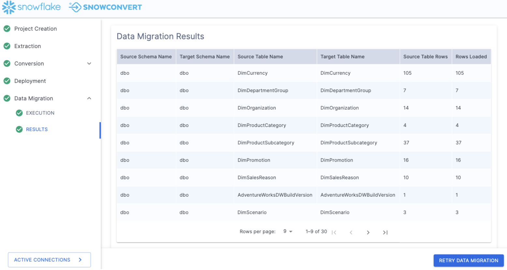

This will show you each table that you just migrated and the corresponding table in Snowflake. For a basic validation of what just happened, you can review the last two columns of the Data Migration Results. These are the row counts for the source table and the count of rows that were loaded into the table in Snowflake.

You can go into Snowflake and write a queries to check to see if this will work. Here is a simple “select *” on the largest table we loaded:


Where once there was no data, now… there is data. At this point, we would start running validation tests on the data to confirm that everything is the same. For this POC, we only have a few tests that we want to validate, but they are all related to the pipelines we are running. Let’s do our validations once we move the pipelines.

### Review

Before we get to our pipelines, let’s take a quick look back.

If we review the steps that we did, let’s see how they fit in with our migration process:

- Setup our project in SnowConvert
- Extracted the schema from the source database
- Ran SnowConvert’s assessment and conversion engine on the extracted schema
- Reviewed the output reporting to better understand what we have
- Reviewed what could not be converted in the VS Code Extension
- Generated new code in the VS Code Extension
- Deployed the code to Snowflake
- Moved the data from the source to Snowflake
- All the while, we were able to track things in our object inventory.

This is what we have just walked through. These steps will generally be recommended regardless of how you used SnowConvert. 

And you can generally see that most of these activities fit our **assess** -> **convert** -> **validate** flow:

- Setup our project in SnowConvert so we can better assess what we have
- Extracted the schema from the source database so we can see what kind of DDL we are working with
- Ran SnowConvert’s assessment and conversion engine on the extracted schema to analyze what we have for our initial assessment, and generate the output converted code
- Reviewed the output reporting to better understand what we have to build our assessment of what we have
- Reviewed what could not be converted in the VS Code Extension to assess what work needs to be done
- Generated new code in the VS Code Extension to resolve any errors in the initial conversion
- Deployed the code to Snowflake to validate that the schema works
- Moved the data from the source to Snowflake to convert our data into Snowflake data
- All the while, we were able to track things in our object inventory to better understand where we are in the migration process.

As we continue to walk through the migration process, let’s take a look at our data pipelines. 

## Conclusion And Resources

### Overview
Congratulations! You've successfully completed an end-to-end migration from SQL Server to Snowflake from data base tables, views and procedures conversion, deployment of these objects and historical data migration.

### What You Learned
- How to assess a SQL Server environment for migration to Snowflake
- Using SnowConvert to migrate database schemas and resolve conversion issues
- Transferring data from SQL Server to Snowflake

### Related Resources
- [SnowConvert Documentation](https://docs.snowconvert.com/)
- [Snowflake SQL Server Migration Guide](https://resources.snowflake.com/migration/microsoft-sql-server-to-snowflake-migration-guide)
- [GitHub Repository for this Lab](https://github.com/Snowflake-Labs/sfguides/tree/master/site/sfguides/src/e2e-sqlserver-migration/)
