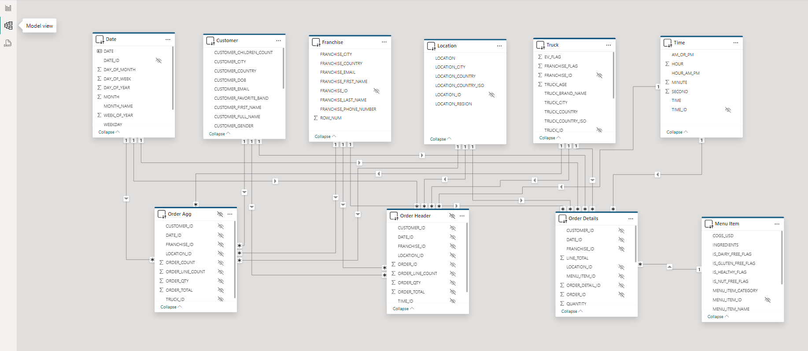
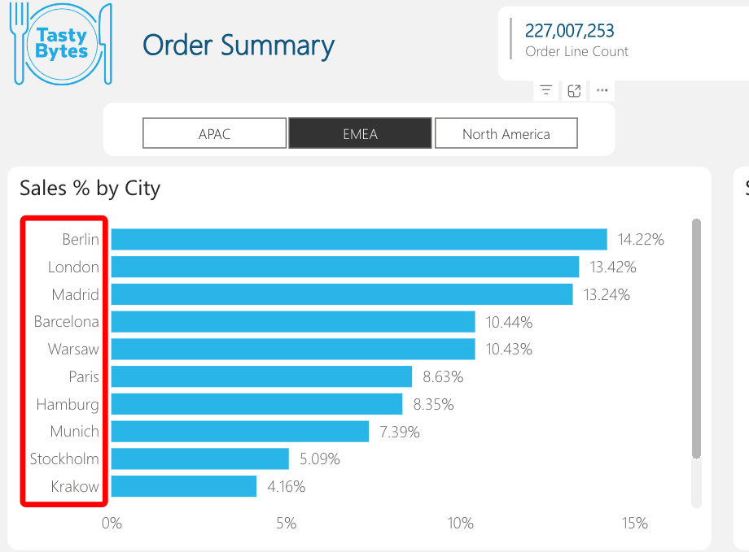

author: joshcrittenden
id: end-to-end-analytics-with-snowflake-and-power-bi
categories: snowflake-site:taxonomy/solution-center/certification/quickstart, snowflake-site:taxonomy/product/analytics, snowflake-site:taxonomy/snowflake-feature/applied-analytics
language: en
summary: Build end-to-end analytics with Power BI connected to Snowflake for enterprise dashboards, reports, and self-service BI.
environments: web
status: Published
feedback link: https://github.com/Snowflake-Labs/sfguides/issues
fork repo link: https://github.com/Snowflake-Labs/sfguide-end-to-end-analytics-with-snowflake-and-power-bi


# End-to-End Analytics with Snowflake and Power BI

<!-- ------------------------ -->

## Overview


By completing this quickstart, you will learn how to easily transform raw data into an optimal format for analysis within Power BI. This quickstart will build upon [An Introduction to Tasty Bytes](/en/developers/guides/tasty-bytes-introduction/) quickstart. We'll begin by profiling the data within Snowsight, followed by creating new roles and granting appropriate privileges for our fictitious global BI Analyst team. Next, we'll enrich our data with third party location data from the Snowflake Marketplace in a matter of minutes. From there, we'll transform our raw data into an optimal model for downstream analysis within Power BI. Next, we'll add column and row-level data protections to our data model. Lastly, we'll connect the provided Power BI template (.pbit) file to our Snowflake data model and analyze sales transactions live.


### Prerequisites

- Completion of [An Introduction to Tasty Bytes quickstart](/en/developers/guides/tasty-bytes-introduction/) as this will create the dataset and initial virtual warehouses needed for this guide
- Familiarity with Snowflake
- Experience with Power BI

### What You'll Learn

* How to easily profile data with Snowsight
* How to enrich your organizational data with third party datasets from the Snowflake Marketplace

* Understanding the fundamentals and benefits of a star schema design
* How to build simple ELT pipelines with SQL using Dynamic Tables

* How to tag and protect your data with Snowflake Horizon's governance features
* Connecting Power BI to Snowflake to perform near-real time analytics

### What You’ll Need

- [A Snowflake Account](https://signup.snowflake.com/?utm_source=snowflake-devrel&utm_medium=developer-guides&utm_cta=developer-guides). Sign up for a 30-day free trial account, if necessary.
- [Power BI Desktop](https://www.microsoft.com/en-us/download/details.aspx?id=58494)
- The provided [Power BI Template File](https://github.com/Snowflake-Labs/sfguide-end-to-end-analytics-with-snowflake-and-power-bi/blob/main/Tasty%20Bytes%20Direct%20Query%20Quickstart.pbit) (Used in Section 6)
- Access to a [Power BI Service Workspace](https://app.powerbi.com/) (optional)

### What You’ll Build

- Data engineering pipelines using declarative SQL with Dynamic Tables
- A star schema that is protected with Snowflake Horizon features such as masking policies
- A Power BI DirectQuery semantic model that is designed for performance and near real-time analytics without the hassle of scheduling refreshes

<!-- ------------------------ -->

## Reviewing the Dataset


In this section, we'll review the Tasty Bytes dataset and use Snowsight to easily profile the data we'll be working with.

> 
>
> NOTE: You must complete [An Intro to Tasty Bytes](/en/developers/guides/tasty-bytes-introduction/) quickstart first, to set up the dataset we'll be working with in this guide.

### Setup

We'll start by creating a new folder and our first SQL worksheet within it.

In Snowsight, start by navigating to the **Projects --> Worksheets** menu using the left-hand navigation pane.


Next, create a new folder using the drop-down arrow in the upper-right hand corner. This folder will be used to store our SQL worksheets.


Name the folder whatever you like. We'll name ours "End-to-End Analytics with Snowflake and Power BI" to match the name of this guide.


Next, we'll create our first SQL worksheet within our folder. Use the upper-right hand navigation to create a new worksheet. We'll name our worksheet "1 - Data Profiling".

With our worksheet now open, let's set the worksheet context so we can query our Tasty Bytes raw data tables.

```SQL

/*-------------------------------------------------

--SECTION 2 - REVIEWING THE DATASET

-------------------------------------------------*/

/* set database schema, role, and warehouse context */
use role sysadmin;
use database tb_101;
use schema raw_pos;
use warehouse tb_dev_wh;

```

With our worksheet context set, let's execute a few queries to get a better feel of the dataset we'll be working with

### Data Profiling with Snowsight

```SQL
/*-------------------------------------------------

--BASIC DATA PROFILING

-------------------------------------------------*/

/* Review the volume of data in each table */
show tables in schema tb_101.raw_pos;

```

Notice the cardinality of the order_detail and order_header tables 670M+ and 248M records respectively.

Next, we'll sample the data and review the Snowsight results pane.

```SQL

/* Sample the data */
select *
from order_header
where customer_id is not null
limit 1000;

```

Take a few moments to review the query results pane and familiarize yourself with all the things you can do. Shown below is an example where the Stats and Query History panes are visible. We can see distribution charts for every column in our SELECT list, filter the result set further in the UI, access the query profile, visualize the results as a chart, download the results to Excel, and more!


Next, let's review a query that can be used to identify any duplicate records in a table based on the source ID. This is a common data profiling step.

```SQL

/* Identify if a table contains duplicate records */
with dupes as
(
select franchise_id, count(*)
from tb_101.raw_pos.franchise
group by franchise_id
having count(*) > 1
)
select * 
from tb_101.raw_pos.franchise f 
where exists (select 1 from dupes d where d.franchise_id = f.franchise_id);

```

We can see the Franchise table contains duplicate records. Some are true duplicates, while others have different city values. We'll clean this data up in a later section when we develop our Dynamic Tables.

### Creating New Objects

In this section, we'll:

- Create a new schema to store our database objects
- Create a new virtual warehouse for our Power BI Semantic Model to use
- Create a new user that will be used to simulate multiple analyst users in a globally dispersed team
- Create several Snowflake roles, which will be granted to the new user, and be used to determine which data elements the user will be able to see
- Grant privileges for each role to be able to use the newly created schema and query any future objects we create

```SQL
/*-------------------------------------------------

--CREATE POWERBI SCHEMA AND WAREHOUSE

-------------------------------------------------*/

/*
Now, that we've profiled the dataset, let's create a new schema to store our 
Dynamic Tables that will be queried by our Power BI semantic model.
*/
use role sysadmin;

create or replace schema tb_101.powerbi;

use schema tb_101.powerbi;

/*
-create a warehouse for Power BI if it doesn't already exist
-we won't use this warehouse just yet, but it will be the warehouse used within our Power BI semantic model
*/
create or replace warehouse tb_powerbi_wh
warehouse_size = 'MEDIUM'
max_cluster_count = 1
min_cluster_count = 1
auto_suspend = 300
initially_suspended = true
comment = 'Warehouse used for the TB Power BI DQ semantic model';


/* ensure we're still using our tb_dev_wh */
use warehouse tb_dev_wh;


-------------------------------------------------

--CREATE TEST USER, ROLES, AND GRANT PPRIVILEGES

-------------------------------------------------
/*
Create a new user called tb_bi_analyst that will be used to connect to Snowflake from Power BI

Use a strong, randomly generated password
*/
use role useradmin;

create or replace user tb_bi_analyst
--populate with your own password
  password = ''
  default_role = 'tb_bi_analyst_global';

/* 
sample script for applying a user-level network policy:
use role accountadmin;
alter user tb_bi_analyst set network_policy = 'BI_ANALYST_NETWORK_POLICY';
*/
```

> 
>
> NOTE: We strongly recommend avoiding using password-based authentication and would encourage customers to leverage SSO via their IdP. However, for purposes of a quickstart tutorial, we will use a single user and multiple roles to simulate what different users would see under different contexts. You can view [Snowflake Security Overview and Best Practices here](https://community.snowflake.com/s/article/Snowflake-Security-Overview-and-Best-Practices).

Next, we'll create our four test roles and grant them to the user created in the previous step as well as the SYSADMIN role.

```SQL

/* create testing roles */
use role securityadmin;

create or replace role tb_bi_analyst_global;
create or replace role tb_bi_analyst_emea;
create or replace role tb_bi_analyst_na;
create or replace role tb_bi_analyst_apac;

/* grant the roles to the user we created above */
grant role tb_bi_analyst_global to user tb_bi_analyst;
grant role tb_bi_analyst_emea to user tb_bi_analyst;
grant role tb_bi_analyst_na to user tb_bi_analyst;
grant role tb_bi_analyst_apac to user tb_bi_analyst;

/* assign roles to sysadmin */ 
grant role tb_bi_analyst_global to role sysadmin;
grant role tb_bi_analyst_emea to role sysadmin;
grant role tb_bi_analyst_na to role sysadmin;
grant role tb_bi_analyst_apac to role sysadmin;
```

Lastly, we'll grant the necessary privileges to our four new roles.

```SQL

/* grant permissions to database */
grant usage on database tb_101 to role tb_bi_analyst_global;
grant usage on database tb_101 to role tb_bi_analyst_emea;
grant usage on database tb_101 to role tb_bi_analyst_na;
grant usage on database tb_101 to role tb_bi_analyst_apac;

/* next, we'll add permissions to our powerbi schema */
grant all on schema tb_101.powerbi to role tb_data_engineer;
grant all on schema tb_101.powerbi to role tb_bi_analyst_global;
grant all on schema tb_101.powerbi to role tb_bi_analyst_emea;
grant all on schema tb_101.powerbi to role tb_bi_analyst_na;
grant all on schema tb_101.powerbi to role tb_bi_analyst_apac;

/* next, we'll add future grants so our analyst roles have access to any newly created objects */
grant all on future tables in schema tb_101.powerbi to role tb_data_engineer;
grant all on future tables in schema tb_101.powerbi to role tb_bi_analyst_global;
grant all on future tables in schema tb_101.powerbi to role tb_bi_analyst_emea;
grant all on future tables in schema tb_101.powerbi to role tb_bi_analyst_na;
grant all on future tables in schema tb_101.powerbi to role tb_bi_analyst_apac;

/* future grants for Dynamic Tables */
grant all on future dynamic tables in schema tb_101.powerbi to role tb_data_engineer;
grant all on future dynamic tables in schema tb_101.powerbi to role tb_bi_analyst_global;
grant all on future dynamic tables in schema tb_101.powerbi to role tb_bi_analyst_emea;
grant all on future dynamic tables in schema tb_101.powerbi to role tb_bi_analyst_na;
grant all on future dynamic tables in schema tb_101.powerbi to role tb_bi_analyst_apac;

/* lastly, grant usage on the tb_powerbi_wh and the tb_dev_wh so they can be used by each role */
grant usage on warehouse tb_powerbi_wh to role tb_bi_analyst_global;
grant usage on warehouse tb_powerbi_wh to role tb_bi_analyst_emea;
grant usage on warehouse tb_powerbi_wh to role tb_bi_analyst_na;
grant usage on warehouse tb_powerbi_wh to role tb_bi_analyst_apac;

grant usage on warehouse tb_dev_wh to role tb_bi_analyst_global;
grant usage on warehouse tb_dev_wh to role tb_bi_analyst_emea;
grant usage on warehouse tb_dev_wh to role tb_bi_analyst_na;
grant usage on warehouse tb_dev_wh to role tb_bi_analyst_apac;
```

Congrats! You have completed the data profiling section of this guide. Additionally, we have created the database schema, user, and roles that will be used throughout the rest of this guide. In the next section we'll review the Snowflake Marketplace and leverage a free marketplace listing to enhance our Tasty Bytes dataset further.

<!-- ------------------------ -->

## Third Party Data from Snowflake Marketplace


In this section, we'll provide an overview of the Snowflake Marketplace and leverage a free listing to enrich our Tasty Bytes dataset with a few mouse clicks.

> 
>
> This section is **optional**. However, if you're following along by using a Snowflake trial account, we highly encourage working through this section to get a feel for the Snowflake Marketplace and how easily it is to tap into third party datasets, connectors, and native applications. If you're working from your organization's Snowflake account, and you do not have the ability to get Marketplace listings yourself, no worries. You can still complete the rest of this guide.

### Snowflake Marketplace

The [Snowflake Marketplace](/en/data-cloud/marketplace/) is a component of the Snowflake AI Data Cloud that allows consumers (e.g., you) to explore and access data products such as third party datasets, connectors, native applications, and more. You can browse the [Snowflake Marketplace here](https://app.snowflake.com/marketplace) without having to be logged into your Snowflake account.

From our [Snowflake Documentation](https://other-docs.snowflake.com/en/collaboration/collaboration-marketplace-about), Marketplace consumers can do the following:

- Discover and test third-party data sources
- Receieve frictionless access to raw data products from vendors
- Combine new datasets with your existing data in Snowflake to derive new business insights
- Have datasets available **instantly** and updated continually for users
- Eliminate the costs of building and maintaining various APIs and data pipelines to load and update data
- Use the business intelligence (BI) tools of your choice (In this quickstart, Power BI)

### Searching the Snowflake Marketplace for Location Data

The Tasty Bytes dataset already contains a location table that details the location where each sales transaction occurred. However, that table lacks key location information, including: street addresses, postal codes, and longitude & latitude coordinates. We'll use the Snowflake Marketplace to access a free dataset that can fill in these data point gaps.

Access the Snowflake Marketplace from the left-hand navigation **menu --> Data Products --> Marketplace**


- We can browse the Marketplace in a variety of ways, including using the search bar at the top or the Data Products tab, which provides various filters
- Use the search bar to find a specific listing. Search for "SafeGraph: Frostbyte" to find the free listing we'll use in this guide
- Review the listing, including: the Overview, Business Needs, Usage Examples, and more
- When ready, click the **"Get"** button in the upper right-hand corner of the listing


A new pop-up window will appear where you can change the name of the shared database that will be created in your account, as well as the roles that can access and query the database

- **Database name:** SafeGraph_Frostbyte (keep the default)
- **Roles that can access:** add the **TB_DATA_ENGINEER** and **TB_DEV** roles
- Click the **"Get"** button when ready
- Click the **"Done"** button once the listing is ready. We'll create a new worksheet to query the newly created shared database.


### Querying the Shared Database Created from the Marketplace

- Using the left-hand **navigation --> Projects --> Worksheets --> Folders** tab, select the End-to-End Analytics with Snowflake and Power BI folder we created in the last section
- Create a new worksheet in this folder and name it "2 - Marketplace Data"

```SQL
/*-------------------------------------------------

--SECTION 3 - THIRD PARTY DATA FROM SNOWFLAKE MARKETPLACE

-------------------------------------------------*/

/*Dependent on getting the SafeGraph: frostbyte listing from marketplace */

/* set the worksheet context */
use role tb_dev;
use schema safegraph_frostbyte.public;
use warehouse tb_dev_wh;


/* sample the dataset */
select *
from frostbyte_tb_safegraph_s;

/* view location counts by country */
select 
    country,
    count(*)
from frostbyte_tb_safegraph_s
group by all;

/* issue a cross-database join to the raw_pos.location table and try joining on placekey */
select
    l.location_id,
    l.location,
    l.city as location_city,
    l.country as location_country,
    l.iso_country_code as location_country_iso,
    sg.top_category as location_category,
    sg.sub_category as location_subcategory,
    sg.latitude as location_latitude,
    sg.longitude as location_longitude,
    sg.street_address as location_street_address,
    sg.postal_code as location_postal_code
from tb_101.raw_pos.location l
left join safegraph_frostbyte.public.frostbyte_tb_safegraph_s sg
    ON sg.placekey = l.placekey;


/* create a copy of the shared SafeGraph data in the raw_pos schema so 
it can be included in our Dynamic Table definition in the next section */
create or replace table tb_101.raw_pos.safegraph_frostbyte_location
as
select *
from safegraph_frostbyte.public.frostbyte_tb_safegraph_s;
```

Based on the results of the last query, it looks like Placekey field can be used to accurately join the SafeGraph dataset together with our Tasty Bytes dataset. We have successfully enriched our location data!

Congrats! You have completed the Snowflake Marketplace section of this guide. You should now be familiar with the Snowflake Marketplace and how it allows data consumers to easily enrich and augment their organizational assets with zero ETL, developing APIs, or leveraging legacy FTP processes. In just a few mouse clicks, we were able to add a new shared database to our Snowflake account and issue cross-database queries to enhance our Tasty Bytes data.

<!-- ------------------------ -->

## Transforming Data with Dynamic Tables


In this section, we'll cover two important topics in our end-to-end solution: **Star Schemas** and **Dynamic Tables**. We'll start by reviewing star schemas, how they're useful, and specifically, why they are important for Power BI semantic models. Then, we'll review Dynamic Tables and how they can be used to easily transform your data into a suitable format for downstream analytics. If you're already familiar with these topics, feel free to skip to the "Transforming our Tasty Bytes Data with Dynamic Tables" step in this section.

### What is a Star Schema?

Star schemas are the output of adhering to dimensional modeling in your data transformation process. Dimensional modeling is a database modeling technique popularized by [Ralph Kimball in the 1990s](https://www.kimballgroup.com/data-warehouse-business-intelligence-resources/kimball-techniques/dimensional-modeling-techniques/). While dimensional modeling is the technique, star schemas are the byproduct, and many people say "star schemas" to refer to the entire process these days. The star schema name was coined because, when visualized, the database tables resemble a star with the fact table in the middle and dimension tables surrounding it.


A star schema consists of two primary types of tables:

**Facts**

- Fact tables represent a specific measurable business process, such as sales, web traffic, or inventory levels
- Fact tables often contain numeric fields that are additive, like sales amount or quantity sold
  - However, semi-additive facts (e.g., bank account balances, inventory levels) and non-additive facts (e.g., ratios) are also possible, although less common than additive facts
- In addition to numeric measure fields, fact tables contain key/ID fields that join to contextual information (e.g., customers, products, dates) stored in dimension tables
- Fact tables are typically longer (more rows) and narrower (fewer columns) than dimension tables

**Dimensions**

- Dimension tables represent business entities or contextual information for your facts (business processes)
- Dimension tables often contain text descriptions (e.g., product category, product name, customer name, customer dob, year, month, date, etc.) that can be used to slice-and-dice the measures in your fact tables
- Dimension tables will contain distinct values for a given business entity
  - For instance, a product dimension table will often contain a single record for each unique product SKU
- Dimension tables are typically shallower (fewer rows) and wider (more columns) than fact tables

### Why Star Schemas for Power BI Semantic Models?

Star schemas are important when designing your Power BI semantic models for a number of reasons, including:

- They make your model intuitive for business users when they are developing their own reports in a self-service analytics scenario
  - Big flat tables can be difficult to navigate, whereas a star schema neatly organizes business entities (dimensions like customer, product, date) and business processes (facts like sales orders, inventory levels, survey responses) into separate tables
- They allow your model to answer a variety of questions across different business processes
  - For example, with a big flat table approach, you wouldn't be able to store sales, inventory, and survey response data in the same semantic model
- They keep your semantic models simple, oftentimes with only one-to-many relationships between your dimensions and facts
- A simple semantic model = **a performant semantic model**
  - For instance, a star schema will not only lead to simpler table relationships, but also simpler DAX expressions in your measures
  - Filters and slicers will be more responsive due to using attributes of a dimension table, which will oftentimes have significantly fewer records in them than a big flat table

For an exhaustive breakdown on the importance of star schemas when developing Power BI semantic models, check out [Power BI's documentation here](https://learn.microsoft.com/en-us/power-bi/guidance/star-schema).

### What are Dynamic Tables?

With the star schema primer out of the way, let's shift our focus to Dynamic Tables. While fact and dimension tables are agnostic to any data platform, [Dynamic Tables](https://docs.snowflake.com/en/user-guide/dynamic-tables-intro) are a specific type of Snowflake table that we can use to easily transform our data. Dynamic Tables simplify data engineering pipelines by using declarative SQL to persist query results and scheduled refreshes to keep those results up to date. Dynamic Tables will look and feel like a regular Snowflake table, but will have an underlying SQL definition, similar to a view. However, unlike a view, that SQL logic will be executed on a regular refresh schedule and the query results will be persisted, thus yielding performance similar to a regular Snowflake table.


Dynamic Tables also provide the following benefits:

**Automatic and transparent orchestration**

- You define the SQL logic, let Snowflake handle the rest
- Snowflake will manage the orchestration and scheduling of Dynamic Table pipeline refreshes
- Dynamic Tables can easily be chained together by simply referencing them in the SQL logic of another Dynamic Table
- **Performance boost with incremental processing**
  - Dynamic Tables will automatically implement incremental processing if your SQL logic allows
  - This eliminates wholesale scheduled refreshes that can be time-consuming and expensive
    **Out-of-the-box observability**
- Dynamic Table refreshes are fully observable via Snowsight's UI
- Additionally, Dynamic Table refresh metadata is fully available in the built-in [Snowflake database](https://docs.snowflake.com/en/sql-reference/snowflake-db)

### Transforming our Tasty Bytes Data with Dynamic Tables

- Create a new SQL worksheet in your folder called "3 - Create a Star Schema"
- Copy and paste the script below and run in your newly created worksheet to create a simple star schema on top of our Tasty Bytes dataset

> 
>
> NOTE: The script below will create a mixture of regular tables and Dynamic Tables. Namely, the Date and Time dimension tables don't need to be refreshed regularly, so those will be a one time creation. The entire script should complete within 2–3 minutes.

Once the script is complete, use Snowsight to navigate to your Dynamic Tables and view information about them. Check out the built-in lineage view!

```SQL
/*-------------------------------------------------

--SECTION 4 - STAR SCHEMAS & DYNAMIC TABLES

-------------------------------------------------*/

/* set worksheet context */
use role sysadmin;
use schema tb_101.powerbi;
use warehouse tb_dev_wh;


/*-------------------------------------------------

--CREATE STATIC DATE & TIME DIMENSIONS

-------------------------------------------------*/

/*
    --let's temporarily scale up our tb_de_wh to quickly create the fact tables and perform the initital data load
    --we'll scale this back down at the end
    --notice how Snowflake's elastic compute is available instantly!
*/
alter warehouse tb_de_wh set warehouse_size = '2x-large';


/*--------------------------------------------
--dim_date
--simple date dimension script sourced from - https://community.snowflake.com/s/question/0D50Z00008MprP2SAJ/snowflake-how-to-build-a-calendar-dim-table
--Can also easily source a free date dimension sourced from Marketplace providers
--------------------------------------------*/

/* set the date range to build date dimension */
set min_date = to_date('2018-01-01');
set max_date = to_date('2024-12-31');
set days = (select $max_date - $min_date);

create or replace table tb_101.powerbi.dim_date
(
   date_id int,
   date date,
   year string, 
   month smallint,  
   month_name string,  
   day_of_month smallint,  
   day_of_week  smallint,  
   weekday string,
   week_of_year smallint,  
   day_of_year  smallint,
   weekend_flag boolean
)
as
  with dates as 
  (
    select dateadd(day, SEQ4(), $min_date) as my_date
    from TABLE(generator(rowcount=> $days))  -- Number of days after reference date in previous line
  )
  select 
        to_number(replace(to_varchar(my_date), '-')),
        my_date,
        year(my_date),
        month(my_date),
        monthname(my_date),
        day(my_date),
        dayofweek(my_date),
        dayname(my_date),
        weekofyear(my_date),
        dayofyear(my_date),
        case when dayofweek(my_date) in (0,6) then 1 else 0 end as weekend_flag
    from dates;


/*--------------------------------------------
--dim_time
--simple time dimension (hour:min:seconds) script 
--------------------------------------------*/

--set the date range to build date dimension
set min_time = to_time('00:00:00');
set max_time = to_time('11:59:59');
set seconds = 86400;

create or replace table tb_101.powerbi.dim_time
(
  time_id int,
  time time,
  hour smallint,   
  minute smallint,  
  second smallint,   
  am_or_pm string,   
  hour_am_pm  string  
)
as
  with seconds as 
  (
    select timeadd(second, SEQ4(), $min_time) as my_time
    from table(generator(rowcount=> $seconds))  -- Number of seconds in a day
  )
  select
         to_number(left(to_varchar(my_time), 2) || substr(to_varchar(my_time),4, 2) || right(to_varchar(my_time), 2)),
         my_time,
         hour(my_time),
         minute(my_time),
         second(my_time),
         case
            when hour(my_time) < 12 THEN 'AM'
            else 'PM'
         end as am_or_pm,
         case
             when hour(my_time) = 0 THEN '12AM'
             when hour(my_time) < 12 THEN hour(my_time) || 'AM'
             when hour(my_time) = 12 THEN '12PM'
             when hour(my_time) = 13 THEN '1PM'
             when hour(my_time) = 14 THEN '2PM'
             when hour(my_time) = 15 THEN '3PM'
             when hour(my_time) = 16 THEN '4PM'
             when hour(my_time) = 17 THEN '5PM'
             when hour(my_time) = 18 THEN '6PM'
             when hour(my_time) = 19 THEN '7PM'
             when hour(my_time) = 20 THEN '8PM'
             when hour(my_time) = 21 THEN '9PM'
             when hour(my_time) = 22 THEN '10PM'
             when hour(my_time) = 23 THEN '11PM'
         end as Hour_am_pm
    from seconds;  


/*-------------------------------------------------

--DYNAMIC TABLES FOR OUR BUSINESS DIMENSIONS AND FACTS

-------------------------------------------------*/

/* dim_truck */
create or replace dynamic table dt_dim_truck
  target_lag = 'DOWNSTREAM'
  warehouse = tb_de_wh
  refresh_mode = incremental
  initialize = on_create
  as
    select distinct
        t.truck_id,
        t.franchise_id,
        m.truck_brand_name,
        t.primary_city as truck_city,
        t.region as truck_region,
        t.iso_region as truck_region_iso,
        t.country as truck_country,
        t.iso_country_code as truck_country_iso,
        t.franchise_flag,
        year as truck_year,
        (2023 - year) as truck_age,
        replace(t.make, 'Ford_', 'Ford') as truck_make,
        t.model as truck_model,
        t.ev_flag,
        t.truck_opening_date
    from tb_101.raw_pos.truck t
    join tb_101.raw_pos.menu m on m.menu_type_id = t.menu_type_id;

  
/* dim_franchise */
create or replace dynamic table dt_dim_franchise
  target_lag = 'DOWNSTREAM'
  warehouse = tb_de_wh
  refresh_mode = incremental
  initialize = on_create
  as
  with remove_duplicates as
  (
    select distinct
        f.franchise_id,
        f.first_name as franchise_first_name,
        f.last_name as franchise_last_name,
        f.city as franchise_city,
        f.country as franchise_country,
        f.e_mail as franchise_email,
        f.phone_number as franchise_phone_number,
        row_number()over(partition by franchise_id order by franchise_city ) as row_num
    from tb_101.raw_pos.franchise f
    )

    select *
    from remove_duplicates
    where row_num = 1;


/* dim_menu_item */
create or replace dynamic table dt_dim_menu_item
  target_lag = 'DOWNSTREAM'
  warehouse = tb_de_wh
  refresh_mode = incremental
  initialize = on_create
  as
     select 
        menu_item_id,
        menu_type_id,
        menu_type,
        item_category as menu_item_category,
        item_subcategory as menu_item_subcategory,
        menu_item_name,
        cost_of_goods_usd as cogs_usd,
        sale_price_usd,
        menu_item_health_metrics_obj:menu_item_health_metrics[0].ingredients as ingredients,
        menu_item_health_metrics_obj:menu_item_health_metrics[0].is_dairy_free_flag as is_dairy_free_flag,
        menu_item_health_metrics_obj:menu_item_health_metrics[0].is_gluten_free_flag as is_gluten_free_flag,
        menu_item_health_metrics_obj:menu_item_health_metrics[0].is_healthy_flag as is_healthy_flag,
        menu_item_health_metrics_obj:menu_item_health_metrics[0].is_nut_free_flag as is_nut_free_flag
    from tb_101.raw_pos.menu m;


/* dim_location */
create or replace dynamic table dt_dim_location
  target_lag = 'DOWNSTREAM'
  warehouse = tb_de_wh
  refresh_mode = incremental
  initialize = on_create
  as
    select
        l.location_id,
        l.location,
        l.city as location_city,
        case
            when l.country in ('England', 'France', 'Germany', 'Poland', 'Spain', 'Sweden') then 'EMEA'
            when l.country in ('Canada', 'Mexico', 'United States') then 'North America'
            when l.country in ('Australia', 'India', 'Japan', 'South Korea') then 'APAC'
            else 'Other'
        end as location_region,
        l.country as location_country,
        l.iso_country_code as location_country_iso,
/*
    Commented out the SafeGraph data points as not every user following this guide
    will have the ability to leverage the Snowflake Marketplace and create new
    shared databases if they are working out of their organization's Snowflake account
  
        sg.top_category as location_category,
        sg.sub_category as location_subcategory,
        sg.latitude as location_latitude,
        sg.longitude as location_longitude,
        sg.street_address as location_street_address,
        sg.postal_code as location_postal_code
*/
    from tb_101.raw_pos.location l;
/*    left join tb_101.raw_pos.safegraph_frostbyte_location sg on sg.placekey = l.placekey; */


/* dim_customer */
create or replace dynamic table dt_dim_customer
  target_lag = 'DOWNSTREAM'
  warehouse = tb_de_wh
  refresh_mode = incremental
  initialize = on_create
  as
    select
        cl.customer_id,
        cl.first_name as customer_first_name,
        cl.last_name as customer_last_name,
        cl.first_name || ' ' || cl.last_name as customer_full_name,
        cl.last_name || ', ' || cl.first_name as customer_last_first_name,
        cl.city as customer_city,
        cl.country as customer_country,
        cl.postal_code as customer_postal_code,
        cl.preferred_language as customer_preferred_language,
        cl.gender as customer_gender,
        cl.favourite_brand as customer_favorite_band,
        cl.marital_status as customer_marital_status,
        cl.children_count as customer_children_count,
        cl.sign_up_date as customer_signup_date,
        cl.birthday_date as customer_dob,
        cl.e_mail as customer_email,
        cl.phone_number as customer_phone_number
    from tb_101.raw_customer.customer_loyalty cl;


/* fact_order_detail */
create or replace dynamic table dt_fact_order_detail
  target_lag = 'DOWNSTREAM'
  warehouse = tb_de_wh
  refresh_mode = incremental
  initialize = on_create
  as

    with natural_keys
    as
    (
        select 
        od.order_id,
        od.order_detail_id,
        oh.truck_id,
        t.franchise_id,
        cast(oh.location_id as int) as location_id,
        od.menu_item_id,
        to_date(oh.order_ts) as date_id,
        to_time(oh.order_ts) as time_id,
        oh.customer_id,
        od.quantity,
        od.unit_price,
        od.price as line_total
    from tb_101.raw_pos.order_detail od
    join tb_101.raw_pos.order_header oh on oh.order_id = od.order_id
    join tb_101.raw_pos.truck t on t.truck_id = oh.truck_id
    )


    select
        nk.order_id,
        nk.order_detail_id,
        dt.truck_id, 
        df.franchise_id, 
        dl.location_id, 
        dmi.menu_item_id, 
        dc.customer_id, 
        dd.date_id, 
        ti.time_id, 
        --measures
        nk.quantity,
        nk.unit_price,
        nk.line_total
    from natural_keys nk
    --dimension joins to enforce downstream dependencies in DT graph
    join powerbi.dt_dim_truck dt on dt.truck_id = nk.truck_id and dt.franchise_id = nk.franchise_id
    join powerbi.dt_dim_franchise df on df.franchise_id = nk.franchise_id
    join powerbi.dt_dim_location dl on dl.location_id = nk.location_id
    join powerbi.dt_dim_menu_item dmi on dmi.menu_item_id = nk.menu_item_id
    join powerbi.dim_date dd on dd.date = nk.date_id
    join powerbi.dim_time ti on ti.time = nk.time_id
    left join powerbi.dt_dim_customer dc on dc.customer_id = nk.customer_id;


  
/* fact_order_header */
create or replace dynamic table dt_fact_order_header
  target_lag = 'DOWNSTREAM'
  warehouse = tb_de_wh
  refresh_mode = full
  initialize = on_create
  as
    select
        order_id, 
        truck_id,
        franchise_id,
        location_id,
        customer_id,
        date_id,
        time_id,
        count(order_detail_id) as order_line_count,
        sum(quantity) as order_qty,
        sum(line_total) as order_total
    from dt_fact_order_detail
    group by 
        order_id, 
        truck_id,
        franchise_id,
        location_id,
        customer_id,
        date_id,
        time_id;


/* fact_order_agg */
create or replace dynamic table dt_fact_order_agg
  target_lag = '1 hour'
  warehouse = tb_de_wh
  refresh_mode = full
  initialize = on_create
  as
    select 
        truck_id,
        franchise_id,
        location_id,
        customer_id,
        date_id,
        count(order_id) as order_count, 
        sum(order_line_count) as order_line_count,
        sum(order_qty) as order_qty,
        sum(order_total) as order_total 
    from dt_fact_order_header
    group by
        truck_id,
        franchise_id,
        location_id,
        customer_id,
        date_id;


/* scale the data engineering warehouse back down */
alter warehouse tb_de_wh set warehouse_size = 'medium';
alter warehouse tb_de_wh suspend;
```


Congrats, you have completed this section! You now should have a solid understanding of star schemas, why they're important when preparing your data for Power BI, and how we can leverage unique Snowflake features like Dynamic Tables to easily transform our data into a simple star schema design. Our Dynamic Tables are set to refresh every hour to keep our data fresh for analysis in Power BI. Depending on our requirements, we can always refresh these more or less frequently.

<!-- ------------------------ -->

## Protecting Sensitive Data with Snowflake Horizon


In this final section within Snowflake, we'll leverage Snowflake Horizon features to protect our data before allowing downstream analysis within Power BI. Specifically, we'll review how we can tag our sensitive data, obfuscate sensitive fields at query time, and enforce row-level security, so users are only able to see what they're allowed to see.

### What is Snowflake Horizon?

[Snowflake Horizon](https://docs.snowflake.com/en/user-guide/snowflake-horizon) is Snowflake's internal catalog that allows organizations to discover, govern, secure, and take action on their data.

Snowflake Horizon offers a variety of features, but this section will focus on the following Data Governance capabilities:

- Tracking and discovery of data with **object tagging** and **classification**
- Implementing column-level protections with **dynamic masking policies**
- Implementing row-level protections with **row-access policies**


### Tagging and Classification

[Tags](https://docs.snowflake.com/en/user-guide/object-tagging#what-is-a-tag) are Snowflake objects that can be assigned to other Snowflake objects (e.g., database, schema, table, view, warehouse, etc.). Tags create key-value pairs that allow data stewards to perform tasks such as: tracking sensitive fields, monitoring resource consumption by cost center, and auditing activities.

[Classification](https://docs.snowflake.com/en/user-guide/classify-intro) is an automated process within Snowflake that can assign Snowflake-defined system tags to your data columns by analyzing your database fields and metadata for personal and sensitive data. The [system tags](https://docs.snowflake.com/en/user-guide/classify-intro#system-tags-and-categories) assigned by Classification are tags that Snowflake creates, maintains, and makes available in the Snowflake metadata database.

There are two primary categories for system tags:

**Semantic Category**

- This category identifies personal attributes (e.g., name, phone number, email, age, gender, etc.)

**Privacy Category**

- This category assigns a privacy level to any field that corresponds to a semantic category tag above
- The privacy categories range from: **Identifiers** that uniquely identify an individual, **Quasi-Identifiers**, **Sensitive** attributes (e.g., Salary) but not necessarily an identifier, to **Insensitive** attributes that do not contain personal or sensitive information

Now that we have a general understanding of tags within Snowflake, let's run the Classification process on our Power BI schema to have Snowflake automatically assign system tags to our data.

You can classify data using SQL commands or [via the Snowsight UI](https://docs.snowflake.com/en/user-guide/classify-using#using-sf-web-interface-to-classify-tables-in-a-schema). To streamline this step, we'll classify our schema using SQL commands so you can easily copy and paste in your own worksheet.

- Create a new SQL worksheet in your "End-to-End Analytics with Snowflake and Power BI" folder. Name the worksheet "4 - Data Governance".
- Copy, paste, and execute the SQL below to classify and tag the tables in your TB_101.POWERBI database schema.

```SQL
/*-------------------------------------------------

--SECTION 5 - PROTECTING SENSITIVE DATA WITH SNOWFLAKE HORIZON

-------------------------------------------------*/

/* set worksheet context */
use role sysadmin;
use schema tb_101.powerbi;
use warehouse tb_dev_wh;


/*-------------------------------------------------

--OBJECT TAGGING & CLASSIFICATION

-------------------------------------------------*/

show tables in schema tb_101.powerbi;

/* 
run the built in procedure below to run the 
classification process against our Customer dimension */
call system$classify('tb_101.powerbi.dt_dim_customer', {'auto_tag': true});

/*
--view the system tags generated by Snowflake
--these can be viewed in the Snowsight UI as well via the Governance dashboard or directly on the DT_Dim_Customer table
*/
select *
from table(
  tb_101.INFORMATION_SCHEMA.TAG_REFERENCES_ALL_COLUMNS(
    'tb_101.powerbi.dt_dim_customer',
    'table'
));
```

We can also create custom tags and assign them to our table columns. Run the SQL below to create custom tags.

```SQL
/* create custom tags */
create or replace tag tb_101.powerbi.pii_name_tag
    comment = 'PII Tag for Name Columns';
  
create or replace tag tb_101.powerbi.pii_phone_number_tag
    comment = 'PII Tag for Phone Number Columns';
  
create or replace tag tb_101.powerbi.pii_email_tag
    comment = 'PII Tag for E-mail Columns';

create or replace tag tb_101.powerbi.pii_dob_tag
    comment = 'PII Tag for Date of Birth Columns';

  
/* 
with the custom tags created, assign them to the relevant 
columns in our customer dimension dynamic table 
*/
alter table tb_101.powerbi.dt_dim_customer 
    modify column customer_first_name 
        set tag tb_101.powerbi.pii_name_tag = 'First Name';

alter table tb_101.powerbi.dt_dim_customer 
    modify column customer_last_name 
        set tag tb_101.powerbi.pii_name_tag = 'Last Name';

alter table tb_101.powerbi.dt_dim_customer 
    modify column customer_full_name 
        set tag tb_101.powerbi.pii_name_tag = 'Full Name';

alter table tb_101.powerbi.dt_dim_customer 
    modify column customer_last_first_name 
        set tag tb_101.powerbi.pii_name_tag = 'Full Name';   

alter table tb_101.powerbi.dt_dim_customer 
    modify column customer_phone_number 
        set tag tb_101.powerbi.pii_phone_number_tag = 'Phone Number';

alter table tb_101.powerbi.dt_dim_customer 
    modify column customer_email
        set tag tb_101.powerbi.pii_email_tag = 'E-mail Address';

alter table tb_101.powerbi.dt_dim_customer 
    modify column customer_dob
        set tag tb_101.powerbi.pii_dob_tag = 'Date of Birth';

/* 
view the system and custom tags 
created on the customer dimension 
*/
select *
from table(
  tb_101.INFORMATION_SCHEMA.TAG_REFERENCES_ALL_COLUMNS(
    'tb_101.powerbi.dt_dim_customer',
    'table'
));
```

### Masking Policies

With our data tagged, we can now implement column-level security with Snowflake dynamic data masking policies. [Dynamic Data Masking](https://docs.snowflake.com/en/user-guide/security-column-ddm-intro) provides a column-level security feature that will obfuscate or "mask" sensitive data at query time. When using masking policies, data is still stored as plain-text data within a table, but will be masked/hidden at query time.

Benefits of using dynamic data masking policies include:

- **Centralization of policy management** - modify the policy, not the column, to make a change.
- **Reusability across thousands of fields** - policies can easily be reused across table columns. Notice, in our example, we are reusing the pii_name_tag across multiple columns.
- **Ease of use** - data stewards can create a policy once, centrally maintain it, and reuse over and over again.

> 
>
> NOTE: For obfuscating or tokenizing data before loading it into Snowflake, please review [External Tokenization](https://docs.snowflake.com/en/user-guide/security-column-ext-token-intro)

Snowflake also has [tag-based masking policies](https://docs.snowflake.com/en/user-guide/tag-based-masking-policies), which allow us to marry these two concepts together. With tag-based masking policies, we are assigning our masking policies to a tag. That way, whenever that tag is used on a column, the data is automatically protected with column-level security.

Continue building out the "4 - Data Governance" worksheet script by executing the code below to create masking policies and, ultimately, tag-based masking policies.

```SQL
/*-------------------------------------------------

--MASKING POLICIES

-------------------------------------------------*/

/*
-- with our tags in place we can now our create our masking policies that will mask data for all but priviledged roles.
    --> create our name_mask to return **~MASKED~**s
*/
create or replace masking policy tb_101.powerbi.name_mask AS (val STRING) RETURNS STRING ->
    case 
        when CURRENT_ROLE() IN ('SYSADMIN', 'ACCOUNTADMIN', 'TB_BI_ANALYST_GLOBAL') THEN val
    else '**~MASKED~**'
end;


/* create our phone_mask to return only the first 3 numbers unmasked */
create or replace masking policy tb_101.powerbi.phone_mask AS (val STRING) RETURNS STRING ->
    case
        when CURRENT_ROLE() IN ('SYSADMIN', 'ACCOUNTADMIN', 'TB_BI_ANALYST_GLOBAL') THEN val
    else CONCAT(LEFT(val,3), '-***-****')
end;


/* create our email_mask to return ******@<provider>.com */
create or replace masking policy tb_101.powerbi.email_mask AS (val STRING) RETURNS STRING ->
    case 
        when CURRENT_ROLE() IN ('SYSADMIN', 'ACCOUNTADMIN') THEN val
    else CONCAT('******','@', SPLIT_PART(val, '@', -1))
end;


/* create our date of birth mask to truncate to first of month */
create or replace masking policy tb_101.powerbi.dob_mask AS (val date) RETURNS date ->
    case 
        when CURRENT_ROLE() IN ('SYSADMIN', 'ACCOUNTADMIN', 'TB_BI_ANALYST_GLOBAL') THEN val
    else date_trunc('month', val)
end;

/* 
use an alter tag statement to set the masking policies and create tag-based masking policies
NOTE: since the tags have already been set on PII columns, the masking policies will be implicity applied
*/

alter tag tb_101.powerbi.pii_name_tag 
    set masking policy tb_101.powerbi.name_mask;
  
alter tag tb_101.powerbi.pii_phone_number_tag
    set masking policy tb_101.powerbi.phone_mask;
  
alter tag tb_101.powerbi.pii_email_tag
    set masking policy tb_101.powerbi.email_mask;

alter tag tb_101.powerbi.pii_dob_tag
    set masking policy tb_101.powerbi.dob_mask; 

/* validate that our tag-based masking policies work */
use role sysadmin;

/* 
notice how actual values are displayed when 
we use an elevated role like SYSADMIN 
*/
select 
    customer_first_name,
    customer_last_name,
    customer_full_name,
    customer_dob,
    customer_email,
    customer_phone_number
from tb_101.powerbi.dt_dim_customer limit 5;

/* now use one of the analyst roles created earlier */
use role tb_bi_analyst_na;

/* 
notice how masked values are displayed when 
we use our custom role
*/
select
    customer_first_name,
    customer_last_name,
    customer_full_name,
    customer_dob,
    customer_email,
    customer_phone_number
from tb_101.powerbi.dt_dim_customer limit 5;
```


### Row Access Policies

Snowflake [row access policies](https://docs.snowflake.com/en/user-guide/security-row-intro) are objects that are used to implement row-level security within Snowflake. Similar to data masking policies, these can be maintained centrally and reused across many tables/views. Row access policies are commonly used in tandem with a "mapping table" to dynamically determine which subset of data a role is able to see at query time.

Continuing with the existing script, we'll implement row-level security by:

- Creating a mapping/security table that will "map" our custom roles to the subset of location IDs they're allowed to see data for.
- Creating a row access policy that will reference the mapping/security table and the user's current role.
- Applying the row access policy to the fact tables and location dimension we created previously, so data will be filtered automatically at query time based on the user's current role.

```SQL
/*-------------------------------------------------

--ROW ACCESS POLICIES

-------------------------------------------------*/

use role sysadmin;

create or replace table tb_101.powerbi.row_policy_map
    (
    role STRING, 
    location_id NUMBER
    );

/*
  - with the table in place, we will now insert the relevant role to location mappings
  - the TB_BI_ANALYST_GLOBAL role will have unrestricted access, while the region-specific roles will be mapped to specific regions
*/
insert into tb_101.powerbi.row_policy_map (role, location_id)
    select
        case 
            when location_region = 'EMEA' THEN 'TB_BI_ANALYST_EMEA'
            when location_region = 'North America' THEN 'TB_BI_ANALYST_NA'
            when location_region = 'APAC' THEN 'TB_BI_ANALYST_APAC'
        end AS role,
        location_id
    from dt_dim_location;


create or replace row access policy tb_101.powerbi.rap_dim_location_policy
    as (location_id NUMBER) RETURNS BOOLEAN ->
       CURRENT_ROLE() in 
       /* list of roles that will not be subject to the policy  */
           (
            'ACCOUNTADMIN','SYSADMIN', 'TB_BI_ANALYST_GLOBAL'
           )
        or exists
        /* this clause references our mapping table from above to handle the row level filtering */
            (
            select rp.role 
                from tb_101.powerbi.row_policy_map rp
            where 1=1
                and rp.role = CURRENT_ROLE()
                and rp.location_id = location_id
            );

/* Lastly, apply the row policy to our fact tables */
alter table tb_101.powerbi.dt_fact_order_detail
    add row access policy tb_101.powerbi.rap_dim_location_policy ON (location_id);

alter table tb_101.powerbi.dt_fact_order_header
    add row access policy tb_101.powerbi.rap_dim_location_policy ON (location_id);

alter table tb_101.powerbi.dt_fact_order_agg
    add row access policy tb_101.powerbi.rap_dim_location_policy ON (location_id);


/* validate that our tag-based masking policies work */

/* test with our global role*/
use role tb_bi_analyst_global;

select
    l.location_country,
    count(*) as record_count,
    sum(f.order_total) as sales_amt
from tb_101.powerbi.dt_fact_order_agg f
join tb_101.powerbi.dt_dim_location l on l.location_id = f.location_id
group by all;


/* test with our North America role */
use role tb_bi_analyst_na;

select
    l.location_country,
    count(*) as record_count,
    sum(f.order_total) as sales_amt
from tb_101.powerbi.dt_fact_order_agg f
join tb_101.powerbi.dt_dim_location l on l.location_id = f.location_id
group by all;


/* test with our APAC role */
use role tb_bi_analyst_apac;

select
    l.location_country,
    count(*) as record_count,
    sum(f.order_total) as sales_amt
from tb_101.powerbi.dt_fact_order_agg f
join tb_101.powerbi.dt_dim_location l on l.location_id = f.location_id
group by all;
```

Congrats! You have now added protections to your data. While this section only scratched the surface on Snowflake Horizon features, you should now be familiar with key features you can leverage to easily identify and protect your organization's sensitive data.

<!-- ------------------------ -->

## Analyzing Snowflake Data from Power BI


In this section, we'll leverage Power BI Desktop to connect to the data model we've developed in Snowflake. We'll review several key benefits of using Snowflake as your enterprise data platform to power your Power BI workloads. To keep things simple, a pre-built Power BI Template file can be downloaded here. Complete the steps below to connect the template file to your Snowflake account.

<button>

[Download the Power BI Template File](https://github.com/Snowflake-Labs/sfguide-end-to-end-analytics-with-snowflake-and-power-bi/blob/main/Tasty%20Bytes%20Direct%20Query%20Quickstart.pbit)
</button>

> 
>
> The Power BI Template file (.pbit) is very similar to a normal Power BI Desktop file (.pbix), except it doesn't store any data. Instead, it contains metadata and connection information only. This file can be opened in Power BI Desktop as if it were a .pbix.

### Connecting to your Snowflake account

1 - Open the .pbit file from Power BI Desktop

2 - A parameters window will appear

- **Snowflake Account** = your Snowflake account URL without the https:// prefix (e.g., [xy12345.us-east-2.aws.snowflakecomputing.com](https://docs.snowflake.com/en/user-guide/admin-account-identifier#non-vps-account-locator-formats-by-cloud-platform-and-region))
- **Snowflake Warehouse** = TB_POWERBI_WH
- **Snowflake Role** = TB_BI_ANALYST_GLOBAL (we'll toggle this later)
- **Snowflake Database** = TB_101
- **Snowflake Schema** = POWERBI

3 - Once the parameters have been entered, you'll be prompted to authenticate

- Connect to Snowflake using the TB_BI_ANALYST user we created earlier this guide

> 
>
> Again, we highly recommend avoiding password based authentication in real-world settings. In fact, we encourage the use of [SSO to connect to Snowflake from Power BI](https://docs.snowflake.com/en/user-guide/oauth-powerbi). Password-based authentication is only used in this guide to focus on the developer content, as most users won't have the ability to implement SSO without the assistance of company security teams.

4 - Once authenticated, the summary report page will load, and you'll be able to see queries generated from Power BI within the Snowflake Query History UI

### Exploring the Semantic Model

The semantic model we published is 100% DirectQuery mode. This means that Power BI will generate SQL queries that will be sent to Snowflake on-the-fly whenever a report is rendered, users change a slicer/filter, or a data point is selected on a visual (cross-filtering). When troubleshooting Power BI activity from Snowflake, the Query History UI (and underlying [SNOWFLAKE.ACCOUNT_USAGE.QUERY_HISTORY view](https://docs.snowflake.com/en/sql-reference/account-usage/query_history)) will be your best aide. Snowflake's Query History will automatically log every single query executed in your Snowflake account, the user that issued the query, the warehouse used, the client driver used, and more.

Navigate to the "model view" within Power BI Desktop. The model should look familiar because it's a visual representation of the same tables we created in section 4. Power BI makes it easy to focus on a subset of the overall semantic model. Click the various tabs at the bottom to view a single fact table, and its surrounding dimensions, at a time.

> 
>
> As you review the semantic model, notice that we have implemented many of the common best practices outlined in our blog post [Snowflake and Power BI: Best Practices and Recent Improvements](https://medium.com/snowflake/snowflake-and-power-bi-best-practices-and-recent-improvements-183e2d970c0c) to help us maximize performance.
>
> In particular, the semantic model:
>
> * Avoids Native SQL queries, as all the queries in Power Query directly pull from our star schema created with Dynamic Tables
> * Avoids [bi-directional relationships](https://learn.microsoft.com/en-us/power-bi/guidance/relationships-bidirectional-filtering), as only one-to-many relationships are used to ensure efficient SQL query generation
> * Leverages the [Assume Referential Integrity](https://learn.microsoft.com/en-us/power-bi/connect-data/desktop-assume-referential-integrity) property in relationships to force inner joins where possible
> * Leverages user-defined aggregates (more details below)
> * Leverages [Query Parallelization](https://medium.com/snowflake/snowflake-power-bi-evaluating-query-parallelization-3ca80974ba27) once published to a Premium workspace
> * Lastly, the report itself limits the number of visuals displayed on a single page

Notice the **Order Header** and **Order Agg** tables are marked as hidden. This is because we are taking advantage of [Power BI's User-defined aggregation](https://learn.microsoft.com/en-us/power-bi/transform-model/aggregations-advanced) feature. This feature will improve performance of DirectQuery semantic models by allowing Power BI to direct traffic/queries to the appropriate fact or aggregate table. For instance, if a query can be fully resolved by using the Order Agg table (14M records), then Power BI will do so. If it cannot, it will check to see if it can use the Order Header table (248M records). Lastly, if a given query cannot be resolved by either of those tables, it will use the most granular Order Details table (670M records). When designing your star schema in both Snowflake and your Power BI semantic model, it's important to understand the granularity of each fact table.

For reference:

- **Order Details** - has relationships to all seven dimensions in our model; the grain is one record per order line item
- **Order Header** - has relationships to all dimensions EXCEPT for Menu Item; the grain is one record per order
- **Order Agg** - has relationships to all dimensions EXCEPT for Menu Item and Time; the grain is multiple orders aggregated by customer, franchise, location, truck, and date



#### Publishing to the Power BI Service

You can publish your work to the Power BI Service directly from Power BI Desktop using the "Publish" button on the Home ribbon. Alternatively, you can manually upload your .pbix file from your Power BI workspace. Once published, your single .pbix file will create two artifacts in your Power BI workspace: a "semantic model" and a "report". Open the "Settings" for your semantic model. This is where you will update your connection parameters, as well as use your TB_BI_ANALYST credentials to connect to Snowflake.

> 
>
> As a best practice, it is always best to perform your analysis within the Power BI Service. If you have access to the Power BI Service and are able to deploy the Power BI semantic model and report to a Workspace, please do so. If not, we can still perform the "Exploring Tasty Bytes data via Power BI" steps below from Power BI Desktop.


### Exploring Tasty Bytes data via Power BI

When you first open your report, notice that it takes a moment for your visuals to render. Behind the scenes, Power BI is issuing queries to Snowflake, resuming the TB_POWERBI_WH (assuming it was suspended), and retrieving the results. As you click around on the report, several forms of caching are taking place.

- Power BI Service will automatically cache results for the rendered report. You can override this cache with the "refresh visuals" button in the upper right-hand corner.
- Snowflake's local [warehouse cache](https://docs.snowflake.com/en/user-guide/performance-query-warehouse-cache) will make subsequent queries that use that same warehouse faster.
- Snowflake's [global query results cache](https://docs.snowflake.com/en/user-guide/querying-persisted-results) will make subsequent queries that are identical to previously executed queries evaluate in milliseconds without using any warehouse compute (provided that data in Snowflake has not changed).
- (Optional) [Power BI Automatic Aggregations](https://learn.microsoft.com/en-us/power-bi/enterprise/aggregations-auto) is a Power BI Premium feature that analyzes query patterns and uses machine learning to intelligently build an in-memory cache that will return visual queries faster. This feature can easily be set up under Semantic Model settings with a few mouse clicks.

These various layers of caching, plus taking advantage of Power BI's aggregations (both [user-defined](https://learn.microsoft.com/en-us/power-bi/transform-model/aggregations-advanced) in the model and [automatic](https://learn.microsoft.com/en-us/power-bi/enterprise/aggregations-auto)), unlock the ability to perform an analysis of hundreds of millions to billions of records in real time from Power BI. All without having to wrestle with scheduled refreshes or purchase larger Power BI SKUs to fit into memory.

**Let's begin interacting with the report:**

- Select the Year **2022** in the year slicer.
- Select **North America** in the region slicer.
- Select the **Nani's Kitchen bar** in the "Sales by Brand" bar chart.
- While holding the Ctrl key (cmd key on Mac) also select **New York City bar** in the "Sales % by City" bar chart.
- Next, while holding the Ctrl key (cmd key on Mac) also select the **2pm bar** in the "Order Count by Hour of Day" bar chart.
- Lastly, with all the data points selected, **right-click the Nani's Kitchen bar** to bring up the Drill through menu. Drill through to the hidden Order Details report page.


- There is nothing particularly analytical about the "Order Details" report page. We're looking at ~30k order line records within a 670m record table.
- Notice the Customer Email column. This is illustrating that our tag-based masking policies are working from Power BI.

### Verifying our data protections work

#### Verifying column-level security

- For simplicity's sake, copy your Power BI browser tab by **right-clicking on the tab --> Duplicate**
- On the 2nd tab, navigate back to your Workspace and open your semantic model settings **(... -> Settings)**
- Under Parameters, change the Snowflake Role parameter from TB_BI_ANALYST_GLOBAL to **TB_BI_ANALYST_NA** and **click "Apply"**
  - NOTE: Since this semantic model is 100% DirectQuery, there are no refreshes to schedule
- Navigate back to the browser tab with the report still open and click the **"refresh visuals"** button in the upper right-hand corner of the report
- Notice how additional masking policies are now in effect now that a different role is being used


#### Verifying row-level security

- Navigate back to the "Order Summary" report page
- Notice how only sales transactions for the North America region are being displayed. This is showing our row access policy hard at work!
- Go back to the 2nd browser tab with your semantic model settings open
- Change your Snowflake Role parameter to **TB_BI_ANALYST_EMEA** and **click "Apply"**
- Navigate back to your report tab and click the **"refresh visuals"** button once again. You may have to modify your region slicer.
- Notice how we now only see European sales transactions now that we've switched our role.

What we've just simulated is a scenario where we have a global user base running reports against the same semantic model, but they all belong to different roles. Since our semantic model is in DirectQuery mode, we are able to implicitly take advantage of our Snowflake masking and row access policies.



Congrats! You have completed the final section of this guide. In this section, we connected our pre-built Power BI template to our Snowflake star schema. We then published this semantic model to a Power BI workspace, established our connection, and explored the Order Summary report which showcased Snowflake's instant elasticity, built-in caching, automatic logging, and column & row level security.

<!-- ------------------------ -->

## Conclusion and Resources


Congratulations! You have completed the End-to-End Analytics with Snowflake and Power BI Quickstart!

### What You Learned

- How to easily profile data with Snowsight
- How to enrich your organizational data with third party datasets from the Snowflake Marketplace
- Why star schemas are important, specifically when using Power BI
- How to build simple ELT pipelines with SQL using Dynamic Tables
- How to tag and protect your data with Snowflake Horizon's governance features
- Connecting Power BI to Snowflake to perform near-real time analytics against large data volumes

### Related Resources and Quickstarts

- [Snowflake and Power BI: Best Practices and Recent Improvements](https://medium.com/snowflake/snowflake-and-power-bi-best-practices-and-recent-improvements-183e2d970c0c) (Blog)
- [Exploring Snowflake Data Governance with Power BI](https://medium.com/snowflake/exploring-snowflake-data-governance-with-power-bi-50835f301cfc) (Blog)
- [Understand Star Schema and the Importance for Power BI](https://learn.microsoft.com/en-us/power-bi/guidance/star-schema) (Microsoft Documentation)
- [Getting Started with Snowflake Dynamic Tables](/en/developers/guides/getting-started-with-dynamic-tables/) (Snowflake Quickstart)
- [Tasty Bytes - Zero to Snowflake - Collaboration](/en/developers/guides/tasty-bytes-zero-to-snowflake-collaboration/) (Snowflake Quickstart)
- [Tasty Bytes - Zero to Snowflake - Governance with Snowflake Horizon](/en/developers/guides/tasty-bytes-zero-to-snowflake-governance-with-horizon/) (Snowflake Quickstart)
- [Getting Started with Horizon for Data Governance in Snowflake](/en/developers/guides/getting-started-with-horizon-for-data-governance-in-snowflake/) (Snowflake Quickstart)

<!-- ------------------------ -->
