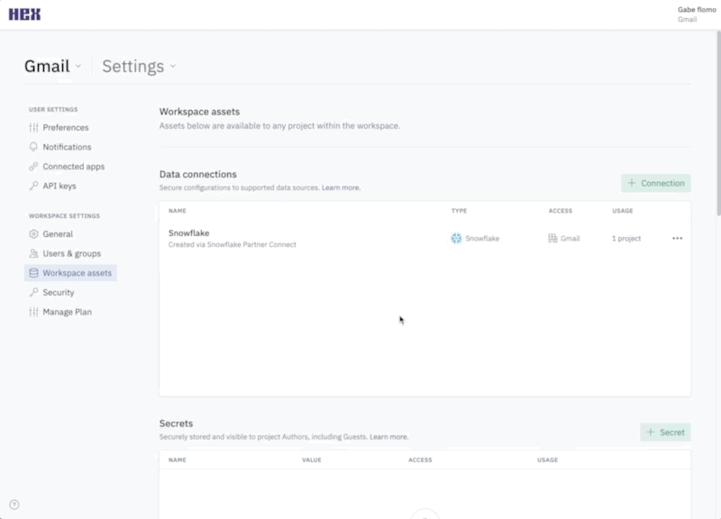
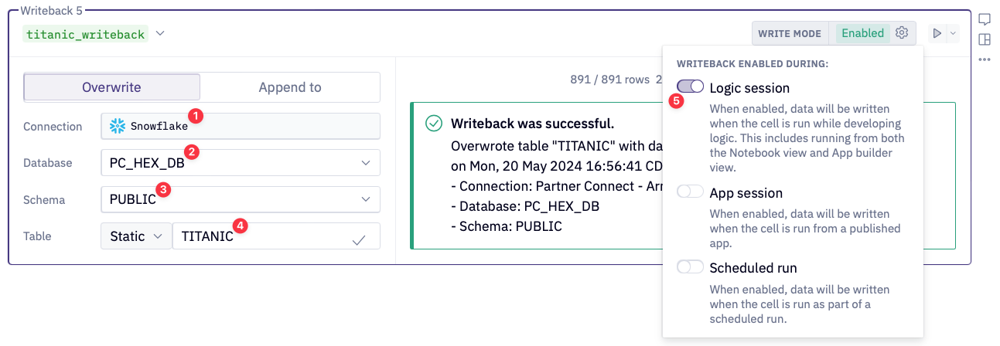
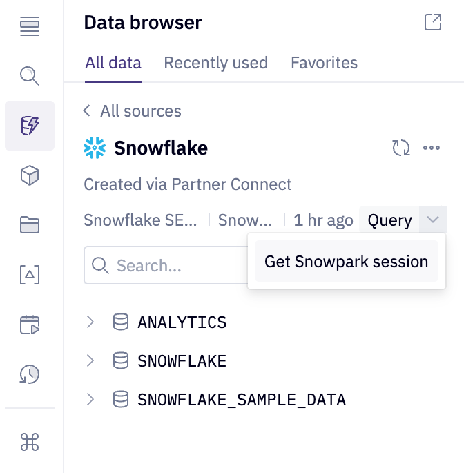
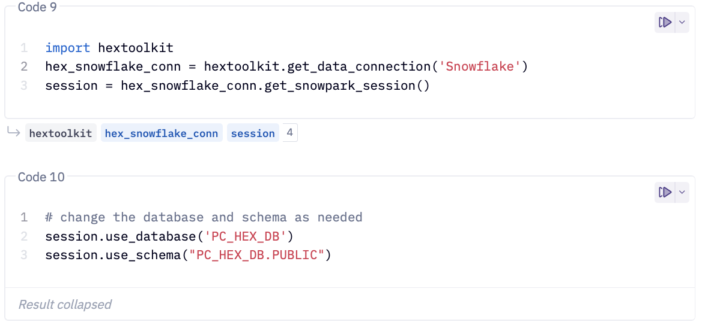

author: Armin Efendic and Chase Romano
id: end-to-end-model-development-with-snowpark-and-hex
categories: snowflake-site:taxonomy/solution-center/certification/quickstart, snowflake-site:taxonomy/solution-center/certification/partner-solution, snowflake-site:taxonomy/product/data-engineering
language: en
summary: Develop ML models end-to-end with Snowpark and Hex for collaborative experimentation and production deployment.
environments: web
status: Published
feedback link: https://github.com/Snowflake-Labs/sfguides/issues


# End to End Model Development with Hex and Snowpark

<!-- ------------------------ -->
## Overview 

In this quickstart, we will be utilizing the classic Titanic dataset to determine if we would survive the infamous maiden voyage. Highlights of the quickstart include, preprocessing, model training, registry, and finally an interactive Hex app for inference. By the end of this lab you will learn how to leverage Snowpark ML, Hex's Snowpark intergration, and Snowflake's Model Registry.

### Prerequisites
- Familiarity with basic Python and SQL 
- Familiarity with training ML models
- Familiarity with data science notebooks
- A [Snowflake](https://signup.snowflake.com/?utm_source=snowflake-devrel&utm_medium=developer-guides&utm_cta=developer-guides) account (if you are using an enterprise account through your organization, it is unlikely that you will have the privileges to use the `ACCOUNTADMIN` role, which is required for this lab).


Head over to the [Snowflake](https://signup.snowflake.com/?utm_source=snowflake-devrel&utm_medium=developer-guides&utm_cta=developer-guides) sign-up page and register for a free account. Once you've registered, you'll get an email that will bring you to Snowflake so that you can sign in.

#### Connecting Snowflake with Hex
If you have an existing Hex account, login in to your account and continue to the **What You Will Learn** section below. 

Otherwise, once you've logged into your Snowflake account, simply navigate to the `Data Products` tab on the left and click `Partner connect`. In the search bar at the top, type in `Hex`, and you should see the Hex partner connect tile appear. Clicking on the tile will bring up a new screen, and all you have to do is to press the `Connect` button in the lower right corner. After this, you'll see a new screen confirming that your account has been created and from here you can click `Activate`.

#### Creating a workspace
Once activated, you'll be brought over to Hex and will be prompted to create/name your new workspace.


#### Workflow roadblocks
The following issues may occur if you have an existing Hex account and you're not an Admin in that org.

**Unauthorized error**
> If you have an existing Hex account that was created with a password and username, you may run into an "Unauthorized" error when activating your workspace in Partner Connect. If this is your experience, head over to [hex.tech](https://hex.tech) and login with your password and username. 

**Plan upgrade**
> If you are an existing Hex user currently on a Community plan, you may encounter an issue that will prevent you from using Partner Connect. If you’re unclear on what Hex plan you are on, feel free to reach out to [support@hex.tech](mailto:support@hex.tech). If you are the Admin of your organization, you can see your plan under Manage plan on the Settings page. To extend a trial, email [support@hex.tech](mailto:support@hex.tech) with the subject "VHOL trial extension."

**Role privileges**
> If you do not have an Editor role or higher, you won't be able to create data connections in your workspace. To upgrade your role, contact your workspace Admin. You can find out who this is by navigating to Settings -> Users & groups within your Hex workspace.

*If you're still encountering issues, or encounter any issues other than the ones listed above, please contact our support team [support@hex.tech](mailto:support@hex.tech) with the subject "VHOL" for priority support.*

<!-- ### Enabling ORGADMIN

We'll revisit your newly created workspace in a bit, but for now, head back over to Snowflake. Let's navigate to the `Admin` tab again but this time select `Users & roles`. From here, you should see 3 users with one of them being named `PC_HEX_USER`. This is the user that was created when you activated Hex with partner connect. We'll need to activate the `ORGADMIN` role for this user. Select `PC_HEX_USER`, and at the bottom of the page you'll see a section to grant new roles.


Click on grant role, which will open a window to grant roles to the `PC_HEX_USER` account. In the `Role to grant` dropdown, you'll see the role `ORGADMIN`. Select this role and then click `Grant`. We will revisit this step in a later section.


 -->

<!-- ### Configuring the Snowflake data connection in Hex
Next, we'll need to tweak the configurations of our data connection a bit. Head over to Hex, click on `Projects` and then navigate to the  `Settings` page. On the left side of the screen, you'll see a section called `Workspace settings` with the subcategory `Workspace assets`, this is where we can edit our data connection settings. 


Inside of the Workspace assets page, you'll see your data connections at the top with a Snowflake data connection created by partner connect. You can configure the connection settings by clicking the 3-dot menu and selecting edit. 



Inside of the data connection configuration page, we'll change 3 things
* Remove `.Snowflakecomputing.com` from the Account name.
* Turn `Proxy` off.
* Enable `Writeback` functionality.

 -->

<!-- ### Accepting Anaconda terms

The last thing we'll want to do is accept the [Anaconda terms and conditions enabled by the ORGADMIN](https://docs.Snowflake.com/en/developer-guide/udf/python/udf-python-packages.html#using-third-party-packages-from-anaconda) role we granted ourselves access to earlier. To do this, navigate back to Snowflake and click on your username in the top left corner. You'll see a section that will allow you to switch to the ORGADMIN role. Once switched over, navigate to the `Admin` tab and select `Billing & Terms`. From here, you will see a section that will allow to accept the anaconda terms and conditions which is required for a later step in our project.

 -->

<!-- ------------------------ -->

### What You Will Learn
* How to perform preprocessing with Snowpark ML
* How to perform model training with Snowpark ML
* How to register the model in Snowflakes Registry
* How models are "deployed" in Snowflake
* How to perform inference using Snowpark and SQL against the registered model

### What You Will Build
In this quickstart, you will create machine learning model using Snowpark ML. This model will be registered to Snowflake's Model Registry and then we will call that model for inference. At the end, we will build a Hex app that calls the newly created model to predict our likelihood of surviving the infamous maiden voyage!
<!-- ------------------------ -->

## Getting Started with Hex

Now we can move back over to Hex and get started on our project. The first thing you'll need to do is transfer the Hex project into your new or existing Hex org.

<button>


[Get Hex project](https://app.hex.tech/hex-public/hex/30a29735-a269-4e41-a6f7-84fb0414124b/draft/logic)


</button>


- Select Get a copy.
- Select your new or existing Hex org. 

Now that you've got your project, you will find yourself in the [Logic view](https://learn.hex.tech/docs/develop-logic/logic-view-overview) of a Hex project. The Logic view is a notebook-like interface made up of cells such as code cells, markdown cells, input parameters and more! On the far left side, you'll see a control panel that will allow you to do things like upload files, import data connections, or search your project. Before we dive into the code, we'll need to import our Snowflake connection to our project.

We can import our Snowflake data connection by heading over to the `Data sources` tab represented by a database icon with a lightning bolt. At the bottom of this section, you'll see a portion that says available workspace connections and you should see one that says Snowflake if you created the Hex account via Partner Connect.


If you had an existing Hex org and did not create one via Partner Connect please follow [Hex documentation](https://learn.hex.tech/docs/connect-to-data/data-connections/data-connections-introduction) on creating a Snowflake connection. 

### Common Problems
If coming from Partner Connect or creating a new database connection, ensure that your database connection has both the Snowpark and Writeback toggle enabled. Navigate to the Settings window and select the desired Snowflake database connection. 


Enable the Snowpark and Writeback toggles.


## Write the data back to Snowflake

Now that you have the Hex project, let's write the data into the imported Snowflake instance. To do this, we'll use one of Hex's utility cells called the [writeback cell](https://learn.hex.tech/docs/logic-cell-types/writeback-cells). What this cell does is exactly what it sounds like, writes data back to a database. 

Using this cell is quite simple. First we'll need choose the source data from the dataframes currently in the project that we want to write back into Snowflake. The dataframe we'll want to write back is our `titanic` dataframe, so we'll choose `titanic` from our list. The next step is to select our Snowflake connection as the warehouse that we want to write the data to. Once complete, we'll choose the database and schema, then we can name our table. For the database, choose `PC_HEX_DB` and use the `PUBLIC` schema. For the table name, use `TITANIC_DATA`.



***NOTE:*** If you did not come from Partner Connect you will not see the `PC_HEX_DB` database and `PUBLIC` schema. You can create or use an existing database and schema. 


## Create a Snowpark Session

Now, we can connect to our Snowflake connection that we imported earlier. To do this head over to the data sources tab on the left control panel to find your Snowflake connection. If you hover your mouse over the connection, you'll see a `query` option appear at the bottom. This will allow us to query this connection in an SQL cell, however, what we want to do is create a Snowpark session using this connection. Click on the dropdown next to the `query` button and select `Get Snowpark session`. What this will do is create a new cell for us with all the code needed to spin up a Snowpark session.


*The cell created by this button will be positioned under the cell that is currently selected. It is best practice to have this new cell be placed right below package import cell.*




Scope the Snowpark session to the appropriate database and schema. If you are using a different database and schema name, please ensure to scope the Snowpark session to the correct database and schema.

```python
session.use_database('PC_HEX_DB')
session.use_schema("PC_HEX_DB.PUBLIC")
```

In this cell, we reference our Snowpark session with the variable `session` which is the name assigned by default. Your cells should look similar to this:



## Hex Project

The rest of the lab can entirely be followed step-by-step from the Hex project. Any subsequent steps and explanation will be found in the Hex project itself.

Key sections of the Hex project include:
- Getting Started
- Data Exploration
- Preprocessing and Feature Engineering
- Model Training
- Registry
- Model Inference via a Hex app


## Sharing our results

Now that we've completed going through our project, we can share this project with others! To do this:
- Head over to the app builder
- A pre-built layout has been designed but feel free to customize and add any additional elements
- To customize add, remove, and arrange cells. Check out the [Hex docs](https://learn.hex.tech/docs/build-apps/app-builder) for more info.
- Publish the app with the [Publish button](https://learn.hex.tech/docs/share-insights/apps/publish-and-share-apps)
- Lastly, hit the share button next to publish, and select `Publish to web`.

## Conclusion and Resources
Congratulations on making it to the end of this Lab! You've successfully perform feature engineering, trained an XGBoost model to predict the probably of survival onboard the Titanic, and logged that model to Snowflake's Model Registy. At the end, you created a Hex app that allowed users to pass in their own criteria to see if they would survive the Titanic.

### What You Learned
* How to perform preprocessing with Snowpark ML
* How to perform model training with Snowpark ML
* How to register the model in Snowflakes Registry
* How models are "deployed" in Snowflake
* How to perform inference using Snowpark and SQL against the registered model
* How to create your own Hex app and share it out to end users

### Related Resources
* [Final Project](https://app.hex.tech/810c3d49-47a5-470c-9eaa-f471548c9620/app/af138a51-cae9-4300-9aee-6805afe6e699/latest)
* [Data Exploration & Analysis using Hex and Snowpark](https://developers.snowflake.com/solution/data-exploration-with-hex-and-snowpark/)
* [Parallelized Time Series Forecasting Of Restaurant Foot Traffic Using Snowpark UDTF](https://developers.snowflake.com/solution/time-series-forecasting-using-snowpark-and-hex/)
* [How To Leverage Libraries Outside of Snowpark ML](https://developers.snowflake.com/solution/optimizing-marketing-budget-using-snowpark-ml-in-hex-notebooks/)
